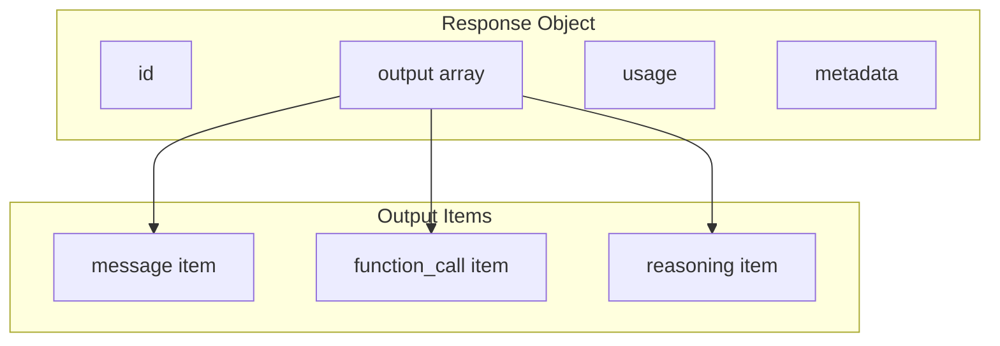

# Response Structure

## Introduction

The Responses API returns a structured response with an output array containing typed items. This lesson covers response parsing, item types, and the convenient `output_text` helper.

### What We'll Cover

- Output array structure
- Item types (message, function_call, reasoning)
- Using `output_text` helper
- Processing streaming responses
- Error handling

### Prerequisites

- Understanding of request structure
- Familiarity with API responses
- Python async basics for streaming

---

## Output Array Structure



### Response Object

```python
from openai import OpenAI
from dataclasses import dataclass
from typing import List, Dict, Any, Optional

client = OpenAI()

response = client.responses.create(
    model="gpt-4o",
    input="What is 2 + 2?"
)

# Response structure
print(f"ID: {response.id}")
print(f"Model: {response.model}")
print(f"Output items: {len(response.output)}")
print(f"Output text: {response.output_text}")
```

**Output:**
```
ID: resp_abc123
Model: gpt-4o-2024-11-20
Output items: 1
Output text: 2 + 2 equals 4.
```

### Full Response Structure

```python
@dataclass
class ResponseAnalysis:
    id: str
    model: str
    output_count: int
    output_types: List[str]
    total_tokens: int
    has_function_calls: bool
    has_reasoning: bool
    output_text: str


def analyze_response(response) -> ResponseAnalysis:
    """Analyze a Responses API response."""
    
    output_types = [item.type for item in response.output]
    
    return ResponseAnalysis(
        id=response.id,
        model=response.model,
        output_count=len(response.output),
        output_types=output_types,
        total_tokens=response.usage.total_tokens,
        has_function_calls="function_call" in output_types,
        has_reasoning="reasoning" in output_types,
        output_text=response.output_text or ""
    )


# Usage
analysis = analyze_response(response)
print(f"Response Analysis:")
print(f"  ID: {analysis.id}")
print(f"  Model: {analysis.model}")
print(f"  Output types: {analysis.output_types}")
print(f"  Total tokens: {analysis.total_tokens}")
```

---

## Item Types

### Message Item

```python
# Standard text response
response = client.responses.create(
    model="gpt-4o",
    input="Explain Python decorators"
)

for item in response.output:
    if item.type == "message":
        print(f"Role: {item.role}")
        print(f"Content: {item.content[:100]}...")
```

### Function Call Item

```python
# Response with function call
tools = [
    {
        "type": "function",
        "name": "get_weather",
        "description": "Get weather for a location",
        "parameters": {
            "type": "object",
            "properties": {
                "location": {"type": "string"}
            },
            "required": ["location"]
        }
    }
]

response = client.responses.create(
    model="gpt-4o",
    input="What's the weather in Tokyo?",
    tools=tools
)

for item in response.output:
    if item.type == "function_call":
        print(f"Function: {item.name}")
        print(f"Call ID: {item.call_id}")
        print(f"Arguments: {item.arguments}")
```

**Output:**
```
Function: get_weather
Call ID: call_abc123
Arguments: {"location": "Tokyo"}
```

### Reasoning Item (o1 Models)

```python
# Reasoning models include reasoning items
response = client.responses.create(
    model="o1",
    input="Solve: If x + 5 = 12, what is x?",
    reasoning={"effort": "medium"}
)

for item in response.output:
    if item.type == "reasoning":
        # Note: reasoning content is encrypted
        print(f"Reasoning tokens: {item.summary.get('tokens', 'N/A')}")
    elif item.type == "message":
        print(f"Answer: {item.content}")
```

---

## Using output_text

### The Convenience Helper

```python
# Chat Completions way (verbose)
chat_response = client.chat.completions.create(
    model="gpt-4o",
    messages=[{"role": "user", "content": "Hello"}]
)
text = chat_response.choices[0].message.content

# Responses API way (simple)
responses_response = client.responses.create(
    model="gpt-4o",
    input="Hello"
)
text = responses_response.output_text

print(text)
```

### When output_text is None

```python
def get_text_safely(response) -> str:
    """Safely get text from response."""
    
    # output_text combines all message content
    if response.output_text:
        return response.output_text
    
    # Manual extraction if needed
    texts = []
    for item in response.output:
        if item.type == "message" and item.content:
            texts.append(item.content)
    
    return "\n".join(texts)


# output_text may be None if only function calls
response = client.responses.create(
    model="gpt-4o",
    input="Get weather in Paris",
    tools=[...],  # Weather tool
    tool_choice="required"  # Force function call
)

# output_text will be None - only function calls
print(f"output_text: {response.output_text}")

# Need to check output items
for item in response.output:
    if item.type == "function_call":
        print(f"Function called: {item.name}")
```

---

## Comparison: Chat Completions vs Responses

### Response Access Patterns

```python
from typing import Optional

# Chat Completions response
def parse_chat_completion(response) -> Optional[str]:
    """Parse Chat Completions response."""
    
    if not response.choices:
        return None
    
    choice = response.choices[0]
    
    # Check finish reason
    if choice.finish_reason == "stop":
        return choice.message.content
    elif choice.finish_reason == "tool_calls":
        # Has function calls
        return None
    elif choice.finish_reason == "length":
        # Truncated
        return choice.message.content
    
    return choice.message.content


# Responses API response
def parse_responses_response(response) -> Optional[str]:
    """Parse Responses API response."""
    
    # Simple case - use helper
    if response.output_text:
        return response.output_text
    
    # Check for specific item types
    for item in response.output:
        if item.type == "message":
            return item.content
    
    return None
```

### Structure Comparison

| Aspect | Chat Completions | Responses API |
|--------|------------------|---------------|
| Text access | `choices[0].message.content` | `output_text` |
| Function calls | `choices[0].message.tool_calls` | `output[].type == "function_call"` |
| Finish reason | `choices[0].finish_reason` | Check item types |
| Multiple outputs | Multiple choices (rare) | Multiple output items |

---

## Processing Multiple Items

### Mixed Output Types

```python
from dataclasses import dataclass
from typing import List, Dict, Any
import json

@dataclass
class ParsedOutput:
    messages: List[str]
    function_calls: List[Dict[str, Any]]
    reasoning_present: bool


def parse_output(response) -> ParsedOutput:
    """Parse all output items from response."""
    
    messages = []
    function_calls = []
    reasoning_present = False
    
    for item in response.output:
        if item.type == "message":
            messages.append(item.content)
        
        elif item.type == "function_call":
            function_calls.append({
                "name": item.name,
                "call_id": item.call_id,
                "arguments": json.loads(item.arguments)
            })
        
        elif item.type == "reasoning":
            reasoning_present = True
    
    return ParsedOutput(
        messages=messages,
        function_calls=function_calls,
        reasoning_present=reasoning_present
    )


# Example with multiple tools
tools = [
    {
        "type": "function",
        "name": "search",
        "description": "Search the web",
        "parameters": {
            "type": "object",
            "properties": {"query": {"type": "string"}},
            "required": ["query"]
        }
    },
    {
        "type": "function",
        "name": "calculate",
        "description": "Perform calculation",
        "parameters": {
            "type": "object",
            "properties": {"expression": {"type": "string"}},
            "required": ["expression"]
        }
    }
]

response = client.responses.create(
    model="gpt-4o",
    input="Search for Python syntax and calculate 15% of 200",
    tools=tools
)

parsed = parse_output(response)
print(f"Messages: {len(parsed.messages)}")
print(f"Function calls: {len(parsed.function_calls)}")
for call in parsed.function_calls:
    print(f"  - {call['name']}: {call['arguments']}")
```

---

## Streaming Response Processing

### Event Types

```python
from typing import Generator, Tuple
from dataclasses import dataclass

@dataclass 
class StreamState:
    text_chunks: List[str]
    function_calls: List[Dict[str, Any]]
    is_complete: bool
    
    @property
    def full_text(self) -> str:
        return "".join(self.text_chunks)


def process_stream(response_stream) -> StreamState:
    """Process streaming response."""
    
    state = StreamState(
        text_chunks=[],
        function_calls=[],
        is_complete=False
    )
    
    current_function_call = {}
    
    for event in response_stream:
        event_type = event.type
        
        # Text delta
        if event_type == "response.output_text.delta":
            state.text_chunks.append(event.delta)
        
        # Function call started
        elif event_type == "response.function_call_arguments.delta":
            if "arguments" not in current_function_call:
                current_function_call["arguments"] = ""
            current_function_call["arguments"] += event.delta
        
        # Function call complete
        elif event_type == "response.output_item.done":
            if event.item.type == "function_call":
                state.function_calls.append({
                    "name": event.item.name,
                    "call_id": event.item.call_id,
                    "arguments": event.item.arguments
                })
                current_function_call = {}
        
        # Response complete
        elif event_type == "response.completed":
            state.is_complete = True
    
    return state


# Usage
response = client.responses.create(
    model="gpt-4o",
    input="Tell me a short joke",
    stream=True
)

state = process_stream(response)
print(f"Complete: {state.is_complete}")
print(f"Text: {state.full_text}")
```

### Real-Time Processing

```python
def stream_with_callback(
    client,
    input_text: str,
    on_text: callable = None,
    on_function: callable = None,
    on_complete: callable = None
):
    """Stream with callbacks for each event type."""
    
    response = client.responses.create(
        model="gpt-4o",
        input=input_text,
        stream=True
    )
    
    full_text = []
    
    for event in response:
        if event.type == "response.output_text.delta":
            chunk = event.delta
            full_text.append(chunk)
            if on_text:
                on_text(chunk)
        
        elif event.type == "response.output_item.done":
            if event.item.type == "function_call" and on_function:
                on_function(event.item)
        
        elif event.type == "response.completed":
            if on_complete:
                on_complete("".join(full_text))


# Usage with callbacks
def print_chunk(chunk):
    print(chunk, end="", flush=True)

def on_done(text):
    print(f"\n\n[Completed: {len(text)} chars]")

stream_with_callback(
    client,
    "Write a haiku about code",
    on_text=print_chunk,
    on_complete=on_done
)
```

---

## Usage Tracking

### Token Usage

```python
@dataclass
class UsageDetails:
    input_tokens: int
    output_tokens: int
    total_tokens: int
    cached_tokens: int
    reasoning_tokens: int
    
    @property
    def cache_hit_rate(self) -> float:
        if self.input_tokens == 0:
            return 0.0
        return self.cached_tokens / self.input_tokens


def extract_usage(response) -> UsageDetails:
    """Extract detailed usage information."""
    
    usage = response.usage
    
    # Input token details
    input_tokens = usage.input_tokens
    cached = getattr(usage, 'input_tokens_details', {})
    cached_tokens = cached.get('cached_tokens', 0) if cached else 0
    
    # Output token details
    output_tokens = usage.output_tokens
    output_details = getattr(usage, 'output_tokens_details', {})
    reasoning_tokens = output_details.get('reasoning_tokens', 0) if output_details else 0
    
    return UsageDetails(
        input_tokens=input_tokens,
        output_tokens=output_tokens,
        total_tokens=usage.total_tokens,
        cached_tokens=cached_tokens,
        reasoning_tokens=reasoning_tokens
    )


# Track usage
response = client.responses.create(
    model="gpt-4o",
    input="Explain quantum computing"
)

usage = extract_usage(response)
print(f"Input tokens: {usage.input_tokens}")
print(f"Output tokens: {usage.output_tokens}")
print(f"Cached tokens: {usage.cached_tokens}")
print(f"Cache hit rate: {usage.cache_hit_rate:.1%}")
```

---

## Error Responses

### Handling Errors

```python
from openai import OpenAIError, RateLimitError, APIError
from typing import Union

@dataclass
class ResponseResult:
    success: bool
    text: Optional[str] = None
    error: Optional[str] = None
    error_type: Optional[str] = None


def safe_create(
    client,
    input_text: str,
    **kwargs
) -> ResponseResult:
    """Create response with error handling."""
    
    try:
        response = client.responses.create(
            model=kwargs.get("model", "gpt-4o"),
            input=input_text,
            **{k: v for k, v in kwargs.items() if k != "model"}
        )
        
        return ResponseResult(
            success=True,
            text=response.output_text
        )
    
    except RateLimitError as e:
        return ResponseResult(
            success=False,
            error=str(e),
            error_type="rate_limit"
        )
    
    except APIError as e:
        return ResponseResult(
            success=False,
            error=str(e),
            error_type="api_error"
        )
    
    except Exception as e:
        return ResponseResult(
            success=False,
            error=str(e),
            error_type="unknown"
        )


# Usage
result = safe_create(client, "Hello world")

if result.success:
    print(f"Response: {result.text}")
else:
    print(f"Error ({result.error_type}): {result.error}")
```

---

## Hands-on Exercise

### Your Task

Build a response processor that handles all output types.

### Requirements

1. Parse messages, function calls, and reasoning
2. Extract usage statistics
3. Handle streaming and non-streaming
4. Provide summary statistics

<details>
<summary>💡 Hints</summary>

- Check item.type for each output
- Use dataclasses for structured data
- Handle None values gracefully
</details>

<details>
<summary>✅ Solution</summary>

```python
from dataclasses import dataclass, field
from typing import List, Dict, Any, Optional
from enum import Enum
import json

class ItemType(Enum):
    MESSAGE = "message"
    FUNCTION_CALL = "function_call"
    REASONING = "reasoning"
    UNKNOWN = "unknown"


@dataclass
class MessageItem:
    role: str
    content: str


@dataclass
class FunctionCallItem:
    name: str
    call_id: str
    arguments: Dict[str, Any]


@dataclass
class ReasoningItem:
    token_count: int
    encrypted: bool


@dataclass
class ProcessedResponse:
    id: str
    model: str
    messages: List[MessageItem]
    function_calls: List[FunctionCallItem]
    reasoning: Optional[ReasoningItem]
    
    # Usage stats
    input_tokens: int
    output_tokens: int
    cached_tokens: int
    
    # Convenience
    output_text: Optional[str]
    
    @property
    def has_function_calls(self) -> bool:
        return len(self.function_calls) > 0
    
    @property
    def has_reasoning(self) -> bool:
        return self.reasoning is not None
    
    @property
    def total_tokens(self) -> int:
        return self.input_tokens + self.output_tokens
    
    def summary(self) -> Dict[str, Any]:
        return {
            "id": self.id,
            "model": self.model,
            "messages": len(self.messages),
            "function_calls": len(self.function_calls),
            "has_reasoning": self.has_reasoning,
            "total_tokens": self.total_tokens,
            "cached_tokens": self.cached_tokens,
            "output_preview": (self.output_text or "")[:100]
        }


class ResponseProcessor:
    """Process Responses API responses."""
    
    def process(self, response) -> ProcessedResponse:
        """Process a complete response."""
        
        messages = []
        function_calls = []
        reasoning = None
        
        for item in response.output:
            item_type = self._get_item_type(item)
            
            if item_type == ItemType.MESSAGE:
                messages.append(MessageItem(
                    role=item.role,
                    content=item.content or ""
                ))
            
            elif item_type == ItemType.FUNCTION_CALL:
                try:
                    args = json.loads(item.arguments)
                except json.JSONDecodeError:
                    args = {"raw": item.arguments}
                
                function_calls.append(FunctionCallItem(
                    name=item.name,
                    call_id=item.call_id,
                    arguments=args
                ))
            
            elif item_type == ItemType.REASONING:
                reasoning = ReasoningItem(
                    token_count=getattr(item, 'token_count', 0),
                    encrypted=True
                )
        
        # Extract usage
        usage = response.usage
        input_tokens = usage.input_tokens
        output_tokens = usage.output_tokens
        
        # Cached tokens from details
        input_details = getattr(usage, 'input_tokens_details', None)
        cached = 0
        if input_details and hasattr(input_details, 'cached_tokens'):
            cached = input_details.cached_tokens
        
        return ProcessedResponse(
            id=response.id,
            model=response.model,
            messages=messages,
            function_calls=function_calls,
            reasoning=reasoning,
            input_tokens=input_tokens,
            output_tokens=output_tokens,
            cached_tokens=cached,
            output_text=response.output_text
        )
    
    def process_stream(self, stream) -> ProcessedResponse:
        """Process a streaming response."""
        
        text_chunks = []
        function_calls = []
        current_func = {}
        final_response = None
        
        for event in stream:
            if event.type == "response.output_text.delta":
                text_chunks.append(event.delta)
            
            elif event.type == "response.function_call_arguments.delta":
                if "args" not in current_func:
                    current_func["args"] = ""
                current_func["args"] += event.delta
            
            elif event.type == "response.output_item.done":
                if event.item.type == "function_call":
                    try:
                        args = json.loads(event.item.arguments)
                    except:
                        args = {}
                    
                    function_calls.append(FunctionCallItem(
                        name=event.item.name,
                        call_id=event.item.call_id,
                        arguments=args
                    ))
                    current_func = {}
            
            elif event.type == "response.completed":
                final_response = event.response
        
        if final_response:
            processed = self.process(final_response)
            # Override with streamed text if available
            if text_chunks:
                processed.output_text = "".join(text_chunks)
            return processed
        
        # Fallback for incomplete streams
        return ProcessedResponse(
            id="stream",
            model="unknown",
            messages=[MessageItem(role="assistant", content="".join(text_chunks))],
            function_calls=function_calls,
            reasoning=None,
            input_tokens=0,
            output_tokens=0,
            cached_tokens=0,
            output_text="".join(text_chunks)
        )
    
    def _get_item_type(self, item) -> ItemType:
        """Get item type safely."""
        
        type_str = getattr(item, 'type', 'unknown')
        
        try:
            return ItemType(type_str)
        except ValueError:
            return ItemType.UNKNOWN


# Usage
processor = ResponseProcessor()

# Non-streaming
response = client.responses.create(
    model="gpt-4o",
    input="What is machine learning?"
)

result = processor.process(response)
print("Response Summary:")
for key, value in result.summary().items():
    print(f"  {key}: {value}")

# With function calls
tools = [{
    "type": "function",
    "name": "calculate",
    "description": "Calculate expression",
    "parameters": {
        "type": "object",
        "properties": {"expr": {"type": "string"}},
        "required": ["expr"]
    }
}]

response = client.responses.create(
    model="gpt-4o",
    input="Calculate 25 * 4",
    tools=tools
)

result = processor.process(response)
if result.has_function_calls:
    print("\nFunction Calls:")
    for fc in result.function_calls:
        print(f"  {fc.name}: {fc.arguments}")

# Streaming
stream = client.responses.create(
    model="gpt-4o",
    input="Write a haiku",
    stream=True
)

result = processor.process_stream(stream)
print(f"\nStreamed: {result.output_text}")
```

</details>

---

## Summary

✅ Output array contains typed items  
✅ `output_text` provides convenient text access  
✅ Function calls have name, call_id, and arguments  
✅ Reasoning items are encrypted on o1 models  
✅ Usage details include cache statistics

**Next:** [Conversation State](./04-conversation-state.md)

---

## Further Reading

- [Response Object Reference](https://platform.openai.com/docs/api-reference/responses/object) — Full structure
- [Streaming Guide](https://platform.openai.com/docs/guides/streaming) — Event handling
- [Usage Tracking](https://platform.openai.com/docs/guides/rate-limits) — Token accounting
