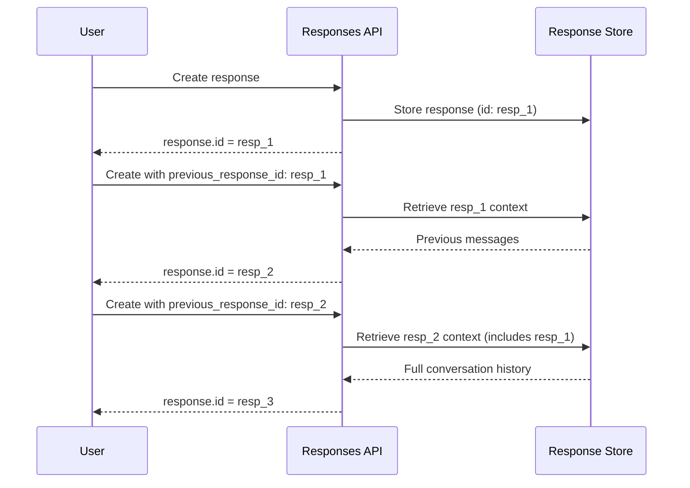

# Conversation State

## Introduction

The Responses API introduces built-in conversation state management through `previous_response_id`. This eliminates manual message history tracking and enables efficient multi-turn conversations.

### What We'll Cover

- The `previous_response_id` parameter
- Automatic context preservation
- Conversations API integration
- Stateful vs stateless patterns
- Cache benefits of chaining

### Prerequisites

- Understanding of request and response structure
- Familiarity with multi-turn conversations
- Python development environment

---

## The previous_response_id Parameter



### Basic Chaining

```python
from openai import OpenAI

client = OpenAI()

# First message
response1 = client.responses.create(
    model="gpt-4o",
    input="My name is Alice. Remember that."
)

print(f"Response 1: {response1.output_text}")
print(f"ID: {response1.id}")

# Chain using previous_response_id
response2 = client.responses.create(
    model="gpt-4o",
    input="What's my name?",
    previous_response_id=response1.id
)

print(f"Response 2: {response2.output_text}")
```

**Output:**
```
Response 1: Hello Alice! I'll remember that. How can I help you today?
ID: resp_67890abcdef
Response 2: Your name is Alice!
```

### Comparison with Chat Completions

```python
from dataclasses import dataclass
from typing import List, Dict, Any

@dataclass
class ConversationTurn:
    user_message: str
    assistant_response: str


# Chat Completions: Manual history management
class ChatCompletionsConversation:
    def __init__(self, client, model: str = "gpt-4o"):
        self.client = client
        self.model = model
        self.messages: List[Dict[str, str]] = []
    
    def send(self, message: str) -> str:
        # Add user message
        self.messages.append({"role": "user", "content": message})
        
        # Make API call with full history
        response = self.client.chat.completions.create(
            model=self.model,
            messages=self.messages
        )
        
        # Extract and store assistant response
        assistant_message = response.choices[0].message.content
        self.messages.append({"role": "assistant", "content": assistant_message})
        
        return assistant_message
    
    @property
    def history_size(self) -> int:
        return len(self.messages)


# Responses API: Automatic history via previous_response_id
class ResponsesAPIConversation:
    def __init__(self, client, model: str = "gpt-4o"):
        self.client = client
        self.model = model
        self.last_response_id: str = None
        self.turn_count: int = 0
    
    def send(self, message: str) -> str:
        # Create request with optional chaining
        kwargs = {
            "model": self.model,
            "input": message
        }
        
        if self.last_response_id:
            kwargs["previous_response_id"] = self.last_response_id
        
        response = self.client.responses.create(**kwargs)
        
        # Store response ID for next turn
        self.last_response_id = response.id
        self.turn_count += 1
        
        return response.output_text
    
    @property
    def history_size(self) -> int:
        return self.turn_count


# Compare approaches
print("Chat Completions approach:")
cc_convo = ChatCompletionsConversation(client)
print(cc_convo.send("I'm learning Python"))
print(cc_convo.send("What should I start with?"))
print(f"Local history: {cc_convo.history_size} messages\n")

print("Responses API approach:")
ra_convo = ResponsesAPIConversation(client)
print(ra_convo.send("I'm learning Python"))
print(ra_convo.send("What should I start with?"))
print(f"No local history needed, {ra_convo.turn_count} turns tracked")
```

---

## Context Preservation

### How Context Flows

```python
from dataclasses import dataclass
from typing import Optional

@dataclass
class ConversationContext:
    response_id: str
    instructions: Optional[str]
    tools: Optional[list]
    metadata: dict


def demonstrate_context_flow(client):
    """Show how context flows through chained responses."""
    
    # Initial response with instructions
    r1 = client.responses.create(
        model="gpt-4o",
        instructions="You are a Python tutor. Be encouraging.",
        input="What is a list?",
        metadata={"user_id": "123", "session": "learning"}
    )
    
    print(f"Turn 1: {r1.output_text[:100]}...")
    
    # Chain - instructions persist automatically
    r2 = client.responses.create(
        model="gpt-4o",
        input="How do I add items?",
        previous_response_id=r1.id
    )
    
    print(f"Turn 2: {r2.output_text[:100]}...")
    
    # Continue chain
    r3 = client.responses.create(
        model="gpt-4o",
        input="Show me an example",
        previous_response_id=r2.id
    )
    
    print(f"Turn 3: {r3.output_text[:100]}...")
    
    return r3.id


final_id = demonstrate_context_flow(client)
print(f"\nConversation chain ID: {final_id}")
```

### What Gets Preserved

| Element | Preserved? | Notes |
|---------|------------|-------|
| Messages | ✅ Yes | Full conversation history |
| Instructions | ✅ Yes | System prompt carries forward |
| Tool definitions | ✅ Yes | Available in chain |
| Function results | ✅ Yes | Part of conversation |
| Metadata | ⚠️ Partial | Can be overridden |
| Model | ❌ No | Must specify each call |
| Temperature | ❌ No | Must specify each call |

### Overriding Context

```python
# Initial with one persona
r1 = client.responses.create(
    model="gpt-4o",
    instructions="You are a formal assistant.",
    input="Hello"
)

# Override instructions in chain
r2 = client.responses.create(
    model="gpt-4o",
    instructions="You are a casual, friendly assistant.",  # Override!
    input="Same question, different style",
    previous_response_id=r1.id
)

print(f"With override: {r2.output_text}")
```

---

## Conversations API Integration

### Listing Responses in Conversation

```python
def get_conversation_history(client, response_id: str) -> list:
    """Retrieve conversation history from a response ID."""
    
    # The Conversations API allows listing related responses
    # Note: This is a conceptual example - check current API docs
    
    history = []
    current_id = response_id
    
    # Walk back through the chain
    while current_id:
        try:
            response = client.responses.retrieve(current_id)
            history.insert(0, {
                "id": response.id,
                "input": "...",  # Would need to extract
                "output": response.output_text
            })
            
            # Get previous response ID if exists
            current_id = getattr(response, 'previous_response_id', None)
        except Exception:
            break
    
    return history


# Usage
# history = get_conversation_history(client, final_response_id)
```

### Branching Conversations

```python
from typing import Dict

class ConversationTree:
    """Manage branching conversation trees."""
    
    def __init__(self, client):
        self.client = client
        self.branches: Dict[str, str] = {}  # name -> response_id
    
    def start(self, name: str, input_text: str, **kwargs) -> str:
        """Start a new conversation branch."""
        
        response = self.client.responses.create(
            model=kwargs.get("model", "gpt-4o"),
            input=input_text,
            **{k: v for k, v in kwargs.items() if k != "model"}
        )
        
        self.branches[name] = response.id
        return response.output_text
    
    def continue_branch(self, name: str, input_text: str, **kwargs) -> str:
        """Continue an existing branch."""
        
        if name not in self.branches:
            raise ValueError(f"Branch '{name}' doesn't exist")
        
        response = self.client.responses.create(
            model=kwargs.get("model", "gpt-4o"),
            input=input_text,
            previous_response_id=self.branches[name],
            **{k: v for k, v in kwargs.items() if k != "model"}
        )
        
        self.branches[name] = response.id
        return response.output_text
    
    def fork(self, from_branch: str, new_branch: str, input_text: str, **kwargs) -> str:
        """Create a new branch from an existing point."""
        
        if from_branch not in self.branches:
            raise ValueError(f"Branch '{from_branch}' doesn't exist")
        
        # Fork uses same previous_response_id but creates new branch
        response = self.client.responses.create(
            model=kwargs.get("model", "gpt-4o"),
            input=input_text,
            previous_response_id=self.branches[from_branch],
            **{k: v for k, v in kwargs.items() if k != "model"}
        )
        
        self.branches[new_branch] = response.id
        return response.output_text


# Usage
tree = ConversationTree(client)

# Start main branch
tree.start("main", "Tell me about Python data types")

# Continue main
tree.continue_branch("main", "Focus on lists")

# Fork to explore dictionaries
tree.fork("main", "dict_branch", "Actually, tell me about dictionaries")

# Continue dict branch
tree.continue_branch("dict_branch", "How do I iterate over them?")

# Main branch is unchanged, can continue separately
tree.continue_branch("main", "How do I sort lists?")
```

---

## Cache Benefits

### Automatic Prefix Caching

```python
from dataclasses import dataclass
from typing import List
import time

@dataclass
class CacheMetrics:
    input_tokens: int
    cached_tokens: int
    cache_hit_rate: float
    latency_ms: float


def measure_cache_benefits(client, conversation_turns: List[str]) -> List[CacheMetrics]:
    """Measure caching across conversation turns."""
    
    metrics = []
    previous_id = None
    
    for turn in conversation_turns:
        start = time.time()
        
        kwargs = {"model": "gpt-4o", "input": turn}
        if previous_id:
            kwargs["previous_response_id"] = previous_id
        
        response = client.responses.create(**kwargs)
        
        latency = (time.time() - start) * 1000
        
        usage = response.usage
        input_tokens = usage.input_tokens
        
        # Get cached tokens from details
        details = getattr(usage, 'input_tokens_details', None)
        cached = details.cached_tokens if details else 0
        
        hit_rate = cached / input_tokens if input_tokens > 0 else 0
        
        metrics.append(CacheMetrics(
            input_tokens=input_tokens,
            cached_tokens=cached,
            cache_hit_rate=hit_rate,
            latency_ms=latency
        ))
        
        previous_id = response.id
    
    return metrics


# Measure
turns = [
    "Explain machine learning",
    "What are the main types?",
    "Focus on supervised learning",
    "Give me an example",
    "What about neural networks?"
]

metrics = measure_cache_benefits(client, turns)

print("Cache Metrics by Turn:")
print("-" * 60)
for i, m in enumerate(metrics, 1):
    print(f"Turn {i}:")
    print(f"  Input tokens: {m.input_tokens}")
    print(f"  Cached: {m.cached_tokens} ({m.cache_hit_rate:.1%})")
    print(f"  Latency: {m.latency_ms:.0f}ms")
```

### Cache Comparison

```python
@dataclass
class CacheComparison:
    approach: str
    total_input_tokens: int
    cached_tokens: int
    billable_tokens: int
    savings_percent: float


def compare_cache_efficiency(
    client,
    messages: List[str]
) -> Dict[str, CacheComparison]:
    """Compare caching between approaches."""
    
    results = {}
    
    # Responses API with chaining
    total_input = 0
    total_cached = 0
    prev_id = None
    
    for msg in messages:
        kwargs = {"model": "gpt-4o", "input": msg}
        if prev_id:
            kwargs["previous_response_id"] = prev_id
        
        response = client.responses.create(**kwargs)
        
        usage = response.usage
        total_input += usage.input_tokens
        
        details = getattr(usage, 'input_tokens_details', None)
        if details:
            total_cached += details.cached_tokens
        
        prev_id = response.id
    
    billable = total_input - (total_cached * 0.5)  # 50% discount on cached
    savings = (total_cached * 0.5) / total_input if total_input > 0 else 0
    
    results["responses_chained"] = CacheComparison(
        approach="Responses API (chained)",
        total_input_tokens=total_input,
        cached_tokens=total_cached,
        billable_tokens=int(billable),
        savings_percent=savings
    )
    
    # Chat Completions (manual history)
    total_input_cc = 0
    history = []
    
    for msg in messages:
        history.append({"role": "user", "content": msg})
        
        response = client.chat.completions.create(
            model="gpt-4o",
            messages=history
        )
        
        total_input_cc += response.usage.prompt_tokens
        
        history.append({
            "role": "assistant",
            "content": response.choices[0].message.content
        })
    
    # Chat Completions has less efficient caching
    # Estimate ~40% cache hit vs ~70% for chained
    estimated_cached = int(total_input_cc * 0.4)
    billable_cc = total_input_cc - (estimated_cached * 0.5)
    savings_cc = (estimated_cached * 0.5) / total_input_cc if total_input_cc > 0 else 0
    
    results["chat_completions"] = CacheComparison(
        approach="Chat Completions",
        total_input_tokens=total_input_cc,
        cached_tokens=estimated_cached,
        billable_tokens=int(billable_cc),
        savings_percent=savings_cc
    )
    
    return results


# Compare
comparison = compare_cache_efficiency(client, turns)

print("\nCache Efficiency Comparison:")
print("=" * 50)
for name, data in comparison.items():
    print(f"\n{data.approach}:")
    print(f"  Total input tokens: {data.total_input_tokens:,}")
    print(f"  Cached tokens: {data.cached_tokens:,}")
    print(f"  Effective billable: {data.billable_tokens:,}")
    print(f"  Savings: {data.savings_percent:.1%}")
```

---

## Stateful vs Stateless Patterns

### When to Use Each

```python
from enum import Enum
from typing import Optional

class ConversationType(Enum):
    STATELESS = "stateless"  # No chaining
    STATEFUL = "stateful"    # With chaining
    HYBRID = "hybrid"        # Selective chaining


def choose_approach(
    needs_context: bool,
    session_duration_minutes: int,
    privacy_sensitive: bool,
    expected_turns: int
) -> ConversationType:
    """Recommend conversation approach based on requirements."""
    
    # Privacy sensitive - don't store
    if privacy_sensitive:
        return ConversationType.STATELESS
    
    # Single turn - no need for state
    if expected_turns <= 1:
        return ConversationType.STATELESS
    
    # Short session with context needs
    if needs_context and session_duration_minutes < 30:
        return ConversationType.STATEFUL
    
    # Long session - hybrid to manage context window
    if session_duration_minutes > 60:
        return ConversationType.HYBRID
    
    return ConversationType.STATEFUL


class HybridConversation:
    """Hybrid approach with periodic context summarization."""
    
    def __init__(self, client, summarize_every: int = 10):
        self.client = client
        self.summarize_every = summarize_every
        self.turn_count = 0
        self.current_response_id: Optional[str] = None
        self.summary: Optional[str] = None
    
    def send(self, message: str) -> str:
        """Send message with hybrid state management."""
        
        self.turn_count += 1
        
        # Check if we need to summarize
        if self.turn_count % self.summarize_every == 0:
            self._summarize_context()
        
        kwargs = {"model": "gpt-4o", "input": message}
        
        if self.current_response_id:
            kwargs["previous_response_id"] = self.current_response_id
        elif self.summary:
            # Start fresh with summary as context
            kwargs["instructions"] = f"Previous context: {self.summary}"
        
        response = self.client.responses.create(**kwargs)
        self.current_response_id = response.id
        
        return response.output_text
    
    def _summarize_context(self):
        """Summarize and reset context."""
        
        if not self.current_response_id:
            return
        
        # Get summary of conversation so far
        summary_response = self.client.responses.create(
            model="gpt-4o",
            input="Summarize our conversation so far in 2-3 sentences.",
            previous_response_id=self.current_response_id
        )
        
        self.summary = summary_response.output_text
        self.current_response_id = None  # Reset chain
        
        print(f"[Context summarized at turn {self.turn_count}]")


# Usage
convo = HybridConversation(client, summarize_every=5)

for i in range(12):
    response = convo.send(f"Question {i + 1}: Tell me about topic {i + 1}")
    print(f"Turn {i + 1}: {response[:50]}...")
```

---

## Hands-on Exercise

### Your Task

Build a conversation manager with branching and merging.

### Requirements

1. Support multiple conversation branches
2. Allow forking from any point
3. Track branch metadata
4. Implement context summarization

<details>
<summary>💡 Hints</summary>

- Use dictionary for branch storage
- Store response IDs for each branch
- Summarize before merging branches
</details>

<details>
<summary>✅ Solution</summary>

```python
from dataclasses import dataclass, field
from typing import Dict, List, Optional
from datetime import datetime
from enum import Enum

class BranchStatus(Enum):
    ACTIVE = "active"
    MERGED = "merged"
    ARCHIVED = "archived"


@dataclass
class Branch:
    name: str
    response_id: str
    parent_branch: Optional[str]
    parent_response_id: Optional[str]
    created_at: datetime
    turn_count: int
    status: BranchStatus
    summary: Optional[str] = None


@dataclass
class ConversationManager:
    """Manage branching conversations with the Responses API."""
    
    client: any
    model: str = "gpt-4o"
    branches: Dict[str, Branch] = field(default_factory=dict)
    
    def create_branch(
        self,
        name: str,
        initial_message: str,
        instructions: Optional[str] = None
    ) -> str:
        """Create a new conversation branch."""
        
        if name in self.branches:
            raise ValueError(f"Branch '{name}' already exists")
        
        kwargs = {
            "model": self.model,
            "input": initial_message
        }
        
        if instructions:
            kwargs["instructions"] = instructions
        
        response = self.client.responses.create(**kwargs)
        
        self.branches[name] = Branch(
            name=name,
            response_id=response.id,
            parent_branch=None,
            parent_response_id=None,
            created_at=datetime.now(),
            turn_count=1,
            status=BranchStatus.ACTIVE
        )
        
        return response.output_text
    
    def continue_branch(
        self,
        name: str,
        message: str
    ) -> str:
        """Continue an existing branch."""
        
        if name not in self.branches:
            raise ValueError(f"Branch '{name}' not found")
        
        branch = self.branches[name]
        
        if branch.status != BranchStatus.ACTIVE:
            raise ValueError(f"Branch '{name}' is {branch.status.value}")
        
        response = self.client.responses.create(
            model=self.model,
            input=message,
            previous_response_id=branch.response_id
        )
        
        branch.response_id = response.id
        branch.turn_count += 1
        
        return response.output_text
    
    def fork_branch(
        self,
        from_branch: str,
        new_branch: str,
        message: str
    ) -> str:
        """Fork a new branch from an existing one."""
        
        if from_branch not in self.branches:
            raise ValueError(f"Source branch '{from_branch}' not found")
        
        if new_branch in self.branches:
            raise ValueError(f"Branch '{new_branch}' already exists")
        
        source = self.branches[from_branch]
        
        response = self.client.responses.create(
            model=self.model,
            input=message,
            previous_response_id=source.response_id
        )
        
        self.branches[new_branch] = Branch(
            name=new_branch,
            response_id=response.id,
            parent_branch=from_branch,
            parent_response_id=source.response_id,
            created_at=datetime.now(),
            turn_count=1,
            status=BranchStatus.ACTIVE
        )
        
        return response.output_text
    
    def summarize_branch(self, name: str) -> str:
        """Get a summary of the branch's conversation."""
        
        if name not in self.branches:
            raise ValueError(f"Branch '{name}' not found")
        
        branch = self.branches[name]
        
        response = self.client.responses.create(
            model=self.model,
            input="Summarize this conversation in 3 bullet points.",
            previous_response_id=branch.response_id
        )
        
        branch.summary = response.output_text
        return response.output_text
    
    def merge_branches(
        self,
        branch_names: List[str],
        target_branch: str,
        merge_message: str
    ) -> str:
        """Merge multiple branches into a new one."""
        
        # Get summaries from all branches
        summaries = []
        for name in branch_names:
            if name not in self.branches:
                raise ValueError(f"Branch '{name}' not found")
            
            branch = self.branches[name]
            
            if not branch.summary:
                self.summarize_branch(name)
            
            summaries.append(f"Branch '{name}':\n{branch.summary}")
            
            # Mark as merged
            branch.status = BranchStatus.MERGED
        
        # Create merge context
        merge_context = "\n\n".join(summaries)
        merge_input = f"Based on these conversation threads:\n\n{merge_context}\n\n{merge_message}"
        
        response = self.client.responses.create(
            model=self.model,
            input=merge_input
        )
        
        self.branches[target_branch] = Branch(
            name=target_branch,
            response_id=response.id,
            parent_branch=None,  # Multiple parents
            parent_response_id=None,
            created_at=datetime.now(),
            turn_count=1,
            status=BranchStatus.ACTIVE,
            summary=None
        )
        
        return response.output_text
    
    def archive_branch(self, name: str):
        """Archive a branch."""
        
        if name not in self.branches:
            raise ValueError(f"Branch '{name}' not found")
        
        self.branches[name].status = BranchStatus.ARCHIVED
    
    def list_branches(self) -> List[Dict]:
        """List all branches with status."""
        
        return [
            {
                "name": b.name,
                "status": b.status.value,
                "turns": b.turn_count,
                "parent": b.parent_branch,
                "created": b.created_at.isoformat()
            }
            for b in self.branches.values()
        ]
    
    def get_active_branches(self) -> List[str]:
        """Get names of active branches."""
        
        return [
            name for name, branch in self.branches.items()
            if branch.status == BranchStatus.ACTIVE
        ]


# Usage example
manager = ConversationManager(client=client)

# Create main branch
manager.create_branch(
    "main",
    "Let's discuss building a web application",
    instructions="You are a senior software architect"
)

# Continue main branch
manager.continue_branch("main", "What tech stack would you recommend?")
manager.continue_branch("main", "Tell me more about the backend options")

# Fork to explore frontend
manager.fork_branch("main", "frontend", "Let's focus on frontend frameworks")
manager.continue_branch("frontend", "Compare React vs Vue")

# Fork to explore database
manager.fork_branch("main", "database", "What about database choices?")
manager.continue_branch("database", "When should I use PostgreSQL?")

# List branches
print("All Branches:")
for branch in manager.list_branches():
    print(f"  {branch['name']}: {branch['status']} ({branch['turns']} turns)")

# Merge branches
result = manager.merge_branches(
    ["frontend", "database"],
    "merged",
    "Synthesize the frontend and database discussions into a cohesive recommendation"
)

print(f"\nMerged Result:\n{result}")
```

</details>

---

## Summary

✅ `previous_response_id` enables automatic conversation chaining  
✅ Context (instructions, tools, history) flows through chains  
✅ Chaining improves cache hit rates (60-80%)  
✅ Branching allows parallel conversation exploration  
✅ Hybrid approaches balance state and efficiency

**Next:** [Agentic Features](./05-agentic-features.md)

---

## Further Reading

- [Conversations Guide](https://platform.openai.com/docs/guides/conversations) — State management
- [Responses API Reference](https://platform.openai.com/docs/api-reference/responses) — Parameter docs
- [Caching Guide](https://platform.openai.com/docs/guides/prompt-caching) — Cache optimization
