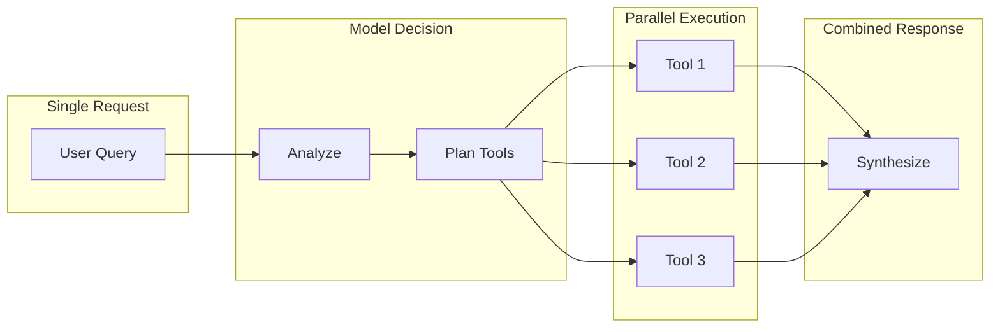

# Agentic Features

## Introduction

The Responses API includes built-in agentic capabilities that simplify building AI agents. This lesson covers multi-tool orchestration, the automatic tool execution loop, native MCP support, and third-party connectors.

### What We'll Cover

- Multi-tool calls per request
- Built-in tool execution loop
- Model Context Protocol (MCP) integration
- Remote connectors for third-party services
- Agent patterns with Responses API

### Prerequisites

- Understanding of function calling
- Familiarity with conversation state
- Python async programming basics

---

## Multi-Tool Orchestration



### Multiple Tools in One Request

```python
from openai import OpenAI
from typing import Dict, Any, List
import json

client = OpenAI()

# Define multiple tools
tools = [
    {
        "type": "function",
        "name": "search_web",
        "description": "Search the web for current information",
        "parameters": {
            "type": "object",
            "properties": {
                "query": {"type": "string", "description": "Search query"}
            },
            "required": ["query"]
        }
    },
    {
        "type": "function",
        "name": "get_weather",
        "description": "Get current weather for a location",
        "parameters": {
            "type": "object",
            "properties": {
                "location": {"type": "string"},
                "unit": {"type": "string", "enum": ["celsius", "fahrenheit"]}
            },
            "required": ["location"]
        }
    },
    {
        "type": "function",
        "name": "calculate",
        "description": "Perform mathematical calculations",
        "parameters": {
            "type": "object",
            "properties": {
                "expression": {"type": "string"}
            },
            "required": ["expression"]
        }
    }
]

# Request that triggers multiple tools
response = client.responses.create(
    model="gpt-4o",
    input="What's the weather in London and New York, and what's the temperature difference?",
    tools=tools
)

# Process all function calls
for item in response.output:
    if item.type == "function_call":
        print(f"Tool: {item.name}")
        print(f"Args: {item.arguments}")
        print()
```

**Output:**
```
Tool: get_weather
Args: {"location": "London", "unit": "celsius"}

Tool: get_weather
Args: {"location": "New York", "unit": "celsius"}

Tool: calculate
Args: {"expression": "temperature_difference"}
```

---

## Built-in Tool Execution Loop

### Automatic vs Manual Loop

```python
from dataclasses import dataclass
from typing import Callable, Dict, Any, Optional

# Tool implementations
def search_web(query: str) -> str:
    return f"Search results for: {query}"

def get_weather(location: str, unit: str = "celsius") -> str:
    # Simulated weather data
    temps = {"London": 15, "New York": 22, "Tokyo": 28}
    temp = temps.get(location, 20)
    return f"{location}: {temp}°{'C' if unit == 'celsius' else 'F'}"

def calculate(expression: str) -> str:
    try:
        result = eval(expression)
        return str(result)
    except:
        return "Error in calculation"


TOOL_FUNCTIONS: Dict[str, Callable] = {
    "search_web": search_web,
    "get_weather": get_weather,
    "calculate": calculate
}


# Manual tool loop (Chat Completions style)
def manual_tool_loop(client, input_text: str, tools: list, max_iterations: int = 5):
    """Manual tool execution loop."""
    
    messages = [{"role": "user", "content": input_text}]
    
    for i in range(max_iterations):
        response = client.chat.completions.create(
            model="gpt-4o",
            messages=messages,
            tools=[{"type": "function", "function": t} for t in tools]
        )
        
        message = response.choices[0].message
        
        # Check for tool calls
        if not message.tool_calls:
            return message.content
        
        # Execute tools
        messages.append(message)
        
        for tool_call in message.tool_calls:
            func_name = tool_call.function.name
            args = json.loads(tool_call.function.arguments)
            
            # Execute function
            result = TOOL_FUNCTIONS[func_name](**args)
            
            messages.append({
                "role": "tool",
                "tool_call_id": tool_call.id,
                "content": result
            })
    
    return "Max iterations reached"


# Responses API with built-in loop (when supported)
def responses_tool_loop(client, input_text: str, tools: list):
    """Responses API handles tool loop automatically."""
    
    # The API can be configured to execute tools automatically
    # when tool implementations are provided or via MCP
    
    response = client.responses.create(
        model="gpt-4o",
        input=input_text,
        tools=tools,
        tool_choice="auto"
    )
    
    # Check if we need to provide tool results
    function_calls = [
        item for item in response.output 
        if item.type == "function_call"
    ]
    
    if not function_calls:
        return response.output_text
    
    # Execute and continue
    tool_results = []
    for call in function_calls:
        args = json.loads(call.arguments)
        result = TOOL_FUNCTIONS[call.name](**args)
        tool_results.append({
            "type": "function_call_output",
            "call_id": call.call_id,
            "output": result
        })
    
    # Continue with results
    final = client.responses.create(
        model="gpt-4o",
        input=tool_results,
        previous_response_id=response.id
    )
    
    return final.output_text
```

### Agent Loop Pattern

```python
from dataclasses import dataclass
from typing import List, Dict, Any, Optional
from enum import Enum

class AgentState(Enum):
    THINKING = "thinking"
    EXECUTING = "executing"
    RESPONDING = "responding"
    COMPLETE = "complete"


@dataclass
class AgentStep:
    state: AgentState
    action: Optional[str]
    result: Optional[str]


class ResponsesAgent:
    """Agent using Responses API with tool loop."""
    
    def __init__(self, client, model: str = "gpt-4o"):
        self.client = client
        self.model = model
        self.tools: List[Dict] = []
        self.tool_handlers: Dict[str, Callable] = {}
        self.max_iterations = 10
    
    def add_tool(
        self,
        name: str,
        description: str,
        parameters: Dict[str, Any],
        handler: Callable
    ):
        """Register a tool with its handler."""
        
        self.tools.append({
            "type": "function",
            "name": name,
            "description": description,
            "parameters": parameters
        })
        self.tool_handlers[name] = handler
    
    def run(self, query: str, instructions: Optional[str] = None) -> str:
        """Execute agent loop."""
        
        steps: List[AgentStep] = []
        previous_id = None
        
        for i in range(self.max_iterations):
            # Build request
            kwargs = {
                "model": self.model,
                "input": query if i == 0 else [],
                "tools": self.tools,
                "tool_choice": "auto"
            }
            
            if instructions and i == 0:
                kwargs["instructions"] = instructions
            
            if previous_id:
                kwargs["previous_response_id"] = previous_id
            
            response = self.client.responses.create(**kwargs)
            previous_id = response.id
            
            # Check for function calls
            function_calls = [
                item for item in response.output
                if item.type == "function_call"
            ]
            
            if not function_calls:
                # No more tool calls - we're done
                steps.append(AgentStep(
                    state=AgentState.COMPLETE,
                    action=None,
                    result=response.output_text
                ))
                return response.output_text
            
            # Execute tools
            steps.append(AgentStep(
                state=AgentState.EXECUTING,
                action=f"Calling {len(function_calls)} tools",
                result=None
            ))
            
            tool_outputs = []
            for call in function_calls:
                handler = self.tool_handlers.get(call.name)
                if handler:
                    args = json.loads(call.arguments)
                    result = handler(**args)
                    
                    tool_outputs.append({
                        "type": "function_call_output",
                        "call_id": call.call_id,
                        "output": str(result)
                    })
            
            # Continue with tool results
            kwargs = {
                "model": self.model,
                "input": tool_outputs,
                "previous_response_id": previous_id
            }
            
            response = self.client.responses.create(**kwargs)
            previous_id = response.id
        
        return "Max iterations reached"


# Usage
agent = ResponsesAgent(client)

agent.add_tool(
    name="search",
    description="Search for information",
    parameters={
        "type": "object",
        "properties": {"query": {"type": "string"}},
        "required": ["query"]
    },
    handler=lambda query: f"Results for: {query}"
)

agent.add_tool(
    name="calculate",
    description="Do math",
    parameters={
        "type": "object",
        "properties": {"expr": {"type": "string"}},
        "required": ["expr"]
    },
    handler=lambda expr: str(eval(expr))
)

result = agent.run(
    "What is 25 * 4 and search for Python tutorials",
    instructions="You are a helpful assistant with access to tools"
)

print(result)
```

---

## MCP Integration

### Native MCP Server Support

```python
from dataclasses import dataclass
from typing import List, Dict, Any, Optional

@dataclass
class MCPServer:
    name: str
    url: str
    api_key: Optional[str] = None


# Configure MCP servers in the request
def create_with_mcp(
    client,
    input_text: str,
    mcp_servers: List[MCPServer]
):
    """Create response with MCP server tools."""
    
    # MCP server configuration
    mcp_config = [
        {
            "type": "mcp",
            "server_label": server.name,
            "server_url": server.url,
            "allowed_tools": ["*"],  # Allow all tools from this server
            **({"api_key": server.api_key} if server.api_key else {})
        }
        for server in mcp_servers
    ]
    
    response = client.responses.create(
        model="gpt-4o",
        input=input_text,
        tools=mcp_config
    )
    
    return response


# Example MCP servers
mcp_servers = [
    MCPServer(
        name="filesystem",
        url="http://localhost:3000/mcp"
    ),
    MCPServer(
        name="database",
        url="http://localhost:3001/mcp",
        api_key="secret"
    )
]

# The model can now use tools from MCP servers
# response = create_with_mcp(client, "List files in /home", mcp_servers)
```

### MCP Tool Discovery

```python
from typing import Protocol, List, Dict, Any

class MCPClient(Protocol):
    """MCP client interface."""
    
    def list_tools(self) -> List[Dict[str, Any]]:
        """List available tools from the server."""
        ...
    
    def call_tool(self, name: str, arguments: Dict[str, Any]) -> Any:
        """Call a tool on the server."""
        ...


@dataclass
class MCPTool:
    name: str
    description: str
    input_schema: Dict[str, Any]
    server: str


class MCPToolRegistry:
    """Registry for MCP tools from multiple servers."""
    
    def __init__(self):
        self.tools: Dict[str, MCPTool] = {}
        self.servers: Dict[str, MCPClient] = {}
    
    def register_server(self, name: str, client: MCPClient):
        """Register an MCP server and discover its tools."""
        
        self.servers[name] = client
        
        # Discover tools
        for tool in client.list_tools():
            tool_id = f"{name}:{tool['name']}"
            self.tools[tool_id] = MCPTool(
                name=tool['name'],
                description=tool.get('description', ''),
                input_schema=tool.get('inputSchema', {}),
                server=name
            )
    
    def get_openai_tools(self) -> List[Dict[str, Any]]:
        """Convert MCP tools to OpenAI format."""
        
        return [
            {
                "type": "function",
                "name": f"{tool.server}__{tool.name}",  # Namespace by server
                "description": f"[{tool.server}] {tool.description}",
                "parameters": tool.input_schema
            }
            for tool in self.tools.values()
        ]
    
    def execute(self, tool_name: str, arguments: Dict[str, Any]) -> Any:
        """Execute a tool by namespaced name."""
        
        # Parse server__name format
        parts = tool_name.split("__", 1)
        if len(parts) != 2:
            raise ValueError(f"Invalid tool name: {tool_name}")
        
        server_name, name = parts
        
        if server_name not in self.servers:
            raise ValueError(f"Unknown server: {server_name}")
        
        return self.servers[server_name].call_tool(name, arguments)


# Usage with Responses API
def create_mcp_agent(client, registry: MCPToolRegistry):
    """Create agent with MCP tools."""
    
    tools = registry.get_openai_tools()
    
    def run(query: str) -> str:
        response = client.responses.create(
            model="gpt-4o",
            input=query,
            tools=tools
        )
        
        # Handle function calls
        for item in response.output:
            if item.type == "function_call":
                result = registry.execute(
                    item.name,
                    json.loads(item.arguments)
                )
                # Continue conversation with result...
        
        return response.output_text
    
    return run
```

---

## Remote Connectors

### Third-Party Service Integration

```python
from dataclasses import dataclass
from typing import Dict, Any, Optional, List
from enum import Enum

class ConnectorType(Enum):
    SLACK = "slack"
    GITHUB = "github"
    JIRA = "jira"
    SALESFORCE = "salesforce"
    CUSTOM = "custom"


@dataclass
class Connector:
    type: ConnectorType
    name: str
    config: Dict[str, Any]


def create_connector_tools(connectors: List[Connector]) -> List[Dict[str, Any]]:
    """Create tool definitions for connectors."""
    
    tools = []
    
    for conn in connectors:
        if conn.type == ConnectorType.SLACK:
            tools.extend([
                {
                    "type": "function",
                    "name": f"{conn.name}_send_message",
                    "description": f"Send a message via {conn.name} Slack",
                    "parameters": {
                        "type": "object",
                        "properties": {
                            "channel": {"type": "string"},
                            "message": {"type": "string"}
                        },
                        "required": ["channel", "message"]
                    }
                },
                {
                    "type": "function",
                    "name": f"{conn.name}_search_messages",
                    "description": f"Search messages in {conn.name} Slack",
                    "parameters": {
                        "type": "object",
                        "properties": {
                            "query": {"type": "string"},
                            "limit": {"type": "integer", "default": 10}
                        },
                        "required": ["query"]
                    }
                }
            ])
        
        elif conn.type == ConnectorType.GITHUB:
            tools.extend([
                {
                    "type": "function",
                    "name": f"{conn.name}_search_code",
                    "description": f"Search code in {conn.name} GitHub",
                    "parameters": {
                        "type": "object",
                        "properties": {
                            "query": {"type": "string"},
                            "repo": {"type": "string"}
                        },
                        "required": ["query"]
                    }
                },
                {
                    "type": "function",
                    "name": f"{conn.name}_create_issue",
                    "description": f"Create issue in {conn.name} GitHub",
                    "parameters": {
                        "type": "object",
                        "properties": {
                            "repo": {"type": "string"},
                            "title": {"type": "string"},
                            "body": {"type": "string"}
                        },
                        "required": ["repo", "title"]
                    }
                }
            ])
    
    return tools


# Usage
connectors = [
    Connector(
        type=ConnectorType.SLACK,
        name="company_slack",
        config={"workspace": "acme", "token": "..."}
    ),
    Connector(
        type=ConnectorType.GITHUB,
        name="work_github",
        config={"org": "acme-inc", "token": "..."}
    )
]

tools = create_connector_tools(connectors)

response = client.responses.create(
    model="gpt-4o",
    input="Search for authentication code in our GitHub and share findings in #dev Slack",
    tools=tools
)
```

### Web Search Integration

```python
# Built-in web search tool (conceptual - check current API)
response = client.responses.create(
    model="gpt-4o",
    input="What are the latest Python 3.13 features?",
    tools=[
        {
            "type": "web_search",
            "search_context_size": "medium"  # low, medium, high
        }
    ]
)

# The model can search the web and incorporate results
print(response.output_text)
```

---

## Agent Patterns

### ReAct Pattern

```python
from dataclasses import dataclass
from typing import List, Optional
from enum import Enum

class ThoughtType(Enum):
    REASONING = "reasoning"
    ACTION = "action"
    OBSERVATION = "observation"


@dataclass
class ReActStep:
    type: ThoughtType
    content: str


class ReActAgent:
    """ReAct agent using Responses API."""
    
    def __init__(self, client, model: str = "gpt-4o"):
        self.client = client
        self.model = model
        self.tools: List[Dict] = []
        self.handlers: Dict[str, Callable] = {}
    
    def add_tool(self, name: str, description: str, params: Dict, handler: Callable):
        self.tools.append({
            "type": "function",
            "name": name,
            "description": description,
            "parameters": params
        })
        self.handlers[name] = handler
    
    def run(self, goal: str, max_steps: int = 10) -> List[ReActStep]:
        """Execute ReAct loop."""
        
        steps = []
        previous_id = None
        
        instructions = """You are a ReAct agent. For each step:
        1. THINK: Reason about what to do next
        2. ACT: Use a tool if needed
        3. OBSERVE: Analyze the result
        Continue until the goal is achieved."""
        
        current_input = f"Goal: {goal}\n\nBegin reasoning."
        
        for i in range(max_steps):
            response = self.client.responses.create(
                model=self.model,
                instructions=instructions if i == 0 else None,
                input=current_input if i == 0 else current_input,
                tools=self.tools,
                previous_response_id=previous_id
            )
            
            previous_id = response.id
            
            # Check for tool calls
            function_calls = [
                item for item in response.output
                if item.type == "function_call"
            ]
            
            if function_calls:
                # Action step
                for call in function_calls:
                    steps.append(ReActStep(
                        type=ThoughtType.ACTION,
                        content=f"{call.name}({call.arguments})"
                    ))
                    
                    # Execute
                    args = json.loads(call.arguments)
                    result = self.handlers[call.name](**args)
                    
                    steps.append(ReActStep(
                        type=ThoughtType.OBSERVATION,
                        content=str(result)
                    ))
                
                # Continue with observations
                current_input = [
                    {
                        "type": "function_call_output",
                        "call_id": call.call_id,
                        "output": str(self.handlers[call.name](
                            **json.loads(call.arguments)
                        ))
                    }
                    for call in function_calls
                ]
            else:
                # Reasoning/final answer
                if response.output_text:
                    steps.append(ReActStep(
                        type=ThoughtType.REASONING,
                        content=response.output_text
                    ))
                
                # Check if goal achieved
                if "goal achieved" in response.output_text.lower() or \
                   "final answer" in response.output_text.lower():
                    break
                
                current_input = "Continue reasoning toward the goal."
        
        return steps


# Usage
react_agent = ReActAgent(client)

react_agent.add_tool(
    name="lookup",
    description="Look up information",
    params={
        "type": "object",
        "properties": {"topic": {"type": "string"}},
        "required": ["topic"]
    },
    handler=lambda topic: f"Information about {topic}: ..."
)

steps = react_agent.run("Find information about Python async programming")

for step in steps:
    print(f"[{step.type.value}] {step.content[:100]}...")
```

### Planning Agent

```python
@dataclass
class Plan:
    steps: List[str]
    current_step: int = 0
    
    @property
    def current(self) -> Optional[str]:
        if self.current_step < len(self.steps):
            return self.steps[self.current_step]
        return None
    
    def advance(self):
        self.current_step += 1
    
    @property
    def complete(self) -> bool:
        return self.current_step >= len(self.steps)


class PlanningAgent:
    """Agent that creates and executes plans."""
    
    def __init__(self, client, model: str = "gpt-4o"):
        self.client = client
        self.model = model
        self.tools: List[Dict] = []
        self.handlers: Dict[str, Callable] = {}
    
    def add_tool(self, name: str, description: str, params: Dict, handler: Callable):
        self.tools.append({
            "type": "function",
            "name": name,
            "description": description,
            "parameters": params
        })
        self.handlers[name] = handler
    
    def create_plan(self, goal: str) -> Plan:
        """Create a plan for achieving the goal."""
        
        response = self.client.responses.create(
            model=self.model,
            instructions="Create a numbered step-by-step plan. Each step should be actionable.",
            input=f"Create a plan to: {goal}\n\nAvailable tools: {[t['name'] for t in self.tools]}"
        )
        
        # Parse steps from response
        lines = response.output_text.strip().split("\n")
        steps = [
            line.strip().lstrip("0123456789.-) ")
            for line in lines
            if line.strip() and line.strip()[0].isdigit()
        ]
        
        return Plan(steps=steps)
    
    def execute_step(self, step: str, previous_id: Optional[str] = None) -> tuple:
        """Execute a single plan step."""
        
        response = self.client.responses.create(
            model=self.model,
            instructions="Execute the given step using available tools.",
            input=f"Execute: {step}",
            tools=self.tools,
            previous_response_id=previous_id
        )
        
        # Handle any tool calls
        for item in response.output:
            if item.type == "function_call":
                args = json.loads(item.arguments)
                result = self.handlers[item.name](**args)
                
                # Continue with result
                final = self.client.responses.create(
                    model=self.model,
                    input=[{
                        "type": "function_call_output",
                        "call_id": item.call_id,
                        "output": str(result)
                    }],
                    previous_response_id=response.id
                )
                
                return final.output_text, final.id
        
        return response.output_text, response.id
    
    def run(self, goal: str) -> str:
        """Plan and execute."""
        
        plan = self.create_plan(goal)
        print(f"Plan: {len(plan.steps)} steps")
        
        results = []
        previous_id = None
        
        while not plan.complete:
            step = plan.current
            print(f"Step {plan.current_step + 1}: {step}")
            
            result, previous_id = self.execute_step(step, previous_id)
            results.append(result)
            
            plan.advance()
        
        return "\n".join(results)
```

---

## Hands-on Exercise

### Your Task

Build an agent that uses multiple tools with the Responses API.

### Requirements

1. Define at least 3 tools
2. Implement automatic tool execution loop
3. Handle multi-tool responses
4. Track execution history

<details>
<summary>💡 Hints</summary>

- Check item.type for function_call
- Use previous_response_id for chaining
- Store tool results for context
</details>

<details>
<summary>✅ Solution</summary>

```python
from dataclasses import dataclass, field
from typing import Dict, Any, List, Callable, Optional
from datetime import datetime
import json

@dataclass
class ToolExecution:
    tool_name: str
    arguments: Dict[str, Any]
    result: Any
    timestamp: datetime


@dataclass
class AgentRun:
    query: str
    executions: List[ToolExecution] = field(default_factory=list)
    final_response: Optional[str] = None
    iterations: int = 0
    
    def add_execution(self, name: str, args: Dict, result: Any):
        self.executions.append(ToolExecution(
            tool_name=name,
            arguments=args,
            result=result,
            timestamp=datetime.now()
        ))


class MultiToolAgent:
    """Agent with multi-tool support using Responses API."""
    
    def __init__(self, client, model: str = "gpt-4o"):
        self.client = client
        self.model = model
        self.tools: List[Dict[str, Any]] = []
        self.handlers: Dict[str, Callable] = {}
        self.max_iterations = 10
        self.runs: List[AgentRun] = []
    
    def register_tool(
        self,
        name: str,
        description: str,
        parameters: Dict[str, Any],
        handler: Callable
    ):
        """Register a tool with handler."""
        
        self.tools.append({
            "type": "function",
            "name": name,
            "description": description,
            "parameters": parameters
        })
        self.handlers[name] = handler
    
    def _execute_tools(
        self,
        function_calls: list,
        run: AgentRun
    ) -> List[Dict[str, Any]]:
        """Execute all function calls and return results."""
        
        results = []
        
        for call in function_calls:
            handler = self.handlers.get(call.name)
            
            if not handler:
                result = f"Error: Unknown tool {call.name}"
            else:
                try:
                    args = json.loads(call.arguments)
                    result = handler(**args)
                except Exception as e:
                    result = f"Error: {e}"
            
            run.add_execution(call.name, args, result)
            
            results.append({
                "type": "function_call_output",
                "call_id": call.call_id,
                "output": str(result)
            })
        
        return results
    
    def run(
        self,
        query: str,
        instructions: Optional[str] = None
    ) -> AgentRun:
        """Execute agent with multi-tool support."""
        
        run = AgentRun(query=query)
        previous_id = None
        
        for i in range(self.max_iterations):
            run.iterations = i + 1
            
            # Build request
            kwargs = {
                "model": self.model,
                "tools": self.tools,
                "tool_choice": "auto"
            }
            
            if i == 0:
                kwargs["input"] = query
                if instructions:
                    kwargs["instructions"] = instructions
            
            if previous_id:
                kwargs["previous_response_id"] = previous_id
            
            response = self.client.responses.create(**kwargs)
            previous_id = response.id
            
            # Check for function calls
            function_calls = [
                item for item in response.output
                if item.type == "function_call"
            ]
            
            if not function_calls:
                # No more tool calls - done
                run.final_response = response.output_text
                break
            
            # Execute all tools
            tool_outputs = self._execute_tools(function_calls, run)
            
            # Send results back
            response = self.client.responses.create(
                model=self.model,
                input=tool_outputs,
                previous_response_id=previous_id
            )
            previous_id = response.id
            
            # Check if complete after tool results
            more_calls = [
                item for item in response.output
                if item.type == "function_call"
            ]
            
            if not more_calls:
                run.final_response = response.output_text
                break
        
        self.runs.append(run)
        return run
    
    def get_history(self) -> List[Dict[str, Any]]:
        """Get execution history."""
        
        return [
            {
                "query": run.query,
                "iterations": run.iterations,
                "tools_used": [e.tool_name for e in run.executions],
                "response_preview": run.final_response[:100] if run.final_response else None
            }
            for run in self.runs
        ]


# Create and configure agent
agent = MultiToolAgent(client)

# Register tools
agent.register_tool(
    name="search_database",
    description="Search the product database",
    parameters={
        "type": "object",
        "properties": {
            "query": {"type": "string", "description": "Search query"},
            "category": {"type": "string", "description": "Product category"}
        },
        "required": ["query"]
    },
    handler=lambda query, category=None: f"Found 5 products matching '{query}'" + (f" in {category}" if category else "")
)

agent.register_tool(
    name="get_price",
    description="Get price for a product",
    parameters={
        "type": "object",
        "properties": {
            "product_id": {"type": "string"}
        },
        "required": ["product_id"]
    },
    handler=lambda product_id: f"Product {product_id}: $99.99"
)

agent.register_tool(
    name="check_inventory",
    description="Check inventory levels",
    parameters={
        "type": "object",
        "properties": {
            "product_id": {"type": "string"},
            "warehouse": {"type": "string"}
        },
        "required": ["product_id"]
    },
    handler=lambda product_id, warehouse=None: f"Product {product_id}: 42 in stock" + (f" at {warehouse}" if warehouse else "")
)

agent.register_tool(
    name="calculate_discount",
    description="Calculate discount for an order",
    parameters={
        "type": "object",
        "properties": {
            "amount": {"type": "number"},
            "code": {"type": "string"}
        },
        "required": ["amount"]
    },
    handler=lambda amount, code=None: f"Discount: ${amount * 0.1:.2f}" if code else "No discount applicable"
)

# Run agent
result = agent.run(
    query="Find laptops, check the price and inventory for the first result, then calculate a 10% discount",
    instructions="You are a helpful shopping assistant. Use tools to help customers."
)

print(f"Query: {result.query}")
print(f"Iterations: {result.iterations}")
print(f"Tools executed: {len(result.executions)}")
for exec in result.executions:
    print(f"  - {exec.tool_name}: {exec.result}")
print(f"\nFinal response:\n{result.final_response}")

# View history
print("\nAgent History:")
for entry in agent.get_history():
    print(f"  Query: {entry['query'][:50]}...")
    print(f"  Tools: {entry['tools_used']}")
```

</details>

---

## Summary

✅ Responses API supports multiple tool calls per request  
✅ Built-in loop handles tool execution automatically  
✅ Native MCP integration for external tool servers  
✅ Connectors enable third-party service access  
✅ ReAct and planning patterns work well with chaining

**Next:** [Data Storage](./06-data-storage.md)

---

## Further Reading

- [Function Calling Guide](https://platform.openai.com/docs/guides/function-calling) — Tool patterns
- [MCP Specification](https://modelcontextprotocol.io/) — Protocol details
- [Agents Guide](https://platform.openai.com/docs/guides/agents) — Agent patterns
