# Data Storage

## Introduction

The Responses API introduces the `store` parameter that controls whether responses are persisted. This lesson covers storage behavior, zero data retention (ZDR), compliance considerations, and retention policies.

### What We'll Cover

- The `store` parameter
- Default storage behavior (2025+)
- Zero Data Retention (ZDR) mode
- Compliance and privacy considerations
- Encrypted reasoning items

### Prerequisites

- Understanding of Responses API basics
- Familiarity with data privacy concepts
- Knowledge of regulatory requirements

---

## The Store Parameter

```mermaid
flowchart TD
    subgraph Request["API Request"]
        S1["store: true (default)"]
        S2["store: false"]
    end
    
    subgraph Storage["OpenAI Storage"]
        P1[Response Persisted]
        P2[No Storage]
    end
    
    subgraph Features["Available Features"]
        F1[previous_response_id ✓]
        F2[Conversations API ✓]
        F3[Dashboard history ✓]
        F4[None]
    end
    
    S1 --> P1 --> F1 & F2 & F3
    S2 --> P2 --> F4
```



### Basic Usage

```python
from openai import OpenAI

client = OpenAI()

# Default: store=True (responses are persisted)
stored_response = client.responses.create(
    model="gpt-4o",
    input="What is Python?"
    # store=True is the default
)

print(f"Stored response ID: {stored_response.id}")

# This response can be chained
follow_up = client.responses.create(
    model="gpt-4o",
    input="Tell me more",
    previous_response_id=stored_response.id  # Works!
)

# Opt-out of storage
ephemeral_response = client.responses.create(
    model="gpt-4o",
    input="Process this sensitive data",
    store=False
)

# Cannot chain - not stored
# This will fail:
# client.responses.create(
#     input="Follow up",
#     previous_response_id=ephemeral_response.id  # Error!
# )
```

### Storage Comparison

| Feature | `store=True` | `store=False` |
|---------|--------------|---------------|
| Response persistence | ✅ 30 days | ❌ None |
| `previous_response_id` | ✅ Works | ❌ Fails |
| Conversations API | ✅ Available | ❌ N/A |
| Dashboard history | ✅ Visible | ❌ Not shown |
| API retrieval | ✅ `responses.retrieve()` | ❌ N/A |
| Token for training | Per policy | ❌ Never |

---

## Default Storage Behavior

### 2025+ Defaults

```python
from dataclasses import dataclass
from typing import Optional
from datetime import datetime, timedelta

@dataclass
class StoragePolicy:
    stored: bool
    retention_days: int
    trainable: bool
    retrievable: bool


def get_storage_policy(
    store: Optional[bool] = None,
    organization_zdr: bool = False
) -> StoragePolicy:
    """Determine storage policy based on parameters."""
    
    # Organization-level ZDR overrides everything
    if organization_zdr:
        return StoragePolicy(
            stored=False,
            retention_days=0,
            trainable=False,
            retrievable=False
        )
    
    # Explicit store=False
    if store is False:
        return StoragePolicy(
            stored=False,
            retention_days=0,
            trainable=False,
            retrievable=False
        )
    
    # Default (store=True or not specified)
    return StoragePolicy(
        stored=True,
        retention_days=30,
        trainable=False,  # API data not used for training by default
        retrievable=True
    )


# Check policy
policy = get_storage_policy(store=True)
print(f"Stored: {policy.stored}")
print(f"Retention: {policy.retention_days} days")
print(f"Retrievable: {policy.retrievable}")
```

### Retention Timeline

```python
from datetime import datetime, timedelta

def calculate_retention(
    response_id: str,
    created_at: datetime,
    retention_days: int = 30
) -> dict:
    """Calculate retention details for a response."""
    
    expiry = created_at + timedelta(days=retention_days)
    now = datetime.now()
    
    days_until_expiry = (expiry - now).days
    
    return {
        "response_id": response_id,
        "created_at": created_at.isoformat(),
        "expires_at": expiry.isoformat(),
        "days_remaining": max(0, days_until_expiry),
        "expired": now > expiry
    }


# Example
response_info = calculate_retention(
    response_id="resp_abc123",
    created_at=datetime.now() - timedelta(days=25)
)

print(f"Response: {response_info['response_id']}")
print(f"Days remaining: {response_info['days_remaining']}")
```

---

## Zero Data Retention (ZDR)

### Organization-Level ZDR

```python
from dataclasses import dataclass
from typing import Optional

@dataclass
class OrganizationSettings:
    zdr_enabled: bool
    data_controls: dict


def create_zdr_aware_client(client, org_settings: OrganizationSettings):
    """Create a client that respects ZDR settings."""
    
    class ZDRAwareClient:
        def __init__(self, base_client, settings):
            self._client = base_client
            self._settings = settings
        
        def create(self, **kwargs):
            # ZDR organizations can't store
            if self._settings.zdr_enabled:
                kwargs["store"] = False
            
            return self._client.responses.create(**kwargs)
        
        @property
        def can_chain(self) -> bool:
            return not self._settings.zdr_enabled
    
    return ZDRAwareClient(client, org_settings)


# Usage
org = OrganizationSettings(zdr_enabled=True, data_controls={})
zdr_client = create_zdr_aware_client(client, org)

response = zdr_client.create(
    model="gpt-4o",
    input="Hello"
)

if zdr_client.can_chain:
    print("Can use previous_response_id")
else:
    print("ZDR enabled - no chaining available")
```

### Conditional Storage

```python
from enum import Enum
from typing import Optional

class DataClassification(Enum):
    PUBLIC = "public"
    INTERNAL = "internal"
    CONFIDENTIAL = "confidential"
    RESTRICTED = "restricted"


def should_store(
    classification: DataClassification,
    contains_pii: bool,
    regulatory_context: Optional[str] = None
) -> bool:
    """Determine if response should be stored."""
    
    # Never store restricted data
    if classification == DataClassification.RESTRICTED:
        return False
    
    # Never store PII
    if contains_pii:
        return False
    
    # Regulatory requirements
    if regulatory_context in ["hipaa", "gdpr_special_category"]:
        return False
    
    # Confidential requires explicit consent
    if classification == DataClassification.CONFIDENTIAL:
        return False  # Default to no storage
    
    return True


class SmartStorageClient:
    """Client that makes smart storage decisions."""
    
    def __init__(self, client):
        self.client = client
    
    def create(
        self,
        input_text: str,
        classification: DataClassification = DataClassification.INTERNAL,
        contains_pii: bool = False,
        regulatory_context: Optional[str] = None,
        **kwargs
    ):
        """Create response with smart storage decision."""
        
        store = should_store(
            classification=classification,
            contains_pii=contains_pii,
            regulatory_context=regulatory_context
        )
        
        response = self.client.responses.create(
            model=kwargs.get("model", "gpt-4o"),
            input=input_text,
            store=store,
            **{k: v for k, v in kwargs.items() if k != "model"}
        )
        
        return response, store


# Usage
smart_client = SmartStorageClient(client)

# Public data - stored
resp1, stored1 = smart_client.create(
    "What is Python?",
    classification=DataClassification.PUBLIC
)
print(f"Public data stored: {stored1}")  # True

# Confidential data - not stored
resp2, stored2 = smart_client.create(
    "Analyze this financial report",
    classification=DataClassification.CONFIDENTIAL
)
print(f"Confidential data stored: {stored2}")  # False

# HIPAA context - not stored
resp3, stored3 = smart_client.create(
    "Summarize patient symptoms",
    regulatory_context="hipaa"
)
print(f"HIPAA context stored: {stored3}")  # False
```

---

## Compliance Considerations

### GDPR Compliance

```python
from dataclasses import dataclass
from typing import List, Optional
from datetime import datetime

@dataclass
class GDPRContext:
    data_subject_region: str
    processing_purpose: str
    legal_basis: str
    consent_obtained: bool


class GDPRCompliantClient:
    """Client with GDPR compliance controls."""
    
    def __init__(self, client):
        self.client = client
        self.processing_log: List[dict] = []
    
    def create(
        self,
        input_text: str,
        gdpr_context: Optional[GDPRContext] = None,
        **kwargs
    ):
        """Create response with GDPR compliance."""
        
        # Determine storage based on GDPR
        store = True
        
        if gdpr_context:
            # EEA data subjects require explicit consent for storage
            if gdpr_context.data_subject_region in ["EU", "EEA", "UK"]:
                store = gdpr_context.consent_obtained
            
            # Special categories never stored
            if "special_category" in gdpr_context.processing_purpose.lower():
                store = False
        
        response = self.client.responses.create(
            model=kwargs.get("model", "gpt-4o"),
            input=input_text,
            store=store,
            **{k: v for k, v in kwargs.items() if k != "model"}
        )
        
        # Log processing activity
        self.processing_log.append({
            "timestamp": datetime.now().isoformat(),
            "response_id": response.id,
            "stored": store,
            "gdpr_context": gdpr_context.__dict__ if gdpr_context else None
        })
        
        return response
    
    def get_processing_log(self) -> List[dict]:
        """Get processing activity log for compliance."""
        return self.processing_log


# Usage
gdpr_client = GDPRCompliantClient(client)

# EU user with consent
eu_context = GDPRContext(
    data_subject_region="EU",
    processing_purpose="customer_support",
    legal_basis="consent",
    consent_obtained=True
)

response = gdpr_client.create(
    "Help me with my order",
    gdpr_context=eu_context
)

# EU user without consent
no_consent = GDPRContext(
    data_subject_region="EU",
    processing_purpose="analytics",
    legal_basis="legitimate_interest",
    consent_obtained=False
)

response2 = gdpr_client.create(
    "Analyze my usage patterns",
    gdpr_context=no_consent
)

# View log
for entry in gdpr_client.get_processing_log():
    print(f"Response {entry['response_id']}: stored={entry['stored']}")
```

### HIPAA Compliance

```python
from dataclasses import dataclass
from typing import Optional
from enum import Enum

class PHIType(Enum):
    NONE = "none"
    POSSIBLE = "possible"
    CONFIRMED = "confirmed"


@dataclass
class HIPAAContext:
    phi_present: PHIType
    covered_entity: bool
    baa_in_place: bool


class HIPAACompliantClient:
    """Client with HIPAA compliance controls."""
    
    def __init__(self, client):
        self.client = client
    
    def create(
        self,
        input_text: str,
        hipaa_context: HIPAAContext,
        **kwargs
    ):
        """Create response with HIPAA compliance."""
        
        # PHI handling rules
        if hipaa_context.phi_present != PHIType.NONE:
            # Must have BAA for storing PHI
            if not hipaa_context.baa_in_place:
                store = False
            else:
                # Even with BAA, minimize storage
                store = False  # Default to not storing PHI
        else:
            store = True
        
        # Additional safety: check input for PHI patterns
        if self._detect_phi_patterns(input_text):
            store = False
        
        return self.client.responses.create(
            model=kwargs.get("model", "gpt-4o"),
            input=input_text,
            store=store,
            **{k: v for k, v in kwargs.items() if k != "model"}
        )
    
    def _detect_phi_patterns(self, text: str) -> bool:
        """Basic PHI pattern detection."""
        
        import re
        
        patterns = [
            r'\b\d{3}-\d{2}-\d{4}\b',  # SSN
            r'\b[A-Z]{2}\d{6,8}\b',     # Medical record numbers
            r'\b\d{3}\s?\d{3}\s?\d{4}\b',  # Phone with spaces
        ]
        
        for pattern in patterns:
            if re.search(pattern, text):
                return True
        
        return False


# Usage
hipaa_client = HIPAACompliantClient(client)

# No PHI
context_no_phi = HIPAAContext(
    phi_present=PHIType.NONE,
    covered_entity=True,
    baa_in_place=True
)

response = hipaa_client.create(
    "What are common symptoms of the flu?",
    hipaa_context=context_no_phi
)

# With PHI
context_with_phi = HIPAAContext(
    phi_present=PHIType.CONFIRMED,
    covered_entity=True,
    baa_in_place=True
)

response2 = hipaa_client.create(
    "Patient shows symptoms of...",
    hipaa_context=context_with_phi
)
```

---

## Encrypted Reasoning Items

### Reasoning Model Storage

```python
from dataclasses import dataclass
from typing import Optional, List

@dataclass
class ReasoningOutput:
    reasoning_encrypted: bool
    reasoning_tokens: int
    final_answer: str


def process_reasoning_response(response) -> ReasoningOutput:
    """Process response from reasoning model."""
    
    reasoning_tokens = 0
    reasoning_encrypted = False
    final_answer = ""
    
    for item in response.output:
        if item.type == "reasoning":
            # Reasoning items are always encrypted
            reasoning_encrypted = True
            # Token count available in summary
            reasoning_tokens = getattr(item, 'token_count', 0)
        
        elif item.type == "message":
            final_answer = item.content
    
    return ReasoningOutput(
        reasoning_encrypted=reasoning_encrypted,
        reasoning_tokens=reasoning_tokens,
        final_answer=final_answer
    )


# Usage with o1 model
response = client.responses.create(
    model="o1",
    input="Solve this logic puzzle: ...",
    reasoning={"effort": "high"}
)

output = process_reasoning_response(response)
print(f"Reasoning encrypted: {output.reasoning_encrypted}")
print(f"Reasoning tokens: {output.reasoning_tokens}")
print(f"Answer: {output.final_answer}")
```

### Reasoning Privacy

```python
@dataclass
class ReasoningPolicy:
    model: str
    effort: str
    encrypted: bool = True  # Always true for reasoning
    stored: bool = True  # Based on store parameter


def create_reasoning_request(
    client,
    input_text: str,
    effort: str = "medium",
    store: bool = True
) -> dict:
    """Create reasoning request with privacy context."""
    
    response = client.responses.create(
        model="o1",
        input=input_text,
        reasoning={"effort": effort},
        store=store
    )
    
    policy = ReasoningPolicy(
        model="o1",
        effort=effort,
        encrypted=True,
        stored=store
    )
    
    return {
        "response": response,
        "policy": policy,
        "note": "Reasoning content is encrypted and not accessible"
    }


# Reasoning with storage
result = create_reasoning_request(
    client,
    "Analyze this complex problem",
    effort="high",
    store=True
)

print(f"Reasoning effort: {result['policy'].effort}")
print(f"Content encrypted: {result['policy'].encrypted}")
print(f"Response stored: {result['policy'].stored}")
```

---

## Storage Management

### Listing Stored Responses

```python
def list_stored_responses(
    client,
    limit: int = 20,
    after: Optional[str] = None
) -> List[dict]:
    """List stored responses."""
    
    # Note: Check current API for exact method
    # This is a conceptual example
    
    params = {"limit": limit}
    if after:
        params["after"] = after
    
    responses = client.responses.list(**params)
    
    return [
        {
            "id": r.id,
            "created_at": r.created_at,
            "model": r.model,
            "input_preview": str(r.input)[:50] if hasattr(r, 'input') else "N/A"
        }
        for r in responses.data
    ]


# Usage
# stored = list_stored_responses(client, limit=10)
```

### Deleting Responses

```python
def delete_response(client, response_id: str) -> bool:
    """Delete a stored response."""
    
    try:
        client.responses.delete(response_id)
        return True
    except Exception as e:
        print(f"Delete failed: {e}")
        return False


def bulk_delete(
    client,
    response_ids: List[str],
    dry_run: bool = True
) -> dict:
    """Bulk delete responses."""
    
    results = {"deleted": [], "failed": []}
    
    for rid in response_ids:
        if dry_run:
            print(f"Would delete: {rid}")
            results["deleted"].append(rid)
        else:
            if delete_response(client, rid):
                results["deleted"].append(rid)
            else:
                results["failed"].append(rid)
    
    return results


# Usage
# results = bulk_delete(client, ["resp_1", "resp_2"], dry_run=False)
```

---

## Hands-on Exercise

### Your Task

Build a compliance-aware storage manager.

### Requirements

1. Support multiple regulatory frameworks
2. Automatic PII detection
3. Consent management
4. Audit logging

<details>
<summary>💡 Hints</summary>

- Use enum for regulation types
- Pattern matching for PII
- Dataclass for audit entries
</details>

<details>
<summary>✅ Solution</summary>

```python
from dataclasses import dataclass, field
from typing import List, Dict, Optional, Set
from datetime import datetime
from enum import Enum
import re
import hashlib

class Regulation(Enum):
    NONE = "none"
    GDPR = "gdpr"
    HIPAA = "hipaa"
    CCPA = "ccpa"
    SOC2 = "soc2"


class ConsentType(Enum):
    NONE = "none"
    IMPLICIT = "implicit"
    EXPLICIT = "explicit"
    WITHDRAWN = "withdrawn"


@dataclass
class UserConsent:
    user_id: str
    consent_type: ConsentType
    granted_at: Optional[datetime]
    expires_at: Optional[datetime]
    purposes: Set[str]
    
    @property
    def is_valid(self) -> bool:
        if self.consent_type == ConsentType.WITHDRAWN:
            return False
        if self.consent_type == ConsentType.NONE:
            return False
        if self.expires_at and datetime.now() > self.expires_at:
            return False
        return True


@dataclass
class PIIDetection:
    detected: bool
    types: List[str]
    confidence: float


@dataclass
class AuditEntry:
    timestamp: datetime
    action: str
    response_id: str
    stored: bool
    regulation: Regulation
    pii_detected: bool
    consent_valid: bool
    decision_reason: str
    user_id_hash: str  # Hashed for privacy


class ComplianceStorageManager:
    """Storage manager with compliance controls."""
    
    def __init__(self, client):
        self.client = client
        self.audit_log: List[AuditEntry] = []
        self.consents: Dict[str, UserConsent] = {}
        
        # PII patterns
        self.pii_patterns = {
            "ssn": r'\b\d{3}-\d{2}-\d{4}\b',
            "email": r'\b[A-Za-z0-9._%+-]+@[A-Za-z0-9.-]+\.[A-Z|a-z]{2,}\b',
            "phone": r'\b\d{3}[-.\s]?\d{3}[-.\s]?\d{4}\b',
            "credit_card": r'\b\d{4}[-\s]?\d{4}[-\s]?\d{4}[-\s]?\d{4}\b',
            "ip_address": r'\b\d{1,3}\.\d{1,3}\.\d{1,3}\.\d{1,3}\b',
        }
    
    def register_consent(self, consent: UserConsent):
        """Register user consent."""
        self.consents[consent.user_id] = consent
    
    def revoke_consent(self, user_id: str):
        """Revoke user consent."""
        if user_id in self.consents:
            self.consents[user_id].consent_type = ConsentType.WITHDRAWN
    
    def detect_pii(self, text: str) -> PIIDetection:
        """Detect PII in text."""
        
        detected_types = []
        
        for pii_type, pattern in self.pii_patterns.items():
            if re.search(pattern, text, re.IGNORECASE):
                detected_types.append(pii_type)
        
        return PIIDetection(
            detected=len(detected_types) > 0,
            types=detected_types,
            confidence=0.9 if detected_types else 0.0
        )
    
    def should_store(
        self,
        user_id: str,
        text: str,
        regulation: Regulation
    ) -> tuple:
        """Determine if response should be stored."""
        
        # Check PII
        pii = self.detect_pii(text)
        
        # Get consent
        consent = self.consents.get(user_id)
        consent_valid = consent.is_valid if consent else False
        
        # Decision logic
        if pii.detected:
            if regulation == Regulation.HIPAA:
                return False, "PHI detected - HIPAA requires no storage without BAA"
            if regulation == Regulation.GDPR and not consent_valid:
                return False, "PII detected - GDPR requires explicit consent"
            if regulation == Regulation.CCPA:
                return False, "PII detected - CCPA requires opt-out option"
        
        if regulation == Regulation.GDPR:
            if not consent_valid:
                return False, "GDPR requires valid consent for storage"
        
        if regulation == Regulation.HIPAA:
            # Assume no BAA - never store
            return False, "HIPAA context - storage disabled"
        
        return True, "Storage permitted"
    
    def create(
        self,
        input_text: str,
        user_id: str,
        regulation: Regulation = Regulation.NONE,
        force_store: Optional[bool] = None,
        **kwargs
    ):
        """Create response with compliance checks."""
        
        # Determine storage
        if force_store is not None:
            store = force_store
            reason = "Forced by parameter"
        else:
            store, reason = self.should_store(user_id, input_text, regulation)
        
        # Detect PII for audit
        pii = self.detect_pii(input_text)
        
        # Create response
        response = self.client.responses.create(
            model=kwargs.get("model", "gpt-4o"),
            input=input_text,
            store=store,
            **{k: v for k, v in kwargs.items() if k != "model"}
        )
        
        # Get consent status
        consent = self.consents.get(user_id)
        consent_valid = consent.is_valid if consent else False
        
        # Audit log
        self.audit_log.append(AuditEntry(
            timestamp=datetime.now(),
            action="create_response",
            response_id=response.id,
            stored=store,
            regulation=regulation,
            pii_detected=pii.detected,
            consent_valid=consent_valid,
            decision_reason=reason,
            user_id_hash=hashlib.sha256(user_id.encode()).hexdigest()[:16]
        ))
        
        return response
    
    def get_audit_log(
        self,
        start_date: Optional[datetime] = None,
        regulation: Optional[Regulation] = None
    ) -> List[AuditEntry]:
        """Get filtered audit log."""
        
        entries = self.audit_log
        
        if start_date:
            entries = [e for e in entries if e.timestamp >= start_date]
        
        if regulation:
            entries = [e for e in entries if e.regulation == regulation]
        
        return entries
    
    def compliance_report(self) -> Dict:
        """Generate compliance summary report."""
        
        total = len(self.audit_log)
        stored = sum(1 for e in self.audit_log if e.stored)
        pii_detected = sum(1 for e in self.audit_log if e.pii_detected)
        
        by_regulation = {}
        for reg in Regulation:
            entries = [e for e in self.audit_log if e.regulation == reg]
            if entries:
                by_regulation[reg.value] = {
                    "total": len(entries),
                    "stored": sum(1 for e in entries if e.stored),
                    "pii_detected": sum(1 for e in entries if e.pii_detected)
                }
        
        return {
            "total_requests": total,
            "stored_responses": stored,
            "storage_rate": stored / total if total > 0 else 0,
            "pii_detections": pii_detected,
            "by_regulation": by_regulation,
            "generated_at": datetime.now().isoformat()
        }


# Usage
manager = ComplianceStorageManager(client)

# Register consents
manager.register_consent(UserConsent(
    user_id="user_1",
    consent_type=ConsentType.EXPLICIT,
    granted_at=datetime.now(),
    expires_at=None,
    purposes={"analytics", "storage"}
))

manager.register_consent(UserConsent(
    user_id="user_2",
    consent_type=ConsentType.NONE,
    granted_at=None,
    expires_at=None,
    purposes=set()
))

# Create responses
r1 = manager.create(
    "What is Python?",
    user_id="user_1",
    regulation=Regulation.GDPR
)
print(f"User 1 (consent): stored")

r2 = manager.create(
    "My email is test@example.com",
    user_id="user_2",
    regulation=Regulation.GDPR
)
print(f"User 2 (no consent, PII): not stored")

r3 = manager.create(
    "Patient SSN 123-45-6789",
    user_id="user_1",
    regulation=Regulation.HIPAA
)
print(f"User 1 (HIPAA): not stored")

# Generate report
report = manager.compliance_report()
print(f"\nCompliance Report:")
print(f"  Total requests: {report['total_requests']}")
print(f"  Storage rate: {report['storage_rate']:.1%}")
print(f"  PII detections: {report['pii_detections']}")

print("\nAudit Log:")
for entry in manager.get_audit_log():
    print(f"  {entry.response_id}: stored={entry.stored}, reason={entry.decision_reason}")
```

</details>

---

## Summary

✅ `store=False` prevents response persistence  
✅ Default storage enables `previous_response_id` chaining  
✅ ZDR organizations have storage automatically disabled  
✅ Reasoning items are always encrypted  
✅ Compliance requires careful storage decisions

**Next:** [Migration Guide](./07-migration-guide.md)

---

## Further Reading

- [Data Controls](https://platform.openai.com/docs/guides/data-controls) — Privacy settings
- [Compliance Documentation](https://platform.openai.com/security) — Security & compliance
- [GDPR Guide](https://platform.openai.com/docs/guides/gdpr) — European compliance
