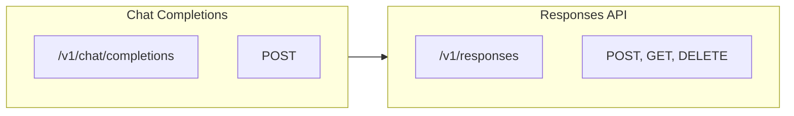

# Migration Guide

## Introduction

This lesson provides a comprehensive guide to migrating from the Chat Completions API to the Responses API. We cover endpoint changes, message format updates, function definition changes, and structured output differences.

### What We'll Cover

- Endpoint and method changes
- Message format migration
- Function/tool definition updates
- Structured output changes
- Streaming event differences
- Migration strategies and tools

### Prerequisites

- Experience with Chat Completions API
- Understanding of Responses API basics
- Python development environment

---

## Endpoint Changes



### API Comparison

| Aspect | Chat Completions | Responses API |
|--------|------------------|---------------|
| Create endpoint | `POST /v1/chat/completions` | `POST /v1/responses` |
| Retrieve | N/A | `GET /v1/responses/{id}` |
| Delete | N/A | `DELETE /v1/responses/{id}` |
| List | N/A | `GET /v1/responses` |
| SDK method | `client.chat.completions.create()` | `client.responses.create()` |

### Basic Migration

```python
from openai import OpenAI

client = OpenAI()

# Chat Completions (old)
def chat_completions_call(messages, model="gpt-4o"):
    response = client.chat.completions.create(
        model=model,
        messages=messages
    )
    return response.choices[0].message.content


# Responses API (new)
def responses_api_call(input_text, model="gpt-4o", instructions=None):
    kwargs = {"model": model, "input": input_text}
    if instructions:
        kwargs["instructions"] = instructions
    
    response = client.responses.create(**kwargs)
    return response.output_text


# Example usage - equivalent calls
# Old way
old_result = chat_completions_call([
    {"role": "system", "content": "You are helpful."},
    {"role": "user", "content": "Hello"}
])

# New way
new_result = responses_api_call(
    "Hello",
    instructions="You are helpful."
)
```

---

## Message Format Migration

### Messages to Input

```python
from typing import List, Dict, Any, Union

def convert_messages_to_input(
    messages: List[Dict[str, str]]
) -> tuple:
    """Convert Chat Completions messages to Responses API format."""
    
    instructions = None
    input_items = []
    
    for msg in messages:
        role = msg["role"]
        content = msg["content"]
        
        if role == "system":
            # System message becomes instructions
            instructions = content
        
        elif role == "user":
            input_items.append({
                "type": "message",
                "role": "user",
                "content": content
            })
        
        elif role == "assistant":
            input_items.append({
                "type": "message",
                "role": "assistant",
                "content": content
            })
        
        elif role == "tool":
            # Tool results have different format
            input_items.append({
                "type": "function_call_output",
                "call_id": msg.get("tool_call_id", ""),
                "output": content
            })
    
    # Simplify if single user message
    if len(input_items) == 1 and input_items[0]["role"] == "user":
        return input_items[0]["content"], instructions
    
    return input_items, instructions


# Example
old_messages = [
    {"role": "system", "content": "You are a Python expert."},
    {"role": "user", "content": "What is a decorator?"},
    {"role": "assistant", "content": "A decorator is..."},
    {"role": "user", "content": "Show me an example"}
]

input_data, instructions = convert_messages_to_input(old_messages)

print(f"Instructions: {instructions}")
print(f"Input: {input_data}")
```

### Response Extraction

```python
from dataclasses import dataclass
from typing import Optional, List, Dict, Any

@dataclass
class UnifiedResponse:
    """Unified response format for both APIs."""
    
    text: Optional[str]
    function_calls: List[Dict[str, Any]]
    usage: Dict[str, int]
    raw_response: Any


def extract_chat_completions(response) -> UnifiedResponse:
    """Extract data from Chat Completions response."""
    
    choice = response.choices[0]
    message = choice.message
    
    text = message.content
    function_calls = []
    
    if message.tool_calls:
        for tc in message.tool_calls:
            function_calls.append({
                "name": tc.function.name,
                "call_id": tc.id,
                "arguments": tc.function.arguments
            })
    
    return UnifiedResponse(
        text=text,
        function_calls=function_calls,
        usage={
            "input_tokens": response.usage.prompt_tokens,
            "output_tokens": response.usage.completion_tokens,
            "total_tokens": response.usage.total_tokens
        },
        raw_response=response
    )


def extract_responses_api(response) -> UnifiedResponse:
    """Extract data from Responses API response."""
    
    text = response.output_text
    function_calls = []
    
    for item in response.output:
        if item.type == "function_call":
            function_calls.append({
                "name": item.name,
                "call_id": item.call_id,
                "arguments": item.arguments
            })
    
    return UnifiedResponse(
        text=text,
        function_calls=function_calls,
        usage={
            "input_tokens": response.usage.input_tokens,
            "output_tokens": response.usage.output_tokens,
            "total_tokens": response.usage.total_tokens
        },
        raw_response=response
    )
```

---

## Function Definition Changes

### Tool Format Migration

```python
from typing import Dict, Any, List

def convert_tool_chat_to_responses(tool: Dict[str, Any]) -> Dict[str, Any]:
    """Convert Chat Completions tool format to Responses API format."""
    
    if tool["type"] != "function":
        return tool  # Non-function tools pass through
    
    func = tool["function"]
    
    return {
        "type": "function",
        "name": func["name"],
        "description": func.get("description", ""),
        "parameters": func.get("parameters", {})
    }


def convert_tool_responses_to_chat(tool: Dict[str, Any]) -> Dict[str, Any]:
    """Convert Responses API tool format to Chat Completions format."""
    
    if tool["type"] != "function":
        return tool
    
    return {
        "type": "function",
        "function": {
            "name": tool["name"],
            "description": tool.get("description", ""),
            "parameters": tool.get("parameters", {})
        }
    }


def convert_tools(
    tools: List[Dict[str, Any]],
    to_format: str = "responses"
) -> List[Dict[str, Any]]:
    """Convert list of tools between formats."""
    
    if to_format == "responses":
        return [convert_tool_chat_to_responses(t) for t in tools]
    else:
        return [convert_tool_responses_to_chat(t) for t in tools]


# Example
chat_completions_tools = [
    {
        "type": "function",
        "function": {
            "name": "get_weather",
            "description": "Get weather for a location",
            "parameters": {
                "type": "object",
                "properties": {
                    "location": {"type": "string"}
                },
                "required": ["location"]
            }
        }
    }
]

responses_tools = convert_tools(chat_completions_tools, "responses")
print(responses_tools)
# Output: [{"type": "function", "name": "get_weather", ...}]
```

### Tool Call Handling

```python
import json
from typing import Dict, Any, List, Optional

def convert_tool_calls_from_chat(
    tool_calls: list
) -> List[Dict[str, Any]]:
    """Convert Chat Completions tool_calls to Responses format."""
    
    return [
        {
            "name": tc.function.name,
            "call_id": tc.id,
            "arguments": tc.function.arguments
        }
        for tc in tool_calls
    ]


def convert_tool_results_to_responses(
    results: List[Dict[str, Any]]
) -> List[Dict[str, Any]]:
    """Convert tool results to Responses API input format."""
    
    return [
        {
            "type": "function_call_output",
            "call_id": r["tool_call_id"],
            "output": r["content"]
        }
        for r in results
    ]


def convert_tool_results_to_chat(
    results: List[Dict[str, Any]]
) -> List[Dict[str, str]]:
    """Convert tool results to Chat Completions messages."""
    
    return [
        {
            "role": "tool",
            "tool_call_id": r["call_id"],
            "content": r["output"]
        }
        for r in results
    ]
```

---

## Structured Output Changes

### Response Format Migration

```python
from typing import Dict, Any, Optional
from dataclasses import dataclass

@dataclass
class StructuredOutputConfig:
    format_type: str  # "json_object" or "json_schema"
    schema: Optional[Dict[str, Any]] = None
    strict: bool = True


def convert_response_format(
    chat_config: Dict[str, Any]
) -> Dict[str, Any]:
    """Convert Chat Completions response_format to Responses text.format."""
    
    # Chat Completions uses response_format
    # Responses API uses text { format: { type, json_schema } }
    
    if chat_config.get("type") == "json_object":
        return {
            "format": {
                "type": "json_object"
            }
        }
    
    elif chat_config.get("type") == "json_schema":
        return {
            "format": {
                "type": "json_schema",
                "json_schema": chat_config.get("json_schema", {}),
                "strict": chat_config.get("strict", True)
            }
        }
    
    return {}


# Chat Completions style
chat_format = {
    "type": "json_schema",
    "json_schema": {
        "name": "response",
        "schema": {
            "type": "object",
            "properties": {
                "answer": {"type": "string"},
                "confidence": {"type": "number"}
            },
            "required": ["answer", "confidence"]
        }
    },
    "strict": True
}

# Convert to Responses API style
responses_text = convert_response_format(chat_format)
print(responses_text)
```

### Using Structured Outputs

```python
# Chat Completions way
chat_response = client.chat.completions.create(
    model="gpt-4o",
    messages=[{"role": "user", "content": "What is 2+2?"}],
    response_format={
        "type": "json_schema",
        "json_schema": {
            "name": "math_response",
            "schema": {
                "type": "object",
                "properties": {
                    "answer": {"type": "integer"},
                    "explanation": {"type": "string"}
                },
                "required": ["answer", "explanation"]
            }
        }
    }
)

# Responses API way
responses_response = client.responses.create(
    model="gpt-4o",
    input="What is 2+2?",
    text={
        "format": {
            "type": "json_schema",
            "json_schema": {
                "name": "math_response",
                "schema": {
                    "type": "object",
                    "properties": {
                        "answer": {"type": "integer"},
                        "explanation": {"type": "string"}
                    },
                    "required": ["answer", "explanation"]
                }
            },
            "strict": True
        }
    }
)
```

---

## Streaming Changes

### Event Type Comparison

| Chat Completions Event | Responses API Event |
|------------------------|---------------------|
| `chunk.choices[0].delta.content` | `response.output_text.delta` |
| `chunk.choices[0].delta.tool_calls` | `response.function_call_arguments.delta` |
| `chunk.choices[0].finish_reason` | `response.output_item.done` |
| N/A | `response.completed` |

### Stream Handler Migration

```python
from typing import Generator, Any

def handle_chat_stream(stream) -> Generator[str, None, None]:
    """Handle Chat Completions stream."""
    
    for chunk in stream:
        if chunk.choices:
            delta = chunk.choices[0].delta
            if delta.content:
                yield delta.content


def handle_responses_stream(stream) -> Generator[str, None, None]:
    """Handle Responses API stream."""
    
    for event in stream:
        if event.type == "response.output_text.delta":
            yield event.delta


class UnifiedStreamHandler:
    """Unified handler for both stream types."""
    
    def __init__(self, api_type: str):
        self.api_type = api_type
        self.text_chunks = []
        self.function_calls = []
        self.complete = False
    
    def process(self, stream) -> Generator[str, None, None]:
        """Process stream and yield text chunks."""
        
        if self.api_type == "chat":
            yield from self._process_chat(stream)
        else:
            yield from self._process_responses(stream)
    
    def _process_chat(self, stream):
        for chunk in stream:
            if not chunk.choices:
                continue
            
            delta = chunk.choices[0].delta
            
            if delta.content:
                self.text_chunks.append(delta.content)
                yield delta.content
            
            if delta.tool_calls:
                for tc in delta.tool_calls:
                    # Handle tool call deltas
                    pass
            
            if chunk.choices[0].finish_reason:
                self.complete = True
    
    def _process_responses(self, stream):
        for event in stream:
            if event.type == "response.output_text.delta":
                self.text_chunks.append(event.delta)
                yield event.delta
            
            elif event.type == "response.function_call_arguments.delta":
                # Handle function call streaming
                pass
            
            elif event.type == "response.completed":
                self.complete = True
    
    @property
    def full_text(self) -> str:
        return "".join(self.text_chunks)


# Usage
def stream_unified(client, message: str, use_responses_api: bool = True):
    """Stream with unified handler."""
    
    if use_responses_api:
        stream = client.responses.create(
            model="gpt-4o",
            input=message,
            stream=True
        )
        handler = UnifiedStreamHandler("responses")
    else:
        stream = client.chat.completions.create(
            model="gpt-4o",
            messages=[{"role": "user", "content": message}],
            stream=True
        )
        handler = UnifiedStreamHandler("chat")
    
    for chunk in handler.process(stream):
        print(chunk, end="", flush=True)
    
    print()
    return handler.full_text
```

---

## Migration Wrapper

### Compatibility Layer

```python
from dataclasses import dataclass
from typing import List, Dict, Any, Optional, Union
import json

@dataclass
class MigrationConfig:
    use_responses_api: bool = True
    auto_chain: bool = True
    store_responses: bool = True


class ChatCompletionsCompatLayer:
    """Compatibility layer for gradual migration."""
    
    def __init__(
        self,
        client,
        config: MigrationConfig = None
    ):
        self.client = client
        self.config = config or MigrationConfig()
        self._last_response_id: Optional[str] = None
    
    def create(
        self,
        model: str,
        messages: List[Dict[str, str]],
        tools: Optional[List[Dict]] = None,
        response_format: Optional[Dict] = None,
        stream: bool = False,
        **kwargs
    ):
        """Create completion with automatic API selection."""
        
        if self.config.use_responses_api:
            return self._create_responses(
                model, messages, tools, response_format, stream, **kwargs
            )
        else:
            return self._create_chat(
                model, messages, tools, response_format, stream, **kwargs
            )
    
    def _create_responses(
        self,
        model: str,
        messages: List[Dict[str, str]],
        tools: Optional[List[Dict]],
        response_format: Optional[Dict],
        stream: bool,
        **kwargs
    ):
        """Create using Responses API."""
        
        # Convert messages to input
        input_data, instructions = self._convert_messages(messages)
        
        # Build request
        req = {
            "model": model,
            "input": input_data,
            "stream": stream
        }
        
        if instructions:
            req["instructions"] = instructions
        
        if tools:
            req["tools"] = [self._convert_tool(t) for t in tools]
        
        if response_format:
            req["text"] = self._convert_response_format(response_format)
        
        if self.config.auto_chain and self._last_response_id:
            req["previous_response_id"] = self._last_response_id
        
        if not self.config.store_responses:
            req["store"] = False
        
        response = self.client.responses.create(**req)
        
        if not stream:
            self._last_response_id = response.id
        
        return ResponsesAPIWrapper(response)
    
    def _create_chat(
        self,
        model: str,
        messages: List[Dict[str, str]],
        tools: Optional[List[Dict]],
        response_format: Optional[Dict],
        stream: bool,
        **kwargs
    ):
        """Create using Chat Completions."""
        
        req = {
            "model": model,
            "messages": messages,
            "stream": stream
        }
        
        if tools:
            req["tools"] = tools
        
        if response_format:
            req["response_format"] = response_format
        
        return self.client.chat.completions.create(**req)
    
    def _convert_messages(self, messages):
        """Convert messages to Responses format."""
        
        instructions = None
        items = []
        
        for msg in messages:
            if msg["role"] == "system":
                instructions = msg["content"]
            elif msg["role"] == "tool":
                items.append({
                    "type": "function_call_output",
                    "call_id": msg.get("tool_call_id", ""),
                    "output": msg["content"]
                })
            else:
                items.append({
                    "type": "message",
                    "role": msg["role"],
                    "content": msg["content"]
                })
        
        if len(items) == 1 and items[0].get("role") == "user":
            return items[0]["content"], instructions
        
        return items, instructions
    
    def _convert_tool(self, tool):
        """Convert tool format."""
        
        if "function" in tool:
            func = tool["function"]
            return {
                "type": "function",
                "name": func["name"],
                "description": func.get("description", ""),
                "parameters": func.get("parameters", {})
            }
        return tool
    
    def _convert_response_format(self, fmt):
        """Convert response_format to text.format."""
        
        if fmt.get("type") == "json_schema":
            return {
                "format": {
                    "type": "json_schema",
                    "json_schema": fmt.get("json_schema", {}),
                    "strict": True
                }
            }
        elif fmt.get("type") == "json_object":
            return {"format": {"type": "json_object"}}
        return {}


class ResponsesAPIWrapper:
    """Wrapper to make Responses API look like Chat Completions."""
    
    def __init__(self, response):
        self._response = response
        self.choices = [ResponseChoice(response)]
        self.usage = ResponseUsage(response.usage)
        self.id = response.id
        self.model = response.model
    
    @property
    def output_text(self):
        return self._response.output_text


class ResponseChoice:
    """Wrapper for choices[0] compatibility."""
    
    def __init__(self, response):
        self.message = ResponseMessage(response)
        self.finish_reason = "stop"


class ResponseMessage:
    """Wrapper for message compatibility."""
    
    def __init__(self, response):
        self._response = response
        self.role = "assistant"
        self.content = response.output_text
        self.tool_calls = self._extract_tool_calls()
    
    def _extract_tool_calls(self):
        calls = []
        for item in self._response.output:
            if item.type == "function_call":
                calls.append(ToolCallWrapper(item))
        return calls if calls else None


class ToolCallWrapper:
    """Wrapper for tool call compatibility."""
    
    def __init__(self, item):
        self.id = item.call_id
        self.type = "function"
        self.function = FunctionWrapper(item)


class FunctionWrapper:
    """Wrapper for function compatibility."""
    
    def __init__(self, item):
        self.name = item.name
        self.arguments = item.arguments


class ResponseUsage:
    """Wrapper for usage compatibility."""
    
    def __init__(self, usage):
        self.prompt_tokens = usage.input_tokens
        self.completion_tokens = usage.output_tokens
        self.total_tokens = usage.total_tokens


# Usage
config = MigrationConfig(
    use_responses_api=True,
    auto_chain=True,
    store_responses=True
)

compat = ChatCompletionsCompatLayer(client, config)

# Use like Chat Completions
response = compat.create(
    model="gpt-4o",
    messages=[
        {"role": "system", "content": "You are helpful."},
        {"role": "user", "content": "Hello"}
    ]
)

# Access like Chat Completions
print(response.choices[0].message.content)

# But also access Responses API features
print(response.output_text)
```

---

## Migration Checklist

### Pre-Migration

```python
from dataclasses import dataclass
from typing import List, Dict

@dataclass
class MigrationCheck:
    item: str
    status: str
    notes: str


def run_migration_checks(codebase_info: Dict) -> List[MigrationCheck]:
    """Run pre-migration checks."""
    
    checks = []
    
    # Check for message format
    if codebase_info.get("uses_messages"):
        checks.append(MigrationCheck(
            item="Message format",
            status="ACTION REQUIRED",
            notes="Convert messages array to input + instructions"
        ))
    
    # Check for system messages
    if codebase_info.get("uses_system_role"):
        checks.append(MigrationCheck(
            item="System messages",
            status="ACTION REQUIRED",
            notes="Move to instructions parameter"
        ))
    
    # Check for function calling
    if codebase_info.get("uses_functions"):
        checks.append(MigrationCheck(
            item="Function definitions",
            status="ACTION REQUIRED",
            notes="Flatten tool structure (remove function wrapper)"
        ))
    
    # Check for structured outputs
    if codebase_info.get("uses_response_format"):
        checks.append(MigrationCheck(
            item="Structured outputs",
            status="ACTION REQUIRED",
            notes="Use text.format instead of response_format"
        ))
    
    # Check for streaming
    if codebase_info.get("uses_streaming"):
        checks.append(MigrationCheck(
            item="Streaming",
            status="ACTION REQUIRED",
            notes="Update event type handling"
        ))
    
    # Check for manual conversation management
    if codebase_info.get("manual_history"):
        checks.append(MigrationCheck(
            item="Conversation history",
            status="OPPORTUNITY",
            notes="Can use previous_response_id instead"
        ))
    
    return checks


# Run checks
codebase = {
    "uses_messages": True,
    "uses_system_role": True,
    "uses_functions": True,
    "uses_response_format": False,
    "uses_streaming": True,
    "manual_history": True
}

checks = run_migration_checks(codebase)

print("Migration Checklist:")
print("=" * 60)
for check in checks:
    print(f"\n{check.status}: {check.item}")
    print(f"  → {check.notes}")
```

### Migration Strategy

```python
from enum import Enum

class MigrationPhase(Enum):
    PHASE_1 = "Compatibility layer"
    PHASE_2 = "Feature parity"
    PHASE_3 = "Native Responses"
    PHASE_4 = "Optimization"


def get_migration_plan() -> Dict[str, List[str]]:
    """Get phased migration plan."""
    
    return {
        MigrationPhase.PHASE_1.value: [
            "Install compatibility wrapper",
            "Run tests with use_responses_api=False",
            "Switch to use_responses_api=True",
            "Verify all tests pass",
            "Deploy to staging"
        ],
        MigrationPhase.PHASE_2.value: [
            "Update message format to input/instructions",
            "Convert tool definitions",
            "Update response parsing",
            "Add previous_response_id for conversations",
            "Run integration tests"
        ],
        MigrationPhase.PHASE_3.value: [
            "Remove compatibility layer",
            "Use native Responses API calls",
            "Implement store parameter logic",
            "Add response retrieval/deletion",
            "Full regression testing"
        ],
        MigrationPhase.PHASE_4.value: [
            "Enable MCP integration",
            "Add remote connectors",
            "Implement agentic features",
            "Optimize with caching analysis",
            "Monitor and iterate"
        ]
    }


# Print plan
plan = get_migration_plan()
for phase, steps in plan.items():
    print(f"\n{phase}:")
    for i, step in enumerate(steps, 1):
        print(f"  {i}. {step}")
```

---

## Hands-on Exercise

### Your Task

Create a complete migration utility.

### Requirements

1. Convert Chat Completions requests to Responses
2. Convert responses back to Chat format
3. Support all major features
4. Include validation

<details>
<summary>💡 Hints</summary>

- Handle all message roles
- Map tool formats both ways
- Preserve all response data
</details>

<details>
<summary>✅ Solution</summary>

```python
from dataclasses import dataclass, field
from typing import List, Dict, Any, Optional, Union
from enum import Enum
import json

class ConversionDirection(Enum):
    CHAT_TO_RESPONSES = "chat_to_responses"
    RESPONSES_TO_CHAT = "responses_to_chat"


@dataclass
class ConversionResult:
    success: bool
    data: Dict[str, Any]
    warnings: List[str] = field(default_factory=list)
    errors: List[str] = field(default_factory=list)


class APIConverter:
    """Complete migration utility for Chat Completions ↔ Responses API."""
    
    def convert_request(
        self,
        request: Dict[str, Any],
        direction: ConversionDirection
    ) -> ConversionResult:
        """Convert request between API formats."""
        
        if direction == ConversionDirection.CHAT_TO_RESPONSES:
            return self._chat_request_to_responses(request)
        else:
            return self._responses_request_to_chat(request)
    
    def convert_response(
        self,
        response: Any,
        direction: ConversionDirection
    ) -> ConversionResult:
        """Convert response between API formats."""
        
        if direction == ConversionDirection.CHAT_TO_RESPONSES:
            return self._chat_response_to_responses_format(response)
        else:
            return self._responses_response_to_chat_format(response)
    
    def _chat_request_to_responses(
        self,
        request: Dict[str, Any]
    ) -> ConversionResult:
        """Convert Chat Completions request to Responses format."""
        
        warnings = []
        errors = []
        
        result = {"model": request.get("model", "gpt-4o")}
        
        # Convert messages
        messages = request.get("messages", [])
        instructions = None
        input_items = []
        
        for msg in messages:
            role = msg.get("role")
            content = msg.get("content", "")
            
            if role == "system":
                if instructions:
                    warnings.append("Multiple system messages - using last one")
                instructions = content
            
            elif role == "user":
                input_items.append({
                    "type": "message",
                    "role": "user",
                    "content": content
                })
            
            elif role == "assistant":
                item = {
                    "type": "message",
                    "role": "assistant",
                    "content": content
                }
                
                # Handle tool calls in assistant message
                if msg.get("tool_calls"):
                    warnings.append("Tool calls in assistant message - may need manual handling")
                
                input_items.append(item)
            
            elif role == "tool":
                input_items.append({
                    "type": "function_call_output",
                    "call_id": msg.get("tool_call_id", ""),
                    "output": content
                })
            
            else:
                errors.append(f"Unknown role: {role}")
        
        # Set input
        if len(input_items) == 1 and input_items[0].get("role") == "user":
            result["input"] = input_items[0]["content"]
        elif input_items:
            result["input"] = input_items
        else:
            errors.append("No input messages found")
        
        if instructions:
            result["instructions"] = instructions
        
        # Convert tools
        if request.get("tools"):
            result["tools"] = [
                self._convert_tool_to_responses(t)
                for t in request["tools"]
            ]
        
        # Convert response_format
        if request.get("response_format"):
            result["text"] = self._convert_response_format_to_responses(
                request["response_format"]
            )
        
        # Direct mappings
        for key in ["temperature", "top_p", "stream"]:
            if key in request:
                result[key] = request[key]
        
        # max_tokens -> max_output_tokens
        if "max_tokens" in request:
            result["max_output_tokens"] = request["max_tokens"]
        
        # tool_choice
        if "tool_choice" in request:
            result["tool_choice"] = request["tool_choice"]
        
        return ConversionResult(
            success=len(errors) == 0,
            data=result,
            warnings=warnings,
            errors=errors
        )
    
    def _responses_request_to_chat(
        self,
        request: Dict[str, Any]
    ) -> ConversionResult:
        """Convert Responses request to Chat Completions format."""
        
        warnings = []
        errors = []
        
        result = {"model": request.get("model", "gpt-4o")}
        messages = []
        
        # Convert instructions to system message
        if request.get("instructions"):
            messages.append({
                "role": "system",
                "content": request["instructions"]
            })
        
        # Convert input
        input_data = request.get("input")
        
        if isinstance(input_data, str):
            messages.append({
                "role": "user",
                "content": input_data
            })
        
        elif isinstance(input_data, list):
            for item in input_data:
                item_type = item.get("type")
                
                if item_type == "message":
                    messages.append({
                        "role": item["role"],
                        "content": item.get("content", "")
                    })
                
                elif item_type == "function_call_output":
                    messages.append({
                        "role": "tool",
                        "tool_call_id": item.get("call_id", ""),
                        "content": item.get("output", "")
                    })
                
                else:
                    warnings.append(f"Unknown input type: {item_type}")
        
        result["messages"] = messages
        
        # Convert tools
        if request.get("tools"):
            result["tools"] = [
                self._convert_tool_to_chat(t)
                for t in request["tools"]
            ]
        
        # Convert text.format to response_format
        if request.get("text", {}).get("format"):
            result["response_format"] = self._convert_response_format_to_chat(
                request["text"]["format"]
            )
        
        # Direct mappings
        for key in ["temperature", "top_p", "stream", "tool_choice"]:
            if key in request:
                result[key] = request[key]
        
        # max_output_tokens -> max_tokens
        if "max_output_tokens" in request:
            result["max_tokens"] = request["max_output_tokens"]
        
        # Responses-specific features
        if request.get("previous_response_id"):
            warnings.append("previous_response_id not supported in Chat Completions")
        
        if request.get("store") is False:
            warnings.append("store parameter not supported in Chat Completions")
        
        return ConversionResult(
            success=len(errors) == 0,
            data=result,
            warnings=warnings,
            errors=errors
        )
    
    def _convert_tool_to_responses(self, tool: Dict) -> Dict:
        """Convert tool format to Responses API."""
        
        if tool.get("type") != "function":
            return tool
        
        func = tool.get("function", {})
        return {
            "type": "function",
            "name": func.get("name", ""),
            "description": func.get("description", ""),
            "parameters": func.get("parameters", {})
        }
    
    def _convert_tool_to_chat(self, tool: Dict) -> Dict:
        """Convert tool format to Chat Completions."""
        
        if tool.get("type") != "function":
            return tool
        
        return {
            "type": "function",
            "function": {
                "name": tool.get("name", ""),
                "description": tool.get("description", ""),
                "parameters": tool.get("parameters", {})
            }
        }
    
    def _convert_response_format_to_responses(self, fmt: Dict) -> Dict:
        """Convert response_format to text.format."""
        
        if fmt.get("type") == "json_schema":
            return {
                "format": {
                    "type": "json_schema",
                    "json_schema": fmt.get("json_schema", {}),
                    "strict": fmt.get("strict", True)
                }
            }
        elif fmt.get("type") == "json_object":
            return {"format": {"type": "json_object"}}
        return {}
    
    def _convert_response_format_to_chat(self, fmt: Dict) -> Dict:
        """Convert text.format to response_format."""
        
        if fmt.get("type") == "json_schema":
            return {
                "type": "json_schema",
                "json_schema": fmt.get("json_schema", {}),
                "strict": fmt.get("strict", True)
            }
        elif fmt.get("type") == "json_object":
            return {"type": "json_object"}
        return {"type": "text"}
    
    def _chat_response_to_responses_format(self, response) -> ConversionResult:
        """Convert Chat Completions response to Responses-like format."""
        
        choice = response.choices[0]
        message = choice.message
        
        output = []
        
        # Add message content
        if message.content:
            output.append({
                "type": "message",
                "role": "assistant",
                "content": message.content
            })
        
        # Add function calls
        if message.tool_calls:
            for tc in message.tool_calls:
                output.append({
                    "type": "function_call",
                    "name": tc.function.name,
                    "call_id": tc.id,
                    "arguments": tc.function.arguments
                })
        
        return ConversionResult(
            success=True,
            data={
                "id": response.id,
                "model": response.model,
                "output": output,
                "output_text": message.content,
                "usage": {
                    "input_tokens": response.usage.prompt_tokens,
                    "output_tokens": response.usage.completion_tokens,
                    "total_tokens": response.usage.total_tokens
                }
            }
        )
    
    def _responses_response_to_chat_format(self, response) -> ConversionResult:
        """Convert Responses API response to Chat Completions-like format."""
        
        content = response.output_text
        tool_calls = []
        
        for item in response.output:
            if item.type == "function_call":
                tool_calls.append({
                    "id": item.call_id,
                    "type": "function",
                    "function": {
                        "name": item.name,
                        "arguments": item.arguments
                    }
                })
        
        return ConversionResult(
            success=True,
            data={
                "id": response.id,
                "model": response.model,
                "choices": [{
                    "index": 0,
                    "message": {
                        "role": "assistant",
                        "content": content,
                        "tool_calls": tool_calls if tool_calls else None
                    },
                    "finish_reason": "stop"
                }],
                "usage": {
                    "prompt_tokens": response.usage.input_tokens,
                    "completion_tokens": response.usage.output_tokens,
                    "total_tokens": response.usage.total_tokens
                }
            }
        )


# Usage and testing
converter = APIConverter()

# Test Chat → Responses request
chat_request = {
    "model": "gpt-4o",
    "messages": [
        {"role": "system", "content": "You are helpful."},
        {"role": "user", "content": "Hello"},
        {"role": "assistant", "content": "Hi!"},
        {"role": "user", "content": "How are you?"}
    ],
    "tools": [
        {
            "type": "function",
            "function": {
                "name": "get_time",
                "description": "Get current time",
                "parameters": {"type": "object", "properties": {}}
            }
        }
    ],
    "max_tokens": 100,
    "temperature": 0.7
}

result = converter.convert_request(
    chat_request,
    ConversionDirection.CHAT_TO_RESPONSES
)

print("Chat → Responses Conversion:")
print(f"  Success: {result.success}")
print(f"  Warnings: {result.warnings}")
print(f"  Result: {json.dumps(result.data, indent=2)}")

# Test Responses → Chat request
responses_request = {
    "model": "gpt-4o",
    "instructions": "You are helpful.",
    "input": "Hello",
    "tools": [
        {
            "type": "function",
            "name": "get_time",
            "description": "Get current time",
            "parameters": {"type": "object", "properties": {}}
        }
    ],
    "max_output_tokens": 100,
    "previous_response_id": "resp_123"  # Will generate warning
}

result2 = converter.convert_request(
    responses_request,
    ConversionDirection.RESPONSES_TO_CHAT
)

print("\nResponses → Chat Conversion:")
print(f"  Success: {result2.success}")
print(f"  Warnings: {result2.warnings}")
print(f"  Result: {json.dumps(result2.data, indent=2)}")
```

</details>

---

## Summary

✅ Endpoint changes from `/chat/completions` to `/responses`  
✅ Messages array becomes input + instructions  
✅ Tool definitions use flatter structure  
✅ Structured outputs use text.format parameter  
✅ Streaming events have different types  
✅ Compatibility wrappers enable gradual migration

**Next:** [Prompt Caching Optimization](../16-prompt-caching-optimization/00-prompt-caching-optimization.md)

---

## Further Reading

- [Migration Guide](https://platform.openai.com/docs/guides/responses-vs-chat-completions) — Official migration
- [Responses API Reference](https://platform.openai.com/docs/api-reference/responses) — Full API docs
- [Chat Completions Reference](https://platform.openai.com/docs/api-reference/chat) — Legacy API docs
