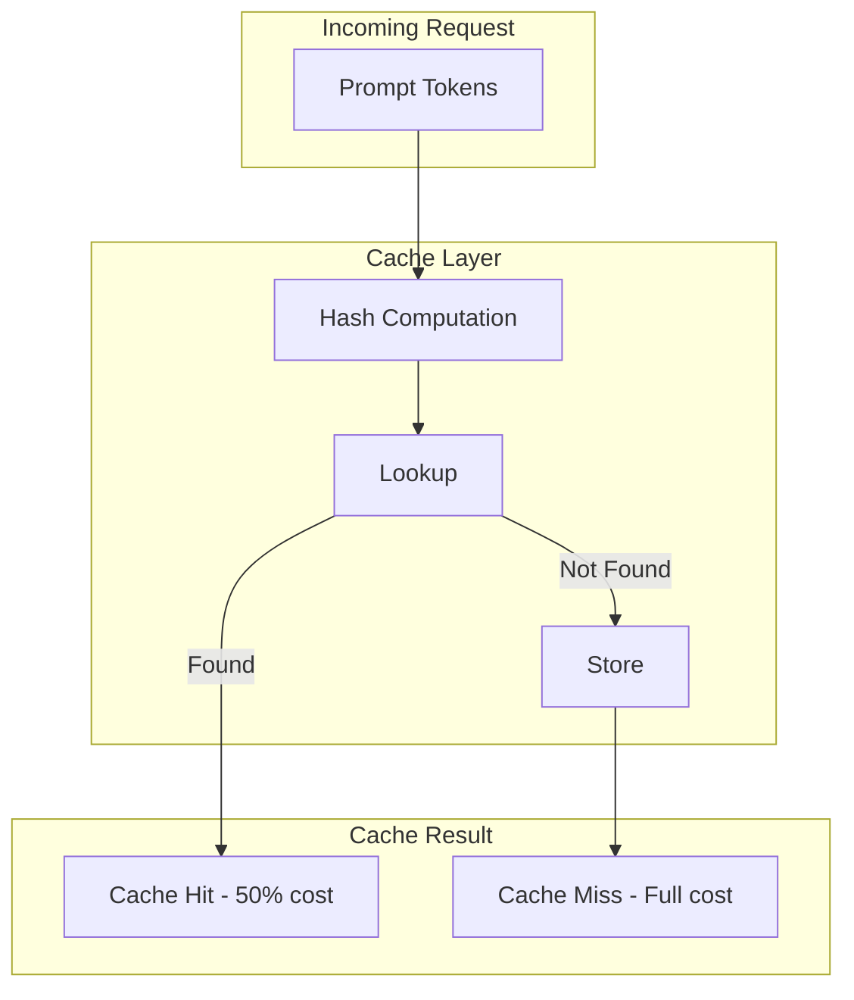

# Prompt Caching & Optimization

## Overview

Prompt caching is a cost-saving and latency-reduction technique that reuses previously computed tokens. This lesson covers how caching works across OpenAI and Anthropic APIs, configuration options, and optimization strategies.

### Lesson Structure

| File | Topic | Description |
|------|-------|-------------|
| [01-how-caching-works](./01-how-caching-works.md) | Cache Fundamentals | Automatic caching, prefix matching, hash routing |
| [02-openai-caching](./02-openai-caching.md) | OpenAI Implementation | Configuration, retention options, extended caching |
| [03-anthropic-caching](./03-anthropic-caching.md) | Anthropic Implementation | cache_control blocks, TTL options, creation tracking |
| [04-cacheable-content](./04-cacheable-content.md) | What Can Be Cached | Messages, images, tools, schemas |
| [05-cache-friendly-design](./05-cache-friendly-design.md) | Prompt Optimization | Static prefix, dynamic suffix, consistent definitions |
| [06-monitoring-performance](./06-monitoring-performance.md) | Performance Tracking | Hit rates, latency, cost savings |
| [07-best-practices](./07-best-practices.md) | Implementation Patterns | Request streaming, rate limits, analysis |

### Why Prompt Caching Matters

Prompt caching provides significant benefits:

| Benefit | Impact |
|---------|--------|
| **Cost Reduction** | 50-90% reduction on cached tokens |
| **Latency Improvement** | 30-80% faster TTFT (time to first token) |
| **Throughput** | Higher effective requests per minute |
| **Consistency** | Same prefix = predictable caching |

### Quick Comparison

```python
# OpenAI - Automatic caching (1024+ tokens)
response = client.chat.completions.create(
    model="gpt-4o",
    messages=[...],  # Cached automatically if prefix matches
)

# OpenAI - With cache key (routing optimization)
response = client.responses.create(
    model="gpt-4o",
    input="...",
    prompt_cache_key="my_app_v1"
)

# Anthropic - Explicit cache control
response = client.messages.create(
    model="claude-sonnet-4-20250514",
    system=[{
        "type": "text",
        "text": "Large system prompt...",
        "cache_control": {"type": "ephemeral"}
    }],
    messages=[...]
)
```

### Caching Architecture



### Prerequisites

Before starting this lesson, you should understand:

- API request/response patterns
- Token concepts and pricing
- Basic performance optimization

### Learning Outcomes

By the end of this lesson, you will be able to:

1. Explain how prompt caching works across providers
2. Configure caching for optimal performance
3. Design cache-friendly prompts
4. Monitor and analyze cache performance
5. Calculate cost savings from caching

---

## Navigation

**Next:** [How Caching Works](./01-how-caching-works.md)

---

## Further Reading

- [OpenAI Prompt Caching](https://platform.openai.com/docs/guides/prompt-caching) — Official guide
- [Anthropic Prompt Caching](https://docs.anthropic.com/en/docs/build-with-claude/prompt-caching) — Claude caching
- [Cost Optimization](https://platform.openai.com/docs/guides/rate-limits) — Rate limits and costs
