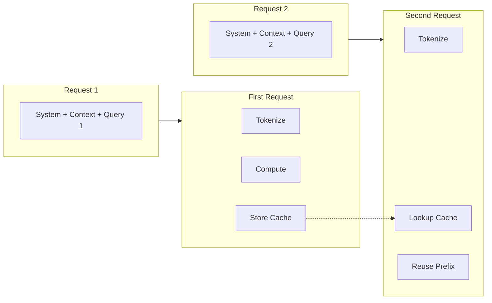

# How Caching Works

## Introduction

Prompt caching is a technique that stores computed token representations for reuse in subsequent requests. Understanding the mechanics of caching helps you design prompts that maximize cache hits and minimize costs.

### What We'll Cover

- Automatic caching for long prompts
- Prefix-based cache matching
- Cache routing and hash computation
- Machine-level caching architecture

### Prerequisites

- Understanding of tokenization
- Basic API request concepts
- Familiarity with latency concepts

---

## Cache Fundamentals



### What Gets Cached

```python
from dataclasses import dataclass
from typing import List, Optional

@dataclass
class CacheableRequest:
    """Components of a request that can be cached."""
    
    system_message: str          # ✓ Cached
    context_documents: List[str]  # ✓ Cached
    tool_definitions: List[dict]  # ✓ Cached
    few_shot_examples: List[dict] # ✓ Cached
    user_query: str              # Usually dynamic, at end
    
    @property
    def cacheable_portion(self) -> str:
        """The portion that benefits from caching."""
        
        parts = [self.system_message]
        parts.extend(self.context_documents)
        # Tools and examples also cached
        return "\n".join(parts)
    
    @property
    def estimated_cached_tokens(self) -> int:
        """Rough estimate of cached tokens."""
        
        # ~4 chars per token on average
        cacheable_text = self.cacheable_portion
        return len(cacheable_text) // 4


# Example
request = CacheableRequest(
    system_message="You are a helpful assistant...",  # 50 tokens
    context_documents=["Doc 1: ...", "Doc 2: ..."],   # 2000 tokens
    tool_definitions=[{"name": "search", ...}],       # 100 tokens
    few_shot_examples=[{"user": "...", "assistant": "..."}],  # 200 tokens
    user_query="What is X?"  # 10 tokens - dynamic
)

print(f"Cacheable: ~{request.estimated_cached_tokens} tokens")
print(f"Dynamic: ~10 tokens")
```

---

## Automatic Caching

### Token Threshold

```python
from dataclasses import dataclass
from typing import Optional

@dataclass
class CacheThreshold:
    provider: str
    min_tokens: int
    note: str


CACHE_THRESHOLDS = [
    CacheThreshold("OpenAI", 1024, "Automatic for prompts >= 1024 tokens"),
    CacheThreshold("Anthropic", 1024, "Requires explicit cache_control"),
    CacheThreshold("OpenAI (Responses)", 128, "Lower threshold with new API"),
]


def will_cache_automatically(token_count: int, provider: str = "OpenAI") -> bool:
    """Check if prompt will be cached automatically."""
    
    threshold = next(
        (t for t in CACHE_THRESHOLDS if t.provider == provider),
        None
    )
    
    if not threshold:
        return False
    
    return token_count >= threshold.min_tokens


def estimate_tokens(text: str) -> int:
    """Rough token estimation."""
    # GPT models: ~4 chars per token
    return len(text) // 4


# Example
system_prompt = """You are an expert assistant specializing in...
[Large context document here - 5000 characters]
"""

tokens = estimate_tokens(system_prompt)
will_cache = will_cache_automatically(tokens)

print(f"Estimated tokens: {tokens}")
print(f"Will auto-cache: {will_cache}")
```

### Cache Timing

```python
from dataclasses import dataclass
from datetime import datetime, timedelta
from typing import Optional

@dataclass
class CacheEntry:
    prefix_hash: str
    created_at: datetime
    ttl_minutes: int
    hit_count: int = 0
    
    @property
    def expires_at(self) -> datetime:
        return self.created_at + timedelta(minutes=self.ttl_minutes)
    
    @property
    def is_expired(self) -> bool:
        return datetime.now() > self.expires_at
    
    @property
    def time_remaining(self) -> timedelta:
        remaining = self.expires_at - datetime.now()
        return remaining if remaining.total_seconds() > 0 else timedelta(0)


# Cache TTL by provider
CACHE_TTL = {
    "openai_default": 5,      # 5-10 minutes
    "openai_extended": 60 * 24,  # 24 hours (with config)
    "anthropic_ephemeral": 5,    # 5 minutes
    "anthropic_extended": 60,    # 1 hour (beta)
}


def calculate_cache_benefit(
    tokens: int,
    requests_per_minute: float,
    ttl_minutes: int
) -> dict:
    """Calculate caching benefit over TTL period."""
    
    total_requests = requests_per_minute * ttl_minutes
    
    # First request is cache miss, rest are hits
    cache_misses = 1
    cache_hits = max(0, total_requests - 1)
    
    # Cost per 1M tokens (example rates)
    full_cost_per_1m = 2.50  # $2.50/1M input tokens
    cached_cost_per_1m = 1.25  # 50% discount
    
    tokens_millions = tokens / 1_000_000
    
    full_cost = total_requests * tokens_millions * full_cost_per_1m
    cached_cost = (
        cache_misses * tokens_millions * full_cost_per_1m +
        cache_hits * tokens_millions * cached_cost_per_1m
    )
    
    return {
        "total_requests": total_requests,
        "cache_hits": cache_hits,
        "hit_rate": cache_hits / total_requests if total_requests > 0 else 0,
        "full_cost": full_cost,
        "cached_cost": cached_cost,
        "savings": full_cost - cached_cost,
        "savings_percent": (full_cost - cached_cost) / full_cost * 100 if full_cost > 0 else 0
    }


# Example: 10 requests/minute for 5 minutes
benefit = calculate_cache_benefit(
    tokens=2000,
    requests_per_minute=10,
    ttl_minutes=5
)

print(f"Requests: {benefit['total_requests']:.0f}")
print(f"Cache hits: {benefit['cache_hits']:.0f}")
print(f"Hit rate: {benefit['hit_rate']:.1%}")
print(f"Savings: ${benefit['savings']:.4f} ({benefit['savings_percent']:.1f}%)")
```

---

## Prefix-Based Matching

### How Prefix Matching Works

```python
from typing import List, Tuple
import hashlib

def compute_prefix_hash(tokens: List[str], prefix_length: int) -> str:
    """Compute hash of token prefix."""
    
    prefix = tokens[:prefix_length]
    prefix_str = "|".join(prefix)
    
    return hashlib.sha256(prefix_str.encode()).hexdigest()[:16]


def find_cache_match(
    request_tokens: List[str],
    cache_entries: dict
) -> Tuple[int, str]:
    """Find longest matching cache prefix."""
    
    best_match_length = 0
    best_hash = None
    
    # Check progressively shorter prefixes
    for length in range(len(request_tokens), 0, -1):
        prefix_hash = compute_prefix_hash(request_tokens, length)
        
        if prefix_hash in cache_entries:
            return length, prefix_hash
    
    return 0, None


# Simulate cache matching
cache = {}

# First request creates cache
request1_tokens = ["You", "are", "a", "helpful", "assistant", ".", "Query:", "Hello"]
prefix_hash = compute_prefix_hash(request1_tokens, 6)  # Cache first 6 tokens
cache[prefix_hash] = {"tokens": 6, "computed": "..."}

print(f"Cached prefix (6 tokens): {prefix_hash}")

# Second request with same prefix
request2_tokens = ["You", "are", "a", "helpful", "assistant", ".", "Query:", "Goodbye"]
match_length, match_hash = find_cache_match(request2_tokens, cache)

print(f"Cache match: {match_length} tokens")
print(f"Tokens to compute: {len(request2_tokens) - match_length}")
```

### Prefix Ordering

```python
from dataclasses import dataclass
from typing import List, Dict, Any

@dataclass
class PromptComponent:
    name: str
    content: str
    is_static: bool
    priority: int  # Lower = earlier in prompt


def optimize_prompt_order(components: List[PromptComponent]) -> List[PromptComponent]:
    """Order components for optimal caching."""
    
    # Sort by: static first, then by priority
    return sorted(
        components,
        key=lambda c: (not c.is_static, c.priority)
    )


def build_optimized_prompt(components: List[PromptComponent]) -> str:
    """Build prompt with optimal cache ordering."""
    
    ordered = optimize_prompt_order(components)
    
    parts = []
    cache_boundary = -1
    
    for i, comp in enumerate(ordered):
        parts.append(f"## {comp.name}\n{comp.content}")
        if comp.is_static:
            cache_boundary = i
    
    prompt = "\n\n".join(parts)
    
    # Mark where cache ends
    static_parts = parts[:cache_boundary + 1]
    static_text = "\n\n".join(static_parts)
    
    return {
        "full_prompt": prompt,
        "cacheable_prefix": static_text,
        "cache_boundary_index": cache_boundary
    }


# Example
components = [
    PromptComponent("User Query", "What is Python?", is_static=False, priority=10),
    PromptComponent("System", "You are a helpful assistant.", is_static=True, priority=1),
    PromptComponent("Context", "Python is a programming language...", is_static=True, priority=2),
    PromptComponent("Examples", "Q: What is JS? A: JavaScript is...", is_static=True, priority=3),
]

result = build_optimized_prompt(components)
print("Cacheable portion ends at component:", result["cache_boundary_index"])
print("\nCacheable prefix:")
print(result["cacheable_prefix"][:200] + "...")
```

---

## Hash Computation and Routing

### Cache Key Generation

```python
import hashlib
import json
from typing import Dict, Any, List

def generate_cache_key(
    model: str,
    messages: List[Dict[str, str]],
    tools: List[Dict] = None,
    response_format: Dict = None
) -> str:
    """Generate cache key from request components."""
    
    # Include all cacheable components
    key_parts = {
        "model": model,
        "messages": messages,
    }
    
    if tools:
        key_parts["tools"] = tools
    
    if response_format:
        key_parts["response_format"] = response_format
    
    # Serialize deterministically
    key_string = json.dumps(key_parts, sort_keys=True)
    
    return hashlib.sha256(key_string.encode()).hexdigest()


def get_prefix_cache_key(
    messages: List[Dict[str, str]],
    prefix_token_count: int
) -> str:
    """Generate cache key for message prefix."""
    
    # Estimate token boundaries (simplified)
    chars_per_token = 4
    prefix_chars = prefix_token_count * chars_per_token
    
    # Build prefix from messages
    prefix_content = ""
    for msg in messages:
        if len(prefix_content) >= prefix_chars:
            break
        prefix_content += msg.get("content", "")
    
    prefix_content = prefix_content[:prefix_chars]
    
    return hashlib.sha256(prefix_content.encode()).hexdigest()[:16]


# Example
messages = [
    {"role": "system", "content": "You are a helpful Python tutor."},
    {"role": "user", "content": "Explain decorators in detail."}
]

full_key = generate_cache_key("gpt-4o", messages)
prefix_key = get_prefix_cache_key(messages, 100)

print(f"Full cache key: {full_key[:32]}...")
print(f"Prefix key (100 tokens): {prefix_key}")
```

### Custom Cache Keys

```python
from typing import Optional

class CacheRouter:
    """Route requests to appropriate cache partitions."""
    
    def __init__(self):
        self.partitions: Dict[str, dict] = {}
    
    def get_routing_key(
        self,
        user_id: Optional[str] = None,
        session_id: Optional[str] = None,
        app_version: Optional[str] = None,
        custom_key: Optional[str] = None
    ) -> str:
        """Generate routing key for cache partition."""
        
        if custom_key:
            return custom_key
        
        parts = []
        
        if app_version:
            parts.append(f"v:{app_version}")
        
        if user_id:
            parts.append(f"u:{user_id}")
        
        if session_id:
            parts.append(f"s:{session_id}")
        
        return "|".join(parts) if parts else "default"
    
    def create_request(
        self,
        model: str,
        input_text: str,
        routing_key: str = None,
        **kwargs
    ) -> Dict[str, Any]:
        """Create request with cache routing."""
        
        request = {
            "model": model,
            "input": input_text,
            **kwargs
        }
        
        if routing_key:
            # OpenAI Responses API supports prompt_cache_key
            request["prompt_cache_key"] = routing_key
        
        return request


# Usage
router = CacheRouter()

# Same app version = shared cache
key1 = router.get_routing_key(app_version="2.0", user_id="user1")
key2 = router.get_routing_key(app_version="2.0", user_id="user2")

print(f"User 1 key: {key1}")
print(f"User 2 key: {key2}")

# Create request with routing
request = router.create_request(
    model="gpt-4o",
    input_text="Hello",
    routing_key=router.get_routing_key(app_version="2.0")
)

print(f"Request cache key: {request.get('prompt_cache_key')}")
```

---

## Machine-Level Architecture

### Distributed Cache

```python
from dataclasses import dataclass
from typing import Dict, List, Optional
from enum import Enum

class CacheLocation(Enum):
    L1_LOCAL = "l1_local"      # GPU memory
    L2_MACHINE = "l2_machine"  # Machine RAM
    L3_CLUSTER = "l3_cluster"  # Distributed cache
    MISS = "miss"


@dataclass
class CacheLookupResult:
    location: CacheLocation
    latency_ms: float
    hit: bool


# Simulated cache latencies
CACHE_LATENCIES = {
    CacheLocation.L1_LOCAL: 0.1,
    CacheLocation.L2_MACHINE: 1.0,
    CacheLocation.L3_CLUSTER: 10.0,
    CacheLocation.MISS: 0.0,  # No lookup time, but full compute
}


def simulate_cache_lookup(
    request_hash: str,
    cache_state: Dict[CacheLocation, set]
) -> CacheLookupResult:
    """Simulate cache lookup across tiers."""
    
    for location in [CacheLocation.L1_LOCAL, CacheLocation.L2_MACHINE, CacheLocation.L3_CLUSTER]:
        if request_hash in cache_state.get(location, set()):
            return CacheLookupResult(
                location=location,
                latency_ms=CACHE_LATENCIES[location],
                hit=True
            )
    
    return CacheLookupResult(
        location=CacheLocation.MISS,
        latency_ms=0,
        hit=False
    )


def estimate_total_latency(
    lookup_result: CacheLookupResult,
    prompt_tokens: int,
    output_tokens: int
) -> dict:
    """Estimate total request latency."""
    
    # Processing time estimates (ms per token)
    TOKEN_PROCESS_TIME = 0.5  # Cache hit: just output
    TOKEN_COMPUTE_TIME = 2.0  # Cache miss: full compute
    
    if lookup_result.hit:
        # Only compute output tokens
        compute_time = output_tokens * TOKEN_PROCESS_TIME
    else:
        # Compute all tokens
        compute_time = (prompt_tokens + output_tokens) * TOKEN_COMPUTE_TIME
    
    total = lookup_result.latency_ms + compute_time
    
    return {
        "cache_lookup_ms": lookup_result.latency_ms,
        "compute_ms": compute_time,
        "total_ms": total,
        "cache_hit": lookup_result.hit,
        "cache_location": lookup_result.location.value
    }


# Simulate
cache_state = {
    CacheLocation.L1_LOCAL: {"hash_abc"},
    CacheLocation.L2_MACHINE: {"hash_def", "hash_ghi"},
    CacheLocation.L3_CLUSTER: {"hash_jkl"},
}

# L1 hit
result1 = simulate_cache_lookup("hash_abc", cache_state)
latency1 = estimate_total_latency(result1, 1000, 200)
print(f"L1 hit: {latency1['total_ms']:.1f}ms")

# Cache miss
result2 = simulate_cache_lookup("hash_new", cache_state)
latency2 = estimate_total_latency(result2, 1000, 200)
print(f"Cache miss: {latency2['total_ms']:.1f}ms")

print(f"Speedup from caching: {latency2['total_ms'] / latency1['total_ms']:.1f}x")
```

---

## Hands-on Exercise

### Your Task

Build a cache simulator that models prefix matching and TTL.

### Requirements

1. Implement prefix hash computation
2. Support cache TTL expiration
3. Track hit/miss statistics
4. Calculate cost savings

<details>
<summary>💡 Hints</summary>

- Use hashlib for hashing
- Track timestamps for TTL
- Store prefix length with entries
</details>

<details>
<summary>✅ Solution</summary>

```python
from dataclasses import dataclass, field
from typing import Dict, List, Optional, Tuple
from datetime import datetime, timedelta
import hashlib

@dataclass
class CacheEntry:
    prefix_hash: str
    prefix_length: int
    created_at: datetime
    ttl_minutes: int
    hit_count: int = 0
    
    @property
    def is_expired(self) -> bool:
        expiry = self.created_at + timedelta(minutes=self.ttl_minutes)
        return datetime.now() > expiry


@dataclass
class CacheStats:
    total_requests: int = 0
    cache_hits: int = 0
    cache_misses: int = 0
    tokens_cached: int = 0
    tokens_computed: int = 0
    
    @property
    def hit_rate(self) -> float:
        if self.total_requests == 0:
            return 0.0
        return self.cache_hits / self.total_requests
    
    def cost_savings(
        self,
        cost_per_1m_tokens: float = 2.50,
        cached_discount: float = 0.5
    ) -> float:
        """Calculate cost savings from caching."""
        
        tokens_m = self.tokens_cached / 1_000_000
        full_cost = tokens_m * cost_per_1m_tokens
        cached_cost = tokens_m * cost_per_1m_tokens * cached_discount
        
        return full_cost - cached_cost


class PromptCacheSimulator:
    """Simulate prompt caching behavior."""
    
    def __init__(self, default_ttl_minutes: int = 5):
        self.cache: Dict[str, CacheEntry] = {}
        self.default_ttl = default_ttl_minutes
        self.stats = CacheStats()
    
    def _compute_hash(self, tokens: List[str], length: int) -> str:
        """Compute hash for token prefix."""
        
        prefix = tokens[:length]
        content = "|".join(prefix)
        return hashlib.sha256(content.encode()).hexdigest()[:16]
    
    def _cleanup_expired(self):
        """Remove expired cache entries."""
        
        expired = [
            key for key, entry in self.cache.items()
            if entry.is_expired
        ]
        
        for key in expired:
            del self.cache[key]
    
    def _find_match(
        self,
        tokens: List[str]
    ) -> Optional[Tuple[int, CacheEntry]]:
        """Find longest matching cache prefix."""
        
        self._cleanup_expired()
        
        # Check progressively shorter prefixes
        for length in range(len(tokens), 0, -1):
            prefix_hash = self._compute_hash(tokens, length)
            
            if prefix_hash in self.cache:
                entry = self.cache[prefix_hash]
                if not entry.is_expired:
                    return length, entry
        
        return None
    
    def process_request(
        self,
        tokens: List[str],
        ttl_minutes: Optional[int] = None
    ) -> Dict:
        """Process a request and update cache."""
        
        self.stats.total_requests += 1
        ttl = ttl_minutes or self.default_ttl
        
        # Check for cache hit
        match = self._find_match(tokens)
        
        if match:
            matched_length, entry = match
            entry.hit_count += 1
            
            self.stats.cache_hits += 1
            self.stats.tokens_cached += matched_length
            self.stats.tokens_computed += len(tokens) - matched_length
            
            return {
                "cache_hit": True,
                "cached_tokens": matched_length,
                "computed_tokens": len(tokens) - matched_length,
                "total_tokens": len(tokens)
            }
        
        # Cache miss - store new entry
        # Cache the longest stable prefix (80% of tokens)
        cache_length = int(len(tokens) * 0.8)
        
        if cache_length > 0:
            prefix_hash = self._compute_hash(tokens, cache_length)
            
            self.cache[prefix_hash] = CacheEntry(
                prefix_hash=prefix_hash,
                prefix_length=cache_length,
                created_at=datetime.now(),
                ttl_minutes=ttl
            )
        
        self.stats.cache_misses += 1
        self.stats.tokens_computed += len(tokens)
        
        return {
            "cache_hit": False,
            "cached_tokens": 0,
            "computed_tokens": len(tokens),
            "total_tokens": len(tokens)
        }
    
    def get_stats(self) -> Dict:
        """Get cache statistics."""
        
        return {
            "total_requests": self.stats.total_requests,
            "cache_hits": self.stats.cache_hits,
            "cache_misses": self.stats.cache_misses,
            "hit_rate": f"{self.stats.hit_rate:.1%}",
            "tokens_cached": self.stats.tokens_cached,
            "tokens_computed": self.stats.tokens_computed,
            "cost_savings": f"${self.stats.cost_savings():.4f}",
            "active_entries": len(self.cache)
        }


# Usage
simulator = PromptCacheSimulator(default_ttl_minutes=5)

# Simulate requests with shared prefix
base_tokens = ["You", "are", "a", "helpful", "Python", "tutor", "."]

# Request 1 - cache miss
tokens1 = base_tokens + ["Explain", "decorators"]
result1 = simulator.process_request(tokens1)
print(f"Request 1: hit={result1['cache_hit']}, computed={result1['computed_tokens']}")

# Request 2 - should hit cache (same prefix)
tokens2 = base_tokens + ["What", "are", "classes"]
result2 = simulator.process_request(tokens2)
print(f"Request 2: hit={result2['cache_hit']}, cached={result2['cached_tokens']}")

# Request 3 - different prefix, cache miss
tokens3 = ["Different", "system", "prompt", "here"] + ["Query"]
result3 = simulator.process_request(tokens3)
print(f"Request 3: hit={result3['cache_hit']}, computed={result3['computed_tokens']}")

# Request 4 - back to original prefix
tokens4 = base_tokens + ["How", "do", "I", "test"]
result4 = simulator.process_request(tokens4)
print(f"Request 4: hit={result4['cache_hit']}, cached={result4['cached_tokens']}")

# Print stats
print("\nCache Statistics:")
for key, value in simulator.get_stats().items():
    print(f"  {key}: {value}")
```

</details>

---

## Summary

✅ Caching activates automatically for prompts ≥1024 tokens  
✅ Prefix matching enables cache reuse with different suffixes  
✅ Hash computation determines cache lookup keys  
✅ Multi-tier caching provides different latency benefits  
✅ Custom cache keys enable routing optimization

**Next:** [OpenAI Caching](./02-openai-caching.md)

---

## Further Reading

- [OpenAI Prompt Caching](https://platform.openai.com/docs/guides/prompt-caching) — Official guide
- [Token Counting](https://platform.openai.com/tokenizer) — Tokenizer tool
- [Rate Limits](https://platform.openai.com/docs/guides/rate-limits) — Request limits
