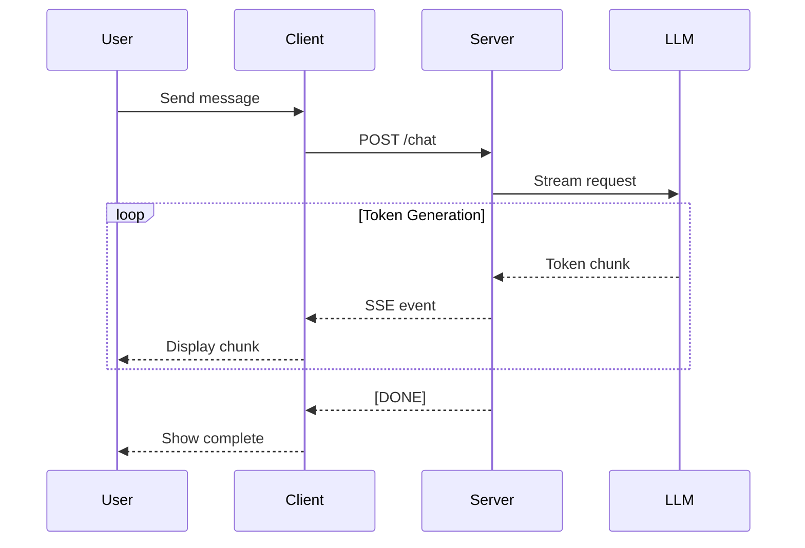

# Streaming Text Display

## Overview

Streaming text display is what makes AI chat interfaces feel alive. Instead of waiting for a complete response, users see text appear in real-time, creating an engaging, responsive experience that mimics natural conversation.

This lesson covers the techniques and patterns for displaying streamed AI responses smoothly and efficiently.

---

## Topics in This Lesson

| # | Topic | Description |
|---|-------|-------------|
| 01 | [Displaying Text as It Arrives](./01-displaying-text-as-it-arrives.md) | DOM updates, batch rendering, avoiding thrashing |
| 02 | [Character vs Chunk Display](./02-character-vs-chunk-display.md) | Typing effects, chunk optimization, throttling |
| 03 | [Cursor Indicators](./03-cursor-indicators.md) | Blinking cursors, animated indicators, position management |
| 04 | [Text Appearance Animations](./04-text-appearance-animations.md) | Fade-in effects, typewriter animations, CSS transitions |
| 05 | [Scroll Behavior During Streaming](./05-scroll-behavior-during-streaming.md) | Auto-scroll, smooth scrolling, position preservation |
| 06 | [Auto-Scroll with User Override](./06-auto-scroll-with-user-override.md) | Detecting user scroll, pause/resume, state management |
| 07 | [AI SDK Streaming States](./07-ai-sdk-streaming-states.md) | Status handling, UI rendering, error states |
| 08 | [Performance Optimization](./08-performance-optimization.md) | Throttling, render batching, virtual DOM optimization |

---

## Prerequisites

Before starting this lesson, you should understand:
- [Message Components](../02-message-components/00-message-components.md)
- JavaScript async/await and Promises
- Basic DOM manipulation
- CSS animations fundamentals

---

## Why Streaming Matters

### User Experience Benefits

| Aspect | Without Streaming | With Streaming |
|--------|-------------------|----------------|
| **Perceived Speed** | Wait for full response | Instant feedback |
| **Engagement** | Passive waiting | Active reading |
| **Transparency** | Black box processing | Visible progress |
| **Error Recovery** | Lose entire response | Partial content preserved |
| **Interruption** | Can't stop generation | Cancel mid-stream |

### Technical Flow



---

## Core Concepts

### Streaming Protocols

| Protocol | Use Case | Characteristics |
|----------|----------|-----------------|
| **Server-Sent Events (SSE)** | Most AI APIs | Unidirectional, text-based, auto-reconnect |
| **WebSocket** | Real-time bidirectional | Full-duplex, binary support |
| **Fetch Streaming** | Modern browsers | Native, no library needed |
| **Long Polling** | Legacy fallback | Higher latency, more overhead |

### AI SDK Status States

```typescript
type StreamStatus = 
  | 'submitted'   // Request sent, awaiting first token
  | 'streaming'   // Actively receiving tokens
  | 'ready'       // Complete, ready for next input
  | 'error';      // Something went wrong
```

### Performance Considerations

- **Render batching**: Group multiple chunks before DOM update
- **Throttling**: Limit update frequency (e.g., 50ms minimum)
- **Layout thrashing**: Avoid read-write-read-write cycles
- **Memory management**: Clean up event listeners and buffers

---

## What You'll Build

By the end of this lesson, you'll be able to:
- Display streaming text efficiently with minimal re-renders
- Implement smooth cursor and typing animations
- Handle scroll behavior during active streams
- Use AI SDK streaming states for UI control
- Optimize performance for long conversations

---

## Real-World Examples

### ChatGPT-Style Streaming
- Text appears word-by-word with slight delay
- Cursor blinks at insertion point
- Auto-scrolls while generating

### Claude-Style Streaming
- Faster chunk display
- Smooth fade-in animation
- "Stop generating" button visible

### Copilot-Style Streaming
- Inline code highlighting during stream
- Markdown rendered progressively
- Collapsible thinking sections

---

## Key Takeaways

✅ Streaming provides instant feedback and better UX  
✅ Batch DOM updates to avoid performance issues  
✅ Handle scroll carefully—respect user intent  
✅ AI SDK provides built-in streaming state management  
✅ Throttle renders to balance smoothness and performance

---

## Further Reading

- [Vercel AI SDK Streaming](https://sdk.vercel.ai/docs/ai-sdk-ui/streaming)
- [MDN Server-Sent Events](https://developer.mozilla.org/en-US/docs/Web/API/Server-sent_events)
- [ReadableStream API](https://developer.mozilla.org/en-US/docs/Web/API/ReadableStream)

---

**Previous:** [Message Components](../02-message-components/00-message-components.md)  
**Next:** [Displaying Text as It Arrives](./01-displaying-text-as-it-arrives.md)
