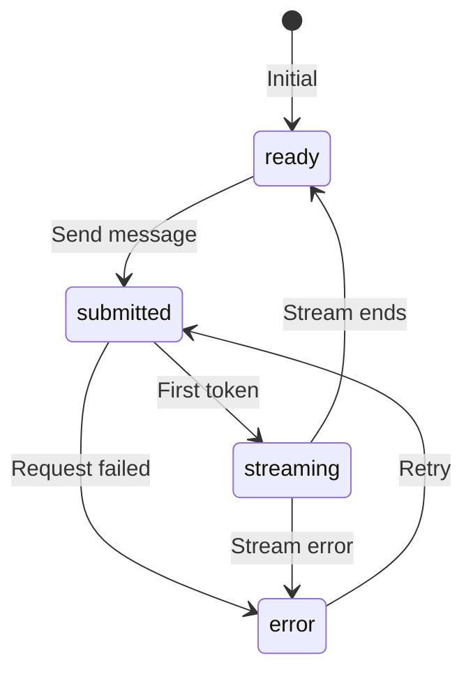

# AI SDK Streaming States

## Introduction

The Vercel AI SDK provides structured states for streaming responses. Understanding these states—`submitted`, `streaming`, `ready`, and `error`—enables precise UI control during AI interactions.

In this lesson, we'll leverage the AI SDK's `status` property to build responsive, state-aware interfaces.

### What We'll Cover

- AI SDK status states explained
- UI rendering for each state
- Handling state transitions
- Error states and recovery
- The `experimental_throttle` option

### Prerequisites

- [Displaying Text as It Arrives](./01-displaying-text-as-it-arrives.md)
- React basics and hooks
- Vercel AI SDK fundamentals

---

## Understanding Status States

### The Four States

| Status | Description | UI Behavior |
|--------|-------------|-------------|
| `submitted` | Request sent, awaiting first token | Show loading indicator |
| `streaming` | Tokens actively arriving | Show content + cursor |
| `ready` | Stream complete, response done | Remove cursor, enable input |
| `error` | Something went wrong | Show error, enable retry |

### State Flow Diagram



### Basic Usage

```jsx
import { useChat } from 'ai/react';

function Chat() {
  const { messages, input, handleInputChange, handleSubmit, status, error } = useChat({
    api: '/api/chat',
  });
  
  return (
    <div className="chat">
      <MessageList messages={messages} status={status} />
      <StatusIndicator status={status} error={error} />
      <InputForm
        value={input}
        onChange={handleInputChange}
        onSubmit={handleSubmit}
        disabled={status !== 'ready'}
      />
    </div>
  );
}
```

---

## Status-Aware Components

### Message List with Status

```jsx
function MessageList({ messages, status }) {
  return (
    <div className="messages" role="log" aria-live="polite">
      {messages.map((message, index) => {
        const isLastAssistant = 
          index === messages.length - 1 && 
          message.role === 'assistant';
        
        return (
          <Message
            key={message.id}
            message={message}
            isStreaming={isLastAssistant && status === 'streaming'}
            isLoading={isLastAssistant && status === 'submitted'}
          />
        );
      })}
      
      {/* Loading indicator when waiting for first token */}
      {status === 'submitted' && messages.length > 0 && (
        <LoadingMessage />
      )}
    </div>
  );
}
```

### Individual Message Component

```jsx
function Message({ message, isStreaming, isLoading }) {
  const isUser = message.role === 'user';
  
  return (
    <div className={`message ${message.role}`}>
      <div className="message-avatar">
        {isUser ? '👤' : '🤖'}
      </div>
      
      <div className="message-content">
        {isLoading ? (
          <LoadingDots />
        ) : (
          <>
            <span className="message-text">{message.content}</span>
            {isStreaming && <StreamingCursor />}
          </>
        )}
      </div>
    </div>
  );
}
```

### Loading States

```jsx
function LoadingMessage() {
  return (
    <div className="message assistant loading">
      <div className="message-avatar">🤖</div>
      <div className="message-content">
        <LoadingDots />
      </div>
    </div>
  );
}

function LoadingDots() {
  return (
    <span className="loading-dots" aria-label="Loading">
      <span>.</span>
      <span>.</span>
      <span>.</span>
    </span>
  );
}
```

```css
.loading-dots span {
  animation: dot-pulse 1.4s ease-in-out infinite;
}

.loading-dots span:nth-child(1) { animation-delay: 0s; }
.loading-dots span:nth-child(2) { animation-delay: 0.2s; }
.loading-dots span:nth-child(3) { animation-delay: 0.4s; }

@keyframes dot-pulse {
  0%, 80%, 100% { opacity: 0; }
  40% { opacity: 1; }
}
```

---

## Handling State Transitions

### Status Change Effects

```jsx
function useStatusEffects(status, options = {}) {
  const prevStatusRef = useRef(status);
  
  useEffect(() => {
    const prevStatus = prevStatusRef.current;
    
    // Transition: ready -> submitted
    if (prevStatus === 'ready' && status === 'submitted') {
      options.onSubmit?.();
    }
    
    // Transition: submitted -> streaming
    if (prevStatus === 'submitted' && status === 'streaming') {
      options.onStreamStart?.();
    }
    
    // Transition: streaming -> ready
    if (prevStatus === 'streaming' && status === 'ready') {
      options.onStreamEnd?.();
    }
    
    // Transition: any -> error
    if (status === 'error' && prevStatus !== 'error') {
      options.onError?.();
    }
    
    prevStatusRef.current = status;
  }, [status, options]);
}

// Usage
function Chat() {
  const { status, messages } = useChat();
  
  useStatusEffects(status, {
    onSubmit: () => console.log('Message sent'),
    onStreamStart: () => console.log('Streaming started'),
    onStreamEnd: () => {
      console.log('Stream complete');
      // Maybe trigger analytics, save to history, etc.
    },
    onError: () => console.error('Stream error occurred')
  });
  
  return <MessageList messages={messages} status={status} />;
}
```

### Animated Status Transitions

```jsx
function StatusBadge({ status }) {
  const [displayStatus, setDisplayStatus] = useState(status);
  const [isTransitioning, setIsTransitioning] = useState(false);
  
  useEffect(() => {
    if (status !== displayStatus) {
      setIsTransitioning(true);
      
      const timer = setTimeout(() => {
        setDisplayStatus(status);
        setIsTransitioning(false);
      }, 200);  // Match CSS transition
      
      return () => clearTimeout(timer);
    }
  }, [status, displayStatus]);
  
  const statusText = {
    ready: 'Ready',
    submitted: 'Sending...',
    streaming: 'Generating...',
    error: 'Error'
  };
  
  return (
    <span 
      className={`status-badge ${displayStatus} ${isTransitioning ? 'transitioning' : ''}`}
    >
      {statusText[displayStatus]}
    </span>
  );
}
```

```css
.status-badge {
  padding: 4px 8px;
  border-radius: 4px;
  font-size: 12px;
  transition: background-color 0.2s, opacity 0.2s;
}

.status-badge.ready { background: #e8f5e9; color: #2e7d32; }
.status-badge.submitted { background: #fff3e0; color: #ef6c00; }
.status-badge.streaming { background: #e3f2fd; color: #1565c0; }
.status-badge.error { background: #ffebee; color: #c62828; }

.status-badge.transitioning {
  opacity: 0.5;
}
```

---

## Error State Handling

### Error Display Component

```jsx
function ErrorState({ error, onRetry }) {
  if (!error) return null;
  
  const errorMessage = error.message || 'An unexpected error occurred';
  
  return (
    <div className="error-state" role="alert">
      <div className="error-icon">⚠️</div>
      <div className="error-content">
        <p className="error-message">{errorMessage}</p>
        <button 
          className="retry-button"
          onClick={onRetry}
        >
          Try again
        </button>
      </div>
    </div>
  );
}
```

### Chat with Error Recovery

```jsx
function ChatWithErrorHandling() {
  const { 
    messages, 
    input, 
    handleInputChange, 
    handleSubmit, 
    status, 
    error,
    reload,  // Retry last message
    stop     // Cancel streaming
  } = useChat({
    api: '/api/chat',
    onError: (error) => {
      console.error('Chat error:', error);
      // Optional: Report to error tracking
    }
  });
  
  return (
    <div className="chat">
      <MessageList messages={messages} status={status} />
      
      {status === 'error' && (
        <ErrorState 
          error={error}
          onRetry={() => reload()}
        />
      )}
      
      <InputForm
        value={input}
        onChange={handleInputChange}
        onSubmit={handleSubmit}
        disabled={status === 'submitted' || status === 'streaming'}
      />
      
      {status === 'streaming' && (
        <button onClick={stop} className="stop-button">
          Stop generating
        </button>
      )}
    </div>
  );
}
```

### Retry with Exponential Backoff

```jsx
function useAutoRetry(reload, error, maxRetries = 3) {
  const [retryCount, setRetryCount] = useState(0);
  
  useEffect(() => {
    if (!error || retryCount >= maxRetries) return;
    
    const delay = Math.min(1000 * Math.pow(2, retryCount), 10000);
    
    const timer = setTimeout(() => {
      setRetryCount(prev => prev + 1);
      reload();
    }, delay);
    
    return () => clearTimeout(timer);
  }, [error, retryCount, maxRetries, reload]);
  
  const resetRetries = () => setRetryCount(0);
  
  return { retryCount, resetRetries };
}
```

---

## The experimental_throttle Option

### Purpose

`experimental_throttle` limits how often the UI re-renders during streaming. Without throttling, every token triggers a re-render—potentially 60+ times per second.

### Configuration

```jsx
const { messages, status } = useChat({
  api: '/api/chat',
  experimental_throttle: 50,  // ms between updates
});
```

### Throttle Values

| Value | Updates/sec | Use Case |
|-------|-------------|----------|
| `0` (default) | Unlimited | Low-volume streams |
| `16` | 60 | Match 60fps refresh |
| `50` | 20 | Balanced performance |
| `100` | 10 | Heavy applications |
| `200` | 5 | Very complex UIs |

### When to Use

```jsx
// Simple chat: No throttle needed
const { messages } = useChat({
  api: '/api/chat',
});

// Complex UI with markdown/code: Throttle recommended
const { messages } = useChat({
  api: '/api/chat',
  experimental_throttle: 50,
});

// Heavy rendering (syntax highlighting, LaTeX): Higher throttle
const { messages } = useChat({
  api: '/api/chat',
  experimental_throttle: 100,
});
```

### Custom Throttling Hook

If you need more control than `experimental_throttle`:

```jsx
function useThrottledValue(value, delay) {
  const [throttledValue, setThrottledValue] = useState(value);
  const lastUpdateRef = useRef(Date.now());
  const timeoutRef = useRef(null);
  
  useEffect(() => {
    const now = Date.now();
    const timeSinceLastUpdate = now - lastUpdateRef.current;
    
    if (timeSinceLastUpdate >= delay) {
      setThrottledValue(value);
      lastUpdateRef.current = now;
    } else {
      timeoutRef.current = setTimeout(() => {
        setThrottledValue(value);
        lastUpdateRef.current = Date.now();
      }, delay - timeSinceLastUpdate);
    }
    
    return () => {
      if (timeoutRef.current) {
        clearTimeout(timeoutRef.current);
      }
    };
  }, [value, delay]);
  
  return throttledValue;
}

// Usage
function OptimizedMessage({ content }) {
  const throttledContent = useThrottledValue(content, 50);
  
  return <MarkdownRenderer content={throttledContent} />;
}
```

---

## Complete Status-Aware Chat

```jsx
function StatusAwareChat() {
  const { 
    messages, 
    input, 
    handleInputChange, 
    handleSubmit, 
    status, 
    error,
    reload,
    stop 
  } = useChat({
    api: '/api/chat',
    experimental_throttle: 50,
  });
  
  const isInputDisabled = status === 'submitted' || status === 'streaming';
  const lastMessage = messages[messages.length - 1];
  const showCursor = status === 'streaming' && lastMessage?.role === 'assistant';
  
  return (
    <div className="chat">
      <header className="chat-header">
        <h1>AI Assistant</h1>
        <StatusBadge status={status} />
      </header>
      
      <div className="messages-container">
        {messages.map((msg, i) => (
          <Message
            key={msg.id}
            message={msg}
            isStreaming={i === messages.length - 1 && showCursor}
          />
        ))}
        
        {status === 'submitted' && (
          <LoadingMessage />
        )}
        
        {status === 'error' && (
          <ErrorState error={error} onRetry={reload} />
        )}
      </div>
      
      <footer className="chat-footer">
        {status === 'streaming' && (
          <button 
            onClick={stop}
            className="stop-button"
            aria-label="Stop generating"
          >
            ⏹ Stop
          </button>
        )}
        
        <form onSubmit={handleSubmit} className="input-form">
          <input
            type="text"
            value={input}
            onChange={handleInputChange}
            placeholder={isInputDisabled ? 'Waiting...' : 'Type a message...'}
            disabled={isInputDisabled}
            aria-label="Message input"
          />
          <button 
            type="submit" 
            disabled={isInputDisabled || !input.trim()}
            aria-label="Send message"
          >
            Send
          </button>
        </form>
      </footer>
    </div>
  );
}
```

---

## Status Debugging

### Debug Component

```jsx
function StatusDebugger({ status, messages }) {
  const [history, setHistory] = useState([]);
  
  useEffect(() => {
    setHistory(prev => [
      ...prev.slice(-9),  // Keep last 10
      { status, timestamp: new Date().toISOString() }
    ]);
  }, [status]);
  
  if (process.env.NODE_ENV !== 'development') {
    return null;
  }
  
  return (
    <div className="status-debugger">
      <h4>Status History</h4>
      <ul>
        {history.map((entry, i) => (
          <li key={i}>
            <span className={`status-dot ${entry.status}`} />
            {entry.status} at {entry.timestamp}
          </li>
        ))}
      </ul>
      <p>Messages: {messages.length}</p>
    </div>
  );
}
```

---

## Best Practices

| ✅ Do | ❌ Don't |
|-------|---------|
| Check status before actions | Ignore current state |
| Disable input during streaming | Allow multiple submissions |
| Show loading states for `submitted` | Leave UI empty |
| Provide stop button for `streaming` | Force users to wait |
| Handle errors gracefully | Let errors crash UI |

---

## Common Pitfalls

| ❌ Mistake | ✅ Solution |
|-----------|-------------|
| Not distinguishing `submitted` from `streaming` | Check both states for loading UI |
| Forgetting to handle `error` state | Always check `error` and show retry |
| Over-rendering during stream | Use `experimental_throttle` |
| Stop button not provided | Always offer stream cancellation |
| Status badge missing | Show current state to users |

---

## Hands-on Exercise

### Your Task

Build a status-aware chat interface that:
1. Shows different UI for each status
2. Displays loading animation for `submitted`
3. Shows streaming cursor during `streaming`
4. Provides retry button for `error`

### Requirements

1. Use all four status states
2. Disable input appropriately
3. Show stop button during streaming
4. Animate status transitions

<details>
<summary>💡 Hints (click to expand)</summary>

- Destructure `status` and `error` from `useChat`
- Use `status === 'streaming'` for cursor
- Use `status === 'submitted'` for loading dots
- Use `status === 'error' && error` for error display

</details>

<details>
<summary>✅ Solution (click to expand)</summary>

See the `StatusAwareChat` component in the Complete Status-Aware Chat section above.

</details>

---

## Summary

✅ **Four states** (`submitted`, `streaming`, `ready`, `error`) cover all scenarios  
✅ **`submitted`** means waiting for first token—show loading  
✅ **`streaming`** means tokens arriving—show cursor  
✅ **`error`** needs user action—show retry button  
✅ **`experimental_throttle`** improves performance for complex UIs  
✅ **Status transitions** can trigger side effects

---

## Further Reading

- [AI SDK useChat Reference](https://sdk.vercel.ai/docs/reference/ai-sdk-ui/use-chat)
- [AI SDK Streaming](https://sdk.vercel.ai/docs/ai-sdk-core/generating-text#streaming-text)
- [React Effect Lifecycle](https://react.dev/learn/lifecycle-of-reactive-effects)

---

**Previous:** [Auto-Scroll with User Override](./06-auto-scroll-with-user-override.md)  
**Next:** [Performance Optimization](./08-performance-optimization.md)

<!-- 
Sources Consulted:
- Vercel AI SDK useChat: https://sdk.vercel.ai/docs/reference/ai-sdk-ui/use-chat
- Vercel AI SDK Streaming: https://sdk.vercel.ai/docs/ai-sdk-core/generating-text
- React useEffect: https://react.dev/reference/react/useEffect
-->
