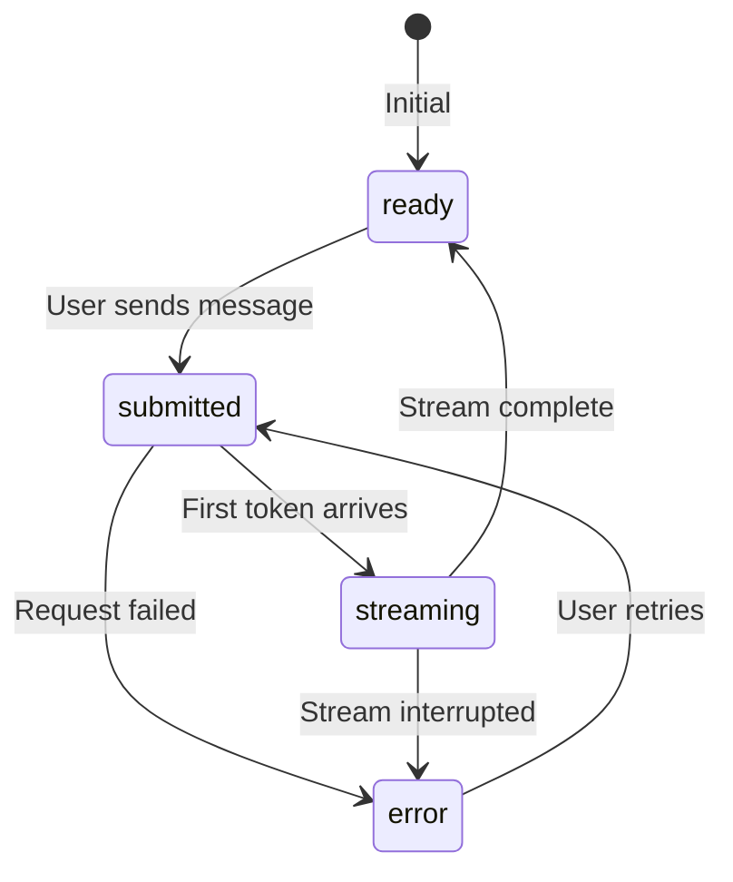

# Loading & Status Indicators

## Introduction

AI responses take time—sometimes seconds, sometimes minutes. Loading indicators set expectations, reduce perceived wait time, and keep users engaged. Good indicators communicate progress; great indicators make waiting feel effortless.

This lesson covers typing indicators, skeleton loaders, progress bars, status messages, and cancellation UI patterns for chat interfaces.

---

## What You'll Learn

| Topic | File | Description |
|-------|------|-------------|
| Typing Indicators | [01-typing-indicators.md](./01-typing-indicators.md) | Animated dots, pulsing, "AI is thinking" |
| Skeleton Loading | [02-skeleton-loading-states.md](./02-skeleton-loading-states.md) | Placeholders, shimmer, transitions |
| Progress Indicators | [03-progress-indicators.md](./03-progress-indicators.md) | Bars, steps, time estimates |
| Status Messages | [04-status-messages.md](./04-status-messages.md) | Connecting, generating, queue position |
| Cancellation UI | [05-cancellation-ui.md](./05-cancellation-ui.md) | Stop buttons, partial results, resume |
| useChat Status Integration | [06-usechat-status-integration.md](./06-usechat-status-integration.md) | AI SDK status, stop(), reload() |

---

## Prerequisites

Before starting this lesson, you should understand:

- [Streaming Text Display](../03-streaming-text-display/00-streaming-text-display.md) - How text streams into the UI
- CSS animations and keyframes
- React state management basics

---

## Why Loading Indicators Matter

### The Psychology of Waiting

| Wait Time | User Perception | Solution |
|-----------|-----------------|----------|
| < 100ms | Instant | None needed |
| 100ms - 1s | Brief delay | Subtle indicator |
| 1s - 10s | Noticeable wait | Progress indicator |
| > 10s | Long operation | Detailed progress + cancel |

### Indicator Types by Use Case

| Scenario | Recommended Indicator |
|----------|----------------------|
| Waiting for first token | Typing dots |
| Streaming response | Cursor + status text |
| Long processing | Progress bar + time estimate |
| Background task | Toast with spinner |
| Error recovery | Status message + retry |

---

## AI SDK Status States

The Vercel AI SDK provides four status states that drive indicator logic:



| Status | What to Show |
|--------|--------------|
| `ready` | Input enabled, no indicator |
| `submitted` | Typing indicator, input disabled |
| `streaming` | Content + cursor + stop button |
| `error` | Error message + retry button |

---

## Quick Start Example

```jsx
import { useChat } from 'ai/react';

function ChatWithIndicators() {
  const { messages, input, handleInputChange, handleSubmit, status, stop, reload } = useChat();
  
  return (
    <div className="chat">
      <MessageList messages={messages} />
      
      {/* Status-driven indicators */}
      {status === 'submitted' && <TypingIndicator />}
      {status === 'streaming' && <StopButton onClick={stop} />}
      {status === 'error' && <RetryButton onClick={reload} />}
      
      <InputForm
        value={input}
        onChange={handleInputChange}
        onSubmit={handleSubmit}
        disabled={status !== 'ready'}
      />
    </div>
  );
}
```

---

## Key Concepts

### 1. Typing Indicators

Animated patterns that signal "AI is thinking":

```css
.typing-dots span {
  animation: dot-bounce 1.4s ease-in-out infinite;
}
```

### 2. Skeleton Loading

Placeholder shapes that match expected content:

```jsx
<div className="skeleton-message">
  <div className="skeleton-line" style={{ width: '80%' }} />
  <div className="skeleton-line" style={{ width: '60%' }} />
</div>
```

### 3. Progress Indicators

Visual feedback for multi-step or long operations:

```jsx
<ProgressBar value={progress} max={100} />
<span>{timeRemaining} remaining</span>
```

### 4. Cancellation

Always provide a way out:

```jsx
<button onClick={stop}>Stop generating</button>
```

---

## Key Takeaways

✅ **Match indicator to wait time**—brief delays need subtle indicators  
✅ **Show progress** for operations longer than 3 seconds  
✅ **Always provide cancel** for streaming responses  
✅ **Use AI SDK status** to drive indicator logic  
✅ **Animate smoothly** for perceived performance  
✅ **Handle errors gracefully** with retry options

---

## Further Reading

- [AI SDK useChat Reference](https://sdk.vercel.ai/docs/reference/ai-sdk-ui/use-chat)
- [Nielsen Norman: Response Time Limits](https://www.nngroup.com/articles/response-times-3-important-limits/)
- [CSS Animations Guide](https://developer.mozilla.org/en-US/docs/Web/CSS/CSS_Animations)

---

**Previous:** [Streaming Text Display](../03-streaming-text-display/00-streaming-text-display.md)  
**Next:** [Typing Indicators](./01-typing-indicators.md)
