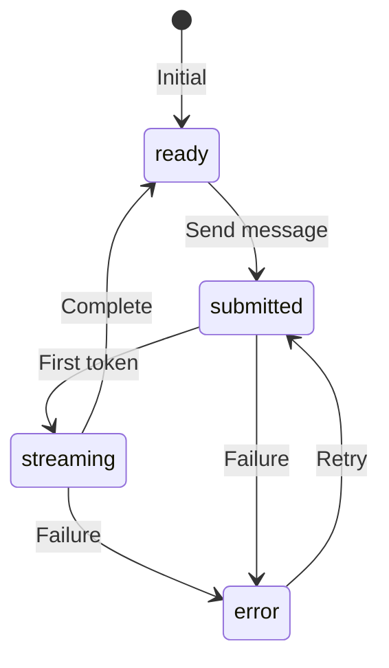

# useChat Status Integration

## Introduction

The AI SDK's `useChat` hook provides a `status` property that tracks the chat lifecycle: submitted, streaming, ready, and error. Integrating this status into your UI creates responsive, informative interfaces that react instantly to state changes.

In this lesson, we'll connect all our loading indicators to the AI SDK's status system.

### What We'll Cover

- Understanding `useChat` status values
- Status-driven UI components
- The `stop()` and `reload()` methods
- Error handling with status
- Building responsive chat states

### Prerequisites

- [Cancellation UI](./05-cancellation-ui.md)
- AI SDK `useChat` hook basics
- React conditional rendering

---

## Status Values

### The Status Lifecycle



### Status Definitions

| Status | Description | UI State |
|--------|-------------|----------|
| `ready` | Idle, waiting for input | Show send button |
| `submitted` | Request sent, waiting | Show spinner |
| `streaming` | Receiving tokens | Show stop button + cursor |
| `error` | Request failed | Show retry button |

### Accessing Status

```jsx
import { useChat } from 'ai/react';

function Chat() {
  const { 
    messages, 
    input, 
    handleInputChange, 
    handleSubmit,
    status,        // 'ready' | 'submitted' | 'streaming' | 'error'
    stop,          // () => void
    reload,        // () => Promise
    error          // Error | undefined
  } = useChat();
  
  return (
    <div>
      <p>Current status: {status}</p>
    </div>
  );
}
```

---

## Status-Driven Components

### Submit Button States

```jsx
function SubmitButton({ status, onStop }) {
  switch (status) {
    case 'submitted':
      return (
        <button disabled className="submit-btn loading">
          <Spinner size={16} />
          <span className="sr-only">Sending...</span>
        </button>
      );
      
    case 'streaming':
      return (
        <button onClick={onStop} className="submit-btn stop">
          <StopIcon />
          <span className="sr-only">Stop generating</span>
        </button>
      );
      
    case 'error':
      return (
        <button type="submit" className="submit-btn error">
          <RetryIcon />
          <span>Retry</span>
        </button>
      );
      
    default:  // 'ready'
      return (
        <button type="submit" className="submit-btn">
          <SendIcon />
          <span className="sr-only">Send message</span>
        </button>
      );
  }
}
```

```css
.submit-btn {
  width: 40px;
  height: 40px;
  border: none;
  border-radius: 50%;
  cursor: pointer;
  display: flex;
  align-items: center;
  justify-content: center;
  transition: background 0.2s, transform 0.1s;
}

.submit-btn:not(:disabled):hover {
  transform: scale(1.05);
}

.submit-btn:not(:disabled):active {
  transform: scale(0.95);
}

.submit-btn.loading {
  background: var(--muted-bg, #e9ecef);
  cursor: wait;
}

.submit-btn.stop {
  background: var(--stop-color, #dc3545);
  color: white;
}

.submit-btn.error {
  width: auto;
  padding: 8px 16px;
  border-radius: 20px;
  gap: 6px;
}
```

### Input Field States

```jsx
function ChatInput({ status, input, onChange, onSubmit, onStop }) {
  const inputRef = useRef(null);
  
  // Focus input when ready
  useEffect(() => {
    if (status === 'ready') {
      inputRef.current?.focus();
    }
  }, [status]);
  
  const isDisabled = status === 'submitted' || status === 'streaming';
  
  return (
    <form onSubmit={onSubmit} className="chat-input-form">
      <input
        ref={inputRef}
        type="text"
        value={input}
        onChange={onChange}
        disabled={isDisabled}
        placeholder={
          status === 'streaming' ? 'AI is responding...' :
          status === 'submitted' ? 'Sending...' :
          'Type your message...'
        }
        className={`chat-input ${status}`}
      />
      <SubmitButton status={status} onStop={onStop} />
    </form>
  );
}
```

```css
.chat-input {
  flex: 1;
  padding: 12px 16px;
  border: 2px solid var(--border-color, #dee2e6);
  border-radius: 24px;
  font-size: 16px;
  transition: border-color 0.2s, opacity 0.2s;
}

.chat-input:focus {
  outline: none;
  border-color: var(--primary-color, #007bff);
}

.chat-input.submitted,
.chat-input.streaming {
  opacity: 0.6;
  cursor: not-allowed;
}

.chat-input.error {
  border-color: var(--error-color, #dc3545);
}
```

### Message List States

```jsx
function MessageList({ messages, status }) {
  const bottomRef = useRef(null);
  
  // Auto-scroll during streaming
  useEffect(() => {
    if (status === 'streaming') {
      bottomRef.current?.scrollIntoView({ behavior: 'smooth' });
    }
  }, [messages, status]);
  
  return (
    <div className="message-list">
      {messages.map(msg => (
        <Message key={msg.id} {...msg} />
      ))}
      
      {/* Typing indicator for submitted state */}
      {status === 'submitted' && (
        <div className="message assistant">
          <TypingIndicator />
        </div>
      )}
      
      <div ref={bottomRef} />
    </div>
  );
}
```

---

## Stop and Reload Methods

### Using stop()

```jsx
function StreamingControls({ status, stop }) {
  if (status !== 'streaming') return null;
  
  return (
    <div className="streaming-controls">
      <button 
        onClick={stop}
        className="stop-btn"
        aria-label="Stop generating response"
      >
        <span className="stop-icon">■</span>
        Stop generating
      </button>
      
      <span className="streaming-hint">
        or press <kbd>Esc</kbd>
      </span>
    </div>
  );
}
```

### Using reload()

```jsx
function MessageActions({ message, reload, isLast }) {
  if (message.role !== 'assistant' || !isLast) return null;
  
  return (
    <div className="message-actions">
      <button 
        onClick={reload}
        className="regenerate-btn"
        aria-label="Regenerate response"
      >
        <RegenerateIcon />
        Regenerate
      </button>
      
      <button className="copy-btn">
        <CopyIcon />
        Copy
      </button>
    </div>
  );
}
```

### Keyboard Integration

```jsx
function useChatKeyboard({ status, stop, inputRef }) {
  useEffect(() => {
    const handleKeyDown = (e) => {
      // Escape to stop streaming
      if (e.key === 'Escape' && status === 'streaming') {
        e.preventDefault();
        stop();
        return;
      }
      
      // Focus input with / key when ready
      if (e.key === '/' && status === 'ready') {
        if (document.activeElement !== inputRef.current) {
          e.preventDefault();
          inputRef.current?.focus();
        }
      }
    };
    
    document.addEventListener('keydown', handleKeyDown);
    return () => document.removeEventListener('keydown', handleKeyDown);
  }, [status, stop, inputRef]);
}
```

---

## Error Handling

### Error Display Component

```jsx
function ChatError({ error, reload, status }) {
  if (status !== 'error' || !error) return null;
  
  // Parse error type for user-friendly message
  const errorInfo = parseError(error);
  
  return (
    <div className="chat-error" role="alert">
      <div className="error-icon">⚠️</div>
      
      <div className="error-content">
        <h4 className="error-title">{errorInfo.title}</h4>
        <p className="error-message">{errorInfo.message}</p>
      </div>
      
      <div className="error-actions">
        <button onClick={reload} className="retry-btn">
          Try again
        </button>
      </div>
    </div>
  );
}

function parseError(error) {
  if (error.message?.includes('429')) {
    return {
      title: 'Rate limited',
      message: 'Too many requests. Please wait a moment.'
    };
  }
  
  if (error.message?.includes('401')) {
    return {
      title: 'Authentication error',
      message: 'Please check your API key.'
    };
  }
  
  if (error.message?.includes('network')) {
    return {
      title: 'Connection error',
      message: 'Check your internet connection.'
    };
  }
  
  return {
    title: 'Something went wrong',
    message: error.message || 'Please try again.'
  };
}
```

```css
.chat-error {
  display: flex;
  align-items: flex-start;
  gap: 12px;
  padding: 16px;
  background: var(--error-bg, #fee2e2);
  border: 1px solid var(--error-border, #fecaca);
  border-radius: 8px;
  margin: 16px;
}

.error-icon {
  font-size: 24px;
}

.error-content {
  flex: 1;
}

.error-title {
  margin: 0 0 4px 0;
  font-size: 16px;
  color: var(--error-text, #991b1b);
}

.error-message {
  margin: 0;
  color: var(--error-text-light, #b91c1c);
  font-size: 14px;
}

.retry-btn {
  padding: 8px 16px;
  background: var(--error-text, #991b1b);
  color: white;
  border: none;
  border-radius: 6px;
  cursor: pointer;
}

.retry-btn:hover {
  background: var(--error-text-light, #b91c1c);
}
```

### Error Recovery Flow

```jsx
function useErrorRecovery({ error, status, reload }) {
  const [retryCount, setRetryCount] = useState(0);
  const maxRetries = 3;
  
  const handleRetry = async () => {
    if (retryCount >= maxRetries) {
      return;  // Max retries reached
    }
    
    setRetryCount(prev => prev + 1);
    await reload();
  };
  
  // Reset retry count on successful completion
  useEffect(() => {
    if (status === 'ready' && retryCount > 0) {
      setRetryCount(0);
    }
  }, [status, retryCount]);
  
  return {
    handleRetry,
    retryCount,
    canRetry: retryCount < maxRetries,
    isRetrying: status === 'submitted' && retryCount > 0
  };
}
```

---

## Complete Integration

### Full Chat Component

```jsx
import { useChat } from 'ai/react';

function CompleteChat() {
  const {
    messages,
    input,
    handleInputChange,
    handleSubmit,
    status,
    stop,
    reload,
    error
  } = useChat({
    api: '/api/chat',
    onError: (err) => console.error('Chat error:', err)
  });
  
  const inputRef = useRef(null);
  
  // Keyboard shortcuts
  useChatKeyboard({ status, stop, inputRef });
  
  // Error recovery
  const { handleRetry, canRetry } = useErrorRecovery({ 
    error, status, reload 
  });
  
  return (
    <div className="chat-container">
      {/* Status Bar */}
      <ChatStatusBar status={status} />
      
      {/* Messages */}
      <div className="messages-container">
        <MessageList messages={messages} status={status} />
        
        {/* Streaming indicator */}
        {status === 'streaming' && (
          <StreamingControls status={status} stop={stop} />
        )}
        
        {/* Error display */}
        <ChatError 
          error={error} 
          reload={canRetry ? handleRetry : undefined}
          status={status}
        />
      </div>
      
      {/* Input */}
      <ChatInput
        ref={inputRef}
        status={status}
        input={input}
        onChange={handleInputChange}
        onSubmit={handleSubmit}
        onStop={stop}
      />
    </div>
  );
}
```

### Status Bar Component

```jsx
function ChatStatusBar({ status }) {
  const statusConfig = {
    ready: { icon: '🟢', text: 'Ready', show: false },
    submitted: { icon: '⏳', text: 'Sending...', show: true },
    streaming: { icon: '✨', text: 'Generating...', show: true },
    error: { icon: '⚠️', text: 'Error', show: true }
  };
  
  const config = statusConfig[status];
  
  if (!config.show) return null;
  
  return (
    <div className={`status-bar ${status}`} role="status" aria-live="polite">
      <span className="status-icon">{config.icon}</span>
      <span className="status-text">{config.text}</span>
      
      {status === 'streaming' && (
        <span className="token-counter">
          {/* Token count if available */}
        </span>
      )}
    </div>
  );
}
```

```css
.status-bar {
  display: flex;
  align-items: center;
  gap: 8px;
  padding: 8px 16px;
  font-size: 13px;
  border-bottom: 1px solid var(--border-color);
  animation: slide-down 0.2s ease-out;
}

.status-bar.submitted {
  background: var(--info-bg, #e3f2fd);
  color: var(--info-text, #1565c0);
}

.status-bar.streaming {
  background: var(--success-bg, #e8f5e9);
  color: var(--success-text, #2e7d32);
}

.status-bar.error {
  background: var(--error-bg, #ffebee);
  color: var(--error-text, #c62828);
}

@keyframes slide-down {
  from {
    opacity: 0;
    transform: translateY(-100%);
  }
  to {
    opacity: 1;
    transform: translateY(0);
  }
}
```

---

## Optimistic Updates

### Immediate Feedback

```jsx
function OptimisticChat() {
  const { messages, handleSubmit, status } = useChat();
  const [optimisticInput, setOptimisticInput] = useState('');
  
  const onSubmit = (e) => {
    e.preventDefault();
    
    // Show user message immediately
    setOptimisticInput('');
    handleSubmit(e);
  };
  
  // Combine real messages with optimistic ones
  const displayMessages = useMemo(() => {
    if (status === 'submitted' && optimisticInput) {
      return [
        ...messages,
        { id: 'optimistic', role: 'user', content: optimisticInput }
      ];
    }
    return messages;
  }, [messages, status, optimisticInput]);
  
  return (
    <MessageList messages={displayMessages} status={status} />
  );
}
```

---

## Best Practices

| ✅ Do | ❌ Don't |
|-------|---------|
| Show distinct UI for each status | Use same UI for all states |
| Disable input during submission | Allow double-submissions |
| Auto-focus input when ready | Require manual focus |
| Provide keyboard shortcuts | Mouse-only interaction |
| Parse errors for user display | Show raw error messages |

---

## Common Pitfalls

| ❌ Mistake | ✅ Solution |
|-----------|-------------|
| UI flickers between states | Add transition delays |
| Status not updating | Check component re-renders |
| Stop doesn't work | Verify `stop()` is from hook |
| Error persists after retry | Status should return to submitted |
| Input enabled during stream | Check all loading states |

---

## Hands-on Exercise

### Your Task

Build a complete chat interface using `useChat` status that:
1. Shows different button states (send/stop/retry)
2. Displays typing indicator for submitted
3. Handles errors with retry
4. Supports Escape key to cancel

### Requirements

1. `SubmitButton` component with 4 states
2. Typing indicator appears during submitted
3. Error message with retry button
4. Keyboard shortcut for cancellation

<details>
<summary>💡 Hints (click to expand)</summary>

- Use switch statement for button states
- `status === 'submitted'` means waiting for first token
- `reload()` retries the last message
- `useEffect` for keyboard listener

</details>

<details>
<summary>✅ Solution (click to expand)</summary>

See the `CompleteChat` component in the Complete Integration section above.

</details>

---

## Summary

✅ **Status values** (ready, submitted, streaming, error) drive UI state  
✅ **Submit button** transforms based on status  
✅ **Input disabling** prevents double submissions  
✅ **stop()** cancels streaming immediately  
✅ **reload()** retries the last request  
✅ **Error parsing** provides user-friendly messages  

---

## Further Reading

- [AI SDK useChat Reference](https://sdk.vercel.ai/docs/ai-sdk-ui/overview)
- [AI SDK Error Handling](https://sdk.vercel.ai/docs/ai-sdk-ui/error-handling)
- [React State Management](https://react.dev/learn/managing-state)

---

**Previous:** [Cancellation UI](./05-cancellation-ui.md)  
**Back to:** [Loading & Status Indicators Overview](./00-loading-status-indicators.md)

<!-- 
Sources Consulted:
- AI SDK useChat: https://sdk.vercel.ai/docs/ai-sdk-ui/overview
- AI SDK streaming: https://sdk.vercel.ai/docs/ai-sdk-ui/streaming
- React state patterns: https://react.dev/learn/managing-state
-->
