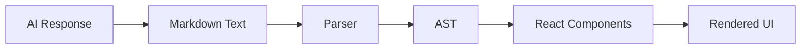

# Markdown Rendering

## Introduction

AI responses often contain rich formatting—headings, lists, code blocks, links, and tables. Converting this markdown into beautiful, readable HTML is essential for chat interfaces. But with streaming responses, we need parsers that handle incomplete markdown gracefully.

In this lesson series, we'll master markdown rendering for AI chat applications.

### What We'll Cover

| Topic | Description |
|-------|-------------|
| [Parsing Markdown](./01-parsing-markdown.md) | Parser selection, streaming-compatible parsing |
| [Formatted Text](./02-formatted-text.md) | Bold, italic, lists, blockquotes |
| [Headings](./03-heading-rendering.md) | Heading levels, anchors, table of contents |
| [Link Handling](./04-link-handling.md) | External links, security, previews |
| [Image Embedding](./05-image-embedding.md) | Inline images, lazy loading, lightbox |
| [Table Rendering](./06-table-rendering.md) | Styled tables, responsive design |

### Prerequisites

- [Loading & Status Indicators](../04-loading-status-indicators/00-loading-status-indicators.md)
- Basic HTML/CSS knowledge
- Understanding of streaming responses

---

## Why Markdown in Chat?

LLMs naturally produce markdown because:

1. **Training data** includes GitHub, Stack Overflow, documentation
2. **Structured output** is easier for models to generate
3. **Code formatting** requires backtick syntax
4. **Lists and headers** improve readability



---

## Parser Options

| Parser | Best For | Streaming | Size |
|--------|----------|-----------|------|
| `marked` | Speed, simplicity | ⚠️ Partial | 32KB |
| `remark` | Extensibility, plugins | ✅ Good | 85KB |
| `markdown-it` | Customization | ⚠️ Partial | 57KB |
| `react-markdown` | React integration | ✅ Good | 45KB |

> **🤖 AI Context:** For streaming AI responses, `react-markdown` with `remark` plugins offers the best balance of features and streaming compatibility.

---

## Quick Example

```jsx
import ReactMarkdown from 'react-markdown';

function AIMessage({ content }) {
  return (
    <div className="ai-message">
      <ReactMarkdown>{content}</ReactMarkdown>
    </div>
  );
}
```

---

## Key Challenges

| Challenge | Solution |
|-----------|----------|
| Incomplete markdown mid-stream | Graceful degradation |
| Code blocks without closing backticks | Detect and handle |
| Large tables breaking layout | Scrollable containers |
| External links opening in same tab | `target="_blank"` + rel safety |
| Images blocking content | Lazy loading + placeholders |

---

## Summary

✅ Markdown is the natural output format for LLMs  
✅ Multiple parser options with different tradeoffs  
✅ Streaming requires special handling  
✅ Security and UX considerations for links/images

---

**Next:** [Parsing Markdown](./01-parsing-markdown.md)

<!-- 
Sources Consulted:
- react-markdown docs: https://github.com/remarkjs/react-markdown
- remark ecosystem: https://github.com/remarkjs/remark
- marked docs: https://marked.js.org/
-->
