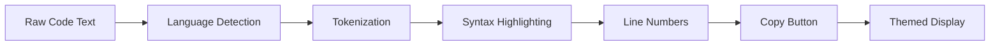

# Code Display & Syntax Highlighting

## Introduction

Code is central to AI assistant responses—explaining concepts, providing examples, generating solutions. Beautiful, readable code blocks with proper syntax highlighting, line numbers, and copy functionality transform raw text into a polished developer experience.

In this lesson series, we'll implement professional code display for chat interfaces.

### What We'll Cover

| Topic | Description |
|-------|-------------|
| [Detecting Code Blocks](./01-detecting-code-blocks.md) | Fenced blocks, language tags, inline vs block |
| [Language Detection](./02-language-detection.md) | Explicit tags, auto-detection, fallbacks |
| [Syntax Highlighting](./03-syntax-highlighting.md) | Prism, Highlight.js, Shiki integration |
| [Line Numbers](./04-line-numbers.md) | Display, highlighting, range selection |
| [Copy Functionality](./05-copy-functionality.md) | Copy button, feedback, large blocks |
| [Theming](./06-code-theming.md) | Light/dark themes, system preference |

### Prerequisites

- [Markdown Rendering](../05-markdown-rendering/00-markdown-rendering.md)
- JavaScript string manipulation
- CSS custom properties

---

## Why Code Highlighting Matters



**Benefits:**
- **Readability** - Color-coded syntax is easier to scan
- **Error detection** - Broken syntax becomes visible
- **Copy accuracy** - Users can grab exact code
- **Professional feel** - Matches IDE experience

---

## Highlighter Options

| Library | Best For | Bundle Size | Languages |
|---------|----------|-------------|-----------|
| **Prism.js** | Lightweight, extensible | ~2KB core | 200+ |
| **Highlight.js** | Auto-detection | ~30KB | 190+ |
| **Shiki** | Accuracy (VS Code themes) | ~1MB+ | 150+ |
| **CodeMirror** | Editing + display | Large | 100+ |

> **🤖 AI Context:** For chat interfaces, Prism.js or react-syntax-highlighter (uses Prism/hljs) offers the best balance of size and features.

---

## Quick Example

```jsx
import { Prism as SyntaxHighlighter } from 'react-syntax-highlighter';
import { oneDark } from 'react-syntax-highlighter/dist/esm/styles/prism';

function CodeBlock({ language, code }) {
  return (
    <SyntaxHighlighter 
      language={language} 
      style={oneDark}
      showLineNumbers
    >
      {code}
    </SyntaxHighlighter>
  );
}
```

---

## Key Challenges

| Challenge | Solution |
|-----------|----------|
| Streaming incomplete code | Graceful degradation |
| Unknown language | Fallback to plain text |
| Large code blocks | Virtualization, collapse |
| Theme mismatch with chat UI | Custom theme tokens |
| Mobile code overflow | Horizontal scroll |

---

## Summary

✅ Code blocks are core to AI chat experiences  
✅ Multiple highlighter options with tradeoffs  
✅ Language detection enables automatic highlighting  
✅ Copy functionality is essential  
✅ Theming should match overall UI

---

**Next:** [Detecting Code Blocks](./01-detecting-code-blocks.md)

<!-- 
Sources Consulted:
- Prism.js: https://prismjs.com/
- react-syntax-highlighter: https://github.com/react-syntax-highlighter/react-syntax-highlighter
- Shiki: https://shiki.matsu.io/
-->
