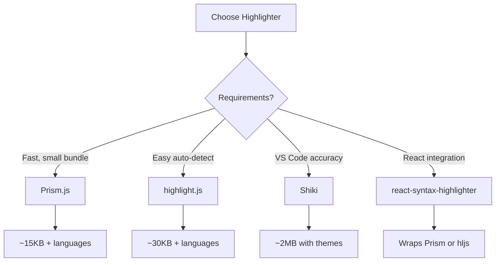

# Syntax Highlighting Implementation

## Introduction

Syntax highlighting transforms plain code into visually structured content where keywords, strings, comments, and operators are colored differently. This dramatically improves code readability and helps users quickly scan AI-generated examples.

In this lesson, we'll implement syntax highlighting using popular libraries and custom approaches.

### What We'll Cover

- Prism.js integration and customization
- Highlight.js setup and usage
- Shiki for accurate VS Code-style highlighting
- React wrapper components
- Performance considerations

### Prerequisites

- [Language Detection](./02-language-detection.md)
- React hooks and components
- CSS fundamentals

---

## Highlighter Comparison



| Library | Bundle Size | Accuracy | Setup | Best For |
|---------|-------------|----------|-------|----------|
| **Prism.js** | 15KB | Good | Easy | Static sites |
| **highlight.js** | 30KB | Good | Easiest | Auto-detection |
| **Shiki** | 2MB+ | Excellent | Complex | VS Code parity |
| **react-syntax-highlighter** | Varies | Good | Easiest | React apps |

---

## Prism.js Integration

### Basic Setup

```bash
npm install prismjs
```

```javascript
import Prism from 'prismjs';
import 'prismjs/themes/prism-tomorrow.css';

// Import languages you need
import 'prismjs/components/prism-javascript';
import 'prismjs/components/prism-typescript';
import 'prismjs/components/prism-python';
import 'prismjs/components/prism-jsx';
import 'prismjs/components/prism-bash';
import 'prismjs/components/prism-json';
```

### React Component

```jsx
import { useEffect, useRef } from 'react';
import Prism from 'prismjs';

function PrismHighlighter({ code, language }) {
  const codeRef = useRef(null);
  
  useEffect(() => {
    if (codeRef.current) {
      Prism.highlightElement(codeRef.current);
    }
  }, [code, language]);
  
  return (
    <pre className={`language-${language}`}>
      <code ref={codeRef} className={`language-${language}`}>
        {code}
      </code>
    </pre>
  );
}
```

### Programmatic Highlighting

```javascript
function highlightWithPrism(code, language) {
  // Check if language is loaded
  const grammar = Prism.languages[language];
  
  if (!grammar) {
    console.warn(`Language '${language}' not loaded`);
    return escapeHtml(code);
  }
  
  return Prism.highlight(code, grammar, language);
}

// Usage - returns HTML string
const highlighted = highlightWithPrism(
  'const x = 42;',
  'javascript'
);
```

### Dynamic Language Loading

```javascript
async function loadPrismLanguage(language) {
  const languageMap = {
    'javascript': () => import('prismjs/components/prism-javascript'),
    'typescript': () => import('prismjs/components/prism-typescript'),
    'python': () => import('prismjs/components/prism-python'),
    'jsx': () => import('prismjs/components/prism-jsx'),
    'tsx': () => import('prismjs/components/prism-tsx'),
    'bash': () => import('prismjs/components/prism-bash'),
    'json': () => import('prismjs/components/prism-json'),
    'css': () => import('prismjs/components/prism-css'),
    'html': () => import('prismjs/components/prism-markup'),
    'sql': () => import('prismjs/components/prism-sql'),
    'go': () => import('prismjs/components/prism-go'),
    'rust': () => import('prismjs/components/prism-rust')
  };
  
  const loader = languageMap[language];
  if (loader && !Prism.languages[language]) {
    await loader();
  }
}

function PrismHighlighterAsync({ code, language }) {
  const [isLoaded, setIsLoaded] = useState(false);
  const codeRef = useRef(null);
  
  useEffect(() => {
    loadPrismLanguage(language).then(() => {
      setIsLoaded(true);
    });
  }, [language]);
  
  useEffect(() => {
    if (isLoaded && codeRef.current) {
      Prism.highlightElement(codeRef.current);
    }
  }, [code, language, isLoaded]);
  
  return (
    <pre className={`language-${language}`}>
      <code ref={codeRef} className={`language-${language}`}>
        {code}
      </code>
    </pre>
  );
}
```

---

## highlight.js Integration

### Setup

```bash
npm install highlight.js
```

```javascript
import hljs from 'highlight.js/lib/core';
import javascript from 'highlight.js/lib/languages/javascript';
import python from 'highlight.js/lib/languages/python';
import typescript from 'highlight.js/lib/languages/typescript';

import 'highlight.js/styles/github-dark.css';

hljs.registerLanguage('javascript', javascript);
hljs.registerLanguage('python', python);
hljs.registerLanguage('typescript', typescript);
```

### React Component

```jsx
import { useEffect, useRef, useMemo } from 'react';
import hljs from 'highlight.js/lib/core';

function HljsHighlighter({ code, language }) {
  const highlighted = useMemo(() => {
    if (language && hljs.getLanguage(language)) {
      return hljs.highlight(code, { language });
    }
    return hljs.highlightAuto(code);
  }, [code, language]);
  
  return (
    <pre>
      <code 
        className={`hljs language-${highlighted.language}`}
        dangerouslySetInnerHTML={{ __html: highlighted.value }}
      />
    </pre>
  );
}
```

### Safe HTML Rendering

```jsx
import DOMPurify from 'dompurify';

function SafeHighlighter({ code, language }) {
  const highlighted = useMemo(() => {
    const result = hljs.highlight(code, { language });
    // Sanitize HTML output
    return DOMPurify.sanitize(result.value, {
      ALLOWED_TAGS: ['span'],
      ALLOWED_ATTR: ['class']
    });
  }, [code, language]);
  
  return (
    <pre>
      <code 
        className={`hljs language-${language}`}
        dangerouslySetInnerHTML={{ __html: highlighted }}
      />
    </pre>
  );
}
```

---

## Shiki for VS Code-Style Highlighting

### Why Shiki?

Shiki uses TextMate grammars (same as VS Code), providing the most accurate highlighting. It's ideal when you need exact VS Code parity.

### Setup

```bash
npm install shiki
```

```javascript
import { getHighlighter } from 'shiki';

// Initialize highlighter (async)
const highlighter = await getHighlighter({
  themes: ['github-dark', 'github-light'],
  langs: ['javascript', 'typescript', 'python', 'jsx']
});
```

### React Integration

```jsx
import { useState, useEffect } from 'react';
import { codeToHtml } from 'shiki';

function ShikiHighlighter({ code, language, theme = 'github-dark' }) {
  const [html, setHtml] = useState('');
  const [isLoading, setIsLoading] = useState(true);
  
  useEffect(() => {
    let cancelled = false;
    
    codeToHtml(code, {
      lang: language,
      theme: theme
    }).then(result => {
      if (!cancelled) {
        setHtml(result);
        setIsLoading(false);
      }
    });
    
    return () => { cancelled = true; };
  }, [code, language, theme]);
  
  if (isLoading) {
    return <pre><code>{code}</code></pre>;
  }
  
  return (
    <div 
      className="shiki-wrapper"
      dangerouslySetInnerHTML={{ __html: html }}
    />
  );
}
```

### Shared Highlighter Instance

```javascript
// shikiHighlighter.js
import { getHighlighter } from 'shiki';

let highlighterPromise = null;

export function getSharedHighlighter() {
  if (!highlighterPromise) {
    highlighterPromise = getHighlighter({
      themes: ['github-dark', 'github-light', 'one-dark-pro'],
      langs: [
        'javascript', 'typescript', 'python', 'jsx', 'tsx',
        'json', 'html', 'css', 'bash', 'sql', 'go', 'rust'
      ]
    });
  }
  return highlighterPromise;
}

export async function highlight(code, language, theme = 'github-dark') {
  const highlighter = await getSharedHighlighter();
  return highlighter.codeToHtml(code, { lang: language, theme });
}
```

---

## react-syntax-highlighter

### The Easiest Option for React

```bash
npm install react-syntax-highlighter
```

### Prism-Based Usage

```jsx
import { Prism as SyntaxHighlighter } from 'react-syntax-highlighter';
import { oneDark } from 'react-syntax-highlighter/dist/esm/styles/prism';

function CodeBlock({ code, language }) {
  return (
    <SyntaxHighlighter 
      language={language}
      style={oneDark}
      showLineNumbers
      wrapLines
    >
      {code}
    </SyntaxHighlighter>
  );
}
```

### highlight.js-Based Usage

```jsx
import SyntaxHighlighter from 'react-syntax-highlighter';
import { atomOneDark } from 'react-syntax-highlighter/dist/esm/styles/hljs';

function CodeBlock({ code, language }) {
  return (
    <SyntaxHighlighter 
      language={language}
      style={atomOneDark}
    >
      {code}
    </SyntaxHighlighter>
  );
}
```

### With Streaming Support

```jsx
import { Prism as SyntaxHighlighter } from 'react-syntax-highlighter';
import { oneDark } from 'react-syntax-highlighter/dist/esm/styles/prism';

function StreamingCodeBlock({ code, language, isStreaming }) {
  return (
    <div className={`code-block ${isStreaming ? 'streaming' : ''}`}>
      <SyntaxHighlighter 
        language={language}
        style={oneDark}
        showLineNumbers={!isStreaming}  // Hide during streaming
        customStyle={{
          margin: 0,
          borderRadius: '8px'
        }}
        codeTagProps={{
          style: {
            fontFamily: '"Fira Code", monospace'
          }
        }}
      >
        {code}
      </SyntaxHighlighter>
      
      {isStreaming && <span className="cursor" />}
    </div>
  );
}
```

---

## Building a Custom Highlighter

### Token-Based Approach

```javascript
const TOKEN_PATTERNS = {
  javascript: [
    { type: 'comment', pattern: /\/\/.*$/gm },
    { type: 'comment', pattern: /\/\*[\s\S]*?\*\//g },
    { type: 'string', pattern: /"(?:[^"\\]|\\.)*"/g },
    { type: 'string', pattern: /'(?:[^'\\]|\\.)*'/g },
    { type: 'string', pattern: /`(?:[^`\\]|\\.)*`/g },
    { type: 'keyword', pattern: /\b(const|let|var|function|return|if|else|for|while|class|import|export|from|async|await)\b/g },
    { type: 'number', pattern: /\b\d+\.?\d*\b/g },
    { type: 'function', pattern: /\b([a-zA-Z_]\w*)\s*(?=\()/g },
    { type: 'operator', pattern: /[+\-*/%=<>!&|?:]+/g },
    { type: 'punctuation', pattern: /[{}[\]();,.]/g }
  ]
};

function tokenize(code, language) {
  const patterns = TOKEN_PATTERNS[language] || [];
  const tokens = [];
  let remaining = code;
  let position = 0;
  
  while (remaining.length > 0) {
    let matched = false;
    
    for (const { type, pattern } of patterns) {
      pattern.lastIndex = 0;
      const match = pattern.exec(remaining);
      
      if (match && match.index === 0) {
        tokens.push({
          type,
          value: match[0],
          start: position,
          end: position + match[0].length
        });
        position += match[0].length;
        remaining = remaining.slice(match[0].length);
        matched = true;
        break;
      }
    }
    
    if (!matched) {
      // Plain text character
      tokens.push({
        type: 'plain',
        value: remaining[0],
        start: position,
        end: position + 1
      });
      position += 1;
      remaining = remaining.slice(1);
    }
  }
  
  return tokens;
}
```

### React Component for Custom Tokens

```jsx
function CustomHighlighter({ code, language }) {
  const tokens = useMemo(
    () => tokenize(code, language),
    [code, language]
  );
  
  return (
    <pre className="custom-highlighter">
      <code>
        {tokens.map((token, i) => (
          <span key={i} className={`token-${token.type}`}>
            {token.value}
          </span>
        ))}
      </code>
    </pre>
  );
}
```

### CSS for Custom Tokens

```css
.custom-highlighter {
  background: #1e1e1e;
  color: #d4d4d4;
  padding: 1rem;
  border-radius: 8px;
  overflow-x: auto;
}

.token-keyword { color: #569cd6; }
.token-string { color: #ce9178; }
.token-number { color: #b5cea8; }
.token-comment { color: #6a9955; font-style: italic; }
.token-function { color: #dcdcaa; }
.token-operator { color: #d4d4d4; }
.token-punctuation { color: #d4d4d4; }
.token-plain { color: #d4d4d4; }
```

---

## Performance Optimization

### Memoization

```jsx
import { useMemo } from 'react';

function OptimizedCodeBlock({ code, language }) {
  const highlighted = useMemo(() => {
    return Prism.highlight(
      code,
      Prism.languages[language] || Prism.languages.text,
      language
    );
  }, [code, language]);
  
  return (
    <pre>
      <code dangerouslySetInnerHTML={{ __html: highlighted }} />
    </pre>
  );
}
```

### Virtualization for Large Code

```jsx
import { FixedSizeList as List } from 'react-window';

function VirtualizedCodeBlock({ lines, language }) {
  const Row = ({ index, style }) => (
    <div style={style} className="code-line">
      <span className="line-number">{index + 1}</span>
      <HighlightedLine 
        code={lines[index]} 
        language={language}
      />
    </div>
  );
  
  return (
    <pre className="virtualized-code">
      <List
        height={400}
        itemCount={lines.length}
        itemSize={24}
        width="100%"
      >
        {Row}
      </List>
    </pre>
  );
}
```

### Debounced Re-highlighting

```jsx
function DebouncedHighlighter({ code, language }) {
  const [displayCode, setDisplayCode] = useState(code);
  
  useEffect(() => {
    const timer = setTimeout(() => {
      setDisplayCode(code);
    }, 150);  // Debounce 150ms
    
    return () => clearTimeout(timer);
  }, [code]);
  
  return (
    <SyntaxHighlighter language={language}>
      {displayCode}
    </SyntaxHighlighter>
  );
}
```

---

## Theme Switching

```jsx
import { useState, useContext, createContext } from 'react';
import { Prism as SyntaxHighlighter } from 'react-syntax-highlighter';
import { oneDark, oneLight } from 'react-syntax-highlighter/dist/esm/styles/prism';

const ThemeContext = createContext('dark');

function ThemedCodeBlock({ code, language }) {
  const theme = useContext(ThemeContext);
  const style = theme === 'dark' ? oneDark : oneLight;
  
  return (
    <SyntaxHighlighter 
      language={language}
      style={style}
    >
      {code}
    </SyntaxHighlighter>
  );
}

function App() {
  const [theme, setTheme] = useState('dark');
  
  return (
    <ThemeContext.Provider value={theme}>
      <button onClick={() => setTheme(t => t === 'dark' ? 'light' : 'dark')}>
        Toggle Theme
      </button>
      <ThemedCodeBlock code="const x = 42;" language="javascript" />
    </ThemeContext.Provider>
  );
}
```

---

## Best Practices

| ✅ Do | ❌ Don't |
|-------|---------|
| Load only needed languages | Import all languages |
| Memoize highlighted output | Re-highlight on every render |
| Use shared highlighter instance | Create new instance per block |
| Sanitize HTML output | Trust raw HTML blindly |
| Debounce during streaming | Highlight every keystroke |

---

## Common Pitfalls

| ❌ Mistake | ✅ Solution |
|-----------|-------------|
| Bundle includes all languages | Use dynamic imports |
| Shiki causes hydration errors | Use `useEffect` for client-side |
| Slow with many code blocks | Virtualize long lists |
| Theme flashes on load | Load theme in `<head>` |
| Highlighting breaks streaming | Debounce or skip during stream |

---

## Hands-on Exercise

### Your Task

Create a `CodeHighlighter` component that:
1. Accepts code and language props
2. Uses react-syntax-highlighter
3. Shows line numbers
4. Supports theme switching

### Requirements

1. Install react-syntax-highlighter
2. Import Prism-based highlighter
3. Add dark and light theme options
4. Memoize the output

<details>
<summary>💡 Hints (click to expand)</summary>

- Use `useMemo` for the style object
- Import both `oneDark` and `oneLight`
- Pass theme as a prop or use context

</details>

<details>
<summary>✅ Solution (click to expand)</summary>

```jsx
import { useMemo } from 'react';
import { Prism as SyntaxHighlighter } from 'react-syntax-highlighter';
import { oneDark, oneLight } from 'react-syntax-highlighter/dist/esm/styles/prism';

function CodeHighlighter({ code, language, theme = 'dark', showLineNumbers = true }) {
  const style = useMemo(
    () => theme === 'dark' ? oneDark : oneLight,
    [theme]
  );
  
  return (
    <SyntaxHighlighter 
      language={language}
      style={style}
      showLineNumbers={showLineNumbers}
      customStyle={{
        margin: 0,
        borderRadius: '8px',
        fontSize: '14px'
      }}
    >
      {code}
    </SyntaxHighlighter>
  );
}
```

</details>

---

## Summary

✅ **Prism.js** offers good balance of size and features  
✅ **highlight.js** excels at auto-detection  
✅ **Shiki** provides VS Code-accurate highlighting  
✅ **react-syntax-highlighter** wraps libraries for React  
✅ **Memoization** prevents unnecessary re-renders  
✅ **Dynamic imports** reduce bundle size

---

## Further Reading

- [Prism.js Documentation](https://prismjs.com/)
- [highlight.js Usage](https://highlightjs.org/usage/)
- [Shiki Documentation](https://shiki.matsu.io/)
- [react-syntax-highlighter GitHub](https://github.com/react-syntax-highlighter/react-syntax-highlighter)

---

**Previous:** [Language Detection](./02-language-detection.md)  
**Next:** [Line Numbers and Highlighting](./04-line-numbers.md)

<!-- 
Sources Consulted:
- Prism.js: https://prismjs.com/
- highlight.js: https://highlightjs.org/
- Shiki: https://shiki.matsu.io/
- react-syntax-highlighter: https://github.com/react-syntax-highlighter/react-syntax-highlighter
-->
