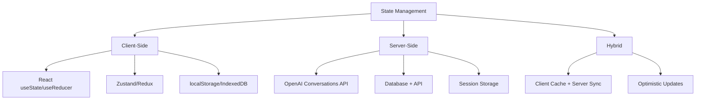

# Conversation State Management

## Overview

Managing conversation state is the backbone of any chat interface. From simple message arrays to complex multi-turn conversations with tool calls and reasoning steps, robust state management ensures smooth user experiences and reliable AI interactions.

This lesson covers modern approaches to conversation state, including the latest OpenAI Conversations API patterns and AI SDK integrations.

---

## Topics in This Lesson

| # | Topic | Description |
|---|-------|-------------|
| 01 | [Message Data Structures](./01-message-data-structures.md) | Schemas, required fields, metadata, attachments |
| 02 | [Message Parts Structure](./02-message-parts-structure.md) | Modern parts array, tool invocations, reasoning |
| 03 | [Conversation History Storage](./03-conversation-history-storage.md) | In-memory, localStorage, IndexedDB, server-side |
| 04 | [OpenAI Conversations API](./04-openai-conversations-api.md) | Persistent conversations, durable IDs |
| 05 | [Automatic Context Chaining](./05-automatic-context-chaining.md) | `previous_response_id`, stateless multi-turn |
| 06 | [Context Window Management](./06-context-window-management.md) | Compaction, token limits, ZDR compression |
| 07 | [State Updates During Streaming](./07-streaming-state-updates.md) | Partial messages, immutable patterns |
| 08 | [Optimistic Updates](./08-optimistic-updates.md) | Immediate feedback, rollback, conflicts |
| 09 | [Persistence Strategies](./09-persistence-strategies.md) | Sync, encryption, cross-device |
| 10 | [Conversation Switching](./10-conversation-switching.md) | Multiple conversations, lazy loading |

---

## State Management Approaches



---

## Key Concepts

### Message Lifecycle

```
User Types → Optimistic Add → API Call → Stream Response → Update State → Persist
```

### State Layers

| Layer | Responsibility | Example |
|-------|----------------|---------|
| **UI State** | Current input, scroll position | `inputValue`, `isAtBottom` |
| **Message State** | Message array, streaming status | `messages[]`, `isLoading` |
| **Persistence** | Long-term storage | localStorage, database |
| **Server State** | Conversation context | OpenAI conversation ID |

---

## Prerequisites

Before starting this lesson, you should understand:

- React state management (useState, useReducer)
- Async/await patterns
- Browser storage APIs
- [Streaming Text Display](../03-streaming-text-display/00-streaming-text-display.md)

---

## Learning Objectives

By the end of this lesson, you will be able to:

1. Design message schemas for AI conversations
2. Handle multi-part messages with tool calls
3. Implement client-side persistence
4. Use OpenAI's Conversations API for server-side state
5. Manage streaming updates without race conditions
6. Build multi-conversation interfaces

---

**Next:** [Message Data Structures](./01-message-data-structures.md)
