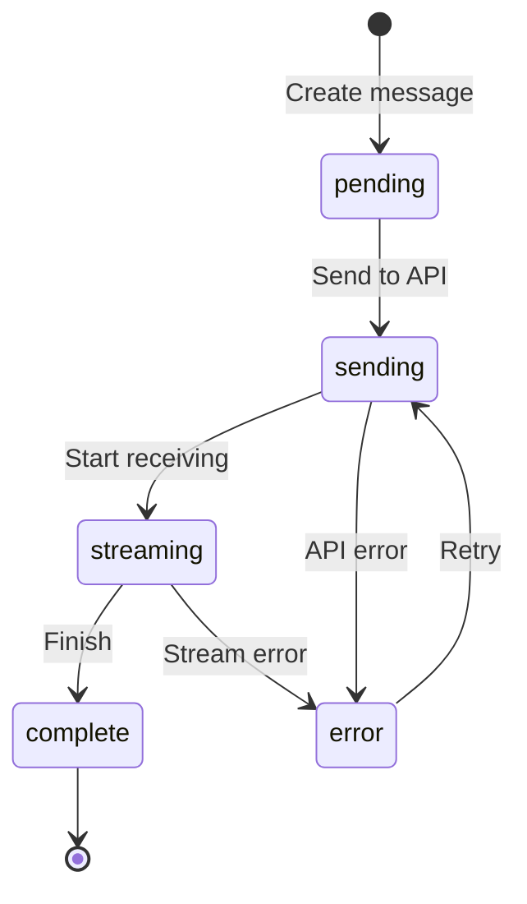

# Message Data Structures

## Introduction

A well-designed message schema is the foundation of reliable chat state management. Messages need to capture content, metadata, status, and relationships while remaining flexible enough for different AI providers and use cases.

In this lesson, we'll design robust message data structures for AI chat applications.

### What We'll Cover

- Core message object schema
- Required vs optional fields
- Status and state tracking
- Attachment handling
- TypeScript type definitions

### Prerequisites

- TypeScript basics
- [Chat Interface Design](../01-chat-interface-design-principles/00-chat-interface-design-principles.md)
- Understanding of AI chat roles (user, assistant, system)

---

## Core Message Schema

### Basic Structure

```typescript
interface Message {
  // Identity
  id: string;
  
  // Core content
  role: 'user' | 'assistant' | 'system';
  content: string;
  
  // Timestamps
  createdAt: Date;
  updatedAt?: Date;
  
  // Status
  status: MessageStatus;
}

type MessageStatus = 
  | 'pending'      // Optimistically added, not sent
  | 'sending'      // Being sent to API
  | 'streaming'    // Response is streaming
  | 'complete'     // Successfully finished
  | 'error';       // Failed
```

### Extended Schema

```typescript
interface Message {
  // === Required Fields ===
  id: string;
  role: 'user' | 'assistant' | 'system' | 'tool';
  content: string;
  createdAt: Date;
  status: MessageStatus;
  
  // === Optional Metadata ===
  updatedAt?: Date;
  parentId?: string;           // For branching conversations
  
  // === AI Response Metadata ===
  model?: string;              // 'gpt-4o', 'claude-3-opus'
  finishReason?: FinishReason;
  usage?: TokenUsage;
  
  // === Attachments ===
  attachments?: Attachment[];
  
  // === Tool Calls ===
  toolCalls?: ToolCall[];
  toolCallId?: string;         // For tool result messages
  
  // === Error Info ===
  error?: MessageError;
  
  // === Custom Data ===
  metadata?: Record<string, unknown>;
}
```

---

## Field Definitions

### Identity Fields

```typescript
// Generate unique IDs
function generateMessageId(): string {
  return `msg_${Date.now()}_${Math.random().toString(36).slice(2, 9)}`;
}

// Or use UUID
import { v4 as uuidv4 } from 'uuid';
const id = uuidv4();

// Or nanoid for smaller IDs
import { nanoid } from 'nanoid';
const id = nanoid();  // "V1StGXR8_Z5jdHi6B-myT"
```

### Role Field

```typescript
type MessageRole = 
  | 'user'       // Human input
  | 'assistant'  // AI response
  | 'system'     // System prompts (usually hidden)
  | 'tool';      // Tool/function results

// Provider-specific mappings
const roleToOpenAI: Record<MessageRole, string> = {
  user: 'user',
  assistant: 'assistant',
  system: 'system',
  tool: 'tool'
};

const roleToAnthropic: Record<MessageRole, string> = {
  user: 'user',
  assistant: 'assistant',
  system: 'user',  // Anthropic handles system differently
  tool: 'user'
};
```

### Timestamps

```typescript
interface MessageTimestamps {
  createdAt: Date;      // When message was created
  updatedAt?: Date;     // Last modification (edits, streaming updates)
  sentAt?: Date;        // When sent to API
  receivedAt?: Date;    // When response started
  completedAt?: Date;   // When streaming finished
}

// Helper for serialization
function serializeMessage(msg: Message): SerializedMessage {
  return {
    ...msg,
    createdAt: msg.createdAt.toISOString(),
    updatedAt: msg.updatedAt?.toISOString()
  };
}

function deserializeMessage(data: SerializedMessage): Message {
  return {
    ...data,
    createdAt: new Date(data.createdAt),
    updatedAt: data.updatedAt ? new Date(data.updatedAt) : undefined
  };
}
```

---

## Status Tracking

### Status State Machine



### Implementation

```typescript
interface MessageWithStatus extends Message {
  status: MessageStatus;
  statusHistory?: StatusChange[];
}

interface StatusChange {
  from: MessageStatus;
  to: MessageStatus;
  timestamp: Date;
  reason?: string;
}

function updateMessageStatus(
  message: Message, 
  newStatus: MessageStatus,
  reason?: string
): Message {
  const statusChange: StatusChange = {
    from: message.status,
    to: newStatus,
    timestamp: new Date(),
    reason
  };
  
  return {
    ...message,
    status: newStatus,
    updatedAt: new Date(),
    statusHistory: [
      ...(message.statusHistory || []),
      statusChange
    ]
  };
}
```

### Status-Based UI

```tsx
function MessageBubble({ message }: { message: Message }) {
  return (
    <div className={`message ${message.status}`}>
      <div className="content">{message.content}</div>
      
      {message.status === 'pending' && (
        <span className="status-badge">Sending...</span>
      )}
      
      {message.status === 'streaming' && (
        <span className="status-badge">
          <LoadingDots />
        </span>
      )}
      
      {message.status === 'error' && (
        <div className="error-banner">
          {message.error?.message}
          <button onClick={() => retry(message.id)}>Retry</button>
        </div>
      )}
    </div>
  );
}
```

---

## Attachments

### Attachment Schema

```typescript
interface Attachment {
  id: string;
  type: AttachmentType;
  name: string;
  size: number;  // bytes
  mimeType: string;
  
  // Content (one of these)
  url?: string;           // Remote URL
  dataUri?: string;       // Base64 data URI
  file?: File;            // Browser File object (not serializable)
  
  // Status
  uploadStatus?: 'pending' | 'uploading' | 'complete' | 'error';
  uploadProgress?: number;  // 0-100
  
  // Metadata
  metadata?: AttachmentMetadata;
}

type AttachmentType = 'image' | 'document' | 'audio' | 'video' | 'file';

interface AttachmentMetadata {
  width?: number;         // For images
  height?: number;
  duration?: number;      // For audio/video
  pages?: number;         // For documents
  thumbnail?: string;     // Preview URL
}
```

### File Type Detection

```typescript
function getAttachmentType(mimeType: string): AttachmentType {
  if (mimeType.startsWith('image/')) return 'image';
  if (mimeType.startsWith('audio/')) return 'audio';
  if (mimeType.startsWith('video/')) return 'video';
  if (
    mimeType === 'application/pdf' ||
    mimeType.includes('document') ||
    mimeType.includes('text/')
  ) {
    return 'document';
  }
  return 'file';
}

function createAttachment(file: File): Attachment {
  return {
    id: generateId(),
    type: getAttachmentType(file.type),
    name: file.name,
    size: file.size,
    mimeType: file.type,
    file,
    uploadStatus: 'pending'
  };
}
```

### Message with Attachments

```typescript
interface MessageWithAttachments extends Message {
  attachments?: Attachment[];
}

// For API submission
function formatMessageForAPI(message: MessageWithAttachments) {
  const formatted: any = {
    role: message.role,
    content: message.content
  };
  
  // OpenAI format for images
  if (message.attachments?.some(a => a.type === 'image')) {
    formatted.content = [
      { type: 'text', text: message.content },
      ...message.attachments
        .filter(a => a.type === 'image')
        .map(a => ({
          type: 'image_url',
          image_url: { url: a.url || a.dataUri }
        }))
    ];
  }
  
  return formatted;
}
```

---

## AI Response Metadata

### Token Usage

```typescript
interface TokenUsage {
  promptTokens: number;
  completionTokens: number;
  totalTokens: number;
  
  // Cost tracking (optional)
  estimatedCost?: number;
  
  // Reasoning tokens (for o1/o3 models)
  reasoningTokens?: number;
}

interface MessageWithUsage extends Message {
  usage?: TokenUsage;
  model?: string;
  finishReason?: 'stop' | 'length' | 'tool_calls' | 'content_filter';
}
```

### Provider Normalization

```typescript
function normalizeOpenAIResponse(response: OpenAIResponse): Partial<Message> {
  return {
    content: response.choices[0].message.content || '',
    model: response.model,
    finishReason: response.choices[0].finish_reason,
    usage: {
      promptTokens: response.usage?.prompt_tokens || 0,
      completionTokens: response.usage?.completion_tokens || 0,
      totalTokens: response.usage?.total_tokens || 0
    }
  };
}

function normalizeAnthropicResponse(response: AnthropicResponse): Partial<Message> {
  return {
    content: response.content[0].text,
    model: response.model,
    finishReason: response.stop_reason,
    usage: {
      promptTokens: response.usage.input_tokens,
      completionTokens: response.usage.output_tokens,
      totalTokens: response.usage.input_tokens + response.usage.output_tokens
    }
  };
}
```

---

## Error Handling

### Error Schema

```typescript
interface MessageError {
  code: ErrorCode;
  message: string;
  timestamp: Date;
  retryable: boolean;
  details?: Record<string, unknown>;
}

type ErrorCode = 
  | 'NETWORK_ERROR'
  | 'API_ERROR'
  | 'RATE_LIMIT'
  | 'CONTEXT_LENGTH'
  | 'CONTENT_FILTER'
  | 'TIMEOUT'
  | 'UNKNOWN';

function createMessageError(error: unknown): MessageError {
  if (error instanceof Error) {
    // Check for specific error types
    if (error.message.includes('rate limit')) {
      return {
        code: 'RATE_LIMIT',
        message: 'Too many requests. Please wait a moment.',
        timestamp: new Date(),
        retryable: true
      };
    }
    
    if (error.message.includes('context length')) {
      return {
        code: 'CONTEXT_LENGTH',
        message: 'Conversation too long. Try starting a new chat.',
        timestamp: new Date(),
        retryable: false
      };
    }
    
    return {
      code: 'API_ERROR',
      message: error.message,
      timestamp: new Date(),
      retryable: true
    };
  }
  
  return {
    code: 'UNKNOWN',
    message: 'An unexpected error occurred',
    timestamp: new Date(),
    retryable: true
  };
}
```

---

## Complete Type Definitions

```typescript
// === Core Types ===

export interface Message {
  id: string;
  role: MessageRole;
  content: string;
  createdAt: Date;
  updatedAt?: Date;
  status: MessageStatus;
  
  // Parent for branching
  parentId?: string;
  
  // AI metadata
  model?: string;
  finishReason?: FinishReason;
  usage?: TokenUsage;
  
  // Content
  attachments?: Attachment[];
  toolCalls?: ToolCall[];
  toolCallId?: string;
  
  // Error state
  error?: MessageError;
  
  // Extension point
  metadata?: Record<string, unknown>;
}

export type MessageRole = 'user' | 'assistant' | 'system' | 'tool';

export type MessageStatus = 
  | 'pending' 
  | 'sending' 
  | 'streaming' 
  | 'complete' 
  | 'error';

export type FinishReason = 
  | 'stop' 
  | 'length' 
  | 'tool_calls' 
  | 'content_filter';

export interface TokenUsage {
  promptTokens: number;
  completionTokens: number;
  totalTokens: number;
  reasoningTokens?: number;
  estimatedCost?: number;
}

export interface ToolCall {
  id: string;
  type: 'function';
  function: {
    name: string;
    arguments: string;
  };
}

export interface Attachment {
  id: string;
  type: 'image' | 'document' | 'audio' | 'video' | 'file';
  name: string;
  size: number;
  mimeType: string;
  url?: string;
  dataUri?: string;
  uploadStatus?: 'pending' | 'uploading' | 'complete' | 'error';
  uploadProgress?: number;
  metadata?: Record<string, unknown>;
}

export interface MessageError {
  code: string;
  message: string;
  timestamp: Date;
  retryable: boolean;
  details?: Record<string, unknown>;
}

// === Factory Functions ===

export function createUserMessage(content: string, attachments?: Attachment[]): Message {
  return {
    id: generateMessageId(),
    role: 'user',
    content,
    createdAt: new Date(),
    status: 'pending',
    attachments
  };
}

export function createAssistantMessage(id?: string): Message {
  return {
    id: id || generateMessageId(),
    role: 'assistant',
    content: '',
    createdAt: new Date(),
    status: 'streaming'
  };
}

export function createSystemMessage(content: string): Message {
  return {
    id: generateMessageId(),
    role: 'system',
    content,
    createdAt: new Date(),
    status: 'complete'
  };
}
```

---

## Best Practices

| ✅ Do | ❌ Don't |
|-------|---------|
| Use string IDs for flexibility | Use auto-increment numbers |
| Include timestamps | Lose creation order |
| Track status explicitly | Infer status from other fields |
| Make types serializable | Store File objects directly |
| Use factory functions | Construct messages inline |

---

## Common Pitfalls

| ❌ Mistake | ✅ Solution |
|-----------|-------------|
| Dates lost on JSON serialize | Use ISO strings for storage |
| IDs collide across sessions | Include timestamp in ID |
| Missing status breaks UI | Default to 'pending' |
| Attachments bloat messages | Store URLs, not data |
| No type guards | Use discriminated unions |

---

## Hands-on Exercise

### Your Task

Create message types that handle:
1. Regular text messages
2. Messages with image attachments
3. Tool call messages
4. Tool result messages

### Requirements

1. Define discriminated union for roles
2. Add factory functions for each type
3. Include serialization helpers
4. Add type guards

<details>
<summary>💡 Hints (click to expand)</summary>

- Use `role` as discriminator
- Factory functions ensure required fields
- Type guards check discriminator field

</details>

<details>
<summary>✅ Solution (click to expand)</summary>

See the Complete Type Definitions section above, plus:

```typescript
// Type guards
function isUserMessage(msg: Message): msg is Message & { role: 'user' } {
  return msg.role === 'user';
}

function isToolCall(msg: Message): msg is Message & { toolCalls: ToolCall[] } {
  return msg.role === 'assistant' && Array.isArray(msg.toolCalls);
}

function isToolResult(msg: Message): msg is Message & { role: 'tool'; toolCallId: string } {
  return msg.role === 'tool' && typeof msg.toolCallId === 'string';
}
```

</details>

---

## Summary

✅ **Message IDs** should be unique strings with timestamps  
✅ **Roles** define message origin (user, assistant, system, tool)  
✅ **Status tracking** enables UI feedback  
✅ **Attachments** store metadata, not raw files  
✅ **Factory functions** ensure consistent creation  
✅ **Serialization** handles Date objects properly

---

## Further Reading

- [OpenAI Chat Completions Format](https://platform.openai.com/docs/api-reference/chat)
- [Anthropic Messages API](https://docs.anthropic.com/en/api/messages)
- [TypeScript Discriminated Unions](https://www.typescriptlang.org/docs/handbook/2/narrowing.html#discriminated-unions)

---

**Previous:** [Conversation State Management Overview](./00-conversation-state-management.md)  
**Next:** [Message Parts Structure](./02-message-parts-structure.md)

<!-- 
Sources Consulted:
- OpenAI API Reference: https://platform.openai.com/docs/api-reference/chat
- Anthropic Messages API: https://docs.anthropic.com/en/api/messages
- AI SDK Message Types: https://sdk.vercel.ai/docs/reference/ai-sdk-ui/use-chat
-->
