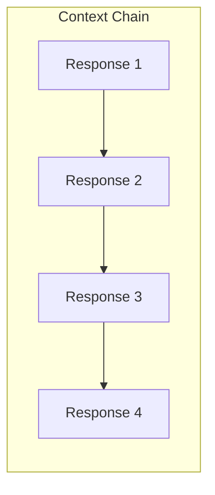

# Automatic Context Chaining

## Introduction

The `previous_response_id` parameter enables stateless multi-turn conversations without manually managing message arrays. Each response links to its predecessor, allowing OpenAI to reconstruct the full context server-side. This is ideal for serverless architectures and simplified backends.

In this lesson, we'll implement automatic context chaining for seamless multi-turn conversations.

### What We'll Cover

- The `previous_response_id` parameter
- Stateless multi-turn patterns
- Chaining vs. conversations
- Building response chains
- Error recovery strategies

### Prerequisites

- [OpenAI Conversations API](./04-openai-conversations-api.md)
- OpenAI Responses API basics
- Async/await patterns

---

## How Context Chaining Works

### Traditional Message Array

```typescript
// You manage the full history
const messages = [
  { role: 'system', content: 'You are a helpful assistant.' },
  { role: 'user', content: 'What is the capital of France?' },
  { role: 'assistant', content: 'The capital of France is Paris.' },
  { role: 'user', content: 'What is its population?' }  // New message
];

// Send entire history each time
const response = await openai.chat.completions.create({
  model: 'gpt-4o',
  messages  // All messages sent
});
```

### Context Chaining

```typescript
// Just reference the previous response
const response = await openai.responses.create({
  model: 'gpt-4o',
  input: 'What is its population?',  // Only new message
  previous_response_id: 'resp_abc123'  // Links to prior turn
});

// OpenAI reconstructs the context automatically
```



---

## Basic Implementation

### Single Chain

```typescript
import OpenAI from 'openai';

const openai = new OpenAI();

class ConversationChain {
  private lastResponseId: string | null = null;
  private instructions: string;
  
  constructor(systemPrompt: string) {
    this.instructions = systemPrompt;
  }
  
  async send(message: string): Promise<string> {
    const response = await openai.responses.create({
      model: 'gpt-4o',
      instructions: this.lastResponseId ? undefined : this.instructions,
      input: message,
      previous_response_id: this.lastResponseId || undefined
    });
    
    // Store for next turn
    this.lastResponseId = response.id;
    
    return response.output_text;
  }
  
  reset(): void {
    this.lastResponseId = null;
  }
  
  get currentResponseId(): string | null {
    return this.lastResponseId;
  }
}
```

### Usage

```typescript
const chain = new ConversationChain(
  'You are a helpful coding assistant.'
);

// Turn 1
const response1 = await chain.send('How do I create a React component?');
console.log(response1);

// Turn 2 - automatically has context from turn 1
const response2 = await chain.send('How do I add props to it?');
console.log(response2);

// Turn 3 - has context from turns 1 and 2
const response3 = await chain.send('Can you show me an example with TypeScript?');
console.log(response3);
```

---

## Stateless Server Pattern

### Why Stateless?

Serverless functions (AWS Lambda, Vercel Edge) don't persist state between requests. Context chaining allows multi-turn conversations without server-side session storage.

### API Route Design

```typescript
// app/api/chat/route.ts
import { NextRequest, NextResponse } from 'next/server';
import OpenAI from 'openai';

const openai = new OpenAI();

export async function POST(request: NextRequest) {
  const { message, previousResponseId, systemPrompt } = await request.json();
  
  const response = await openai.responses.create({
    model: 'gpt-4o',
    // Only include instructions on first message
    instructions: previousResponseId ? undefined : systemPrompt,
    input: message,
    previous_response_id: previousResponseId || undefined
  });
  
  return NextResponse.json({
    responseId: response.id,
    content: response.output_text,
    usage: response.usage
  });
}
```

### Client Implementation

```typescript
class StatelessChat {
  private previousResponseId: string | null = null;
  private systemPrompt: string;
  
  constructor(systemPrompt: string) {
    this.systemPrompt = systemPrompt;
  }
  
  async send(message: string): Promise<string> {
    const response = await fetch('/api/chat', {
      method: 'POST',
      headers: { 'Content-Type': 'application/json' },
      body: JSON.stringify({
        message,
        previousResponseId: this.previousResponseId,
        systemPrompt: this.systemPrompt
      })
    });
    
    const data = await response.json();
    this.previousResponseId = data.responseId;
    
    return data.content;
  }
}
```

---

## Chaining vs. Conversations API

| Feature | Context Chaining | Conversations API |
|---------|-----------------|-------------------|
| **State Location** | Linked responses | Dedicated conversation object |
| **Persistence** | Response storage | Explicit conversation storage |
| **Cross-device** | Need response IDs | Automatic with conversation ID |
| **Listing history** | Traverse chain | Direct query |
| **Best for** | Serverless, simple flows | Full-featured chat apps |

### When to Use Each

```typescript
// Context Chaining - Simple serverless chat
async function simpleChat(message: string, prevId?: string) {
  return openai.responses.create({
    model: 'gpt-4o',
    input: message,
    previous_response_id: prevId
  });
}

// Conversations API - Full-featured app
async function fullChat(message: string, conversationId?: string) {
  return openai.responses.create({
    model: 'gpt-4o',
    input: message,
    conversation: conversationId,
    store: true
  });
}
```

---

## Building Complex Chains

### Branching Conversations

```typescript
class BranchableConversation {
  private responseIds: Map<string, string> = new Map();
  private currentBranch: string = 'main';
  
  async send(message: string): Promise<{ branchId: string; content: string }> {
    const previousId = this.responseIds.get(this.currentBranch);
    
    const response = await openai.responses.create({
      model: 'gpt-4o',
      input: message,
      previous_response_id: previousId
    });
    
    // Update current branch
    this.responseIds.set(this.currentBranch, response.id);
    
    return {
      branchId: this.currentBranch,
      content: response.output_text
    };
  }
  
  // Create a new branch from a specific point
  branch(newBranchName: string, fromResponseId: string): void {
    this.responseIds.set(newBranchName, fromResponseId);
    this.currentBranch = newBranchName;
  }
  
  // Switch between branches
  switchBranch(branchName: string): void {
    if (!this.responseIds.has(branchName)) {
      throw new Error(`Branch ${branchName} does not exist`);
    }
    this.currentBranch = branchName;
  }
  
  listBranches(): string[] {
    return Array.from(this.responseIds.keys());
  }
}
```

### Usage Example

```typescript
const conv = new BranchableConversation();

// Main conversation
await conv.send('Explain recursion');  // resp_1
await conv.send('Show an example');    // resp_2
const { branchId } = await conv.send('Use JavaScript');  // resp_3

// Create branch from resp_2 to explore Python instead
conv.branch('python-example', 'resp_2');
await conv.send('Use Python instead');  // Branch continues from resp_2

// Switch back to main
conv.switchBranch('main');
await conv.send('Now add memoization');  // Continues from resp_3
```

---

## Error Recovery

### Handling Broken Chains

```typescript
class ResilientChain {
  private responseHistory: string[] = [];
  private instructions: string;
  
  constructor(instructions: string) {
    this.instructions = instructions;
  }
  
  async send(message: string): Promise<string> {
    const previousId = this.responseHistory[this.responseHistory.length - 1];
    
    try {
      const response = await openai.responses.create({
        model: 'gpt-4o',
        instructions: previousId ? undefined : this.instructions,
        input: message,
        previous_response_id: previousId
      });
      
      this.responseHistory.push(response.id);
      return response.output_text;
      
    } catch (error) {
      if (this.isInvalidResponseIdError(error)) {
        // Response expired or invalid - try to recover
        return this.recoverAndRetry(message);
      }
      throw error;
    }
  }
  
  private isInvalidResponseIdError(error: unknown): boolean {
    return (
      error instanceof Error && 
      (error.message.includes('previous_response_id') ||
       error.message.includes('not found'))
    );
  }
  
  private async recoverAndRetry(message: string): Promise<string> {
    console.warn('Chain broken, starting fresh conversation');
    
    // Clear history and start fresh
    this.responseHistory = [];
    
    const response = await openai.responses.create({
      model: 'gpt-4o',
      instructions: this.instructions,
      input: message
    });
    
    this.responseHistory.push(response.id);
    return response.output_text;
  }
}
```

### Retry with Exponential Backoff

```typescript
async function sendWithRetry(
  message: string,
  previousId: string | null,
  maxRetries = 3
): Promise<OpenAI.Responses.Response> {
  let lastError: Error | null = null;
  
  for (let attempt = 0; attempt < maxRetries; attempt++) {
    try {
      return await openai.responses.create({
        model: 'gpt-4o',
        input: message,
        previous_response_id: previousId || undefined
      });
    } catch (error) {
      lastError = error as Error;
      
      // Don't retry invalid response ID errors
      if (error.message.includes('previous_response_id')) {
        throw error;
      }
      
      // Exponential backoff
      const delay = Math.pow(2, attempt) * 1000;
      await new Promise(resolve => setTimeout(resolve, delay));
    }
  }
  
  throw lastError;
}
```

---

## React Hook Implementation

```typescript
import { useState, useCallback, useRef } from 'react';

interface Message {
  id: string;
  role: 'user' | 'assistant';
  content: string;
}

interface UseChainedChatOptions {
  systemPrompt: string;
  onError?: (error: Error) => void;
}

function useChainedChat({ systemPrompt, onError }: UseChainedChatOptions) {
  const [messages, setMessages] = useState<Message[]>([]);
  const [isLoading, setIsLoading] = useState(false);
  const previousResponseId = useRef<string | null>(null);
  
  const sendMessage = useCallback(async (content: string) => {
    setIsLoading(true);
    
    // Optimistic user message
    const userMessage: Message = {
      id: `user_${Date.now()}`,
      role: 'user',
      content
    };
    setMessages(prev => [...prev, userMessage]);
    
    try {
      const response = await fetch('/api/chat', {
        method: 'POST',
        headers: { 'Content-Type': 'application/json' },
        body: JSON.stringify({
          message: content,
          previousResponseId: previousResponseId.current,
          systemPrompt
        })
      });
      
      if (!response.ok) {
        throw new Error('Chat request failed');
      }
      
      const data = await response.json();
      previousResponseId.current = data.responseId;
      
      const assistantMessage: Message = {
        id: data.responseId,
        role: 'assistant',
        content: data.content
      };
      
      setMessages(prev => [...prev, assistantMessage]);
      
    } catch (error) {
      // Remove optimistic message
      setMessages(prev => prev.slice(0, -1));
      onError?.(error as Error);
    } finally {
      setIsLoading(false);
    }
  }, [systemPrompt, onError]);
  
  const reset = useCallback(() => {
    setMessages([]);
    previousResponseId.current = null;
  }, []);
  
  return {
    messages,
    isLoading,
    sendMessage,
    reset
  };
}
```

---

## Streaming with Chaining

```typescript
async function* streamWithChaining(
  message: string,
  previousResponseId: string | null
): AsyncGenerator<{ type: 'delta' | 'done'; content: string; responseId?: string }> {
  const response = await openai.responses.create({
    model: 'gpt-4o',
    input: message,
    previous_response_id: previousResponseId || undefined,
    stream: true
  });
  
  let responseId: string | null = null;
  
  for await (const event of response) {
    if (event.type === 'response.created') {
      responseId = event.response.id;
    }
    
    if (event.type === 'content_block_delta') {
      yield {
        type: 'delta',
        content: event.delta.text
      };
    }
    
    if (event.type === 'response.done') {
      yield {
        type: 'done',
        content: '',
        responseId: responseId!
      };
    }
  }
}

// Usage
async function handleStreamingChat(message: string, prevId: string | null) {
  let newResponseId: string | null = null;
  let fullContent = '';
  
  for await (const event of streamWithChaining(message, prevId)) {
    if (event.type === 'delta') {
      fullContent += event.content;
      updateUI(fullContent);
    }
    
    if (event.type === 'done') {
      newResponseId = event.responseId!;
    }
  }
  
  return { content: fullContent, responseId: newResponseId };
}
```

---

## Best Practices

| ✅ Do | ❌ Don't |
|-------|---------|
| Store response IDs client-side | Rely on server memory |
| Handle expired responses | Assume chains last forever |
| Include instructions on first msg | Send instructions every time |
| Reset chain on topic change | Keep unrelated context |
| Use for serverless architectures | Over-complicate simple apps |

---

## Common Pitfalls

| ❌ Mistake | ✅ Solution |
|-----------|-------------|
| Lost response ID on refresh | Persist to localStorage |
| Chain breaks after 24-48h | Implement recovery logic |
| Instructions repeated | Only send on first message |
| No error handling | Check for invalid ID errors |
| Mixing with conversations | Pick one approach |

---

## Hands-on Exercise

### Your Task

Build a chat interface using context chaining that:
1. Maintains chain across page refreshes
2. Handles chain expiration gracefully
3. Supports reset functionality
4. Shows chain status to user

### Requirements

1. Store response ID in localStorage
2. Detect and recover from broken chains
3. Add "New Chat" button that resets
4. Display number of turns in chain

<details>
<summary>💡 Hints (click to expand)</summary>

- Save response ID after each successful response
- Try/catch around the API call
- Clear localStorage on reset
- Track turn count in state

</details>

---

## Summary

✅ **previous_response_id** links responses  
✅ **Stateless servers** work with chaining  
✅ **No message arrays** to manage  
✅ **Branching** creates conversation trees  
✅ **Error recovery** handles expired chains  
✅ **Streaming** works with chaining

---

## Further Reading

- [OpenAI Responses API](https://platform.openai.com/docs/api-reference/responses)
- [Serverless Patterns](https://www.serverless.com/blog/serverless-architecture-code-patterns)
- [Conversation Design Patterns](https://platform.openai.com/docs/guides/conversation-design)

---

**Previous:** [OpenAI Conversations API](./04-openai-conversations-api.md)  
**Next:** [Context Window Management](./06-context-window-management.md)

<!-- 
Sources Consulted:
- OpenAI Responses API: https://platform.openai.com/docs/api-reference/responses
- Vercel Edge Functions: https://vercel.com/docs/functions/edge-functions
- AWS Lambda Best Practices: https://docs.aws.amazon.com/lambda/latest/dg/best-practices.html
-->
