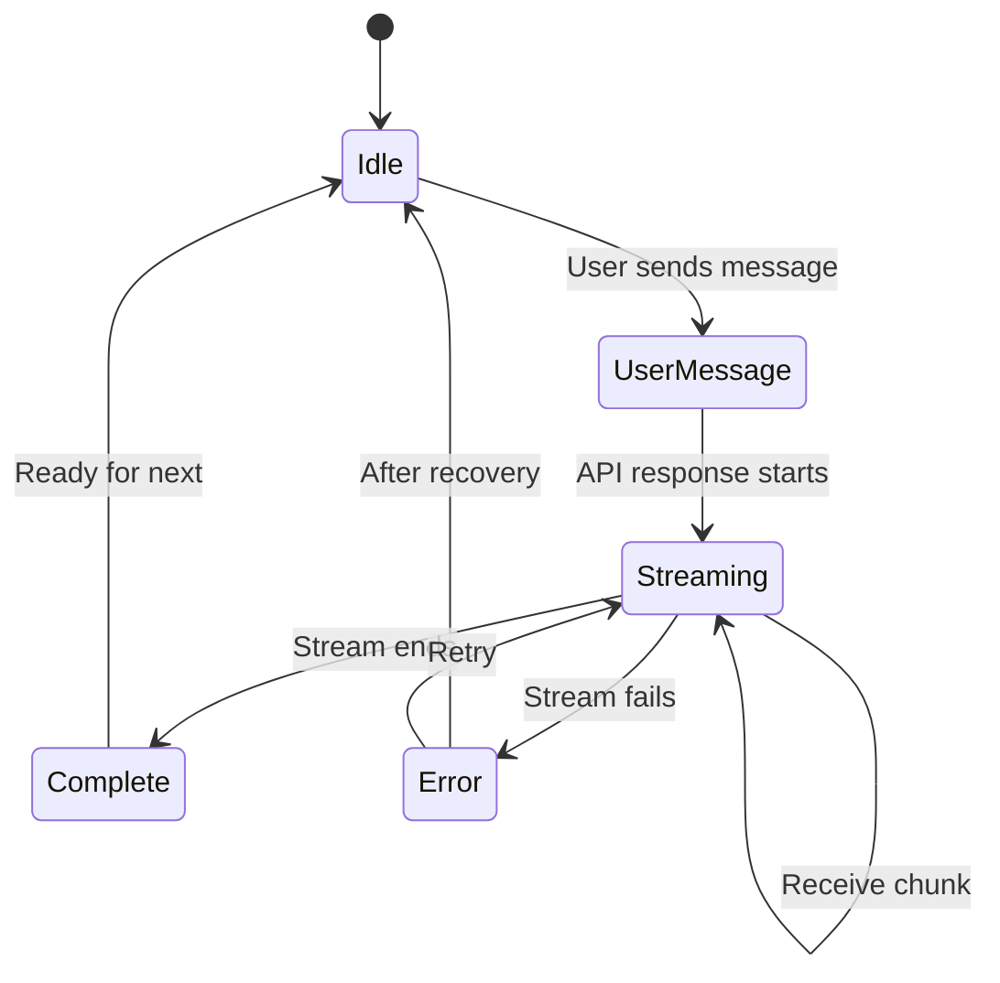

# State Updates During Streaming

## Introduction

Streaming responses require careful state management. You must update message content incrementally, handle partial data, maintain immutability for React, and avoid race conditions when multiple operations overlap. Getting this right creates a smooth, responsive chat experience.

In this lesson, we'll implement robust streaming state updates for chat applications.

### What We'll Cover

- Partial message state patterns
- Real-time content updates
- Immutable update strategies
- Race condition prevention
- Concurrent stream handling

### Prerequisites

- [Context Window Management](./06-context-window-management.md)
- React state management
- [Streaming Text Display](../03-streaming-text-display/00-streaming-text-display.md)

---

## The Streaming State Challenge

### The Problem

```tsx
// ❌ WRONG: Mutating state directly
function BadStreamHandler() {
  const [messages, setMessages] = useState<Message[]>([]);
  
  async function handleStream(stream: AsyncIterable<string>) {
    // Create message
    const message = { id: 'msg_1', content: '', status: 'streaming' };
    setMessages([...messages, message]);
    
    for await (const chunk of stream) {
      // ❌ This mutates the object in state!
      message.content += chunk;
      // ❌ React might not re-render
      setMessages([...messages, message]);
    }
  }
}
```

### The Solution

```tsx
// ✅ CORRECT: Immutable updates
function GoodStreamHandler() {
  const [messages, setMessages] = useState<Message[]>([]);
  
  async function handleStream(stream: AsyncIterable<string>) {
    const messageId = generateId();
    
    // Add empty streaming message
    setMessages(prev => [...prev, {
      id: messageId,
      content: '',
      status: 'streaming'
    }]);
    
    for await (const chunk of stream) {
      // ✅ Immutable update via callback
      setMessages(prev => prev.map(msg =>
        msg.id === messageId
          ? { ...msg, content: msg.content + chunk }
          : msg
      ));
    }
    
    // Mark complete
    setMessages(prev => prev.map(msg =>
      msg.id === messageId
        ? { ...msg, status: 'complete' }
        : msg
    ));
  }
}
```

---

## Immutable Update Patterns

### Update Helper Functions

```typescript
// Message update utilities
function updateMessage(
  messages: Message[],
  id: string,
  updates: Partial<Message>
): Message[] {
  return messages.map(msg =>
    msg.id === id ? { ...msg, ...updates } : msg
  );
}

function appendToMessage(
  messages: Message[],
  id: string,
  content: string
): Message[] {
  return messages.map(msg =>
    msg.id === id
      ? { ...msg, content: msg.content + content }
      : msg
  );
}

function setMessageStatus(
  messages: Message[],
  id: string,
  status: MessageStatus
): Message[] {
  return updateMessage(messages, id, { 
    status, 
    updatedAt: new Date() 
  });
}
```

### Using Immer

```typescript
import { produce } from 'immer';

function useImmerMessages() {
  const [messages, setMessages] = useState<Message[]>([]);
  
  const appendContent = (id: string, chunk: string) => {
    setMessages(produce(draft => {
      const message = draft.find(m => m.id === id);
      if (message) {
        message.content += chunk;  // ✅ Immer makes this safe
      }
    }));
  };
  
  const updateStatus = (id: string, status: MessageStatus) => {
    setMessages(produce(draft => {
      const message = draft.find(m => m.id === id);
      if (message) {
        message.status = status;
        message.updatedAt = new Date();
      }
    }));
  };
  
  return { messages, appendContent, updateStatus };
}
```

---

## Streaming State Machine



### State Machine Implementation

```typescript
type ChatState = 
  | { type: 'idle' }
  | { type: 'sending'; messageId: string }
  | { type: 'streaming'; messageId: string; abortController: AbortController }
  | { type: 'error'; error: Error; messageId: string };

function chatReducer(state: ChatState, action: ChatAction): ChatState {
  switch (action.type) {
    case 'SEND_MESSAGE':
      return { type: 'sending', messageId: action.messageId };
      
    case 'START_STREAMING':
      return { 
        type: 'streaming', 
        messageId: action.messageId,
        abortController: action.abortController
      };
      
    case 'STREAMING_COMPLETE':
      return { type: 'idle' };
      
    case 'STREAMING_ERROR':
      return { 
        type: 'error', 
        error: action.error,
        messageId: action.messageId
      };
      
    case 'DISMISS_ERROR':
      return { type: 'idle' };
      
    default:
      return state;
  }
}
```

---

## Race Condition Prevention

### The Race Condition Problem

```typescript
// ❌ Race condition: user sends message before previous stream completes
async function badHandler(message: string) {
  // Stream 1 starts
  const stream1 = await startStream(message1);
  
  // User sends another message while stream1 is active
  const stream2 = await startStream(message2);
  
  // Both streams update the same message state!
  // Results interleave unpredictably
}
```

### Solution: Unique Message IDs

```typescript
function useStreamingChat() {
  const [messages, setMessages] = useState<Message[]>([]);
  const activeStreams = useRef<Set<string>>(new Set());
  
  async function sendMessage(content: string) {
    // Create unique IDs for this exchange
    const userMessageId = `user_${Date.now()}_${Math.random()}`;
    const assistantMessageId = `assistant_${Date.now()}_${Math.random()}`;
    
    // Add user message
    setMessages(prev => [...prev, {
      id: userMessageId,
      role: 'user',
      content,
      status: 'complete'
    }]);
    
    // Add placeholder assistant message
    setMessages(prev => [...prev, {
      id: assistantMessageId,
      role: 'assistant',
      content: '',
      status: 'streaming'
    }]);
    
    // Track this stream
    activeStreams.current.add(assistantMessageId);
    
    try {
      for await (const chunk of getStream(content)) {
        // Check if this stream was cancelled
        if (!activeStreams.current.has(assistantMessageId)) {
          break;
        }
        
        // Update only this specific message
        setMessages(prev => prev.map(msg =>
          msg.id === assistantMessageId
            ? { ...msg, content: msg.content + chunk }
            : msg
        ));
      }
      
      setMessages(prev => setMessageStatus(prev, assistantMessageId, 'complete'));
    } catch (error) {
      setMessages(prev => setMessageStatus(prev, assistantMessageId, 'error'));
    } finally {
      activeStreams.current.delete(assistantMessageId);
    }
  }
  
  return { messages, sendMessage };
}
```

### Abort Controller Pattern

```typescript
function useAbortableStream() {
  const abortControllerRef = useRef<AbortController | null>(null);
  
  async function sendMessage(content: string) {
    // Cancel any existing stream
    if (abortControllerRef.current) {
      abortControllerRef.current.abort();
    }
    
    // Create new abort controller
    const abortController = new AbortController();
    abortControllerRef.current = abortController;
    
    try {
      const response = await fetch('/api/chat', {
        method: 'POST',
        body: JSON.stringify({ content }),
        signal: abortController.signal
      });
      
      const reader = response.body!.getReader();
      
      while (true) {
        const { done, value } = await reader.read();
        
        if (done || abortController.signal.aborted) break;
        
        // Process chunk...
      }
    } catch (error) {
      if (error.name === 'AbortError') {
        console.log('Stream aborted');
        return;
      }
      throw error;
    }
  }
  
  function cancel() {
    abortControllerRef.current?.abort();
  }
  
  return { sendMessage, cancel };
}
```

---

## Batched Updates

### Debouncing State Updates

```typescript
import { useDeferredValue, startTransition } from 'react';

function useOptimizedStreaming() {
  const [messages, setMessages] = useState<Message[]>([]);
  
  // Use deferred value for render
  const deferredMessages = useDeferredValue(messages);
  
  const appendChunk = useCallback((id: string, chunk: string) => {
    // Mark as lower priority update
    startTransition(() => {
      setMessages(prev => appendToMessage(prev, id, chunk));
    });
  }, []);
  
  return { messages: deferredMessages, appendChunk };
}
```

### Chunked Updates

```typescript
function useChunkedUpdates() {
  const [messages, setMessages] = useState<Message[]>([]);
  const pendingChunks = useRef<Map<string, string>>(new Map());
  const flushTimer = useRef<number | null>(null);
  
  const appendChunk = useCallback((id: string, chunk: string) => {
    // Accumulate chunks
    const existing = pendingChunks.current.get(id) || '';
    pendingChunks.current.set(id, existing + chunk);
    
    // Schedule flush
    if (!flushTimer.current) {
      flushTimer.current = requestAnimationFrame(() => {
        flushTimer.current = null;
        
        // Apply all pending updates at once
        setMessages(prev => {
          let updated = prev;
          
          for (const [msgId, content] of pendingChunks.current) {
            updated = appendToMessage(updated, msgId, content);
          }
          
          pendingChunks.current.clear();
          return updated;
        });
      });
    }
  }, []);
  
  return { messages, appendChunk };
}
```

---

## Concurrent Streams

### Multiple Simultaneous Streams

```typescript
function useConcurrentStreams() {
  const [messages, setMessages] = useState<Message[]>([]);
  const streams = useRef<Map<string, StreamController>>(new Map());
  
  interface StreamController {
    abortController: AbortController;
    status: 'active' | 'complete' | 'cancelled';
  }
  
  async function startStream(
    messageId: string, 
    prompt: string
  ): Promise<void> {
    const abortController = new AbortController();
    
    streams.current.set(messageId, {
      abortController,
      status: 'active'
    });
    
    try {
      const response = await fetch('/api/chat', {
        method: 'POST',
        body: JSON.stringify({ prompt }),
        signal: abortController.signal
      });
      
      for await (const chunk of streamResponse(response)) {
        const controller = streams.current.get(messageId);
        if (!controller || controller.status !== 'active') break;
        
        setMessages(prev => appendToMessage(prev, messageId, chunk));
      }
      
      streams.current.set(messageId, { abortController, status: 'complete' });
    } catch (error) {
      if (error.name !== 'AbortError') {
        throw error;
      }
    }
  }
  
  function cancelStream(messageId: string): void {
    const controller = streams.current.get(messageId);
    if (controller?.status === 'active') {
      controller.abortController.abort();
      controller.status = 'cancelled';
    }
  }
  
  function cancelAll(): void {
    for (const [id] of streams.current) {
      cancelStream(id);
    }
  }
  
  return { messages, startStream, cancelStream, cancelAll };
}
```

---

## Complete Hook Implementation

```typescript
import { useState, useCallback, useRef } from 'react';

interface Message {
  id: string;
  role: 'user' | 'assistant';
  content: string;
  status: 'pending' | 'streaming' | 'complete' | 'error';
  error?: Error;
}

interface UseStreamingChatReturn {
  messages: Message[];
  isStreaming: boolean;
  sendMessage: (content: string) => Promise<void>;
  cancelStream: () => void;
  retryLastMessage: () => Promise<void>;
  clearMessages: () => void;
}

export function useStreamingChat(apiEndpoint: string): UseStreamingChatReturn {
  const [messages, setMessages] = useState<Message[]>([]);
  const [isStreaming, setIsStreaming] = useState(false);
  
  const abortControllerRef = useRef<AbortController | null>(null);
  const currentMessageIdRef = useRef<string | null>(null);
  
  const sendMessage = useCallback(async (content: string) => {
    // Cancel any existing stream
    abortControllerRef.current?.abort();
    
    const userMessageId = `user_${Date.now()}`;
    const assistantMessageId = `assistant_${Date.now()}`;
    currentMessageIdRef.current = assistantMessageId;
    
    // Add user message
    setMessages(prev => [...prev, {
      id: userMessageId,
      role: 'user',
      content,
      status: 'complete'
    }]);
    
    // Add assistant placeholder
    setMessages(prev => [...prev, {
      id: assistantMessageId,
      role: 'assistant',
      content: '',
      status: 'streaming'
    }]);
    
    setIsStreaming(true);
    
    const abortController = new AbortController();
    abortControllerRef.current = abortController;
    
    try {
      const response = await fetch(apiEndpoint, {
        method: 'POST',
        headers: { 'Content-Type': 'application/json' },
        body: JSON.stringify({ 
          message: content,
          messages: messages.map(m => ({ role: m.role, content: m.content }))
        }),
        signal: abortController.signal
      });
      
      if (!response.ok) {
        throw new Error(`HTTP ${response.status}`);
      }
      
      const reader = response.body!.getReader();
      const decoder = new TextDecoder();
      
      while (true) {
        const { done, value } = await reader.read();
        
        if (done) break;
        
        const chunk = decoder.decode(value, { stream: true });
        
        setMessages(prev => prev.map(msg =>
          msg.id === assistantMessageId
            ? { ...msg, content: msg.content + chunk }
            : msg
        ));
      }
      
      // Mark complete
      setMessages(prev => prev.map(msg =>
        msg.id === assistantMessageId
          ? { ...msg, status: 'complete' }
          : msg
      ));
      
    } catch (error) {
      if (error.name === 'AbortError') {
        // Stream was cancelled
        setMessages(prev => prev.map(msg =>
          msg.id === assistantMessageId
            ? { ...msg, status: 'complete' }  // Keep partial content
            : msg
        ));
      } else {
        // Actual error
        setMessages(prev => prev.map(msg =>
          msg.id === assistantMessageId
            ? { ...msg, status: 'error', error: error as Error }
            : msg
        ));
      }
    } finally {
      setIsStreaming(false);
      currentMessageIdRef.current = null;
    }
  }, [apiEndpoint, messages]);
  
  const cancelStream = useCallback(() => {
    abortControllerRef.current?.abort();
  }, []);
  
  const retryLastMessage = useCallback(async () => {
    // Find last user message
    const lastUserMessage = [...messages]
      .reverse()
      .find(m => m.role === 'user');
    
    if (!lastUserMessage) return;
    
    // Remove failed assistant message
    setMessages(prev => prev.filter(m => 
      m.status !== 'error' && m.id !== currentMessageIdRef.current
    ));
    
    // Resend
    await sendMessage(lastUserMessage.content);
  }, [messages, sendMessage]);
  
  const clearMessages = useCallback(() => {
    abortControllerRef.current?.abort();
    setMessages([]);
  }, []);
  
  return {
    messages,
    isStreaming,
    sendMessage,
    cancelStream,
    retryLastMessage,
    clearMessages
  };
}
```

---

## Best Practices

| ✅ Do | ❌ Don't |
|-------|---------|
| Use unique message IDs | Reuse or mutate IDs |
| Update with functional setState | Mutate state objects |
| Track active streams | Ignore concurrent sends |
| Cancel on unmount | Leave streams running |
| Batch frequent updates | Update every character |

---

## Common Pitfalls

| ❌ Mistake | ✅ Solution |
|-----------|-------------|
| State mutation | Use spread operator or Immer |
| Stale closures | Use refs or functional updates |
| Memory leaks | Cancel streams on unmount |
| Racing updates | Use unique IDs and track active |
| UI jank | Batch with requestAnimationFrame |

---

## Hands-on Exercise

### Your Task

Build a streaming chat hook that:
1. Handles concurrent message sends
2. Allows stream cancellation
3. Supports retry on error
4. Batches updates for performance

### Requirements

1. Use AbortController for cancellation
2. Track stream status per message
3. Implement retry with backoff
4. Use startTransition for updates

<details>
<summary>💡 Hints (click to expand)</summary>

- Store AbortController in ref
- Map message ID to stream status
- Use exponential backoff (2^n seconds)
- Wrap setMessages in startTransition

</details>

---

## Summary

✅ **Immutable updates** prevent React issues  
✅ **Unique IDs** isolate concurrent streams  
✅ **AbortController** enables cancellation  
✅ **State machine** tracks streaming phases  
✅ **Batching** improves performance  
✅ **Cleanup** prevents memory leaks

---

## Further Reading

- [React State Updates](https://react.dev/learn/updating-objects-in-state)
- [AbortController - MDN](https://developer.mozilla.org/en-US/docs/Web/API/AbortController)
- [React Transitions](https://react.dev/reference/react/startTransition)

---

**Previous:** [Context Window Management](./06-context-window-management.md)  
**Next:** [Optimistic Updates](./08-optimistic-updates.md)

<!-- 
Sources Consulted:
- React docs on state: https://react.dev/learn/updating-objects-in-state
- MDN AbortController: https://developer.mozilla.org/en-US/docs/Web/API/AbortController
- Immer library: https://immerjs.github.io/immer/
-->
