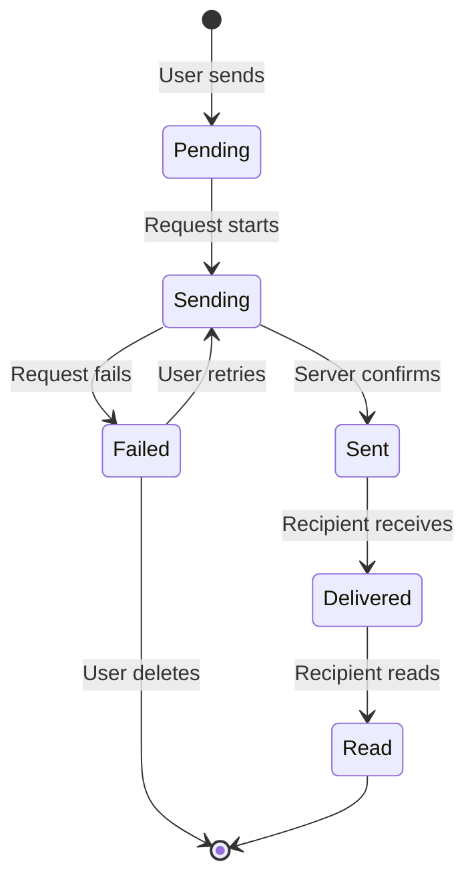

# Optimistic Updates

## Introduction

Users expect immediate feedback when they send a message. Waiting for server confirmation feels slow. Optimistic updates show the user's message instantly, assuming it will succeed, then handle failures gracefully if something goes wrong.

In this lesson, we'll implement optimistic update patterns that make chat interfaces feel instantaneous.

### What We'll Cover

- Immediate UI feedback patterns
- Pending state management
- Rollback on failure
- Conflict resolution
- Reconciliation strategies

### Prerequisites

- [Streaming State Updates](./07-streaming-state-updates.md)
- React state management
- Error handling basics

---

## The Optimistic Update Pattern

### Traditional vs Optimistic

```tsx
// ❌ Traditional: Wait for server
async function traditionalSend(message: string) {
  setIsLoading(true);
  try {
    const response = await api.sendMessage(message);  // 200-500ms wait
    setMessages(prev => [...prev, response.message]);
  } finally {
    setIsLoading(false);
  }
}

// ✅ Optimistic: Show immediately
async function optimisticSend(message: string) {
  const tempId = `temp_${Date.now()}`;
  
  // Show immediately with pending status
  setMessages(prev => [...prev, {
    id: tempId,
    content: message,
    status: 'pending'
  }]);
  
  try {
    const response = await api.sendMessage(message);
    // Replace temp with confirmed message
    setMessages(prev => prev.map(m =>
      m.id === tempId ? { ...response.message, status: 'sent' } : m
    ));
  } catch (error) {
    // Mark as failed, keep visible
    setMessages(prev => prev.map(m =>
      m.id === tempId ? { ...m, status: 'failed', error } : m
    ));
  }
}
```

---

## Message Status Flow



### Status Types

```typescript
type MessageStatus = 
  | 'pending'     // Just created, not sent
  | 'sending'     // Request in flight
  | 'sent'        // Server acknowledged
  | 'delivered'   // Recipient received
  | 'read'        // Recipient read
  | 'failed';     // Send failed

interface OptimisticMessage {
  id: string;
  tempId?: string;          // Temporary ID before server confirms
  content: string;
  status: MessageStatus;
  error?: Error;
  retryCount?: number;
  timestamp: Date;
  pendingOperations?: PendingOperation[];
}

interface PendingOperation {
  type: 'create' | 'update' | 'delete';
  originalValue?: OptimisticMessage;
  timestamp: Date;
}
```

---

## Optimistic Update Hook

```typescript
interface UseOptimisticMessagesReturn {
  messages: OptimisticMessage[];
  sendMessage: (content: string) => Promise<void>;
  retryMessage: (id: string) => Promise<void>;
  deleteMessage: (id: string) => void;
  editMessage: (id: string, newContent: string) => Promise<void>;
}

export function useOptimisticMessages(
  apiEndpoint: string
): UseOptimisticMessagesReturn {
  const [messages, setMessages] = useState<OptimisticMessage[]>([]);
  
  const generateTempId = () => `temp_${Date.now()}_${Math.random().toString(36)}`;
  
  const sendMessage = async (content: string) => {
    const tempId = generateTempId();
    
    // 1. Optimistically add message
    const optimisticMessage: OptimisticMessage = {
      id: tempId,
      tempId,
      content,
      status: 'pending',
      timestamp: new Date()
    };
    
    setMessages(prev => [...prev, optimisticMessage]);
    
    // 2. Update to sending
    setMessages(prev => prev.map(m =>
      m.id === tempId ? { ...m, status: 'sending' } : m
    ));
    
    try {
      // 3. Make API call
      const response = await fetch(apiEndpoint, {
        method: 'POST',
        headers: { 'Content-Type': 'application/json' },
        body: JSON.stringify({ content })
      });
      
      if (!response.ok) throw new Error(`HTTP ${response.status}`);
      
      const serverMessage = await response.json();
      
      // 4. Replace temp with server message
      setMessages(prev => prev.map(m =>
        m.id === tempId 
          ? { 
              ...serverMessage, 
              status: 'sent',
              tempId: undefined  // Clear temp ID
            } 
          : m
      ));
      
    } catch (error) {
      // 5. Mark as failed
      setMessages(prev => prev.map(m =>
        m.id === tempId 
          ? { 
              ...m, 
              status: 'failed', 
              error: error as Error,
              retryCount: (m.retryCount || 0) + 1
            } 
          : m
      ));
    }
  };
  
  const retryMessage = async (id: string) => {
    const message = messages.find(m => m.id === id);
    if (!message || message.status !== 'failed') return;
    
    // Reset to pending
    setMessages(prev => prev.map(m =>
      m.id === id ? { ...m, status: 'pending', error: undefined } : m
    ));
    
    // Resend
    await sendMessage(message.content);
    
    // Remove the old failed message
    setMessages(prev => prev.filter(m => m.id !== id));
  };
  
  const deleteMessage = (id: string) => {
    setMessages(prev => prev.filter(m => m.id !== id));
  };
  
  const editMessage = async (id: string, newContent: string) => {
    const message = messages.find(m => m.id === id);
    if (!message) return;
    
    // Store original for rollback
    const original = { ...message };
    
    // Optimistically update
    setMessages(prev => prev.map(m =>
      m.id === id 
        ? { 
            ...m, 
            content: newContent, 
            status: 'sending',
            pendingOperations: [
              ...(m.pendingOperations || []),
              { type: 'update', originalValue: original, timestamp: new Date() }
            ]
          } 
        : m
    ));
    
    try {
      await fetch(`${apiEndpoint}/${id}`, {
        method: 'PATCH',
        headers: { 'Content-Type': 'application/json' },
        body: JSON.stringify({ content: newContent })
      });
      
      // Clear pending operations
      setMessages(prev => prev.map(m =>
        m.id === id 
          ? { ...m, status: 'sent', pendingOperations: [] } 
          : m
      ));
      
    } catch (error) {
      // Rollback
      setMessages(prev => prev.map(m =>
        m.id === id ? original : m
      ));
    }
  };
  
  return { messages, sendMessage, retryMessage, deleteMessage, editMessage };
}
```

---

## Rollback Strategies

### Simple Rollback

```typescript
function useSimpleRollback<T>() {
  const rollbackStack = useRef<Map<string, T>>(new Map());
  
  function saveForRollback(id: string, value: T) {
    rollbackStack.current.set(id, structuredClone(value));
  }
  
  function rollback(id: string): T | undefined {
    const original = rollbackStack.current.get(id);
    rollbackStack.current.delete(id);
    return original;
  }
  
  function clearRollback(id: string) {
    rollbackStack.current.delete(id);
  }
  
  return { saveForRollback, rollback, clearRollback };
}
```

### Undo Stack

```typescript
interface UndoEntry<T> {
  timestamp: Date;
  action: string;
  oldValue: T;
  newValue: T;
}

function useUndoStack<T>(maxHistory = 50) {
  const [stack, setStack] = useState<UndoEntry<T>[]>([]);
  const [redoStack, setRedoStack] = useState<UndoEntry<T>[]>([]);
  
  function push(entry: Omit<UndoEntry<T>, 'timestamp'>) {
    setStack(prev => [
      ...prev.slice(-maxHistory + 1),
      { ...entry, timestamp: new Date() }
    ]);
    setRedoStack([]);  // Clear redo on new action
  }
  
  function undo(): UndoEntry<T> | undefined {
    const entry = stack[stack.length - 1];
    if (!entry) return undefined;
    
    setStack(prev => prev.slice(0, -1));
    setRedoStack(prev => [...prev, entry]);
    
    return entry;
  }
  
  function redo(): UndoEntry<T> | undefined {
    const entry = redoStack[redoStack.length - 1];
    if (!entry) return undefined;
    
    setRedoStack(prev => prev.slice(0, -1));
    setStack(prev => [...prev, entry]);
    
    return entry;
  }
  
  return { stack, push, undo, redo, canUndo: stack.length > 0, canRedo: redoStack.length > 0 };
}
```

---

## Conflict Resolution

### Server-First Resolution

```typescript
async function resolveConflict(
  local: OptimisticMessage,
  server: OptimisticMessage
): Promise<OptimisticMessage> {
  // Server always wins
  return {
    ...server,
    // Keep local metadata
    tempId: local.tempId
  };
}
```

### Last-Write-Wins

```typescript
function lastWriteWins(
  local: OptimisticMessage,
  server: OptimisticMessage
): OptimisticMessage {
  // Compare timestamps
  if (local.timestamp > server.timestamp) {
    return local;
  }
  return server;
}
```

### Merge Strategy

```typescript
interface ConflictResult {
  resolved: OptimisticMessage;
  conflicts: string[];
}

function mergeMessages(
  local: OptimisticMessage,
  server: OptimisticMessage
): ConflictResult {
  const conflicts: string[] = [];
  
  // Non-conflicting: use server for authoritative fields
  const resolved: OptimisticMessage = {
    id: server.id,
    tempId: undefined,
    timestamp: server.timestamp,
    
    // Merge content if different
    content: server.content,
    
    // Use local status if more advanced
    status: getMoreAdvancedStatus(local.status, server.status)
  };
  
  if (local.content !== server.content) {
    conflicts.push('content');
  }
  
  return { resolved, conflicts };
}

function getMoreAdvancedStatus(
  a: MessageStatus, 
  b: MessageStatus
): MessageStatus {
  const order: MessageStatus[] = [
    'pending', 'sending', 'sent', 'delivered', 'read'
  ];
  
  const aIndex = order.indexOf(a);
  const bIndex = order.indexOf(b);
  
  return aIndex > bIndex ? a : b;
}
```

---

## Queue-Based Operations

```typescript
interface QueuedOperation {
  id: string;
  type: 'send' | 'edit' | 'delete';
  payload: unknown;
  timestamp: Date;
  retries: number;
  maxRetries: number;
}

class OperationQueue {
  private queue: QueuedOperation[] = [];
  private processing = false;
  private listeners: Set<() => void> = new Set();
  
  add(operation: Omit<QueuedOperation, 'timestamp' | 'retries'>): void {
    this.queue.push({
      ...operation,
      timestamp: new Date(),
      retries: 0
    });
    this.process();
  }
  
  private async process(): Promise<void> {
    if (this.processing || this.queue.length === 0) return;
    
    this.processing = true;
    
    while (this.queue.length > 0) {
      const operation = this.queue[0];
      
      try {
        await this.execute(operation);
        this.queue.shift();  // Remove successful
      } catch (error) {
        operation.retries++;
        
        if (operation.retries >= operation.maxRetries) {
          // Move to dead letter queue or notify
          this.queue.shift();
          this.notifyFailure(operation, error);
        } else {
          // Exponential backoff
          await this.delay(Math.pow(2, operation.retries) * 1000);
        }
      }
    }
    
    this.processing = false;
    this.notify();
  }
  
  private async execute(op: QueuedOperation): Promise<void> {
    switch (op.type) {
      case 'send':
        await fetch('/api/messages', {
          method: 'POST',
          body: JSON.stringify(op.payload)
        });
        break;
        
      case 'edit':
        await fetch(`/api/messages/${op.id}`, {
          method: 'PATCH',
          body: JSON.stringify(op.payload)
        });
        break;
        
      case 'delete':
        await fetch(`/api/messages/${op.id}`, {
          method: 'DELETE'
        });
        break;
    }
  }
  
  private delay(ms: number): Promise<void> {
    return new Promise(resolve => setTimeout(resolve, ms));
  }
  
  private notify(): void {
    this.listeners.forEach(fn => fn());
  }
  
  private notifyFailure(op: QueuedOperation, error: unknown): void {
    console.error('Operation failed permanently:', op, error);
  }
  
  subscribe(fn: () => void): () => void {
    this.listeners.add(fn);
    return () => this.listeners.delete(fn);
  }
  
  getPending(): QueuedOperation[] {
    return [...this.queue];
  }
}
```

---

## React Component Patterns

### Status Indicators

```tsx
interface MessageStatusProps {
  status: MessageStatus;
  error?: Error;
  onRetry?: () => void;
}

function MessageStatus({ status, error, onRetry }: MessageStatusProps) {
  const statusConfig = {
    pending: { icon: '⏳', label: 'Pending', className: 'text-gray-400' },
    sending: { icon: '📤', label: 'Sending', className: 'text-blue-400' },
    sent: { icon: '✓', label: 'Sent', className: 'text-green-400' },
    delivered: { icon: '✓✓', label: 'Delivered', className: 'text-green-500' },
    read: { icon: '✓✓', label: 'Read', className: 'text-blue-500' },
    failed: { icon: '⚠️', label: 'Failed', className: 'text-red-500' }
  };
  
  const config = statusConfig[status];
  
  return (
    <div className={`flex items-center gap-1 text-xs ${config.className}`}>
      <span>{config.icon}</span>
      <span>{config.label}</span>
      
      {status === 'failed' && onRetry && (
        <button 
          onClick={onRetry}
          className="ml-2 underline hover:no-underline"
        >
          Retry
        </button>
      )}
      
      {error && (
        <span className="ml-2" title={error.message}>
          ⓘ
        </span>
      )}
    </div>
  );
}
```

### Failed Message UI

```tsx
function FailedMessage({ 
  message, 
  onRetry, 
  onDelete 
}: { 
  message: OptimisticMessage;
  onRetry: () => void;
  onDelete: () => void;
}) {
  return (
    <div className="bg-red-50 border border-red-200 rounded-lg p-4">
      <div className="flex items-start gap-3">
        <span className="text-red-500 text-xl">⚠️</span>
        
        <div className="flex-1">
          <p className="text-gray-800">{message.content}</p>
          
          <p className="text-sm text-red-600 mt-2">
            Failed to send: {message.error?.message || 'Unknown error'}
          </p>
          
          <div className="flex gap-2 mt-3">
            <button
              onClick={onRetry}
              className="px-3 py-1 bg-blue-500 text-white rounded text-sm"
            >
              Retry
            </button>
            
            <button
              onClick={onDelete}
              className="px-3 py-1 bg-gray-200 text-gray-700 rounded text-sm"
            >
              Delete
            </button>
          </div>
        </div>
      </div>
    </div>
  );
}
```

---

## Offline Support

```typescript
function useOfflineOptimistic() {
  const [isOnline, setIsOnline] = useState(navigator.onLine);
  const queue = useRef(new OperationQueue());
  
  useEffect(() => {
    function handleOnline() {
      setIsOnline(true);
      // Process queued operations when back online
      queue.current.processAll();
    }
    
    function handleOffline() {
      setIsOnline(false);
    }
    
    window.addEventListener('online', handleOnline);
    window.addEventListener('offline', handleOffline);
    
    return () => {
      window.removeEventListener('online', handleOnline);
      window.removeEventListener('offline', handleOffline);
    };
  }, []);
  
  const sendMessage = async (content: string) => {
    const tempId = generateTempId();
    
    // Always add optimistically
    addMessage({ id: tempId, content, status: 'pending' });
    
    if (isOnline) {
      // Send immediately
      try {
        await api.send(content);
        updateStatus(tempId, 'sent');
      } catch (error) {
        updateStatus(tempId, 'failed');
      }
    } else {
      // Queue for later
      queue.current.add({
        id: tempId,
        type: 'send',
        payload: { content },
        maxRetries: 3
      });
      updateStatus(tempId, 'queued');
    }
  };
  
  return { sendMessage, isOnline, pendingCount: queue.current.getPending().length };
}
```

---

## Best Practices

| ✅ Do | ❌ Don't |
|-------|---------|
| Show immediate feedback | Wait for server response |
| Keep failed messages visible | Silently remove failures |
| Store original for rollback | Lose the original state |
| Queue offline operations | Reject when offline |
| Use unique temp IDs | Reuse IDs across messages |

---

## Common Pitfalls

| ❌ Mistake | ✅ Solution |
|-----------|-------------|
| No rollback capability | Save original state before optimistic update |
| Lost messages on failure | Keep failed messages with retry option |
| Duplicate sends | Check for pending operations before send |
| Stale optimistic state | Reconcile with server on reconnect |
| No offline handling | Queue operations for later |

---

## Hands-on Exercise

### Your Task

Create an optimistic message system with:
1. Immediate message display
2. Pending/sent/failed status indicators
3. Retry and delete for failed messages
4. Offline queue with sync on reconnect

### Requirements

1. Generate unique temp IDs
2. Track status transitions
3. Implement rollback on failure
4. Queue operations when offline

<details>
<summary>💡 Hints (click to expand)</summary>

- Use `navigator.onLine` for connection status
- Store original message before update
- Use IndexedDB for persistent queue
- Listen to `online`/`offline` events

</details>

---

## Summary

✅ **Show immediately** for responsive feel  
✅ **Temp IDs** distinguish unconfirmed messages  
✅ **Status tracking** shows message state  
✅ **Rollback** recovers from failures gracefully  
✅ **Queue operations** when offline  
✅ **Reconcile** with server data

---

## Further Reading

- [Optimistic UI - Kent C. Dodds](https://kentcdodds.com/blog/use-optimistic-ui-updates)
- [React Query Optimistic Updates](https://tanstack.com/query/latest/docs/framework/react/guides/optimistic-updates)
- [Offline-First Patterns](https://web.dev/articles/offline-cookbook)

---

**Previous:** [Streaming State Updates](./07-streaming-state-updates.md)  
**Next:** [Persistence Strategies](./09-persistence-strategies.md)

<!-- 
Sources Consulted:
- React Query docs: https://tanstack.com/query/latest/docs/framework/react/guides/optimistic-updates
- Kent C. Dodds patterns: https://kentcdodds.com/blog/use-optimistic-ui-updates
- Offline web patterns: https://web.dev/articles/offline-cookbook
-->
