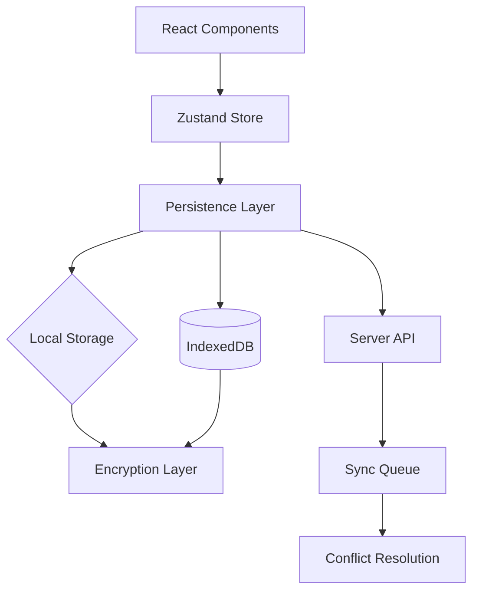

# Persistence Strategies

## Introduction

Chat applications need to persist conversations across sessions. Users expect to return and find their conversation history intact. The right persistence strategy balances durability, performance, and sync capabilities while respecting privacy.

In this lesson, we'll implement persistence patterns from simple local storage to encrypted cloud sync.

### What We'll Cover

- Storage layer selection
- Sync vs async persistence
- Encryption for sensitive data
- Cross-device synchronization
- Data lifecycle management

### Prerequisites

- [Optimistic Updates](./08-optimistic-updates.md)
- [Conversation History Storage](./03-conversation-history-storage.md)
- IndexedDB basics

---

## Storage Options Comparison

| Storage | Capacity | Speed | Persistence | Sync |
|---------|----------|-------|-------------|------|
| Memory | Unlimited* | Fastest | None | No |
| localStorage | 5-10MB | Fast | Tab close | No |
| sessionStorage | 5-10MB | Fast | Session | No |
| IndexedDB | 50MB-Unlimited | Medium | Permanent | No |
| Server | Unlimited | Slow | Permanent | Yes |

> **Note:** Memory is limited by available RAM. Browser may evict IndexedDB data under storage pressure.

---

## Local Persistence Architecture



---

## Basic Persistence Hook

```typescript
interface PersistenceConfig {
  key: string;
  storage: 'localStorage' | 'indexedDB' | 'sessionStorage';
  version?: number;
  migrate?: (old: unknown, version: number) => unknown;
}

export function usePersistence<T>(
  config: PersistenceConfig,
  initial: T
): [T, (value: T | ((prev: T) => T)) => void, { loading: boolean; error: Error | null }] {
  const [value, setValue] = useState<T>(initial);
  const [loading, setLoading] = useState(true);
  const [error, setError] = useState<Error | null>(null);
  
  // Load on mount
  useEffect(() => {
    async function load() {
      try {
        const stored = await readStorage(config);
        if (stored !== null) {
          const migrated = config.migrate 
            ? config.migrate(stored.data, stored.version || 1)
            : stored.data;
          setValue(migrated as T);
        }
      } catch (err) {
        setError(err as Error);
      } finally {
        setLoading(false);
      }
    }
    load();
  }, [config.key]);
  
  // Persist on change
  const setAndPersist = useCallback((newValue: T | ((prev: T) => T)) => {
    setValue(prev => {
      const next = typeof newValue === 'function' 
        ? (newValue as (prev: T) => T)(prev)
        : newValue;
      
      // Async persist - don't await
      writeStorage(config, { data: next, version: config.version || 1 })
        .catch(err => setError(err));
      
      return next;
    });
  }, [config]);
  
  return [value, setAndPersist, { loading, error }];
}

async function readStorage(config: PersistenceConfig): Promise<{ data: unknown; version: number } | null> {
  switch (config.storage) {
    case 'localStorage':
    case 'sessionStorage':
      const storage = config.storage === 'localStorage' ? localStorage : sessionStorage;
      const raw = storage.getItem(config.key);
      return raw ? JSON.parse(raw) : null;
      
    case 'indexedDB':
      return await readFromIndexedDB(config.key);
      
    default:
      throw new Error(`Unknown storage: ${config.storage}`);
  }
}

async function writeStorage(config: PersistenceConfig, value: { data: unknown; version: number }): Promise<void> {
  switch (config.storage) {
    case 'localStorage':
    case 'sessionStorage':
      const storage = config.storage === 'localStorage' ? localStorage : sessionStorage;
      storage.setItem(config.key, JSON.stringify(value));
      break;
      
    case 'indexedDB':
      await writeToIndexedDB(config.key, value);
      break;
  }
}
```

---

## IndexedDB Persistence

```typescript
const DB_NAME = 'chat-app';
const DB_VERSION = 1;
const STORE_NAME = 'conversations';

async function openDatabase(): Promise<IDBDatabase> {
  return new Promise((resolve, reject) => {
    const request = indexedDB.open(DB_NAME, DB_VERSION);
    
    request.onerror = () => reject(request.error);
    request.onsuccess = () => resolve(request.result);
    
    request.onupgradeneeded = (event) => {
      const db = (event.target as IDBOpenDBRequest).result;
      
      if (!db.objectStoreNames.contains(STORE_NAME)) {
        const store = db.createObjectStore(STORE_NAME, { keyPath: 'id' });
        store.createIndex('updatedAt', 'updatedAt', { unique: false });
        store.createIndex('userId', 'userId', { unique: false });
      }
    };
  });
}

export class IndexedDBPersistence {
  private dbPromise: Promise<IDBDatabase>;
  
  constructor() {
    this.dbPromise = openDatabase();
  }
  
  async saveConversation(conversation: Conversation): Promise<void> {
    const db = await this.dbPromise;
    
    return new Promise((resolve, reject) => {
      const tx = db.transaction(STORE_NAME, 'readwrite');
      const store = tx.objectStore(STORE_NAME);
      
      const request = store.put({
        ...conversation,
        updatedAt: new Date().toISOString()
      });
      
      request.onerror = () => reject(request.error);
      request.onsuccess = () => resolve();
    });
  }
  
  async getConversation(id: string): Promise<Conversation | null> {
    const db = await this.dbPromise;
    
    return new Promise((resolve, reject) => {
      const tx = db.transaction(STORE_NAME, 'readonly');
      const store = tx.objectStore(STORE_NAME);
      const request = store.get(id);
      
      request.onerror = () => reject(request.error);
      request.onsuccess = () => resolve(request.result || null);
    });
  }
  
  async getAllConversations(): Promise<Conversation[]> {
    const db = await this.dbPromise;
    
    return new Promise((resolve, reject) => {
      const tx = db.transaction(STORE_NAME, 'readonly');
      const store = tx.objectStore(STORE_NAME);
      const request = store.getAll();
      
      request.onerror = () => reject(request.error);
      request.onsuccess = () => resolve(request.result);
    });
  }
  
  async deleteConversation(id: string): Promise<void> {
    const db = await this.dbPromise;
    
    return new Promise((resolve, reject) => {
      const tx = db.transaction(STORE_NAME, 'readwrite');
      const store = tx.objectStore(STORE_NAME);
      const request = store.delete(id);
      
      request.onerror = () => reject(request.error);
      request.onsuccess = () => resolve();
    });
  }
  
  async getConversationsByDate(
    startDate: Date, 
    endDate: Date
  ): Promise<Conversation[]> {
    const db = await this.dbPromise;
    
    return new Promise((resolve, reject) => {
      const tx = db.transaction(STORE_NAME, 'readonly');
      const store = tx.objectStore(STORE_NAME);
      const index = store.index('updatedAt');
      
      const range = IDBKeyRange.bound(
        startDate.toISOString(),
        endDate.toISOString()
      );
      
      const request = index.getAll(range);
      
      request.onerror = () => reject(request.error);
      request.onsuccess = () => resolve(request.result);
    });
  }
  
  async clearAll(): Promise<void> {
    const db = await this.dbPromise;
    
    return new Promise((resolve, reject) => {
      const tx = db.transaction(STORE_NAME, 'readwrite');
      const store = tx.objectStore(STORE_NAME);
      const request = store.clear();
      
      request.onerror = () => reject(request.error);
      request.onsuccess = () => resolve();
    });
  }
}
```

---

## Encryption Layer

```typescript
// Web Crypto API encryption for sensitive conversations

export class EncryptedStorage {
  private key: CryptoKey | null = null;
  private storage: IndexedDBPersistence;
  
  constructor(storage: IndexedDBPersistence) {
    this.storage = storage;
  }
  
  async initialize(passphrase: string): Promise<void> {
    this.key = await this.deriveKey(passphrase);
  }
  
  private async deriveKey(passphrase: string): Promise<CryptoKey> {
    const encoder = new TextEncoder();
    const keyMaterial = await crypto.subtle.importKey(
      'raw',
      encoder.encode(passphrase),
      'PBKDF2',
      false,
      ['deriveBits', 'deriveKey']
    );
    
    // Use a fixed salt for simplicity; in production, store salt separately
    const salt = encoder.encode('chat-app-salt-v1');
    
    return crypto.subtle.deriveKey(
      {
        name: 'PBKDF2',
        salt,
        iterations: 100000,
        hash: 'SHA-256'
      },
      keyMaterial,
      { name: 'AES-GCM', length: 256 },
      false,
      ['encrypt', 'decrypt']
    );
  }
  
  private async encrypt(data: string): Promise<{ ciphertext: ArrayBuffer; iv: Uint8Array }> {
    if (!this.key) throw new Error('Storage not initialized');
    
    const encoder = new TextEncoder();
    const iv = crypto.getRandomValues(new Uint8Array(12));
    
    const ciphertext = await crypto.subtle.encrypt(
      { name: 'AES-GCM', iv },
      this.key,
      encoder.encode(data)
    );
    
    return { ciphertext, iv };
  }
  
  private async decrypt(ciphertext: ArrayBuffer, iv: Uint8Array): Promise<string> {
    if (!this.key) throw new Error('Storage not initialized');
    
    const decrypted = await crypto.subtle.decrypt(
      { name: 'AES-GCM', iv },
      this.key,
      ciphertext
    );
    
    return new TextDecoder().decode(decrypted);
  }
  
  async saveEncrypted(conversation: Conversation): Promise<void> {
    const json = JSON.stringify(conversation);
    const { ciphertext, iv } = await this.encrypt(json);
    
    // Store encrypted data with metadata
    await this.storage.saveConversation({
      id: conversation.id,
      encrypted: true,
      ciphertext: Array.from(new Uint8Array(ciphertext)),
      iv: Array.from(iv),
      updatedAt: new Date()
    } as any);
  }
  
  async loadDecrypted(id: string): Promise<Conversation | null> {
    const stored = await this.storage.getConversation(id) as any;
    if (!stored) return null;
    
    if (stored.encrypted) {
      const ciphertext = new Uint8Array(stored.ciphertext).buffer;
      const iv = new Uint8Array(stored.iv);
      const json = await this.decrypt(ciphertext, iv);
      return JSON.parse(json);
    }
    
    return stored;
  }
}
```

---

## Sync Queue

```typescript
interface SyncOperation {
  id: string;
  type: 'create' | 'update' | 'delete';
  entity: 'conversation' | 'message';
  entityId: string;
  data?: unknown;
  timestamp: Date;
  retries: number;
}

export class SyncQueue {
  private queue: SyncOperation[] = [];
  private processing = false;
  private storage: IndexedDBPersistence;
  private apiEndpoint: string;
  
  constructor(apiEndpoint: string) {
    this.apiEndpoint = apiEndpoint;
    this.storage = new IndexedDBPersistence();
    this.loadQueue();
    
    // Process when online
    window.addEventListener('online', () => this.process());
  }
  
  private async loadQueue(): Promise<void> {
    const stored = localStorage.getItem('sync-queue');
    if (stored) {
      this.queue = JSON.parse(stored).map((op: any) => ({
        ...op,
        timestamp: new Date(op.timestamp)
      }));
    }
  }
  
  private persistQueue(): void {
    localStorage.setItem('sync-queue', JSON.stringify(this.queue));
  }
  
  enqueue(operation: Omit<SyncOperation, 'id' | 'timestamp' | 'retries'>): void {
    this.queue.push({
      ...operation,
      id: `sync_${Date.now()}_${Math.random()}`,
      timestamp: new Date(),
      retries: 0
    });
    
    this.persistQueue();
    this.process();
  }
  
  async process(): Promise<void> {
    if (this.processing || !navigator.onLine || this.queue.length === 0) {
      return;
    }
    
    this.processing = true;
    
    while (this.queue.length > 0) {
      const operation = this.queue[0];
      
      try {
        await this.executeOperation(operation);
        this.queue.shift();
        this.persistQueue();
      } catch (error) {
        operation.retries++;
        
        if (operation.retries >= 3) {
          console.error('Sync operation failed permanently:', operation);
          this.queue.shift();  // Remove failed operation
          this.persistQueue();
        } else {
          // Wait before retry
          await new Promise(r => setTimeout(r, 1000 * Math.pow(2, operation.retries)));
        }
        
        if (!navigator.onLine) break;
      }
    }
    
    this.processing = false;
  }
  
  private async executeOperation(op: SyncOperation): Promise<void> {
    const url = `${this.apiEndpoint}/${op.entity}s/${op.entityId}`;
    
    const options: RequestInit = {
      headers: { 'Content-Type': 'application/json' }
    };
    
    switch (op.type) {
      case 'create':
        await fetch(`${this.apiEndpoint}/${op.entity}s`, {
          ...options,
          method: 'POST',
          body: JSON.stringify(op.data)
        });
        break;
        
      case 'update':
        await fetch(url, {
          ...options,
          method: 'PATCH',
          body: JSON.stringify(op.data)
        });
        break;
        
      case 'delete':
        await fetch(url, {
          ...options,
          method: 'DELETE'
        });
        break;
    }
  }
  
  getPendingCount(): number {
    return this.queue.length;
  }
  
  clearQueue(): void {
    this.queue = [];
    this.persistQueue();
  }
}
```

---

## Cross-Device Sync

```typescript
interface SyncState {
  lastSyncedAt: Date | null;
  syncVersion: number;
  pendingChanges: number;
  syncStatus: 'idle' | 'syncing' | 'error';
}

export class CrossDeviceSync {
  private localStore: IndexedDBPersistence;
  private syncQueue: SyncQueue;
  private apiEndpoint: string;
  private syncState: SyncState = {
    lastSyncedAt: null,
    syncVersion: 0,
    pendingChanges: 0,
    syncStatus: 'idle'
  };
  
  constructor(apiEndpoint: string) {
    this.apiEndpoint = apiEndpoint;
    this.localStore = new IndexedDBPersistence();
    this.syncQueue = new SyncQueue(apiEndpoint);
  }
  
  async sync(): Promise<void> {
    if (this.syncState.syncStatus === 'syncing') return;
    
    this.syncState.syncStatus = 'syncing';
    
    try {
      // 1. Push local changes
      await this.syncQueue.process();
      
      // 2. Fetch remote changes since last sync
      const response = await fetch(
        `${this.apiEndpoint}/sync?since=${this.syncState.lastSyncedAt?.toISOString() || ''}`
      );
      
      const remoteChanges = await response.json();
      
      // 3. Merge remote changes
      for (const change of remoteChanges.conversations) {
        const local = await this.localStore.getConversation(change.id);
        
        if (!local || new Date(change.updatedAt) > new Date(local.updatedAt)) {
          // Remote is newer
          await this.localStore.saveConversation(change);
        }
      }
      
      // 4. Handle deleted conversations
      for (const deletedId of remoteChanges.deleted) {
        await this.localStore.deleteConversation(deletedId);
      }
      
      this.syncState.lastSyncedAt = new Date();
      this.syncState.syncVersion = remoteChanges.version;
      this.syncState.syncStatus = 'idle';
      
    } catch (error) {
      this.syncState.syncStatus = 'error';
      throw error;
    }
  }
  
  async saveWithSync(conversation: Conversation): Promise<void> {
    // Save locally first
    await this.localStore.saveConversation(conversation);
    
    // Queue for sync
    this.syncQueue.enqueue({
      type: conversation.createdAt === conversation.updatedAt ? 'create' : 'update',
      entity: 'conversation',
      entityId: conversation.id,
      data: conversation
    });
    
    this.syncState.pendingChanges = this.syncQueue.getPendingCount();
  }
  
  getSyncState(): SyncState {
    return { ...this.syncState };
  }
  
  // Real-time updates via WebSocket
  connectRealtime(): void {
    const ws = new WebSocket(`${this.apiEndpoint.replace('http', 'ws')}/realtime`);
    
    ws.onmessage = async (event) => {
      const update = JSON.parse(event.data);
      
      if (update.type === 'conversation_updated') {
        const local = await this.localStore.getConversation(update.id);
        if (!local || new Date(update.updatedAt) > new Date(local.updatedAt)) {
          await this.localStore.saveConversation(update.data);
        }
      }
    };
    
    ws.onclose = () => {
      // Reconnect after delay
      setTimeout(() => this.connectRealtime(), 5000);
    };
  }
}
```

---

## Data Lifecycle Management

```typescript
interface RetentionPolicy {
  maxAge: number;        // Max age in days
  maxConversations: number;
  maxStorageBytes: number;
}

export class DataLifecycleManager {
  private storage: IndexedDBPersistence;
  private policy: RetentionPolicy;
  
  constructor(storage: IndexedDBPersistence, policy: RetentionPolicy) {
    this.storage = storage;
    this.policy = policy;
  }
  
  async enforceRetention(): Promise<{ deleted: number; freedBytes: number }> {
    const conversations = await this.storage.getAllConversations();
    let deleted = 0;
    let freedBytes = 0;
    
    // Sort by last updated (oldest first)
    conversations.sort((a, b) => 
      new Date(a.updatedAt).getTime() - new Date(b.updatedAt).getTime()
    );
    
    const now = Date.now();
    const maxAgeMs = this.policy.maxAge * 24 * 60 * 60 * 1000;
    
    for (const conversation of conversations) {
      const age = now - new Date(conversation.updatedAt).getTime();
      const tooOld = age > maxAgeMs;
      const tooMany = conversations.length - deleted > this.policy.maxConversations;
      
      if (tooOld || tooMany) {
        const size = this.estimateSize(conversation);
        await this.storage.deleteConversation(conversation.id);
        deleted++;
        freedBytes += size;
      }
    }
    
    return { deleted, freedBytes };
  }
  
  private estimateSize(conversation: Conversation): number {
    return new Blob([JSON.stringify(conversation)]).size;
  }
  
  async getStorageStats(): Promise<{
    used: number;
    available: number;
    quota: number;
    conversations: number;
  }> {
    const conversations = await this.storage.getAllConversations();
    const used = conversations.reduce((sum, c) => sum + this.estimateSize(c), 0);
    
    // Use Storage API if available
    if (navigator.storage?.estimate) {
      const estimate = await navigator.storage.estimate();
      return {
        used,
        available: (estimate.quota || 0) - (estimate.usage || 0),
        quota: estimate.quota || 0,
        conversations: conversations.length
      };
    }
    
    return {
      used,
      available: 50 * 1024 * 1024,  // Assume 50MB
      quota: 50 * 1024 * 1024,
      conversations: conversations.length
    };
  }
  
  async exportData(): Promise<Blob> {
    const conversations = await this.storage.getAllConversations();
    const exportData = {
      version: 1,
      exportedAt: new Date().toISOString(),
      conversations
    };
    
    return new Blob(
      [JSON.stringify(exportData, null, 2)],
      { type: 'application/json' }
    );
  }
  
  async importData(blob: Blob): Promise<{ imported: number; skipped: number }> {
    const text = await blob.text();
    const data = JSON.parse(text);
    
    let imported = 0;
    let skipped = 0;
    
    for (const conversation of data.conversations) {
      const existing = await this.storage.getConversation(conversation.id);
      
      if (!existing || new Date(conversation.updatedAt) > new Date(existing.updatedAt)) {
        await this.storage.saveConversation(conversation);
        imported++;
      } else {
        skipped++;
      }
    }
    
    return { imported, skipped };
  }
}
```

---

## Zustand with Persistence

```typescript
import { create } from 'zustand';
import { persist, createJSONStorage } from 'zustand/middleware';

interface ChatStore {
  conversations: Map<string, Conversation>;
  activeConversationId: string | null;
  
  // Actions
  addConversation: (conversation: Conversation) => void;
  updateConversation: (id: string, updates: Partial<Conversation>) => void;
  deleteConversation: (id: string) => void;
  setActive: (id: string | null) => void;
}

export const useChatStore = create<ChatStore>()(
  persist(
    (set, get) => ({
      conversations: new Map(),
      activeConversationId: null,
      
      addConversation: (conversation) => set(state => ({
        conversations: new Map(state.conversations).set(conversation.id, conversation)
      })),
      
      updateConversation: (id, updates) => set(state => {
        const conversations = new Map(state.conversations);
        const existing = conversations.get(id);
        if (existing) {
          conversations.set(id, { ...existing, ...updates, updatedAt: new Date() });
        }
        return { conversations };
      }),
      
      deleteConversation: (id) => set(state => {
        const conversations = new Map(state.conversations);
        conversations.delete(id);
        return { 
          conversations,
          activeConversationId: state.activeConversationId === id ? null : state.activeConversationId
        };
      }),
      
      setActive: (id) => set({ activeConversationId: id })
    }),
    {
      name: 'chat-storage',
      storage: createJSONStorage(() => localStorage),
      partialize: (state) => ({
        conversations: Array.from(state.conversations.entries()),
        activeConversationId: state.activeConversationId
      }),
      merge: (persisted: any, current) => ({
        ...current,
        conversations: new Map(persisted?.conversations || []),
        activeConversationId: persisted?.activeConversationId || null
      })
    }
  )
);
```

---

## Best Practices

| ✅ Do | ❌ Don't |
|-------|---------|
| Use IndexedDB for large data | Store megabytes in localStorage |
| Encrypt sensitive content | Store plaintext conversations |
| Queue sync operations | Sync every keystroke |
| Handle offline gracefully | Fail silently when offline |
| Implement data retention | Keep data forever |

---

## Common Pitfalls

| ❌ Mistake | ✅ Solution |
|-----------|-------------|
| Blocking UI with sync writes | Use async writes with optimistic UI |
| No migration strategy | Version data and implement migrations |
| Ignoring storage limits | Monitor usage and enforce retention |
| No conflict resolution | Implement merge strategy |
| Storing auth tokens | Use httpOnly cookies instead |

---

## Hands-on Exercise

### Your Task

Build a persistent chat system with:
1. IndexedDB storage for conversations
2. Encrypted message content
3. Sync queue for offline support
4. Data retention policy (30 days max)

### Requirements

1. Initialize encryption with passphrase
2. Save/load encrypted conversations
3. Queue operations when offline
4. Clean up old conversations automatically

<details>
<summary>💡 Hints (click to expand)</summary>

- Use Web Crypto API for encryption
- Store IV alongside ciphertext
- Check `navigator.onLine` before sync
- Use `navigator.storage.estimate()` for quota

</details>

---

## Summary

✅ **IndexedDB** for large conversation data  
✅ **Encryption** protects sensitive content  
✅ **Sync queue** handles offline operations  
✅ **Cross-device sync** via server + WebSocket  
✅ **Data lifecycle** prevents unbounded growth  
✅ **Zustand persist** for simple state persistence

---

## Further Reading

- [IndexedDB API - MDN](https://developer.mozilla.org/en-US/docs/Web/API/IndexedDB_API)
- [Web Crypto API - MDN](https://developer.mozilla.org/en-US/docs/Web/API/Web_Crypto_API)
- [Storage API - MDN](https://developer.mozilla.org/en-US/docs/Web/API/Storage_API)
- [Zustand Persist Middleware](https://docs.pmnd.rs/zustand/integrations/persisting-store-data)

---

**Previous:** [Optimistic Updates](./08-optimistic-updates.md)  
**Next:** [Conversation Switching](./10-conversation-switching.md)

<!-- 
Sources Consulted:
- MDN IndexedDB: https://developer.mozilla.org/en-US/docs/Web/API/IndexedDB_API
- MDN Web Crypto: https://developer.mozilla.org/en-US/docs/Web/API/Web_Crypto_API
- Zustand persist: https://docs.pmnd.rs/zustand/integrations/persisting-store-data
-->
