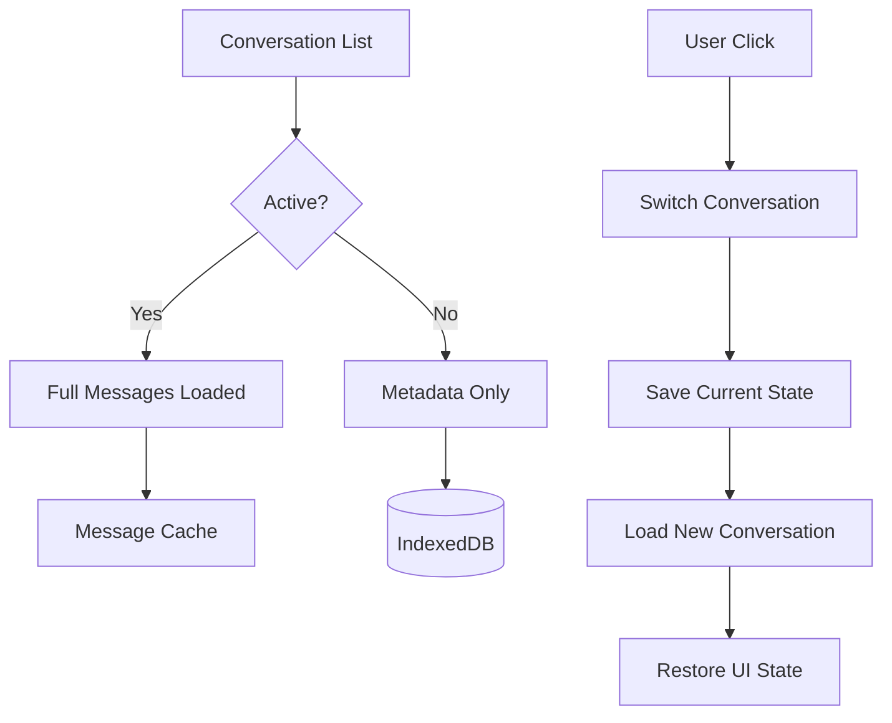

# Conversation Switching

## Introduction

Users often maintain multiple conversations—different topics, contexts, or AI assistants. A well-designed switching system lets users navigate between conversations fluidly, preserves scroll position and draft text, and loads conversation history efficiently.

In this lesson, we'll implement conversation switching patterns for multi-conversation chat applications.

### What We'll Cover

- Multiple conversation management
- Active conversation state
- Conversation list UI
- Lazy loading conversation data
- Preserving UI state across switches

### Prerequisites

- [Persistence Strategies](./09-persistence-strategies.md)
- [Conversation History Storage](./03-conversation-history-storage.md)
- React state management

---

## Conversation List Architecture



---

## Conversation Manager

```typescript
interface ConversationMeta {
  id: string;
  title: string;
  preview: string;          // Last message snippet
  updatedAt: Date;
  messageCount: number;
  unread: boolean;
  model?: string;
  systemPrompt?: string;
}

interface ConversationFull extends ConversationMeta {
  messages: Message[];
}

interface UIState {
  scrollPosition: number;
  draftText: string;
  selectedMessageId?: string;
}

export class ConversationManager {
  private metaList: ConversationMeta[] = [];
  private loadedConversations: Map<string, ConversationFull> = new Map();
  private uiStates: Map<string, UIState> = new Map();
  private activeId: string | null = null;
  private storage: IndexedDBPersistence;
  
  constructor(storage: IndexedDBPersistence) {
    this.storage = storage;
  }
  
  async initialize(): Promise<void> {
    // Load just metadata for all conversations
    const all = await this.storage.getAllConversations();
    
    this.metaList = all.map(c => ({
      id: c.id,
      title: c.title || 'New Conversation',
      preview: c.messages?.[c.messages.length - 1]?.content.slice(0, 100) || '',
      updatedAt: new Date(c.updatedAt),
      messageCount: c.messages?.length || 0,
      unread: false,
      model: c.model,
      systemPrompt: c.systemPrompt
    }));
    
    // Sort by most recent
    this.metaList.sort((a, b) => b.updatedAt.getTime() - a.updatedAt.getTime());
  }
  
  getList(): ConversationMeta[] {
    return [...this.metaList];
  }
  
  getActive(): ConversationFull | null {
    if (!this.activeId) return null;
    return this.loadedConversations.get(this.activeId) || null;
  }
  
  async switchTo(id: string): Promise<ConversationFull> {
    // Save current UI state
    if (this.activeId) {
      // UI state would be passed in from React
      // this.saveUIState(this.activeId, currentUIState);
    }
    
    // Check if already loaded
    if (this.loadedConversations.has(id)) {
      this.activeId = id;
      return this.loadedConversations.get(id)!;
    }
    
    // Load from storage
    const conversation = await this.storage.getConversation(id);
    if (!conversation) {
      throw new Error(`Conversation ${id} not found`);
    }
    
    const full: ConversationFull = {
      id: conversation.id,
      title: conversation.title || 'New Conversation',
      preview: conversation.messages?.[conversation.messages.length - 1]?.content.slice(0, 100) || '',
      updatedAt: new Date(conversation.updatedAt),
      messageCount: conversation.messages?.length || 0,
      unread: false,
      model: conversation.model,
      systemPrompt: conversation.systemPrompt,
      messages: conversation.messages || []
    };
    
    // Cache loaded conversation
    this.loadedConversations.set(id, full);
    this.activeId = id;
    
    // Mark as read
    this.updateMeta(id, { unread: false });
    
    return full;
  }
  
  saveUIState(id: string, state: UIState): void {
    this.uiStates.set(id, state);
  }
  
  getUIState(id: string): UIState | undefined {
    return this.uiStates.get(id);
  }
  
  private updateMeta(id: string, updates: Partial<ConversationMeta>): void {
    const index = this.metaList.findIndex(m => m.id === id);
    if (index >= 0) {
      this.metaList[index] = { ...this.metaList[index], ...updates };
    }
  }
  
  async createNew(): Promise<ConversationFull> {
    const id = `conv_${Date.now()}`;
    const conversation: ConversationFull = {
      id,
      title: 'New Conversation',
      preview: '',
      updatedAt: new Date(),
      messageCount: 0,
      unread: false,
      messages: []
    };
    
    // Save to storage
    await this.storage.saveConversation({
      id,
      title: conversation.title,
      messages: [],
      updatedAt: new Date()
    });
    
    // Add to lists
    this.metaList.unshift({
      id,
      title: conversation.title,
      preview: '',
      updatedAt: conversation.updatedAt,
      messageCount: 0,
      unread: false
    });
    
    this.loadedConversations.set(id, conversation);
    this.activeId = id;
    
    return conversation;
  }
  
  async delete(id: string): Promise<void> {
    await this.storage.deleteConversation(id);
    
    this.metaList = this.metaList.filter(m => m.id !== id);
    this.loadedConversations.delete(id);
    this.uiStates.delete(id);
    
    if (this.activeId === id) {
      // Switch to first available or create new
      if (this.metaList.length > 0) {
        await this.switchTo(this.metaList[0].id);
      } else {
        this.activeId = null;
      }
    }
  }
  
  // LRU cache management
  pruneCache(maxCached: number = 5): void {
    if (this.loadedConversations.size <= maxCached) return;
    
    const sortedByAccess = [...this.loadedConversations.entries()]
      .filter(([id]) => id !== this.activeId)
      .sort(([, a], [, b]) => a.updatedAt.getTime() - b.updatedAt.getTime());
    
    const toRemove = sortedByAccess.slice(0, this.loadedConversations.size - maxCached);
    
    for (const [id] of toRemove) {
      this.loadedConversations.delete(id);
    }
  }
}
```

---

## React Hook Implementation

```typescript
interface UseConversationSwitchingReturn {
  conversations: ConversationMeta[];
  activeConversation: ConversationFull | null;
  isLoading: boolean;
  switchTo: (id: string) => Promise<void>;
  createNew: () => Promise<void>;
  deleteConversation: (id: string) => Promise<void>;
  updateActiveConversation: (updates: Partial<ConversationFull>) => void;
}

export function useConversationSwitching(): UseConversationSwitchingReturn {
  const [conversations, setConversations] = useState<ConversationMeta[]>([]);
  const [activeConversation, setActiveConversation] = useState<ConversationFull | null>(null);
  const [isLoading, setIsLoading] = useState(false);
  
  const managerRef = useRef<ConversationManager | null>(null);
  const scrollPositionRef = useRef(0);
  const draftTextRef = useRef('');
  
  // Initialize
  useEffect(() => {
    const manager = new ConversationManager(new IndexedDBPersistence());
    managerRef.current = manager;
    
    manager.initialize().then(() => {
      setConversations(manager.getList());
      
      // Auto-select first or create new
      const list = manager.getList();
      if (list.length > 0) {
        manager.switchTo(list[0].id).then(setActiveConversation);
      }
    });
  }, []);
  
  const switchTo = async (id: string) => {
    const manager = managerRef.current;
    if (!manager || isLoading) return;
    
    setIsLoading(true);
    
    // Save current UI state
    if (activeConversation) {
      manager.saveUIState(activeConversation.id, {
        scrollPosition: scrollPositionRef.current,
        draftText: draftTextRef.current
      });
    }
    
    try {
      const conversation = await manager.switchTo(id);
      setActiveConversation(conversation);
      
      // Restore UI state
      const uiState = manager.getUIState(id);
      if (uiState) {
        scrollPositionRef.current = uiState.scrollPosition;
        draftTextRef.current = uiState.draftText;
      } else {
        scrollPositionRef.current = 0;
        draftTextRef.current = '';
      }
      
    } finally {
      setIsLoading(false);
    }
  };
  
  const createNew = async () => {
    const manager = managerRef.current;
    if (!manager) return;
    
    const conversation = await manager.createNew();
    setConversations(manager.getList());
    setActiveConversation(conversation);
  };
  
  const deleteConversation = async (id: string) => {
    const manager = managerRef.current;
    if (!manager) return;
    
    await manager.delete(id);
    setConversations(manager.getList());
    setActiveConversation(manager.getActive());
  };
  
  const updateActiveConversation = (updates: Partial<ConversationFull>) => {
    setActiveConversation(prev => prev ? { ...prev, ...updates } : null);
  };
  
  return {
    conversations,
    activeConversation,
    isLoading,
    switchTo,
    createNew,
    deleteConversation,
    updateActiveConversation
  };
}
```

---

## Conversation List Component

```tsx
interface ConversationListProps {
  conversations: ConversationMeta[];
  activeId: string | null;
  onSelect: (id: string) => void;
  onDelete: (id: string) => void;
  onNewChat: () => void;
}

function ConversationList({
  conversations,
  activeId,
  onSelect,
  onDelete,
  onNewChat
}: ConversationListProps) {
  return (
    <div className="flex flex-col h-full bg-gray-900 text-white">
      {/* New Chat Button */}
      <button
        onClick={onNewChat}
        className="m-2 p-3 flex items-center gap-2 border border-gray-600 rounded-lg hover:bg-gray-800"
      >
        <span>+</span>
        <span>New Chat</span>
      </button>
      
      {/* Conversation List */}
      <div className="flex-1 overflow-y-auto">
        {conversations.map(conv => (
          <ConversationItem
            key={conv.id}
            conversation={conv}
            isActive={conv.id === activeId}
            onSelect={() => onSelect(conv.id)}
            onDelete={() => onDelete(conv.id)}
          />
        ))}
      </div>
    </div>
  );
}

interface ConversationItemProps {
  conversation: ConversationMeta;
  isActive: boolean;
  onSelect: () => void;
  onDelete: () => void;
}

function ConversationItem({
  conversation,
  isActive,
  onSelect,
  onDelete
}: ConversationItemProps) {
  const [showMenu, setShowMenu] = useState(false);
  
  return (
    <div
      className={`
        group relative p-3 cursor-pointer
        ${isActive ? 'bg-gray-800' : 'hover:bg-gray-800'}
        ${conversation.unread ? 'font-semibold' : ''}
      `}
      onClick={onSelect}
    >
      <div className="flex items-center gap-2">
        <span className="text-gray-400">💬</span>
        <div className="flex-1 min-w-0">
          <p className="truncate">{conversation.title}</p>
          <p className="text-xs text-gray-500 truncate">
            {conversation.preview || 'No messages yet'}
          </p>
        </div>
        
        {/* Options Menu */}
        <button
          onClick={(e) => {
            e.stopPropagation();
            setShowMenu(!showMenu);
          }}
          className="opacity-0 group-hover:opacity-100 p-1"
        >
          ⋮
        </button>
      </div>
      
      {showMenu && (
        <div className="absolute right-2 top-full mt-1 bg-gray-700 rounded shadow-lg z-10">
          <button
            onClick={(e) => {
              e.stopPropagation();
              onDelete();
              setShowMenu(false);
            }}
            className="px-4 py-2 text-sm text-red-400 hover:bg-gray-600 w-full text-left"
          >
            Delete
          </button>
        </div>
      )}
      
      {/* Unread indicator */}
      {conversation.unread && (
        <span className="absolute right-4 top-1/2 -translate-y-1/2 w-2 h-2 bg-blue-500 rounded-full" />
      )}
    </div>
  );
}
```

---

## Lazy Loading Messages

```typescript
interface LazyMessageLoader {
  loadPage(conversationId: string, page: number, pageSize: number): Promise<Message[]>;
  getTotalPages(conversationId: string, pageSize: number): Promise<number>;
}

export function useLazyMessages(
  conversationId: string | null,
  pageSize: number = 50
) {
  const [messages, setMessages] = useState<Message[]>([]);
  const [page, setPage] = useState(0);
  const [hasMore, setHasMore] = useState(true);
  const [isLoading, setIsLoading] = useState(false);
  
  const storage = useRef(new IndexedDBPersistence());
  
  // Reset when conversation changes
  useEffect(() => {
    setMessages([]);
    setPage(0);
    setHasMore(true);
    
    if (conversationId) {
      loadInitialMessages();
    }
  }, [conversationId]);
  
  const loadInitialMessages = async () => {
    if (!conversationId) return;
    
    setIsLoading(true);
    
    try {
      const conversation = await storage.current.getConversation(conversationId);
      if (!conversation) return;
      
      // Load most recent messages first
      const allMessages = conversation.messages || [];
      const recentMessages = allMessages.slice(-pageSize);
      
      setMessages(recentMessages);
      setHasMore(allMessages.length > pageSize);
      setPage(1);
    } finally {
      setIsLoading(false);
    }
  };
  
  const loadMore = async () => {
    if (!conversationId || isLoading || !hasMore) return;
    
    setIsLoading(true);
    
    try {
      const conversation = await storage.current.getConversation(conversationId);
      if (!conversation) return;
      
      const allMessages = conversation.messages || [];
      const startIndex = Math.max(0, allMessages.length - (page + 1) * pageSize);
      const endIndex = allMessages.length - page * pageSize;
      
      const olderMessages = allMessages.slice(startIndex, endIndex);
      
      setMessages(prev => [...olderMessages, ...prev]);
      setHasMore(startIndex > 0);
      setPage(p => p + 1);
    } finally {
      setIsLoading(false);
    }
  };
  
  return { messages, loadMore, hasMore, isLoading };
}
```

---

## UI State Preservation

```typescript
interface ScrollState {
  position: number;
  isAtBottom: boolean;
}

export function useScrollPreservation(
  containerRef: RefObject<HTMLElement>,
  conversationId: string | null
) {
  const scrollStates = useRef<Map<string, ScrollState>>(new Map());
  
  // Save scroll position when conversation changes
  useEffect(() => {
    return () => {
      if (conversationId && containerRef.current) {
        const container = containerRef.current;
        const isAtBottom = 
          container.scrollHeight - container.scrollTop <= container.clientHeight + 50;
        
        scrollStates.current.set(conversationId, {
          position: container.scrollTop,
          isAtBottom
        });
      }
    };
  }, [conversationId]);
  
  // Restore scroll position after switch
  useEffect(() => {
    if (!conversationId || !containerRef.current) return;
    
    const savedState = scrollStates.current.get(conversationId);
    const container = containerRef.current;
    
    // Wait for content to render
    requestAnimationFrame(() => {
      if (savedState) {
        if (savedState.isAtBottom) {
          // Scroll to bottom if was at bottom
          container.scrollTop = container.scrollHeight;
        } else {
          // Restore exact position
          container.scrollTop = savedState.position;
        }
      } else {
        // New conversation - scroll to bottom
        container.scrollTop = container.scrollHeight;
      }
    });
  }, [conversationId]);
}

export function useDraftPreservation(
  conversationId: string | null
): [string, (value: string) => void] {
  const drafts = useRef<Map<string, string>>(new Map());
  const [draft, setDraft] = useState('');
  
  // Save draft when conversation changes
  useEffect(() => {
    return () => {
      if (conversationId && draft) {
        drafts.current.set(conversationId, draft);
      }
    };
  }, [conversationId, draft]);
  
  // Restore draft after switch
  useEffect(() => {
    if (conversationId) {
      setDraft(drafts.current.get(conversationId) || '');
    }
  }, [conversationId]);
  
  const updateDraft = (value: string) => {
    setDraft(value);
    if (conversationId) {
      drafts.current.set(conversationId, value);
    }
  };
  
  return [draft, updateDraft];
}
```

---

## Complete Chat Layout

```tsx
function ChatApp() {
  const {
    conversations,
    activeConversation,
    isLoading,
    switchTo,
    createNew,
    deleteConversation,
    updateActiveConversation
  } = useConversationSwitching();
  
  const messagesRef = useRef<HTMLDivElement>(null);
  const [draft, updateDraft] = useDraftPreservation(activeConversation?.id || null);
  
  useScrollPreservation(messagesRef, activeConversation?.id || null);
  
  const handleSendMessage = async (content: string) => {
    if (!activeConversation) return;
    
    // Add user message
    const userMessage: Message = {
      id: `msg_${Date.now()}`,
      role: 'user',
      content,
      status: 'complete',
      timestamp: new Date()
    };
    
    updateActiveConversation({
      messages: [...activeConversation.messages, userMessage]
    });
    
    updateDraft('');
    
    // Get AI response...
  };
  
  return (
    <div className="flex h-screen">
      {/* Sidebar */}
      <div className="w-64 flex-shrink-0">
        <ConversationList
          conversations={conversations}
          activeId={activeConversation?.id || null}
          onSelect={switchTo}
          onDelete={deleteConversation}
          onNewChat={createNew}
        />
      </div>
      
      {/* Main Chat Area */}
      <div className="flex-1 flex flex-col">
        {activeConversation ? (
          <>
            {/* Header */}
            <div className="p-4 border-b">
              <h2 className="font-semibold">{activeConversation.title}</h2>
            </div>
            
            {/* Messages */}
            <div 
              ref={messagesRef}
              className="flex-1 overflow-y-auto p-4"
            >
              {isLoading ? (
                <div className="flex justify-center p-4">
                  <span className="animate-spin">⏳</span>
                </div>
              ) : (
                activeConversation.messages.map(msg => (
                  <MessageBubble key={msg.id} message={msg} />
                ))
              )}
            </div>
            
            {/* Input */}
            <div className="p-4 border-t">
              <ChatInput
                value={draft}
                onChange={updateDraft}
                onSubmit={handleSendMessage}
                disabled={isLoading}
              />
            </div>
          </>
        ) : (
          <div className="flex-1 flex items-center justify-center text-gray-500">
            <button onClick={createNew} className="text-blue-500 hover:underline">
              Start a new conversation
            </button>
          </div>
        )}
      </div>
    </div>
  );
}
```

---

## Keyboard Navigation

```typescript
function useConversationKeyboardNav(
  conversations: ConversationMeta[],
  activeId: string | null,
  onSwitch: (id: string) => void,
  onNew: () => void
) {
  useEffect(() => {
    function handleKeyDown(e: KeyboardEvent) {
      // Cmd/Ctrl + Shift + N: New conversation
      if ((e.metaKey || e.ctrlKey) && e.shiftKey && e.key === 'n') {
        e.preventDefault();
        onNew();
        return;
      }
      
      // Cmd/Ctrl + Up/Down: Navigate conversations
      if ((e.metaKey || e.ctrlKey) && (e.key === 'ArrowUp' || e.key === 'ArrowDown')) {
        e.preventDefault();
        
        const currentIndex = conversations.findIndex(c => c.id === activeId);
        
        if (e.key === 'ArrowUp' && currentIndex > 0) {
          onSwitch(conversations[currentIndex - 1].id);
        } else if (e.key === 'ArrowDown' && currentIndex < conversations.length - 1) {
          onSwitch(conversations[currentIndex + 1].id);
        }
      }
      
      // Cmd/Ctrl + 1-9: Quick switch to conversation
      if ((e.metaKey || e.ctrlKey) && /^[1-9]$/.test(e.key)) {
        e.preventDefault();
        const index = parseInt(e.key) - 1;
        if (conversations[index]) {
          onSwitch(conversations[index].id);
        }
      }
    }
    
    window.addEventListener('keydown', handleKeyDown);
    return () => window.removeEventListener('keydown', handleKeyDown);
  }, [conversations, activeId, onSwitch, onNew]);
}
```

---

## Search Conversations

```typescript
function useConversationSearch(conversations: ConversationMeta[]) {
  const [query, setQuery] = useState('');
  const [results, setResults] = useState<ConversationMeta[]>([]);
  
  // Debounced search
  useEffect(() => {
    if (!query.trim()) {
      setResults(conversations);
      return;
    }
    
    const timer = setTimeout(() => {
      const lower = query.toLowerCase();
      
      const filtered = conversations.filter(conv => 
        conv.title.toLowerCase().includes(lower) ||
        conv.preview.toLowerCase().includes(lower)
      );
      
      setResults(filtered);
    }, 150);
    
    return () => clearTimeout(timer);
  }, [query, conversations]);
  
  return { query, setQuery, results };
}

// Full-text search across messages
async function searchAllMessages(
  query: string,
  storage: IndexedDBPersistence
): Promise<Array<{ conversationId: string; messageId: string; snippet: string }>> {
  const conversations = await storage.getAllConversations();
  const results: Array<{ conversationId: string; messageId: string; snippet: string }> = [];
  
  const lower = query.toLowerCase();
  
  for (const conv of conversations) {
    for (const msg of conv.messages || []) {
      if (msg.content.toLowerCase().includes(lower)) {
        // Extract snippet around match
        const index = msg.content.toLowerCase().indexOf(lower);
        const start = Math.max(0, index - 30);
        const end = Math.min(msg.content.length, index + query.length + 30);
        const snippet = (start > 0 ? '...' : '') + 
          msg.content.slice(start, end) + 
          (end < msg.content.length ? '...' : '');
        
        results.push({
          conversationId: conv.id,
          messageId: msg.id,
          snippet
        });
      }
    }
  }
  
  return results;
}
```

---

## Best Practices

| ✅ Do | ❌ Don't |
|-------|---------|
| Load messages lazily | Load all messages upfront |
| Cache recently used conversations | Re-fetch every switch |
| Save scroll position | Reset scroll on every switch |
| Preserve draft text | Lose unsent messages |
| Use keyboard shortcuts | Require mouse for everything |

---

## Common Pitfalls

| ❌ Mistake | ✅ Solution |
|-----------|-------------|
| Loading all conversations at once | Load metadata only, lazy-load messages |
| Losing draft when switching | Save draft per conversation |
| Scroll jumping on switch | Restore saved scroll position |
| No loading states | Show skeleton/spinner during load |
| No empty state | Guide user to create first conversation |

---

## Hands-on Exercise

### Your Task

Build a conversation switching system with:
1. Conversation list with metadata
2. Lazy loading messages on switch
3. Scroll position preservation
4. Draft text preservation
5. Keyboard navigation (Cmd+Up/Down)

### Requirements

1. Only load full messages for active conversation
2. Save/restore scroll position per conversation
3. Keep draft text when switching
4. Support at least 3 keyboard shortcuts

<details>
<summary>💡 Hints (click to expand)</summary>

- Use Map to store UI state per conversation
- Use `useRef` for scroll container
- Listen to `beforeunload` to save state
- Use `useEffect` cleanup to save before unmount

</details>

---

## Summary

✅ **Metadata list** loads fast with minimal data  
✅ **Lazy loading** defers message fetch until needed  
✅ **LRU cache** keeps recent conversations in memory  
✅ **UI state preservation** maintains scroll and draft  
✅ **Keyboard navigation** enables power users  
✅ **Search** helps find conversations and messages

---

## Further Reading

- [React Virtualized Lists](https://tanstack.com/virtual/latest)
- [IndexedDB Pagination](https://developer.mozilla.org/en-US/docs/Web/API/IndexedDB_API/Using_IndexedDB)
- [Keyboard Shortcuts Best Practices](https://web.dev/articles/keyboard-access)

---

**Previous:** [Persistence Strategies](./09-persistence-strategies.md)  
**Next:** [Error Handling & Recovery](../08-error-handling-recovery/00-error-handling-recovery.md)

<!-- 
Sources Consulted:
- TanStack Virtual: https://tanstack.com/virtual/latest
- MDN IndexedDB: https://developer.mozilla.org/en-US/docs/Web/API/IndexedDB_API
- web.dev keyboard: https://web.dev/articles/keyboard-access
-->
