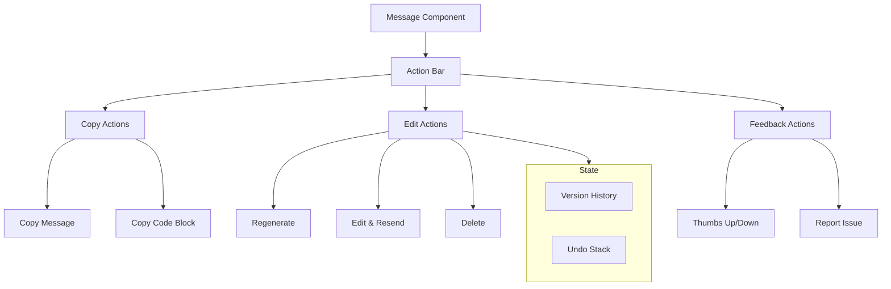

# Message Actions

## Introduction

Message actions transform a passive chat display into an interactive experience. Users expect to copy content, regenerate responses, edit their questions, and provide feedback—all without leaving the conversation flow. Well-designed actions enhance usability while maintaining a clean interface.

In this lesson, we'll implement the complete set of message actions that users expect from modern AI chat interfaces.

### What We'll Cover

| Topic | Description |
|-------|-------------|
| [Copy Message Content](./01-copy-message-content.md) | Clipboard API, formatted vs plain text, feedback |
| [Copy Code Blocks](./02-copy-code-blocks.md) | Code-specific copy buttons, indentation preservation |
| [Regenerate Response](./03-regenerate-response.md) | Re-generating AI responses, version handling |
| [useChat Action Methods](./04-usechat-action-methods.md) | AI SDK 6 `regenerate()`, `stop()`, `setMessages()` |
| [Edit and Resend](./05-edit-resend-messages.md) | Inline editing, conversation branching |
| [Message Version History](./06-message-version-history.md) | Tracking edits, diff view, restore |
| [Delete Messages](./07-delete-messages.md) | Deletion with confirmation, undo support |
| [Long Message Handling](./08-long-message-handling.md) | Truncation, expand/collapse, modal view |
| [Message Feedback](./09-message-feedback.md) | Thumbs up/down, detailed feedback collection |

### Prerequisites

- [Conversation State Management](../07-conversation-state-management/00-conversation-state-management.md)
- [Streaming Text Display](../03-streaming-text-display/00-streaming-text-display.md)
- [Code Display & Syntax Highlighting](../06-code-display-syntax-highlighting/00-code-display-syntax-highlighting.md)
- React hooks and state management

---

## Message Action Architecture



---

## Action Bar Design Patterns

### Hover-Reveal Actions

```tsx
function MessageWithActions({ message }: { message: Message }) {
  const [showActions, setShowActions] = useState(false);
  
  return (
    <div
      className="group relative"
      onMouseEnter={() => setShowActions(true)}
      onMouseLeave={() => setShowActions(false)}
    >
      <MessageContent message={message} />
      
      {/* Actions appear on hover */}
      <div className={`
        absolute -top-8 right-2 
        flex gap-1 p-1 bg-white rounded-lg shadow
        transition-opacity duration-150
        ${showActions ? 'opacity-100' : 'opacity-0'}
      `}>
        <ActionButton icon="📋" label="Copy" onClick={() => copyMessage(message)} />
        <ActionButton icon="🔄" label="Regenerate" onClick={() => regenerate()} />
        <ActionButton icon="✏️" label="Edit" onClick={() => startEdit(message)} />
        <ActionButton icon="👍" label="Good" onClick={() => feedback(message, 'positive')} />
        <ActionButton icon="👎" label="Bad" onClick={() => feedback(message, 'negative')} />
      </div>
    </div>
  );
}
```

### Always-Visible Actions

```tsx
function MessageWithPersistentActions({ message }: { message: Message }) {
  return (
    <div className="flex flex-col">
      <MessageContent message={message} />
      
      {/* Always visible action row */}
      <div className="flex items-center gap-2 mt-2 text-sm text-gray-500">
        <button className="hover:text-gray-700">Copy</button>
        <span>•</span>
        <button className="hover:text-gray-700">Regenerate</button>
        <span>•</span>
        <button className="hover:text-gray-700">Edit</button>
      </div>
    </div>
  );
}
```

---

## Action State Management

```typescript
interface MessageActionsState {
  isEditing: boolean;
  isCopying: boolean;
  isRegenerating: boolean;
  showFeedbackForm: boolean;
  copySuccess: boolean;
  error: Error | null;
}

function useMessageActions(messageId: string) {
  const [state, setState] = useState<MessageActionsState>({
    isEditing: false,
    isCopying: false,
    isRegenerating: false,
    showFeedbackForm: false,
    copySuccess: false,
    error: null
  });
  
  const startEdit = () => setState(s => ({ ...s, isEditing: true }));
  const cancelEdit = () => setState(s => ({ ...s, isEditing: false }));
  
  const setCopySuccess = (success: boolean) => {
    setState(s => ({ ...s, copySuccess: success }));
    if (success) {
      setTimeout(() => setState(s => ({ ...s, copySuccess: false })), 2000);
    }
  };
  
  return {
    state,
    startEdit,
    cancelEdit,
    setCopySuccess,
    // ... more actions
  };
}
```

---

## Keyboard Shortcuts

```typescript
function useMessageKeyboardShortcuts(
  message: Message,
  actions: MessageActions
) {
  useEffect(() => {
    function handleKeyDown(e: KeyboardEvent) {
      // Only if this message is focused/selected
      if (!isMessageFocused(message.id)) return;
      
      // Cmd/Ctrl + C: Copy message
      if ((e.metaKey || e.ctrlKey) && e.key === 'c' && !window.getSelection()?.toString()) {
        e.preventDefault();
        actions.copy();
      }
      
      // Cmd/Ctrl + E: Edit message (user messages only)
      if ((e.metaKey || e.ctrlKey) && e.key === 'e' && message.role === 'user') {
        e.preventDefault();
        actions.startEdit();
      }
      
      // Cmd/Ctrl + R: Regenerate (assistant messages only)
      if ((e.metaKey || e.ctrlKey) && e.key === 'r' && message.role === 'assistant') {
        e.preventDefault();
        actions.regenerate();
      }
      
      // Delete/Backspace: Delete with confirmation
      if ((e.key === 'Delete' || e.key === 'Backspace') && !actions.isEditing) {
        e.preventDefault();
        actions.confirmDelete();
      }
    }
    
    window.addEventListener('keydown', handleKeyDown);
    return () => window.removeEventListener('keydown', handleKeyDown);
  }, [message, actions]);
}
```

---

## Accessibility Considerations

| Requirement | Implementation |
|-------------|----------------|
| Keyboard navigation | Arrow keys to move between actions |
| Screen reader labels | `aria-label` on all action buttons |
| Focus management | Return focus after modal closes |
| Action feedback | Announce copy/delete via live region |
| Visible focus | Clear focus indicators on actions |

```tsx
function AccessibleActionButton({ 
  icon, 
  label, 
  onClick,
  disabled 
}: ActionButtonProps) {
  return (
    <button
      onClick={onClick}
      disabled={disabled}
      aria-label={label}
      className="p-2 rounded hover:bg-gray-100 focus:ring-2 focus:ring-blue-500"
    >
      <span aria-hidden="true">{icon}</span>
      <span className="sr-only">{label}</span>
    </button>
  );
}
```

---

## Learning Path

1. **[Copy Message Content](./01-copy-message-content.md)** — Start with the Clipboard API fundamentals
2. **[Copy Code Blocks](./02-copy-code-blocks.md)** — Specialized copying for code snippets
3. **[Regenerate Response](./03-regenerate-response.md)** — Re-generating AI responses
4. **[useChat Action Methods](./04-usechat-action-methods.md)** — AI SDK integration
5. **[Edit and Resend](./05-edit-resend-messages.md)** — Editing and conversation branching
6. **[Message Version History](./06-message-version-history.md)** — Tracking message changes
7. **[Delete Messages](./07-delete-messages.md)** — Safe deletion patterns
8. **[Long Message Handling](./08-long-message-handling.md)** — Managing lengthy content
9. **[Message Feedback](./09-message-feedback.md)** — Collecting user feedback

---

**Previous:** [Conversation State Management](../07-conversation-state-management/00-conversation-state-management.md)  
**Next:** [Copy Message Content](./01-copy-message-content.md)

<!-- 
Sources Consulted:
- AI SDK Chatbot: https://ai-sdk.dev/docs/ai-sdk-ui/chatbot
- MDN Clipboard API: https://developer.mozilla.org/en-US/docs/Web/API/Clipboard_API
- WAI-ARIA Patterns: https://www.w3.org/WAI/ARIA/apg/patterns/
-->
