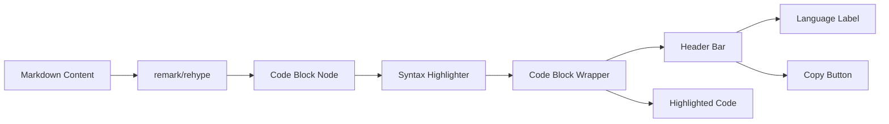

# Copy Code Blocks

## Introduction

Code blocks in AI responses deserve special copy treatment. Users want to copy code snippets without surrounding text, preserve exact indentation, and sometimes need language-aware formatting. Individual copy buttons on each code block provide the best experience.

In this lesson, we'll implement code-specific copy functionality that integrates with syntax highlighting.

### What We'll Cover

- Individual code block copy buttons
- Preserving whitespace and indentation
- Language-aware copying
- Integration with syntax highlighters
- Copy feedback for code blocks

### Prerequisites

- [Copy Message Content](./01-copy-message-content.md)
- [Code Display & Syntax Highlighting](../06-code-display-syntax-highlighting/00-code-display-syntax-highlighting.md)
- React component patterns

---

## Code Block Architecture



---

## Basic Code Copy Button

### Simple Implementation

```tsx
interface CodeBlockProps {
  code: string;
  language?: string;
}

function CodeBlock({ code, language }: CodeBlockProps) {
  const [copied, setCopied] = useState(false);
  
  const handleCopy = async () => {
    try {
      await navigator.clipboard.writeText(code);
      setCopied(true);
      setTimeout(() => setCopied(false), 2000);
    } catch (error) {
      console.error('Failed to copy code:', error);
    }
  };
  
  return (
    <div className="relative group rounded-lg overflow-hidden">
      {/* Header with language and copy button */}
      <div className="flex items-center justify-between px-4 py-2 bg-gray-800 text-gray-300">
        <span className="text-sm font-mono">{language || 'code'}</span>
        
        <button
          onClick={handleCopy}
          className="flex items-center gap-1.5 px-2 py-1 rounded text-sm hover:bg-gray-700"
          aria-label={copied ? 'Copied!' : 'Copy code'}
        >
          {copied ? (
            <>
              <CheckIcon className="w-4 h-4 text-green-400" />
              <span className="text-green-400">Copied!</span>
            </>
          ) : (
            <>
              <ClipboardIcon className="w-4 h-4" />
              <span>Copy</span>
            </>
          )}
        </button>
      </div>
      
      {/* Code content */}
      <pre className="p-4 bg-gray-900 overflow-x-auto">
        <code className={`language-${language}`}>
          {code}
        </code>
      </pre>
    </div>
  );
}
```

---

## Preserving Whitespace

### Extracting Raw Code

```typescript
// Extract code while preserving exact whitespace
function extractCodeFromElement(element: HTMLElement): string {
  // Get the raw text content - preserves whitespace
  const code = element.textContent || '';
  
  // Trim only the trailing newline (common in code blocks)
  return code.replace(/\n$/, '');
}

// Alternative: Extract from pre element directly
function extractCodeFromPre(preElement: HTMLPreElement): string {
  // innerText preserves line breaks but may alter whitespace
  // textContent preserves exact whitespace
  return preElement.textContent?.replace(/\n$/, '') || '';
}
```

### Handling Highlighted Code

When code is syntax-highlighted, it's wrapped in many `<span>` elements. Extract the original text:

```typescript
function getPlainTextFromHighlighted(container: HTMLElement): string {
  // Clone to avoid modifying original
  const clone = container.cloneNode(true) as HTMLElement;
  
  // Remove any copy buttons or other non-code elements
  clone.querySelectorAll('[data-copy-ignore]').forEach(el => el.remove());
  
  // Get text content (strips HTML tags but preserves text)
  return clone.textContent || '';
}
```

---

## Reusable Copy Hook for Code

```typescript
interface UseCodeCopyReturn {
  copy: () => Promise<void>;
  copied: boolean;
  error: Error | null;
}

export function useCodeCopy(
  code: string,
  options?: { resetDelay?: number }
): UseCodeCopyReturn {
  const [copied, setCopied] = useState(false);
  const [error, setError] = useState<Error | null>(null);
  const timeoutRef = useRef<number | null>(null);
  
  const copy = useCallback(async () => {
    // Clear previous state
    if (timeoutRef.current) {
      clearTimeout(timeoutRef.current);
    }
    setError(null);
    
    try {
      // Preserve exact code - no trimming of internal whitespace
      await navigator.clipboard.writeText(code);
      setCopied(true);
      
      timeoutRef.current = window.setTimeout(() => {
        setCopied(false);
      }, options?.resetDelay ?? 2000);
      
    } catch (err) {
      setError(err instanceof Error ? err : new Error('Copy failed'));
      setCopied(false);
    }
  }, [code, options?.resetDelay]);
  
  useEffect(() => {
    return () => {
      if (timeoutRef.current) {
        clearTimeout(timeoutRef.current);
      }
    };
  }, []);
  
  return { copy, copied, error };
}
```

---

## Integration with react-markdown

### Custom Code Component

```tsx
import ReactMarkdown from 'react-markdown';
import { Prism as SyntaxHighlighter } from 'react-syntax-highlighter';
import { oneDark } from 'react-syntax-highlighter/dist/esm/styles/prism';

function MarkdownWithCopyableCode({ content }: { content: string }) {
  return (
    <ReactMarkdown
      components={{
        code({ node, inline, className, children, ...props }) {
          const match = /language-(\w+)/.exec(className || '');
          const language = match ? match[1] : '';
          const code = String(children).replace(/\n$/, '');
          
          if (inline) {
            return (
              <code className="px-1 py-0.5 bg-gray-100 rounded text-sm" {...props}>
                {children}
              </code>
            );
          }
          
          return (
            <CopyableCodeBlock
              code={code}
              language={language}
            />
          );
        }
      }}
    >
      {content}
    </ReactMarkdown>
  );
}

function CopyableCodeBlock({ code, language }: { code: string; language: string }) {
  const { copy, copied } = useCodeCopy(code);
  
  return (
    <div className="relative my-4 rounded-lg overflow-hidden">
      {/* Header */}
      <div className="flex items-center justify-between px-4 py-2 bg-[#282c34] border-b border-gray-700">
        <span className="text-sm text-gray-400 font-mono">
          {language || 'text'}
        </span>
        
        <button
          onClick={copy}
          className={`
            flex items-center gap-1.5 px-2 py-1 rounded text-sm
            transition-colors duration-150
            ${copied 
              ? 'text-green-400' 
              : 'text-gray-400 hover:text-gray-200 hover:bg-gray-700'
            }
          `}
        >
          {copied ? (
            <>
              <CheckIcon className="w-4 h-4" />
              <span>Copied!</span>
            </>
          ) : (
            <>
              <ClipboardIcon className="w-4 h-4" />
              <span>Copy</span>
            </>
          )}
        </button>
      </div>
      
      {/* Syntax highlighted code */}
      <SyntaxHighlighter
        language={language}
        style={oneDark}
        customStyle={{
          margin: 0,
          borderRadius: 0,
          padding: '1rem'
        }}
      >
        {code}
      </SyntaxHighlighter>
    </div>
  );
}
```

---

## Integration with Shiki

```tsx
import { useEffect, useState } from 'react';
import { codeToHtml } from 'shiki';

interface ShikiCodeBlockProps {
  code: string;
  language: string;
}

function ShikiCodeBlock({ code, language }: ShikiCodeBlockProps) {
  const [html, setHtml] = useState<string>('');
  const { copy, copied } = useCodeCopy(code);
  
  useEffect(() => {
    async function highlight() {
      const highlighted = await codeToHtml(code, {
        lang: language,
        theme: 'github-dark'
      });
      setHtml(highlighted);
    }
    highlight();
  }, [code, language]);
  
  return (
    <div className="relative rounded-lg overflow-hidden">
      {/* Copy button overlay */}
      <button
        onClick={copy}
        className={`
          absolute top-2 right-2 z-10
          flex items-center gap-1.5 px-2 py-1
          rounded bg-gray-700/80 backdrop-blur
          text-sm text-gray-300 hover:text-white
          transition-all duration-150
          ${copied ? 'bg-green-600/80' : ''}
        `}
      >
        {copied ? (
          <>
            <CheckIcon className="w-4 h-4" />
            Copied!
          </>
        ) : (
          <>
            <ClipboardIcon className="w-4 h-4" />
            Copy
          </>
        )}
      </button>
      
      {/* Shiki output */}
      <div
        className="[&>pre]:p-4 [&>pre]:overflow-x-auto"
        dangerouslySetInnerHTML={{ __html: html }}
      />
    </div>
  );
}
```

---

## Language-Aware Copying

### Adjusting for Language Context

```typescript
interface CopyOptions {
  language: string;
  includeLanguageComment?: boolean;
  normalizeIndentation?: boolean;
}

function prepareCodeForCopy(code: string, options: CopyOptions): string {
  let result = code;
  
  // Optionally normalize indentation
  if (options.normalizeIndentation) {
    result = normalizeIndentation(result);
  }
  
  // Optionally add language comment
  if (options.includeLanguageComment) {
    const comment = getLanguageComment(options.language);
    if (comment) {
      result = `${comment} ${options.language}\n${result}`;
    }
  }
  
  return result;
}

function normalizeIndentation(code: string): string {
  const lines = code.split('\n');
  
  // Find minimum indentation (excluding empty lines)
  const minIndent = lines
    .filter(line => line.trim().length > 0)
    .reduce((min, line) => {
      const indent = line.match(/^(\s*)/)?.[1].length || 0;
      return Math.min(min, indent);
    }, Infinity);
  
  // Remove minimum indentation from all lines
  if (minIndent > 0 && minIndent < Infinity) {
    return lines
      .map(line => line.slice(minIndent))
      .join('\n');
  }
  
  return code;
}

function getLanguageComment(language: string): string | null {
  const commentStyles: Record<string, string> = {
    javascript: '//',
    typescript: '//',
    python: '#',
    ruby: '#',
    bash: '#',
    shell: '#',
    html: '<!--',
    css: '/*',
    sql: '--',
    rust: '//',
    go: '//',
    java: '//',
    c: '//',
    cpp: '//',
  };
  
  return commentStyles[language] || null;
}
```

---

## Multiple Copy Options

```tsx
interface CodeBlockWithOptionsProps {
  code: string;
  language: string;
  filename?: string;
}

function CodeBlockWithOptions({ code, language, filename }: CodeBlockWithOptionsProps) {
  const [showMenu, setShowMenu] = useState(false);
  const { copy, copied } = useCodeCopy(code);
  
  const copyOptions = [
    { 
      label: 'Copy code', 
      action: () => copy() 
    },
    { 
      label: 'Copy with filename', 
      action: async () => {
        const withFilename = filename 
          ? `// ${filename}\n${code}` 
          : code;
        await navigator.clipboard.writeText(withFilename);
      }
    },
    { 
      label: 'Copy as markdown', 
      action: async () => {
        const markdown = `\`\`\`${language}\n${code}\n\`\`\``;
        await navigator.clipboard.writeText(markdown);
      }
    }
  ];
  
  return (
    <div className="relative">
      {/* Code block header */}
      <div className="flex items-center justify-between px-4 py-2 bg-gray-800">
        <span className="text-sm text-gray-400">
          {filename || language}
        </span>
        
        <div className="relative">
          <button
            onClick={() => setShowMenu(!showMenu)}
            className="flex items-center gap-1 px-2 py-1 text-sm text-gray-400 hover:text-white rounded hover:bg-gray-700"
          >
            {copied ? <CheckIcon className="w-4 h-4 text-green-400" /> : <ClipboardIcon className="w-4 h-4" />}
            <ChevronDownIcon className="w-3 h-3" />
          </button>
          
          {showMenu && (
            <div className="absolute right-0 mt-1 w-48 bg-gray-700 rounded-lg shadow-xl z-20">
              {copyOptions.map((option, i) => (
                <button
                  key={i}
                  onClick={() => {
                    option.action();
                    setShowMenu(false);
                  }}
                  className="block w-full px-4 py-2 text-left text-sm text-gray-200 hover:bg-gray-600 first:rounded-t-lg last:rounded-b-lg"
                >
                  {option.label}
                </button>
              ))}
            </div>
          )}
        </div>
      </div>
      
      {/* Code content */}
      <pre className="p-4 bg-gray-900 overflow-x-auto">
        <code>{code}</code>
      </pre>
    </div>
  );
}
```

---

## Hover-Only Copy Button

```tsx
function CodeBlockWithHoverCopy({ code, language }: { code: string; language: string }) {
  const { copy, copied } = useCodeCopy(code);
  
  return (
    <div className="group relative rounded-lg overflow-hidden">
      {/* Floating copy button - appears on hover */}
      <button
        onClick={copy}
        className={`
          absolute top-3 right-3 z-10
          p-2 rounded-md
          opacity-0 group-hover:opacity-100
          transition-opacity duration-200
          ${copied 
            ? 'bg-green-500 text-white' 
            : 'bg-gray-700/90 text-gray-300 hover:bg-gray-600'
          }
        `}
        title={copied ? 'Copied!' : 'Copy code'}
      >
        {copied ? (
          <CheckIcon className="w-4 h-4" />
        ) : (
          <ClipboardIcon className="w-4 h-4" />
        )}
      </button>
      
      {/* Language badge */}
      <div className="absolute top-3 left-3 px-2 py-0.5 bg-gray-700/90 rounded text-xs text-gray-400">
        {language}
      </div>
      
      {/* Code */}
      <SyntaxHighlighter language={language} style={oneDark}>
        {code}
      </SyntaxHighlighter>
    </div>
  );
}
```

---

## Copy Feedback Animations

```css
/* Smooth icon transition */
.copy-icon {
  transition: transform 0.2s ease, opacity 0.2s ease;
}

.copy-icon.copied {
  transform: scale(1.1);
}

/* Ripple effect on click */
@keyframes copy-ripple {
  0% {
    transform: scale(0.8);
    opacity: 1;
  }
  100% {
    transform: scale(2);
    opacity: 0;
  }
}

.copy-button::after {
  content: '';
  position: absolute;
  inset: 0;
  border-radius: inherit;
  background: currentColor;
  opacity: 0;
  pointer-events: none;
}

.copy-button.clicked::after {
  animation: copy-ripple 0.4s ease-out;
}

/* Success highlight on code block */
@keyframes success-flash {
  0% { box-shadow: 0 0 0 0 rgba(34, 197, 94, 0.4); }
  50% { box-shadow: 0 0 0 4px rgba(34, 197, 94, 0.2); }
  100% { box-shadow: 0 0 0 0 rgba(34, 197, 94, 0); }
}

.code-block.copy-success {
  animation: success-flash 0.5s ease-out;
}
```

---

## Best Practices

| ✅ Do | ❌ Don't |
|-------|---------|
| Preserve exact whitespace | Trim or modify indentation |
| Show copy button on every block | Require finding text + Cmd+C |
| Provide clear feedback | Silent copy with no indication |
| Use consistent button placement | Move button location randomly |
| Support keyboard activation | Require mouse only |

---

## Common Pitfalls

| ❌ Mistake | ✅ Solution |
|-----------|-------------|
| Copying HTML tags | Use `textContent`, not `innerHTML` |
| Losing indentation | Preserve raw code string |
| Button inside scrollable area | Position button fixed in header |
| Feedback too brief | Show "Copied" for 2+ seconds |
| No language indicator | Show language in header |

---

## Hands-on Exercise

### Your Task

Create a code block component with:
1. Syntax highlighting (Prism or Shiki)
2. Copy button with hover reveal
3. Language label in header
4. Animated copy feedback
5. Option to copy as markdown

### Requirements

1. Preserve exact whitespace
2. Show button only on hover
3. Animate icon change on copy
4. Support 3+ languages

<details>
<summary>💡 Hints (click to expand)</summary>

- Use `group` and `group-hover` Tailwind classes
- Store raw code separately from highlighted HTML
- Use `transition-opacity` for smooth reveal
- Track `copied` state with timeout reset

</details>

---

## Summary

✅ **Individual buttons** on each code block  
✅ **Preserve whitespace** exactly as authored  
✅ **Header bar** with language + copy button  
✅ **Visual feedback** confirms successful copy  
✅ **Integration** with syntax highlighters  
✅ **Multiple formats** (raw, markdown, with filename)

---

## Further Reading

- [react-syntax-highlighter](https://github.com/react-syntax-highlighter/react-syntax-highlighter)
- [Shiki Syntax Highlighter](https://shiki.style/)
- [Clipboard API - MDN](https://developer.mozilla.org/en-US/docs/Web/API/Clipboard_API)

---

**Previous:** [Copy Message Content](./01-copy-message-content.md)  
**Next:** [Regenerate Response](./03-regenerate-response.md)

<!-- 
Sources Consulted:
- MDN Clipboard API: https://developer.mozilla.org/en-US/docs/Web/API/Clipboard_API
- Shiki docs: https://shiki.style/
- react-syntax-highlighter: https://github.com/react-syntax-highlighter/react-syntax-highlighter
-->
