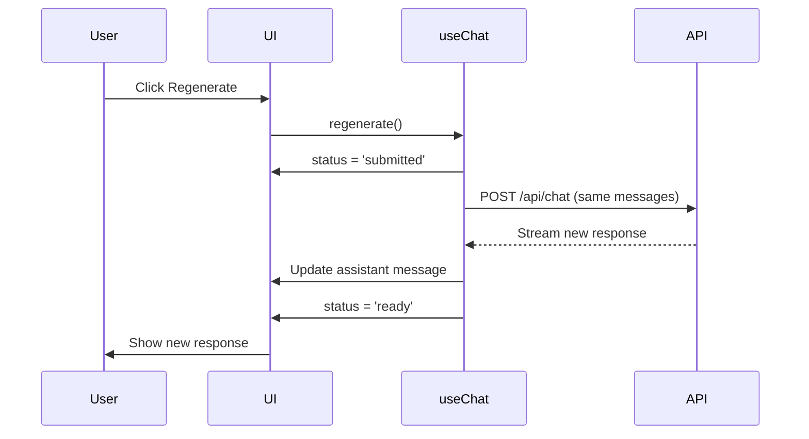

# Regenerate Response

## Introduction

Sometimes AI responses miss the mark. Users need the ability to regenerate a response—getting a fresh attempt from the model without changing their question. Regeneration creates response variations, enables comparison, and helps users get the output they need.

In this lesson, we'll implement regeneration functionality with proper state management and version handling.

### What We'll Cover

- Regenerate button placement and UX
- Triggering regeneration with useChat
- Previous response handling
- Variation generation strategies
- Version comparison UI

### Prerequisites

- [Message Actions Overview](./00-message-actions.md)
- [Conversation State Management](../07-conversation-state-management/00-conversation-state-management.md)
- AI SDK `useChat` basics

---

## Regeneration Flow



---

## Basic Regeneration with AI SDK

### Using the regenerate() Method

```tsx
import { useChat } from '@ai-sdk/react';
import { DefaultChatTransport } from 'ai';

function ChatWithRegenerate() {
  const { messages, regenerate, status } = useChat({
    transport: new DefaultChatTransport({
      api: '/api/chat'
    })
  });
  
  const lastAssistantMessage = messages
    .filter(m => m.role === 'assistant')
    .pop();
  
  const canRegenerate = 
    lastAssistantMessage && 
    (status === 'ready' || status === 'error');
  
  return (
    <div>
      {messages.map(message => (
        <MessageBubble key={message.id} message={message} />
      ))}
      
      {canRegenerate && (
        <button
          onClick={() => regenerate()}
          className="flex items-center gap-2 px-3 py-1.5 text-sm text-gray-600 hover:text-gray-900 rounded-lg hover:bg-gray-100"
        >
          <RefreshIcon className="w-4 h-4" />
          Regenerate response
        </button>
      )}
    </div>
  );
}
```

---

## Regenerate Button Placement

### After Last Assistant Message

```tsx
function MessageList({ messages, onRegenerate, status }: MessageListProps) {
  return (
    <div className="space-y-4">
      {messages.map((message, index) => {
        const isLastAssistant = 
          message.role === 'assistant' && 
          index === messages.length - 1;
        
        return (
          <div key={message.id}>
            <MessageBubble message={message} />
            
            {/* Regenerate button under last assistant message */}
            {isLastAssistant && status === 'ready' && (
              <div className="mt-2 flex items-center gap-2 text-sm text-gray-500">
                <button
                  onClick={onRegenerate}
                  className="flex items-center gap-1 hover:text-gray-700"
                >
                  <RefreshIcon className="w-4 h-4" />
                  Regenerate
                </button>
              </div>
            )}
          </div>
        );
      })}
    </div>
  );
}
```

### In Message Action Bar

```tsx
function MessageActions({ 
  message, 
  onRegenerate, 
  canRegenerate,
  isRegenerating 
}: MessageActionsProps) {
  if (message.role !== 'assistant') {
    return null;
  }
  
  return (
    <div className="flex items-center gap-2 mt-2 opacity-0 group-hover:opacity-100 transition-opacity">
      <CopyButton text={message.content} />
      
      {canRegenerate && (
        <button
          onClick={onRegenerate}
          disabled={isRegenerating}
          className={`
            flex items-center gap-1 px-2 py-1 rounded text-sm
            ${isRegenerating 
              ? 'text-gray-400 cursor-not-allowed' 
              : 'text-gray-600 hover:text-gray-900 hover:bg-gray-100'
            }
          `}
        >
          <RefreshIcon className={`w-4 h-4 ${isRegenerating ? 'animate-spin' : ''}`} />
          {isRegenerating ? 'Regenerating...' : 'Regenerate'}
        </button>
      )}
      
      <FeedbackButtons messageId={message.id} />
    </div>
  );
}
```

---

## Handling Previous Responses

### Replace Strategy (Default)

The default `regenerate()` replaces the last assistant message:

```tsx
function RegenerateReplace() {
  const { messages, regenerate, status } = useChat({
    transport: new DefaultChatTransport({ api: '/api/chat' })
  });
  
  // regenerate() removes the last assistant message
  // and generates a new one in its place
  const handleRegenerate = () => {
    regenerate();  // Previous response is replaced
  };
  
  return (
    <>
      {messages.map(m => <Message key={m.id} message={m} />)}
      <button onClick={handleRegenerate} disabled={status !== 'ready'}>
        Regenerate
      </button>
    </>
  );
}
```

### Keep History Strategy

Store previous versions before regenerating:

```tsx
interface MessageVersion {
  id: string;
  content: string;
  parts: MessagePart[];
  generatedAt: Date;
}

function useRegenerateWithHistory() {
  const { messages, regenerate, setMessages, status } = useChat({
    transport: new DefaultChatTransport({ api: '/api/chat' })
  });
  
  const [versionHistory, setVersionHistory] = useState<Map<string, MessageVersion[]>>(new Map());
  
  const regenerateWithHistory = async () => {
    const lastAssistant = messages.filter(m => m.role === 'assistant').pop();
    if (!lastAssistant) return;
    
    // Save current version to history
    setVersionHistory(prev => {
      const history = prev.get(lastAssistant.id) || [];
      return new Map(prev).set(lastAssistant.id, [
        ...history,
        {
          id: `v${history.length + 1}`,
          content: lastAssistant.content || '',
          parts: lastAssistant.parts || [],
          generatedAt: new Date()
        }
      ]);
    });
    
    // Regenerate (replaces current message)
    await regenerate();
  };
  
  const getVersions = (messageId: string) => versionHistory.get(messageId) || [];
  
  return { 
    messages, 
    regenerateWithHistory, 
    getVersions,
    status 
  };
}
```

---

## Version Comparison UI

### Version Selector

```tsx
interface VersionSelectorProps {
  currentMessage: Message;
  versions: MessageVersion[];
  onSelectVersion: (version: MessageVersion) => void;
}

function VersionSelector({ currentMessage, versions, onSelectVersion }: VersionSelectorProps) {
  const [selectedIndex, setSelectedIndex] = useState(versions.length); // Current is last
  
  if (versions.length === 0) return null;
  
  return (
    <div className="flex items-center gap-2 text-sm text-gray-500 mt-2">
      <button
        onClick={() => {
          const newIndex = Math.max(0, selectedIndex - 1);
          setSelectedIndex(newIndex);
          onSelectVersion(versions[newIndex]);
        }}
        disabled={selectedIndex === 0}
        className="p-1 rounded hover:bg-gray-100 disabled:opacity-50"
      >
        <ChevronLeftIcon className="w-4 h-4" />
      </button>
      
      <span>
        Version {selectedIndex + 1} of {versions.length + 1}
      </span>
      
      <button
        onClick={() => {
          const newIndex = Math.min(versions.length, selectedIndex + 1);
          setSelectedIndex(newIndex);
          if (newIndex === versions.length) {
            // Current version
            onSelectVersion({
              id: 'current',
              content: currentMessage.content || '',
              parts: currentMessage.parts || [],
              generatedAt: new Date()
            });
          } else {
            onSelectVersion(versions[newIndex]);
          }
        }}
        disabled={selectedIndex >= versions.length}
        className="p-1 rounded hover:bg-gray-100 disabled:opacity-50"
      >
        <ChevronRightIcon className="w-4 h-4" />
      </button>
    </div>
  );
}
```

### Side-by-Side Comparison

```tsx
function VersionComparison({ 
  version1, 
  version2 
}: { 
  version1: MessageVersion; 
  version2: MessageVersion;
}) {
  return (
    <div className="grid grid-cols-2 gap-4 p-4 bg-gray-50 rounded-lg">
      <div>
        <div className="text-sm font-medium text-gray-500 mb-2">
          Version {version1.id} • {formatTime(version1.generatedAt)}
        </div>
        <div className="prose prose-sm">
          <MarkdownRenderer content={version1.content} />
        </div>
      </div>
      
      <div>
        <div className="text-sm font-medium text-gray-500 mb-2">
          Version {version2.id} • {formatTime(version2.generatedAt)}
        </div>
        <div className="prose prose-sm">
          <MarkdownRenderer content={version2.content} />
        </div>
      </div>
    </div>
  );
}
```

---

## Regeneration with Parameters

### Variation Controls

```tsx
interface RegenerateOptions {
  temperature?: number;
  maxTokens?: number;
  style?: 'concise' | 'detailed' | 'creative';
}

function RegenerateWithOptions() {
  const { messages, sendMessage, setMessages, status } = useChat({
    transport: new DefaultChatTransport({ api: '/api/chat' })
  });
  
  const [showOptions, setShowOptions] = useState(false);
  const [options, setOptions] = useState<RegenerateOptions>({
    temperature: 0.7,
    style: 'detailed'
  });
  
  const regenerateWithOptions = async () => {
    const lastUserMessage = messages.filter(m => m.role === 'user').pop();
    if (!lastUserMessage) return;
    
    // Remove last assistant message
    const messagesWithoutLast = messages.slice(0, -1);
    setMessages(messagesWithoutLast);
    
    // Resend with options
    await sendMessage(
      { text: '' },  // Empty - we're using existing message
      {
        body: {
          messages: messagesWithoutLast,
          temperature: options.temperature,
          style: options.style
        }
      }
    );
  };
  
  return (
    <div className="relative">
      <button
        onClick={() => setShowOptions(!showOptions)}
        className="flex items-center gap-1 text-sm text-gray-600"
      >
        <RefreshIcon className="w-4 h-4" />
        Regenerate
        <ChevronDownIcon className="w-3 h-3" />
      </button>
      
      {showOptions && (
        <div className="absolute bottom-full mb-2 p-4 bg-white rounded-lg shadow-xl border w-64">
          <h4 className="font-medium mb-3">Regeneration Options</h4>
          
          <label className="block mb-3">
            <span className="text-sm text-gray-600">Style</span>
            <select
              value={options.style}
              onChange={e => setOptions(o => ({ ...o, style: e.target.value as any }))}
              className="mt-1 block w-full rounded border-gray-300"
            >
              <option value="concise">Concise</option>
              <option value="detailed">Detailed</option>
              <option value="creative">Creative</option>
            </select>
          </label>
          
          <label className="block mb-3">
            <span className="text-sm text-gray-600">
              Creativity: {options.temperature}
            </span>
            <input
              type="range"
              min="0"
              max="1"
              step="0.1"
              value={options.temperature}
              onChange={e => setOptions(o => ({ ...o, temperature: parseFloat(e.target.value) }))}
              className="mt-1 block w-full"
            />
          </label>
          
          <button
            onClick={() => {
              regenerateWithOptions();
              setShowOptions(false);
            }}
            disabled={status !== 'ready'}
            className="w-full py-2 bg-blue-500 text-white rounded hover:bg-blue-600"
          >
            Regenerate
          </button>
        </div>
      )}
    </div>
  );
}
```

---

## Server-Side Handling

### API Route for Regeneration

```typescript
// app/api/chat/route.ts
import { convertToModelMessages, streamText, UIMessage } from 'ai';

export async function POST(req: Request) {
  const { messages, trigger } = await req.json();
  
  // Handle regeneration trigger
  if (trigger === 'regenerate-assistant-message') {
    // Messages already have last assistant removed by useChat
    // Just generate a new response
  }
  
  const result = streamText({
    model: "anthropic/claude-sonnet-4",
    system: 'You are a helpful assistant.',
    messages: await convertToModelMessages(messages)
  });
  
  return result.toUIMessageStreamResponse();
}
```

### Custom Transport for Regeneration

```typescript
import { DefaultChatTransport } from 'ai';

const transport = new DefaultChatTransport({
  api: '/api/chat',
  prepareSendMessagesRequest: ({ messages, trigger, messageId }) => {
    if (trigger === 'regenerate-assistant-message') {
      return {
        body: {
          messages,
          trigger,
          regenerateMessageId: messageId,
          // Add variation parameters
          temperature: 0.8
        }
      };
    }
    
    return {
      body: { messages }
    };
  }
});
```

---

## Loading States During Regeneration

```tsx
function RegeneratingMessage({ message, isRegenerating }: { 
  message: Message; 
  isRegenerating: boolean;
}) {
  return (
    <div className="relative">
      {/* Overlay during regeneration */}
      {isRegenerating && (
        <div className="absolute inset-0 bg-white/80 flex items-center justify-center z-10">
          <div className="flex items-center gap-2 text-gray-600">
            <RefreshIcon className="w-5 h-5 animate-spin" />
            <span>Regenerating...</span>
          </div>
        </div>
      )}
      
      {/* Message content */}
      <div className={isRegenerating ? 'opacity-50' : ''}>
        <MessageContent message={message} />
      </div>
    </div>
  );
}
```

---

## Best Practices

| ✅ Do | ❌ Don't |
|-------|---------|
| Disable button during streaming | Allow multiple regenerations |
| Show loading state clearly | Leave user wondering if it's working |
| Offer version history option | Always delete previous response |
| Place button near last response | Hide regenerate in deep menus |
| Allow cancellation (stop) | Force waiting for completion |

---

## Common Pitfalls

| ❌ Mistake | ✅ Solution |
|-----------|-------------|
| Regenerating during stream | Disable button until `status === 'ready'` |
| Losing conversation context | Send full message history |
| No way to cancel | Use `stop()` from useChat |
| Identical regenerations | Vary temperature or add randomness |
| Silent failures | Show error state with retry option |

---

## Hands-on Exercise

### Your Task

Build a regeneration system with:
1. Regenerate button under assistant messages
2. Version history (keep last 3 versions)
3. Version navigation (prev/next arrows)
4. Loading overlay during regeneration

### Requirements

1. Use AI SDK `regenerate()` method
2. Store versions before regenerating
3. Show version count (e.g., "2 of 3")
4. Disable button during streaming

<details>
<summary>💡 Hints (click to expand)</summary>

- Use Map to store versions by message ID
- Check `status` from useChat for button state
- Save version before calling `regenerate()`
- Use `useState` for current version index

</details>

---

## Summary

✅ **regenerate()** replaces last assistant message  
✅ **Button placement** near the response  
✅ **Version history** preserves alternatives  
✅ **Loading states** during regeneration  
✅ **Variation options** for different outputs  
✅ **Cancel support** via stop()

---

## Further Reading

- [AI SDK Chatbot - Regeneration](https://ai-sdk.dev/docs/ai-sdk-ui/chatbot)
- [Transport Configuration](https://ai-sdk.dev/docs/ai-sdk-ui/transport)
- [Error Handling](https://ai-sdk.dev/docs/ai-sdk-ui/error-handling)

---

**Previous:** [Copy Code Blocks](./02-copy-code-blocks.md)  
**Next:** [useChat Action Methods](./04-usechat-action-methods.md)

<!-- 
Sources Consulted:
- AI SDK Chatbot docs: https://ai-sdk.dev/docs/ai-sdk-ui/chatbot
- AI SDK Transport: https://ai-sdk.dev/docs/ai-sdk-ui/transport
-->
