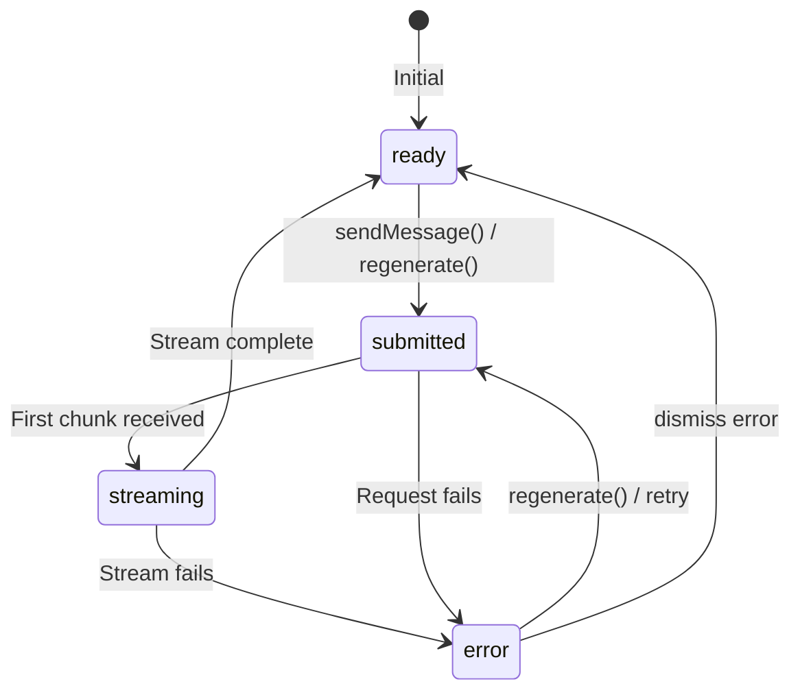

# useChat Action Methods

## Introduction

The AI SDK's `useChat` hook provides built-in action methods that handle common chat operations. These methods—`regenerate()`, `stop()`, `setMessages()`, and more—integrate seamlessly with the hook's state management, providing consistent behavior across your application.

In this lesson, we'll explore all useChat action methods and how to wire them to UI controls.

### What We'll Cover

- Complete useChat API overview
- `regenerate()` for response regeneration
- `stop()` for canceling streams
- `setMessages()` for programmatic updates
- Status-based button state management
- Error recovery patterns

### Prerequisites

- [Regenerate Response](./03-regenerate-response.md)
- [AI SDK Integration](../15-ai-sdk-integration-usechat.md) (basic knowledge)
- React hooks experience

---

## useChat Return Values

```typescript
import { useChat } from '@ai-sdk/react';
import { DefaultChatTransport } from 'ai';

function ChatComponent() {
  const {
    // State
    messages,           // UIMessage[] - conversation history
    status,             // 'ready' | 'submitted' | 'streaming' | 'error'
    error,              // Error | null
    
    // Actions
    sendMessage,        // Send a new message
    stop,               // Cancel in-progress stream
    regenerate,         // Regenerate last assistant message
    setMessages,        // Programmatically update messages
    
    // Metadata (optional)
    // Additional fields based on configuration
  } = useChat({
    transport: new DefaultChatTransport({
      api: '/api/chat'
    })
  });
  
  // ... component implementation
}
```

---

## Status States



### Status Values

| Status | Description | UI Implications |
|--------|-------------|-----------------|
| `ready` | Idle, can accept input | Enable send button |
| `submitted` | Request sent, waiting | Show loading indicator |
| `streaming` | Actively receiving chunks | Show streaming content + stop button |
| `error` | Request failed | Show error + retry button |

---

## Action Button Component

```tsx
interface ChatActionsProps {
  status: 'ready' | 'submitted' | 'streaming' | 'error';
  error: Error | null;
  onStop: () => void;
  onRegenerate: () => void;
  hasMessages: boolean;
}

function ChatActions({ 
  status, 
  error, 
  onStop, 
  onRegenerate, 
  hasMessages 
}: ChatActionsProps) {
  return (
    <div className="flex items-center gap-2">
      {/* Stop button - visible during streaming */}
      {(status === 'submitted' || status === 'streaming') && (
        <button
          onClick={onStop}
          className="flex items-center gap-1.5 px-3 py-1.5 bg-red-100 text-red-700 rounded-lg hover:bg-red-200"
        >
          <StopIcon className="w-4 h-4" />
          Stop
        </button>
      )}
      
      {/* Regenerate button - visible when ready or error */}
      {hasMessages && (status === 'ready' || status === 'error') && (
        <button
          onClick={onRegenerate}
          className="flex items-center gap-1.5 px-3 py-1.5 text-gray-600 rounded-lg hover:bg-gray-100"
        >
          <RefreshIcon className="w-4 h-4" />
          Regenerate
        </button>
      )}
      
      {/* Error indicator */}
      {error && (
        <div className="flex items-center gap-2 text-red-600">
          <ExclamationIcon className="w-4 h-4" />
          <span className="text-sm">Error occurred</span>
        </div>
      )}
    </div>
  );
}
```

---

## The stop() Method

### Canceling In-Progress Streams

```tsx
function ChatWithStop() {
  const { messages, sendMessage, stop, status } = useChat({
    transport: new DefaultChatTransport({ api: '/api/chat' })
  });
  
  const [input, setInput] = useState('');
  
  const isProcessing = status === 'submitted' || status === 'streaming';
  
  return (
    <div>
      {messages.map(m => <Message key={m.id} message={m} />)}
      
      <form onSubmit={e => {
        e.preventDefault();
        if (input.trim() && !isProcessing) {
          sendMessage({ text: input });
          setInput('');
        }
      }}>
        <input
          value={input}
          onChange={e => setInput(e.target.value)}
          disabled={isProcessing}
          placeholder="Type a message..."
        />
        
        {isProcessing ? (
          <button type="button" onClick={stop} className="bg-red-500 text-white">
            Stop generating
          </button>
        ) : (
          <button type="submit" disabled={!input.trim()}>
            Send
          </button>
        )}
      </form>
    </div>
  );
}
```

### Stop Behavior

When `stop()` is called:
1. The fetch request is aborted
2. Partial content received so far is preserved
3. Status transitions to `ready`
4. The message is marked as complete (not error)

```tsx
// After stop(), the partial message remains
// User can see what was generated before cancellation
function PartialMessageIndicator({ message }: { message: Message }) {
  const wasStopped = message.metadata?.stopped;
  
  return (
    <div>
      <MessageContent message={message} />
      
      {wasStopped && (
        <div className="text-sm text-gray-500 italic mt-2">
          Response was stopped
        </div>
      )}
    </div>
  );
}
```

---

## The regenerate() Method

### Basic Usage

```tsx
function RegenerateButton() {
  const { regenerate, status, messages } = useChat({
    transport: new DefaultChatTransport({ api: '/api/chat' })
  });
  
  const hasAssistantMessage = messages.some(m => m.role === 'assistant');
  const canRegenerate = hasAssistantMessage && 
    (status === 'ready' || status === 'error');
  
  return (
    <button
      onClick={() => regenerate()}
      disabled={!canRegenerate}
      className={`
        px-4 py-2 rounded-lg
        ${canRegenerate 
          ? 'bg-blue-500 text-white hover:bg-blue-600' 
          : 'bg-gray-200 text-gray-500 cursor-not-allowed'
        }
      `}
    >
      Regenerate
    </button>
  );
}
```

### Regenerate After Error

```tsx
function ErrorRecovery() {
  const { messages, error, regenerate, status } = useChat({
    transport: new DefaultChatTransport({ api: '/api/chat' })
  });
  
  if (error) {
    return (
      <div className="p-4 bg-red-50 border border-red-200 rounded-lg">
        <div className="flex items-center gap-2 text-red-700 mb-2">
          <ExclamationCircleIcon className="w-5 h-5" />
          <span className="font-medium">Something went wrong</span>
        </div>
        
        <p className="text-sm text-red-600 mb-3">
          {error.message || 'An error occurred while generating the response.'}
        </p>
        
        <button
          onClick={() => regenerate()}
          disabled={status !== 'error' && status !== 'ready'}
          className="px-4 py-2 bg-red-600 text-white rounded hover:bg-red-700"
        >
          Try again
        </button>
      </div>
    );
  }
  
  return null;
}
```

---

## The setMessages() Method

### Programmatic Message Updates

```tsx
function MessageManager() {
  const { messages, setMessages } = useChat({
    transport: new DefaultChatTransport({ api: '/api/chat' })
  });
  
  // Delete a message
  const deleteMessage = (id: string) => {
    setMessages(messages.filter(m => m.id !== id));
  };
  
  // Edit a message
  const editMessage = (id: string, newContent: string) => {
    setMessages(messages.map(m => 
      m.id === id 
        ? { ...m, content: newContent, parts: [{ type: 'text', text: newContent }] }
        : m
    ));
  };
  
  // Clear all messages
  const clearChat = () => {
    setMessages([]);
  };
  
  // Insert a system message
  const addSystemMessage = (content: string) => {
    setMessages([
      ...messages,
      {
        id: `sys_${Date.now()}`,
        role: 'system' as const,
        content,
        parts: [{ type: 'text', text: content }]
      }
    ]);
  };
  
  return (
    <div>
      {messages.map(m => (
        <div key={m.id} className="flex items-start gap-2">
          <MessageContent message={m} />
          <button onClick={() => deleteMessage(m.id)}>Delete</button>
        </div>
      ))}
      
      <button onClick={clearChat}>Clear all</button>
    </div>
  );
}
```

### Loading Saved Conversations

```tsx
function ConversationLoader() {
  const { setMessages } = useChat({
    transport: new DefaultChatTransport({ api: '/api/chat' })
  });
  
  const loadConversation = async (conversationId: string) => {
    const response = await fetch(`/api/conversations/${conversationId}`);
    const data = await response.json();
    
    // Set messages from saved conversation
    setMessages(data.messages);
  };
  
  const savedConversations = useSavedConversations();
  
  return (
    <div>
      <h3>Saved Conversations</h3>
      {savedConversations.map(conv => (
        <button 
          key={conv.id} 
          onClick={() => loadConversation(conv.id)}
        >
          {conv.title}
        </button>
      ))}
    </div>
  );
}
```

---

## Complete Action Integration

```tsx
function FullFeaturedChat() {
  const {
    messages,
    sendMessage,
    stop,
    regenerate,
    setMessages,
    status,
    error
  } = useChat({
    transport: new DefaultChatTransport({ api: '/api/chat' }),
    onFinish: ({ message }) => {
      console.log('Message complete:', message.id);
    },
    onError: (error) => {
      console.error('Chat error:', error);
    }
  });
  
  const [input, setInput] = useState('');
  
  const isProcessing = status === 'submitted' || status === 'streaming';
  const hasMessages = messages.length > 0;
  const lastMessage = messages[messages.length - 1];
  const canRegenerate = lastMessage?.role === 'assistant' && !isProcessing;
  
  return (
    <div className="flex flex-col h-full">
      {/* Header with actions */}
      <header className="flex items-center justify-between p-4 border-b">
        <h1>Chat</h1>
        
        <div className="flex items-center gap-2">
          {hasMessages && (
            <button
              onClick={() => setMessages([])}
              className="text-sm text-gray-500 hover:text-gray-700"
            >
              Clear chat
            </button>
          )}
        </div>
      </header>
      
      {/* Messages */}
      <div className="flex-1 overflow-y-auto p-4 space-y-4">
        {messages.map(message => (
          <MessageBubble 
            key={message.id} 
            message={message}
            onDelete={() => setMessages(messages.filter(m => m.id !== message.id))}
          />
        ))}
        
        {/* Streaming indicator */}
        {status === 'streaming' && (
          <div className="flex items-center gap-2 text-gray-500">
            <LoadingDots />
            <span>Generating...</span>
          </div>
        )}
      </div>
      
      {/* Error display */}
      {error && (
        <div className="mx-4 p-3 bg-red-50 border border-red-200 rounded-lg flex items-center justify-between">
          <span className="text-red-700">Error: {error.message}</span>
          <button
            onClick={() => regenerate()}
            className="text-red-600 hover:text-red-800 font-medium"
          >
            Retry
          </button>
        </div>
      )}
      
      {/* Action bar */}
      <div className="px-4 py-2 border-t flex items-center gap-2">
        {isProcessing && (
          <button
            onClick={stop}
            className="flex items-center gap-1 px-3 py-1.5 text-red-600 hover:bg-red-50 rounded"
          >
            <StopCircleIcon className="w-4 h-4" />
            Stop
          </button>
        )}
        
        {canRegenerate && (
          <button
            onClick={() => regenerate()}
            className="flex items-center gap-1 px-3 py-1.5 text-gray-600 hover:bg-gray-100 rounded"
          >
            <RefreshIcon className="w-4 h-4" />
            Regenerate
          </button>
        )}
      </div>
      
      {/* Input */}
      <form 
        onSubmit={e => {
          e.preventDefault();
          if (input.trim() && !isProcessing) {
            sendMessage({ text: input });
            setInput('');
          }
        }}
        className="p-4 border-t"
      >
        <div className="flex gap-2">
          <input
            value={input}
            onChange={e => setInput(e.target.value)}
            disabled={isProcessing}
            placeholder={isProcessing ? 'Please wait...' : 'Type a message...'}
            className="flex-1 px-4 py-2 border rounded-lg focus:ring-2 focus:ring-blue-500"
          />
          
          <button
            type="submit"
            disabled={!input.trim() || isProcessing}
            className="px-4 py-2 bg-blue-500 text-white rounded-lg hover:bg-blue-600 disabled:bg-gray-300 disabled:cursor-not-allowed"
          >
            Send
          </button>
        </div>
      </form>
    </div>
  );
}
```

---

## Keyboard Shortcuts for Actions

```tsx
function useChatKeyboardShortcuts(actions: {
  stop: () => void;
  regenerate: () => void;
  clearChat: () => void;
  status: string;
}) {
  useEffect(() => {
    function handleKeyDown(e: KeyboardEvent) {
      // Escape: Stop generation
      if (e.key === 'Escape' && 
          (actions.status === 'streaming' || actions.status === 'submitted')) {
        e.preventDefault();
        actions.stop();
      }
      
      // Cmd/Ctrl + Shift + R: Regenerate
      if ((e.metaKey || e.ctrlKey) && e.shiftKey && e.key === 'r') {
        e.preventDefault();
        if (actions.status === 'ready') {
          actions.regenerate();
        }
      }
      
      // Cmd/Ctrl + Shift + Backspace: Clear chat
      if ((e.metaKey || e.ctrlKey) && e.shiftKey && e.key === 'Backspace') {
        e.preventDefault();
        actions.clearChat();
      }
    }
    
    window.addEventListener('keydown', handleKeyDown);
    return () => window.removeEventListener('keydown', handleKeyDown);
  }, [actions]);
}
```

---

## Best Practices

| ✅ Do | ❌ Don't |
|-------|---------|
| Check status before actions | Call regenerate during streaming |
| Disable buttons based on status | Leave buttons enabled when invalid |
| Show clear loading indicators | Use ambiguous status display |
| Provide keyboard shortcuts | Require mouse for all actions |
| Handle errors with retry option | Silently fail on errors |

---

## Common Pitfalls

| ❌ Mistake | ✅ Solution |
|-----------|-------------|
| Calling actions during wrong status | Check status before calling |
| Not handling partial content after stop | Keep partial message visible |
| setMessages losing metadata | Spread existing message properties |
| No feedback during submitted state | Show loading immediately |
| Regenerate with empty messages | Check for assistant messages first |

---

## Hands-on Exercise

### Your Task

Build a chat action bar with:
1. Send button (disabled during processing)
2. Stop button (visible during streaming)
3. Regenerate button (visible when ready)
4. Clear chat button
5. Keyboard shortcuts (Esc to stop, Cmd+R to regenerate)

### Requirements

1. Proper status checking for all buttons
2. Visual loading states during submitted/streaming
3. Error display with retry option
4. Accessible keyboard navigation

<details>
<summary>💡 Hints (click to expand)</summary>

- Destructure all needed values from useChat
- Use `status === 'ready'` to enable regenerate
- Use `status === 'streaming' || status === 'submitted'` for stop
- Add `aria-label` to all buttons

</details>

---

## Summary

✅ **status** indicates current chat state  
✅ **stop()** cancels in-progress streams  
✅ **regenerate()** retries last response  
✅ **setMessages()** enables programmatic control  
✅ **Button states** should match status  
✅ **Error recovery** via regenerate()

---

## Further Reading

- [AI SDK Chatbot Documentation](https://ai-sdk.dev/docs/ai-sdk-ui/chatbot)
- [AI SDK Error Handling](https://ai-sdk.dev/docs/ai-sdk-ui/error-handling)
- [useChat Reference](https://ai-sdk.dev/docs/reference/ai-sdk-ui/use-chat)

---

**Previous:** [Regenerate Response](./03-regenerate-response.md)  
**Next:** [Edit and Resend Messages](./05-edit-resend-messages.md)

<!-- 
Sources Consulted:
- AI SDK Chatbot: https://ai-sdk.dev/docs/ai-sdk-ui/chatbot
- AI SDK Error Handling: https://ai-sdk.dev/docs/ai-sdk-ui/error-handling
- useChat API: https://ai-sdk.dev/docs/reference/ai-sdk-ui/use-chat
-->
