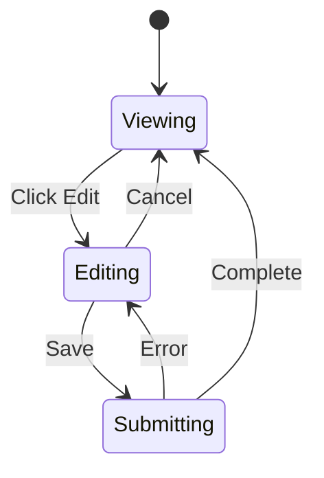

# Edit and Resend Messages

## Introduction

Editing and resending messages creates natural conversation branching—allowing users to refine their questions without losing context. This feature transforms chat from linear dialogue into an explorable conversation tree.

In this lesson, we'll build inline editing interfaces, handle message resubmission, and manage conversation branches.

### What We'll Cover

- Inline message editing UI
- Edit mode toggle patterns
- Message resubmission flow
- Conversation branching strategies
- History preservation during edits
- Keyboard shortcuts for editing

### Prerequisites

- [useChat Action Methods](./04-usechat-action-methods.md)
- React state management
- Form handling basics

---

## Edit Mode Architecture



### State Flow

When a user edits a message:
1. Enter edit mode (show textarea)
2. Allow modifications
3. On save: either update in-place OR create a branch
4. Resubmit to get new response
5. Exit edit mode

---

## Basic Inline Editing

```tsx
import { useState, useRef, useEffect } from 'react';

interface EditableMessageProps {
  message: {
    id: string;
    role: 'user' | 'assistant';
    content: string;
  };
  onEdit: (id: string, newContent: string) => void;
  onResend: (id: string, content: string) => void;
}

function EditableMessage({ message, onEdit, onResend }: EditableMessageProps) {
  const [isEditing, setIsEditing] = useState(false);
  const [editContent, setEditContent] = useState(message.content);
  const textareaRef = useRef<HTMLTextAreaElement>(null);
  
  // Focus and select text when entering edit mode
  useEffect(() => {
    if (isEditing && textareaRef.current) {
      textareaRef.current.focus();
      textareaRef.current.select();
    }
  }, [isEditing]);
  
  // Only allow editing user messages
  if (message.role !== 'user') {
    return <MessageContent message={message} />;
  }
  
  const handleSave = () => {
    const trimmed = editContent.trim();
    if (trimmed && trimmed !== message.content) {
      onEdit(message.id, trimmed);
      onResend(message.id, trimmed);
    }
    setIsEditing(false);
  };
  
  const handleCancel = () => {
    setEditContent(message.content);
    setIsEditing(false);
  };
  
  if (isEditing) {
    return (
      <div className="bg-blue-50 border border-blue-200 rounded-lg p-4">
        <textarea
          ref={textareaRef}
          value={editContent}
          onChange={e => setEditContent(e.target.value)}
          className="w-full p-2 border rounded resize-none focus:ring-2 focus:ring-blue-500"
          rows={3}
          onKeyDown={e => {
            if (e.key === 'Escape') handleCancel();
            if (e.key === 'Enter' && (e.metaKey || e.ctrlKey)) handleSave();
          }}
        />
        
        <div className="flex justify-end gap-2 mt-2">
          <button
            onClick={handleCancel}
            className="px-3 py-1.5 text-gray-600 hover:bg-gray-100 rounded"
          >
            Cancel
          </button>
          <button
            onClick={handleSave}
            disabled={!editContent.trim() || editContent.trim() === message.content}
            className="px-3 py-1.5 bg-blue-500 text-white rounded hover:bg-blue-600 disabled:bg-gray-300"
          >
            Save & Resend
          </button>
        </div>
        
        <p className="text-xs text-gray-500 mt-2">
          Press Esc to cancel • Cmd/Ctrl + Enter to save
        </p>
      </div>
    );
  }
  
  return (
    <div className="group relative">
      <div className="p-4 bg-blue-100 rounded-lg">
        {message.content}
      </div>
      
      <button
        onClick={() => setIsEditing(true)}
        className="absolute -bottom-2 right-2 opacity-0 group-hover:opacity-100 transition-opacity px-2 py-1 text-xs bg-white border rounded shadow"
      >
        Edit
      </button>
    </div>
  );
}
```

---

## Message Edit Hook

```tsx
interface UseMessageEditOptions {
  messages: Message[];
  setMessages: (messages: Message[]) => void;
  sendMessage: (options: { text: string }) => void;
}

function useMessageEdit({ messages, setMessages, sendMessage }: UseMessageEditOptions) {
  const [editingId, setEditingId] = useState<string | null>(null);
  
  const startEditing = (id: string) => {
    setEditingId(id);
  };
  
  const cancelEditing = () => {
    setEditingId(null);
  };
  
  const saveAndResend = (id: string, newContent: string) => {
    // Find the message index
    const index = messages.findIndex(m => m.id === id);
    if (index === -1) return;
    
    // Strategy: Truncate messages after the edited one
    // This creates a "branch" from the edited message
    const truncatedMessages = messages.slice(0, index);
    
    // Update messages
    setMessages([
      ...truncatedMessages,
      {
        ...messages[index],
        content: newContent,
        parts: [{ type: 'text', text: newContent }]
      }
    ]);
    
    // Resend the edited message
    sendMessage({ text: newContent });
    
    setEditingId(null);
  };
  
  return {
    editingId,
    startEditing,
    cancelEditing,
    saveAndResend,
    isEditing: (id: string) => editingId === id
  };
}
```

---

## Conversation Branching Strategies

### Strategy 1: Truncate and Continue

```tsx
// Remove all messages after the edited one
function truncateAndContinue(
  messages: Message[],
  editedId: string,
  newContent: string
) {
  const index = messages.findIndex(m => m.id === editedId);
  
  return messages.slice(0, index).concat({
    ...messages[index],
    content: newContent,
    parts: [{ type: 'text', text: newContent }]
  });
}

// Result: Clean linear history from edit point
```

### Strategy 2: Preserve with Branch Marker

```tsx
// Keep all messages but mark the branch point
interface BranchedMessage extends Message {
  branchId?: string;
  parentBranchId?: string;
}

function branchAndContinue(
  messages: BranchedMessage[],
  editedId: string,
  newContent: string
): { messages: BranchedMessage[]; branchId: string } {
  const index = messages.findIndex(m => m.id === editedId);
  const branchId = `branch_${Date.now()}`;
  
  // Archive old messages with branch ID
  const archivedMessages = messages.slice(index).map(m => ({
    ...m,
    parentBranchId: branchId,
    archived: true
  }));
  
  // Create new branch
  const newMessages = [
    ...messages.slice(0, index),
    {
      ...messages[index],
      id: `${messages[index].id}_${branchId}`,
      content: newContent,
      parts: [{ type: 'text', text: newContent }],
      branchId
    }
  ];
  
  return { messages: newMessages, branchId };
}
```

### Strategy 3: Version History

```tsx
// Store edit history in message metadata
interface MessageWithHistory extends Message {
  editHistory?: Array<{
    content: string;
    editedAt: Date;
  }>;
}

function editWithHistory(
  messages: MessageWithHistory[],
  editedId: string,
  newContent: string
): MessageWithHistory[] {
  return messages.map(m => {
    if (m.id !== editedId) return m;
    
    return {
      ...m,
      content: newContent,
      parts: [{ type: 'text', text: newContent }],
      editHistory: [
        ...(m.editHistory || []),
        { content: m.content, editedAt: new Date() }
      ]
    };
  });
}
```

---

## Complete Edit Flow Integration

```tsx
function ChatWithEditing() {
  const { messages, sendMessage, setMessages, status } = useChat({
    transport: new DefaultChatTransport({ api: '/api/chat' })
  });
  
  const [editingId, setEditingId] = useState<string | null>(null);
  const isProcessing = status === 'submitted' || status === 'streaming';
  
  const handleEdit = (id: string, newContent: string) => {
    // Find message index
    const index = messages.findIndex(m => m.id === id);
    if (index === -1) return;
    
    // Store original for undo
    const originalMessages = [...messages];
    sessionStorage.setItem('chat-before-edit', JSON.stringify(originalMessages));
    
    // Truncate and update
    const truncatedMessages = messages.slice(0, index + 1).map((m, i) => {
      if (i === index) {
        return {
          ...m,
          content: newContent,
          parts: [{ type: 'text', text: newContent }]
        };
      }
      return m;
    });
    
    setMessages(truncatedMessages);
    
    // Send the edited message
    // The updated messages will be used as context
    sendMessage({ text: newContent });
    
    setEditingId(null);
  };
  
  const handleUndo = () => {
    const saved = sessionStorage.getItem('chat-before-edit');
    if (saved) {
      setMessages(JSON.parse(saved));
      sessionStorage.removeItem('chat-before-edit');
    }
  };
  
  return (
    <div className="flex flex-col h-full">
      {/* Undo banner */}
      {sessionStorage.getItem('chat-before-edit') && (
        <div className="p-2 bg-yellow-50 border-b border-yellow-200 flex items-center justify-between">
          <span className="text-sm text-yellow-700">Message edited</span>
          <button
            onClick={handleUndo}
            className="text-sm text-yellow-600 hover:text-yellow-800"
          >
            Undo
          </button>
        </div>
      )}
      
      {/* Messages */}
      <div className="flex-1 overflow-y-auto p-4 space-y-4">
        {messages.map(message => (
          <div key={message.id}>
            {message.role === 'user' ? (
              <EditableUserMessage
                message={message}
                isEditing={editingId === message.id}
                onStartEdit={() => setEditingId(message.id)}
                onCancelEdit={() => setEditingId(null)}
                onSaveEdit={(content) => handleEdit(message.id, content)}
                disabled={isProcessing}
              />
            ) : (
              <AssistantMessage message={message} />
            )}
          </div>
        ))}
      </div>
    </div>
  );
}
```

---

## Editable User Message Component

```tsx
interface EditableUserMessageProps {
  message: Message;
  isEditing: boolean;
  onStartEdit: () => void;
  onCancelEdit: () => void;
  onSaveEdit: (content: string) => void;
  disabled?: boolean;
}

function EditableUserMessage({
  message,
  isEditing,
  onStartEdit,
  onCancelEdit,
  onSaveEdit,
  disabled = false
}: EditableUserMessageProps) {
  const [editValue, setEditValue] = useState(message.content);
  const textareaRef = useRef<HTMLTextAreaElement>(null);
  
  useEffect(() => {
    if (isEditing && textareaRef.current) {
      textareaRef.current.focus();
      // Move cursor to end
      const len = textareaRef.current.value.length;
      textareaRef.current.setSelectionRange(len, len);
    }
  }, [isEditing]);
  
  // Reset edit value when message changes
  useEffect(() => {
    setEditValue(message.content);
  }, [message.content]);
  
  // Auto-resize textarea
  useEffect(() => {
    if (textareaRef.current) {
      textareaRef.current.style.height = 'auto';
      textareaRef.current.style.height = textareaRef.current.scrollHeight + 'px';
    }
  }, [editValue, isEditing]);
  
  const handleKeyDown = (e: React.KeyboardEvent) => {
    if (e.key === 'Escape') {
      setEditValue(message.content);
      onCancelEdit();
    }
    
    if (e.key === 'Enter' && (e.metaKey || e.ctrlKey)) {
      if (editValue.trim() && editValue !== message.content) {
        onSaveEdit(editValue);
      }
    }
  };
  
  const hasChanges = editValue.trim() !== message.content;
  
  if (isEditing) {
    return (
      <div className="bg-blue-50 border-2 border-blue-300 rounded-lg overflow-hidden">
        <textarea
          ref={textareaRef}
          value={editValue}
          onChange={e => setEditValue(e.target.value)}
          onKeyDown={handleKeyDown}
          className="w-full p-4 bg-transparent resize-none focus:outline-none"
          disabled={disabled}
        />
        
        <div className="flex items-center justify-between px-4 py-2 bg-blue-100 border-t border-blue-200">
          <span className="text-xs text-blue-600">
            Esc to cancel • ⌘Enter to save
          </span>
          
          <div className="flex gap-2">
            <button
              onClick={() => {
                setEditValue(message.content);
                onCancelEdit();
              }}
              className="px-3 py-1 text-sm text-gray-600 hover:text-gray-800"
            >
              Cancel
            </button>
            <button
              onClick={() => hasChanges && onSaveEdit(editValue)}
              disabled={!hasChanges || !editValue.trim() || disabled}
              className="px-3 py-1 text-sm bg-blue-500 text-white rounded hover:bg-blue-600 disabled:bg-gray-300 disabled:cursor-not-allowed"
            >
              Save & Resend
            </button>
          </div>
        </div>
      </div>
    );
  }
  
  return (
    <div className="group relative flex justify-end">
      <div className="max-w-[80%] p-4 bg-blue-500 text-white rounded-lg">
        <p className="whitespace-pre-wrap">{message.content}</p>
        
        <button
          onClick={onStartEdit}
          disabled={disabled}
          className="absolute top-2 right-2 opacity-0 group-hover:opacity-100 transition-opacity p-1 bg-white/20 rounded hover:bg-white/30 disabled:opacity-50"
          aria-label="Edit message"
        >
          <PencilIcon className="w-3.5 h-3.5" />
        </button>
      </div>
    </div>
  );
}
```

---

## Edit History Indicator

```tsx
function EditHistoryIndicator({ message }: { message: MessageWithHistory }) {
  const [showHistory, setShowHistory] = useState(false);
  
  if (!message.editHistory?.length) return null;
  
  return (
    <div className="relative">
      <button
        onClick={() => setShowHistory(!showHistory)}
        className="text-xs text-gray-400 hover:text-gray-600 flex items-center gap-1"
      >
        <ClockIcon className="w-3 h-3" />
        Edited ({message.editHistory.length} revision{message.editHistory.length > 1 ? 's' : ''})
      </button>
      
      {showHistory && (
        <div className="absolute bottom-full mb-2 left-0 bg-white border rounded-lg shadow-lg p-3 z-10 w-64">
          <h4 className="font-medium text-sm mb-2">Edit History</h4>
          
          <div className="space-y-2 max-h-48 overflow-y-auto">
            {message.editHistory.map((edit, i) => (
              <div key={i} className="text-xs border-l-2 border-gray-200 pl-2">
                <p className="text-gray-500">
                  {new Date(edit.editedAt).toLocaleString()}
                </p>
                <p className="text-gray-700 truncate">{edit.content}</p>
              </div>
            ))}
          </div>
        </div>
      )}
    </div>
  );
}
```

---

## Best Practices

| ✅ Do | ❌ Don't |
|-------|---------|
| Auto-focus textarea on edit | Require extra clicks to focus |
| Preserve cursor position | Reset cursor to beginning |
| Show keyboard shortcuts | Hide editing capabilities |
| Confirm destructive changes | Silently delete conversation |
| Allow undo after edit | Make edits permanent |
| Disable edit during streaming | Allow edits while processing |

---

## Common Pitfalls

| ❌ Mistake | ✅ Solution |
|-----------|-------------|
| Losing assistant responses after edit | Warn about truncation |
| Edit mode persists after save | Reset editingId in handleSave |
| Textarea doesn't resize | Use auto-resize effect |
| Can edit while streaming | Check isProcessing |
| No way to restore original | Provide undo mechanism |

---

## Hands-on Exercise

### Your Task

Build an editable chat message system with:
1. Click-to-edit on user messages
2. Edit textarea with auto-resize
3. Save & Resend / Cancel buttons
4. Keyboard shortcuts (Esc, Cmd+Enter)
5. Undo capability after edit

### Requirements

1. Only user messages are editable
2. Disable editing during streaming
3. Show edit indicator after editing
4. Auto-focus textarea on edit

<details>
<summary>💡 Hints (click to expand)</summary>

- Track editingId in parent state
- Use sessionStorage for undo state
- Check `status` before allowing edits
- Add `disabled` prop to edit button

</details>

---

## Summary

✅ **Inline editing** improves conversation flow  
✅ **Truncation strategy** creates clean branches  
✅ **Undo capability** prevents accidental loss  
✅ **Keyboard shortcuts** speed up editing  
✅ **Edit history** preserves context  
✅ **Status checks** prevent conflicts

---

## Further Reading

- [Conversation Branching Patterns](https://www.nngroup.com/articles/conversation-design/)
- [React Form Handling](https://react.dev/reference/react-dom/components/textarea)
- [Contenteditable vs Textarea](https://developer.mozilla.org/en-US/docs/Web/HTML/Global_attributes/contenteditable)

---

**Previous:** [useChat Action Methods](./04-usechat-action-methods.md)  
**Next:** [Message Version History](./06-message-version-history.md)

<!-- 
Sources Consulted:
- AI SDK useChat: https://ai-sdk.dev/docs/reference/ai-sdk-ui/use-chat
- React textarea: https://react.dev/reference/react-dom/components/textarea
- MDN contenteditable: https://developer.mozilla.org/en-US/docs/Web/HTML/Global_attributes/contenteditable
-->
