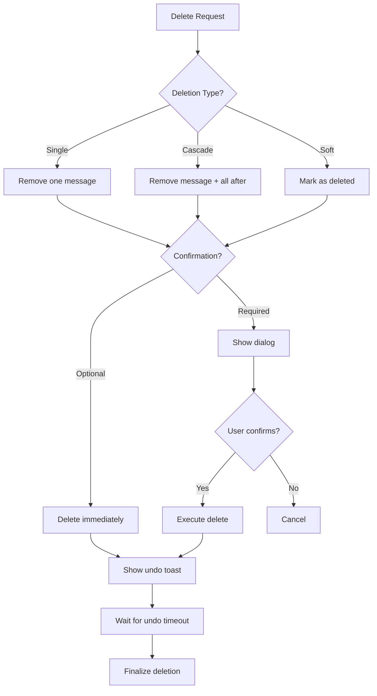

# Delete Messages

## Introduction

Deleting messages from a conversation requires careful UX consideration—users need the ability to remove unwanted content while being protected from accidental deletions. This lesson covers single and cascade deletions, confirmation patterns, undo functionality, and proper state management.

In this lesson, we'll build robust message deletion with proper safeguards and user feedback.

### What We'll Cover

- Single message deletion
- Cascade deletion (delete message + responses)
- Confirmation dialogs
- Undo with timer
- Soft delete vs hard delete
- `setMessages()` for deletion

### Prerequisites

- [useChat Action Methods](./04-usechat-action-methods.md)
- React state management
- Basic UX patterns

---

## Deletion Strategies



---

## Basic Delete with setMessages

```tsx
import { useChat } from '@ai-sdk/react';
import { DefaultChatTransport } from 'ai';

function ChatWithDelete() {
  const { messages, setMessages } = useChat({
    transport: new DefaultChatTransport({ api: '/api/chat' })
  });
  
  const deleteMessage = (id: string) => {
    setMessages(messages.filter(m => m.id !== id));
  };
  
  return (
    <div>
      {messages.map(message => (
        <div key={message.id} className="flex items-start gap-2">
          <MessageContent message={message} />
          
          <button
            onClick={() => deleteMessage(message.id)}
            className="p-1 text-gray-400 hover:text-red-500"
            aria-label="Delete message"
          >
            <TrashIcon className="w-4 h-4" />
          </button>
        </div>
      ))}
    </div>
  );
}
```

---

## Cascade Deletion

```tsx
// Delete a message and all messages after it
function useCascadeDelete(
  messages: Message[],
  setMessages: (messages: Message[]) => void
) {
  const deleteWithCascade = useCallback((id: string) => {
    const index = messages.findIndex(m => m.id === id);
    if (index === -1) return;
    
    // Keep only messages before the deleted one
    setMessages(messages.slice(0, index));
  }, [messages, setMessages]);
  
  return { deleteWithCascade };
}

// Usage with confirmation
function CascadeDeleteButton({ 
  messageId, 
  messageIndex, 
  totalMessages,
  onDelete 
}: {
  messageId: string;
  messageIndex: number;
  totalMessages: number;
  onDelete: (id: string) => void;
}) {
  const affectedCount = totalMessages - messageIndex;
  const [showConfirm, setShowConfirm] = useState(false);
  
  if (affectedCount > 1) {
    return (
      <>
        <button
          onClick={() => setShowConfirm(true)}
          className="text-red-500 hover:text-red-700"
        >
          Delete ({affectedCount} messages)
        </button>
        
        {showConfirm && (
          <ConfirmDialog
            title="Delete messages?"
            message={`This will delete this message and ${affectedCount - 1} following message(s).`}
            onConfirm={() => {
              onDelete(messageId);
              setShowConfirm(false);
            }}
            onCancel={() => setShowConfirm(false)}
          />
        )}
      </>
    );
  }
  
  return (
    <button onClick={() => onDelete(messageId)} className="text-red-500">
      Delete
    </button>
  );
}
```

---

## Confirmation Dialog

```tsx
interface ConfirmDialogProps {
  title: string;
  message: string;
  confirmText?: string;
  cancelText?: string;
  variant?: 'danger' | 'warning';
  onConfirm: () => void;
  onCancel: () => void;
}

function ConfirmDialog({
  title,
  message,
  confirmText = 'Delete',
  cancelText = 'Cancel',
  variant = 'danger',
  onConfirm,
  onCancel
}: ConfirmDialogProps) {
  const dialogRef = useRef<HTMLDivElement>(null);
  
  // Focus trap
  useEffect(() => {
    const dialog = dialogRef.current;
    if (dialog) {
      const firstButton = dialog.querySelector('button');
      firstButton?.focus();
    }
  }, []);
  
  // Close on Escape
  useEffect(() => {
    const handleEscape = (e: KeyboardEvent) => {
      if (e.key === 'Escape') onCancel();
    };
    window.addEventListener('keydown', handleEscape);
    return () => window.removeEventListener('keydown', handleEscape);
  }, [onCancel]);
  
  const variantStyles = {
    danger: 'bg-red-500 hover:bg-red-600',
    warning: 'bg-yellow-500 hover:bg-yellow-600'
  };
  
  return (
    <div className="fixed inset-0 bg-black/50 flex items-center justify-center z-50">
      <div 
        ref={dialogRef}
        className="bg-white rounded-lg p-6 max-w-md w-full mx-4 shadow-xl"
        role="alertdialog"
        aria-labelledby="dialog-title"
        aria-describedby="dialog-message"
      >
        <h2 id="dialog-title" className="text-lg font-semibold mb-2">
          {title}
        </h2>
        <p id="dialog-message" className="text-gray-600 mb-6">
          {message}
        </p>
        
        <div className="flex justify-end gap-3">
          <button
            onClick={onCancel}
            className="px-4 py-2 text-gray-600 hover:bg-gray-100 rounded"
          >
            {cancelText}
          </button>
          <button
            onClick={onConfirm}
            className={`px-4 py-2 text-white rounded ${variantStyles[variant]}`}
          >
            {confirmText}
          </button>
        </div>
      </div>
    </div>
  );
}
```

---

## Undo with Timer

```tsx
interface UndoState {
  deletedMessages: Message[];
  deletedAt: number;
  messageId: string;
}

function useDeleteWithUndo(
  messages: Message[],
  setMessages: (messages: Message[]) => void,
  undoTimeoutMs: number = 5000
) {
  const [undoState, setUndoState] = useState<UndoState | null>(null);
  const timeoutRef = useRef<NodeJS.Timeout>();
  
  const deleteMessage = useCallback((id: string) => {
    // Find and store deleted messages
    const index = messages.findIndex(m => m.id === id);
    if (index === -1) return;
    
    const deletedMessages = messages.slice(index);
    const remainingMessages = messages.slice(0, index);
    
    // Clear any existing timeout
    if (timeoutRef.current) {
      clearTimeout(timeoutRef.current);
    }
    
    // Store for undo
    setUndoState({
      deletedMessages,
      deletedAt: Date.now(),
      messageId: id
    });
    
    // Update messages
    setMessages(remainingMessages);
    
    // Set timeout to clear undo state
    timeoutRef.current = setTimeout(() => {
      setUndoState(null);
    }, undoTimeoutMs);
  }, [messages, setMessages, undoTimeoutMs]);
  
  const undo = useCallback(() => {
    if (!undoState) return;
    
    // Clear timeout
    if (timeoutRef.current) {
      clearTimeout(timeoutRef.current);
    }
    
    // Restore messages
    setMessages([...messages, ...undoState.deletedMessages]);
    setUndoState(null);
  }, [undoState, messages, setMessages]);
  
  const dismissUndo = useCallback(() => {
    if (timeoutRef.current) {
      clearTimeout(timeoutRef.current);
    }
    setUndoState(null);
  }, []);
  
  // Cleanup on unmount
  useEffect(() => {
    return () => {
      if (timeoutRef.current) {
        clearTimeout(timeoutRef.current);
      }
    };
  }, []);
  
  return {
    deleteMessage,
    undo,
    dismissUndo,
    canUndo: undoState !== null,
    undoTimeRemaining: undoState 
      ? Math.max(0, undoTimeoutMs - (Date.now() - undoState.deletedAt))
      : 0
  };
}
```

---

## Undo Toast Component

```tsx
function UndoToast({ 
  message, 
  onUndo, 
  onDismiss,
  timeoutMs = 5000 
}: {
  message: string;
  onUndo: () => void;
  onDismiss: () => void;
  timeoutMs?: number;
}) {
  const [progress, setProgress] = useState(100);
  
  useEffect(() => {
    const startTime = Date.now();
    
    const interval = setInterval(() => {
      const elapsed = Date.now() - startTime;
      const remaining = Math.max(0, 100 - (elapsed / timeoutMs) * 100);
      setProgress(remaining);
      
      if (remaining <= 0) {
        clearInterval(interval);
      }
    }, 50);
    
    return () => clearInterval(interval);
  }, [timeoutMs]);
  
  return (
    <div className="fixed bottom-4 left-1/2 -translate-x-1/2 bg-gray-900 text-white rounded-lg shadow-lg overflow-hidden">
      {/* Progress bar */}
      <div 
        className="h-1 bg-blue-500 transition-all duration-100"
        style={{ width: `${progress}%` }}
      />
      
      <div className="px-4 py-3 flex items-center gap-4">
        <span>{message}</span>
        
        <button
          onClick={onUndo}
          className="font-medium text-blue-400 hover:text-blue-300"
        >
          Undo
        </button>
        
        <button
          onClick={onDismiss}
          className="text-gray-400 hover:text-white"
          aria-label="Dismiss"
        >
          <XIcon className="w-4 h-4" />
        </button>
      </div>
    </div>
  );
}
```

---

## Soft Delete Pattern

```tsx
// Soft delete: mark as deleted but keep in array
interface SoftDeleteMessage extends Message {
  deleted?: boolean;
  deletedAt?: Date;
}

function useSoftDelete(
  messages: SoftDeleteMessage[],
  setMessages: (messages: SoftDeleteMessage[]) => void
) {
  const softDelete = useCallback((id: string) => {
    setMessages(messages.map(m => 
      m.id === id 
        ? { ...m, deleted: true, deletedAt: new Date() }
        : m
    ));
  }, [messages, setMessages]);
  
  const restore = useCallback((id: string) => {
    setMessages(messages.map(m =>
      m.id === id
        ? { ...m, deleted: false, deletedAt: undefined }
        : m
    ));
  }, [messages, setMessages]);
  
  const permanentDelete = useCallback((id: string) => {
    setMessages(messages.filter(m => m.id !== id));
  }, [messages, setMessages]);
  
  // Filter out deleted messages for display
  const visibleMessages = messages.filter(m => !m.deleted);
  const deletedMessages = messages.filter(m => m.deleted);
  
  return {
    softDelete,
    restore,
    permanentDelete,
    visibleMessages,
    deletedMessages
  };
}

// Deleted message placeholder
function DeletedMessagePlaceholder({ 
  message, 
  onRestore 
}: { 
  message: SoftDeleteMessage;
  onRestore: () => void;
}) {
  return (
    <div className="p-3 bg-gray-100 border border-dashed border-gray-300 rounded-lg text-gray-500 text-sm flex items-center justify-between">
      <span>Message deleted</span>
      <button
        onClick={onRestore}
        className="text-blue-500 hover:text-blue-700"
      >
        Restore
      </button>
    </div>
  );
}
```

---

## Complete Delete Integration

```tsx
function ChatWithFullDeleteSupport() {
  const { messages, setMessages, status } = useChat({
    transport: new DefaultChatTransport({ api: '/api/chat' })
  });
  
  const {
    deleteMessage,
    undo,
    dismissUndo,
    canUndo
  } = useDeleteWithUndo(messages, setMessages, 5000);
  
  const [confirmDelete, setConfirmDelete] = useState<{
    id: string;
    index: number;
  } | null>(null);
  
  const isProcessing = status === 'streaming' || status === 'submitted';
  
  const handleDeleteClick = (id: string, index: number) => {
    const affectedCount = messages.length - index;
    
    if (affectedCount > 1) {
      // Show confirmation for cascade delete
      setConfirmDelete({ id, index });
    } else {
      // Direct delete for single message
      deleteMessage(id);
    }
  };
  
  const confirmAndDelete = () => {
    if (confirmDelete) {
      deleteMessage(confirmDelete.id);
      setConfirmDelete(null);
    }
  };
  
  return (
    <div className="relative h-full">
      {/* Messages */}
      <div className="space-y-4 p-4">
        {messages.map((message, index) => (
          <div key={message.id} className="group flex items-start gap-2">
            <MessageBubble message={message} />
            
            {/* Delete button - hidden during processing */}
            {!isProcessing && (
              <button
                onClick={() => handleDeleteClick(message.id, index)}
                className="opacity-0 group-hover:opacity-100 transition-opacity p-1.5 text-gray-400 hover:text-red-500 hover:bg-red-50 rounded"
                aria-label="Delete message"
              >
                <TrashIcon className="w-4 h-4" />
              </button>
            )}
          </div>
        ))}
      </div>
      
      {/* Confirmation dialog */}
      {confirmDelete && (
        <ConfirmDialog
          title="Delete messages?"
          message={`This will delete ${messages.length - confirmDelete.index} message(s). This action cannot be undone after the undo period.`}
          onConfirm={confirmAndDelete}
          onCancel={() => setConfirmDelete(null)}
        />
      )}
      
      {/* Undo toast */}
      {canUndo && (
        <UndoToast
          message="Messages deleted"
          onUndo={undo}
          onDismiss={dismissUndo}
        />
      )}
    </div>
  );
}
```

---

## Keyboard Shortcuts for Delete

```tsx
function useDeleteKeyboardShortcuts(
  selectedMessageId: string | null,
  onDelete: (id: string) => void,
  canDelete: boolean
) {
  useEffect(() => {
    function handleKeyDown(e: KeyboardEvent) {
      if (!selectedMessageId || !canDelete) return;
      
      // Delete or Backspace to delete selected message
      if (e.key === 'Delete' || e.key === 'Backspace') {
        // Only if not in an input
        if (document.activeElement?.tagName !== 'INPUT' &&
            document.activeElement?.tagName !== 'TEXTAREA') {
          e.preventDefault();
          onDelete(selectedMessageId);
        }
      }
    }
    
    window.addEventListener('keydown', handleKeyDown);
    return () => window.removeEventListener('keydown', handleKeyDown);
  }, [selectedMessageId, onDelete, canDelete]);
}
```

---

## Delete All Messages

```tsx
function ClearChatButton({ 
  onClear, 
  messageCount,
  disabled 
}: { 
  onClear: () => void;
  messageCount: number;
  disabled?: boolean;
}) {
  const [showConfirm, setShowConfirm] = useState(false);
  
  if (messageCount === 0) return null;
  
  return (
    <>
      <button
        onClick={() => setShowConfirm(true)}
        disabled={disabled}
        className="flex items-center gap-1.5 px-3 py-1.5 text-sm text-gray-500 hover:text-red-500 hover:bg-red-50 rounded disabled:opacity-50"
      >
        <TrashIcon className="w-4 h-4" />
        Clear chat
      </button>
      
      {showConfirm && (
        <ConfirmDialog
          title="Clear entire chat?"
          message={`This will permanently delete all ${messageCount} messages. This cannot be undone.`}
          confirmText="Clear all"
          onConfirm={() => {
            onClear();
            setShowConfirm(false);
          }}
          onCancel={() => setShowConfirm(false)}
        />
      )}
    </>
  );
}
```

---

## Best Practices

| ✅ Do | ❌ Don't |
|-------|---------|
| Provide undo for deletions | Delete without recovery option |
| Confirm cascade deletions | Silently delete multiple messages |
| Show affected message count | Be vague about deletion scope |
| Disable delete during streaming | Allow deletion mid-stream |
| Use soft delete when possible | Always hard delete |
| Add keyboard shortcuts | Mouse-only delete |

---

## Common Pitfalls

| ❌ Mistake | ✅ Solution |
|-----------|-------------|
| Undo timeout too short | Use 5-10 seconds minimum |
| No visual feedback on delete | Show toast/animation |
| Deleting creates orphaned state | Clean up related data (versions, etc.) |
| Can delete during streaming | Check `isProcessing` before delete |
| Confusing cascade behavior | Clearly explain what will be deleted |

---

## Hands-on Exercise

### Your Task

Build a complete delete system with:
1. Single message delete button
2. Cascade delete with confirmation
3. Undo toast with countdown
4. Clear all chat button
5. Keyboard shortcut (Delete key)

### Requirements

1. 5-second undo window
2. Confirmation for multi-message delete
3. Show affected message count
4. Disable during streaming

<details>
<summary>💡 Hints (click to expand)</summary>

- Use `useDeleteWithUndo` hook
- Track progress for visual countdown
- Store deleted messages in undo state
- Filter by index for cascade delete

</details>

---

## Summary

✅ **setMessages()** for deletion updates  
✅ **Cascade delete** removes following messages  
✅ **Confirmation dialogs** prevent accidents  
✅ **Undo with timer** enables recovery  
✅ **Soft delete** preserves restore option  
✅ **Clear all** with strong confirmation

---

## Further Reading

- [Undo UX Patterns](https://www.nngroup.com/articles/confirmation-dialog/)
- [Toast Notification Best Practices](https://www.nngroup.com/articles/toast-notification/)
- [Destructive Action Design](https://www.nngroup.com/articles/slips/)

---

**Previous:** [Message Version History](./06-message-version-history.md)  
**Next:** [Long Message Handling](./08-long-message-handling.md)

<!-- 
Sources Consulted:
- AI SDK setMessages: https://ai-sdk.dev/docs/reference/ai-sdk-ui/use-chat
- NNG Confirmation Dialogs: https://www.nngroup.com/articles/confirmation-dialog/
- NNG Undo: https://www.nngroup.com/articles/slips/
-->
