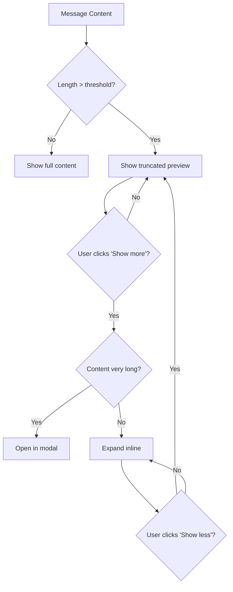

# Long Message Handling

## Introduction

AI responses can be lengthy—sometimes thousands of words with multiple code blocks, lists, and sections. Without proper handling, long messages create poor UX: slow scrolling, overwhelming content, and difficult navigation. This lesson covers truncation, expand/collapse patterns, and virtualization.

In this lesson, we'll build responsive message displays that handle content of any length gracefully.

### What We'll Cover

- Content length detection
- "Show more" truncation patterns
- Expand/collapse animations
- Full-screen modal view
- Message virtualization
- Performance optimization

### Prerequisites

- [Message Display Basics](../04-message-display/00-message-display.md)
- React state management
- CSS transitions

---

## Truncation Strategy



---

## Basic Truncation Component

```tsx
interface TruncatedTextProps {
  content: string;
  maxLength?: number;
  maxLines?: number;
}

function TruncatedText({ 
  content, 
  maxLength = 500,
  maxLines = 8 
}: TruncatedTextProps) {
  const [isExpanded, setIsExpanded] = useState(false);
  
  const shouldTruncate = content.length > maxLength;
  const displayContent = isExpanded 
    ? content 
    : content.slice(0, maxLength);
  
  return (
    <div>
      <div 
        className={`
          whitespace-pre-wrap
          ${!isExpanded && shouldTruncate ? 'line-clamp-' + maxLines : ''}
        `}
      >
        {displayContent}
        {!isExpanded && shouldTruncate && '...'}
      </div>
      
      {shouldTruncate && (
        <button
          onClick={() => setIsExpanded(!isExpanded)}
          className="mt-2 text-sm text-blue-500 hover:text-blue-700"
        >
          {isExpanded ? 'Show less' : 'Show more'}
        </button>
      )}
    </div>
  );
}
```

---

## Smart Truncation Hook

```tsx
interface UseTruncationOptions {
  content: string;
  charLimit?: number;
  lineLimit?: number;
  expandThreshold?: number; // Open modal if content exceeds this
}

function useTruncation({
  content,
  charLimit = 500,
  lineLimit = 10,
  expandThreshold = 5000
}: UseTruncationOptions) {
  const [isExpanded, setIsExpanded] = useState(false);
  const [showModal, setShowModal] = useState(false);
  
  const lineCount = content.split('\n').length;
  const charCount = content.length;
  
  const needsTruncation = charCount > charLimit || lineCount > lineLimit;
  const isVeryLong = charCount > expandThreshold;
  
  const truncatedContent = useMemo(() => {
    if (!needsTruncation || isExpanded) return content;
    
    // Truncate by lines first
    const lines = content.split('\n').slice(0, lineLimit);
    let truncated = lines.join('\n');
    
    // Then by characters if still too long
    if (truncated.length > charLimit) {
      truncated = truncated.slice(0, charLimit);
      // Don't cut mid-word
      const lastSpace = truncated.lastIndexOf(' ');
      if (lastSpace > charLimit - 50) {
        truncated = truncated.slice(0, lastSpace);
      }
    }
    
    return truncated;
  }, [content, needsTruncation, isExpanded, lineLimit, charLimit]);
  
  const toggle = useCallback(() => {
    if (isVeryLong && !isExpanded) {
      setShowModal(true);
    } else {
      setIsExpanded(!isExpanded);
    }
  }, [isVeryLong, isExpanded]);
  
  return {
    displayContent: truncatedContent,
    isExpanded,
    needsTruncation,
    isVeryLong,
    showModal,
    toggle,
    closeModal: () => setShowModal(false),
    stats: {
      charCount,
      lineCount,
      truncatedAt: needsTruncation && !isExpanded ? truncatedContent.length : null
    }
  };
}
```

---

## Animated Expand/Collapse

```tsx
function AnimatedTruncation({ content, maxHeight = 200 }: {
  content: string;
  maxHeight?: number;
}) {
  const [isExpanded, setIsExpanded] = useState(false);
  const [contentHeight, setContentHeight] = useState(0);
  const contentRef = useRef<HTMLDivElement>(null);
  
  // Measure full content height
  useEffect(() => {
    if (contentRef.current) {
      setContentHeight(contentRef.current.scrollHeight);
    }
  }, [content]);
  
  const needsTruncation = contentHeight > maxHeight;
  
  return (
    <div className="relative">
      <div
        ref={contentRef}
        className="overflow-hidden transition-all duration-300 ease-out"
        style={{
          maxHeight: isExpanded ? contentHeight : maxHeight
        }}
      >
        <div className="whitespace-pre-wrap">{content}</div>
      </div>
      
      {/* Fade overlay when truncated */}
      {needsTruncation && !isExpanded && (
        <div className="absolute bottom-0 left-0 right-0 h-16 bg-gradient-to-t from-white to-transparent pointer-events-none" />
      )}
      
      {needsTruncation && (
        <button
          onClick={() => setIsExpanded(!isExpanded)}
          className="relative z-10 mt-2 flex items-center gap-1 text-sm text-blue-500 hover:text-blue-700"
        >
          {isExpanded ? (
            <>
              <ChevronUpIcon className="w-4 h-4" />
              Show less
            </>
          ) : (
            <>
              <ChevronDownIcon className="w-4 h-4" />
              Show more ({Math.round(contentHeight / maxHeight)}x longer)
            </>
          )}
        </button>
      )}
    </div>
  );
}
```

---

## Full-Screen Modal View

```tsx
interface MessageModalProps {
  message: Message;
  isOpen: boolean;
  onClose: () => void;
}

function MessageModal({ message, isOpen, onClose }: MessageModalProps) {
  // Close on escape
  useEffect(() => {
    const handleEscape = (e: KeyboardEvent) => {
      if (e.key === 'Escape') onClose();
    };
    
    if (isOpen) {
      window.addEventListener('keydown', handleEscape);
      document.body.style.overflow = 'hidden';
    }
    
    return () => {
      window.removeEventListener('keydown', handleEscape);
      document.body.style.overflow = '';
    };
  }, [isOpen, onClose]);
  
  if (!isOpen) return null;
  
  return (
    <div 
      className="fixed inset-0 z-50 bg-black/50 flex items-center justify-center p-4"
      onClick={onClose}
    >
      <div 
        className="bg-white rounded-xl max-w-4xl w-full max-h-[90vh] flex flex-col shadow-2xl"
        onClick={e => e.stopPropagation()}
      >
        {/* Header */}
        <div className="flex items-center justify-between p-4 border-b">
          <div className="flex items-center gap-2">
            <span className="font-medium">
              {message.role === 'assistant' ? 'AI Response' : 'Your Message'}
            </span>
            <span className="text-sm text-gray-500">
              {message.content.length.toLocaleString()} characters
            </span>
          </div>
          
          <button
            onClick={onClose}
            className="p-2 hover:bg-gray-100 rounded-lg"
            aria-label="Close"
          >
            <XIcon className="w-5 h-5" />
          </button>
        </div>
        
        {/* Content */}
        <div className="flex-1 overflow-y-auto p-6">
          <div className="prose max-w-none">
            <MessageContent message={message} />
          </div>
        </div>
        
        {/* Footer */}
        <div className="p-4 border-t flex items-center justify-between">
          <CopyButton content={message.content} />
          
          <button
            onClick={onClose}
            className="px-4 py-2 bg-gray-100 hover:bg-gray-200 rounded-lg"
          >
            Close
          </button>
        </div>
      </div>
    </div>
  );
}
```

---

## Message with Long Content Support

```tsx
function LongMessageHandler({ message }: { message: Message }) {
  const {
    displayContent,
    isExpanded,
    needsTruncation,
    isVeryLong,
    showModal,
    toggle,
    closeModal,
    stats
  } = useTruncation({
    content: message.content,
    charLimit: 500,
    lineLimit: 10,
    expandThreshold: 3000
  });
  
  return (
    <div className="message-bubble">
      {/* Content */}
      <div className={`
        ${!isExpanded && needsTruncation ? 'relative' : ''}
      `}>
        <div className="whitespace-pre-wrap">
          {displayContent}
          {!isExpanded && needsTruncation && (
            <span className="text-gray-400">...</span>
          )}
        </div>
        
        {/* Fade effect */}
        {!isExpanded && needsTruncation && (
          <div className="absolute bottom-0 left-0 right-0 h-8 bg-gradient-to-t from-inherit to-transparent" />
        )}
      </div>
      
      {/* Show more/less button */}
      {needsTruncation && (
        <div className="mt-3 flex items-center gap-3">
          <button
            onClick={toggle}
            className="text-sm font-medium text-blue-500 hover:text-blue-700"
          >
            {isExpanded ? 'Show less' : isVeryLong ? 'View full response' : 'Show more'}
          </button>
          
          <span className="text-xs text-gray-400">
            {stats.charCount.toLocaleString()} characters • {stats.lineCount} lines
          </span>
        </div>
      )}
      
      {/* Modal for very long content */}
      <MessageModal
        message={message}
        isOpen={showModal}
        onClose={closeModal}
      />
    </div>
  );
}
```

---

## Virtualized Message List

For very long conversations, virtualization improves performance by only rendering visible messages.

```tsx
import { useVirtualizer } from '@tanstack/react-virtual';

function VirtualizedMessageList({ messages }: { messages: Message[] }) {
  const parentRef = useRef<HTMLDivElement>(null);
  
  const virtualizer = useVirtualizer({
    count: messages.length,
    getScrollElement: () => parentRef.current,
    estimateSize: (index) => {
      // Estimate based on content length
      const content = messages[index].content;
      const lineCount = content.split('\n').length;
      const charCount = content.length;
      
      // Rough estimate: 20px per line, minimum 60px
      return Math.max(60, Math.min(400, lineCount * 20 + charCount / 10));
    },
    overscan: 3 // Render 3 items before/after visible area
  });
  
  return (
    <div
      ref={parentRef}
      className="h-full overflow-y-auto"
    >
      <div
        className="relative w-full"
        style={{ height: virtualizer.getTotalSize() }}
      >
        {virtualizer.getVirtualItems().map((virtualItem) => (
          <div
            key={messages[virtualItem.index].id}
            className="absolute top-0 left-0 w-full"
            style={{
              transform: `translateY(${virtualItem.start}px)`
            }}
            ref={virtualizer.measureElement}
            data-index={virtualItem.index}
          >
            <LongMessageHandler message={messages[virtualItem.index]} />
          </div>
        ))}
      </div>
    </div>
  );
}
```

---

## Progressive Content Loading

```tsx
function ProgressiveMessage({ message }: { message: Message }) {
  const [visibleChars, setVisibleChars] = useState(1000);
  const [isLoading, setIsLoading] = useState(false);
  const content = message.content;
  
  const hasMore = visibleChars < content.length;
  
  const loadMore = () => {
    setIsLoading(true);
    
    // Simulate loading delay for smooth UX
    setTimeout(() => {
      setVisibleChars(prev => Math.min(prev + 2000, content.length));
      setIsLoading(false);
    }, 100);
  };
  
  // Intersection observer for infinite scroll
  const loadMoreRef = useRef<HTMLDivElement>(null);
  
  useEffect(() => {
    const observer = new IntersectionObserver(
      (entries) => {
        if (entries[0].isIntersecting && hasMore && !isLoading) {
          loadMore();
        }
      },
      { threshold: 0.1 }
    );
    
    if (loadMoreRef.current) {
      observer.observe(loadMoreRef.current);
    }
    
    return () => observer.disconnect();
  }, [hasMore, isLoading]);
  
  return (
    <div>
      <div className="whitespace-pre-wrap">
        {content.slice(0, visibleChars)}
      </div>
      
      {hasMore && (
        <div ref={loadMoreRef} className="py-4 text-center">
          {isLoading ? (
            <div className="flex items-center justify-center gap-2 text-gray-500">
              <LoadingSpinner size="sm" />
              Loading more...
            </div>
          ) : (
            <button
              onClick={loadMore}
              className="text-blue-500 hover:text-blue-700"
            >
              Load more ({(content.length - visibleChars).toLocaleString()} remaining)
            </button>
          )}
        </div>
      )}
    </div>
  );
}
```

---

## Code Block Collapse

```tsx
function CollapsibleCodeBlock({ 
  code, 
  language,
  maxLines = 20 
}: { 
  code: string;
  language?: string;
  maxLines?: number;
}) {
  const [isExpanded, setIsExpanded] = useState(false);
  const lines = code.split('\n');
  const needsCollapse = lines.length > maxLines;
  
  const displayCode = isExpanded 
    ? code 
    : lines.slice(0, maxLines).join('\n');
  
  return (
    <div className="relative rounded-lg overflow-hidden">
      {/* Header */}
      <div className="flex items-center justify-between px-4 py-2 bg-gray-800 text-gray-300">
        <span className="text-sm">{language || 'code'}</span>
        <div className="flex items-center gap-2">
          <span className="text-xs text-gray-500">{lines.length} lines</span>
          <CopyButton content={code} />
        </div>
      </div>
      
      {/* Code */}
      <div className="relative">
        <pre className="p-4 bg-gray-900 text-gray-100 overflow-x-auto">
          <code>{displayCode}</code>
        </pre>
        
        {/* Fade overlay when collapsed */}
        {needsCollapse && !isExpanded && (
          <div className="absolute bottom-0 left-0 right-0 h-16 bg-gradient-to-t from-gray-900 to-transparent" />
        )}
      </div>
      
      {/* Expand button */}
      {needsCollapse && (
        <button
          onClick={() => setIsExpanded(!isExpanded)}
          className="w-full py-2 bg-gray-800 text-gray-300 text-sm hover:bg-gray-700 flex items-center justify-center gap-1"
        >
          {isExpanded ? (
            <>
              <ChevronUpIcon className="w-4 h-4" />
              Collapse ({maxLines} lines shown)
            </>
          ) : (
            <>
              <ChevronDownIcon className="w-4 h-4" />
              Expand ({lines.length - maxLines} more lines)
            </>
          )}
        </button>
      )}
    </div>
  );
}
```

---

## Best Practices

| ✅ Do | ❌ Don't |
|-------|---------|
| Truncate at natural breaks | Cut mid-word or mid-sentence |
| Show content stats (chars, lines) | Hide content length |
| Use modal for very long content | Force inline expansion |
| Animate expand/collapse | Instant layout shifts |
| Virtualize long lists | Render 100+ messages |
| Progressive load on scroll | Load everything upfront |

---

## Common Pitfalls

| ❌ Mistake | ✅ Solution |
|-----------|-------------|
| Truncation cuts code blocks | Detect and preserve blocks |
| Layout shift on expand | Use max-height animation |
| Modal content not scrollable | Add overflow-y-auto |
| No way to copy full content | Provide copy in modal |
| Very long content crashes page | Use virtualization |

---

## Hands-on Exercise

### Your Task

Build a long message handler with:
1. Smart truncation (500 char / 10 line limit)
2. Animated expand/collapse
3. Modal view for content >3000 chars
4. Content stats display
5. Copy button for full content

### Requirements

1. Preserve code blocks during truncation
2. Smooth 300ms transition
3. Fade gradient at truncation point
4. Keyboard accessible modal

<details>
<summary>💡 Hints (click to expand)</summary>

- Use `useTruncation` hook
- Measure content with `scrollHeight`
- Use `max-height` for animation
- Add `overflow: hidden` during animation

</details>

---

## Summary

✅ **Smart truncation** preserves readability  
✅ **Animated expansion** provides smooth UX  
✅ **Modal view** handles very long content  
✅ **Virtualization** optimizes performance  
✅ **Progressive loading** for huge messages  
✅ **Content stats** give users context

---

## Further Reading

- [TanStack Virtual](https://tanstack.com/virtual/latest)
- [CSS Line Clamp](https://developer.mozilla.org/en-US/docs/Web/CSS/-webkit-line-clamp)
- [Intersection Observer API](https://developer.mozilla.org/en-US/docs/Web/API/Intersection_Observer_API)

---

**Previous:** [Delete Messages](./07-delete-messages.md)  
**Next:** [Message Feedback](./09-message-feedback.md)

<!-- 
Sources Consulted:
- TanStack Virtual: https://tanstack.com/virtual/latest
- MDN Intersection Observer: https://developer.mozilla.org/en-US/docs/Web/API/Intersection_Observer_API
- MDN line-clamp: https://developer.mozilla.org/en-US/docs/Web/CSS/-webkit-line-clamp
-->
