# Message Feedback

## Introduction

User feedback on AI responses—thumbs up/down, ratings, and detailed comments—is essential for improving AI systems. This data helps identify hallucinations, track quality, and fine-tune models. Implementing feedback collection requires thoughtful UX that encourages participation without disrupting the conversation flow.

In this lesson, we'll build comprehensive feedback systems from simple reactions to detailed feedback forms.

### What We'll Cover

- Thumbs up/down reactions
- Star ratings
- Detailed feedback forms
- Feedback submission APIs
- Analytics and aggregation
- Feedback UI placement

### Prerequisites

- [Message Display](../04-message-display/00-message-display.md)
- Form handling in React
- Basic API integration

---

## Feedback Types

```mermaid
flowchart TD
    A[User views response] --> B{Quick feedback?}
    B -->|Yes| C[👍 / 👎 Reaction]
    B -->|No| D[Continue conversation]
    
    C --> E{Negative feedback?}
    E -->|Yes| F[Show feedback form]
    E -->|No| G[Store positive feedback]
    
    F --> H{User completes form?}
    H -->|Yes| I[Store detailed feedback]
    H -->|No| J[Store negative reaction only]
```



---

## Basic Thumbs Up/Down

```tsx
interface FeedbackButtonsProps {
  messageId: string;
  initialFeedback?: 'positive' | 'negative' | null;
  onFeedback: (messageId: string, type: 'positive' | 'negative') => void;
}

function FeedbackButtons({ 
  messageId, 
  initialFeedback, 
  onFeedback 
}: FeedbackButtonsProps) {
  const [feedback, setFeedback] = useState(initialFeedback);
  
  const handleFeedback = (type: 'positive' | 'negative') => {
    // Toggle if same feedback clicked again
    const newFeedback = feedback === type ? null : type;
    setFeedback(newFeedback);
    
    if (newFeedback) {
      onFeedback(messageId, newFeedback);
    }
  };
  
  return (
    <div className="flex items-center gap-1">
      <button
        onClick={() => handleFeedback('positive')}
        className={`
          p-1.5 rounded transition-colors
          ${feedback === 'positive' 
            ? 'bg-green-100 text-green-600' 
            : 'text-gray-400 hover:text-green-500 hover:bg-green-50'
          }
        `}
        aria-label="Good response"
        aria-pressed={feedback === 'positive'}
      >
        <ThumbsUpIcon className="w-4 h-4" />
      </button>
      
      <button
        onClick={() => handleFeedback('negative')}
        className={`
          p-1.5 rounded transition-colors
          ${feedback === 'negative' 
            ? 'bg-red-100 text-red-600' 
            : 'text-gray-400 hover:text-red-500 hover:bg-red-50'
          }
        `}
        aria-label="Bad response"
        aria-pressed={feedback === 'negative'}
      >
        <ThumbsDownIcon className="w-4 h-4" />
      </button>
    </div>
  );
}
```

---

## Animated Feedback Buttons

```tsx
function AnimatedFeedbackButtons({ 
  messageId, 
  onFeedback 
}: { 
  messageId: string;
  onFeedback: (id: string, type: 'positive' | 'negative', details?: string) => void;
}) {
  const [feedback, setFeedback] = useState<'positive' | 'negative' | null>(null);
  const [showThankYou, setShowThankYou] = useState(false);
  const [showForm, setShowForm] = useState(false);
  
  const handlePositive = () => {
    setFeedback('positive');
    setShowThankYou(true);
    onFeedback(messageId, 'positive');
    
    setTimeout(() => setShowThankYou(false), 2000);
  };
  
  const handleNegative = () => {
    setFeedback('negative');
    setShowForm(true);
  };
  
  const handleFormSubmit = (details: string) => {
    onFeedback(messageId, 'negative', details);
    setShowForm(false);
    setShowThankYou(true);
    setTimeout(() => setShowThankYou(false), 2000);
  };
  
  return (
    <div className="relative">
      {/* Feedback buttons */}
      <div className={`flex items-center gap-1 transition-opacity ${showThankYou ? 'opacity-0' : 'opacity-100'}`}>
        <button
          onClick={handlePositive}
          disabled={feedback === 'positive'}
          className={`
            p-1.5 rounded transition-all duration-200
            ${feedback === 'positive' 
              ? 'bg-green-100 text-green-600 scale-110' 
              : 'text-gray-400 hover:text-green-500'
            }
          `}
        >
          <ThumbsUpIcon className="w-4 h-4" />
        </button>
        
        <button
          onClick={handleNegative}
          disabled={feedback === 'negative'}
          className={`
            p-1.5 rounded transition-all duration-200
            ${feedback === 'negative' 
              ? 'bg-red-100 text-red-600 scale-110' 
              : 'text-gray-400 hover:text-red-500'
            }
          `}
        >
          <ThumbsDownIcon className="w-4 h-4" />
        </button>
      </div>
      
      {/* Thank you message */}
      {showThankYou && (
        <div className="absolute inset-0 flex items-center justify-center text-sm text-green-600 animate-fade-in">
          Thanks for your feedback!
        </div>
      )}
      
      {/* Feedback form */}
      {showForm && (
        <FeedbackForm
          onSubmit={handleFormSubmit}
          onCancel={() => {
            setShowForm(false);
            setFeedback(null);
          }}
        />
      )}
    </div>
  );
}
```

---

## Detailed Feedback Form

```tsx
interface FeedbackFormProps {
  onSubmit: (details: string, categories: string[]) => void;
  onCancel: () => void;
}

const FEEDBACK_CATEGORIES = [
  { id: 'inaccurate', label: 'Inaccurate information' },
  { id: 'unhelpful', label: 'Not helpful' },
  { id: 'harmful', label: 'Harmful or unsafe' },
  { id: 'incomplete', label: 'Incomplete answer' },
  { id: 'formatting', label: 'Poor formatting' },
  { id: 'other', label: 'Other' }
];

function FeedbackForm({ onSubmit, onCancel }: FeedbackFormProps) {
  const [selectedCategories, setSelectedCategories] = useState<string[]>([]);
  const [details, setDetails] = useState('');
  
  const toggleCategory = (id: string) => {
    setSelectedCategories(prev =>
      prev.includes(id)
        ? prev.filter(c => c !== id)
        : [...prev, id]
    );
  };
  
  const handleSubmit = (e: React.FormEvent) => {
    e.preventDefault();
    onSubmit(details, selectedCategories);
  };
  
  return (
    <div className="absolute top-full mt-2 left-0 bg-white rounded-lg shadow-lg border p-4 w-80 z-20">
      <form onSubmit={handleSubmit}>
        <h3 className="font-medium mb-3">What was wrong with this response?</h3>
        
        {/* Category selection */}
        <div className="space-y-2 mb-4">
          {FEEDBACK_CATEGORIES.map(category => (
            <label
              key={category.id}
              className="flex items-center gap-2 cursor-pointer"
            >
              <input
                type="checkbox"
                checked={selectedCategories.includes(category.id)}
                onChange={() => toggleCategory(category.id)}
                className="rounded border-gray-300 text-blue-500 focus:ring-blue-500"
              />
              <span className="text-sm">{category.label}</span>
            </label>
          ))}
        </div>
        
        {/* Details textarea */}
        <textarea
          value={details}
          onChange={e => setDetails(e.target.value)}
          placeholder="Additional details (optional)"
          className="w-full p-2 border rounded text-sm resize-none focus:ring-2 focus:ring-blue-500"
          rows={3}
        />
        
        {/* Actions */}
        <div className="flex justify-end gap-2 mt-3">
          <button
            type="button"
            onClick={onCancel}
            className="px-3 py-1.5 text-sm text-gray-600 hover:bg-gray-100 rounded"
          >
            Cancel
          </button>
          <button
            type="submit"
            disabled={selectedCategories.length === 0 && !details.trim()}
            className="px-3 py-1.5 text-sm bg-blue-500 text-white rounded hover:bg-blue-600 disabled:bg-gray-300"
          >
            Submit
          </button>
        </div>
      </form>
    </div>
  );
}
```

---

## Star Rating Component

```tsx
interface StarRatingProps {
  messageId: string;
  initialRating?: number;
  onRate: (messageId: string, rating: number) => void;
}

function StarRating({ messageId, initialRating = 0, onRate }: StarRatingProps) {
  const [rating, setRating] = useState(initialRating);
  const [hoverRating, setHoverRating] = useState(0);
  
  const handleClick = (value: number) => {
    setRating(value);
    onRate(messageId, value);
  };
  
  return (
    <div 
      className="flex items-center gap-0.5"
      onMouseLeave={() => setHoverRating(0)}
    >
      {[1, 2, 3, 4, 5].map(value => (
        <button
          key={value}
          onClick={() => handleClick(value)}
          onMouseEnter={() => setHoverRating(value)}
          className="p-0.5 focus:outline-none focus:ring-2 focus:ring-yellow-400 rounded"
          aria-label={`Rate ${value} stars`}
        >
          <StarIcon
            className={`
              w-5 h-5 transition-colors
              ${(hoverRating || rating) >= value
                ? 'text-yellow-400 fill-yellow-400'
                : 'text-gray-300'
              }
            `}
          />
        </button>
      ))}
      
      {rating > 0 && (
        <span className="ml-2 text-sm text-gray-500">
          {rating}/5
        </span>
      )}
    </div>
  );
}
```

---

## Feedback Hook

```tsx
interface FeedbackData {
  messageId: string;
  type: 'positive' | 'negative' | 'rating';
  rating?: number;
  categories?: string[];
  details?: string;
  timestamp: Date;
}

function useFeedback(apiEndpoint: string = '/api/feedback') {
  const [feedbackMap, setFeedbackMap] = useState<Map<string, FeedbackData>>(new Map());
  const [isSubmitting, setIsSubmitting] = useState(false);
  const [error, setError] = useState<string | null>(null);
  
  const submitFeedback = useCallback(async (feedback: Omit<FeedbackData, 'timestamp'>) => {
    setIsSubmitting(true);
    setError(null);
    
    const fullFeedback: FeedbackData = {
      ...feedback,
      timestamp: new Date()
    };
    
    try {
      const response = await fetch(apiEndpoint, {
        method: 'POST',
        headers: { 'Content-Type': 'application/json' },
        body: JSON.stringify(fullFeedback)
      });
      
      if (!response.ok) {
        throw new Error('Failed to submit feedback');
      }
      
      // Store locally
      setFeedbackMap(prev => new Map(prev).set(feedback.messageId, fullFeedback));
      
      return true;
    } catch (err) {
      setError(err instanceof Error ? err.message : 'Failed to submit feedback');
      return false;
    } finally {
      setIsSubmitting(false);
    }
  }, [apiEndpoint]);
  
  const getFeedback = useCallback((messageId: string) => {
    return feedbackMap.get(messageId);
  }, [feedbackMap]);
  
  const hasFeedback = useCallback((messageId: string) => {
    return feedbackMap.has(messageId);
  }, [feedbackMap]);
  
  return {
    submitFeedback,
    getFeedback,
    hasFeedback,
    isSubmitting,
    error
  };
}
```

---

## Feedback API Handler

```typescript
// app/api/feedback/route.ts (Next.js)
import { NextRequest, NextResponse } from 'next/server';

interface FeedbackPayload {
  messageId: string;
  type: 'positive' | 'negative' | 'rating';
  rating?: number;
  categories?: string[];
  details?: string;
  timestamp: string;
}

export async function POST(request: NextRequest) {
  try {
    const feedback: FeedbackPayload = await request.json();
    
    // Validate
    if (!feedback.messageId || !feedback.type) {
      return NextResponse.json(
        { error: 'Missing required fields' },
        { status: 400 }
      );
    }
    
    // Store in database
    await storeFeedback({
      ...feedback,
      userId: getUserId(request), // From session/auth
      sessionId: getSessionId(request),
      userAgent: request.headers.get('user-agent'),
      timestamp: new Date(feedback.timestamp)
    });
    
    // Optional: Send to analytics
    await trackEvent('feedback_submitted', {
      messageId: feedback.messageId,
      type: feedback.type,
      hasDetails: !!feedback.details
    });
    
    return NextResponse.json({ success: true });
  } catch (error) {
    console.error('Feedback error:', error);
    return NextResponse.json(
      { error: 'Failed to store feedback' },
      { status: 500 }
    );
  }
}

async function storeFeedback(feedback: any) {
  // Store in your database (Postgres, MongoDB, etc.)
  // Example with Prisma:
  // await prisma.feedback.create({ data: feedback });
}
```

---

## Complete Message with Feedback

```tsx
function MessageWithFeedback({ 
  message,
  onFeedback 
}: { 
  message: Message;
  onFeedback: (data: FeedbackData) => void;
}) {
  const [showActions, setShowActions] = useState(false);
  const [feedbackGiven, setFeedbackGiven] = useState<'positive' | 'negative' | null>(null);
  const [showForm, setShowForm] = useState(false);
  
  // Only show feedback for assistant messages
  if (message.role !== 'assistant') {
    return <MessageBubble message={message} />;
  }
  
  const handleQuickFeedback = (type: 'positive' | 'negative') => {
    setFeedbackGiven(type);
    
    if (type === 'negative') {
      setShowForm(true);
    } else {
      onFeedback({
        messageId: message.id,
        type: 'positive',
        timestamp: new Date()
      });
    }
  };
  
  const handleDetailedFeedback = (details: string, categories: string[]) => {
    onFeedback({
      messageId: message.id,
      type: 'negative',
      categories,
      details,
      timestamp: new Date()
    });
    setShowForm(false);
  };
  
  return (
    <div 
      className="group relative"
      onMouseEnter={() => setShowActions(true)}
      onMouseLeave={() => !showForm && setShowActions(false)}
    >
      <MessageBubble message={message} />
      
      {/* Action bar */}
      <div className={`
        flex items-center gap-2 mt-2 transition-opacity
        ${showActions || feedbackGiven ? 'opacity-100' : 'opacity-0'}
      `}>
        {/* Copy button */}
        <CopyButton content={message.content} />
        
        {/* Feedback buttons */}
        {!feedbackGiven ? (
          <>
            <button
              onClick={() => handleQuickFeedback('positive')}
              className="p-1.5 text-gray-400 hover:text-green-500 rounded"
              aria-label="Good response"
            >
              <ThumbsUpIcon className="w-4 h-4" />
            </button>
            <button
              onClick={() => handleQuickFeedback('negative')}
              className="p-1.5 text-gray-400 hover:text-red-500 rounded"
              aria-label="Bad response"
            >
              <ThumbsDownIcon className="w-4 h-4" />
            </button>
          </>
        ) : (
          <span className={`
            text-xs font-medium
            ${feedbackGiven === 'positive' ? 'text-green-600' : 'text-red-600'}
          `}>
            {feedbackGiven === 'positive' ? '👍 Thanks!' : '👎 Thanks for letting us know'}
          </span>
        )}
      </div>
      
      {/* Detailed feedback form */}
      {showForm && (
        <FeedbackForm
          onSubmit={handleDetailedFeedback}
          onCancel={() => {
            setShowForm(false);
            setFeedbackGiven(null);
          }}
        />
      )}
    </div>
  );
}
```

---

## Feedback Analytics Dashboard

```tsx
interface FeedbackStats {
  totalFeedback: number;
  positiveCount: number;
  negativeCount: number;
  averageRating: number;
  categoryBreakdown: Record<string, number>;
}

function FeedbackDashboard({ stats }: { stats: FeedbackStats }) {
  const positiveRate = (stats.positiveCount / stats.totalFeedback) * 100;
  
  return (
    <div className="grid grid-cols-2 md:grid-cols-4 gap-4">
      {/* Total feedback */}
      <div className="p-4 bg-white rounded-lg shadow">
        <p className="text-sm text-gray-500">Total Feedback</p>
        <p className="text-2xl font-bold">{stats.totalFeedback}</p>
      </div>
      
      {/* Positive rate */}
      <div className="p-4 bg-white rounded-lg shadow">
        <p className="text-sm text-gray-500">Positive Rate</p>
        <p className="text-2xl font-bold text-green-600">
          {positiveRate.toFixed(1)}%
        </p>
      </div>
      
      {/* Average rating */}
      <div className="p-4 bg-white rounded-lg shadow">
        <p className="text-sm text-gray-500">Average Rating</p>
        <div className="flex items-center gap-1">
          <StarIcon className="w-5 h-5 text-yellow-400 fill-yellow-400" />
          <span className="text-2xl font-bold">{stats.averageRating.toFixed(1)}</span>
        </div>
      </div>
      
      {/* Category breakdown */}
      <div className="p-4 bg-white rounded-lg shadow">
        <p className="text-sm text-gray-500 mb-2">Top Issues</p>
        <div className="space-y-1">
          {Object.entries(stats.categoryBreakdown)
            .sort(([, a], [, b]) => b - a)
            .slice(0, 3)
            .map(([category, count]) => (
              <div key={category} className="flex justify-between text-sm">
                <span>{category}</span>
                <span className="font-medium">{count}</span>
              </div>
            ))}
        </div>
      </div>
    </div>
  );
}
```

---

## Best Practices

| ✅ Do | ❌ Don't |
|-------|---------|
| Show feedback on hover | Always show feedback buttons |
| Collect detailed feedback on negative | Only collect thumbs down |
| Provide visual confirmation | Silent submission |
| Make feedback optional | Block conversation for feedback |
| Store context with feedback | Store rating alone |
| Show aggregate stats | Hide feedback data |

---

## Common Pitfalls

| ❌ Mistake | ✅ Solution |
|-----------|-------------|
| Form blocks message reading | Use popover/modal |
| No undo for feedback | Allow changing feedback |
| Missing timestamp | Include all metadata |
| No rate limiting | Prevent spam submissions |
| Feedback lost on refresh | Store in backend immediately |

---

## Hands-on Exercise

### Your Task

Build a complete feedback system with:
1. Thumbs up/down buttons
2. Thank you animation
3. Detailed form for negative feedback
4. Category selection
5. Optional text field
6. API submission

### Requirements

1. Only show for assistant messages
2. Animate button state changes
3. Persist feedback to API
4. Handle submission errors

<details>
<summary>💡 Hints (click to expand)</summary>

- Use `useFeedback` hook for API calls
- Show form only on negative click
- Include messageId, categories, and details
- Add loading state during submission

</details>

---

## Summary

✅ **Thumbs up/down** for quick reactions  
✅ **Detailed forms** capture actionable feedback  
✅ **Visual confirmation** encourages participation  
✅ **Categories** enable systematic analysis  
✅ **API integration** stores feedback permanently  
✅ **Analytics** track quality trends

---

## Further Reading

- [Feedback UX Best Practices](https://www.nngroup.com/articles/feedback-ux/)
- [RLHF (Reinforcement Learning from Human Feedback)](https://huggingface.co/blog/rlhf)
- [Building Feedback Loops](https://openai.com/research/learning-from-human-preferences)

---

**Previous:** [Long Message Handling](./08-long-message-handling.md)  
**Next:** [Error Handling & Recovery](../09-error-handling-recovery/00-error-handling-recovery.md)

<!-- 
Sources Consulted:
- OpenAI Human Feedback: https://openai.com/research/learning-from-human-preferences
- NNG Feedback UX: https://www.nngroup.com/articles/feedback-ux/
- Hugging Face RLHF: https://huggingface.co/blog/rlhf
-->
