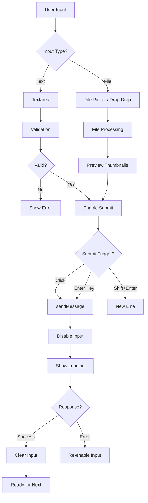

# Input Handling

## Introduction

The chat input is where conversations begin—it's the primary interaction point between users and your AI. A well-designed input system handles text entry, file attachments, keyboard shortcuts, and validation while providing clear feedback on submission status and constraints.

This lesson covers building complete chat input systems from basic text fields to multimodal attachment interfaces.

### What We'll Cover

| Topic | Description |
|-------|-------------|
| [Text Input Design](./01-text-input-design.md) | Styling, states, and accessibility |
| [Auto-Expanding Textarea](./02-auto-expanding-textarea.md) | Dynamic height adjustment |
| [Submit Button States](./03-submit-button-states.md) | Loading, disabled, and hover states |
| [Keyboard Shortcuts](./04-keyboard-shortcuts.md) | Enter to send, Shift+Enter for newline |
| [Input Validation](./05-input-validation.md) | Empty prevention and length limits |
| [Character/Token Counters](./06-character-token-counters.md) | Usage display and warnings |
| [File Attachment UI](./07-file-attachment-ui.md) | Multimodal file handling |
| [sendMessage Pattern](./08-sendmessage-pattern.md) | AI SDK 6 submission API |

### Prerequisites

- [Message Actions](../08-message-actions/00-message-actions.md)
- React form handling
- Basic CSS/Tailwind

---

## Input Flow Architecture



---

## Complete Input Component Overview

```tsx
import { useState, useRef, useCallback } from 'react';
import { useChat } from '@ai-sdk/react';
import { DefaultChatTransport } from 'ai';

function ChatInput() {
  const { sendMessage, status } = useChat({
    transport: new DefaultChatTransport({ api: '/api/chat' })
  });
  
  const [input, setInput] = useState('');
  const [files, setFiles] = useState<FileList | null>(null);
  const textareaRef = useRef<HTMLTextAreaElement>(null);
  const fileInputRef = useRef<HTMLInputElement>(null);
  
  const isProcessing = status === 'submitted' || status === 'streaming';
  const canSubmit = input.trim().length > 0 && !isProcessing;
  
  const handleSubmit = useCallback(() => {
    if (!canSubmit) return;
    
    sendMessage({
      text: input,
      files: files || undefined
    });
    
    setInput('');
    setFiles(null);
    if (fileInputRef.current) {
      fileInputRef.current.value = '';
    }
  }, [input, files, canSubmit, sendMessage]);
  
  const handleKeyDown = (e: React.KeyboardEvent) => {
    if (e.key === 'Enter' && !e.shiftKey) {
      e.preventDefault();
      handleSubmit();
    }
  };
  
  return (
    <div className="border-t p-4">
      {/* File previews */}
      {files && files.length > 0 && (
        <FilePreviewList files={files} onRemove={() => setFiles(null)} />
      )}
      
      {/* Input area */}
      <div className="flex items-end gap-2">
        {/* File attachment button */}
        <button
          onClick={() => fileInputRef.current?.click()}
          disabled={isProcessing}
          className="p-2 text-gray-500 hover:text-gray-700"
        >
          <PaperclipIcon className="w-5 h-5" />
        </button>
        <input
          ref={fileInputRef}
          type="file"
          multiple
          accept="image/*,text/*"
          onChange={e => setFiles(e.target.files)}
          className="hidden"
        />
        
        {/* Textarea */}
        <textarea
          ref={textareaRef}
          value={input}
          onChange={e => setInput(e.target.value)}
          onKeyDown={handleKeyDown}
          disabled={isProcessing}
          placeholder={isProcessing ? 'Waiting for response...' : 'Type a message...'}
          rows={1}
          className="flex-1 resize-none border rounded-lg px-4 py-2 focus:ring-2 focus:ring-blue-500"
        />
        
        {/* Submit button */}
        <button
          onClick={handleSubmit}
          disabled={!canSubmit}
          className={`
            p-2 rounded-lg transition-colors
            ${canSubmit 
              ? 'bg-blue-500 text-white hover:bg-blue-600' 
              : 'bg-gray-200 text-gray-400'
            }
          `}
        >
          {isProcessing ? (
            <LoadingSpinner className="w-5 h-5" />
          ) : (
            <SendIcon className="w-5 h-5" />
          )}
        </button>
      </div>
      
      {/* Character counter */}
      <div className="mt-1 text-right text-xs text-gray-400">
        {input.length} / 4000
      </div>
    </div>
  );
}
```

---

## Key Features

### Status-Based Behavior

| Status | Input State | Button State | Placeholder |
|--------|-------------|--------------|-------------|
| `ready` | Enabled | Enabled (if valid) | "Type a message..." |
| `submitted` | Disabled | Loading spinner | "Waiting for response..." |
| `streaming` | Disabled | Loading spinner | "Generating..." |
| `error` | Enabled | Enabled (retry) | "Try again..." |

### Input Validation Rules

| Rule | Validation | User Feedback |
|------|------------|---------------|
| Non-empty | `input.trim().length > 0` | Disable submit button |
| Max length | `input.length <= 4000` | Show warning at 90% |
| File types | `accept="image/*,text/*"` | Filter in picker |
| File size | Check `file.size` | Show error toast |

---

## Accessibility Requirements

| Feature | Implementation |
|---------|----------------|
| Label | `aria-label="Message input"` |
| Submit hint | `aria-describedby="submit-hint"` |
| Status | `aria-busy={isProcessing}` |
| File input | Visible label for screen readers |
| Focus management | Return focus after submit |

---

## Summary

The input handling system consists of:

✅ **Text input** with proper styling and states  
✅ **Auto-expanding** textarea for multi-line messages  
✅ **Submit button** with loading and disabled states  
✅ **Keyboard shortcuts** for efficient submission  
✅ **Validation** preventing invalid submissions  
✅ **Counters** showing usage limits  
✅ **File attachments** for multimodal input  
✅ **sendMessage API** for AI SDK integration

---

**Previous:** [Message Actions](../08-message-actions/00-message-actions.md)  
**Next:** [Text Input Design](./01-text-input-design.md)
