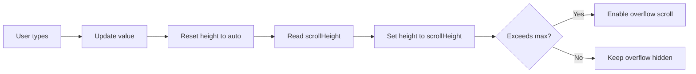

# Auto-Expanding Textarea

## Introduction

Chat inputs that grow as users type feel natural and modern. Unlike fixed-height textareas that force scrolling, auto-expanding inputs show all content while respecting maximum height limits.

In this lesson, we'll implement auto-expanding textareas using JavaScript's `scrollHeight` property and CSS constraints.

### What We'll Cover

- The `scrollHeight` technique
- Maximum height with scrolling
- CSS `resize` property
- Performance optimization
- Controlled vs uncontrolled approaches

### Prerequisites

- [Text Input Design](./01-text-input-design.md)
- React refs and useEffect
- Basic CSS

---

## How Auto-Expand Works



The key insight: set `height: auto` first, then read `scrollHeight`, then apply it.

---

## Basic Auto-Expanding Textarea

```tsx
function AutoExpandTextarea({ 
  value, 
  onChange 
}: { 
  value: string; 
  onChange: (value: string) => void;
}) {
  const textareaRef = useRef<HTMLTextAreaElement>(null);
  
  useEffect(() => {
    const textarea = textareaRef.current;
    if (!textarea) return;
    
    // Reset height to auto to get accurate scrollHeight
    textarea.style.height = 'auto';
    
    // Set to scrollHeight
    textarea.style.height = `${textarea.scrollHeight}px`;
  }, [value]);
  
  return (
    <textarea
      ref={textareaRef}
      value={value}
      onChange={e => onChange(e.target.value)}
      rows={1}
      className="resize-none overflow-hidden"
    />
  );
}
```

**Key points:**
- `rows={1}` sets minimum height
- `resize-none` prevents manual resizing
- `overflow-hidden` hides scrollbar during expansion

---

## Adding Maximum Height

```tsx
const MIN_HEIGHT = 40;  // px
const MAX_HEIGHT = 200; // px

function AutoExpandWithMax({ 
  value, 
  onChange,
  minHeight = MIN_HEIGHT,
  maxHeight = MAX_HEIGHT
}: { 
  value: string; 
  onChange: (value: string) => void;
  minHeight?: number;
  maxHeight?: number;
}) {
  const textareaRef = useRef<HTMLTextAreaElement>(null);
  
  useEffect(() => {
    const textarea = textareaRef.current;
    if (!textarea) return;
    
    // Reset to measure
    textarea.style.height = 'auto';
    
    // Calculate bounded height
    const scrollHeight = textarea.scrollHeight;
    const boundedHeight = Math.min(Math.max(scrollHeight, minHeight), maxHeight);
    
    textarea.style.height = `${boundedHeight}px`;
    
    // Toggle overflow based on content exceeding max
    textarea.style.overflowY = scrollHeight > maxHeight ? 'auto' : 'hidden';
  }, [value, minHeight, maxHeight]);
  
  return (
    <textarea
      ref={textareaRef}
      value={value}
      onChange={e => onChange(e.target.value)}
      rows={1}
      style={{ minHeight, maxHeight }}
      className="resize-none transition-height duration-100"
    />
  );
}
```

---

## Custom Hook for Auto-Expand

```tsx
function useAutoExpand(
  ref: RefObject<HTMLTextAreaElement>,
  value: string,
  options: {
    minHeight?: number;
    maxHeight?: number;
  } = {}
) {
  const { minHeight = 40, maxHeight = 300 } = options;
  
  useLayoutEffect(() => {
    const textarea = ref.current;
    if (!textarea) return;
    
    // Save scroll position
    const scrollTop = window.scrollY;
    
    // Measure
    textarea.style.height = 'auto';
    const scrollHeight = textarea.scrollHeight;
    const bounded = Math.min(Math.max(scrollHeight, minHeight), maxHeight);
    
    // Apply
    textarea.style.height = `${bounded}px`;
    textarea.style.overflowY = scrollHeight > maxHeight ? 'auto' : 'hidden';
    
    // Restore scroll (prevents page jump)
    window.scrollTo(0, scrollTop);
  }, [ref, value, minHeight, maxHeight]);
}

// Usage
function ChatInput() {
  const [value, setValue] = useState('');
  const textareaRef = useRef<HTMLTextAreaElement>(null);
  
  useAutoExpand(textareaRef, value, { maxHeight: 200 });
  
  return (
    <textarea
      ref={textareaRef}
      value={value}
      onChange={e => setValue(e.target.value)}
      rows={1}
      className="resize-none"
    />
  );
}
```

> **Note:** Using `useLayoutEffect` instead of `useEffect` prevents visual flicker during resize.

---

## CSS Resize Property

The `resize` property controls user-resizable behavior:

| Value | Behavior |
|-------|----------|
| `none` | Disable resizing completely |
| `vertical` | Allow vertical resize only |
| `horizontal` | Allow horizontal resize only |
| `both` | Allow resize in both directions |

```css
/* Disable resize for auto-expanding */
.auto-expand-textarea {
  resize: none;
}

/* Allow vertical resize for manual control */
.manual-resize-textarea {
  resize: vertical;
  min-height: 100px;
  max-height: 400px;
}
```

---

## Transition Animation

```tsx
function AnimatedAutoExpand({ value, onChange }: {
  value: string;
  onChange: (value: string) => void;
}) {
  const textareaRef = useRef<HTMLTextAreaElement>(null);
  const [height, setHeight] = useState<number | 'auto'>('auto');
  
  useLayoutEffect(() => {
    const textarea = textareaRef.current;
    if (!textarea) return;
    
    textarea.style.height = 'auto';
    const newHeight = Math.min(textarea.scrollHeight, 200);
    setHeight(newHeight);
  }, [value]);
  
  return (
    <textarea
      ref={textareaRef}
      value={value}
      onChange={e => onChange(e.target.value)}
      rows={1}
      style={{ height }}
      className="
        resize-none overflow-hidden
        transition-[height] duration-150 ease-out
      "
    />
  );
}
```

> **Tip:** Use `transition-[height]` (Tailwind) or `transition: height 150ms` (CSS) for smooth expansion.

---

## Shrink on Clear

```tsx
function ShrinkableTextarea({ value, onChange }: {
  value: string;
  onChange: (value: string) => void;
}) {
  const textareaRef = useRef<HTMLTextAreaElement>(null);
  const previousLength = useRef(value.length);
  
  useLayoutEffect(() => {
    const textarea = textareaRef.current;
    if (!textarea) return;
    
    const currentLength = value.length;
    const isDeleting = currentLength < previousLength.current;
    previousLength.current = currentLength;
    
    // Always recalculate (handles both grow and shrink)
    textarea.style.height = 'auto';
    const scrollHeight = textarea.scrollHeight;
    textarea.style.height = `${Math.min(scrollHeight, 200)}px`;
    
    // Smoother shrink animation
    if (isDeleting) {
      textarea.style.transition = 'height 100ms ease-out';
    } else {
      textarea.style.transition = 'height 50ms ease-out';
    }
  }, [value]);
  
  return (
    <textarea
      ref={textareaRef}
      value={value}
      onChange={e => onChange(e.target.value)}
      rows={1}
      className="resize-none overflow-hidden"
    />
  );
}
```

---

## Complete Auto-Expand Component

```tsx
interface AutoExpandTextareaProps {
  value: string;
  onChange: (value: string) => void;
  onSubmit?: () => void;
  placeholder?: string;
  disabled?: boolean;
  minHeight?: number;
  maxHeight?: number;
  className?: string;
}

function AutoExpandTextarea({
  value,
  onChange,
  onSubmit,
  placeholder = 'Type a message...',
  disabled = false,
  minHeight = 44,
  maxHeight = 200,
  className = ''
}: AutoExpandTextareaProps) {
  const textareaRef = useRef<HTMLTextAreaElement>(null);
  
  // Auto-expand logic
  useLayoutEffect(() => {
    const textarea = textareaRef.current;
    if (!textarea) return;
    
    // Measure without height constraint
    textarea.style.height = 'auto';
    
    // Calculate and apply bounded height
    const scrollHeight = textarea.scrollHeight;
    const bounded = Math.min(Math.max(scrollHeight, minHeight), maxHeight);
    
    textarea.style.height = `${bounded}px`;
    textarea.style.overflowY = scrollHeight > maxHeight ? 'auto' : 'hidden';
  }, [value, minHeight, maxHeight]);
  
  // Handle Enter key
  const handleKeyDown = (e: React.KeyboardEvent) => {
    if (e.key === 'Enter' && !e.shiftKey && onSubmit) {
      e.preventDefault();
      onSubmit();
    }
  };
  
  return (
    <textarea
      ref={textareaRef}
      value={value}
      onChange={e => onChange(e.target.value)}
      onKeyDown={handleKeyDown}
      placeholder={placeholder}
      disabled={disabled}
      rows={1}
      style={{ minHeight, maxHeight }}
      className={`
        w-full px-4 py-3
        rounded-xl border border-gray-200
        resize-none
        transition-colors duration-200
        
        focus:outline-none focus:ring-2 focus:ring-blue-500 focus:border-transparent
        
        disabled:bg-gray-100 disabled:cursor-not-allowed
        
        dark:bg-gray-800 dark:border-gray-700 dark:text-white
        dark:focus:ring-blue-400
        
        ${className}
      `}
      aria-label="Message input"
    />
  );
}
```

---

## Performance Considerations

### Avoiding Layout Thrashing

```tsx
// ❌ Multiple reads and writes cause reflows
function badAutoExpand(textarea: HTMLTextAreaElement) {
  textarea.style.height = 'auto';           // Write
  const height1 = textarea.scrollHeight;     // Read (reflow)
  textarea.style.height = `${height1}px`;    // Write
  const height2 = textarea.clientHeight;     // Read (reflow again!)
}

// ✅ Batch reads, then writes
function goodAutoExpand(textarea: HTMLTextAreaElement, maxHeight: number) {
  // Single read after height reset
  textarea.style.height = 'auto';
  const scrollHeight = textarea.scrollHeight;
  
  // Single write
  const bounded = Math.min(scrollHeight, maxHeight);
  textarea.style.height = `${bounded}px`;
  textarea.style.overflowY = scrollHeight > maxHeight ? 'auto' : 'hidden';
}
```

### Debouncing for Rapid Input

```tsx
function useDebouncedAutoExpand(
  ref: RefObject<HTMLTextAreaElement>,
  value: string,
  maxHeight = 200,
  delay = 16 // ~1 frame
) {
  useEffect(() => {
    const timeout = setTimeout(() => {
      const textarea = ref.current;
      if (!textarea) return;
      
      textarea.style.height = 'auto';
      textarea.style.height = `${Math.min(textarea.scrollHeight, maxHeight)}px`;
    }, delay);
    
    return () => clearTimeout(timeout);
  }, [ref, value, maxHeight, delay]);
}
```

---

## Best Practices

| ✅ Do | ❌ Don't |
|-------|---------|
| Use `useLayoutEffect` for resize | Use `useEffect` (causes flicker) |
| Set height to `auto` before measuring | Read scrollHeight without reset |
| Batch DOM reads and writes | Interleave reads and writes |
| Add `resize-none` class | Allow manual resize with auto-expand |
| Set reasonable max-height | Let input grow infinitely |
| Handle both grow and shrink | Only handle growth |

---

## Common Pitfalls

| ❌ Mistake | ✅ Solution |
|-----------|-------------|
| Textarea doesn't shrink | Always reset to `auto` first |
| Page jumps on resize | Save/restore `window.scrollY` |
| Visual flicker | Use `useLayoutEffect` |
| Horizontal scrollbar appears | Add `resize-none` |
| Slow on rapid typing | Debounce resize calculation |

---

## Hands-on Exercise

### Your Task

Build an auto-expanding chat input that:
1. Starts at 1 row (44px)
2. Expands as user types
3. Caps at 200px with scroll
4. Shrinks when content is deleted
5. Animates height changes

### Requirements

1. Use `scrollHeight` for measurement
2. Apply max-height constraint
3. Toggle overflow visibility
4. Add smooth transition

<details>
<summary>💡 Hints (click to expand)</summary>

- Reset height to `auto` before reading `scrollHeight`
- Use `useLayoutEffect` to avoid flicker
- Add `transition-[height] duration-150` for animation
- Set `overflowY` based on whether content exceeds max

</details>

---

## Summary

✅ **scrollHeight** measures full content height  
✅ **Reset to auto** before measuring  
✅ **useLayoutEffect** prevents flicker  
✅ **Max-height** with overflow scroll  
✅ **resize: none** disables manual resize  
✅ **Batch DOM operations** for performance

---

## Further Reading

- [MDN: Element.scrollHeight](https://developer.mozilla.org/en-US/docs/Web/API/Element/scrollHeight)
- [MDN: resize CSS property](https://developer.mozilla.org/en-US/docs/Web/CSS/resize)
- [Avoiding Layout Thrashing](https://web.dev/avoid-large-complex-layouts-and-layout-thrashing/)

---

**Previous:** [Text Input Design](./01-text-input-design.md)  
**Next:** [Submit Button States](./03-submit-button-states.md)

<!-- 
Sources Consulted:
- MDN scrollHeight: https://developer.mozilla.org/en-US/docs/Web/API/Element/scrollHeight
- MDN resize: https://developer.mozilla.org/en-US/docs/Web/CSS/resize
- web.dev layout thrashing: https://web.dev/avoid-large-complex-layouts-and-layout-thrashing/
-->
