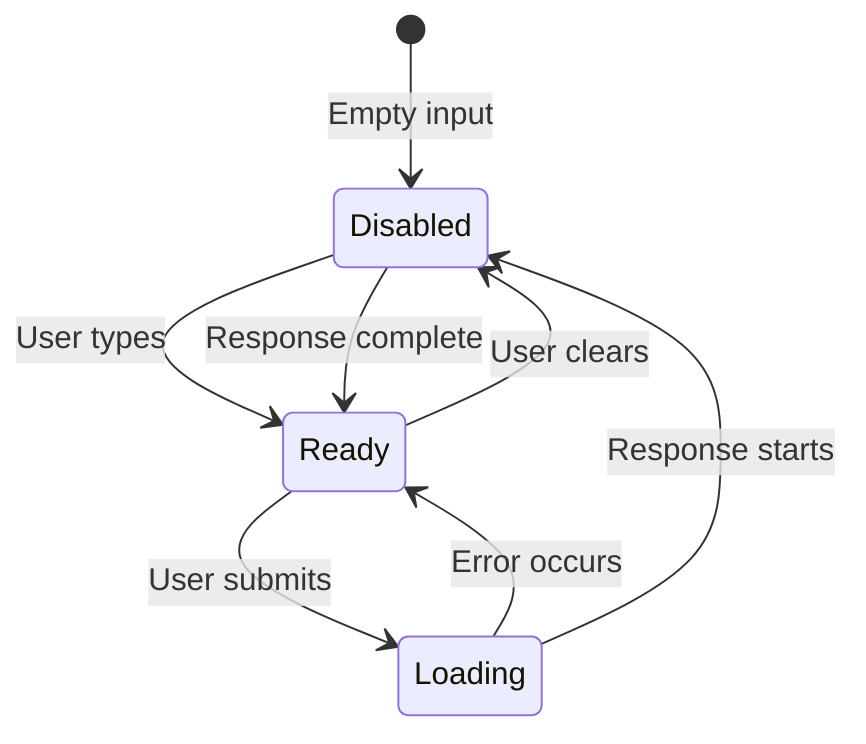

# Submit Button States

## Introduction

The submit button is the gateway between user input and AI response. Its visual state must clearly communicate what's happening: ready to send, processing, or blocked. Proper state management prevents double submissions and gives users confidence in the interface.

In this lesson, we'll build submit buttons that clearly indicate status and integrate with the AI SDK's chat lifecycle.

### What We'll Cover

- Button state machine (ready, disabled, loading)
- Visual indicators for each state
- Icons and loading spinners
- Button positioning within the input
- AI SDK status integration

### Prerequisites

- [Auto-Expanding Textarea](./02-auto-expanding-textarea.md)
- AI SDK `useChat` hook
- Tailwind CSS basics

---

## Button State Machine



| State | Visual | Behavior |
|-------|--------|----------|
| **Disabled** | Muted, no pointer | Click ignored, no submit |
| **Ready** | Bright, interactive | Click or Enter triggers send |
| **Loading** | Spinner, muted | Click ignored, processing |

---

## Basic Submit Button

```tsx
interface SubmitButtonProps {
  onClick: () => void;
  disabled: boolean;
  isLoading: boolean;
}

function SubmitButton({ onClick, disabled, isLoading }: SubmitButtonProps) {
  return (
    <button
      type="button"
      onClick={onClick}
      disabled={disabled || isLoading}
      className={`
        p-2 rounded-lg
        transition-all duration-200
        
        ${disabled || isLoading
          ? 'bg-gray-100 text-gray-400 cursor-not-allowed'
          : 'bg-blue-500 text-white hover:bg-blue-600 active:scale-95'
        }
      `}
      aria-label={isLoading ? 'Sending message' : 'Send message'}
      aria-disabled={disabled || isLoading}
    >
      {isLoading ? <LoadingSpinner /> : <SendIcon />}
    </button>
  );
}
```

---

## Icon Components

### Send Icon

```tsx
function SendIcon({ className = 'w-5 h-5' }: { className?: string }) {
  return (
    <svg
      className={className}
      viewBox="0 0 24 24"
      fill="none"
      stroke="currentColor"
      strokeWidth={2}
      strokeLinecap="round"
      strokeLinejoin="round"
    >
      <path d="M22 2L11 13" />
      <path d="M22 2L15 22L11 13L2 9L22 2Z" />
    </svg>
  );
}
```

### Loading Spinner

```tsx
function LoadingSpinner({ className = 'w-5 h-5' }: { className?: string }) {
  return (
    <svg
      className={`animate-spin ${className}`}
      viewBox="0 0 24 24"
      fill="none"
    >
      <circle
        className="opacity-25"
        cx="12"
        cy="12"
        r="10"
        stroke="currentColor"
        strokeWidth="4"
      />
      <path
        className="opacity-75"
        fill="currentColor"
        d="M4 12a8 8 0 018-8V0C5.373 0 0 5.373 0 12h4z"
      />
    </svg>
  );
}
```

### Stop Icon (for cancellation)

```tsx
function StopIcon({ className = 'w-5 h-5' }: { className?: string }) {
  return (
    <svg className={className} viewBox="0 0 24 24" fill="currentColor">
      <rect x="6" y="6" width="12" height="12" rx="2" />
    </svg>
  );
}
```

---

## AI SDK Status Integration

```tsx
import { useChat } from 'ai/react';

function ChatSubmitButton() {
  const { input, status, handleSubmit, stop } = useChat();
  
  const isEmpty = !input.trim();
  const isProcessing = status === 'submitted' || status === 'streaming';
  
  // Determine button action
  const handleClick = () => {
    if (isProcessing) {
      stop(); // Cancel the request
    } else {
      handleSubmit();
    }
  };
  
  return (
    <button
      type="button"
      onClick={handleClick}
      disabled={isEmpty && !isProcessing}
      className={`
        p-2.5 rounded-xl
        transition-all duration-200
        
        ${isEmpty && !isProcessing
          ? 'bg-gray-100 text-gray-400 cursor-not-allowed'
          : isProcessing
          ? 'bg-red-500 text-white hover:bg-red-600'
          : 'bg-blue-500 text-white hover:bg-blue-600 active:scale-95'
        }
      `}
      aria-label={
        isProcessing ? 'Stop generating' :
        isEmpty ? 'Type a message first' :
        'Send message'
      }
    >
      {isProcessing ? <StopIcon /> : isEmpty ? <SendIcon className="opacity-50" /> : <SendIcon />}
    </button>
  );
}
```

---

## Button Positioning

### Inside Input (Floating)

```tsx
function InputWithFloatingButton() {
  const { input, setInput, handleSubmit, status } = useChat();
  
  return (
    <div className="relative">
      <textarea
        value={input}
        onChange={e => setInput(e.target.value)}
        placeholder="Type a message..."
        className="
          w-full pr-14 py-3 px-4
          rounded-2xl border border-gray-200
          resize-none
        "
        rows={1}
      />
      
      {/* Floating button */}
      <button
        onClick={() => handleSubmit()}
        disabled={!input.trim()}
        className="
          absolute right-2 bottom-2
          p-2 rounded-lg
          bg-blue-500 text-white
          disabled:bg-gray-200 disabled:text-gray-400
          hover:bg-blue-600
          transition-colors
        "
      >
        <SendIcon />
      </button>
    </div>
  );
}
```

### Beside Input (External)

```tsx
function InputWithExternalButton() {
  const { input, setInput, handleSubmit, status } = useChat();
  
  return (
    <div className="flex gap-2 items-end">
      <textarea
        value={input}
        onChange={e => setInput(e.target.value)}
        placeholder="Type a message..."
        className="
          flex-1 py-3 px-4
          rounded-2xl border border-gray-200
          resize-none
        "
        rows={1}
      />
      
      <button
        onClick={() => handleSubmit()}
        disabled={!input.trim()}
        className="
          flex-shrink-0
          p-3 rounded-xl
          bg-blue-500 text-white
          disabled:bg-gray-200 disabled:text-gray-400
          hover:bg-blue-600
          transition-colors
        "
      >
        <SendIcon className="w-6 h-6" />
      </button>
    </div>
  );
}
```

---

## Complete Submit Button Component

```tsx
type ButtonStatus = 'idle' | 'ready' | 'loading' | 'streaming' | 'error';

interface ChatSubmitButtonProps {
  onClick: () => void;
  onStop?: () => void;
  isEmpty: boolean;
  status: 'ready' | 'submitted' | 'streaming' | 'error';
  className?: string;
}

function ChatSubmitButton({
  onClick,
  onStop,
  isEmpty,
  status,
  className = ''
}: ChatSubmitButtonProps) {
  const isProcessing = status === 'submitted' || status === 'streaming';
  const isDisabled = isEmpty && !isProcessing;
  
  const handleClick = () => {
    if (isProcessing && onStop) {
      onStop();
    } else if (!isDisabled) {
      onClick();
    }
  };
  
  // Determine visual state
  const getButtonStyles = () => {
    if (isProcessing) {
      return 'bg-red-500 hover:bg-red-600 text-white';
    }
    if (status === 'error') {
      return 'bg-red-500 hover:bg-red-600 text-white'; // Retry style
    }
    if (isEmpty) {
      return 'bg-gray-100 text-gray-400 cursor-not-allowed';
    }
    return 'bg-blue-500 hover:bg-blue-600 text-white active:scale-95';
  };
  
  const getIcon = () => {
    if (status === 'submitted') {
      return <LoadingSpinner />;
    }
    if (status === 'streaming') {
      return <StopIcon />;
    }
    if (status === 'error') {
      return <RefreshIcon />;
    }
    return <SendIcon />;
  };
  
  const getAriaLabel = () => {
    if (status === 'submitted') return 'Sending...';
    if (status === 'streaming') return 'Stop generating';
    if (status === 'error') return 'Retry';
    if (isEmpty) return 'Type a message first';
    return 'Send message';
  };
  
  return (
    <button
      type="button"
      onClick={handleClick}
      disabled={isDisabled}
      className={`
        p-2.5 rounded-xl
        transition-all duration-200
        focus:outline-none focus:ring-2 focus:ring-blue-500 focus:ring-offset-2
        ${getButtonStyles()}
        ${className}
      `}
      aria-label={getAriaLabel()}
      aria-disabled={isDisabled}
    >
      {getIcon()}
    </button>
  );
}

// Refresh icon for error state
function RefreshIcon({ className = 'w-5 h-5' }: { className?: string }) {
  return (
    <svg className={className} viewBox="0 0 24 24" fill="none" stroke="currentColor" strokeWidth={2}>
      <path d="M23 4v6h-6" />
      <path d="M1 20v-6h6" />
      <path d="M3.51 9a9 9 0 0114.85-3.36L23 10M1 14l4.64 4.36A9 9 0 0020.49 15" />
    </svg>
  );
}
```

---

## Visual State Reference

| Status | Background | Icon | Hover Effect | Cursor |
|--------|------------|------|--------------|--------|
| Empty | `gray-100` | Send (muted) | None | `not-allowed` |
| Ready | `blue-500` | Send | `blue-600` | `pointer` |
| Submitted | `gray-400` | Spinner | None | `wait` |
| Streaming | `red-500` | Stop | `red-600` | `pointer` |
| Error | `red-500` | Refresh | `red-600` | `pointer` |

---

## Animation Details

```css
/* Spinner animation */
@keyframes spin {
  from { transform: rotate(0deg); }
  to { transform: rotate(360deg); }
}

.animate-spin {
  animation: spin 1s linear infinite;
}

/* Button press effect */
.active\:scale-95:active {
  transform: scale(0.95);
}

/* Smooth transitions */
.transition-all {
  transition-property: all;
  transition-timing-function: cubic-bezier(0.4, 0, 0.2, 1);
  transition-duration: 200ms;
}
```

---

## Best Practices

| ✅ Do | ❌ Don't |
|-------|---------|
| Show loading state during submit | Let button look active while processing |
| Provide stop button during streaming | Force user to wait |
| Use clear visual hierarchy | Make disabled look like enabled |
| Add focus ring for keyboard users | Skip keyboard accessibility |
| Include aria-label | Rely on icon alone |
| Disable on empty input | Allow empty submissions |

---

## Common Pitfalls

| ❌ Mistake | ✅ Solution |
|-----------|-------------|
| Double click = double submit | Disable during processing |
| No visual loading feedback | Add spinner animation |
| Can't cancel long responses | Implement stop functionality |
| Button hidden on mobile keyboards | Keep button visible in viewport |
| No error recovery | Show retry option |

---

## Hands-on Exercise

### Your Task

Build a submit button that:
1. Shows send icon when ready
2. Shows spinner when submitted
3. Shows stop icon when streaming
4. Shows refresh icon on error
5. Is disabled when input is empty

### Requirements

1. Integrate with AI SDK status
2. Different colors for each state
3. Smooth transitions between states
4. Accessible labels for screen readers

<details>
<summary>💡 Hints (click to expand)</summary>

- Use `status` from `useChat()` to determine state
- Create separate icon components
- Use conditional classes for styling
- Add `aria-label` that changes with state

</details>

---

## Summary

✅ **State machine** governs button behavior  
✅ **Visual indicators** for each status  
✅ **Spinner** during submission  
✅ **Stop button** during streaming  
✅ **Disabled state** prevents empty sends  
✅ **Accessibility** via aria-labels

---

## Further Reading

- [AI SDK useChat Reference](https://ai-sdk.dev/docs/reference/ai-sdk-ui/use-chat)
- [MDN: button element](https://developer.mozilla.org/en-US/docs/Web/HTML/Element/button)
- [Heroicons](https://heroicons.com/) - Icon library

---

**Previous:** [Auto-Expanding Textarea](./02-auto-expanding-textarea.md)  
**Next:** [Keyboard Shortcuts](./04-keyboard-shortcuts.md)

<!-- 
Sources Consulted:
- AI SDK useChat: https://ai-sdk.dev/docs/reference/ai-sdk-ui/use-chat
- MDN button: https://developer.mozilla.org/en-US/docs/Web/HTML/Element/button
- Heroicons: https://heroicons.com/
-->
