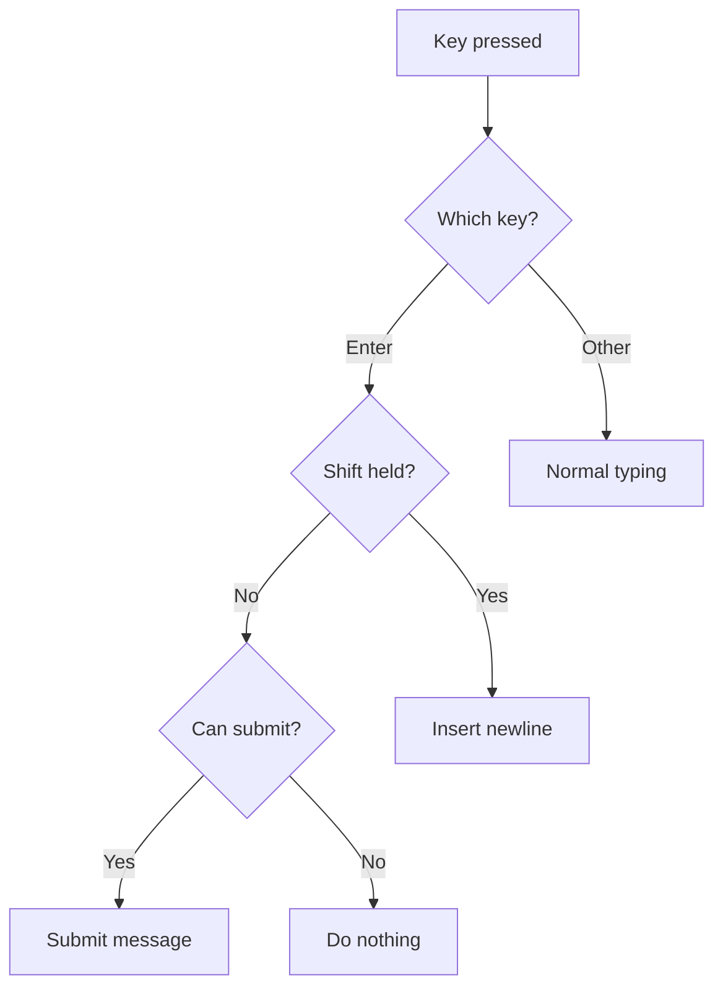

# Keyboard Shortcuts

## Introduction

Keyboard shortcuts make chat interfaces feel responsive and professional. The most important shortcut—Enter to send—must work reliably while still allowing multi-line input. Getting this balance right separates polished apps from frustrating ones.

In this lesson, we'll implement keyboard shortcuts that feel natural and are fully customizable.

### What We'll Cover

- Enter to send, Shift+Enter for newline
- Modifier key detection (Ctrl, Cmd, Alt)
- Customizable shortcut configuration
- Keyboard hints UI
- Platform-specific behavior
- Accessibility considerations

### Prerequisites

- [Submit Button States](./03-submit-button-states.md)
- React keyboard events
- JavaScript KeyboardEvent API

---

## Enter to Send Pattern



### Basic Implementation

```tsx
function ChatInput() {
  const { input, setInput, handleSubmit, status } = useChat();
  
  const canSubmit = input.trim().length > 0 && status === 'ready';
  
  const handleKeyDown = (e: React.KeyboardEvent<HTMLTextAreaElement>) => {
    // Enter without Shift = send
    if (e.key === 'Enter' && !e.shiftKey) {
      e.preventDefault(); // Prevent newline
      
      if (canSubmit) {
        handleSubmit();
      }
    }
    // Shift+Enter = newline (default behavior, no action needed)
  };
  
  return (
    <textarea
      value={input}
      onChange={e => setInput(e.target.value)}
      onKeyDown={handleKeyDown}
      placeholder="Press Enter to send, Shift+Enter for new line"
    />
  );
}
```

---

## Modifier Key Detection

```tsx
interface KeyModifiers {
  shift: boolean;
  ctrl: boolean;
  alt: boolean;
  meta: boolean; // Cmd on Mac, Windows key on Windows
}

function getModifiers(e: KeyboardEvent | React.KeyboardEvent): KeyModifiers {
  return {
    shift: e.shiftKey,
    ctrl: e.ctrlKey,
    alt: e.altKey,
    meta: e.metaKey
  };
}

// Platform-aware Ctrl/Cmd check
function isPlatformMod(e: KeyboardEvent | React.KeyboardEvent): boolean {
  const isMac = navigator.platform.toUpperCase().indexOf('MAC') >= 0;
  return isMac ? e.metaKey : e.ctrlKey;
}
```

---

## Customizable Shortcuts

```tsx
type SubmitMode = 'enter' | 'ctrl-enter' | 'cmd-enter';

interface ShortcutConfig {
  submit: SubmitMode;
  newline: 'shift-enter' | 'enter';
}

const DEFAULT_CONFIG: ShortcutConfig = {
  submit: 'enter',
  newline: 'shift-enter'
};

function useKeyboardShortcuts(config: ShortcutConfig = DEFAULT_CONFIG) {
  const shouldSubmit = useCallback((e: React.KeyboardEvent): boolean => {
    if (e.key !== 'Enter') return false;
    
    switch (config.submit) {
      case 'enter':
        return !e.shiftKey && !e.ctrlKey && !e.metaKey;
      case 'ctrl-enter':
        return e.ctrlKey && !e.metaKey;
      case 'cmd-enter':
        return e.metaKey && !e.ctrlKey;
      default:
        return false;
    }
  }, [config.submit]);
  
  const shouldNewline = useCallback((e: React.KeyboardEvent): boolean => {
    if (e.key !== 'Enter') return false;
    
    switch (config.newline) {
      case 'shift-enter':
        return e.shiftKey;
      case 'enter':
        // Only if submit is not 'enter'
        return config.submit !== 'enter' && !e.shiftKey && !e.ctrlKey && !e.metaKey;
      default:
        return false;
    }
  }, [config.newline, config.submit]);
  
  return { shouldSubmit, shouldNewline };
}
```

### Usage

```tsx
function CustomizableInput() {
  const { input, setInput, handleSubmit } = useChat();
  const [config] = useState<ShortcutConfig>({ 
    submit: 'ctrl-enter', 
    newline: 'enter' 
  });
  
  const { shouldSubmit, shouldNewline } = useKeyboardShortcuts(config);
  
  const handleKeyDown = (e: React.KeyboardEvent<HTMLTextAreaElement>) => {
    if (shouldSubmit(e)) {
      e.preventDefault();
      handleSubmit();
    }
    // Newlines are handled by default behavior
  };
  
  return (
    <textarea
      value={input}
      onChange={e => setInput(e.target.value)}
      onKeyDown={handleKeyDown}
    />
  );
}
```

---

## Global Keyboard Shortcuts

```tsx
function useGlobalShortcuts(
  inputRef: RefObject<HTMLTextAreaElement>,
  onSubmit: () => void,
  onStop: () => void
) {
  useEffect(() => {
    const handleGlobalKeyDown = (e: KeyboardEvent) => {
      // Cmd/Ctrl + / to focus input
      if (isPlatformMod(e) && e.key === '/') {
        e.preventDefault();
        inputRef.current?.focus();
      }
      
      // Escape to stop generation
      if (e.key === 'Escape') {
        onStop();
      }
      
      // Cmd/Ctrl + Enter from anywhere to submit
      if (isPlatformMod(e) && e.key === 'Enter') {
        e.preventDefault();
        onSubmit();
      }
    };
    
    window.addEventListener('keydown', handleGlobalKeyDown);
    return () => window.removeEventListener('keydown', handleGlobalKeyDown);
  }, [inputRef, onSubmit, onStop]);
}
```

---

## Keyboard Hints UI

```tsx
interface ShortcutHintProps {
  submitMode: SubmitMode;
}

function ShortcutHint({ submitMode }: ShortcutHintProps) {
  const isMac = navigator.platform.toUpperCase().indexOf('MAC') >= 0;
  
  const getSubmitHint = () => {
    switch (submitMode) {
      case 'enter':
        return 'Enter';
      case 'ctrl-enter':
        return isMac ? '⌃↵' : 'Ctrl+Enter';
      case 'cmd-enter':
        return isMac ? '⌘↵' : 'Ctrl+Enter';
    }
  };
  
  const getNewlineHint = () => {
    if (submitMode === 'enter') {
      return isMac ? '⇧↵' : 'Shift+Enter';
    }
    return 'Enter';
  };
  
  return (
    <div className="flex gap-4 text-xs text-gray-400">
      <span>
        <kbd className="px-1.5 py-0.5 bg-gray-100 rounded text-gray-600">
          {getSubmitHint()}
        </kbd>
        {' '}to send
      </span>
      <span>
        <kbd className="px-1.5 py-0.5 bg-gray-100 rounded text-gray-600">
          {getNewlineHint()}
        </kbd>
        {' '}for new line
      </span>
    </div>
  );
}
```

### Styled Keyboard Key

```tsx
function Kbd({ children }: { children: React.ReactNode }) {
  return (
    <kbd className="
      inline-flex items-center justify-center
      px-1.5 py-0.5 min-w-[1.5rem]
      text-xs font-mono
      bg-gray-100 dark:bg-gray-700
      text-gray-600 dark:text-gray-300
      border border-gray-200 dark:border-gray-600
      rounded shadow-sm
    ">
      {children}
    </kbd>
  );
}

// Usage
<Kbd>⌘</Kbd><Kbd>Enter</Kbd>
```

---

## Complete Keyboard Handler

```tsx
interface KeyboardConfig {
  submitMode: SubmitMode;
  globalShortcuts: boolean;
}

function ChatInputWithKeyboard({
  config = { submitMode: 'enter', globalShortcuts: true }
}: {
  config?: KeyboardConfig;
}) {
  const { input, setInput, handleSubmit, status, stop } = useChat();
  const textareaRef = useRef<HTMLTextAreaElement>(null);
  
  const { shouldSubmit } = useKeyboardShortcuts({ 
    submit: config.submitMode, 
    newline: 'shift-enter' 
  });
  
  const canSubmit = input.trim().length > 0 && status === 'ready';
  const isProcessing = status === 'submitted' || status === 'streaming';
  
  // Local keyboard handling
  const handleKeyDown = (e: React.KeyboardEvent<HTMLTextAreaElement>) => {
    if (shouldSubmit(e) && canSubmit) {
      e.preventDefault();
      handleSubmit();
    }
  };
  
  // Global shortcuts
  useEffect(() => {
    if (!config.globalShortcuts) return;
    
    const handleGlobalKey = (e: KeyboardEvent) => {
      // Escape to stop
      if (e.key === 'Escape' && isProcessing) {
        stop();
        return;
      }
      
      // Cmd/Ctrl + / to focus
      if (isPlatformMod(e) && e.key === '/') {
        e.preventDefault();
        textareaRef.current?.focus();
      }
    };
    
    window.addEventListener('keydown', handleGlobalKey);
    return () => window.removeEventListener('keydown', handleGlobalKey);
  }, [config.globalShortcuts, isProcessing, stop]);
  
  return (
    <div className="space-y-2">
      <textarea
        ref={textareaRef}
        value={input}
        onChange={e => setInput(e.target.value)}
        onKeyDown={handleKeyDown}
        disabled={isProcessing}
        placeholder="Type your message..."
        className="w-full p-3 rounded-lg border"
        rows={1}
      />
      <ShortcutHint submitMode={config.submitMode} />
    </div>
  );
}
```

---

## IME Handling (International Input)

```tsx
function IMEAwareInput() {
  const { input, setInput, handleSubmit } = useChat();
  const [isComposing, setIsComposing] = useState(false);
  
  const handleKeyDown = (e: React.KeyboardEvent<HTMLTextAreaElement>) => {
    // Don't submit during IME composition (e.g., typing Japanese)
    if (isComposing) return;
    
    if (e.key === 'Enter' && !e.shiftKey) {
      e.preventDefault();
      handleSubmit();
    }
  };
  
  return (
    <textarea
      value={input}
      onChange={e => setInput(e.target.value)}
      onKeyDown={handleKeyDown}
      onCompositionStart={() => setIsComposing(true)}
      onCompositionEnd={() => setIsComposing(false)}
    />
  );
}
```

> **Important:** Without IME handling, pressing Enter to select a character in Japanese/Chinese input would also submit the message.

---

## Settings UI for Shortcuts

```tsx
function ShortcutSettings() {
  const [submitMode, setSubmitMode] = useState<SubmitMode>('enter');
  
  return (
    <div className="space-y-4">
      <label className="block">
        <span className="text-sm font-medium text-gray-700">
          Send message with:
        </span>
        <select
          value={submitMode}
          onChange={e => setSubmitMode(e.target.value as SubmitMode)}
          className="mt-1 block w-full rounded-md border-gray-300 shadow-sm"
        >
          <option value="enter">Enter (Shift+Enter for new line)</option>
          <option value="ctrl-enter">Ctrl+Enter (Enter for new line)</option>
          <option value="cmd-enter">Cmd+Enter (Enter for new line)</option>
        </select>
      </label>
      
      <div className="p-3 bg-gray-50 rounded-lg">
        <p className="text-sm text-gray-600">
          Current shortcuts:
        </p>
        <ShortcutHint submitMode={submitMode} />
      </div>
    </div>
  );
}
```

---

## Best Practices

| ✅ Do | ❌ Don't |
|-------|---------|
| Handle IME composition | Submit during IME input |
| Show keyboard hints | Assume users know shortcuts |
| Make shortcuts configurable | Force one shortcut style |
| Use `e.preventDefault()` | Allow form submission |
| Support both Mac and Windows | Hard-code Ctrl or Cmd |
| Provide Escape to cancel | Trap users in processing |

---

## Common Pitfalls

| ❌ Mistake | ✅ Solution |
|-----------|-------------|
| Enter submits during IME | Check `isComposing` state |
| No way to type newlines | Support Shift+Enter |
| Wrong modifier on Mac | Use `isPlatformMod()` helper |
| Shortcuts conflict | Check for conflicting browser shortcuts |
| No visual hint | Show keyboard shortcut in UI |

---

## Shortcut Reference

| Shortcut | Action |
|----------|--------|
| `Enter` | Send message (default mode) |
| `Shift+Enter` | New line (default mode) |
| `Ctrl+Enter` / `⌘+Enter` | Send (alternative mode) |
| `Escape` | Stop generation |
| `Ctrl+/` / `⌘+/` | Focus input |

---

## Hands-on Exercise

### Your Task

Build a chat input with:
1. Configurable submit shortcut (Enter or Ctrl+Enter)
2. Visual hint showing current shortcuts
3. IME-aware (don't submit during composition)
4. Global Escape to stop generation
5. Settings panel to change shortcut preference

### Requirements

1. Toggle between Enter and Ctrl+Enter modes
2. Hints update to reflect current mode
3. Test with IME input (or composition events)
4. Persist preference to localStorage

<details>
<summary>💡 Hints (click to expand)</summary>

- Use `onCompositionStart/End` for IME detection
- Store preference with `localStorage.setItem`
- Create reusable `useKeyboardShortcuts` hook
- Platform detection: `navigator.platform.includes('Mac')`

</details>

---

## Summary

✅ **Enter to send** is the expected default  
✅ **Shift+Enter** for newlines  
✅ **Configurable** for user preference  
✅ **IME-aware** for international users  
✅ **Visual hints** improve discoverability  
✅ **Global shortcuts** for power users

---

## Further Reading

- [MDN: KeyboardEvent](https://developer.mozilla.org/en-US/docs/Web/API/KeyboardEvent)
- [MDN: Composition Events](https://developer.mozilla.org/en-US/docs/Web/API/CompositionEvent)
- [React Keyboard Events](https://react.dev/reference/react-dom/components/common#handling-keyboard-events)

---

**Previous:** [Submit Button States](./03-submit-button-states.md)  
**Next:** [Input Validation](./05-input-validation.md)

<!-- 
Sources Consulted:
- MDN KeyboardEvent: https://developer.mozilla.org/en-US/docs/Web/API/KeyboardEvent
- MDN CompositionEvent: https://developer.mozilla.org/en-US/docs/Web/API/CompositionEvent
- React events: https://react.dev/reference/react-dom/components/common
-->
