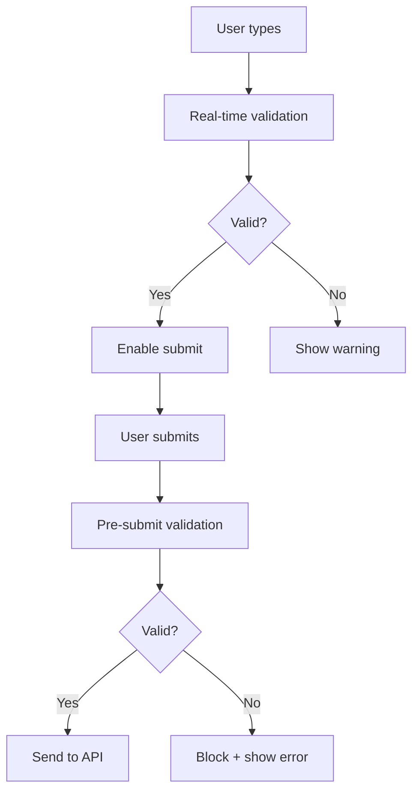

# Input Validation

## Introduction

Validation prevents empty messages, oversized inputs, and inappropriate content from reaching your AI backend. Proper validation happens at both the UI layer (immediate feedback) and before submission (final check).

In this lesson, we'll implement comprehensive input validation with clear error messaging.

### What We'll Cover

- Empty input prevention
- Maximum length enforcement
- Real-time validation feedback
- Content filtering patterns
- Error message display
- Validation with submit blocking

### Prerequisites

- [Keyboard Shortcuts](./04-keyboard-shortcuts.md)
- React form patterns
- AI SDK useChat hook

---

## Validation Strategy



---

## Empty Input Prevention

```tsx
function useEmptyValidation(input: string) {
  const isEmpty = input.trim().length === 0;
  const isWhitespaceOnly = input.length > 0 && isEmpty;
  
  return {
    isValid: !isEmpty,
    isEmpty,
    isWhitespaceOnly,
    error: isWhitespaceOnly 
      ? 'Message cannot be only whitespace' 
      : isEmpty 
      ? 'Please enter a message' 
      : null
  };
}

// Usage
function ChatInput() {
  const { input, handleSubmit } = useChat();
  const { isValid, error } = useEmptyValidation(input);
  
  const onSubmit = () => {
    if (!isValid) return;
    handleSubmit();
  };
  
  return (
    <div>
      <textarea value={input} onChange={...} />
      <button disabled={!isValid} onClick={onSubmit}>Send</button>
      {error && <p className="text-red-500 text-sm">{error}</p>}
    </div>
  );
}
```

---

## Maximum Length Enforcement

```tsx
interface LengthValidation {
  isValid: boolean;
  isNearLimit: boolean;
  isOverLimit: boolean;
  remaining: number;
  error: string | null;
}

function useLengthValidation(
  input: string, 
  maxLength: number,
  warningThreshold = 0.9
): LengthValidation {
  const length = input.length;
  const remaining = maxLength - length;
  const warningAt = maxLength * warningThreshold;
  
  return {
    isValid: length <= maxLength,
    isNearLimit: length >= warningAt && length <= maxLength,
    isOverLimit: length > maxLength,
    remaining,
    error: length > maxLength 
      ? `Message exceeds ${maxLength.toLocaleString()} characters by ${(length - maxLength).toLocaleString()}` 
      : null
  };
}

// Usage
function ChatInputWithLength() {
  const { input, setInput } = useChat();
  const maxLength = 4000;
  const { isValid, isNearLimit, isOverLimit, remaining, error } = 
    useLengthValidation(input, maxLength);
  
  return (
    <div className="relative">
      <textarea
        value={input}
        onChange={e => setInput(e.target.value)}
        maxLength={maxLength + 100} // Allow slight overflow for display
        className={isOverLimit ? 'border-red-500' : ''}
        aria-invalid={isOverLimit}
      />
      
      {/* Character counter */}
      <span className={`
        absolute bottom-2 right-2 text-xs
        ${isOverLimit ? 'text-red-500 font-medium' : 
          isNearLimit ? 'text-yellow-600' : 'text-gray-400'}
      `}>
        {input.length.toLocaleString()} / {maxLength.toLocaleString()}
      </span>
      
      {error && (
        <p className="mt-1 text-sm text-red-500" role="alert">
          {error}
        </p>
      )}
    </div>
  );
}
```

---

## Combined Validation Hook

```tsx
interface ValidationResult {
  isValid: boolean;
  errors: string[];
  warnings: string[];
}

interface ValidationOptions {
  maxLength?: number;
  minLength?: number;
  required?: boolean;
  patterns?: Array<{
    regex: RegExp;
    message: string;
    type: 'error' | 'warning';
  }>;
}

function useInputValidation(
  input: string,
  options: ValidationOptions = {}
): ValidationResult {
  const {
    maxLength = 4000,
    minLength = 0,
    required = true,
    patterns = []
  } = options;
  
  const errors: string[] = [];
  const warnings: string[] = [];
  
  const trimmed = input.trim();
  
  // Required check
  if (required && trimmed.length === 0) {
    errors.push('Message is required');
  }
  
  // Min length
  if (minLength > 0 && trimmed.length < minLength && trimmed.length > 0) {
    errors.push(`Message must be at least ${minLength} characters`);
  }
  
  // Max length
  if (input.length > maxLength) {
    errors.push(`Message exceeds ${maxLength.toLocaleString()} character limit`);
  } else if (input.length > maxLength * 0.9) {
    warnings.push(`Approaching ${maxLength.toLocaleString()} character limit`);
  }
  
  // Pattern checks
  for (const pattern of patterns) {
    if (pattern.regex.test(input)) {
      if (pattern.type === 'error') {
        errors.push(pattern.message);
      } else {
        warnings.push(pattern.message);
      }
    }
  }
  
  return {
    isValid: errors.length === 0,
    errors,
    warnings
  };
}
```

### Usage with Patterns

```tsx
const VALIDATION_PATTERNS = [
  {
    regex: /<script/i,
    message: 'Script tags are not allowed',
    type: 'error' as const
  },
  {
    regex: /\b(password|secret|api.?key)\b/i,
    message: 'Consider removing sensitive information',
    type: 'warning' as const
  }
];

function ValidatedInput() {
  const { input, setInput, handleSubmit } = useChat();
  
  const { isValid, errors, warnings } = useInputValidation(input, {
    maxLength: 4000,
    required: true,
    patterns: VALIDATION_PATTERNS
  });
  
  return (
    <div>
      <textarea 
        value={input} 
        onChange={e => setInput(e.target.value)}
        aria-invalid={!isValid}
        aria-describedby="validation-messages"
      />
      
      <div id="validation-messages">
        {errors.map((error, i) => (
          <p key={i} className="text-red-500 text-sm" role="alert">
            ❌ {error}
          </p>
        ))}
        {warnings.map((warning, i) => (
          <p key={i} className="text-yellow-600 text-sm">
            ⚠️ {warning}
          </p>
        ))}
      </div>
      
      <button disabled={!isValid} onClick={() => handleSubmit()}>
        Send
      </button>
    </div>
  );
}
```

---

## Real-time vs Submit-time Validation

```tsx
type ValidationTiming = 'realtime' | 'blur' | 'submit';

function useTimedValidation(
  input: string,
  options: ValidationOptions,
  timing: ValidationTiming = 'realtime'
) {
  const [touched, setTouched] = useState(false);
  const [submitted, setSubmitted] = useState(false);
  
  const validation = useInputValidation(input, options);
  
  // Determine what to show based on timing
  const shouldShowErrors = 
    timing === 'realtime' ||
    (timing === 'blur' && touched) ||
    (timing === 'submit' && submitted);
  
  return {
    ...validation,
    displayErrors: shouldShowErrors ? validation.errors : [],
    displayWarnings: shouldShowErrors ? validation.warnings : [],
    onBlur: () => setTouched(true),
    onSubmit: () => setSubmitted(true),
    reset: () => {
      setTouched(false);
      setSubmitted(false);
    }
  };
}
```

---

## Error Message Component

```tsx
interface ValidationMessagesProps {
  errors: string[];
  warnings: string[];
  className?: string;
}

function ValidationMessages({ 
  errors, 
  warnings, 
  className = '' 
}: ValidationMessagesProps) {
  if (errors.length === 0 && warnings.length === 0) {
    return null;
  }
  
  return (
    <div className={`space-y-1 ${className}`} role="alert" aria-live="polite">
      {errors.map((error, i) => (
        <div 
          key={`error-${i}`}
          className="flex items-center gap-1.5 text-sm text-red-600"
        >
          <span className="flex-shrink-0">❌</span>
          <span>{error}</span>
        </div>
      ))}
      
      {warnings.map((warning, i) => (
        <div 
          key={`warning-${i}`}
          className="flex items-center gap-1.5 text-sm text-yellow-600"
        >
          <span className="flex-shrink-0">⚠️</span>
          <span>{warning}</span>
        </div>
      ))}
    </div>
  );
}
```

---

## Content Filtering

```tsx
const CONTENT_FILTERS = {
  // Security patterns
  scriptTags: /<script[\s>]/i,
  sqlInjection: /(\b(SELECT|INSERT|UPDATE|DELETE|DROP|UNION)\b.*\b(FROM|INTO|WHERE)\b)/i,
  
  // Sensitive data patterns
  emailAddress: /\b[A-Za-z0-9._%+-]+@[A-Za-z0-9.-]+\.[A-Z|a-z]{2,}\b/,
  phoneNumber: /\b\d{3}[-.]?\d{3}[-.]?\d{4}\b/,
  creditCard: /\b\d{4}[-\s]?\d{4}[-\s]?\d{4}[-\s]?\d{4}\b/,
  ssn: /\b\d{3}-\d{2}-\d{4}\b/,
  
  // Content quality
  allCaps: /^[A-Z\s!?]+$/,
  repeatedChars: /(.)\1{4,}/
};

function useContentFiltering(input: string) {
  const issues: Array<{ type: 'error' | 'warning'; message: string }> = [];
  
  // Security checks (errors)
  if (CONTENT_FILTERS.scriptTags.test(input)) {
    issues.push({ type: 'error', message: 'Script content is not allowed' });
  }
  
  // Sensitive data checks (warnings)
  if (CONTENT_FILTERS.creditCard.test(input)) {
    issues.push({ 
      type: 'warning', 
      message: 'Message may contain credit card information' 
    });
  }
  
  if (CONTENT_FILTERS.ssn.test(input)) {
    issues.push({ 
      type: 'warning', 
      message: 'Message may contain sensitive personal information' 
    });
  }
  
  // Quality checks (warnings)
  if (input.length > 20 && CONTENT_FILTERS.allCaps.test(input)) {
    issues.push({ 
      type: 'warning', 
      message: 'Consider using normal capitalization' 
    });
  }
  
  return {
    hasErrors: issues.some(i => i.type === 'error'),
    hasWarnings: issues.some(i => i.type === 'warning'),
    issues
  };
}
```

---

## Complete Validated Input

```tsx
interface ValidatedChatInputProps {
  maxLength?: number;
  onSubmit: (message: string) => void;
  disabled?: boolean;
}

function ValidatedChatInput({
  maxLength = 4000,
  onSubmit,
  disabled = false
}: ValidatedChatInputProps) {
  const [input, setInput] = useState('');
  
  // Validation
  const lengthValidation = useLengthValidation(input, maxLength);
  const emptyValidation = useEmptyValidation(input);
  const contentFiltering = useContentFiltering(input);
  
  // Combined status
  const canSubmit = 
    emptyValidation.isValid && 
    lengthValidation.isValid && 
    !contentFiltering.hasErrors &&
    !disabled;
  
  // All messages
  const errors = [
    ...(!emptyValidation.isValid && input ? [emptyValidation.error!] : []),
    ...(lengthValidation.error ? [lengthValidation.error] : []),
    ...contentFiltering.issues.filter(i => i.type === 'error').map(i => i.message)
  ];
  
  const warnings = [
    ...contentFiltering.issues.filter(i => i.type === 'warning').map(i => i.message)
  ];
  
  const handleSubmit = () => {
    if (!canSubmit) return;
    onSubmit(input.trim());
    setInput('');
  };
  
  const handleKeyDown = (e: React.KeyboardEvent) => {
    if (e.key === 'Enter' && !e.shiftKey && canSubmit) {
      e.preventDefault();
      handleSubmit();
    }
  };
  
  return (
    <div className="space-y-2">
      <div className="relative">
        <textarea
          value={input}
          onChange={e => setInput(e.target.value)}
          onKeyDown={handleKeyDown}
          disabled={disabled}
          placeholder="Type a message..."
          rows={1}
          className={`
            w-full px-4 py-3 pr-20 rounded-xl border-2
            resize-none
            transition-colors
            ${errors.length > 0 
              ? 'border-red-300 focus:border-red-500' 
              : 'border-gray-200 focus:border-blue-500'
            }
            focus:outline-none focus:ring-2
            ${errors.length > 0 ? 'focus:ring-red-200' : 'focus:ring-blue-200'}
          `}
          aria-invalid={errors.length > 0}
          aria-describedby="input-validation"
        />
        
        {/* Character counter */}
        <span className={`
          absolute bottom-3 right-14 text-xs
          ${lengthValidation.isOverLimit ? 'text-red-500 font-medium' : 
            lengthValidation.isNearLimit ? 'text-yellow-600' : 'text-gray-400'}
        `}>
          {input.length.toLocaleString()}
        </span>
        
        {/* Submit button */}
        <button
          onClick={handleSubmit}
          disabled={!canSubmit}
          className="
            absolute right-2 bottom-2
            p-2 rounded-lg
            bg-blue-500 text-white
            disabled:bg-gray-200 disabled:text-gray-400
            hover:bg-blue-600
            transition-colors
          "
          aria-label="Send message"
        >
          <SendIcon />
        </button>
      </div>
      
      {/* Validation messages */}
      <div id="input-validation">
        <ValidationMessages errors={errors} warnings={warnings} />
      </div>
    </div>
  );
}
```

---

## Best Practices

| ✅ Do | ❌ Don't |
|-------|---------|
| Validate in real-time for length | Wait until submit to show length errors |
| Show warnings, not just errors | Block on every possible issue |
| Use aria-invalid and aria-describedby | Rely on color alone for errors |
| Provide specific error messages | Use generic "Invalid input" |
| Allow slight overflow for UX | Hard-block at exact limit |
| Trim whitespace before checking empty | Consider whitespace-only as valid |

---

## Common Pitfalls

| ❌ Mistake | ✅ Solution |
|-----------|-------------|
| Blocking on sensitive data warnings | Warn but allow user to proceed |
| No character count display | Show count near limit |
| Errors disappear on focus | Keep errors visible until fixed |
| No error for empty submit | Show error and re-focus input |
| Over-aggressive filtering | Balance security with usability |

---

## Hands-on Exercise

### Your Task

Build a validated chat input with:
1. Empty input prevention
2. 4000 character limit with counter
3. Warning at 90% of limit
4. Sensitive data detection (email, phone)
5. Clear error messages

### Requirements

1. Real-time character count
2. Counter changes color approaching limit
3. Submit blocked on validation errors
4. Warnings allow submission but notify user
5. Accessible error messages

<details>
<summary>💡 Hints (click to expand)</summary>

- Separate validation logic into hooks
- Use `aria-live="polite"` for dynamic errors
- Add `aria-invalid` to textarea
- Use regex for pattern matching
- Allow warning dismissal

</details>

---

## Summary

✅ **Empty prevention** with trimmed check  
✅ **Length limits** with real-time counter  
✅ **Content filtering** for security  
✅ **Error vs warning** distinction  
✅ **Accessible** error messaging  
✅ **Submit blocking** on errors only

---

## Further Reading

- [MDN: Client-side form validation](https://developer.mozilla.org/en-US/docs/Learn/Forms/Form_validation)
- [ARIA: aria-invalid](https://developer.mozilla.org/en-US/docs/Web/Accessibility/ARIA/Attributes/aria-invalid)
- [React Hook Form](https://react-hook-form.com/) - Advanced form validation

---

**Previous:** [Keyboard Shortcuts](./04-keyboard-shortcuts.md)  
**Next:** [Character & Token Counters](./06-character-token-counters.md)

<!-- 
Sources Consulted:
- MDN form validation: https://developer.mozilla.org/en-US/docs/Learn/Forms/Form_validation
- MDN aria-invalid: https://developer.mozilla.org/en-US/docs/Web/Accessibility/ARIA/Attributes/aria-invalid
- OWASP input validation: https://cheatsheetseries.owasp.org/cheatsheets/Input_Validation_Cheat_Sheet.html
-->
