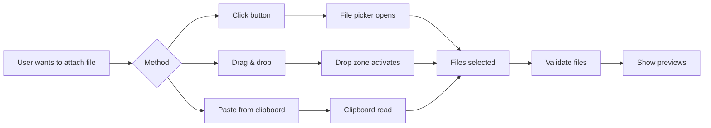

# File Attachment UI

## Introduction

Modern AI models accept images, documents, and other files alongside text. Building a polished file attachment experience requires handling file selection, drag-and-drop, previews, validation, and upload progress. The AI SDK makes sending files straightforward—the UI is where complexity lives.

In this lesson, we'll build a complete file attachment interface for multimodal chat.

### What We'll Cover

- File picker integration
- Drag-and-drop zones
- File type validation
- Image thumbnails and previews
- File list management
- Upload progress indicators
- AI SDK file handling

### Prerequisites

- [Character & Token Counters](./06-character-token-counters.md)
- Browser File API
- AI SDK 6 sendMessage API

---

## File Selection Methods



---

## File Picker Button

```tsx
interface FilePickerProps {
  onFilesSelected: (files: FileList) => void;
  accept?: string;
  multiple?: boolean;
  disabled?: boolean;
}

function FilePicker({
  onFilesSelected,
  accept = 'image/*,text/*,.pdf',
  multiple = true,
  disabled = false
}: FilePickerProps) {
  const inputRef = useRef<HTMLInputElement>(null);
  
  const handleClick = () => {
    inputRef.current?.click();
  };
  
  const handleChange = (e: React.ChangeEvent<HTMLInputElement>) => {
    const files = e.target.files;
    if (files && files.length > 0) {
      onFilesSelected(files);
    }
    // Reset for re-selecting same file
    e.target.value = '';
  };
  
  return (
    <>
      <input
        ref={inputRef}
        type="file"
        accept={accept}
        multiple={multiple}
        onChange={handleChange}
        className="hidden"
        aria-hidden="true"
      />
      
      <button
        type="button"
        onClick={handleClick}
        disabled={disabled}
        className="
          p-2 rounded-lg
          text-gray-500 hover:text-gray-700 hover:bg-gray-100
          disabled:opacity-50 disabled:cursor-not-allowed
          transition-colors
        "
        aria-label="Attach file"
      >
        <PaperclipIcon className="w-5 h-5" />
      </button>
    </>
  );
}

function PaperclipIcon({ className }: { className?: string }) {
  return (
    <svg className={className} viewBox="0 0 24 24" fill="none" stroke="currentColor" strokeWidth={2}>
      <path d="M21.44 11.05l-9.19 9.19a6 6 0 01-8.49-8.49l9.19-9.19a4 4 0 015.66 5.66l-9.2 9.19a2 2 0 01-2.83-2.83l8.49-8.48" />
    </svg>
  );
}
```

---

## Drag and Drop Zone

```tsx
interface DropZoneProps {
  onFilesDropped: (files: FileList) => void;
  accept?: string[];
  children: React.ReactNode;
  disabled?: boolean;
}

function DropZone({
  onFilesDropped,
  accept = ['image/*', 'text/*'],
  children,
  disabled = false
}: DropZoneProps) {
  const [isDragging, setIsDragging] = useState(false);
  
  const handleDragEnter = (e: React.DragEvent) => {
    e.preventDefault();
    e.stopPropagation();
    if (!disabled) {
      setIsDragging(true);
    }
  };
  
  const handleDragLeave = (e: React.DragEvent) => {
    e.preventDefault();
    e.stopPropagation();
    setIsDragging(false);
  };
  
  const handleDragOver = (e: React.DragEvent) => {
    e.preventDefault();
    e.stopPropagation();
  };
  
  const handleDrop = (e: React.DragEvent) => {
    e.preventDefault();
    e.stopPropagation();
    setIsDragging(false);
    
    if (disabled) return;
    
    const files = e.dataTransfer.files;
    if (files.length > 0) {
      onFilesDropped(files);
    }
  };
  
  return (
    <div
      onDragEnter={handleDragEnter}
      onDragLeave={handleDragLeave}
      onDragOver={handleDragOver}
      onDrop={handleDrop}
      className={`
        relative
        transition-all duration-200
        ${isDragging ? 'ring-2 ring-blue-500 ring-offset-2' : ''}
      `}
    >
      {children}
      
      {/* Overlay when dragging */}
      {isDragging && (
        <div className="
          absolute inset-0
          bg-blue-50/90 border-2 border-dashed border-blue-400
          rounded-xl
          flex items-center justify-center
          pointer-events-none
        ">
          <div className="text-center">
            <UploadIcon className="w-8 h-8 mx-auto text-blue-500" />
            <p className="mt-2 text-sm font-medium text-blue-600">
              Drop files here
            </p>
          </div>
        </div>
      )}
    </div>
  );
}

function UploadIcon({ className }: { className?: string }) {
  return (
    <svg className={className} viewBox="0 0 24 24" fill="none" stroke="currentColor" strokeWidth={2}>
      <path d="M21 15v4a2 2 0 01-2 2H5a2 2 0 01-2-2v-4" />
      <polyline points="17,8 12,3 7,8" />
      <line x1="12" y1="3" x2="12" y2="15" />
    </svg>
  );
}
```

---

## File Type Validation

```tsx
interface FileValidation {
  valid: boolean;
  error?: string;
}

const ALLOWED_TYPES = {
  images: ['image/jpeg', 'image/png', 'image/gif', 'image/webp'],
  documents: ['text/plain', 'text/markdown', 'application/pdf'],
  code: ['text/javascript', 'text/typescript', 'text/html', 'text/css']
};

const MAX_FILE_SIZE = 10 * 1024 * 1024; // 10MB
const MAX_FILES = 5;

function validateFile(file: File): FileValidation {
  // Check file size
  if (file.size > MAX_FILE_SIZE) {
    return {
      valid: false,
      error: `File "${file.name}" exceeds 10MB limit`
    };
  }
  
  // Check file type
  const allAllowed = [
    ...ALLOWED_TYPES.images,
    ...ALLOWED_TYPES.documents,
    ...ALLOWED_TYPES.code
  ];
  
  if (!allAllowed.includes(file.type)) {
    return {
      valid: false,
      error: `File type "${file.type}" is not supported`
    };
  }
  
  return { valid: true };
}

function validateFiles(files: FileList | File[]): {
  validFiles: File[];
  errors: string[];
} {
  const validFiles: File[] = [];
  const errors: string[] = [];
  
  const fileArray = Array.from(files);
  
  // Check total count
  if (fileArray.length > MAX_FILES) {
    errors.push(`Maximum ${MAX_FILES} files allowed`);
    return { validFiles: [], errors };
  }
  
  for (const file of fileArray) {
    const validation = validateFile(file);
    if (validation.valid) {
      validFiles.push(file);
    } else if (validation.error) {
      errors.push(validation.error);
    }
  }
  
  return { validFiles, errors };
}
```

---

## Image Thumbnail Preview

```tsx
interface FileThumbnailProps {
  file: File;
  onRemove: () => void;
}

function FileThumbnail({ file, onRemove }: FileThumbnailProps) {
  const [preview, setPreview] = useState<string | null>(null);
  
  useEffect(() => {
    if (file.type.startsWith('image/')) {
      const url = URL.createObjectURL(file);
      setPreview(url);
      
      return () => URL.revokeObjectURL(url);
    }
  }, [file]);
  
  const isImage = file.type.startsWith('image/');
  
  return (
    <div className="
      relative group
      w-20 h-20
      rounded-lg overflow-hidden
      bg-gray-100
      border border-gray-200
    ">
      {/* Preview */}
      {isImage && preview ? (
        
      ) : (
        <div className="w-full h-full flex items-center justify-center">
          <FileIcon type={file.type} />
        </div>
      )}
      
      {/* File name tooltip */}
      <div className="
        absolute bottom-0 left-0 right-0
        bg-black/60 text-white text-xs
        px-1 py-0.5
        truncate
      ">
        {file.name}
      </div>
      
      {/* Remove button */}
      <button
        onClick={onRemove}
        className="
          absolute top-1 right-1
          w-5 h-5
          bg-red-500 text-white
          rounded-full
          opacity-0 group-hover:opacity-100
          transition-opacity
          flex items-center justify-center
        "
        aria-label={`Remove ${file.name}`}
      >
        <span className="text-xs">×</span>
      </button>
    </div>
  );
}

function FileIcon({ type }: { type: string }) {
  // Simple icon based on MIME type
  const getIcon = () => {
    if (type.startsWith('text/')) return '📄';
    if (type === 'application/pdf') return '📕';
    if (type.startsWith('image/')) return '🖼️';
    return '📎';
  };
  
  return <span className="text-2xl">{getIcon()}</span>;
}
```

---

## File List Component

```tsx
interface AttachedFile {
  id: string;
  file: File;
  status: 'pending' | 'uploading' | 'done' | 'error';
  progress?: number;
  error?: string;
}

interface FileListProps {
  files: AttachedFile[];
  onRemove: (id: string) => void;
}

function FileList({ files, onRemove }: FileListProps) {
  if (files.length === 0) return null;
  
  return (
    <div className="flex flex-wrap gap-2 p-2 bg-gray-50 rounded-lg">
      {files.map(({ id, file, status, progress }) => (
        <div key={id} className="relative">
          <FileThumbnail 
            file={file} 
            onRemove={() => onRemove(id)} 
          />
          
          {/* Upload progress overlay */}
          {status === 'uploading' && (
            <div className="
              absolute inset-0
              bg-black/50
              flex items-center justify-center
              rounded-lg
            ">
              <div className="text-white text-xs font-medium">
                {progress}%
              </div>
            </div>
          )}
          
          {/* Error indicator */}
          {status === 'error' && (
            <div className="
              absolute inset-0
              bg-red-500/80
              flex items-center justify-center
              rounded-lg
            ">
              <span className="text-white text-lg">⚠️</span>
            </div>
          )}
        </div>
      ))}
    </div>
  );
}
```

---

## File State Management Hook

```tsx
function useFileAttachments(maxFiles = 5) {
  const [files, setFiles] = useState<AttachedFile[]>([]);
  const [errors, setErrors] = useState<string[]>([]);
  
  const addFiles = useCallback((newFiles: FileList | File[]) => {
    const { validFiles, errors: validationErrors } = validateFiles(newFiles);
    
    if (validationErrors.length > 0) {
      setErrors(validationErrors);
      return;
    }
    
    // Check total count with existing files
    if (files.length + validFiles.length > maxFiles) {
      setErrors([`Maximum ${maxFiles} files allowed`]);
      return;
    }
    
    const newAttachments: AttachedFile[] = validFiles.map(file => ({
      id: crypto.randomUUID(),
      file,
      status: 'pending'
    }));
    
    setFiles(prev => [...prev, ...newAttachments]);
    setErrors([]);
  }, [files.length, maxFiles]);
  
  const removeFile = useCallback((id: string) => {
    setFiles(prev => prev.filter(f => f.id !== id));
  }, []);
  
  const clearFiles = useCallback(() => {
    setFiles([]);
    setErrors([]);
  }, []);
  
  const clearErrors = useCallback(() => {
    setErrors([]);
  }, []);
  
  // Get FileList for AI SDK
  const getFileList = useCallback((): FileList => {
    const dt = new DataTransfer();
    files.forEach(({ file }) => dt.items.add(file));
    return dt.files;
  }, [files]);
  
  return {
    files,
    errors,
    addFiles,
    removeFile,
    clearFiles,
    clearErrors,
    getFileList,
    hasFiles: files.length > 0
  };
}
```

---

## AI SDK Integration

```tsx
import { useChat } from 'ai/react';

function ChatWithAttachments() {
  const { messages, input, setInput, sendMessage, status } = useChat();
  const { files, addFiles, removeFile, clearFiles, getFileList, hasFiles, errors } = 
    useFileAttachments();
  
  const handleSubmit = () => {
    if (!input.trim() && !hasFiles) return;
    
    // Send with attachments
    sendMessage({
      text: input,
      files: hasFiles ? getFileList() : undefined
    });
    
    // Clear input and files
    setInput('');
    clearFiles();
  };
  
  return (
    <DropZone onFilesDropped={addFiles}>
      <div className="space-y-2">
        {/* Attached files preview */}
        <FileList 
          files={files} 
          onRemove={removeFile} 
        />
        
        {/* Error messages */}
        {errors.map((error, i) => (
          <p key={i} className="text-sm text-red-500">
            {error}
          </p>
        ))}
        
        {/* Input area */}
        <div className="flex items-end gap-2">
          <FilePicker 
            onFilesSelected={addFiles}
            disabled={status !== 'ready'}
          />
          
          <textarea
            value={input}
            onChange={e => setInput(e.target.value)}
            onKeyDown={e => {
              if (e.key === 'Enter' && !e.shiftKey) {
                e.preventDefault();
                handleSubmit();
              }
            }}
            placeholder={hasFiles ? 'Add a message...' : 'Type a message...'}
            className="flex-1 p-3 rounded-lg border"
            rows={1}
          />
          
          <button
            onClick={handleSubmit}
            disabled={(!input.trim() && !hasFiles) || status !== 'ready'}
            className="
              p-3 rounded-lg
              bg-blue-500 text-white
              disabled:bg-gray-200 disabled:text-gray-400
            "
          >
            <SendIcon className="w-5 h-5" />
          </button>
        </div>
      </div>
    </DropZone>
  );
}
```

---

## Clipboard Paste Support

```tsx
function usePasteHandler(onFiles: (files: FileList) => void) {
  useEffect(() => {
    const handlePaste = (e: ClipboardEvent) => {
      const items = e.clipboardData?.items;
      if (!items) return;
      
      const files: File[] = [];
      
      for (const item of items) {
        if (item.kind === 'file') {
          const file = item.getAsFile();
          if (file) files.push(file);
        }
      }
      
      if (files.length > 0) {
        e.preventDefault();
        const dt = new DataTransfer();
        files.forEach(f => dt.items.add(f));
        onFiles(dt.files);
      }
    };
    
    document.addEventListener('paste', handlePaste);
    return () => document.removeEventListener('paste', handlePaste);
  }, [onFiles]);
}

// Usage
function ChatInput() {
  const { addFiles } = useFileAttachments();
  usePasteHandler(addFiles);
  
  return <textarea placeholder="Paste images here..." />;
}
```

---

## Complete File Attachment Component

```tsx
interface FileAttachmentInputProps {
  onSubmit: (message: string, files?: FileList) => void;
  disabled?: boolean;
  maxFiles?: number;
  acceptedTypes?: string;
}

function FileAttachmentInput({
  onSubmit,
  disabled = false,
  maxFiles = 5,
  acceptedTypes = 'image/*,text/*,.pdf'
}: FileAttachmentInputProps) {
  const [input, setInput] = useState('');
  const {
    files,
    errors,
    addFiles,
    removeFile,
    clearFiles,
    clearErrors,
    getFileList,
    hasFiles
  } = useFileAttachments(maxFiles);
  
  usePasteHandler(addFiles);
  
  const canSubmit = (input.trim() || hasFiles) && !disabled;
  
  const handleSubmit = () => {
    if (!canSubmit) return;
    
    onSubmit(input.trim(), hasFiles ? getFileList() : undefined);
    setInput('');
    clearFiles();
  };
  
  return (
    <DropZone onFilesDropped={addFiles} disabled={disabled}>
      <div className="p-4 bg-white border rounded-2xl shadow-sm space-y-3">
        {/* File previews */}
        {hasFiles && (
          <FileList files={files} onRemove={removeFile} />
        )}
        
        {/* Errors */}
        {errors.length > 0 && (
          <div className="space-y-1">
            {errors.map((error, i) => (
              <p key={i} className="text-sm text-red-500 flex items-center gap-1">
                <span>⚠️</span> {error}
              </p>
            ))}
            <button 
              onClick={clearErrors}
              className="text-xs text-gray-500 hover:text-gray-700"
            >
              Dismiss
            </button>
          </div>
        )}
        
        {/* Input row */}
        <div className="flex items-end gap-2">
          <FilePicker
            onFilesSelected={addFiles}
            accept={acceptedTypes}
            multiple={true}
            disabled={disabled || files.length >= maxFiles}
          />
          
          <div className="flex-1 relative">
            <textarea
              value={input}
              onChange={e => setInput(e.target.value)}
              onKeyDown={e => {
                if (e.key === 'Enter' && !e.shiftKey) {
                  e.preventDefault();
                  handleSubmit();
                }
              }}
              placeholder={
                hasFiles 
                  ? 'Describe your files or add a message...' 
                  : 'Type a message or drop files here...'
              }
              disabled={disabled}
              rows={1}
              className="
                w-full p-3 pr-12
                rounded-xl border border-gray-200
                resize-none
                focus:outline-none focus:ring-2 focus:ring-blue-500
                disabled:bg-gray-50
              "
            />
            
            {/* File count badge */}
            {hasFiles && (
              <span className="
                absolute top-2 right-2
                px-2 py-0.5
                bg-blue-100 text-blue-600
                rounded-full text-xs font-medium
              ">
                {files.length} file{files.length !== 1 ? 's' : ''}
              </span>
            )}
          </div>
          
          <button
            onClick={handleSubmit}
            disabled={!canSubmit}
            className="
              p-3 rounded-xl
              bg-blue-500 text-white
              disabled:bg-gray-200 disabled:text-gray-400
              hover:bg-blue-600
              transition-colors
            "
            aria-label="Send message"
          >
            <SendIcon className="w-5 h-5" />
          </button>
        </div>
        
        {/* Hint text */}
        <p className="text-xs text-gray-400">
          Drop files, paste images, or click 📎 to attach
        </p>
      </div>
    </DropZone>
  );
}
```

---

## Best Practices

| ✅ Do | ❌ Don't |
|-------|---------|
| Show previews for images | Display only file names |
| Validate before adding | Allow any file type |
| Allow multiple selection methods | Only use file picker |
| Show clear remove buttons | Make removal difficult |
| Revoke object URLs on cleanup | Create memory leaks |
| Show file count badge | Hide attachment status |

---

## Common Pitfalls

| ❌ Mistake | ✅ Solution |
|-----------|-------------|
| Memory leaks from previews | `URL.revokeObjectURL()` in cleanup |
| No file type validation | Check MIME types before adding |
| Lost files on submit | Clear only after successful send |
| No drag feedback | Show visual indicator on drag |
| Paste not working | Add document-level paste handler |

---

## Hands-on Exercise

### Your Task

Build a file attachment system with:
1. Button click file picker
2. Drag and drop zone
3. Paste from clipboard
4. Image thumbnails
5. File type validation
6. AI SDK integration

### Requirements

1. Support images and text files
2. Maximum 5 files, 10MB each
3. Show preview thumbnails for images
4. Remove button on each file
5. Error messages for invalid files

<details>
<summary>💡 Hints (click to expand)</summary>

- Use `URL.createObjectURL()` for image previews
- Create `DataTransfer` to build FileList
- Use `crypto.randomUUID()` for unique IDs
- Add `accept` attribute to file input
- Handle cleanup in `useEffect` return

</details>

---

## Summary

✅ **Multiple input methods** (click, drag, paste)  
✅ **Image previews** with object URLs  
✅ **File validation** before adding  
✅ **State management** with custom hook  
✅ **AI SDK integration** via `sendMessage`  
✅ **Memory cleanup** for URLs

---

## Further Reading

- [MDN: File API](https://developer.mozilla.org/en-US/docs/Web/API/File_API)
- [MDN: DataTransfer](https://developer.mozilla.org/en-US/docs/Web/API/DataTransfer)
- [AI SDK: File Attachments](https://ai-sdk.dev/docs/ai-sdk-ui/chatbot#attachments)

---

**Previous:** [Character & Token Counters](./06-character-token-counters.md)  
**Next:** [sendMessage Pattern](./08-sendmessage-pattern.md)

<!-- 
Sources Consulted:
- MDN File API: https://developer.mozilla.org/en-US/docs/Web/API/File_API
- MDN DataTransfer: https://developer.mozilla.org/en-US/docs/Web/API/DataTransfer
- AI SDK Chatbot: https://ai-sdk.dev/docs/ai-sdk-ui/chatbot
-->
