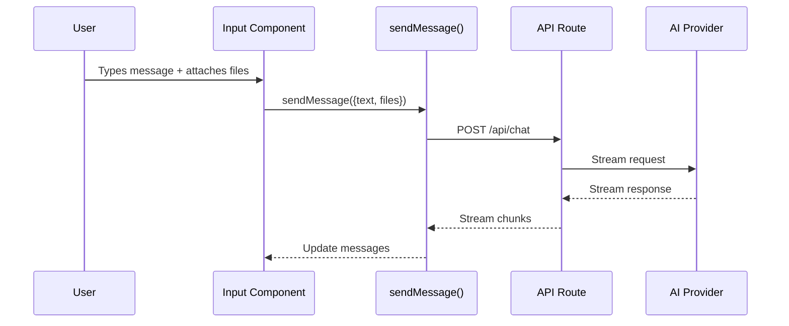

# sendMessage Pattern

## Introduction

The AI SDK 6's `sendMessage` function is the primary way to send user input to your AI backend. Unlike the simpler `append` approach, `sendMessage` accepts structured input including text, files, and request-level options. Understanding this pattern is essential for building feature-rich chat interfaces.

In this lesson, we'll explore the complete `sendMessage` API and how to use it effectively.

### What We'll Cover

- Basic `sendMessage` usage
- Text and file attachments
- Request-level options (headers, body)
- FileList vs FileUIPart
- Error handling with sendMessage
- Advanced patterns

### Prerequisites

- [File Attachment UI](./07-file-attachment-ui.md)
- AI SDK useChat hook
- Understanding of HTTP requests

---

## sendMessage Overview



---

## Basic Usage

```tsx
import { useChat } from 'ai/react';

function ChatInput() {
  const { input, setInput, sendMessage, status } = useChat();
  
  const handleSubmit = () => {
    if (!input.trim()) return;
    
    // Simple text message
    sendMessage({ text: input });
    setInput('');
  };
  
  return (
    <form onSubmit={e => { e.preventDefault(); handleSubmit(); }}>
      <input
        value={input}
        onChange={e => setInput(e.target.value)}
        placeholder="Type a message..."
      />
      <button type="submit" disabled={status !== 'ready'}>
        Send
      </button>
    </form>
  );
}
```

---

## Text Messages

```tsx
// Basic text
sendMessage({ text: 'Hello, AI!' });

// With newlines
sendMessage({ 
  text: `Here's my code:
\`\`\`python
def hello():
    print("Hello, World!")
\`\`\`
Can you explain it?`
});

// Empty text (only with files)
sendMessage({ 
  text: '', 
  files: fileList 
});
```

---

## File Attachments

### Using FileList (Browser Files)

```tsx
function ChatWithFiles() {
  const { sendMessage } = useChat();
  const fileInputRef = useRef<HTMLInputElement>(null);
  const [selectedFiles, setSelectedFiles] = useState<FileList | null>(null);
  
  const handleSubmit = (text: string) => {
    sendMessage({
      text,
      files: selectedFiles || undefined
    });
    
    // Clear selection
    setSelectedFiles(null);
    if (fileInputRef.current) {
      fileInputRef.current.value = '';
    }
  };
  
  return (
    <div>
      <input
        ref={fileInputRef}
        type="file"
        multiple
        accept="image/*,text/*"
        onChange={e => setSelectedFiles(e.target.files)}
      />
      <button onClick={() => handleSubmit('Analyze these files')}>
        Send
      </button>
    </div>
  );
}
```

### FileList from DataTransfer

```tsx
function createFileList(files: File[]): FileList {
  const dataTransfer = new DataTransfer();
  files.forEach(file => dataTransfer.items.add(file));
  return dataTransfer.files;
}

// Usage with multiple sources
function handleFilesFromMultipleSources(
  pickerFiles: File[],
  dropFiles: File[],
  pastedFiles: File[]
) {
  const allFiles = [...pickerFiles, ...dropFiles, ...pastedFiles];
  const fileList = createFileList(allFiles);
  
  sendMessage({
    text: 'Here are my files',
    files: fileList
  });
}
```

### Using FileUIPart (Pre-uploaded Files)

```tsx
import { FileUIPart } from 'ai';

// For files already uploaded to a URL
const preUploadedFile: FileUIPart = {
  type: 'file',
  mimeType: 'image/png',
  data: 'https://example.com/images/screenshot.png'
};

sendMessage({
  text: 'What do you see in this image?',
  files: [preUploadedFile]
});
```

### File Type Handling

```tsx
// The AI SDK automatically converts files based on type:
// - image/* → Multimodal image parts
// - text/* → Text content parts

sendMessage({
  text: 'Review this code',
  files: codeFileList  // text/javascript → sent as text
});

sendMessage({
  text: 'Describe this image',
  files: imageFileList  // image/png → sent as image
});
```

---

## Request-Level Options

```tsx
// Second parameter: request options
sendMessage(
  { text: 'Hello' },
  {
    // Custom headers for this request
    headers: {
      'X-Request-ID': crypto.randomUUID(),
      'X-Priority': 'high'
    },
    
    // Additional body data
    body: {
      model: 'gpt-4o',
      temperature: 0.7,
      userId: 'user_123'
    },
    
    // Metadata for logging/analytics
    metadata: {
      source: 'chat-widget',
      version: '2.0'
    }
  }
);
```

### Dynamic Options Based on Content

```tsx
function sendWithDynamicOptions(text: string, files?: FileList) {
  const hasImages = files && Array.from(files).some(f => f.type.startsWith('image/'));
  
  sendMessage(
    { text, files },
    {
      body: {
        // Use vision model when images are attached
        model: hasImages ? 'gpt-4o' : 'gpt-4o-mini',
        // Increase max tokens for image analysis
        maxTokens: hasImages ? 4096 : 2048
      }
    }
  );
}
```

---

## Error Handling

```tsx
function ChatWithErrorHandling() {
  const { sendMessage, status, error } = useChat({
    onError: (error) => {
      console.error('Chat error:', error);
      // Handle specific error types
      if (error.message.includes('rate limit')) {
        showToast('Too many requests. Please wait a moment.');
      } else if (error.message.includes('context length')) {
        showToast('Message too long. Please shorten it.');
      } else {
        showToast('Something went wrong. Please try again.');
      }
    }
  });
  
  const handleSubmit = async (text: string, files?: FileList) => {
    try {
      await sendMessage({ text, files });
    } catch (err) {
      // Handle immediate errors (validation, network)
      console.error('Send failed:', err);
    }
  };
  
  return (
    <div>
      {status === 'error' && (
        <div className="text-red-500 p-2 bg-red-50 rounded">
          {error?.message || 'An error occurred'}
          <button onClick={() => handleSubmit(lastInput)}>
            Retry
          </button>
        </div>
      )}
    </div>
  );
}
```

---

## Complete sendMessage Component

```tsx
interface ChatInputProps {
  maxFiles?: number;
  maxFileSize?: number;
}

function CompleteChatInput({
  maxFiles = 5,
  maxFileSize = 10 * 1024 * 1024
}: ChatInputProps) {
  const { 
    input, 
    setInput, 
    sendMessage, 
    status, 
    error,
    stop 
  } = useChat({
    api: '/api/chat',
    onError: (err) => console.error('Chat error:', err)
  });
  
  const [files, setFiles] = useState<File[]>([]);
  const [fileErrors, setFileErrors] = useState<string[]>([]);
  
  // Validation
  const validateAndAddFiles = (newFiles: FileList | File[]) => {
    const fileArray = Array.from(newFiles);
    const errors: string[] = [];
    const valid: File[] = [];
    
    if (files.length + fileArray.length > maxFiles) {
      errors.push(`Maximum ${maxFiles} files allowed`);
      setFileErrors(errors);
      return;
    }
    
    for (const file of fileArray) {
      if (file.size > maxFileSize) {
        errors.push(`${file.name} exceeds size limit`);
      } else {
        valid.push(file);
      }
    }
    
    setFiles(prev => [...prev, ...valid]);
    setFileErrors(errors);
  };
  
  // Build FileList
  const getFileList = (): FileList | undefined => {
    if (files.length === 0) return undefined;
    const dt = new DataTransfer();
    files.forEach(f => dt.items.add(f));
    return dt.files;
  };
  
  // Submit handler
  const handleSubmit = () => {
    const trimmedInput = input.trim();
    if (!trimmedInput && files.length === 0) return;
    if (status !== 'ready') return;
    
    sendMessage(
      {
        text: trimmedInput,
        files: getFileList()
      },
      {
        body: {
          // Send additional context
          hasAttachments: files.length > 0,
          attachmentTypes: files.map(f => f.type)
        }
      }
    );
    
    // Clear state
    setInput('');
    setFiles([]);
    setFileErrors([]);
  };
  
  // Keyboard handling
  const handleKeyDown = (e: React.KeyboardEvent) => {
    if (e.key === 'Enter' && !e.shiftKey) {
      e.preventDefault();
      handleSubmit();
    }
  };
  
  // Determine button state
  const isEmpty = !input.trim() && files.length === 0;
  const isProcessing = status === 'submitted' || status === 'streaming';
  
  return (
    <div className="space-y-3 p-4 bg-white rounded-2xl shadow-lg">
      {/* File previews */}
      {files.length > 0 && (
        <div className="flex flex-wrap gap-2">
          {files.map((file, i) => (
            <FilePreview
              key={i}
              file={file}
              onRemove={() => setFiles(prev => prev.filter((_, j) => j !== i))}
            />
          ))}
        </div>
      )}
      
      {/* Errors */}
      {(fileErrors.length > 0 || error) && (
        <div className="text-sm text-red-500 space-y-1">
          {fileErrors.map((err, i) => (
            <p key={i}>⚠️ {err}</p>
          ))}
          {error && <p>⚠️ {error.message}</p>}
        </div>
      )}
      
      {/* Input area */}
      <div className="flex items-end gap-2">
        {/* File picker */}
        <input
          type="file"
          multiple
          accept="image/*,text/*,.pdf"
          onChange={e => e.target.files && validateAndAddFiles(e.target.files)}
          className="hidden"
          id="file-input"
        />
        <label
          htmlFor="file-input"
          className="
            p-3 rounded-xl cursor-pointer
            text-gray-500 hover:text-gray-700 hover:bg-gray-100
            transition-colors
          "
        >
          <PaperclipIcon className="w-5 h-5" />
        </label>
        
        {/* Text input */}
        <textarea
          value={input}
          onChange={e => setInput(e.target.value)}
          onKeyDown={handleKeyDown}
          placeholder={files.length > 0 ? 'Describe your files...' : 'Type a message...'}
          disabled={isProcessing}
          rows={1}
          className="
            flex-1 p-3
            rounded-xl border border-gray-200
            resize-none
            focus:outline-none focus:ring-2 focus:ring-blue-500
            disabled:bg-gray-50
          "
        />
        
        {/* Submit/Stop button */}
        <button
          onClick={isProcessing ? stop : handleSubmit}
          disabled={isEmpty && !isProcessing}
          className={`
            p-3 rounded-xl transition-colors
            ${isProcessing
              ? 'bg-red-500 hover:bg-red-600 text-white'
              : isEmpty
              ? 'bg-gray-200 text-gray-400 cursor-not-allowed'
              : 'bg-blue-500 hover:bg-blue-600 text-white'
            }
          `}
          aria-label={isProcessing ? 'Stop generating' : 'Send message'}
        >
          {status === 'submitted' ? (
            <LoadingSpinner className="w-5 h-5" />
          ) : isProcessing ? (
            <StopIcon className="w-5 h-5" />
          ) : (
            <SendIcon className="w-5 h-5" />
          )}
        </button>
      </div>
      
      {/* Status indicator */}
      {status !== 'ready' && (
        <p className="text-xs text-gray-400">
          {status === 'submitted' && 'Sending...'}
          {status === 'streaming' && 'AI is responding...'}
        </p>
      )}
    </div>
  );
}
```

---

## sendMessage vs handleSubmit

| Feature | `sendMessage` | `handleSubmit` |
|---------|---------------|----------------|
| File attachments | ✅ Built-in | ❌ Manual only |
| Request options | ✅ Second parameter | ❌ Not supported |
| Form event | ❌ Not needed | ✅ Expects event |
| Flexibility | High | Low |
| Use case | Custom inputs | Form-based inputs |

```tsx
// handleSubmit (form-based)
<form onSubmit={handleSubmit}>
  <input name="message" />
  <button type="submit">Send</button>
</form>

// sendMessage (flexible)
<button onClick={() => sendMessage({ text: input, files })}>
  Send
</button>
```

---

## Best Practices

| ✅ Do | ❌ Don't |
|-------|---------|
| Clear input after sendMessage | Leave stale input |
| Build FileList from DataTransfer | Mutate FileList directly |
| Use request options for context | Hard-code API parameters |
| Handle both sync and async errors | Ignore error states |
| Show status during processing | Leave UI unchanged |
| Validate files before sending | Send invalid files to API |

---

## Common Pitfalls

| ❌ Mistake | ✅ Solution |
|-----------|-------------|
| Sending empty text with no files | Check both before submit |
| Not clearing file input | Reset after send |
| Missing error callback | Add onError to useChat |
| Forgetting stop during streaming | Expose stop to users |
| Hard-coded model selection | Use request options body |

---

## API Reference

```tsx
interface SendMessageOptions {
  text: string;
  files?: FileList | FileUIPart[];
}

interface RequestOptions {
  headers?: Record<string, string>;
  body?: Record<string, unknown>;
  metadata?: Record<string, unknown>;
}

function sendMessage(
  content: SendMessageOptions,
  options?: RequestOptions
): void;
```

---

## Hands-on Exercise

### Your Task

Build a chat input that uses `sendMessage` with:
1. Text message support
2. File attachments (up to 3 files)
3. Custom request headers (request ID)
4. Dynamic model selection based on content
5. Complete error handling

### Requirements

1. Use `sendMessage` not `handleSubmit`
2. Pass request ID in headers
3. Select vision model when images attached
4. Show retry button on error
5. Clear all state after successful send

<details>
<summary>💡 Hints (click to expand)</summary>

- Check file types with `file.type.startsWith('image/')`
- Generate request ID with `crypto.randomUUID()`
- Use second parameter for `{ headers, body }`
- Access `error` from `useChat()` return
- Use `status` to determine UI state

</details>

---

## Summary

✅ **sendMessage** accepts text and files  
✅ **FileList** for browser file inputs  
✅ **FileUIPart** for pre-uploaded files  
✅ **Request options** for headers/body  
✅ **Error handling** via callback  
✅ **Status tracking** for UI feedback

---

## Further Reading

- [AI SDK sendMessage Reference](https://ai-sdk.dev/docs/reference/ai-sdk-ui/use-chat)
- [AI SDK Attachments](https://ai-sdk.dev/docs/ai-sdk-ui/chatbot#attachments)
- [MDN: DataTransfer](https://developer.mozilla.org/en-US/docs/Web/API/DataTransfer)

---

**Previous:** [File Attachment UI](./07-file-attachment-ui.md)  
**Next:** [Typing Indicators](../10-typing-indicators/00-typing-indicators.md)

<!-- 
Sources Consulted:
- AI SDK Chatbot: https://ai-sdk.dev/docs/ai-sdk-ui/chatbot
- AI SDK useChat: https://ai-sdk.dev/docs/reference/ai-sdk-ui/use-chat
- MDN DataTransfer: https://developer.mozilla.org/en-US/docs/Web/API/DataTransfer
-->
