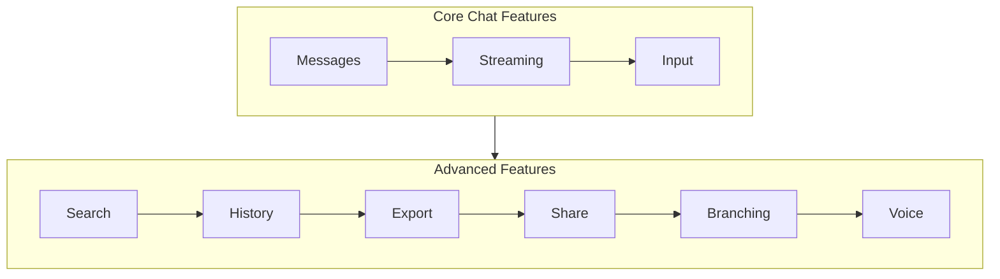

# Advanced Features

## Introduction

Beyond core messaging, modern chat interfaces offer power-user features that enhance productivity and usability. These advanced capabilities—search, history management, export, sharing, branching, and voice input—transform a simple chat into a comprehensive AI workspace.

This lesson introduces seven advanced feature categories that differentiate professional chat applications from basic implementations.

### What We'll Cover

| Topic | Description |
|-------|-------------|
| [Message Search](./01-message-search.md) | Full-text search with highlighting and navigation |
| [Conversation History Sidebar](./02-conversation-history-sidebar.md) | List design, date grouping, quick navigation |
| [Conversation Export](./03-conversation-export.md) | JSON, Markdown, PDF export formats |
| [Share Conversation](./04-share-conversation.md) | Shareable links and privacy controls |
| [Branching Conversations](./05-branching-conversations.md) | Fork from any message, visualization |
| [Voice Input Integration](./06-voice-input-integration.md) | Web Speech API, transcription display |
| [Realtime API Voice UI](./07-realtime-api-voice-ui.md) | WebRTC, audio visualization, speaking states |

### Prerequisites

- [Input Handling](../09-input-handling/00-input-handling.md)
- React state management
- Understanding of chat architecture

---

## Feature Overview



---

## Feature Comparison

| Feature | Complexity | User Value | Implementation Time |
|---------|------------|------------|---------------------|
| Message Search | Medium | High | 1-2 days |
| History Sidebar | Low | High | 0.5-1 day |
| Conversation Export | Medium | Medium | 1 day |
| Share Conversation | Medium | Medium | 1-2 days |
| Branching | High | High | 2-3 days |
| Voice Input (Web Speech) | Medium | High | 1 day |
| Realtime API Voice | High | Very High | 2-3 days |

---

## Architecture Patterns

### State Management for Advanced Features

```tsx
interface ChatAppState {
  // Core state
  conversations: Conversation[];
  activeConversationId: string | null;
  messages: Message[];
  
  // Search state
  searchQuery: string;
  searchResults: SearchResult[];
  highlightedMessageId: string | null;
  
  // History state
  historyFilter: 'all' | 'today' | 'week' | 'month';
  historySortOrder: 'newest' | 'oldest';
  
  // Voice state
  voiceMode: 'idle' | 'listening' | 'speaking' | 'processing';
  transcript: string;
  
  // Branching state
  branches: Branch[];
  activeBranchId: string;
}
```

### Feature Flags

```tsx
interface FeatureFlags {
  enableSearch: boolean;
  enableExport: boolean;
  enableSharing: boolean;
  enableBranching: boolean;
  enableVoiceInput: boolean;
  enableRealtimeVoice: boolean;
}

function useFeatureFlags(): FeatureFlags {
  return {
    enableSearch: true,
    enableExport: true,
    enableSharing: process.env.NEXT_PUBLIC_ENABLE_SHARING === 'true',
    enableBranching: false, // Experimental
    enableVoiceInput: 'SpeechRecognition' in window,
    enableRealtimeVoice: process.env.NEXT_PUBLIC_ENABLE_REALTIME === 'true'
  };
}
```

---

## Common Patterns

### Command Palette Integration

Advanced features often integrate with a command palette:

```tsx
const ADVANCED_COMMANDS = [
  { id: 'search', label: 'Search messages', shortcut: '⌘K', action: openSearch },
  { id: 'export', label: 'Export conversation', shortcut: '⌘E', action: openExport },
  { id: 'share', label: 'Share conversation', shortcut: '⌘⇧S', action: openShare },
  { id: 'voice', label: 'Start voice input', shortcut: 'V', action: startVoice },
  { id: 'branch', label: 'Fork from here', shortcut: '⌘B', action: createBranch }
];
```

### Progressive Enhancement

```tsx
function ChatInterface() {
  const features = useFeatureFlags();
  
  return (
    <div className="chat-container">
      {/* Core features always available */}
      <MessageList />
      <ChatInput />
      
      {/* Advanced features conditionally rendered */}
      {features.enableSearch && <SearchButton />}
      {features.enableVoiceInput && <VoiceInputButton />}
      {features.enableExport && <ExportMenu />}
    </div>
  );
}
```

---

## Performance Considerations

| Feature | Performance Impact | Optimization Strategy |
|---------|-------------------|----------------------|
| Search | High (large history) | Index messages, debounce |
| History | Medium (many conversations) | Virtual scrolling, pagination |
| Export | High (PDF generation) | Web Worker, streaming |
| Voice | Low (browser API) | Lazy load recognition |
| Realtime | Medium (WebRTC) | Connection pooling |

---

## Best Practices

| ✅ Do | ❌ Don't |
|-------|---------|
| Feature flag experimental features | Ship unstable features to all users |
| Progressive enhancement | Require all features to load |
| Lazy load heavy features | Bundle everything upfront |
| Provide keyboard shortcuts | Force mouse-only interaction |
| Show clear loading states | Leave users waiting without feedback |
| Graceful degradation | Crash on unsupported browsers |

---

## Lesson Navigation

Each advanced feature is covered in its own detailed lesson:

1. **[Message Search](./01-message-search.md)** - Full-text search, highlighting, result navigation
2. **[Conversation History Sidebar](./02-conversation-history-sidebar.md)** - List design, date grouping, titles
3. **[Conversation Export](./03-conversation-export.md)** - JSON, Markdown, PDF formats
4. **[Share Conversation](./04-share-conversation.md)** - Shareable links, privacy controls
5. **[Branching Conversations](./05-branching-conversations.md)** - Fork, visualize, navigate branches
6. **[Voice Input Integration](./06-voice-input-integration.md)** - Web Speech API, transcription
7. **[Realtime API Voice UI](./07-realtime-api-voice-ui.md)** - WebRTC, audio visualization

---

## Summary

✅ **Seven advanced features** extend core chat functionality  
✅ **Feature flags** control availability  
✅ **Progressive enhancement** ensures baseline works  
✅ **Performance optimization** required for scale  
✅ **Keyboard shortcuts** improve power-user experience  
✅ **Voice features** require browser API support

---

**Previous:** [Input Handling](../09-input-handling/00-input-handling.md)  
**Next:** [Message Search](./01-message-search.md)
