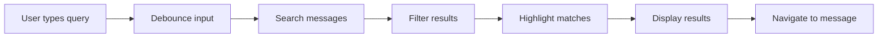

# Message Search

## Introduction

As conversations grow, finding specific messages becomes essential. Effective search combines full-text matching, result highlighting, and smooth navigation to help users locate information quickly without scrolling through hundreds of messages.

In this lesson, we'll build a complete message search system with real-time results and keyboard navigation.

### What We'll Cover

- Full-text search implementation
- Search result highlighting
- Result navigation (previous/next)
- Filter by date, sender, or content type
- Search UI patterns
- Performance optimization

### Prerequisites

- [Advanced Features Overview](./00-advanced-features.md)
- JavaScript string/regex methods
- React state management

---

## Search Architecture



---

## Basic Search Implementation

```tsx
interface Message {
  id: string;
  role: 'user' | 'assistant';
  content: string;
  createdAt: Date;
}

interface SearchResult {
  message: Message;
  matchedText: string;
  matchIndex: number;
}

function searchMessages(messages: Message[], query: string): SearchResult[] {
  if (!query.trim()) return [];
  
  const lowerQuery = query.toLowerCase();
  const results: SearchResult[] = [];
  
  for (const message of messages) {
    const lowerContent = message.content.toLowerCase();
    const matchIndex = lowerContent.indexOf(lowerQuery);
    
    if (matchIndex !== -1) {
      // Extract matched text with context
      const start = Math.max(0, matchIndex - 30);
      const end = Math.min(message.content.length, matchIndex + query.length + 30);
      const matchedText = message.content.slice(start, end);
      
      results.push({
        message,
        matchedText: (start > 0 ? '...' : '') + matchedText + (end < message.content.length ? '...' : ''),
        matchIndex
      });
    }
  }
  
  return results;
}
```

---

## Search Hook

```tsx
interface UseSearchOptions {
  debounceMs?: number;
  maxResults?: number;
}

function useMessageSearch(
  messages: Message[],
  options: UseSearchOptions = {}
) {
  const { debounceMs = 200, maxResults = 50 } = options;
  
  const [query, setQuery] = useState('');
  const [results, setResults] = useState<SearchResult[]>([]);
  const [isSearching, setIsSearching] = useState(false);
  const [currentIndex, setCurrentIndex] = useState(0);
  
  // Debounced search
  useEffect(() => {
    if (!query.trim()) {
      setResults([]);
      setCurrentIndex(0);
      return;
    }
    
    setIsSearching(true);
    
    const timer = setTimeout(() => {
      const searchResults = searchMessages(messages, query)
        .slice(0, maxResults);
      setResults(searchResults);
      setCurrentIndex(0);
      setIsSearching(false);
    }, debounceMs);
    
    return () => clearTimeout(timer);
  }, [query, messages, debounceMs, maxResults]);
  
  // Navigation
  const goToNext = useCallback(() => {
    setCurrentIndex(prev => (prev + 1) % results.length);
  }, [results.length]);
  
  const goToPrevious = useCallback(() => {
    setCurrentIndex(prev => (prev - 1 + results.length) % results.length);
  }, [results.length]);
  
  const currentResult = results[currentIndex] ?? null;
  
  return {
    query,
    setQuery,
    results,
    isSearching,
    currentIndex,
    currentResult,
    goToNext,
    goToPrevious,
    totalResults: results.length
  };
}
```

---

## Search Result Highlighting

```tsx
interface HighlightedTextProps {
  text: string;
  query: string;
  className?: string;
}

function HighlightedText({ text, query, className = '' }: HighlightedTextProps) {
  if (!query.trim()) {
    return <span className={className}>{text}</span>;
  }
  
  const regex = new RegExp(`(${escapeRegex(query)})`, 'gi');
  const parts = text.split(regex);
  
  return (
    <span className={className}>
      {parts.map((part, i) => {
        const isMatch = part.toLowerCase() === query.toLowerCase();
        return isMatch ? (
          <mark 
            key={i} 
            className="bg-yellow-200 dark:bg-yellow-700 rounded px-0.5"
          >
            {part}
          </mark>
        ) : (
          <span key={i}>{part}</span>
        );
      })}
    </span>
  );
}

// Escape special regex characters
function escapeRegex(string: string): string {
  return string.replace(/[.*+?^${}()|[\]\\]/g, '\\$&');
}
```

---

## Search UI Component

```tsx
interface SearchBarProps {
  onClose: () => void;
}

function SearchBar({ onClose }: SearchBarProps) {
  const { messages } = useConversation();
  const inputRef = useRef<HTMLInputElement>(null);
  
  const {
    query,
    setQuery,
    results,
    isSearching,
    currentIndex,
    currentResult,
    goToNext,
    goToPrevious,
    totalResults
  } = useMessageSearch(messages);
  
  // Auto-focus on mount
  useEffect(() => {
    inputRef.current?.focus();
  }, []);
  
  // Keyboard shortcuts
  const handleKeyDown = (e: React.KeyboardEvent) => {
    switch (e.key) {
      case 'Enter':
        if (e.shiftKey) {
          goToPrevious();
        } else {
          goToNext();
        }
        break;
      case 'ArrowUp':
        e.preventDefault();
        goToPrevious();
        break;
      case 'ArrowDown':
        e.preventDefault();
        goToNext();
        break;
      case 'Escape':
        onClose();
        break;
    }
  };
  
  // Scroll to current result
  useEffect(() => {
    if (currentResult) {
      const element = document.getElementById(`message-${currentResult.message.id}`);
      element?.scrollIntoView({ behavior: 'smooth', block: 'center' });
    }
  }, [currentResult]);
  
  return (
    <div className="
      fixed top-4 left-1/2 -translate-x-1/2
      w-full max-w-xl
      bg-white dark:bg-gray-800
      rounded-xl shadow-2xl
      border border-gray-200 dark:border-gray-700
      z-50
    ">
      {/* Search input */}
      <div className="flex items-center gap-3 p-4 border-b border-gray-200 dark:border-gray-700">
        <SearchIcon className="w-5 h-5 text-gray-400" />
        <input
          ref={inputRef}
          type="text"
          value={query}
          onChange={e => setQuery(e.target.value)}
          onKeyDown={handleKeyDown}
          placeholder="Search messages..."
          className="
            flex-1 bg-transparent
            text-gray-900 dark:text-white
            placeholder:text-gray-400
            focus:outline-none
          "
        />
        
        {/* Result count */}
        {query && (
          <span className="text-sm text-gray-500">
            {isSearching ? (
              'Searching...'
            ) : totalResults > 0 ? (
              `${currentIndex + 1} of ${totalResults}`
            ) : (
              'No results'
            )}
          </span>
        )}
        
        {/* Navigation buttons */}
        {totalResults > 0 && (
          <div className="flex gap-1">
            <button
              onClick={goToPrevious}
              className="p-1 hover:bg-gray-100 dark:hover:bg-gray-700 rounded"
              aria-label="Previous result"
            >
              <ChevronUpIcon className="w-4 h-4" />
            </button>
            <button
              onClick={goToNext}
              className="p-1 hover:bg-gray-100 dark:hover:bg-gray-700 rounded"
              aria-label="Next result"
            >
              <ChevronDownIcon className="w-4 h-4" />
            </button>
          </div>
        )}
        
        {/* Close button */}
        <button
          onClick={onClose}
          className="p-1 hover:bg-gray-100 dark:hover:bg-gray-700 rounded"
          aria-label="Close search"
        >
          <XIcon className="w-4 h-4" />
        </button>
      </div>
      
      {/* Results preview */}
      {query && results.length > 0 && (
        <div className="max-h-64 overflow-y-auto">
          {results.slice(0, 5).map((result, i) => (
            <button
              key={result.message.id}
              onClick={() => {
                setCurrentIndex(results.indexOf(result));
              }}
              className={`
                w-full px-4 py-3 text-left
                hover:bg-gray-50 dark:hover:bg-gray-700
                ${i === currentIndex ? 'bg-blue-50 dark:bg-blue-900/30' : ''}
                border-b border-gray-100 dark:border-gray-700
                last:border-b-0
              `}
            >
              <div className="flex items-center gap-2 mb-1">
                <span className={`
                  text-xs font-medium px-2 py-0.5 rounded
                  ${result.message.role === 'user' 
                    ? 'bg-blue-100 text-blue-700' 
                    : 'bg-green-100 text-green-700'
                  }
                `}>
                  {result.message.role}
                </span>
                <span className="text-xs text-gray-400">
                  {formatDate(result.message.createdAt)}
                </span>
              </div>
              <HighlightedText
                text={result.matchedText}
                query={query}
                className="text-sm text-gray-600 dark:text-gray-300"
              />
            </button>
          ))}
        </div>
      )}
      
      {/* Keyboard hints */}
      <div className="px-4 py-2 bg-gray-50 dark:bg-gray-900 rounded-b-xl text-xs text-gray-400">
        <kbd className="px-1 bg-gray-200 dark:bg-gray-700 rounded">↵</kbd> Next •
        <kbd className="px-1 bg-gray-200 dark:bg-gray-700 rounded ml-2">⇧↵</kbd> Previous •
        <kbd className="px-1 bg-gray-200 dark:bg-gray-700 rounded ml-2">Esc</kbd> Close
      </div>
    </div>
  );
}
```

---

## Search Filters

```tsx
interface SearchFilters {
  role?: 'user' | 'assistant' | 'all';
  dateRange?: {
    start: Date | null;
    end: Date | null;
  };
  contentType?: 'text' | 'code' | 'all';
}

function filterMessages(
  messages: Message[],
  query: string,
  filters: SearchFilters
): SearchResult[] {
  let filtered = messages;
  
  // Filter by role
  if (filters.role && filters.role !== 'all') {
    filtered = filtered.filter(m => m.role === filters.role);
  }
  
  // Filter by date range
  if (filters.dateRange?.start) {
    filtered = filtered.filter(m => m.createdAt >= filters.dateRange!.start!);
  }
  if (filters.dateRange?.end) {
    filtered = filtered.filter(m => m.createdAt <= filters.dateRange!.end!);
  }
  
  // Filter by content type
  if (filters.contentType === 'code') {
    filtered = filtered.filter(m => m.content.includes('```'));
  }
  
  // Then search
  return searchMessages(filtered, query);
}
```

### Filter UI

```tsx
function SearchFiltersUI({
  filters,
  onChange
}: {
  filters: SearchFilters;
  onChange: (filters: SearchFilters) => void;
}) {
  return (
    <div className="flex gap-2 px-4 py-2 border-b border-gray-200">
      {/* Role filter */}
      <select
        value={filters.role || 'all'}
        onChange={e => onChange({ ...filters, role: e.target.value as any })}
        className="text-sm rounded border-gray-300"
      >
        <option value="all">All messages</option>
        <option value="user">User only</option>
        <option value="assistant">Assistant only</option>
      </select>
      
      {/* Content type filter */}
      <select
        value={filters.contentType || 'all'}
        onChange={e => onChange({ ...filters, contentType: e.target.value as any })}
        className="text-sm rounded border-gray-300"
      >
        <option value="all">All content</option>
        <option value="code">Code blocks</option>
        <option value="text">Text only</option>
      </select>
      
      {/* Date filter */}
      <select
        value="custom"
        onChange={e => {
          const now = new Date();
          const ranges: Record<string, SearchFilters['dateRange']> = {
            'all': undefined,
            'today': { start: startOfDay(now), end: now },
            'week': { start: subDays(now, 7), end: now },
            'month': { start: subDays(now, 30), end: now }
          };
          onChange({ ...filters, dateRange: ranges[e.target.value] });
        }}
        className="text-sm rounded border-gray-300"
      >
        <option value="all">All time</option>
        <option value="today">Today</option>
        <option value="week">Past week</option>
        <option value="month">Past month</option>
      </select>
    </div>
  );
}
```

---

## Performance Optimization

### Indexing for Large Histories

```tsx
interface SearchIndex {
  messageId: string;
  tokens: string[];
}

function buildSearchIndex(messages: Message[]): SearchIndex[] {
  return messages.map(message => ({
    messageId: message.id,
    tokens: message.content
      .toLowerCase()
      .split(/\s+/)
      .filter(token => token.length > 2) // Skip short words
  }));
}

function searchWithIndex(
  index: SearchIndex[],
  messages: Map<string, Message>,
  query: string
): SearchResult[] {
  const queryTokens = query.toLowerCase().split(/\s+/);
  const results: SearchResult[] = [];
  
  for (const entry of index) {
    const matches = queryTokens.every(token =>
      entry.tokens.some(t => t.includes(token))
    );
    
    if (matches) {
      const message = messages.get(entry.messageId)!;
      results.push({
        message,
        matchedText: message.content.slice(0, 100),
        matchIndex: 0
      });
    }
  }
  
  return results;
}
```

### Web Worker for Background Search

```tsx
// search.worker.ts
self.onmessage = (e: MessageEvent) => {
  const { messages, query, filters } = e.data;
  const results = filterMessages(messages, query, filters);
  self.postMessage(results);
};

// useSearchWorker.ts
function useSearchWorker(messages: Message[]) {
  const workerRef = useRef<Worker>();
  const [results, setResults] = useState<SearchResult[]>([]);
  
  useEffect(() => {
    workerRef.current = new Worker(
      new URL('./search.worker.ts', import.meta.url)
    );
    
    workerRef.current.onmessage = (e) => {
      setResults(e.data);
    };
    
    return () => workerRef.current?.terminate();
  }, []);
  
  const search = useCallback((query: string, filters: SearchFilters) => {
    workerRef.current?.postMessage({ messages, query, filters });
  }, [messages]);
  
  return { results, search };
}
```

---

## Keyboard Shortcut Integration

```tsx
function useSearchShortcut(onOpen: () => void) {
  useEffect(() => {
    const handleKeyDown = (e: KeyboardEvent) => {
      // Cmd/Ctrl + K to open search
      if ((e.metaKey || e.ctrlKey) && e.key === 'k') {
        e.preventDefault();
        onOpen();
      }
      
      // Cmd/Ctrl + F as alternative
      if ((e.metaKey || e.ctrlKey) && e.key === 'f') {
        e.preventDefault();
        onOpen();
      }
    };
    
    window.addEventListener('keydown', handleKeyDown);
    return () => window.removeEventListener('keydown', handleKeyDown);
  }, [onOpen]);
}
```

---

## Best Practices

| ✅ Do | ❌ Don't |
|-------|---------|
| Debounce search input | Search on every keystroke |
| Show result count | Hide how many matches found |
| Highlight matched text | Show plain results |
| Support keyboard navigation | Require mouse for navigation |
| Limit initial results | Load all results at once |
| Escape regex special chars | Pass raw query to regex |

---

## Common Pitfalls

| ❌ Mistake | ✅ Solution |
|-----------|-------------|
| No debounce = lag | Add 150-300ms debounce |
| Case-sensitive search | Use `.toLowerCase()` |
| Regex errors from user input | Escape special characters |
| Lost scroll position | Scroll to result on select |
| No loading state | Show "Searching..." indicator |

---

## Hands-on Exercise

### Your Task

Build a message search feature with:
1. Real-time search with debouncing
2. Highlighted search results
3. Keyboard navigation (↑/↓, Enter)
4. Filter by role (user/assistant)
5. Result count display

### Requirements

1. Search updates as user types (debounced)
2. Matching text highlighted in yellow
3. Arrow keys navigate between results
4. Enter scrolls to selected message
5. Escape closes search

<details>
<summary>💡 Hints (click to expand)</summary>

- Use `setTimeout` for debouncing
- Split text on query match for highlighting
- Track `currentIndex` in state
- Use `scrollIntoView()` for navigation
- Add `tabIndex` for keyboard focus

</details>

---

## Summary

✅ **Full-text search** with case-insensitive matching  
✅ **Debouncing** prevents excessive re-renders  
✅ **Highlighting** shows exactly what matched  
✅ **Keyboard navigation** for power users  
✅ **Filters** narrow results by role/date  
✅ **Indexing** improves large history performance

---

## Further Reading

- [MDN: String.prototype.indexOf](https://developer.mozilla.org/en-US/docs/Web/JavaScript/Reference/Global_Objects/String/indexOf)
- [Fuse.js - Fuzzy Search](https://fusejs.io/)
- [React Virtual](https://tanstack.com/virtual/latest) - Virtual scrolling for large lists

---

**Previous:** [Advanced Features Overview](./00-advanced-features.md)  
**Next:** [Conversation History Sidebar](./02-conversation-history-sidebar.md)

<!-- 
Sources Consulted:
- MDN String methods: https://developer.mozilla.org/en-US/docs/Web/JavaScript/Reference/Global_Objects/String
- Fuse.js: https://fusejs.io/
- Web Workers: https://developer.mozilla.org/en-US/docs/Web/API/Web_Workers_API
-->
