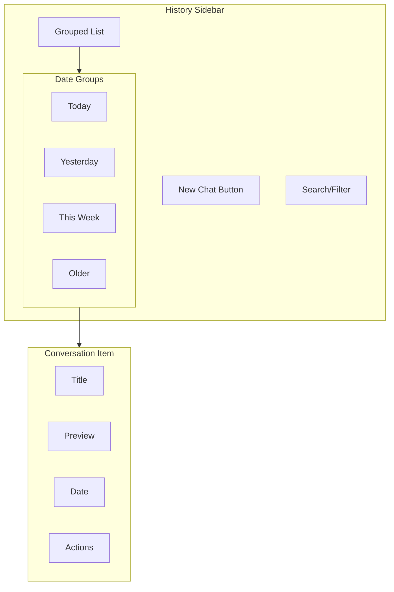

# Conversation History Sidebar

## Introduction

A well-designed history sidebar helps users navigate between conversations, find past discussions, and organize their chat history. The sidebar must balance information density with scannability, showing enough context to identify conversations without overwhelming the interface.

In this lesson, we'll build a conversation history sidebar with grouping, titles, and quick navigation.

### What We'll Cover

- Conversation list design patterns
- Grouping by date (Today, Yesterday, This Week)
- Auto-generated conversation titles
- Active conversation indication
- Search within history
- Responsive sidebar behavior

### Prerequisites

- [Message Search](./01-message-search.md)
- React component patterns
- Date formatting utilities

---

## Sidebar Architecture



---

## Data Structures

```tsx
interface Conversation {
  id: string;
  title: string;
  createdAt: Date;
  updatedAt: Date;
  messageCount: number;
  preview?: string; // First message or generated summary
}

interface GroupedConversations {
  today: Conversation[];
  yesterday: Conversation[];
  thisWeek: Conversation[];
  thisMonth: Conversation[];
  older: Conversation[];
}
```

---

## Date Grouping Logic

```tsx
function groupConversationsByDate(
  conversations: Conversation[]
): GroupedConversations {
  const now = new Date();
  const today = startOfDay(now);
  const yesterday = subDays(today, 1);
  const weekAgo = subDays(today, 7);
  const monthAgo = subDays(today, 30);
  
  const groups: GroupedConversations = {
    today: [],
    yesterday: [],
    thisWeek: [],
    thisMonth: [],
    older: []
  };
  
  // Sort by most recent first
  const sorted = [...conversations].sort(
    (a, b) => b.updatedAt.getTime() - a.updatedAt.getTime()
  );
  
  for (const conv of sorted) {
    const date = conv.updatedAt;
    
    if (date >= today) {
      groups.today.push(conv);
    } else if (date >= yesterday) {
      groups.yesterday.push(conv);
    } else if (date >= weekAgo) {
      groups.thisWeek.push(conv);
    } else if (date >= monthAgo) {
      groups.thisMonth.push(conv);
    } else {
      groups.older.push(conv);
    }
  }
  
  return groups;
}

// Date utilities (or use date-fns)
function startOfDay(date: Date): Date {
  const d = new Date(date);
  d.setHours(0, 0, 0, 0);
  return d;
}

function subDays(date: Date, days: number): Date {
  const d = new Date(date);
  d.setDate(d.getDate() - days);
  return d;
}
```

---

## Conversation List Component

```tsx
interface ConversationListProps {
  conversations: Conversation[];
  activeId: string | null;
  onSelect: (id: string) => void;
  onDelete: (id: string) => void;
  onRename: (id: string, title: string) => void;
}

function ConversationList({
  conversations,
  activeId,
  onSelect,
  onDelete,
  onRename
}: ConversationListProps) {
  const grouped = useMemo(
    () => groupConversationsByDate(conversations),
    [conversations]
  );
  
  const renderGroup = (
    title: string,
    items: Conversation[]
  ) => {
    if (items.length === 0) return null;
    
    return (
      <div key={title} className="mb-4">
        <h3 className="
          px-3 py-1.5
          text-xs font-semibold
          text-gray-500 dark:text-gray-400
          uppercase tracking-wider
        ">
          {title}
        </h3>
        <div className="space-y-1">
          {items.map(conv => (
            <ConversationItem
              key={conv.id}
              conversation={conv}
              isActive={conv.id === activeId}
              onSelect={() => onSelect(conv.id)}
              onDelete={() => onDelete(conv.id)}
              onRename={(title) => onRename(conv.id, title)}
            />
          ))}
        </div>
      </div>
    );
  };
  
  return (
    <div className="space-y-2">
      {renderGroup('Today', grouped.today)}
      {renderGroup('Yesterday', grouped.yesterday)}
      {renderGroup('Previous 7 days', grouped.thisWeek)}
      {renderGroup('Previous 30 days', grouped.thisMonth)}
      {renderGroup('Older', grouped.older)}
    </div>
  );
}
```

---

## Conversation Item Component

```tsx
interface ConversationItemProps {
  conversation: Conversation;
  isActive: boolean;
  onSelect: () => void;
  onDelete: () => void;
  onRename: (title: string) => void;
}

function ConversationItem({
  conversation,
  isActive,
  onSelect,
  onDelete,
  onRename
}: ConversationItemProps) {
  const [isEditing, setIsEditing] = useState(false);
  const [title, setTitle] = useState(conversation.title);
  const [showMenu, setShowMenu] = useState(false);
  
  const handleRename = () => {
    if (title.trim() && title !== conversation.title) {
      onRename(title.trim());
    }
    setIsEditing(false);
  };
  
  return (
    <div
      className={`
        group relative
        flex items-center gap-2
        px-3 py-2.5
        rounded-lg cursor-pointer
        transition-colors
        ${isActive 
          ? 'bg-blue-100 dark:bg-blue-900/30' 
          : 'hover:bg-gray-100 dark:hover:bg-gray-800'
        }
      `}
      onClick={onSelect}
    >
      {/* Icon */}
      <ChatIcon className="w-4 h-4 text-gray-400 flex-shrink-0" />
      
      {/* Title */}
      {isEditing ? (
        <input
          type="text"
          value={title}
          onChange={e => setTitle(e.target.value)}
          onBlur={handleRename}
          onKeyDown={e => {
            if (e.key === 'Enter') handleRename();
            if (e.key === 'Escape') setIsEditing(false);
          }}
          className="
            flex-1 px-1 py-0.5
            text-sm bg-white dark:bg-gray-700
            border border-blue-500 rounded
            focus:outline-none
          "
          onClick={e => e.stopPropagation()}
          autoFocus
        />
      ) : (
        <span className="flex-1 text-sm truncate text-gray-700 dark:text-gray-200">
          {conversation.title}
        </span>
      )}
      
      {/* Actions menu */}
      <div className={`
        flex items-center gap-1
        ${showMenu ? 'opacity-100' : 'opacity-0 group-hover:opacity-100'}
        transition-opacity
      `}>
        <button
          onClick={e => {
            e.stopPropagation();
            setIsEditing(true);
          }}
          className="p-1 hover:bg-gray-200 dark:hover:bg-gray-600 rounded"
          aria-label="Rename conversation"
        >
          <PencilIcon className="w-3.5 h-3.5 text-gray-500" />
        </button>
        <button
          onClick={e => {
            e.stopPropagation();
            if (confirm('Delete this conversation?')) {
              onDelete();
            }
          }}
          className="p-1 hover:bg-red-100 dark:hover:bg-red-900/30 rounded"
          aria-label="Delete conversation"
        >
          <TrashIcon className="w-3.5 h-3.5 text-gray-500 hover:text-red-500" />
        </button>
      </div>
    </div>
  );
}
```

---

## Complete Sidebar Component

```tsx
interface HistorySidebarProps {
  conversations: Conversation[];
  activeConversationId: string | null;
  onNewChat: () => void;
  onSelectConversation: (id: string) => void;
  onDeleteConversation: (id: string) => void;
  onRenameConversation: (id: string, title: string) => void;
  isCollapsed?: boolean;
  onToggleCollapse?: () => void;
}

function HistorySidebar({
  conversations,
  activeConversationId,
  onNewChat,
  onSelectConversation,
  onDeleteConversation,
  onRenameConversation,
  isCollapsed = false,
  onToggleCollapse
}: HistorySidebarProps) {
  const [searchQuery, setSearchQuery] = useState('');
  
  // Filter conversations by search
  const filteredConversations = useMemo(() => {
    if (!searchQuery.trim()) return conversations;
    
    const query = searchQuery.toLowerCase();
    return conversations.filter(conv =>
      conv.title.toLowerCase().includes(query) ||
      conv.preview?.toLowerCase().includes(query)
    );
  }, [conversations, searchQuery]);
  
  if (isCollapsed) {
    return (
      <div className="w-16 h-full bg-gray-50 dark:bg-gray-900 border-r flex flex-col items-center py-4">
        <button
          onClick={onToggleCollapse}
          className="p-2 hover:bg-gray-200 dark:hover:bg-gray-800 rounded-lg"
        >
          <MenuIcon className="w-5 h-5" />
        </button>
        <button
          onClick={onNewChat}
          className="mt-4 p-2 bg-blue-500 text-white rounded-lg"
        >
          <PlusIcon className="w-5 h-5" />
        </button>
      </div>
    );
  }
  
  return (
    <div className="
      w-64 h-full
      bg-gray-50 dark:bg-gray-900
      border-r border-gray-200 dark:border-gray-700
      flex flex-col
    ">
      {/* Header */}
      <div className="p-3 border-b border-gray-200 dark:border-gray-700">
        <div className="flex items-center justify-between mb-3">
          <h2 className="font-semibold text-gray-900 dark:text-white">
            Chat History
          </h2>
          {onToggleCollapse && (
            <button
              onClick={onToggleCollapse}
              className="p-1 hover:bg-gray-200 dark:hover:bg-gray-800 rounded"
            >
              <ChevronLeftIcon className="w-4 h-4" />
            </button>
          )}
        </div>
        
        {/* New chat button */}
        <button
          onClick={onNewChat}
          className="
            w-full flex items-center justify-center gap-2
            px-4 py-2.5
            bg-blue-500 hover:bg-blue-600
            text-white text-sm font-medium
            rounded-lg
            transition-colors
          "
        >
          <PlusIcon className="w-4 h-4" />
          New Chat
        </button>
      </div>
      
      {/* Search */}
      <div className="p-3">
        <div className="relative">
          <SearchIcon className="
            absolute left-3 top-1/2 -translate-y-1/2
            w-4 h-4 text-gray-400
          " />
          <input
            type="text"
            value={searchQuery}
            onChange={e => setSearchQuery(e.target.value)}
            placeholder="Search conversations..."
            className="
              w-full pl-9 pr-3 py-2
              text-sm
              bg-white dark:bg-gray-800
              border border-gray-200 dark:border-gray-700
              rounded-lg
              focus:outline-none focus:ring-2 focus:ring-blue-500
            "
          />
        </div>
      </div>
      
      {/* Conversation list */}
      <div className="flex-1 overflow-y-auto px-2 pb-4">
        {filteredConversations.length === 0 ? (
          <div className="text-center py-8 text-gray-500 text-sm">
            {searchQuery ? 'No matching conversations' : 'No conversations yet'}
          </div>
        ) : (
          <ConversationList
            conversations={filteredConversations}
            activeId={activeConversationId}
            onSelect={onSelectConversation}
            onDelete={onDeleteConversation}
            onRename={onRenameConversation}
          />
        )}
      </div>
      
      {/* Footer */}
      <div className="p-3 border-t border-gray-200 dark:border-gray-700">
        <div className="text-xs text-gray-400 text-center">
          {conversations.length} conversation{conversations.length !== 1 ? 's' : ''}
        </div>
      </div>
    </div>
  );
}
```

---

## Auto-Generated Titles

```tsx
function generateConversationTitle(messages: Message[]): string {
  // Use first user message
  const firstUserMessage = messages.find(m => m.role === 'user');
  if (!firstUserMessage) return 'New conversation';
  
  // Truncate to reasonable length
  const content = firstUserMessage.content.trim();
  if (content.length <= 40) return content;
  
  // Cut at word boundary
  const truncated = content.slice(0, 40);
  const lastSpace = truncated.lastIndexOf(' ');
  
  if (lastSpace > 20) {
    return truncated.slice(0, lastSpace) + '...';
  }
  
  return truncated + '...';
}

// Alternative: Use AI to generate title
async function generateTitleWithAI(messages: Message[]): Promise<string> {
  const response = await fetch('/api/generate-title', {
    method: 'POST',
    headers: { 'Content-Type': 'application/json' },
    body: JSON.stringify({
      messages: messages.slice(0, 3) // First few messages
    })
  });
  
  const { title } = await response.json();
  return title;
}
```

---

## Responsive Sidebar

```tsx
function useResponsiveSidebar() {
  const [isOpen, setIsOpen] = useState(true);
  const [isMobile, setIsMobile] = useState(false);
  
  useEffect(() => {
    const checkMobile = () => {
      const mobile = window.innerWidth < 768;
      setIsMobile(mobile);
      if (mobile) setIsOpen(false);
    };
    
    checkMobile();
    window.addEventListener('resize', checkMobile);
    return () => window.removeEventListener('resize', checkMobile);
  }, []);
  
  return {
    isOpen,
    isMobile,
    toggle: () => setIsOpen(prev => !prev),
    open: () => setIsOpen(true),
    close: () => setIsOpen(false)
  };
}

function ResponsiveChatLayout({ children }: { children: React.ReactNode }) {
  const sidebar = useResponsiveSidebar();
  
  return (
    <div className="flex h-screen">
      {/* Mobile overlay */}
      {sidebar.isMobile && sidebar.isOpen && (
        <div
          className="fixed inset-0 bg-black/50 z-40"
          onClick={sidebar.close}
        />
      )}
      
      {/* Sidebar */}
      <div className={`
        ${sidebar.isMobile ? 'fixed z-50' : 'relative'}
        ${sidebar.isOpen ? 'translate-x-0' : '-translate-x-full'}
        transition-transform duration-200
      `}>
        <HistorySidebar
          onToggleCollapse={sidebar.toggle}
          {...sidebarProps}
        />
      </div>
      
      {/* Main content */}
      <div className="flex-1 flex flex-col">
        {/* Mobile menu button */}
        {sidebar.isMobile && (
          <button
            onClick={sidebar.open}
            className="absolute top-4 left-4 z-30 p-2 bg-white rounded-lg shadow"
          >
            <MenuIcon className="w-5 h-5" />
          </button>
        )}
        {children}
      </div>
    </div>
  );
}
```

---

## Virtual Scrolling for Large Lists

```tsx
import { useVirtualizer } from '@tanstack/react-virtual';

function VirtualConversationList({ conversations }: { conversations: Conversation[] }) {
  const parentRef = useRef<HTMLDivElement>(null);
  
  const virtualizer = useVirtualizer({
    count: conversations.length,
    getScrollElement: () => parentRef.current,
    estimateSize: () => 56, // Approximate item height
    overscan: 5
  });
  
  return (
    <div ref={parentRef} className="h-full overflow-auto">
      <div
        style={{
          height: `${virtualizer.getTotalSize()}px`,
          position: 'relative'
        }}
      >
        {virtualizer.getVirtualItems().map(virtualItem => (
          <div
            key={virtualItem.key}
            style={{
              position: 'absolute',
              top: 0,
              left: 0,
              width: '100%',
              height: `${virtualItem.size}px`,
              transform: `translateY(${virtualItem.start}px)`
            }}
          >
            <ConversationItem
              conversation={conversations[virtualItem.index]}
              {...itemProps}
            />
          </div>
        ))}
      </div>
    </div>
  );
}
```

---

## Best Practices

| ✅ Do | ❌ Don't |
|-------|---------|
| Group by meaningful date ranges | Show flat list with dates |
| Truncate long titles | Let titles overflow |
| Show active conversation clearly | Use subtle active state |
| Support keyboard navigation | Require mouse interaction |
| Cache conversation list | Fetch on every render |
| Virtualize large lists | Render 1000+ items directly |

---

## Common Pitfalls

| ❌ Mistake | ✅ Solution |
|-----------|-------------|
| No empty state | Show "No conversations yet" |
| Hard to find active item | Highlight with color |
| Delete without confirm | Add confirmation dialog |
| Sidebar covers content on mobile | Use overlay with close |
| Slow with many conversations | Implement virtual scrolling |

---

## Hands-on Exercise

### Your Task

Build a conversation history sidebar with:
1. New chat button at top
2. Search/filter functionality
3. Grouped by date (Today, Yesterday, Older)
4. Active conversation highlighting
5. Rename and delete actions

### Requirements

1. Group conversations by date automatically
2. Search filters visible list
3. Active item has distinct background
4. Hover reveals action buttons
5. Collapse to icon-only on mobile

<details>
<summary>💡 Hints (click to expand)</summary>

- Use `useMemo` for grouping logic
- Store `activeConversationId` in parent
- Use `group-hover` for showing actions
- Add `truncate` class for long titles
- Track `isCollapsed` state

</details>

---

## Summary

✅ **Date grouping** improves scannability  
✅ **Auto-generated titles** from first message  
✅ **Active indication** shows current conversation  
✅ **Search** filters conversation list  
✅ **Responsive design** works on mobile  
✅ **Virtual scrolling** handles large histories

---

## Further Reading

- [TanStack Virtual](https://tanstack.com/virtual/latest)
- [date-fns](https://date-fns.org/) - Date utility library
- [Radix UI Sidebar](https://www.radix-ui.com/) - Accessible sidebar components

---

**Previous:** [Message Search](./01-message-search.md)  
**Next:** [Conversation Export](./03-conversation-export.md)

<!-- 
Sources Consulted:
- TanStack Virtual: https://tanstack.com/virtual/latest
- date-fns: https://date-fns.org/
- Tailwind UI Sidebars: https://tailwindui.com/components/application-ui/navigation/sidebar-navigation
-->
