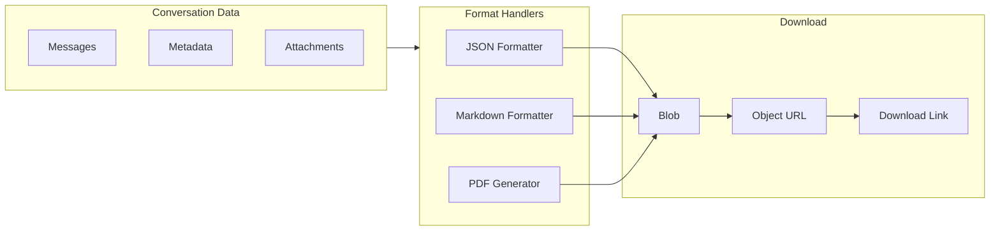

# Conversation Export

## Introduction

Users often need to save their conversations for reference, sharing, or archival purposes. A robust export feature supports multiple formats—JSON for data portability, Markdown for readability, and PDF for professional documents.

In this lesson, we'll implement comprehensive export functionality with format selection and download handling.

### What We'll Cover

- Export architecture and data preparation
- JSON export for data portability
- Markdown export for readable documents
- PDF generation with formatting
- Export UI with format selection
- Batch export for multiple conversations

### Prerequisites

- [Conversation History Sidebar](./02-conversation-history-sidebar.md)
- File handling with Blob API
- Basic understanding of document generation

---

## Export Architecture



---

## Export Data Types

```tsx
interface ExportOptions {
  format: 'json' | 'markdown' | 'pdf';
  includeMetadata: boolean;
  includeTimestamps: boolean;
  includeSystemMessages: boolean;
}

interface ExportableConversation {
  id: string;
  title: string;
  createdAt: Date;
  updatedAt: Date;
  messages: ExportableMessage[];
  metadata?: Record<string, any>;
}

interface ExportableMessage {
  role: 'user' | 'assistant' | 'system';
  content: string;
  timestamp: Date;
  attachments?: { name: string; type: string; }[];
}
```

---

## JSON Export

```tsx
function exportToJSON(
  conversation: ExportableConversation,
  options: ExportOptions
): string {
  const exportData = {
    exportedAt: new Date().toISOString(),
    version: '1.0',
    conversation: {
      id: conversation.id,
      title: conversation.title,
      createdAt: conversation.createdAt.toISOString(),
      updatedAt: conversation.updatedAt.toISOString(),
      messages: conversation.messages
        .filter(m => options.includeSystemMessages || m.role !== 'system')
        .map(message => ({
          role: message.role,
          content: message.content,
          ...(options.includeTimestamps && {
            timestamp: message.timestamp.toISOString()
          }),
          ...(message.attachments?.length && {
            attachments: message.attachments
          })
        })),
      ...(options.includeMetadata && conversation.metadata && {
        metadata: conversation.metadata
      })
    }
  };
  
  return JSON.stringify(exportData, null, 2);
}
```

---

## Markdown Export

```tsx
function exportToMarkdown(
  conversation: ExportableConversation,
  options: ExportOptions
): string {
  const lines: string[] = [];
  
  // Header
  lines.push(`# ${conversation.title}`);
  lines.push('');
  
  // Metadata
  if (options.includeMetadata) {
    lines.push(`> **Created:** ${formatDate(conversation.createdAt)}`);
    lines.push(`> **Messages:** ${conversation.messages.length}`);
    lines.push('');
  }
  
  lines.push('---');
  lines.push('');
  
  // Messages
  const messages = options.includeSystemMessages
    ? conversation.messages
    : conversation.messages.filter(m => m.role !== 'system');
  
  for (const message of messages) {
    // Role header
    const roleLabel = message.role === 'user' ? '👤 **User**' : '🤖 **Assistant**';
    
    if (options.includeTimestamps) {
      lines.push(`### ${roleLabel} — ${formatTime(message.timestamp)}`);
    } else {
      lines.push(`### ${roleLabel}`);
    }
    lines.push('');
    
    // Content
    lines.push(message.content);
    lines.push('');
    
    // Attachments
    if (message.attachments?.length) {
      lines.push('**Attachments:**');
      for (const att of message.attachments) {
        lines.push(`- ${att.name} (${att.type})`);
      }
      lines.push('');
    }
    
    lines.push('---');
    lines.push('');
  }
  
  // Footer
  lines.push(`*Exported on ${formatDate(new Date())}*`);
  
  return lines.join('\n');
}

function formatDate(date: Date): string {
  return date.toLocaleDateString('en-US', {
    year: 'numeric',
    month: 'long',
    day: 'numeric'
  });
}

function formatTime(date: Date): string {
  return date.toLocaleTimeString('en-US', {
    hour: '2-digit',
    minute: '2-digit'
  });
}
```

---

## PDF Export

```tsx
// Using jsPDF library
import { jsPDF } from 'jspdf';

async function exportToPDF(
  conversation: ExportableConversation,
  options: ExportOptions
): Promise<Blob> {
  const doc = new jsPDF();
  const pageWidth = doc.internal.pageSize.getWidth();
  const margin = 20;
  const contentWidth = pageWidth - 2 * margin;
  let yPosition = margin;
  
  // Title
  doc.setFontSize(18);
  doc.setFont('helvetica', 'bold');
  doc.text(conversation.title, margin, yPosition);
  yPosition += 10;
  
  // Metadata
  if (options.includeMetadata) {
    doc.setFontSize(10);
    doc.setFont('helvetica', 'normal');
    doc.setTextColor(100);
    doc.text(`Created: ${formatDate(conversation.createdAt)}`, margin, yPosition);
    yPosition += 6;
    doc.text(`Messages: ${conversation.messages.length}`, margin, yPosition);
    yPosition += 10;
  }
  
  // Divider
  doc.setDrawColor(200);
  doc.line(margin, yPosition, pageWidth - margin, yPosition);
  yPosition += 10;
  
  // Messages
  const messages = options.includeSystemMessages
    ? conversation.messages
    : conversation.messages.filter(m => m.role !== 'system');
  
  for (const message of messages) {
    // Check if we need a new page
    if (yPosition > 260) {
      doc.addPage();
      yPosition = margin;
    }
    
    // Role header
    doc.setFontSize(11);
    doc.setFont('helvetica', 'bold');
    doc.setTextColor(message.role === 'user' ? '#2563eb' : '#059669');
    
    const roleLabel = message.role === 'user' ? 'User' : 'Assistant';
    const timestamp = options.includeTimestamps
      ? ` — ${formatTime(message.timestamp)}`
      : '';
    
    doc.text(`${roleLabel}${timestamp}`, margin, yPosition);
    yPosition += 7;
    
    // Content
    doc.setFontSize(10);
    doc.setFont('helvetica', 'normal');
    doc.setTextColor(0);
    
    const lines = doc.splitTextToSize(message.content, contentWidth);
    
    for (const line of lines) {
      if (yPosition > 280) {
        doc.addPage();
        yPosition = margin;
      }
      doc.text(line, margin, yPosition);
      yPosition += 5;
    }
    
    yPosition += 8;
  }
  
  // Footer
  const pageCount = doc.getNumberOfPages();
  for (let i = 1; i <= pageCount; i++) {
    doc.setPage(i);
    doc.setFontSize(8);
    doc.setTextColor(150);
    doc.text(
      `Page ${i} of ${pageCount} | Exported ${formatDate(new Date())}`,
      margin,
      290
    );
  }
  
  return doc.output('blob');
}
```

---

## Download Handler

```tsx
function downloadBlob(
  blob: Blob,
  filename: string
): void {
  // Create object URL
  const url = URL.createObjectURL(blob);
  
  // Create temporary link
  const link = document.createElement('a');
  link.href = url;
  link.download = filename;
  
  // Trigger download
  document.body.appendChild(link);
  link.click();
  
  // Cleanup
  document.body.removeChild(link);
  URL.revokeObjectURL(url);
}

function getExportFilename(
  title: string,
  format: ExportOptions['format']
): string {
  // Sanitize title for filename
  const sanitized = title
    .toLowerCase()
    .replace(/[^a-z0-9]+/g, '-')
    .replace(/(^-|-$)/g, '')
    .slice(0, 50);
  
  const timestamp = new Date().toISOString().slice(0, 10);
  const extension = format === 'markdown' ? 'md' : format;
  
  return `${sanitized}-${timestamp}.${extension}`;
}
```

---

## Export Hook

```tsx
interface UseExportOptions {
  onExportStart?: () => void;
  onExportComplete?: (filename: string) => void;
  onExportError?: (error: Error) => void;
}

function useExportConversation(options: UseExportOptions = {}) {
  const [isExporting, setIsExporting] = useState(false);
  const [progress, setProgress] = useState(0);
  
  const exportConversation = async (
    conversation: ExportableConversation,
    exportOptions: ExportOptions
  ) => {
    setIsExporting(true);
    setProgress(0);
    options.onExportStart?.();
    
    try {
      let blob: Blob;
      
      setProgress(30);
      
      switch (exportOptions.format) {
        case 'json': {
          const json = exportToJSON(conversation, exportOptions);
          blob = new Blob([json], { type: 'application/json' });
          break;
        }
        case 'markdown': {
          const md = exportToMarkdown(conversation, exportOptions);
          blob = new Blob([md], { type: 'text/markdown' });
          break;
        }
        case 'pdf': {
          blob = await exportToPDF(conversation, exportOptions);
          break;
        }
      }
      
      setProgress(80);
      
      const filename = getExportFilename(
        conversation.title,
        exportOptions.format
      );
      
      downloadBlob(blob, filename);
      
      setProgress(100);
      options.onExportComplete?.(filename);
      
    } catch (error) {
      options.onExportError?.(error as Error);
    } finally {
      setIsExporting(false);
    }
  };
  
  return { exportConversation, isExporting, progress };
}
```

---

## Export Dialog Component

```tsx
interface ExportDialogProps {
  conversation: ExportableConversation;
  isOpen: boolean;
  onClose: () => void;
}

function ExportDialog({ conversation, isOpen, onClose }: ExportDialogProps) {
  const [format, setFormat] = useState<ExportOptions['format']>('markdown');
  const [includeMetadata, setIncludeMetadata] = useState(true);
  const [includeTimestamps, setIncludeTimestamps] = useState(true);
  const [includeSystemMessages, setIncludeSystemMessages] = useState(false);
  
  const { exportConversation, isExporting, progress } = useExportConversation({
    onExportComplete: (filename) => {
      onClose();
      toast.success(`Exported as ${filename}`);
    },
    onExportError: (error) => {
      toast.error(`Export failed: ${error.message}`);
    }
  });
  
  const handleExport = () => {
    exportConversation(conversation, {
      format,
      includeMetadata,
      includeTimestamps,
      includeSystemMessages
    });
  };
  
  if (!isOpen) return null;
  
  return (
    <div className="fixed inset-0 z-50 flex items-center justify-center bg-black/50">
      <div className="
        w-full max-w-md
        bg-white dark:bg-gray-800
        rounded-xl shadow-xl
        overflow-hidden
      ">
        {/* Header */}
        <div className="px-6 py-4 border-b border-gray-200 dark:border-gray-700">
          <h2 className="text-lg font-semibold text-gray-900 dark:text-white">
            Export Conversation
          </h2>
          <p className="text-sm text-gray-500 mt-1">
            {conversation.title}
          </p>
        </div>
        
        {/* Content */}
        <div className="px-6 py-4 space-y-4">
          {/* Format selection */}
          <div>
            <label className="block text-sm font-medium text-gray-700 dark:text-gray-300 mb-2">
              Export Format
            </label>
            <div className="grid grid-cols-3 gap-2">
              {(['json', 'markdown', 'pdf'] as const).map((f) => (
                <button
                  key={f}
                  onClick={() => setFormat(f)}
                  className={`
                    px-4 py-2.5 rounded-lg
                    text-sm font-medium
                    transition-colors
                    ${format === f
                      ? 'bg-blue-500 text-white'
                      : 'bg-gray-100 text-gray-700 hover:bg-gray-200 dark:bg-gray-700 dark:text-gray-300'
                    }
                  `}
                >
                  {f.toUpperCase()}
                </button>
              ))}
            </div>
          </div>
          
          {/* Options */}
          <div className="space-y-3">
            <label className="flex items-center gap-3 cursor-pointer">
              <input
                type="checkbox"
                checked={includeMetadata}
                onChange={e => setIncludeMetadata(e.target.checked)}
                className="w-4 h-4 rounded border-gray-300"
              />
              <span className="text-sm text-gray-700 dark:text-gray-300">
                Include metadata
              </span>
            </label>
            
            <label className="flex items-center gap-3 cursor-pointer">
              <input
                type="checkbox"
                checked={includeTimestamps}
                onChange={e => setIncludeTimestamps(e.target.checked)}
                className="w-4 h-4 rounded border-gray-300"
              />
              <span className="text-sm text-gray-700 dark:text-gray-300">
                Include timestamps
              </span>
            </label>
            
            <label className="flex items-center gap-3 cursor-pointer">
              <input
                type="checkbox"
                checked={includeSystemMessages}
                onChange={e => setIncludeSystemMessages(e.target.checked)}
                className="w-4 h-4 rounded border-gray-300"
              />
              <span className="text-sm text-gray-700 dark:text-gray-300">
                Include system messages
              </span>
            </label>
          </div>
          
          {/* Format description */}
          <div className="p-3 bg-gray-50 dark:bg-gray-700/50 rounded-lg text-sm text-gray-600 dark:text-gray-400">
            {format === 'json' && (
              <p>Structured data format, ideal for importing into other tools or backup.</p>
            )}
            {format === 'markdown' && (
              <p>Human-readable text format, works with note apps and documentation.</p>
            )}
            {format === 'pdf' && (
              <p>Professional document format, best for printing and sharing.</p>
            )}
          </div>
        </div>
        
        {/* Progress bar */}
        {isExporting && (
          <div className="px-6">
            <div className="w-full h-2 bg-gray-200 rounded-full overflow-hidden">
              <div
                className="h-full bg-blue-500 transition-all duration-300"
                style={{ width: `${progress}%` }}
              />
            </div>
          </div>
        )}
        
        {/* Footer */}
        <div className="px-6 py-4 border-t border-gray-200 dark:border-gray-700 flex justify-end gap-3">
          <button
            onClick={onClose}
            disabled={isExporting}
            className="
              px-4 py-2 rounded-lg
              text-sm font-medium
              text-gray-700 dark:text-gray-300
              hover:bg-gray-100 dark:hover:bg-gray-700
              disabled:opacity-50
            "
          >
            Cancel
          </button>
          <button
            onClick={handleExport}
            disabled={isExporting}
            className="
              px-4 py-2 rounded-lg
              text-sm font-medium
              bg-blue-500 text-white
              hover:bg-blue-600
              disabled:opacity-50
              flex items-center gap-2
            "
          >
            {isExporting ? (
              <>
                <LoadingSpinner className="w-4 h-4" />
                Exporting...
              </>
            ) : (
              <>
                <DownloadIcon className="w-4 h-4" />
                Export
              </>
            )}
          </button>
        </div>
      </div>
    </div>
  );
}
```

---

## Batch Export

```tsx
async function exportMultipleConversations(
  conversations: ExportableConversation[],
  options: ExportOptions
): Promise<void> {
  if (options.format === 'pdf') {
    // PDF: Combine into single document
    const doc = new jsPDF();
    
    for (let i = 0; i < conversations.length; i++) {
      if (i > 0) doc.addPage();
      await addConversationToPDF(doc, conversations[i], options);
    }
    
    const blob = doc.output('blob');
    downloadBlob(blob, `conversations-export-${Date.now()}.pdf`);
    
  } else if (options.format === 'json') {
    // JSON: Array of conversations
    const exportData = {
      exportedAt: new Date().toISOString(),
      count: conversations.length,
      conversations: conversations.map(c => ({
        ...prepareConversation(c, options)
      }))
    };
    
    const blob = new Blob(
      [JSON.stringify(exportData, null, 2)],
      { type: 'application/json' }
    );
    downloadBlob(blob, `conversations-export-${Date.now()}.json`);
    
  } else {
    // Markdown: ZIP file with multiple .md files
    const JSZip = (await import('jszip')).default;
    const zip = new JSZip();
    
    for (const conv of conversations) {
      const md = exportToMarkdown(conv, options);
      const filename = getExportFilename(conv.title, 'markdown');
      zip.file(filename, md);
    }
    
    const blob = await zip.generateAsync({ type: 'blob' });
    downloadBlob(blob, `conversations-export-${Date.now()}.zip`);
  }
}
```

---

## Best Practices

| ✅ Do | ❌ Don't |
|-------|---------|
| Show export progress | Block UI without feedback |
| Sanitize filenames | Use special characters in filenames |
| Support format selection | Force single format |
| Include export metadata | Export without context |
| Handle large conversations | Assume small data size |
| Cleanup object URLs | Leave memory leaks |

---

## Common Pitfalls

| ❌ Mistake | ✅ Solution |
|-----------|-------------|
| PDF runs out of pages | Check y-position, add pages |
| Long titles break filename | Sanitize and truncate |
| Unicode issues in export | Use proper encoding |
| No error handling | Wrap in try/catch |
| Slow with large chats | Show progress indicator |

---

## Hands-on Exercise

### Your Task

Build a conversation export feature with:
1. Format selection (JSON, Markdown, PDF)
2. Options for metadata/timestamps
3. Download with proper filename
4. Progress indication during export

### Requirements

1. Create export formatters for each type
2. Build export dialog with options
3. Generate appropriate MIME types
4. Sanitize filenames properly
5. Handle errors gracefully

<details>
<summary>💡 Hints (click to expand)</summary>

- Use `Blob` constructor with proper type
- `URL.createObjectURL` for downloads
- `jsPDF` for PDF generation
- Revoke object URLs after download
- Show progress for multi-step export

</details>

---

## Summary

✅ **JSON export** preserves structured data  
✅ **Markdown export** creates readable documents  
✅ **PDF generation** produces professional output  
✅ **Blob API** enables browser downloads  
✅ **Progress feedback** improves UX  
✅ **Batch export** handles multiple conversations

---

## Further Reading

- [jsPDF Documentation](https://artskydj.github.io/jsPDF/docs/jsPDF.html)
- [Blob API - MDN](https://developer.mozilla.org/en-US/docs/Web/API/Blob)
- [JSZip](https://stuk.github.io/jszip/) - ZIP file generation

---

**Previous:** [Conversation History Sidebar](./02-conversation-history-sidebar.md)  
**Next:** [Share Conversation](./04-share-conversation.md)

<!-- 
Sources Consulted:
- jsPDF: https://artskydj.github.io/jsPDF/docs/jsPDF.html
- MDN Blob API: https://developer.mozilla.org/en-US/docs/Web/API/Blob
- MDN URL.createObjectURL: https://developer.mozilla.org/en-US/docs/Web/API/URL/createObjectURL
- JSZip: https://stuk.github.io/jszip/
-->
