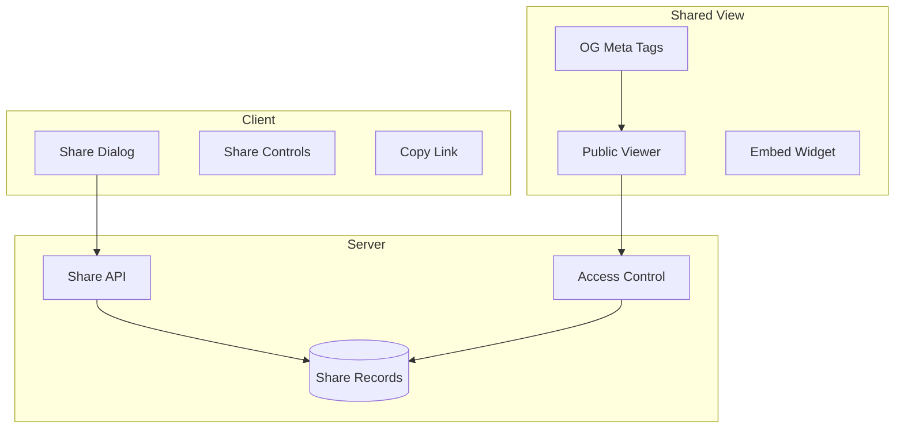

# Share Conversation

## Introduction

Sharing conversations allows users to collaborate, get feedback, or showcase AI interactions. A well-designed sharing system provides control over visibility, generates accessible links, and displays attractive previews when shared on social platforms.

In this lesson, we'll implement shareable conversation links with privacy controls and social preview support.

### What We'll Cover

- Shareable link generation
- Privacy levels (public, unlisted, private)
- Share settings management
- Open Graph meta tags for previews
- Revoke and expiration options
- Embed widget support

### Prerequisites

- [Conversation Export](./03-conversation-export.md)
- Backend API concepts
- URL handling

---

## Share Architecture



---

## Share Data Types

```tsx
type PrivacyLevel = 'public' | 'unlisted' | 'private';

interface ShareSettings {
  id: string;
  conversationId: string;
  shareUrl: string;
  shortCode: string;
  privacy: PrivacyLevel;
  allowedEmails?: string[];
  password?: string;
  expiresAt?: Date;
  createdAt: Date;
  viewCount: number;
}

interface CreateShareRequest {
  conversationId: string;
  privacy: PrivacyLevel;
  password?: string;
  expiresIn?: number; // hours
  allowedEmails?: string[];
}

interface ShareResponse {
  success: boolean;
  shareUrl: string;
  shortCode: string;
  settings: ShareSettings;
}
```

---

## Share API Client

```tsx
const shareAPI = {
  async create(request: CreateShareRequest): Promise<ShareResponse> {
    const response = await fetch('/api/shares', {
      method: 'POST',
      headers: { 'Content-Type': 'application/json' },
      body: JSON.stringify(request)
    });
    
    if (!response.ok) {
      throw new Error('Failed to create share');
    }
    
    return response.json();
  },
  
  async get(conversationId: string): Promise<ShareSettings | null> {
    const response = await fetch(`/api/shares/${conversationId}`);
    
    if (response.status === 404) return null;
    if (!response.ok) throw new Error('Failed to get share');
    
    return response.json();
  },
  
  async update(
    shareId: string,
    updates: Partial<CreateShareRequest>
  ): Promise<ShareSettings> {
    const response = await fetch(`/api/shares/${shareId}`, {
      method: 'PATCH',
      headers: { 'Content-Type': 'application/json' },
      body: JSON.stringify(updates)
    });
    
    if (!response.ok) throw new Error('Failed to update share');
    return response.json();
  },
  
  async revoke(shareId: string): Promise<void> {
    const response = await fetch(`/api/shares/${shareId}`, {
      method: 'DELETE'
    });
    
    if (!response.ok) throw new Error('Failed to revoke share');
  }
};
```

---

## Share Hook

```tsx
function useShareConversation(conversationId: string) {
  const [shareSettings, setShareSettings] = useState<ShareSettings | null>(null);
  const [isLoading, setIsLoading] = useState(false);
  const [error, setError] = useState<string | null>(null);
  
  // Load existing share settings
  useEffect(() => {
    const loadShare = async () => {
      try {
        const settings = await shareAPI.get(conversationId);
        setShareSettings(settings);
      } catch (err) {
        // No share exists yet
      }
    };
    loadShare();
  }, [conversationId]);
  
  const createShare = async (options: Omit<CreateShareRequest, 'conversationId'>) => {
    setIsLoading(true);
    setError(null);
    
    try {
      const result = await shareAPI.create({
        conversationId,
        ...options
      });
      setShareSettings(result.settings);
      return result;
    } catch (err) {
      setError((err as Error).message);
      throw err;
    } finally {
      setIsLoading(false);
    }
  };
  
  const updateShare = async (updates: Partial<CreateShareRequest>) => {
    if (!shareSettings) return;
    
    setIsLoading(true);
    try {
      const updated = await shareAPI.update(shareSettings.id, updates);
      setShareSettings(updated);
    } catch (err) {
      setError((err as Error).message);
    } finally {
      setIsLoading(false);
    }
  };
  
  const revokeShare = async () => {
    if (!shareSettings) return;
    
    setIsLoading(true);
    try {
      await shareAPI.revoke(shareSettings.id);
      setShareSettings(null);
    } catch (err) {
      setError((err as Error).message);
    } finally {
      setIsLoading(false);
    }
  };
  
  const copyLink = async () => {
    if (!shareSettings) return false;
    
    try {
      await navigator.clipboard.writeText(shareSettings.shareUrl);
      return true;
    } catch {
      return false;
    }
  };
  
  return {
    shareSettings,
    isLoading,
    error,
    isShared: !!shareSettings,
    createShare,
    updateShare,
    revokeShare,
    copyLink
  };
}
```

---

## Share Dialog Component

```tsx
interface ShareDialogProps {
  conversation: Conversation;
  isOpen: boolean;
  onClose: () => void;
}

function ShareDialog({ conversation, isOpen, onClose }: ShareDialogProps) {
  const {
    shareSettings,
    isLoading,
    isShared,
    createShare,
    updateShare,
    revokeShare,
    copyLink
  } = useShareConversation(conversation.id);
  
  const [privacy, setPrivacy] = useState<PrivacyLevel>('unlisted');
  const [password, setPassword] = useState('');
  const [usePassword, setUsePassword] = useState(false);
  const [expiresIn, setExpiresIn] = useState<number | null>(null);
  const [copied, setCopied] = useState(false);
  
  useEffect(() => {
    if (shareSettings) {
      setPrivacy(shareSettings.privacy);
      setUsePassword(!!shareSettings.password);
    }
  }, [shareSettings]);
  
  const handleCreate = async () => {
    await createShare({
      privacy,
      password: usePassword ? password : undefined,
      expiresIn: expiresIn || undefined
    });
  };
  
  const handleCopy = async () => {
    const success = await copyLink();
    if (success) {
      setCopied(true);
      setTimeout(() => setCopied(false), 2000);
    }
  };
  
  if (!isOpen) return null;
  
  return (
    <div className="fixed inset-0 z-50 flex items-center justify-center bg-black/50">
      <div className="
        w-full max-w-md
        bg-white dark:bg-gray-800
        rounded-xl shadow-xl
      ">
        {/* Header */}
        <div className="px-6 py-4 border-b border-gray-200 dark:border-gray-700">
          <h2 className="text-lg font-semibold text-gray-900 dark:text-white">
            Share Conversation
          </h2>
        </div>
        
        <div className="px-6 py-4 space-y-4">
          {/* Share link display */}
          {isShared && shareSettings && (
            <div className="p-3 bg-gray-50 dark:bg-gray-700/50 rounded-lg">
              <label className="block text-xs font-medium text-gray-500 mb-1">
                Share Link
              </label>
              <div className="flex gap-2">
                <input
                  type="text"
                  value={shareSettings.shareUrl}
                  readOnly
                  className="
                    flex-1 px-3 py-2
                    text-sm
                    bg-white dark:bg-gray-700
                    border border-gray-200 dark:border-gray-600
                    rounded-lg
                    focus:outline-none
                  "
                />
                <button
                  onClick={handleCopy}
                  className="
                    px-3 py-2
                    bg-blue-500 text-white
                    rounded-lg text-sm font-medium
                    hover:bg-blue-600
                  "
                >
                  {copied ? '✓ Copied' : 'Copy'}
                </button>
              </div>
              <p className="mt-2 text-xs text-gray-500">
                {shareSettings.viewCount} view{shareSettings.viewCount !== 1 ? 's' : ''}
              </p>
            </div>
          )}
          
          {/* Privacy selection */}
          <div>
            <label className="block text-sm font-medium text-gray-700 dark:text-gray-300 mb-2">
              Privacy
            </label>
            <div className="space-y-2">
              <PrivacyOption
                value="public"
                selected={privacy === 'public'}
                onSelect={() => setPrivacy('public')}
                title="Public"
                description="Anyone with the link can view. Listed in search."
                icon={<GlobeIcon className="w-5 h-5" />}
              />
              <PrivacyOption
                value="unlisted"
                selected={privacy === 'unlisted'}
                onSelect={() => setPrivacy('unlisted')}
                title="Unlisted"
                description="Anyone with the link can view. Not listed in search."
                icon={<LinkIcon className="w-5 h-5" />}
              />
              <PrivacyOption
                value="private"
                selected={privacy === 'private'}
                onSelect={() => setPrivacy('private')}
                title="Private"
                description="Only specific people can view."
                icon={<LockIcon className="w-5 h-5" />}
              />
            </div>
          </div>
          
          {/* Password protection */}
          <div className="space-y-2">
            <label className="flex items-center gap-2 cursor-pointer">
              <input
                type="checkbox"
                checked={usePassword}
                onChange={e => setUsePassword(e.target.checked)}
                className="w-4 h-4 rounded"
              />
              <span className="text-sm text-gray-700 dark:text-gray-300">
                Password protect
              </span>
            </label>
            
            {usePassword && (
              <input
                type="password"
                value={password}
                onChange={e => setPassword(e.target.value)}
                placeholder="Enter password"
                className="
                  w-full px-3 py-2
                  text-sm
                  border border-gray-200 dark:border-gray-600
                  rounded-lg
                  focus:outline-none focus:ring-2 focus:ring-blue-500
                "
              />
            )}
          </div>
          
          {/* Expiration */}
          <div>
            <label className="block text-sm font-medium text-gray-700 dark:text-gray-300 mb-2">
              Expires after
            </label>
            <select
              value={expiresIn || ''}
              onChange={e => setExpiresIn(e.target.value ? Number(e.target.value) : null)}
              className="
                w-full px-3 py-2
                text-sm
                border border-gray-200 dark:border-gray-600
                rounded-lg
                focus:outline-none focus:ring-2 focus:ring-blue-500
              "
            >
              <option value="">Never</option>
              <option value="1">1 hour</option>
              <option value="24">24 hours</option>
              <option value="168">7 days</option>
              <option value="720">30 days</option>
            </select>
          </div>
        </div>
        
        {/* Footer */}
        <div className="px-6 py-4 border-t border-gray-200 dark:border-gray-700 flex justify-between">
          {isShared ? (
            <button
              onClick={revokeShare}
              disabled={isLoading}
              className="px-4 py-2 text-red-500 hover:bg-red-50 rounded-lg text-sm"
            >
              Stop sharing
            </button>
          ) : (
            <div />
          )}
          
          <div className="flex gap-3">
            <button
              onClick={onClose}
              className="px-4 py-2 text-gray-700 hover:bg-gray-100 rounded-lg text-sm"
            >
              Cancel
            </button>
            <button
              onClick={isShared ? () => updateShare({ privacy, password }) : handleCreate}
              disabled={isLoading}
              className="
                px-4 py-2
                bg-blue-500 text-white
                rounded-lg text-sm font-medium
                hover:bg-blue-600
                disabled:opacity-50
              "
            >
              {isLoading ? 'Saving...' : isShared ? 'Update' : 'Create Link'}
            </button>
          </div>
        </div>
      </div>
    </div>
  );
}

function PrivacyOption({
  value,
  selected,
  onSelect,
  title,
  description,
  icon
}: {
  value: PrivacyLevel;
  selected: boolean;
  onSelect: () => void;
  title: string;
  description: string;
  icon: React.ReactNode;
}) {
  return (
    <button
      onClick={onSelect}
      className={`
        w-full p-3
        flex items-start gap-3
        rounded-lg border
        text-left
        transition-colors
        ${selected
          ? 'border-blue-500 bg-blue-50 dark:bg-blue-900/20'
          : 'border-gray-200 dark:border-gray-600 hover:bg-gray-50 dark:hover:bg-gray-700'
        }
      `}
    >
      <div className={selected ? 'text-blue-500' : 'text-gray-400'}>
        {icon}
      </div>
      <div>
        <div className="font-medium text-gray-900 dark:text-white text-sm">
          {title}
        </div>
        <div className="text-xs text-gray-500 mt-0.5">
          {description}
        </div>
      </div>
      <div className="ml-auto">
        <div className={`
          w-5 h-5 rounded-full border-2
          flex items-center justify-center
          ${selected
            ? 'border-blue-500 bg-blue-500'
            : 'border-gray-300 dark:border-gray-500'
          }
        `}>
          {selected && <CheckIcon className="w-3 h-3 text-white" />}
        </div>
      </div>
    </button>
  );
}
```

---

## Open Graph Meta Tags

```tsx
// Server-side: Generate meta tags for shared conversation
function generateShareMetaTags(share: ShareSettings, conversation: Conversation) {
  const title = conversation.title;
  const description = `AI conversation: ${conversation.messages[0]?.content.slice(0, 150)}...`;
  const url = share.shareUrl;
  const image = `${process.env.BASE_URL}/api/shares/${share.shortCode}/og-image`;
  
  return {
    title: `${title} | ChatApp`,
    description,
    openGraph: {
      title,
      description,
      url,
      type: 'article',
      images: [{ url: image, width: 1200, height: 630 }]
    },
    twitter: {
      card: 'summary_large_image',
      title,
      description,
      images: [image]
    }
  };
}

// Next.js page example
export async function generateMetadata({ params }: { params: { code: string } }) {
  const share = await getShareByCode(params.code);
  if (!share) return { title: 'Not Found' };
  
  const conversation = await getConversation(share.conversationId);
  return generateShareMetaTags(share, conversation);
}
```

---

## Dynamic OG Image Generation

```tsx
// API route: /api/shares/[code]/og-image
import { ImageResponse } from 'next/og';

export async function GET(
  request: Request,
  { params }: { params: { code: string } }
) {
  const share = await getShareByCode(params.code);
  if (!share) return new Response('Not found', { status: 404 });
  
  const conversation = await getConversation(share.conversationId);
  
  return new ImageResponse(
    (
      <div
        style={{
          width: '100%',
          height: '100%',
          display: 'flex',
          flexDirection: 'column',
          backgroundColor: '#0f172a',
          padding: '60px'
        }}
      >
        {/* Logo */}
        <div style={{ display: 'flex', alignItems: 'center', gap: '12px' }}>
          <div
            style={{
              width: '48px',
              height: '48px',
              borderRadius: '12px',
              backgroundColor: '#3b82f6',
              display: 'flex',
              alignItems: 'center',
              justifyContent: 'center',
              color: 'white',
              fontSize: '24px',
              fontWeight: 'bold'
            }}
          >
            C
          </div>
          <span style={{ color: '#94a3b8', fontSize: '24px' }}>
            ChatApp
          </span>
        </div>
        
        {/* Title */}
        <div
          style={{
            marginTop: '40px',
            fontSize: '56px',
            fontWeight: 'bold',
            color: 'white',
            lineHeight: 1.2
          }}
        >
          {conversation.title}
        </div>
        
        {/* Preview */}
        <div
          style={{
            marginTop: '24px',
            fontSize: '24px',
            color: '#94a3b8',
            lineHeight: 1.4
          }}
        >
          {conversation.messages[0]?.content.slice(0, 120)}...
        </div>
        
        {/* Footer */}
        <div
          style={{
            marginTop: 'auto',
            display: 'flex',
            justifyContent: 'space-between',
            alignItems: 'center',
            color: '#64748b',
            fontSize: '20px'
          }}
        >
          <span>{conversation.messages.length} messages</span>
          <span>{formatDate(share.createdAt)}</span>
        </div>
      </div>
    ),
    {
      width: 1200,
      height: 630
    }
  );
}
```

---

## Shared Conversation Viewer

```tsx
interface SharedViewerProps {
  share: ShareSettings;
  conversation: Conversation;
}

function SharedConversationViewer({ share, conversation }: SharedViewerProps) {
  return (
    <div className="min-h-screen bg-gray-50 dark:bg-gray-900">
      {/* Header */}
      <header className="
        sticky top-0 z-10
        bg-white dark:bg-gray-800
        border-b border-gray-200 dark:border-gray-700
        px-4 py-3
      ">
        <div className="max-w-3xl mx-auto flex items-center justify-between">
          <div className="flex items-center gap-3">
            <Logo className="w-8 h-8" />
            <div>
              <h1 className="font-semibold text-gray-900 dark:text-white">
                {conversation.title}
              </h1>
              <p className="text-xs text-gray-500">
                Shared conversation • {conversation.messages.length} messages
              </p>
            </div>
          </div>
          
          <div className="flex items-center gap-2">
            <button className="
              px-3 py-1.5
              text-sm
              text-gray-600 hover:text-gray-900
              dark:text-gray-400 dark:hover:text-white
            ">
              Copy link
            </button>
            <a
              href="/"
              className="
                px-3 py-1.5
                bg-blue-500 text-white
                text-sm font-medium
                rounded-lg
                hover:bg-blue-600
              "
            >
              Try ChatApp
            </a>
          </div>
        </div>
      </header>
      
      {/* Messages */}
      <main className="max-w-3xl mx-auto py-8 px-4">
        <div className="space-y-4">
          {conversation.messages
            .filter(m => m.role !== 'system')
            .map((message, index) => (
              <div
                key={index}
                className={`
                  p-4 rounded-lg
                  ${message.role === 'user'
                    ? 'bg-blue-50 dark:bg-blue-900/20'
                    : 'bg-white dark:bg-gray-800'
                  }
                `}
              >
                <div className="flex items-center gap-2 mb-2">
                  {message.role === 'user' ? (
                    <UserIcon className="w-5 h-5 text-blue-500" />
                  ) : (
                    <BotIcon className="w-5 h-5 text-green-500" />
                  )}
                  <span className="font-medium text-sm text-gray-700 dark:text-gray-300">
                    {message.role === 'user' ? 'User' : 'Assistant'}
                  </span>
                </div>
                <div className="prose dark:prose-invert max-w-none">
                  <Markdown>{message.content}</Markdown>
                </div>
              </div>
            ))}
        </div>
      </main>
      
      {/* Footer */}
      <footer className="py-8 text-center text-sm text-gray-500">
        <p>This conversation was shared from ChatApp</p>
        <p className="mt-1">
          <a href="/" className="text-blue-500 hover:underline">
            Start your own conversation →
          </a>
        </p>
      </footer>
    </div>
  );
}
```

---

## Password Protection Flow

```tsx
function PasswordProtectedViewer({ shareCode }: { shareCode: string }) {
  const [password, setPassword] = useState('');
  const [error, setError] = useState('');
  const [isUnlocked, setIsUnlocked] = useState(false);
  const [conversation, setConversation] = useState<Conversation | null>(null);
  
  const handleSubmit = async (e: React.FormEvent) => {
    e.preventDefault();
    setError('');
    
    try {
      const response = await fetch(`/api/shares/${shareCode}/unlock`, {
        method: 'POST',
        headers: { 'Content-Type': 'application/json' },
        body: JSON.stringify({ password })
      });
      
      if (!response.ok) {
        setError('Incorrect password');
        return;
      }
      
      const data = await response.json();
      setConversation(data.conversation);
      setIsUnlocked(true);
    } catch {
      setError('Failed to unlock');
    }
  };
  
  if (isUnlocked && conversation) {
    return <SharedConversationViewer conversation={conversation} share={share} />;
  }
  
  return (
    <div className="min-h-screen flex items-center justify-center bg-gray-100 dark:bg-gray-900">
      <div className="w-full max-w-sm p-6 bg-white dark:bg-gray-800 rounded-xl shadow-lg">
        <div className="text-center mb-6">
          <LockIcon className="w-12 h-12 mx-auto text-gray-400 mb-3" />
          <h1 className="text-xl font-semibold text-gray-900 dark:text-white">
            Password Required
          </h1>
          <p className="text-sm text-gray-500 mt-1">
            This conversation is password protected
          </p>
        </div>
        
        <form onSubmit={handleSubmit} className="space-y-4">
          <input
            type="password"
            value={password}
            onChange={e => setPassword(e.target.value)}
            placeholder="Enter password"
            className="
              w-full px-4 py-3
              border border-gray-200 dark:border-gray-600
              rounded-lg
              focus:outline-none focus:ring-2 focus:ring-blue-500
            "
            autoFocus
          />
          
          {error && (
            <p className="text-sm text-red-500">{error}</p>
          )}
          
          <button
            type="submit"
            className="
              w-full py-3
              bg-blue-500 text-white font-medium
              rounded-lg
              hover:bg-blue-600
            "
          >
            Unlock
          </button>
        </form>
      </div>
    </div>
  );
}
```

---

## Best Practices

| ✅ Do | ❌ Don't |
|-------|---------|
| Generate unique short codes | Use predictable IDs |
| Offer multiple privacy levels | Default to public |
| Show view counts | Hide engagement |
| Support link expiration | Keep links forever |
| Provide revoke option | Make shares permanent |
| Generate attractive previews | Skip Open Graph tags |

---

## Common Pitfalls

| ❌ Mistake | ✅ Solution |
|-----------|-------------|
| Exposing conversation ID | Use random short codes |
| No access control | Check privacy on every request |
| Missing OG image | Generate dynamic preview image |
| Slow page load | Pre-render or cache shared view |
| No mobile optimization | Design responsive viewer |

---

## Hands-on Exercise

### Your Task

Build a conversation sharing system with:
1. Share dialog with privacy options
2. Copy link functionality
3. Password protection option
4. Shared conversation viewer

### Requirements

1. Create share settings UI
2. Implement copy to clipboard
3. Build password entry flow
4. Design read-only viewer
5. Add revoke functionality

<details>
<summary>💡 Hints (click to expand)</summary>

- `navigator.clipboard.writeText()` for copying
- Use short random codes, not UUIDs
- Store password hashes, not plaintext
- Cache shared views aggressively
- Use `ImageResponse` for OG images

</details>

---

## Summary

✅ **Privacy levels** give users control  
✅ **Short codes** provide clean URLs  
✅ **Password protection** adds security  
✅ **OG meta tags** enable rich previews  
✅ **Expiration** limits access duration  
✅ **Read-only viewer** displays shared content

---

## Further Reading

- [Open Graph Protocol](https://ogp.me/)
- [Twitter Cards](https://developer.twitter.com/en/docs/twitter-for-websites/cards/overview/abouts-cards)
- [Next.js OG Image Generation](https://nextjs.org/docs/app/api-reference/file-conventions/metadata/opengraph-image)

---

**Previous:** [Conversation Export](./03-conversation-export.md)  
**Next:** [Branching Conversations](./05-branching-conversations.md)

<!-- 
Sources Consulted:
- Open Graph Protocol: https://ogp.me/
- Twitter Cards Documentation: https://developer.twitter.com/en/docs/twitter-for-websites/cards
- Vercel OG Image Generation: https://vercel.com/docs/functions/og-image-generation
- Next.js Metadata: https://nextjs.org/docs/app/api-reference/file-conventions/metadata/opengraph-image
-->
