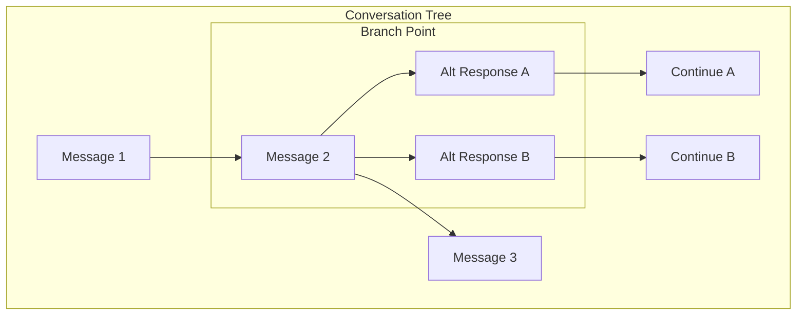

# Branching Conversations

## Introduction

Branching allows users to explore alternative responses, try different prompts from the same point, or create "what if" scenarios without losing the original conversation flow. This feature transforms linear chat into a tree of possibilities.

In this lesson, we'll implement conversation branching with fork creation, tree visualization, and branch navigation.

### What We'll Cover

- Branch data structure design
- Forking from any message
- Branch tree visualization
- Navigation between branches
- Branch comparison view
- Merging concepts

### Prerequisites

- [Share Conversation](./04-share-conversation.md)
- Tree data structures
- React state management

---

## Branch Architecture



---

## Data Structures

```tsx
interface BranchNode {
  id: string;
  parentId: string | null;
  message: Message;
  children: string[];
  branchIndex: number; // 0 = main, 1+ = branches
  createdAt: Date;
}

interface BranchTree {
  rootId: string;
  nodes: Map<string, BranchNode>;
  currentPath: string[]; // IDs from root to current
}

interface ConversationWithBranches {
  id: string;
  title: string;
  tree: BranchTree;
  activeBranchId: string;
}

// Get linear path from root to a specific node
function getPathToNode(tree: BranchTree, nodeId: string): BranchNode[] {
  const path: BranchNode[] = [];
  let current = tree.nodes.get(nodeId);
  
  while (current) {
    path.unshift(current);
    current = current.parentId ? tree.nodes.get(current.parentId) : null;
  }
  
  return path;
}

// Get messages for display (follows current path)
function getActiveMessages(tree: BranchTree): Message[] {
  return tree.currentPath
    .map(id => tree.nodes.get(id)!)
    .map(node => node.message);
}
```

---

## Branch State Management

```tsx
interface BranchState {
  tree: BranchTree;
  activePath: string[];
}

type BranchAction =
  | { type: 'ADD_MESSAGE'; message: Message; parentId: string | null }
  | { type: 'CREATE_BRANCH'; fromNodeId: string; message: Message }
  | { type: 'SWITCH_BRANCH'; nodeId: string }
  | { type: 'DELETE_BRANCH'; nodeId: string };

function branchReducer(state: BranchState, action: BranchAction): BranchState {
  switch (action.type) {
    case 'ADD_MESSAGE': {
      const newNode: BranchNode = {
        id: generateId(),
        parentId: action.parentId,
        message: action.message,
        children: [],
        branchIndex: 0,
        createdAt: new Date()
      };
      
      const newNodes = new Map(state.tree.nodes);
      newNodes.set(newNode.id, newNode);
      
      // Update parent's children
      if (action.parentId) {
        const parent = newNodes.get(action.parentId)!;
        newNodes.set(action.parentId, {
          ...parent,
          children: [...parent.children, newNode.id]
        });
      }
      
      return {
        tree: {
          ...state.tree,
          nodes: newNodes,
          rootId: action.parentId ? state.tree.rootId : newNode.id,
          currentPath: [...state.activePath, newNode.id]
        },
        activePath: [...state.activePath, newNode.id]
      };
    }
    
    case 'CREATE_BRANCH': {
      const parentNode = state.tree.nodes.get(action.fromNodeId);
      if (!parentNode) return state;
      
      const branchIndex = parentNode.children.length;
      
      const newNode: BranchNode = {
        id: generateId(),
        parentId: action.fromNodeId,
        message: action.message,
        children: [],
        branchIndex,
        createdAt: new Date()
      };
      
      const newNodes = new Map(state.tree.nodes);
      newNodes.set(newNode.id, newNode);
      
      // Update parent's children
      newNodes.set(action.fromNodeId, {
        ...parentNode,
        children: [...parentNode.children, newNode.id]
      });
      
      // New path goes up to parent, then to new branch
      const pathToParent = getPathToNode(
        { ...state.tree, nodes: newNodes },
        action.fromNodeId
      ).map(n => n.id);
      
      const newPath = [...pathToParent, newNode.id];
      
      return {
        tree: {
          ...state.tree,
          nodes: newNodes,
          currentPath: newPath
        },
        activePath: newPath
      };
    }
    
    case 'SWITCH_BRANCH': {
      const pathToNode = getPathToNode(state.tree, action.nodeId)
        .map(n => n.id);
      
      return {
        ...state,
        tree: {
          ...state.tree,
          currentPath: pathToNode
        },
        activePath: pathToNode
      };
    }
    
    case 'DELETE_BRANCH': {
      // Delete node and all descendants
      const nodesToDelete = new Set<string>();
      
      function collectDescendants(id: string) {
        nodesToDelete.add(id);
        const node = state.tree.nodes.get(id);
        node?.children.forEach(collectDescendants);
      }
      
      collectDescendants(action.nodeId);
      
      const newNodes = new Map(state.tree.nodes);
      nodesToDelete.forEach(id => newNodes.delete(id));
      
      // Update parent's children
      const deletedNode = state.tree.nodes.get(action.nodeId);
      if (deletedNode?.parentId) {
        const parent = newNodes.get(deletedNode.parentId)!;
        newNodes.set(deletedNode.parentId, {
          ...parent,
          children: parent.children.filter(id => id !== action.nodeId)
        });
      }
      
      // If current path includes deleted node, switch to parent
      const newPath = state.activePath.filter(id => !nodesToDelete.has(id));
      
      return {
        tree: {
          ...state.tree,
          nodes: newNodes,
          currentPath: newPath
        },
        activePath: newPath
      };
    }
    
    default:
      return state;
  }
}
```

---

## Branch Hook

```tsx
function useBranchConversation(conversationId: string) {
  const [state, dispatch] = useReducer(branchReducer, {
    tree: { rootId: '', nodes: new Map(), currentPath: [] },
    activePath: []
  });
  
  const addMessage = useCallback((message: Message) => {
    const parentId = state.activePath[state.activePath.length - 1] || null;
    dispatch({ type: 'ADD_MESSAGE', message, parentId });
  }, [state.activePath]);
  
  const createBranch = useCallback((fromNodeId: string, message: Message) => {
    dispatch({ type: 'CREATE_BRANCH', fromNodeId, message });
  }, []);
  
  const switchBranch = useCallback((nodeId: string) => {
    dispatch({ type: 'SWITCH_BRANCH', nodeId });
  }, []);
  
  const deleteBranch = useCallback((nodeId: string) => {
    dispatch({ type: 'DELETE_BRANCH', nodeId });
  }, []);
  
  const currentMessages = useMemo(
    () => getActiveMessages(state.tree),
    [state.tree]
  );
  
  const getBranchInfo = useCallback((nodeId: string) => {
    const node = state.tree.nodes.get(nodeId);
    if (!node?.parentId) return null;
    
    const parent = state.tree.nodes.get(node.parentId)!;
    return {
      branchIndex: node.branchIndex,
      totalBranches: parent.children.length,
      siblingIds: parent.children
    };
  }, [state.tree.nodes]);
  
  return {
    tree: state.tree,
    currentMessages,
    activePath: state.activePath,
    addMessage,
    createBranch,
    switchBranch,
    deleteBranch,
    getBranchInfo
  };
}
```

---

## Fork Button Component

```tsx
interface ForkButtonProps {
  nodeId: string;
  onFork: () => void;
}

function ForkButton({ nodeId, onFork }: ForkButtonProps) {
  return (
    <button
      onClick={onFork}
      className="
        opacity-0 group-hover:opacity-100
        p-1.5 rounded
        text-gray-400 hover:text-gray-600
        hover:bg-gray-100 dark:hover:bg-gray-700
        transition-opacity
      "
      title="Create branch from here"
    >
      <GitBranchIcon className="w-4 h-4" />
    </button>
  );
}
```

---

## Branch Navigator Component

```tsx
interface BranchNavigatorProps {
  nodeId: string;
  branchInfo: {
    branchIndex: number;
    totalBranches: number;
    siblingIds: string[];
  };
  onSwitch: (nodeId: string) => void;
}

function BranchNavigator({ nodeId, branchInfo, onSwitch }: BranchNavigatorProps) {
  const { branchIndex, totalBranches, siblingIds } = branchInfo;
  
  const goToPrevious = () => {
    const prevIndex = branchIndex - 1;
    if (prevIndex >= 0) {
      onSwitch(siblingIds[prevIndex]);
    }
  };
  
  const goToNext = () => {
    const nextIndex = branchIndex + 1;
    if (nextIndex < totalBranches) {
      onSwitch(siblingIds[nextIndex]);
    }
  };
  
  if (totalBranches <= 1) return null;
  
  return (
    <div className="
      inline-flex items-center gap-1
      px-2 py-1
      bg-gray-100 dark:bg-gray-700
      rounded-full
      text-xs font-medium text-gray-600 dark:text-gray-300
    ">
      <button
        onClick={goToPrevious}
        disabled={branchIndex === 0}
        className="
          p-0.5 rounded
          hover:bg-gray-200 dark:hover:bg-gray-600
          disabled:opacity-30
        "
      >
        <ChevronLeftIcon className="w-3.5 h-3.5" />
      </button>
      
      <span className="px-1">
        {branchIndex + 1}/{totalBranches}
      </span>
      
      <button
        onClick={goToNext}
        disabled={branchIndex === totalBranches - 1}
        className="
          p-0.5 rounded
          hover:bg-gray-200 dark:hover:bg-gray-600
          disabled:opacity-30
        "
      >
        <ChevronRightIcon className="w-3.5 h-3.5" />
      </button>
    </div>
  );
}
```

---

## Message with Branching Support

```tsx
interface BranchingMessageProps {
  node: BranchNode;
  branchInfo: ReturnType<typeof useBranchConversation>['getBranchInfo'];
  onFork: (nodeId: string) => void;
  onSwitchBranch: (nodeId: string) => void;
  isActive: boolean;
}

function BranchingMessage({
  node,
  branchInfo,
  onFork,
  onSwitchBranch,
  isActive
}: BranchingMessageProps) {
  const info = branchInfo(node.id);
  
  return (
    <div className={`
      group relative
      ${!isActive ? 'opacity-50' : ''}
    `}>
      {/* Branch indicator */}
      {info && info.totalBranches > 1 && (
        <div className="absolute -left-8 top-2">
          <BranchNavigator
            nodeId={node.id}
            branchInfo={info}
            onSwitch={onSwitchBranch}
          />
        </div>
      )}
      
      {/* Message content */}
      <div className={`
        p-4 rounded-lg
        ${node.message.role === 'user'
          ? 'bg-blue-50 dark:bg-blue-900/20'
          : 'bg-gray-50 dark:bg-gray-800'
        }
      `}>
        <div className="flex items-start justify-between gap-2">
          <div className="flex-1">
            <Markdown>{node.message.content}</Markdown>
          </div>
          
          {/* Actions */}
          <div className="flex items-center gap-1">
            <ForkButton
              nodeId={node.id}
              onFork={() => onFork(node.id)}
            />
            {node.children.length > 0 && (
              <span className="
                px-1.5 py-0.5
                text-xs text-gray-400
                bg-gray-100 dark:bg-gray-700
                rounded
              ">
                {node.children.length} branch{node.children.length > 1 ? 'es' : ''}
              </span>
            )}
          </div>
        </div>
      </div>
    </div>
  );
}
```

---

## Branch Tree Visualization

```tsx
interface BranchTreeViewProps {
  tree: BranchTree;
  activePath: string[];
  onNodeClick: (nodeId: string) => void;
}

function BranchTreeView({ tree, activePath, onNodeClick }: BranchTreeViewProps) {
  const renderNode = (nodeId: string, depth: number = 0) => {
    const node = tree.nodes.get(nodeId);
    if (!node) return null;
    
    const isActive = activePath.includes(nodeId);
    const isCurrentEnd = nodeId === activePath[activePath.length - 1];
    
    return (
      <div key={nodeId} className="flex flex-col">
        {/* Node */}
        <button
          onClick={() => onNodeClick(nodeId)}
          className={`
            flex items-center gap-2
            px-2 py-1
            text-left text-sm
            rounded
            transition-colors
            ${isActive
              ? 'bg-blue-100 dark:bg-blue-900/30'
              : 'hover:bg-gray-100 dark:hover:bg-gray-800'
            }
            ${isCurrentEnd ? 'ring-2 ring-blue-500' : ''}
          `}
          style={{ marginLeft: depth * 20 }}
        >
          {/* Node icon */}
          <div className={`
            w-2 h-2 rounded-full
            ${node.message.role === 'user' ? 'bg-blue-500' : 'bg-green-500'}
          `} />
          
          {/* Preview */}
          <span className="truncate max-w-[150px] text-gray-700 dark:text-gray-300">
            {node.message.content.slice(0, 30)}...
          </span>
          
          {/* Branch count */}
          {node.children.length > 1 && (
            <span className="text-xs text-gray-400">
              ({node.children.length})
            </span>
          )}
        </button>
        
        {/* Children */}
        {node.children.map(childId => (
          renderNode(childId, depth + 1)
        ))}
      </div>
    );
  };
  
  return (
    <div className="
      p-4
      bg-white dark:bg-gray-800
      border border-gray-200 dark:border-gray-700
      rounded-lg
      overflow-auto
      max-h-64
    ">
      <h3 className="text-sm font-medium text-gray-700 dark:text-gray-300 mb-3">
        Conversation Branches
      </h3>
      {tree.rootId && renderNode(tree.rootId)}
    </div>
  );
}
```

---

## Branch Comparison View

```tsx
interface BranchCompareProps {
  branches: string[];
  tree: BranchTree;
}

function BranchCompare({ branches, tree }: BranchCompareProps) {
  // Get full path for each branch
  const branchPaths = branches.map(branchId => 
    getPathToNode(tree, branchId)
  );
  
  // Find common ancestor
  const commonLength = findCommonPrefixLength(
    branchPaths.map(p => p.map(n => n.id))
  );
  
  return (
    <div className="grid grid-cols-2 gap-4">
      {branchPaths.map((path, index) => (
        <div
          key={branches[index]}
          className="
            border border-gray-200 dark:border-gray-700
            rounded-lg
            overflow-hidden
          "
        >
          <div className="
            px-4 py-2
            bg-gray-50 dark:bg-gray-800
            border-b border-gray-200 dark:border-gray-700
            font-medium text-sm
          ">
            Branch {index + 1}
          </div>
          
          <div className="p-4 space-y-3 max-h-96 overflow-y-auto">
            {path.slice(commonLength).map(node => (
              <div
                key={node.id}
                className={`
                  p-3 rounded-lg text-sm
                  ${node.message.role === 'user'
                    ? 'bg-blue-50 dark:bg-blue-900/20'
                    : 'bg-gray-100 dark:bg-gray-700'
                  }
                `}
              >
                {node.message.content}
              </div>
            ))}
          </div>
        </div>
      ))}
    </div>
  );
}

function findCommonPrefixLength(arrays: string[][]): number {
  if (arrays.length === 0) return 0;
  
  let length = 0;
  const minLength = Math.min(...arrays.map(a => a.length));
  
  for (let i = 0; i < minLength; i++) {
    const value = arrays[0][i];
    if (arrays.every(arr => arr[i] === value)) {
      length++;
    } else {
      break;
    }
  }
  
  return length;
}
```

---

## Fork Dialog

```tsx
interface ForkDialogProps {
  fromNode: BranchNode;
  isOpen: boolean;
  onClose: () => void;
  onFork: (message: string) => void;
}

function ForkDialog({ fromNode, isOpen, onClose, onFork }: ForkDialogProps) {
  const [message, setMessage] = useState('');
  
  const handleFork = () => {
    if (message.trim()) {
      onFork(message.trim());
      setMessage('');
      onClose();
    }
  };
  
  if (!isOpen) return null;
  
  return (
    <div className="fixed inset-0 z-50 flex items-center justify-center bg-black/50">
      <div className="w-full max-w-lg bg-white dark:bg-gray-800 rounded-xl shadow-xl">
        <div className="px-6 py-4 border-b border-gray-200 dark:border-gray-700">
          <h2 className="text-lg font-semibold">Create Branch</h2>
          <p className="text-sm text-gray-500 mt-1">
            Fork the conversation with a different prompt
          </p>
        </div>
        
        <div className="p-6 space-y-4">
          {/* Context: Parent message */}
          <div>
            <label className="block text-sm font-medium text-gray-700 dark:text-gray-300 mb-1">
              Branching from:
            </label>
            <div className="p-3 bg-gray-50 dark:bg-gray-700 rounded-lg text-sm">
              {fromNode.message.content.slice(0, 100)}
              {fromNode.message.content.length > 100 && '...'}
            </div>
          </div>
          
          {/* New message */}
          <div>
            <label className="block text-sm font-medium text-gray-700 dark:text-gray-300 mb-1">
              New message:
            </label>
            <textarea
              value={message}
              onChange={e => setMessage(e.target.value)}
              placeholder="Enter an alternative message..."
              rows={3}
              className="
                w-full px-3 py-2
                border border-gray-200 dark:border-gray-600
                rounded-lg
                focus:outline-none focus:ring-2 focus:ring-blue-500
              "
              autoFocus
            />
          </div>
        </div>
        
        <div className="px-6 py-4 border-t flex justify-end gap-3">
          <button
            onClick={onClose}
            className="px-4 py-2 text-gray-700 hover:bg-gray-100 rounded-lg"
          >
            Cancel
          </button>
          <button
            onClick={handleFork}
            disabled={!message.trim()}
            className="
              px-4 py-2
              bg-blue-500 text-white
              rounded-lg
              hover:bg-blue-600
              disabled:opacity-50
            "
          >
            <GitBranchIcon className="w-4 h-4 inline mr-2" />
            Create Branch
          </button>
        </div>
      </div>
    </div>
  );
}
```

---

## Complete Branching Chat

```tsx
function BranchingChat() {
  const {
    tree,
    currentMessages,
    activePath,
    addMessage,
    createBranch,
    switchBranch,
    deleteBranch,
    getBranchInfo
  } = useBranchConversation('conv-123');
  
  const [forkNode, setForkNode] = useState<BranchNode | null>(null);
  const [showTree, setShowTree] = useState(false);
  
  const handleSendMessage = async (content: string) => {
    // Add user message
    addMessage({ role: 'user', content });
    
    // Get AI response
    const response = await getAIResponse(currentMessages);
    addMessage({ role: 'assistant', content: response });
  };
  
  const handleFork = async (nodeId: string, newMessage: string) => {
    // Create branch with new user message
    createBranch(nodeId, { role: 'user', content: newMessage });
    
    // Get AI response for new branch
    const messagesUpToFork = getPathToNode(tree, nodeId).map(n => n.message);
    const response = await getAIResponse([
      ...messagesUpToFork,
      { role: 'user', content: newMessage }
    ]);
    
    addMessage({ role: 'assistant', content: response });
  };
  
  return (
    <div className="flex h-screen">
      {/* Tree sidebar */}
      {showTree && (
        <div className="w-64 border-r p-4">
          <BranchTreeView
            tree={tree}
            activePath={activePath}
            onNodeClick={switchBranch}
          />
        </div>
      )}
      
      {/* Main chat */}
      <div className="flex-1 flex flex-col">
        {/* Header */}
        <header className="p-4 border-b flex items-center gap-2">
          <button
            onClick={() => setShowTree(!showTree)}
            className={`
              p-2 rounded-lg
              ${showTree ? 'bg-blue-100 text-blue-600' : 'hover:bg-gray-100'}
            `}
          >
            <GitBranchIcon className="w-5 h-5" />
          </button>
          <span className="text-sm text-gray-500">
            {tree.nodes.size} messages • {countBranches(tree)} branches
          </span>
        </header>
        
        {/* Messages */}
        <div className="flex-1 overflow-y-auto p-4 space-y-4">
          {activePath.map(nodeId => {
            const node = tree.nodes.get(nodeId)!;
            return (
              <BranchingMessage
                key={nodeId}
                node={node}
                branchInfo={getBranchInfo}
                onFork={nodeId => setForkNode(tree.nodes.get(nodeId)!)}
                onSwitchBranch={switchBranch}
                isActive={true}
              />
            );
          })}
        </div>
        
        {/* Input */}
        <ChatInput onSend={handleSendMessage} />
      </div>
      
      {/* Fork dialog */}
      <ForkDialog
        fromNode={forkNode!}
        isOpen={!!forkNode}
        onClose={() => setForkNode(null)}
        onFork={(message) => handleFork(forkNode!.id, message)}
      />
    </div>
  );
}

function countBranches(tree: BranchTree): number {
  let count = 0;
  tree.nodes.forEach(node => {
    if (node.children.length > 1) {
      count += node.children.length - 1;
    }
  });
  return count;
}
```

---

## Best Practices

| ✅ Do | ❌ Don't |
|-------|---------|
| Show branch indicator on messages | Hide branching from user |
| Enable quick branch switching | Require full navigation |
| Visualize tree structure | Present as flat list |
| Allow branch deletion | Keep all branches forever |
| Show branch context | Fork without context |
| Limit branch depth | Allow infinite nesting |

---

## Common Pitfalls

| ❌ Mistake | ✅ Solution |
|-----------|-------------|
| Complex state management | Use reducer pattern |
| No visual branch indicator | Add navigator UI |
| Lost context when switching | Scroll to branch point |
| Memory issues with large trees | Implement pruning |
| Confusing UI | Clear branch/path indicators |

---

## Hands-on Exercise

### Your Task

Build a branching conversation system with:
1. Fork button on each message
2. Branch navigator (1/3, 2/3, etc.)
3. Tree visualization sidebar
4. Branch switching functionality

### Requirements

1. Store conversation as tree structure
2. Show branch indicator on forked messages
3. Navigate between sibling branches
4. Display visual tree overview
5. Support branch deletion

<details>
<summary>💡 Hints (click to expand)</summary>

- Use Map for node storage
- Track `currentPath` as array of IDs
- `children` array on each node
- `branchIndex` for sibling position
- Recursive render for tree view

</details>

---

## Summary

✅ **Tree structure** enables branching  
✅ **Fork action** creates new branches  
✅ **Branch navigator** switches paths  
✅ **Tree visualization** shows structure  
✅ **Comparison view** contrasts branches  
✅ **State reducer** manages complexity

---

## Further Reading

- [Tree Data Structures](https://en.wikipedia.org/wiki/Tree_(data_structure))
- [useReducer Hook](https://react.dev/reference/react/useReducer)
- [D3.js Tree Layout](https://d3js.org/d3-hierarchy/tree) - Advanced visualization

---

**Previous:** [Share Conversation](./04-share-conversation.md)  
**Next:** [Voice Input Integration](./06-voice-input-integration.md)

<!-- 
Sources Consulted:
- React useReducer: https://react.dev/reference/react/useReducer
- Tree data structures: https://en.wikipedia.org/wiki/Tree_(data_structure)
- D3 Hierarchy: https://d3js.org/d3-hierarchy
-->
