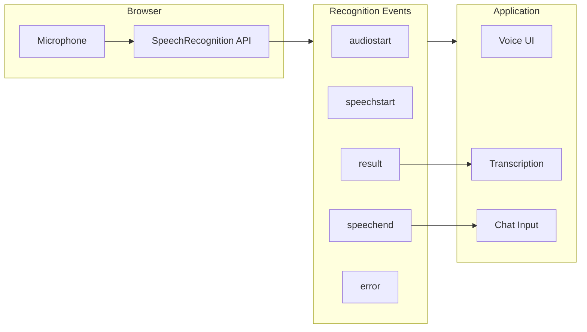

# Voice Input Integration

## Introduction

Voice input enables hands-free interaction with AI chat interfaces, improving accessibility and providing a natural input method. The Web Speech API's SpeechRecognition interface allows browsers to convert speech to text in real-time.

In this lesson, we'll integrate voice input using the Web Speech API with microphone permissions, voice activity detection, and live transcription display.

### What We'll Cover

- Web Speech API SpeechRecognition
- Microphone permission handling
- Real-time transcription display
- Voice activity detection
- Continuous listening mode
- Error handling and fallbacks

### Prerequisites

- [Branching Conversations](./05-branching-conversations.md)
- Basic audio concepts
- Browser API patterns

---

## Browser Support

| Browser | Support | Notes |
|---------|---------|-------|
| Chrome | ✅ Full | Best support, online recognition |
| Edge | ✅ Full | Chromium-based |
| Safari | ⚠️ Partial | Requires `webkitSpeechRecognition` prefix |
| Firefox | ❌ None | Behind flag, not production-ready |

> **Warning:** Speech recognition requires an internet connection in Chrome as audio is processed by Google's servers. Safari uses on-device processing.

---

## SpeechRecognition Architecture



---

## Basic Speech Recognition

```tsx
function createSpeechRecognition(): SpeechRecognition | null {
  // Check for browser support with prefix fallback
  const SpeechRecognition = 
    window.SpeechRecognition || 
    window.webkitSpeechRecognition;
  
  if (!SpeechRecognition) {
    console.warn('Speech recognition not supported');
    return null;
  }
  
  const recognition = new SpeechRecognition();
  
  // Configuration
  recognition.continuous = false;      // Stop after silence
  recognition.interimResults = true;   // Show partial results
  recognition.lang = 'en-US';          // Recognition language
  recognition.maxAlternatives = 1;     // Number of alternatives
  
  return recognition;
}
```

---

## Speech Recognition Hook

```tsx
interface UseSpeechRecognitionOptions {
  language?: string;
  continuous?: boolean;
  onResult?: (transcript: string, isFinal: boolean) => void;
  onError?: (error: string) => void;
  onStateChange?: (state: RecognitionState) => void;
}

type RecognitionState = 
  | 'inactive'
  | 'requesting-permission'
  | 'listening'
  | 'processing'
  | 'error';

function useSpeechRecognition(options: UseSpeechRecognitionOptions = {}) {
  const {
    language = 'en-US',
    continuous = false,
    onResult,
    onError,
    onStateChange
  } = options;
  
  const [state, setState] = useState<RecognitionState>('inactive');
  const [transcript, setTranscript] = useState('');
  const [interimTranscript, setInterimTranscript] = useState('');
  const [isSupported, setIsSupported] = useState(true);
  
  const recognitionRef = useRef<SpeechRecognition | null>(null);
  
  // Check support on mount
  useEffect(() => {
    const supported = !!(
      window.SpeechRecognition || 
      window.webkitSpeechRecognition
    );
    setIsSupported(supported);
  }, []);
  
  // Initialize recognition
  useEffect(() => {
    if (!isSupported) return;
    
    const recognition = createSpeechRecognition();
    if (!recognition) return;
    
    recognition.lang = language;
    recognition.continuous = continuous;
    
    // Event handlers
    recognition.onstart = () => {
      setState('listening');
      onStateChange?.('listening');
    };
    
    recognition.onaudiostart = () => {
      // Microphone started capturing
    };
    
    recognition.onspeechstart = () => {
      // Speech detected
      setState('processing');
    };
    
    recognition.onresult = (event: SpeechRecognitionEvent) => {
      let finalTranscript = '';
      let interimText = '';
      
      for (let i = event.resultIndex; i < event.results.length; i++) {
        const result = event.results[i];
        const text = result[0].transcript;
        
        if (result.isFinal) {
          finalTranscript += text;
        } else {
          interimText += text;
        }
      }
      
      if (finalTranscript) {
        setTranscript(prev => prev + finalTranscript);
        onResult?.(finalTranscript, true);
      }
      
      setInterimTranscript(interimText);
      if (interimText) {
        onResult?.(interimText, false);
      }
    };
    
    recognition.onerror = (event: SpeechRecognitionErrorEvent) => {
      const errorMessages: Record<string, string> = {
        'not-allowed': 'Microphone permission denied',
        'no-speech': 'No speech detected',
        'audio-capture': 'No microphone found',
        'network': 'Network error occurred',
        'aborted': 'Recognition aborted',
        'service-not-allowed': 'Speech service not allowed'
      };
      
      const message = errorMessages[event.error] || `Error: ${event.error}`;
      setState('error');
      onStateChange?.('error');
      onError?.(message);
    };
    
    recognition.onend = () => {
      setState('inactive');
      onStateChange?.('inactive');
      setInterimTranscript('');
    };
    
    recognitionRef.current = recognition;
    
    return () => {
      recognition.abort();
    };
  }, [isSupported, language, continuous, onResult, onError, onStateChange]);
  
  const startListening = useCallback(async () => {
    if (!recognitionRef.current) return;
    
    setState('requesting-permission');
    
    try {
      // Request microphone permission first
      await navigator.mediaDevices.getUserMedia({ audio: true });
      
      setTranscript('');
      setInterimTranscript('');
      recognitionRef.current.start();
    } catch (error) {
      setState('error');
      onError?.('Microphone permission denied');
    }
  }, [onError]);
  
  const stopListening = useCallback(() => {
    recognitionRef.current?.stop();
  }, []);
  
  const abortListening = useCallback(() => {
    recognitionRef.current?.abort();
    setTranscript('');
    setInterimTranscript('');
  }, []);
  
  return {
    isSupported,
    state,
    transcript,
    interimTranscript,
    fullTranscript: transcript + interimTranscript,
    isListening: state === 'listening' || state === 'processing',
    startListening,
    stopListening,
    abortListening
  };
}
```

---

## Voice Input Button

```tsx
interface VoiceInputButtonProps {
  onTranscript: (text: string) => void;
  disabled?: boolean;
}

function VoiceInputButton({ onTranscript, disabled }: VoiceInputButtonProps) {
  const {
    isSupported,
    state,
    fullTranscript,
    isListening,
    startListening,
    stopListening
  } = useSpeechRecognition({
    onResult: (transcript, isFinal) => {
      if (isFinal) {
        onTranscript(transcript);
      }
    },
    onError: (error) => {
      toast.error(error);
    }
  });
  
  if (!isSupported) {
    return (
      <button
        disabled
        className="p-2 text-gray-300 cursor-not-allowed"
        title="Voice input not supported in this browser"
      >
        <MicOffIcon className="w-5 h-5" />
      </button>
    );
  }
  
  const handleClick = () => {
    if (isListening) {
      stopListening();
    } else {
      startListening();
    }
  };
  
  return (
    <button
      onClick={handleClick}
      disabled={disabled}
      className={`
        relative p-2 rounded-full
        transition-colors
        ${isListening
          ? 'bg-red-500 text-white'
          : 'hover:bg-gray-100 dark:hover:bg-gray-700 text-gray-500'
        }
        disabled:opacity-50
      `}
      title={isListening ? 'Stop recording' : 'Start voice input'}
    >
      {isListening ? (
        <>
          <MicIcon className="w-5 h-5" />
          {/* Pulsing animation */}
          <span className="
            absolute inset-0
            rounded-full
            bg-red-500
            animate-ping
            opacity-30
          " />
        </>
      ) : (
        <MicIcon className="w-5 h-5" />
      )}
    </button>
  );
}
```

---

## Live Transcription Display

```tsx
interface TranscriptionDisplayProps {
  transcript: string;
  interimTranscript: string;
  isListening: boolean;
}

function TranscriptionDisplay({
  transcript,
  interimTranscript,
  isListening
}: TranscriptionDisplayProps) {
  if (!isListening && !transcript && !interimTranscript) {
    return null;
  }
  
  return (
    <div className="
      absolute bottom-full left-0 right-0
      mb-2 p-3
      bg-white dark:bg-gray-800
      border border-gray-200 dark:border-gray-700
      rounded-lg shadow-lg
    ">
      <div className="flex items-center gap-2 mb-2">
        <div className="relative">
          <MicIcon className="w-4 h-4 text-red-500" />
          {isListening && (
            <span className="absolute -top-1 -right-1 w-2 h-2 bg-red-500 rounded-full animate-pulse" />
          )}
        </div>
        <span className="text-xs font-medium text-gray-500">
          {isListening ? 'Listening...' : 'Transcription'}
        </span>
      </div>
      
      <div className="text-sm text-gray-700 dark:text-gray-300">
        {transcript}
        <span className="text-gray-400">{interimTranscript}</span>
        {isListening && (
          <span className="inline-block w-0.5 h-4 bg-blue-500 ml-0.5 animate-blink" />
        )}
      </div>
    </div>
  );
}
```

---

## Voice Activity Detection (VAD)

```tsx
interface UseVoiceActivityOptions {
  threshold?: number;
  silenceTimeout?: number;
  onSpeechStart?: () => void;
  onSpeechEnd?: () => void;
}

function useVoiceActivity(options: UseVoiceActivityOptions = {}) {
  const {
    threshold = 0.01,
    silenceTimeout = 1500,
    onSpeechStart,
    onSpeechEnd
  } = options;
  
  const [isSpeaking, setIsSpeaking] = useState(false);
  const [volume, setVolume] = useState(0);
  
  const audioContextRef = useRef<AudioContext | null>(null);
  const analyserRef = useRef<AnalyserNode | null>(null);
  const streamRef = useRef<MediaStream | null>(null);
  const silenceTimerRef = useRef<NodeJS.Timeout | null>(null);
  const animationRef = useRef<number | null>(null);
  
  const startMonitoring = useCallback(async () => {
    try {
      const stream = await navigator.mediaDevices.getUserMedia({ audio: true });
      streamRef.current = stream;
      
      const audioContext = new AudioContext();
      audioContextRef.current = audioContext;
      
      const analyser = audioContext.createAnalyser();
      analyser.fftSize = 256;
      analyserRef.current = analyser;
      
      const source = audioContext.createMediaStreamSource(stream);
      source.connect(analyser);
      
      const dataArray = new Uint8Array(analyser.frequencyBinCount);
      
      const checkVolume = () => {
        if (!analyserRef.current) return;
        
        analyserRef.current.getByteFrequencyData(dataArray);
        
        // Calculate average volume
        const average = dataArray.reduce((a, b) => a + b) / dataArray.length;
        const normalized = average / 255;
        
        setVolume(normalized);
        
        if (normalized > threshold) {
          // Speech detected
          if (!isSpeaking) {
            setIsSpeaking(true);
            onSpeechStart?.();
          }
          
          // Clear silence timer
          if (silenceTimerRef.current) {
            clearTimeout(silenceTimerRef.current);
            silenceTimerRef.current = null;
          }
        } else if (isSpeaking) {
          // Start silence timer
          if (!silenceTimerRef.current) {
            silenceTimerRef.current = setTimeout(() => {
              setIsSpeaking(false);
              onSpeechEnd?.();
            }, silenceTimeout);
          }
        }
        
        animationRef.current = requestAnimationFrame(checkVolume);
      };
      
      checkVolume();
    } catch (error) {
      console.error('Failed to start voice activity detection:', error);
    }
  }, [threshold, silenceTimeout, isSpeaking, onSpeechStart, onSpeechEnd]);
  
  const stopMonitoring = useCallback(() => {
    if (animationRef.current) {
      cancelAnimationFrame(animationRef.current);
    }
    if (silenceTimerRef.current) {
      clearTimeout(silenceTimerRef.current);
    }
    if (streamRef.current) {
      streamRef.current.getTracks().forEach(track => track.stop());
    }
    if (audioContextRef.current) {
      audioContextRef.current.close();
    }
    setIsSpeaking(false);
    setVolume(0);
  }, []);
  
  return {
    isSpeaking,
    volume,
    startMonitoring,
    stopMonitoring
  };
}
```

---

## Volume Indicator

```tsx
interface VolumeIndicatorProps {
  volume: number;
  isActive: boolean;
}

function VolumeIndicator({ volume, isActive }: VolumeIndicatorProps) {
  const bars = 5;
  
  return (
    <div className="flex items-center gap-0.5 h-4">
      {Array.from({ length: bars }).map((_, i) => {
        const barThreshold = (i + 1) / bars;
        const isActive = volume >= barThreshold;
        
        return (
          <div
            key={i}
            className={`
              w-1 rounded-full
              transition-all duration-75
              ${isActive
                ? 'bg-green-500'
                : 'bg-gray-300 dark:bg-gray-600'
              }
            `}
            style={{
              height: `${(i + 1) * 20}%`
            }}
          />
        );
      })}
    </div>
  );
}
```

---

## Continuous Listening Mode

```tsx
function ContinuousVoiceInput({ onSend }: { onSend: (text: string) => void }) {
  const [isEnabled, setIsEnabled] = useState(false);
  const [sentences, setSentences] = useState<string[]>([]);
  
  const { volume, isSpeaking, startMonitoring, stopMonitoring } = useVoiceActivity({
    onSpeechEnd: () => {
      // Auto-send when user stops speaking
      if (sentences.length > 0) {
        const fullText = sentences.join(' ');
        onSend(fullText);
        setSentences([]);
      }
    }
  });
  
  const { startListening, stopListening, transcript } = useSpeechRecognition({
    continuous: true,
    onResult: (text, isFinal) => {
      if (isFinal) {
        setSentences(prev => [...prev, text]);
      }
    }
  });
  
  const toggleContinuous = () => {
    if (isEnabled) {
      stopListening();
      stopMonitoring();
      setIsEnabled(false);
    } else {
      startListening();
      startMonitoring();
      setIsEnabled(true);
    }
  };
  
  return (
    <div className="flex items-center gap-3">
      <button
        onClick={toggleContinuous}
        className={`
          px-4 py-2 rounded-lg
          flex items-center gap-2
          transition-colors
          ${isEnabled
            ? 'bg-red-500 text-white'
            : 'bg-gray-100 text-gray-700 hover:bg-gray-200'
          }
        `}
      >
        <MicIcon className="w-4 h-4" />
        {isEnabled ? 'Stop' : 'Hands-free mode'}
      </button>
      
      {isEnabled && (
        <>
          <VolumeIndicator volume={volume} isActive={isSpeaking} />
          {sentences.length > 0 && (
            <span className="text-sm text-gray-500">
              {sentences.length} sentence{sentences.length > 1 ? 's' : ''} queued
            </span>
          )}
        </>
      )}
    </div>
  );
}
```

---

## Complete Voice-Enabled Input

```tsx
function VoiceEnabledChatInput({ onSend }: { onSend: (text: string) => void }) {
  const [inputValue, setInputValue] = useState('');
  const inputRef = useRef<HTMLTextAreaElement>(null);
  
  const {
    isSupported,
    state,
    fullTranscript,
    interimTranscript,
    transcript,
    isListening,
    startListening,
    stopListening
  } = useSpeechRecognition({
    onResult: (text, isFinal) => {
      if (isFinal) {
        setInputValue(prev => prev + text + ' ');
      }
    }
  });
  
  const handleSubmit = () => {
    const text = inputValue.trim();
    if (text) {
      onSend(text);
      setInputValue('');
    }
  };
  
  return (
    <div className="relative border-t p-4">
      {/* Transcription display */}
      {isListening && (
        <TranscriptionDisplay
          transcript={transcript}
          interimTranscript={interimTranscript}
          isListening={isListening}
        />
      )}
      
      <div className="flex items-end gap-2">
        {/* Text input */}
        <textarea
          ref={inputRef}
          value={inputValue + (isListening ? interimTranscript : '')}
          onChange={e => setInputValue(e.target.value)}
          placeholder={isListening ? 'Listening...' : 'Type a message...'}
          className="
            flex-1 px-4 py-3
            border border-gray-200 dark:border-gray-700
            rounded-xl
            resize-none
            focus:outline-none focus:ring-2 focus:ring-blue-500
          "
          rows={1}
          disabled={isListening}
          onKeyDown={e => {
            if (e.key === 'Enter' && !e.shiftKey) {
              e.preventDefault();
              handleSubmit();
            }
          }}
        />
        
        {/* Voice input button */}
        {isSupported && (
          <VoiceInputButton
            onTranscript={text => setInputValue(prev => prev + text + ' ')}
            disabled={false}
          />
        )}
        
        {/* Send button */}
        <button
          onClick={handleSubmit}
          disabled={!inputValue.trim() || isListening}
          className="
            p-3 rounded-xl
            bg-blue-500 text-white
            hover:bg-blue-600
            disabled:opacity-50
          "
        >
          <SendIcon className="w-5 h-5" />
        </button>
      </div>
      
      {/* Status indicator */}
      {!isSupported && (
        <p className="mt-2 text-xs text-amber-600">
          Voice input not supported in this browser. Try Chrome or Edge.
        </p>
      )}
    </div>
  );
}
```

---

## Language Selection

```tsx
interface LanguageSelectorProps {
  value: string;
  onChange: (lang: string) => void;
}

const SUPPORTED_LANGUAGES = [
  { code: 'en-US', label: 'English (US)' },
  { code: 'en-GB', label: 'English (UK)' },
  { code: 'es-ES', label: 'Spanish' },
  { code: 'fr-FR', label: 'French' },
  { code: 'de-DE', label: 'German' },
  { code: 'ja-JP', label: 'Japanese' },
  { code: 'zh-CN', label: 'Chinese (Simplified)' },
  { code: 'ko-KR', label: 'Korean' }
];

function LanguageSelector({ value, onChange }: LanguageSelectorProps) {
  return (
    <select
      value={value}
      onChange={e => onChange(e.target.value)}
      className="
        px-3 py-2
        text-sm
        border border-gray-200 dark:border-gray-600
        rounded-lg
        focus:outline-none focus:ring-2 focus:ring-blue-500
      "
    >
      {SUPPORTED_LANGUAGES.map(lang => (
        <option key={lang.code} value={lang.code}>
          {lang.label}
        </option>
      ))}
    </select>
  );
}
```

---

## Best Practices

| ✅ Do | ❌ Don't |
|-------|---------|
| Check browser support first | Assume support |
| Show real-time transcription | Wait for final result |
| Handle permission denial | Ignore errors |
| Provide visual feedback | Leave user guessing |
| Offer language selection | Hardcode language |
| Use `interimResults` | Show only final text |

---

## Common Pitfalls

| ❌ Mistake | ✅ Solution |
|-----------|-------------|
| No Safari prefix fallback | Use `webkitSpeechRecognition` |
| Missing permission flow | Request mic before starting |
| No offline fallback | Show clear error message |
| Ignoring `isFinal` flag | Check before updating state |
| Memory leaks | Clean up on unmount |
| No abort option | Allow user to cancel |

---

## Hands-on Exercise

### Your Task

Build a voice input component with:
1. Microphone button with states
2. Real-time transcription display
3. Volume indicator
4. Error handling

### Requirements

1. Check for browser support
2. Request microphone permission
3. Show interim and final results
4. Display volume/speaking indicator
5. Handle common errors gracefully

<details>
<summary>💡 Hints (click to expand)</summary>

- Check `window.SpeechRecognition || window.webkitSpeechRecognition`
- Use `interimResults = true`
- `result.isFinal` differentiates interim/final
- Web Audio API for volume visualization
- Clean up streams and contexts

</details>

---

## Summary

✅ **SpeechRecognition API** converts speech to text  
✅ **Prefix fallback** supports Safari  
✅ **Interim results** show live transcription  
✅ **Voice activity detection** identifies speech  
✅ **Continuous mode** enables hands-free  
✅ **Error handling** manages permissions and failures

---

## Further Reading

- [MDN SpeechRecognition](https://developer.mozilla.org/en-US/docs/Web/API/SpeechRecognition)
- [Web Speech API Specification](https://wicg.github.io/speech-api/)
- [Web Audio API](https://developer.mozilla.org/en-US/docs/Web/API/Web_Audio_API)

---

**Previous:** [Branching Conversations](./05-branching-conversations.md)  
**Next:** [Realtime API Voice UI](./07-realtime-api-voice-ui.md)

<!-- 
Sources Consulted:
- MDN SpeechRecognition: https://developer.mozilla.org/en-US/docs/Web/API/SpeechRecognition
- MDN SpeechRecognitionEvent: https://developer.mozilla.org/en-US/docs/Web/API/SpeechRecognitionEvent
- MDN Web Audio API: https://developer.mozilla.org/en-US/docs/Web/API/Web_Audio_API
- Web Speech API Spec: https://wicg.github.io/speech-api/
-->
