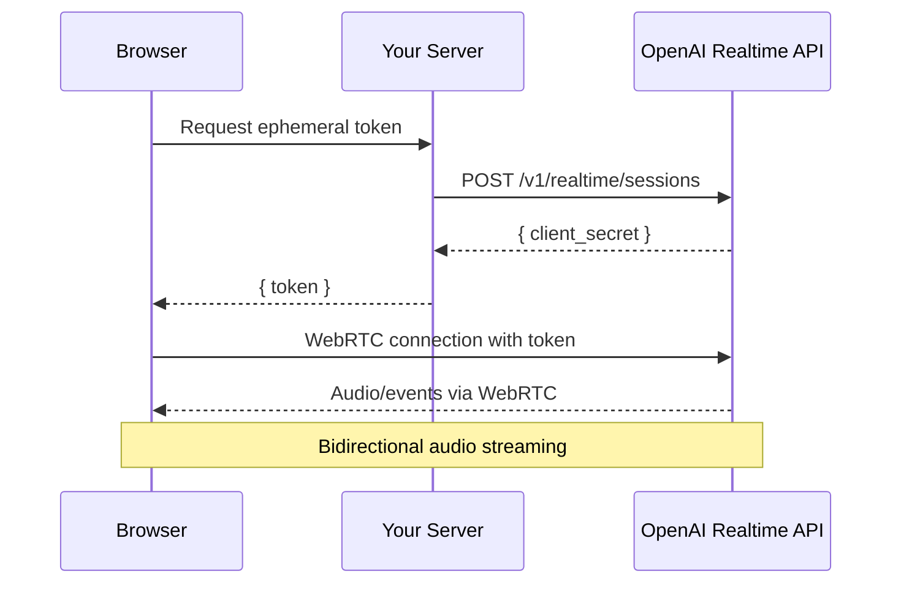

# Realtime API Voice UI

## Introduction

OpenAI's Realtime API enables low-latency, bidirectional voice conversations with AI. Unlike traditional text-based APIs, the Realtime API handles speech-to-speech interaction directly, supporting interruptions, natural turn-taking, and streaming audio responses.

In this lesson, we'll build a voice UI using WebRTC to connect to the Realtime API with ephemeral tokens, audio visualization, and conversation state management.

### What We'll Cover

- Realtime API overview and connection methods
- Ephemeral token authentication
- WebRTC connection setup
- Audio track handling
- Data channel events
- Voice UI with waveform visualization
- Speaking/listening state management

### Prerequisites

- [Voice Input Integration](./06-voice-input-integration.md)
- WebRTC fundamentals
- Web Audio API basics

---

## Connection Methods

| Method | Use Case | Latency |
|--------|----------|---------|
| **WebRTC** | Browser clients | Lowest (~100ms) |
| **WebSocket** | Server-side | Low |
| **SIP** | Telephony integration | Medium |

> **🤖 AI Context:** WebRTC is ideal for browser-based voice assistants because it provides sub-second latency and handles audio streaming natively.

---

## Architecture Overview



---

## Ephemeral Token Flow

```tsx
// Server endpoint: POST /api/realtime/token
async function createEphemeralToken(req: Request, res: Response) {
  const response = await fetch('https://api.openai.com/v1/realtime/sessions', {
    method: 'POST',
    headers: {
      'Authorization': `Bearer ${process.env.OPENAI_API_KEY}`,
      'Content-Type': 'application/json'
    },
    body: JSON.stringify({
      model: 'gpt-4o-realtime-preview-2024-12-17',
      voice: 'alloy',
      modalities: ['audio', 'text'],
      instructions: 'You are a helpful voice assistant.'
    })
  });
  
  const data = await response.json();
  
  // Token expires in 60 seconds - client must connect quickly
  res.json({
    token: data.client_secret.value,
    expiresAt: data.client_secret.expires_at
  });
}

// Client-side token fetching
async function getEphemeralToken(): Promise<string> {
  const response = await fetch('/api/realtime/token', {
    method: 'POST'
  });
  
  if (!response.ok) {
    throw new Error('Failed to get ephemeral token');
  }
  
  const { token } = await response.json();
  return token;
}
```

---

## WebRTC Connection Setup

```tsx
interface RealtimeConnectionOptions {
  token: string;
  onStateChange?: (state: ConnectionState) => void;
  onMessage?: (message: RealtimeEvent) => void;
  onAudioStart?: () => void;
  onAudioEnd?: () => void;
  onError?: (error: Error) => void;
}

type ConnectionState = 
  | 'disconnected'
  | 'connecting'
  | 'connected'
  | 'error';

async function createRealtimeConnection(options: RealtimeConnectionOptions) {
  const { token, onStateChange, onMessage, onError } = options;
  
  onStateChange?.('connecting');
  
  // Create peer connection
  const pc = new RTCPeerConnection();
  
  // Handle incoming audio
  pc.ontrack = (event) => {
    const audioEl = document.createElement('audio');
    audioEl.srcObject = event.streams[0];
    audioEl.autoplay = true;
    
    // Store reference for cleanup
    audioElements.push(audioEl);
    
    options.onAudioStart?.();
    
    event.streams[0].getTracks()[0].onended = () => {
      options.onAudioEnd?.();
    };
  };
  
  // Get user microphone
  const stream = await navigator.mediaDevices.getUserMedia({ 
    audio: {
      echoCancellation: true,
      noiseSuppression: true,
      sampleRate: 24000
    }
  });
  
  // Add microphone track
  stream.getTracks().forEach(track => {
    pc.addTrack(track, stream);
  });
  
  // Create data channel for events
  const dc = pc.createDataChannel('oai-events');
  
  dc.onopen = () => {
    onStateChange?.('connected');
  };
  
  dc.onmessage = (event) => {
    const message = JSON.parse(event.data);
    onMessage?.(message);
  };
  
  dc.onerror = (event) => {
    onError?.(new Error('Data channel error'));
  };
  
  // Create and set local offer
  const offer = await pc.createOffer();
  await pc.setLocalDescription(offer);
  
  // Send offer to OpenAI
  const sdpResponse = await fetch(
    'https://api.openai.com/v1/realtime?model=gpt-4o-realtime-preview-2024-12-17',
    {
      method: 'POST',
      headers: {
        'Authorization': `Bearer ${token}`,
        'Content-Type': 'application/sdp'
      },
      body: offer.sdp
    }
  );
  
  if (!sdpResponse.ok) {
    throw new Error('Failed to establish WebRTC connection');
  }
  
  // Set remote answer
  const answerSdp = await sdpResponse.text();
  await pc.setRemoteDescription({
    type: 'answer',
    sdp: answerSdp
  });
  
  return {
    peerConnection: pc,
    dataChannel: dc,
    stream,
    
    sendEvent(event: RealtimeEvent) {
      if (dc.readyState === 'open') {
        dc.send(JSON.stringify(event));
      }
    },
    
    close() {
      stream.getTracks().forEach(track => track.stop());
      dc.close();
      pc.close();
      onStateChange?.('disconnected');
    }
  };
}
```

---

## Realtime Event Types

```tsx
type RealtimeEvent =
  | { type: 'session.update'; session: SessionConfig }
  | { type: 'input_audio_buffer.append'; audio: string }
  | { type: 'input_audio_buffer.commit' }
  | { type: 'conversation.item.create'; item: ConversationItem }
  | { type: 'response.create'; response?: ResponseConfig };

type ServerEvent =
  | { type: 'session.created'; session: Session }
  | { type: 'session.updated'; session: Session }
  | { type: 'input_audio_buffer.speech_started' }
  | { type: 'input_audio_buffer.speech_stopped' }
  | { type: 'conversation.item.created'; item: ConversationItem }
  | { type: 'response.audio.delta'; delta: string }
  | { type: 'response.audio.done' }
  | { type: 'response.text.delta'; delta: string }
  | { type: 'response.text.done'; text: string }
  | { type: 'response.done'; response: Response }
  | { type: 'error'; error: ErrorInfo };

interface ConversationItem {
  id: string;
  type: 'message' | 'function_call' | 'function_call_output';
  role?: 'user' | 'assistant' | 'system';
  content?: ContentPart[];
}
```

---

## Realtime Connection Hook

```tsx
interface UseRealtimeOptions {
  onTranscript?: (text: string, role: 'user' | 'assistant') => void;
  onSpeechStart?: (role: 'user' | 'assistant') => void;
  onSpeechEnd?: (role: 'user' | 'assistant') => void;
  onError?: (error: Error) => void;
}

function useRealtimeVoice(options: UseRealtimeOptions = {}) {
  const [connectionState, setConnectionState] = useState<ConnectionState>('disconnected');
  const [isSpeaking, setIsSpeaking] = useState(false);
  const [isAssistantSpeaking, setIsAssistantSpeaking] = useState(false);
  const [transcript, setTranscript] = useState<string>('');
  
  const connectionRef = useRef<Awaited<ReturnType<typeof createRealtimeConnection>> | null>(null);
  
  const connect = useCallback(async () => {
    if (connectionRef.current) return;
    
    try {
      // Get ephemeral token from server
      const token = await getEphemeralToken();
      
      // Create connection
      const connection = await createRealtimeConnection({
        token,
        onStateChange: setConnectionState,
        onMessage: (event) => {
          switch (event.type) {
            case 'input_audio_buffer.speech_started':
              setIsSpeaking(true);
              options.onSpeechStart?.('user');
              break;
              
            case 'input_audio_buffer.speech_stopped':
              setIsSpeaking(false);
              options.onSpeechEnd?.('user');
              break;
              
            case 'response.audio.delta':
              setIsAssistantSpeaking(true);
              options.onSpeechStart?.('assistant');
              break;
              
            case 'response.audio.done':
              setIsAssistantSpeaking(false);
              options.onSpeechEnd?.('assistant');
              break;
              
            case 'response.text.done':
              setTranscript(event.text);
              options.onTranscript?.(event.text, 'assistant');
              break;
              
            case 'conversation.item.created':
              if (event.item.role === 'user') {
                const text = event.item.content?.[0]?.transcript || '';
                options.onTranscript?.(text, 'user');
              }
              break;
              
            case 'error':
              options.onError?.(new Error(event.error.message));
              break;
          }
        },
        onError: options.onError
      });
      
      connectionRef.current = connection;
      
    } catch (error) {
      setConnectionState('error');
      options.onError?.(error as Error);
    }
  }, [options]);
  
  const disconnect = useCallback(() => {
    connectionRef.current?.close();
    connectionRef.current = null;
    setConnectionState('disconnected');
  }, []);
  
  const sendTextMessage = useCallback((text: string) => {
    connectionRef.current?.sendEvent({
      type: 'conversation.item.create',
      item: {
        type: 'message',
        role: 'user',
        content: [{ type: 'input_text', text }]
      }
    });
    
    connectionRef.current?.sendEvent({
      type: 'response.create'
    });
  }, []);
  
  const interruptAssistant = useCallback(() => {
    connectionRef.current?.sendEvent({
      type: 'response.cancel'
    });
  }, []);
  
  // Cleanup on unmount
  useEffect(() => {
    return () => {
      connectionRef.current?.close();
    };
  }, []);
  
  return {
    connectionState,
    isConnected: connectionState === 'connected',
    isSpeaking,
    isAssistantSpeaking,
    transcript,
    connect,
    disconnect,
    sendTextMessage,
    interruptAssistant
  };
}
```

---

## Audio Waveform Visualization

```tsx
interface WaveformVisualizerProps {
  stream: MediaStream | null;
  isActive: boolean;
  color?: string;
}

function WaveformVisualizer({ stream, isActive, color = '#3b82f6' }: WaveformVisualizerProps) {
  const canvasRef = useRef<HTMLCanvasElement>(null);
  const analyserRef = useRef<AnalyserNode | null>(null);
  const animationRef = useRef<number | null>(null);
  
  useEffect(() => {
    if (!stream || !canvasRef.current) return;
    
    const audioContext = new AudioContext();
    const analyser = audioContext.createAnalyser();
    analyser.fftSize = 256;
    
    const source = audioContext.createMediaStreamSource(stream);
    source.connect(analyser);
    analyserRef.current = analyser;
    
    const canvas = canvasRef.current;
    const ctx = canvas.getContext('2d')!;
    const bufferLength = analyser.frequencyBinCount;
    const dataArray = new Uint8Array(bufferLength);
    
    const draw = () => {
      if (!isActive) {
        animationRef.current = requestAnimationFrame(draw);
        ctx.clearRect(0, 0, canvas.width, canvas.height);
        return;
      }
      
      analyser.getByteFrequencyData(dataArray);
      
      ctx.clearRect(0, 0, canvas.width, canvas.height);
      
      const barWidth = (canvas.width / bufferLength) * 2.5;
      let x = 0;
      
      for (let i = 0; i < bufferLength; i++) {
        const barHeight = (dataArray[i] / 255) * canvas.height;
        
        ctx.fillStyle = color;
        ctx.fillRect(
          x,
          canvas.height - barHeight,
          barWidth - 1,
          barHeight
        );
        
        x += barWidth;
      }
      
      animationRef.current = requestAnimationFrame(draw);
    };
    
    draw();
    
    return () => {
      if (animationRef.current) {
        cancelAnimationFrame(animationRef.current);
      }
      audioContext.close();
    };
  }, [stream, isActive, color]);
  
  return (
    <canvas
      ref={canvasRef}
      width={200}
      height={60}
      className="rounded-lg bg-gray-100 dark:bg-gray-800"
    />
  );
}
```

---

## Voice Call UI Component

```tsx
interface VoiceCallUIProps {
  onClose?: () => void;
}

function VoiceCallUI({ onClose }: VoiceCallUIProps) {
  const {
    connectionState,
    isConnected,
    isSpeaking,
    isAssistantSpeaking,
    transcript,
    connect,
    disconnect,
    interruptAssistant
  } = useRealtimeVoice({
    onTranscript: (text, role) => {
      console.log(`${role}: ${text}`);
    }
  });
  
  const [messages, setMessages] = useState<{ role: string; text: string }[]>([]);
  
  // Add message when transcript updates
  useEffect(() => {
    if (transcript) {
      setMessages(prev => [...prev, { role: 'assistant', text: transcript }]);
    }
  }, [transcript]);
  
  return (
    <div className="
      fixed inset-0 z-50
      flex items-center justify-center
      bg-black/80
    ">
      <div className="
        w-full max-w-md
        bg-gray-900
        rounded-2xl
        overflow-hidden
      ">
        {/* Header */}
        <div className="p-6 text-center">
          <h2 className="text-xl font-semibold text-white">
            Voice Conversation
          </h2>
          <p className="text-gray-400 text-sm mt-1">
            {connectionState === 'connecting' && 'Connecting...'}
            {connectionState === 'connected' && 'Connected'}
            {connectionState === 'disconnected' && 'Tap to start'}
            {connectionState === 'error' && 'Connection failed'}
          </p>
        </div>
        
        {/* Visualization */}
        <div className="px-6 py-8 flex flex-col items-center gap-6">
          {/* Assistant indicator */}
          <div className={`
            w-32 h-32
            rounded-full
            flex items-center justify-center
            transition-all duration-300
            ${isAssistantSpeaking
              ? 'bg-green-500 scale-110'
              : isConnected
                ? 'bg-gray-700'
                : 'bg-gray-800'
            }
          `}>
            <BotIcon className="w-16 h-16 text-white" />
          </div>
          
          {/* Speaking status */}
          <div className="flex items-center gap-4">
            <div className={`
              flex items-center gap-2 px-3 py-1.5 rounded-full
              ${isSpeaking
                ? 'bg-blue-500/20 text-blue-400'
                : 'bg-gray-800 text-gray-500'
              }
            `}>
              <MicIcon className="w-4 h-4" />
              <span className="text-sm">You</span>
            </div>
            
            <div className={`
              flex items-center gap-2 px-3 py-1.5 rounded-full
              ${isAssistantSpeaking
                ? 'bg-green-500/20 text-green-400'
                : 'bg-gray-800 text-gray-500'
              }
            `}>
              <SpeakerIcon className="w-4 h-4" />
              <span className="text-sm">Assistant</span>
            </div>
          </div>
          
          {/* Latest transcript */}
          {transcript && (
            <div className="
              max-w-full px-4 py-3
              bg-gray-800 rounded-lg
              text-gray-300 text-sm
              text-center
            ">
              {transcript.slice(-200)}
            </div>
          )}
        </div>
        
        {/* Controls */}
        <div className="p-6 flex justify-center gap-4">
          {!isConnected ? (
            <button
              onClick={connect}
              disabled={connectionState === 'connecting'}
              className="
                w-16 h-16
                rounded-full
                bg-green-500 text-white
                flex items-center justify-center
                hover:bg-green-600
                disabled:opacity-50
              "
            >
              <PhoneIcon className="w-8 h-8" />
            </button>
          ) : (
            <>
              {/* Interrupt button */}
              {isAssistantSpeaking && (
                <button
                  onClick={interruptAssistant}
                  className="
                    w-12 h-12
                    rounded-full
                    bg-yellow-500 text-white
                    flex items-center justify-center
                  "
                >
                  <HandIcon className="w-6 h-6" />
                </button>
              )}
              
              {/* End call */}
              <button
                onClick={disconnect}
                className="
                  w-16 h-16
                  rounded-full
                  bg-red-500 text-white
                  flex items-center justify-center
                "
              >
                <PhoneOffIcon className="w-8 h-8" />
              </button>
            </>
          )}
        </div>
        
        {/* Close button */}
        <button
          onClick={() => {
            disconnect();
            onClose?.();
          }}
          className="
            absolute top-4 right-4
            p-2 text-gray-400 hover:text-white
          "
        >
          <XIcon className="w-6 h-6" />
        </button>
      </div>
    </div>
  );
}
```

---

## Session Configuration

```tsx
function updateSessionConfig(
  connection: RealtimeConnection,
  config: Partial<SessionConfig>
) {
  connection.sendEvent({
    type: 'session.update',
    session: {
      modalities: ['text', 'audio'],
      voice: 'alloy',
      input_audio_format: 'pcm16',
      output_audio_format: 'pcm16',
      input_audio_transcription: {
        model: 'whisper-1'
      },
      turn_detection: {
        type: 'server_vad',
        threshold: 0.5,
        prefix_padding_ms: 300,
        silence_duration_ms: 500
      },
      ...config
    }
  });
}

// Available voices
type Voice = 'alloy' | 'ash' | 'ballad' | 'coral' | 'echo' | 'sage' | 'shimmer' | 'verse';
```

---

## Floating Voice Button

```tsx
function FloatingVoiceButton() {
  const [isOpen, setIsOpen] = useState(false);
  
  return (
    <>
      {/* Floating button */}
      <button
        onClick={() => setIsOpen(true)}
        className="
          fixed bottom-6 right-6
          w-14 h-14
          rounded-full
          bg-blue-500 text-white
          shadow-lg
          flex items-center justify-center
          hover:bg-blue-600
          hover:scale-110
          transition-transform
        "
      >
        <MicIcon className="w-6 h-6" />
      </button>
      
      {/* Voice call overlay */}
      {isOpen && (
        <VoiceCallUI onClose={() => setIsOpen(false)} />
      )}
    </>
  );
}
```

---

## Error Recovery

```tsx
function useRealtimeWithReconnect(options: UseRealtimeOptions) {
  const realtime = useRealtimeVoice(options);
  const [reconnectAttempts, setReconnectAttempts] = useState(0);
  const maxReconnects = 3;
  
  useEffect(() => {
    if (realtime.connectionState === 'error' && reconnectAttempts < maxReconnects) {
      const timeout = setTimeout(() => {
        setReconnectAttempts(prev => prev + 1);
        realtime.connect();
      }, 2000 * (reconnectAttempts + 1)); // Exponential backoff
      
      return () => clearTimeout(timeout);
    }
  }, [realtime.connectionState, reconnectAttempts]);
  
  useEffect(() => {
    if (realtime.connectionState === 'connected') {
      setReconnectAttempts(0);
    }
  }, [realtime.connectionState]);
  
  return {
    ...realtime,
    reconnectAttempts,
    isReconnecting: realtime.connectionState === 'error' && reconnectAttempts < maxReconnects
  };
}
```

---

## Best Practices

| ✅ Do | ❌ Don't |
|-------|---------|
| Use ephemeral tokens | Expose API key to client |
| Enable echo cancellation | Allow audio feedback |
| Show connection state | Leave user uncertain |
| Allow interruptions | Force wait for response |
| Clean up on disconnect | Leave orphan connections |
| Handle reconnection | Fail permanently on error |

---

## Common Pitfalls

| ❌ Mistake | ✅ Solution |
|-----------|-------------|
| Token expires before connect | Fetch token just before use |
| Audio plays through speakers | Use headphones or echo cancellation |
| No visual feedback | Show speaking indicators |
| ICE connection fails | Check firewall/network |
| Data channel not opening | Wait for `onopen` event |
| Memory leaks | Clean up streams and contexts |

---

## Hands-on Exercise

### Your Task

Build a Realtime API voice interface with:
1. Connect/disconnect button
2. Speaking indicators for user and assistant
3. Live transcript display
4. Interrupt capability

### Requirements

1. Create server endpoint for ephemeral token
2. Establish WebRTC connection
3. Handle data channel events
4. Show visual feedback for states
5. Clean up properly on disconnect

<details>
<summary>💡 Hints (click to expand)</summary>

- Use `RTCPeerConnection` for WebRTC
- Data channel name is `oai-events`
- SDP exchange via `sdp` content type
- Track events for audio state
- `response.cancel` to interrupt

</details>

---

## Summary

✅ **Ephemeral tokens** secure client connections  
✅ **WebRTC** provides low-latency audio  
✅ **Data channel** carries events  
✅ **Voice activity detection** manages turns  
✅ **Waveform visualization** shows audio  
✅ **Interruption support** enables natural conversation

---

## Further Reading

- [OpenAI Realtime API Guide](https://platform.openai.com/docs/guides/realtime)
- [WebRTC API - MDN](https://developer.mozilla.org/en-US/docs/Web/API/WebRTC_API)
- [RTCPeerConnection - MDN](https://developer.mozilla.org/en-US/docs/Web/API/RTCPeerConnection)

---

**Previous:** [Voice Input Integration](./06-voice-input-integration.md)  
**Next:** [Lesson 11: Styling and Theming](../11-styling-theming/00-styling-theming.md)

<!-- 
Sources Consulted:
- OpenAI Realtime API Overview: https://platform.openai.com/docs/guides/realtime
- OpenAI Realtime WebRTC Guide: https://platform.openai.com/docs/guides/realtime-webrtc
- MDN WebRTC API: https://developer.mozilla.org/en-US/docs/Web/API/WebRTC_API
- MDN RTCPeerConnection: https://developer.mozilla.org/en-US/docs/Web/API/RTCPeerConnection
- MDN RTCDataChannel: https://developer.mozilla.org/en-US/docs/Web/API/RTCDataChannel
-->
