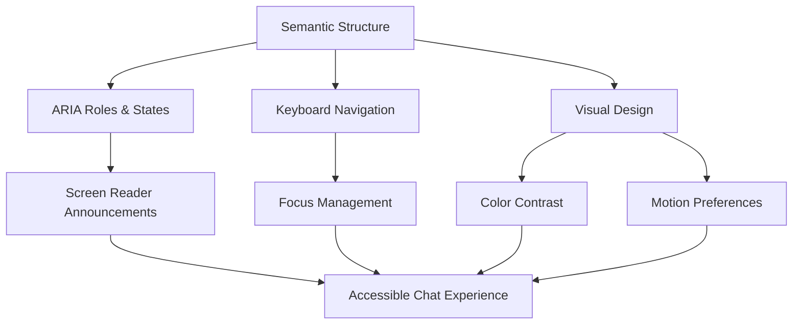

# Accessibility in Chat Interfaces

## Introduction

Building an AI chat interface that works beautifully for some users while excluding others isn't just a missed opportunity—it's a fundamental failure in design. Accessibility in chat interfaces ensures that everyone, regardless of visual ability, motor skills, or cognitive differences, can participate in conversations with AI assistants.

Chat interfaces present unique accessibility challenges. Unlike static web pages, chat applications involve dynamic content that appears asynchronously, streaming text that updates in real-time, and complex interaction patterns for sending messages and managing conversations. When we add AI capabilities—with typing indicators, markdown rendering, code blocks, and multi-turn context—the accessibility requirements become even more demanding.

### What We'll Cover

In this lesson series, we'll explore the complete landscape of chat interface accessibility:

1. **ARIA Roles for Chat Components** - Semantic structure that screen readers understand
2. **Screen Reader Compatibility** - Ensuring content is announced properly
3. **Keyboard Navigation** - Full functionality without a mouse
4. **Focus Management During Streaming** - Handling dynamic content updates
5. **Announcing New Messages** - Live regions and notification strategies
6. **Color Contrast and Visual Accessibility** - WCAG compliance and beyond
7. **Reduced Motion Preferences** - Respecting user animation preferences

### Prerequisites

Before diving into chat accessibility, you should be familiar with:

- Basic HTML and semantic markup
- CSS fundamentals including media queries
- JavaScript DOM manipulation
- General understanding of chat interface architecture (from earlier lessons)

---

## Why Accessibility Matters for AI Chat

### The Scope of Impact

Approximately 15% of the global population experiences some form of disability. For chat interfaces specifically, consider:

| User Group | Chat Interface Impact |
|------------|----------------------|
| **Blind users** | Rely entirely on screen readers to navigate and read messages |
| **Low vision users** | Need high contrast, scalable text, and clear visual hierarchy |
| **Motor impairments** | May use keyboard-only, voice control, or switch devices |
| **Cognitive disabilities** | Benefit from predictable patterns, reduced complexity |
| **Deaf/hard of hearing** | Audio notifications must have visual alternatives |
| **Vestibular disorders** | Motion and animation can cause physical discomfort |

### Legal and Ethical Considerations

Beyond the ethical imperative, accessibility is increasingly a legal requirement:

- **WCAG 2.1** (Web Content Accessibility Guidelines) - The international standard
- **ADA** (Americans with Disabilities Act) - US legal requirement for many services
- **EAA** (European Accessibility Act) - EU requirements taking effect
- **Section 508** - US federal accessibility requirements

> **🤖 AI Context:** AI assistants are increasingly used for critical tasks—healthcare information, financial services, educational support. If these interfaces aren't accessible, we're creating AI systems that discriminate by design.

---

## Accessibility Layers in Chat Interfaces

Understanding accessibility requires recognizing multiple interconnected layers:



### Layer 1: Semantic Foundation

The base layer uses proper HTML semantics enhanced with ARIA roles:

```html
<!-- Semantic chat structure -->
<main>
  <section aria-labelledby="chat-heading">
    <h1 id="chat-heading">AI Assistant</h1>
    
    <!-- Message container with log role -->
    <div role="log" aria-live="polite" aria-label="Conversation">
      <!-- Messages here -->
    </div>
    
    <!-- Input area -->
    <form aria-label="Send a message">
      <textarea aria-label="Your message"></textarea>
      <button type="submit">Send</button>
    </form>
  </section>
</main>
```

### Layer 2: Interaction Patterns

Keyboard navigation and focus management ensure users can operate the interface without a mouse:

```javascript
// Focus management example
class AccessibleChat {
  constructor(container) {
    this.container = container;
    this.messageList = container.querySelector('[role="log"]');
    this.input = container.querySelector('textarea');
    
    this.setupKeyboardNavigation();
  }
  
  setupKeyboardNavigation() {
    this.container.addEventListener('keydown', (e) => {
      // Escape returns focus to input
      if (e.key === 'Escape') {
        this.input.focus();
        e.preventDefault();
      }
    });
  }
}
```

### Layer 3: Dynamic Announcements

Live regions notify screen reader users of new content:

```html
<!-- Status announcements -->
<div role="status" aria-live="polite" class="visually-hidden">
  <!-- Dynamic status messages -->
</div>

<!-- Error announcements (immediate) -->
<div role="alert" class="visually-hidden">
  <!-- Error messages appear here -->
</div>
```

### Layer 4: Visual Accessibility

CSS ensures visual accessibility across different needs:

```css
/* Respect user preferences */
@media (prefers-reduced-motion: reduce) {
  * {
    animation-duration: 0.01ms !important;
    transition-duration: 0.01ms !important;
  }
}

@media (prefers-contrast: more) {
  .chat-message {
    border: 2px solid currentColor;
  }
}
```

---

## Testing Accessibility

Accessibility isn't complete until it's tested with real tools and, ideally, real users:

### Essential Testing Tools

| Tool Type | Examples | Tests For |
|-----------|----------|-----------|
| **Automated scanners** | axe DevTools, WAVE | Common issues, contrast, missing labels |
| **Screen readers** | NVDA, VoiceOver, JAWS | Actual user experience |
| **Keyboard testing** | Manual Tab/Shift+Tab | Navigation completeness |
| **Browser DevTools** | Accessibility Inspector | ARIA tree, computed properties |

### Quick Accessibility Audit

Test your chat interface with this checklist:

```markdown
## Chat Accessibility Audit

### Keyboard
- [ ] Can reach all interactive elements with Tab
- [ ] Can submit messages with Enter
- [ ] Focus indicator is always visible
- [ ] Can exit modals/dialogs with Escape

### Screen Reader
- [ ] Messages are announced when they appear
- [ ] User vs assistant messages are distinguishable
- [ ] Typing indicator is announced
- [ ] Errors are immediately announced

### Visual
- [ ] All text meets 4.5:1 contrast ratio
- [ ] Interface works at 200% zoom
- [ ] No information conveyed by color alone
- [ ] Animations respect prefers-reduced-motion
```

---

## Common Accessibility Patterns

Throughout this lesson series, we'll implement these recurring patterns:

### Visually Hidden Text

Content that's announced but not visible:

```css
.visually-hidden {
  position: absolute;
  width: 1px;
  height: 1px;
  padding: 0;
  margin: -1px;
  overflow: hidden;
  clip: rect(0, 0, 0, 0);
  white-space: nowrap;
  border: 0;
}
```

### Skip Links

Allow users to bypass repetitive content:

```html
<a href="#chat-input" class="skip-link">Skip to chat input</a>

<style>
.skip-link {
  position: absolute;
  left: -9999px;
}

.skip-link:focus {
  position: static;
  left: auto;
}
</style>
```

### ARIA State Management

Dynamically update states for screen readers:

```javascript
// Toggle expanded state
function toggleSection(button, content) {
  const expanded = button.getAttribute('aria-expanded') === 'true';
  button.setAttribute('aria-expanded', !expanded);
  content.hidden = expanded;
}
```

---

## Lesson Structure

Each topic in this series follows a consistent structure:

1. **Concept explanation** - Why this matters for accessibility
2. **Implementation patterns** - Code examples you can adapt
3. **Testing strategies** - How to verify your implementation
4. **Common pitfalls** - Mistakes to avoid
5. **Hands-on exercise** - Practice building accessible components

---

## Summary

✅ Accessibility in chat interfaces impacts approximately 15% of users

✅ Chat presents unique challenges: dynamic content, streaming updates, complex interactions

✅ Four interconnected layers: semantic structure, interaction patterns, announcements, visual design

✅ Testing requires both automated tools and real assistive technology usage

✅ Legal requirements make accessibility increasingly mandatory

**Next:** [ARIA Roles for Chat Components](./01-aria-roles-for-chat.md)

---

## Further Reading

- [WAI-ARIA Authoring Practices Guide](https://www.w3.org/WAI/ARIA/apg/) - Official patterns and examples
- [WCAG 2.1 Quick Reference](https://www.w3.org/WAI/WCAG21/quickref/) - Success criteria reference
- [WebAIM](https://webaim.org/) - Practical accessibility resources
- [A11y Project](https://www.a11yproject.com/) - Community-driven accessibility knowledge

<!--
Sources Consulted:
- MDN ARIA Roles: https://developer.mozilla.org/en-US/docs/Web/Accessibility/ARIA/Roles
- MDN ARIA Live Regions: https://developer.mozilla.org/en-US/docs/Web/Accessibility/ARIA/ARIA_Live_Regions
- W3C WAI-ARIA APG Keyboard Interface: https://www.w3.org/WAI/ARIA/apg/practices/keyboard-interface/
- WCAG 2.1 Understanding Focus Visible: https://www.w3.org/WAI/WCAG21/Understanding/focus-visible
- WCAG 2.1 Understanding Contrast: https://www.w3.org/WAI/WCAG21/Understanding/contrast-minimum
- MDN prefers-reduced-motion: https://developer.mozilla.org/en-US/docs/Web/CSS/@media/prefers-reduced-motion
-->
