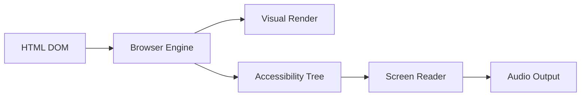

# Screen Reader Compatibility

## Introduction

Screen readers transform visual interfaces into auditory experiences, reading content aloud and providing navigation cues for blind and low-vision users. A chat interface that looks perfect visually can be completely unusable when heard through a screen reader if it lacks proper structure, labels, and content organization.

Screen reader users navigate in fundamentally different ways than sighted users. They can't glance at a message to see who sent it—they need that context announced. They can't see that a button has an arrow icon—they need a text label. They can't visually distinguish between their messages and AI responses by color alone—they need semantic differentiation.

### What We'll Cover

- Logical reading order and content structure
- Alternative text for images, emojis, and icons
- Accessible button and interactive element labels
- State announcements for dynamic content
- Testing with screen readers

### Prerequisites

- Understanding of ARIA roles from the previous lesson
- Basic HTML document structure
- Familiarity with CSS positioning (for understanding reading order impacts)

---

## How Screen Readers Work

Before optimizing for screen readers, let's understand how they interpret content.

### The Accessibility Tree

Browsers create an accessibility tree parallel to the DOM. Screen readers consume this tree, not the visual rendering:



### What Screen Readers Announce

When a screen reader encounters an element, it announces:

| Element Type | Announcement Pattern |
|--------------|---------------------|
| Button | "Send, button" (name + role) |
| Link | "Help, link" (name + role) |
| Heading | "Conversation, heading level 2" (name + role + level) |
| List item | "1 of 5, What is ML?" (position + content) |
| Text input | "Your message, edit text, blank" (name + role + state) |

### Reading Modes

Screen readers operate in different modes:

| Mode | Navigation | Use Case |
|------|------------|----------|
| **Browse mode** | Arrow keys move through content | Reading messages |
| **Focus mode** | Tab moves between focusables | Interacting with controls |
| **Application mode** | Custom shortcuts work | Complex widgets |

> **🤖 AI Context:** Chat interfaces often trigger "application mode" due to complex interactivity, which can change how users navigate. Be aware that keyboard behavior may differ from simple web pages.

---

## Logical Reading Order

Screen readers read content in DOM order, not visual order. CSS can move elements visually while leaving the reading order unchanged—often creating confusion.

### DOM Order vs Visual Order

```html
<!-- ❌ Bad: Visual order doesn't match DOM order -->
<div class="chat-message">
  <div class="message-content">Hello world</div>
  <div class="message-meta">
    <span class="author">AI Assistant</span>
    <time>10:30 AM</time>
  </div>
</div>

<style>
  .chat-message { display: flex; flex-direction: column; }
  .message-meta { order: -1; } /* Visually first, but read last */
</style>
```

```html
<!-- ✅ Good: DOM order matches visual order -->
<div class="chat-message">
  <div class="message-meta">
    <span class="author">AI Assistant</span>
    <time>10:30 AM</time>
  </div>
  <div class="message-content">Hello world</div>
</div>
```

### Chat Message Reading Order

The optimal reading order for chat messages:

1. **Who** sent the message (author identification)
2. **When** it was sent (timestamp)
3. **What** was said (message content)
4. **Actions** available (copy, regenerate, etc.)

```html
<article class="message message-assistant">
  <!-- 1. Who -->
  <span class="visually-hidden">AI Assistant</span>
  
  <!-- 2. When -->
  <time class="message-time" datetime="2024-01-15T10:30:00">
    <span class="visually-hidden">at</span> 10:30 AM
  </time>
  
  <!-- 3. What -->
  <div class="message-content">
    <p>Machine learning is a subset of artificial intelligence...</p>
  </div>
  
  <!-- 4. Actions -->
  <div class="message-actions">
    <button aria-label="Copy message">Copy</button>
    <button aria-label="Regenerate response">Regenerate</button>
  </div>
</article>
```

### Complete Message Announcement

With proper structure, a screen reader announces:

> "AI Assistant, at 10:30 AM. Machine learning is a subset of artificial intelligence... Copy message, button. Regenerate response, button."

### Handling Multi-Part Messages

For messages with code blocks, lists, or multiple paragraphs:

```html
<article class="message message-assistant">
  <span class="visually-hidden">AI Assistant said:</span>
  
  <div class="message-content">
    <p>Here's how to create a function in Python:</p>
    
    <figure class="code-block">
      <figcaption class="visually-hidden">
        Python code example
      </figcaption>
      <pre><code>def greet(name):
    return f"Hello, {name}!"</code></pre>
    </figure>
    
    <p>This function takes a name parameter and returns a greeting.</p>
  </div>
</article>
```

---

## Alternative Text for Visual Content

Images, icons, and emojis convey meaning that must be communicated to screen reader users.

### Images in Messages

```html
<!-- User-uploaded image -->
<figure class="message-image">
  
  <figcaption>Monthly sales chart</figcaption>
</figure>

<!-- AI-generated image -->
<figure class="message-image">
  
  <figcaption>AI-generated image based on prompt: "sunset over mountains"</figcaption>
</figure>
```

### Writing Effective Alt Text

| Image Type | Alt Text Approach |
|------------|-------------------|
| **Data visualization** | Describe the data trend or key insight |
| **Screenshot** | Describe what the screenshot shows |
| **Decorative** | Use `alt=""` (empty, not omitted) |
| **AI-generated** | Describe what the image depicts |
| **Icon with text** | Usually `aria-hidden="true"` |

### Icons and Emojis

Icons that convey meaning need accessible alternatives:

```html
<!-- ❌ Bad: Icon with no alternative -->
<button>
  <svg viewBox="0 0 24 24"><!-- send icon --></svg>
</button>

<!-- ✅ Good: Icon button with label -->
<button aria-label="Send message">
  <svg viewBox="0 0 24 24" aria-hidden="true"><!-- send icon --></svg>
</button>

<!-- ✅ Good: Icon with visible text -->
<button>
  <svg viewBox="0 0 24 24" aria-hidden="true"><!-- send icon --></svg>
  <span>Send</span>
</button>
```

### Emoji Handling

Emojis have built-in accessible names, but they can clutter announcements:

```html
<!-- Screen reader announces: "I love this! red heart red heart red heart" -->
<p>I love this! ❤️❤️❤️</p>

<!-- Better: Single emoji with aria-label -->
<p>
  I love this! 
  <span role="img" aria-label="love">❤️❤️❤️</span>
</p>

<!-- Or hide decorative repetition -->
<p>
  I love this! 
  <span role="img" aria-label="heart">❤️</span>
  <span aria-hidden="true">❤️❤️</span>
</p>
```

### Emoji in Chat Messages

Create a utility for accessible emoji rendering:

```javascript
class AccessibleEmoji {
  // Map of emoji to accessible descriptions
  static descriptions = {
    '👍': 'thumbs up',
    '👎': 'thumbs down', 
    '❤️': 'heart',
    '🤔': 'thinking',
    '✅': 'check mark',
    '❌': 'x mark',
    '⚠️': 'warning',
    '💡': 'idea',
    '🔄': 'refresh',
    '📋': 'clipboard'
  };
  
  static render(emoji, customLabel = null) {
    const label = customLabel || this.descriptions[emoji] || emoji;
    return `<span role="img" aria-label="${label}">${emoji}</span>`;
  }
  
  static hideDecorative(emoji) {
    return `<span aria-hidden="true">${emoji}</span>`;
  }
}

// Usage
button.innerHTML = AccessibleEmoji.render('📋', 'copy to clipboard');
```

---

## Accessible Labels

Every interactive element needs a clear, descriptive label that screen readers can announce.

### Button Labels

```html
<!-- ❌ Bad: No label -->
<button>×</button>

<!-- ❌ Bad: Label doesn't describe action -->
<button aria-label="X">×</button>

<!-- ✅ Good: Descriptive label -->
<button aria-label="Close chat window">×</button>

<!-- ✅ Good: Visible text -->
<button>
  <span aria-hidden="true">×</span>
  <span class="visually-hidden">Close chat window</span>
</button>
```

### Context-Specific Labels

When multiple similar buttons exist, include context:

```html
<!-- ❌ Bad: Multiple "Copy" buttons are ambiguous -->
<button aria-label="Copy">📋</button> <!-- Which message? -->

<!-- ✅ Good: Context included -->
<button aria-label="Copy message: What is machine learning?">📋</button>

<!-- ✅ Better: Use aria-describedby for longer context -->
<article class="message" id="msg-1">
  <p id="msg-1-content">What is machine learning?</p>
  <button 
    aria-label="Copy message" 
    aria-describedby="msg-1-content"
  >
    📋 Copy
  </button>
</article>
```

### Input Labels

```html
<!-- ❌ Bad: Placeholder as only label -->
<textarea placeholder="Type a message..."></textarea>

<!-- ✅ Good: Proper label (visible or hidden) -->
<label for="chat-input" class="visually-hidden">
  Your message
</label>
<textarea 
  id="chat-input" 
  placeholder="Type a message..."
  aria-describedby="input-help"
></textarea>
<p id="input-help" class="visually-hidden">
  Press Enter to send, Shift+Enter for new line
</p>
```

### Dynamic Label Updates

Labels should update when context changes:

```javascript
class ChatInput {
  constructor(textarea, sendButton) {
    this.textarea = textarea;
    this.sendButton = sendButton;
    this.isEditing = false;
    this.editingMessageId = null;
  }
  
  startEditing(messageId, messageContent) {
    this.isEditing = true;
    this.editingMessageId = messageId;
    this.textarea.value = messageContent;
    
    // Update labels for editing context
    this.textarea.setAttribute('aria-label', 'Edit your message');
    this.sendButton.setAttribute('aria-label', 'Save edited message');
    this.sendButton.textContent = 'Save';
    
    this.textarea.focus();
  }
  
  cancelEditing() {
    this.isEditing = false;
    this.editingMessageId = null;
    this.textarea.value = '';
    
    // Restore original labels
    this.textarea.setAttribute('aria-label', 'Your message');
    this.sendButton.setAttribute('aria-label', 'Send message');
    this.sendButton.textContent = 'Send';
  }
}
```

---

## State Announcements

Screen reader users need to know when things change: when a message is being generated, when an action succeeds or fails, when content is loading.

### Loading States

```html
<button 
  id="send-btn"
  type="submit" 
  aria-label="Send message"
  aria-disabled="false"
>
  Send
</button>
```

```javascript
class SendButton {
  constructor(button, statusElement) {
    this.button = button;
    this.status = statusElement;
    this.originalLabel = button.getAttribute('aria-label');
  }
  
  setLoading() {
    this.button.setAttribute('aria-disabled', 'true');
    this.button.setAttribute('aria-label', 'Sending message...');
    this.button.classList.add('loading');
    
    // Announce state change
    this.status.textContent = 'Sending message...';
  }
  
  setSuccess() {
    this.button.setAttribute('aria-disabled', 'false');
    this.button.setAttribute('aria-label', this.originalLabel);
    this.button.classList.remove('loading');
    
    // Announce completion
    this.status.textContent = 'Message sent';
    
    // Clear status after announcement
    setTimeout(() => {
      this.status.textContent = '';
    }, 1000);
  }
  
  setError(errorMessage) {
    this.button.setAttribute('aria-disabled', 'false');
    this.button.setAttribute('aria-label', this.originalLabel);
    this.button.classList.remove('loading');
    
    // Error is announced via role="alert" container
  }
}
```

### Toggle States

For expandable content or toggles:

```html
<!-- Expandable message details -->
<button 
  aria-expanded="false" 
  aria-controls="msg-1-details"
  onclick="toggleDetails(this)"
>
  Show details
</button>
<div id="msg-1-details" hidden>
  Token count: 150 | Model: GPT-4 | Response time: 1.2s
</div>
```

```javascript
function toggleDetails(button) {
  const expanded = button.getAttribute('aria-expanded') === 'true';
  const targetId = button.getAttribute('aria-controls');
  const target = document.getElementById(targetId);
  
  // Toggle state
  button.setAttribute('aria-expanded', !expanded);
  target.hidden = expanded;
  
  // Update button text
  button.textContent = expanded ? 'Show details' : 'Hide details';
}
```

### Selection States

For selectable messages or multi-select:

```html
<article 
  class="message" 
  role="listitem"
  aria-selected="false"
  tabindex="0"
>
  <p>Message content...</p>
</article>
```

```javascript
function toggleMessageSelection(message) {
  const selected = message.getAttribute('aria-selected') === 'true';
  message.setAttribute('aria-selected', !selected);
  
  // Announce selection change
  const status = document.querySelector('[role="status"]');
  status.textContent = selected ? 'Message deselected' : 'Message selected';
}
```

---

## Streaming Response Announcements

AI chat interfaces often stream responses token-by-token. We need to balance keeping users informed without overwhelming them.

### Progressive Announcement Strategy

```javascript
class StreamingAnnouncer {
  constructor(statusElement) {
    this.status = statusElement;
    this.lastAnnouncement = '';
    this.announceInterval = null;
    this.pendingContent = '';
  }
  
  startStreaming() {
    // Announce that streaming has started
    this.status.textContent = 'AI is responding...';
    
    // Set up periodic announcements (every 5 seconds)
    this.announceInterval = setInterval(() => {
      this.announceProgress();
    }, 5000);
  }
  
  updateContent(newContent) {
    this.pendingContent = newContent;
  }
  
  announceProgress() {
    if (this.pendingContent && this.pendingContent !== this.lastAnnouncement) {
      // Announce a summary of progress
      const wordCount = this.pendingContent.split(/\s+/).length;
      this.status.textContent = `Response in progress: ${wordCount} words so far`;
      this.lastAnnouncement = this.pendingContent;
    }
  }
  
  finishStreaming(fullContent) {
    clearInterval(this.announceInterval);
    
    // Announce completion
    const wordCount = fullContent.split(/\s+/).length;
    this.status.textContent = `AI response complete: ${wordCount} words`;
    
    // Clear after brief delay
    setTimeout(() => {
      this.status.textContent = '';
    }, 2000);
  }
}
```

---

## Testing with Screen Readers

The only way to truly verify screen reader compatibility is to test with actual screen readers.

### Popular Screen Readers

| Screen Reader | Platform | Cost | Good For |
|---------------|----------|------|----------|
| **NVDA** | Windows | Free | Primary Windows testing |
| **JAWS** | Windows | Paid | Enterprise environments |
| **VoiceOver** | macOS/iOS | Built-in | Apple device testing |
| **TalkBack** | Android | Built-in | Android testing |
| **Narrator** | Windows | Built-in | Quick Windows tests |

### Essential Keyboard Commands

#### NVDA (Windows)

| Command | Action |
|---------|--------|
| `Insert + Down` | Read from current position |
| `Tab` / `Shift + Tab` | Next/previous focusable |
| `H` | Next heading |
| `D` | Next landmark |
| `Insert + Space` | Toggle focus/browse mode |

#### VoiceOver (macOS)

| Command | Action |
|---------|--------|
| `VO + A` | Read from current position |
| `Tab` / `Shift + Tab` | Next/previous focusable |
| `VO + Command + H` | Next heading |
| `VO + Right/Left` | Next/previous item |

### Testing Checklist

```markdown
## Screen Reader Test Checklist

### Navigation
- [ ] Can navigate to chat input with Tab
- [ ] Can navigate through messages with arrow keys
- [ ] Landmarks are announced correctly
- [ ] Headings create logical structure

### Content
- [ ] Author is announced for each message
- [ ] Message content is read completely
- [ ] Code blocks are announced as code
- [ ] Images have meaningful alt text

### Interaction
- [ ] Buttons have clear labels
- [ ] Form inputs are labeled
- [ ] Submit action is announced
- [ ] Errors are announced immediately

### Dynamic Content
- [ ] New messages are announced
- [ ] Typing indicator is announced
- [ ] Loading states are communicated
- [ ] Status changes are announced
```

---

## Common Pitfalls

| ❌ Mistake | ✅ Solution |
|-----------|-------------|
| Relying on visual positioning | Match DOM order to visual order |
| Icons without labels | Add aria-label or visually-hidden text |
| Placeholder as only label | Use actual `<label>` element |
| Generic button labels | Include action context |
| No loading state announcement | Use aria-busy and status regions |

---

## Best Practices

| Practice | Why It Matters |
|----------|----------------|
| Identify message senders | Users can't see color differences |
| Include timestamps in reading order | Provides conversation context |
| Use semantic HTML first | Better screen reader support |
| Test with real screen readers | Automated tools miss nuances |
| Keep announcements concise | Verbose output is fatiguing |

---

## Hands-on Exercise

### Your Task

Create a chat message component that provides a complete screen reader experience.

### Requirements

1. Messages identify the sender (you or AI)
2. Timestamps are included in the reading flow
3. Images have descriptive alt text
4. Action buttons have contextual labels
5. Test the result with VoiceOver or NVDA

### Expected Result

A screen reader should announce:
> "AI Assistant, 10:30 AM. Here's the information you requested. Copy this message, button. Regenerate response, button."

<details>
<summary>💡 Hints (click to expand)</summary>

- Start message with sender identification
- Use `datetime` attribute on `<time>` elements
- Hide visual-only icons with `aria-hidden`
- Use `aria-describedby` to connect buttons to message content

</details>

<details>
<summary>✅ Solution (click to expand)</summary>

```html
<article class="message message-assistant" role="listitem">
  <!-- Sender (visually hidden if shown elsewhere) -->
  <span class="visually-hidden">AI Assistant</span>
  <span class="sender-visual" aria-hidden="true">AI</span>
  
  <!-- Time -->
  <time datetime="2024-01-15T10:30:00" class="message-time">
    <span class="visually-hidden">at</span>
    10:30 AM
  </time>
  
  <!-- Content -->
  <div class="message-content" id="msg-123-content">
    <p>Here's the information you requested.</p>
    <figure>
      
      <figcaption>Traffic growth chart</figcaption>
    </figure>
  </div>
  
  <!-- Actions -->
  <div class="message-actions">
    <button 
      aria-label="Copy this message"
      aria-describedby="msg-123-content"
    >
      <span aria-hidden="true">📋</span>
      Copy
    </button>
    <button aria-label="Regenerate this response">
      <span aria-hidden="true">🔄</span>
      Regenerate
    </button>
  </div>
</article>
```

```css
.visually-hidden {
  position: absolute;
  width: 1px;
  height: 1px;
  padding: 0;
  margin: -1px;
  overflow: hidden;
  clip: rect(0, 0, 0, 0);
  white-space: nowrap;
  border: 0;
}
```

</details>

### Bonus Challenges

- [ ] Handle multi-paragraph messages with proper structure
- [ ] Add expanding/collapsing long messages with aria-expanded
- [ ] Create an accessible reaction picker with emoji descriptions

---

## Summary

✅ Screen readers read DOM order, not visual order—match them

✅ Every image needs meaningful alt text or `alt=""`

✅ Buttons and inputs need descriptive, contextual labels

✅ State changes (loading, expanded, selected) must be announced

✅ Test with real screen readers, not just automated tools

**Next:** [Keyboard Navigation](./03-keyboard-navigation.md)

---

## Further Reading

- [WebAIM: Screen Reader Testing](https://webaim.org/articles/screenreader_testing/) - Practical testing guide
- [MDN: ARIA](https://developer.mozilla.org/en-US/docs/Web/Accessibility/ARIA) - Complete reference
- [Deque: Writing Accessible Descriptions](https://www.deque.com/blog/accessible-text-descriptions-for-buttons/) - Label best practices
- [A11y Project: Screen Readers](https://www.a11yproject.com/posts/getting-started-with-voiceover/) - VoiceOver guide

<!--
Sources Consulted:
- MDN ARIA: https://developer.mozilla.org/en-US/docs/Web/Accessibility/ARIA
- WebAIM Screen Reader User Survey: https://webaim.org/projects/screenreadersurvey/
- WCAG Understanding Focus Visible: https://www.w3.org/WAI/WCAG21/Understanding/focus-visible
-->
