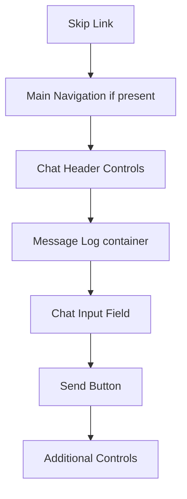

# Keyboard Navigation

## Introduction

Many users navigate the web exclusively with a keyboard—whether due to motor impairments, visual disabilities requiring screen readers, or simply preference for efficiency. A chat interface that's only usable with a mouse excludes these users entirely.

Keyboard navigation in chat interfaces involves more than just making elements focusable. It requires thoughtful tab order, visible focus indicators, skip links to bypass repetitive content, and logical keyboard shortcuts that don't conflict with assistive technologies. The goal is an experience that's not just possible with a keyboard, but efficient and intuitive.

### What We'll Cover

- Tab order management using `tabindex`
- Focus indicator styling for visibility
- Skip links for navigation efficiency  
- Keyboard shortcuts that avoid conflicts
- Arrow key navigation within message lists

### Prerequisites

- HTML form elements and their default focus behavior
- CSS pseudo-classes (`:focus`, `:focus-visible`)
- JavaScript event handling (keyboard events)

---

## Understanding Tab Order

The tab sequence is the order in which focusable elements receive focus when pressing Tab. By default, this follows DOM order.

### Default Focusable Elements

These elements are in the tab sequence by default:

| Element | Condition |
|---------|-----------|
| `<a>` | Must have `href` attribute |
| `<button>` | Always focusable |
| `<input>` | Not `type="hidden"` |
| `<select>` | Always focusable |
| `<textarea>` | Always focusable |
| `<iframe>` | Always focusable |
| Elements with `tabindex="0"` | Explicitly added |

### The tabindex Attribute

```html
<!-- tabindex="0" - Added to tab sequence in DOM order -->
<div tabindex="0" role="button">Custom button</div>

<!-- tabindex="-1" - Focusable programmatically, not via Tab -->
<div tabindex="-1" id="message-5">Message content</div>

<!-- tabindex="1+" - AVOID! Creates unpredictable order -->
<button tabindex="2">Don't do this</button>
```

> **Warning:** Never use positive `tabindex` values. They force elements to the front of the tab order regardless of DOM position, creating confusion.

### Chat Interface Tab Order

A logical tab order for a chat interface:



### Implementing Logical Tab Order

```html
<!-- Tab order follows DOM order -->
<a href="#chat-input" class="skip-link">Skip to chat input</a>

<header class="chat-header">
  <h1>AI Assistant</h1>
  <button aria-label="Settings">⚙️</button>  <!-- Tab 1 -->
  <button aria-label="Close chat">×</button>   <!-- Tab 2 -->
</header>

<div 
  role="log" 
  class="message-container"
  tabindex="0"                                  <!-- Tab 3 -->
>
  <!-- Messages here -->
</div>

<form class="chat-form">
  <textarea id="chat-input"></textarea>        <!-- Tab 4 -->
  <button type="submit">Send</button>          <!-- Tab 5 -->
</form>
```

---

## Focus Indicators

Focus indicators show which element currently has keyboard focus. Without them, keyboard users are essentially navigating blind.

### WCAG Requirements

| Criterion | Level | Requirement |
|-----------|-------|-------------|
| **2.4.7 Focus Visible** | AA | Focus indicator must be visible |
| **2.4.11 Focus Not Obscured (Minimum)** | AA | Focused element not fully hidden |
| **2.4.12 Focus Not Obscured (Enhanced)** | AAA | Focused element not partially hidden |

### The :focus and :focus-visible Pseudo-classes

```css
/* :focus - Applies on any focus (keyboard, mouse, programmatic) */
button:focus {
  outline: 2px solid blue;
}

/* :focus-visible - Applies only when focus should be visible */
/* Browsers show this for keyboard, hide for mouse */
button:focus-visible {
  outline: 2px solid blue;
}

/* Remove default only if you provide a better one */
button:focus:not(:focus-visible) {
  outline: none;
}
```

### Effective Focus Styles

```css
/* Chat interface focus styles */

/* General focus indicator */
:focus-visible {
  outline: 3px solid #005fcc;
  outline-offset: 2px;
}

/* High contrast mode support */
@media (forced-colors: active) {
  :focus-visible {
    outline: 3px solid CanvasText;
  }
}

/* Specific element styles */
.chat-input:focus-visible {
  outline: none;
  border-color: #005fcc;
  box-shadow: 0 0 0 3px rgba(0, 95, 204, 0.25);
}

.message:focus-visible {
  outline: 2px solid #005fcc;
  outline-offset: 2px;
  border-radius: 8px;
}

/* Buttons with clear focus */
.chat-btn:focus-visible {
  outline: 3px solid #005fcc;
  outline-offset: 2px;
  /* Ensure focus ring contrasts with both light and dark backgrounds */
  box-shadow: 
    0 0 0 2px white,
    0 0 0 5px #005fcc;
}
```

### Focus Ring Contrast

Focus indicators must have sufficient contrast:

```css
/* Two-color focus ring for universal contrast */
.interactive-element:focus-visible {
  outline: 2px solid white;
  box-shadow: 0 0 0 4px #005fcc;
}

/* Or use outline-offset with solid color */
.interactive-element:focus-visible {
  outline: 3px solid #005fcc;
  outline-offset: 2px;
  /* The gap between element and outline helps visibility */
}
```

### Common Focus Mistakes

```css
/* ❌ Bad: Removes focus without replacement */
*:focus {
  outline: none;
}

/* ❌ Bad: Low contrast focus ring */
button:focus {
  outline: 1px solid #ccc;
}

/* ❌ Bad: Focus hidden behind other elements */
.message:focus {
  outline: 2px solid blue;
  /* But message has overflow: hidden that clips it */
}

/* ✅ Good: Clear, visible focus with sufficient contrast */
button:focus-visible {
  outline: 3px solid #005fcc;
  outline-offset: 2px;
}
```

---

## Skip Links

Skip links allow keyboard users to bypass repetitive content and jump directly to the main content or key interaction points.

### Basic Skip Link

```html
<body>
  <a href="#main-content" class="skip-link">Skip to main content</a>
  <a href="#chat-input" class="skip-link">Skip to chat input</a>
  
  <header><!-- Navigation, logos, etc. --></header>
  
  <main id="main-content">
    <!-- Main content -->
    
    <form>
      <textarea id="chat-input"></textarea>
    </form>
  </main>
</body>
```

### Skip Link Styling

```css
.skip-link {
  /* Hidden by default */
  position: absolute;
  left: -9999px;
  top: auto;
  width: 1px;
  height: 1px;
  overflow: hidden;
  
  /* Base styling */
  background: #005fcc;
  color: white;
  padding: 1rem 1.5rem;
  text-decoration: none;
  font-weight: bold;
  z-index: 9999;
}

.skip-link:focus {
  /* Visible when focused */
  position: fixed;
  left: 1rem;
  top: 1rem;
  width: auto;
  height: auto;
  overflow: visible;
  outline: 3px solid white;
}
```

### Multiple Skip Links

For complex chat interfaces:

```html
<nav class="skip-links" aria-label="Skip navigation">
  <a href="#chat-messages">Skip to messages</a>
  <a href="#chat-input">Skip to input</a>
  <a href="#chat-settings">Skip to settings</a>
</nav>
```

```css
.skip-links {
  position: absolute;
  top: 0;
  left: 0;
}

.skip-links a {
  position: absolute;
  left: -9999px;
  background: #005fcc;
  color: white;
  padding: 0.75rem 1rem;
  text-decoration: none;
  z-index: 9999;
}

.skip-links a:focus {
  position: static;
  display: inline-block;
}
```

### Skip Link Target Focus

Ensure the skip target receives focus properly:

```javascript
document.querySelectorAll('.skip-link').forEach(link => {
  link.addEventListener('click', (e) => {
    const targetId = link.getAttribute('href').slice(1);
    const target = document.getElementById(targetId);
    
    if (target) {
      // Ensure target is focusable
      if (!target.hasAttribute('tabindex')) {
        target.setAttribute('tabindex', '-1');
      }
      
      target.focus();
      
      // Remove tabindex after blur for non-interactive elements
      target.addEventListener('blur', () => {
        if (target.tagName !== 'INPUT' && 
            target.tagName !== 'TEXTAREA' && 
            target.tagName !== 'BUTTON') {
          target.removeAttribute('tabindex');
        }
      }, { once: true });
    }
  });
});
```

---

## Keyboard Shortcuts

Keyboard shortcuts can dramatically improve efficiency for power users, but they must be implemented carefully to avoid conflicts.

### Avoiding Key Conflicts

| Avoid | Reason |
|-------|--------|
| `Ctrl/Cmd + C/V/X/Z` | System clipboard operations |
| `Alt + letter` | Menu access on Windows |
| `Ctrl/Cmd + T/W/N` | Browser tab management |
| `Caps Lock + any` | Screen reader (NVDA, JAWS) |
| `Insert + any` | Screen reader (JAWS) |
| `Ctrl + Option + any` | Screen reader (VoiceOver) |
| `F1-F12` | Often used by browsers/OS |

### Safe Shortcut Patterns

```javascript
class ChatKeyboardShortcuts {
  constructor(chatContainer) {
    this.container = chatContainer;
    this.shortcuts = new Map();
    
    this.init();
  }
  
  init() {
    // Define safe shortcuts
    this.register('/', () => this.focusInput(), 
                  'Focus chat input');
    this.register('Escape', () => this.clearInput(), 
                  'Clear input');
    this.register('ArrowUp', () => this.editLastMessage(), 
                  'Edit last message', { requireMeta: true });
    
    // Listen for keydown
    document.addEventListener('keydown', (e) => this.handleKeydown(e));
  }
  
  register(key, callback, description, options = {}) {
    this.shortcuts.set(key, { callback, description, ...options });
  }
  
  handleKeydown(e) {
    // Don't intercept when in text input (unless Escape)
    if (this.isTyping(e.target) && e.key !== 'Escape') {
      return;
    }
    
    const shortcut = this.shortcuts.get(e.key);
    if (!shortcut) return;
    
    // Check modifier requirements
    if (shortcut.requireMeta && !(e.metaKey || e.ctrlKey)) {
      return;
    }
    
    e.preventDefault();
    shortcut.callback();
  }
  
  isTyping(element) {
    return element.tagName === 'INPUT' || 
           element.tagName === 'TEXTAREA' ||
           element.isContentEditable;
  }
  
  focusInput() {
    this.container.querySelector('textarea').focus();
  }
  
  clearInput() {
    const input = this.container.querySelector('textarea');
    input.value = '';
    input.focus();
  }
  
  editLastMessage() {
    // Implementation for editing last sent message
  }
}
```

### Enter Key Handling

Special consideration for the Enter key in chat:

```javascript
class ChatInputHandler {
  constructor(textarea, form) {
    this.textarea = textarea;
    this.form = form;
    
    this.textarea.addEventListener('keydown', (e) => this.handleKeydown(e));
  }
  
  handleKeydown(e) {
    if (e.key === 'Enter') {
      if (e.shiftKey) {
        // Shift+Enter: Insert new line (default behavior)
        return;
      }
      
      if (e.ctrlKey || e.metaKey) {
        // Ctrl/Cmd+Enter: Also insert new line (for accessibility)
        return;
      }
      
      // Enter alone: Submit
      e.preventDefault();
      this.form.requestSubmit();
    }
  }
}
```

### Documenting Shortcuts

Make shortcuts discoverable:

```html
<button 
  aria-label="Keyboard shortcuts" 
  aria-haspopup="dialog"
  onclick="showShortcutsDialog()"
>
  <span aria-hidden="true">⌨️</span>
  Shortcuts
</button>

<dialog id="shortcuts-dialog" aria-labelledby="shortcuts-title">
  <h2 id="shortcuts-title">Keyboard Shortcuts</h2>
  
  <dl class="shortcuts-list">
    <div class="shortcut-group">
      <dt><kbd>/</kbd></dt>
      <dd>Focus chat input</dd>
    </div>
    
    <div class="shortcut-group">
      <dt><kbd>Escape</kbd></dt>
      <dd>Clear input / Close dialog</dd>
    </div>
    
    <div class="shortcut-group">
      <dt><kbd>Enter</kbd></dt>
      <dd>Send message</dd>
    </div>
    
    <div class="shortcut-group">
      <dt><kbd>Shift</kbd> + <kbd>Enter</kbd></dt>
      <dd>New line in message</dd>
    </div>
  </dl>
  
  <button onclick="this.closest('dialog').close()">Close</button>
</dialog>
```

---

## Arrow Key Navigation

Within composite widgets like message lists, arrow keys provide navigation:

### Roving Tabindex Pattern

Only one element in the group is in the tab sequence; arrow keys move between items:

```javascript
class MessageListNavigation {
  constructor(list) {
    this.list = list;
    this.messages = [];
    this.currentIndex = -1;
    
    this.init();
  }
  
  init() {
    this.updateMessages();
    
    this.list.addEventListener('keydown', (e) => this.handleKeydown(e));
    
    // Watch for new messages
    const observer = new MutationObserver(() => this.updateMessages());
    observer.observe(this.list, { childList: true });
  }
  
  updateMessages() {
    this.messages = Array.from(
      this.list.querySelectorAll('[role="listitem"]')
    );
    
    // Set tabindex
    this.messages.forEach((msg, index) => {
      msg.setAttribute('tabindex', index === this.currentIndex ? '0' : '-1');
    });
    
    // Ensure at least one is focusable
    if (this.currentIndex === -1 && this.messages.length > 0) {
      this.currentIndex = 0;
      this.messages[0].setAttribute('tabindex', '0');
    }
  }
  
  handleKeydown(e) {
    if (!['ArrowUp', 'ArrowDown', 'Home', 'End'].includes(e.key)) {
      return;
    }
    
    e.preventDefault();
    
    const previousIndex = this.currentIndex;
    
    switch (e.key) {
      case 'ArrowUp':
        this.currentIndex = Math.max(0, this.currentIndex - 1);
        break;
      case 'ArrowDown':
        this.currentIndex = Math.min(
          this.messages.length - 1, 
          this.currentIndex + 1
        );
        break;
      case 'Home':
        this.currentIndex = 0;
        break;
      case 'End':
        this.currentIndex = this.messages.length - 1;
        break;
    }
    
    if (previousIndex !== this.currentIndex) {
      this.focusMessage(previousIndex, this.currentIndex);
    }
  }
  
  focusMessage(previousIndex, newIndex) {
    // Update tabindex
    if (previousIndex >= 0) {
      this.messages[previousIndex].setAttribute('tabindex', '-1');
    }
    this.messages[newIndex].setAttribute('tabindex', '0');
    
    // Move focus
    this.messages[newIndex].focus();
    
    // Scroll into view
    this.messages[newIndex].scrollIntoView({
      behavior: 'smooth',
      block: 'nearest'
    });
  }
}
```

### Message Actions with Keyboard

```javascript
class MessageKeyboardActions {
  constructor(messageElement) {
    this.message = messageElement;
    
    this.message.addEventListener('keydown', (e) => this.handleKeydown(e));
  }
  
  handleKeydown(e) {
    switch (e.key) {
      case 'Enter':
      case ' ':
        // Activate primary action
        this.activatePrimaryAction();
        e.preventDefault();
        break;
        
      case 'Delete':
      case 'Backspace':
        if (e.shiftKey) {
          this.deleteMessage();
          e.preventDefault();
        }
        break;
        
      case 'c':
        if (e.ctrlKey || e.metaKey) {
          this.copyMessage();
          // Don't prevent default - allow system copy too
        }
        break;
        
      case 'e':
        this.editMessage();
        e.preventDefault();
        break;
    }
  }
  
  activatePrimaryAction() {
    const expandButton = this.message.querySelector('[aria-expanded]');
    if (expandButton) {
      expandButton.click();
    }
  }
  
  copyMessage() {
    const content = this.message.querySelector('.message-content');
    navigator.clipboard.writeText(content.textContent);
    this.announceAction('Message copied to clipboard');
  }
  
  deleteMessage() {
    // Show confirmation dialog
  }
  
  editMessage() {
    // Enter edit mode
  }
  
  announceAction(message) {
    const status = document.querySelector('[role="status"]');
    status.textContent = message;
    setTimeout(() => status.textContent = '', 2000);
  }
}
```

---

## Complete Keyboard Navigation System

```javascript
class AccessibleChatKeyboard {
  constructor(container) {
    this.container = container;
    this.messageList = container.querySelector('[role="log"]');
    this.input = container.querySelector('textarea');
    this.form = container.querySelector('form');
    
    this.init();
  }
  
  init() {
    // Global shortcuts
    document.addEventListener('keydown', (e) => {
      // Focus input with /
      if (e.key === '/' && !this.isTyping(e.target)) {
        e.preventDefault();
        this.input.focus();
      }
      
      // Escape to return to input
      if (e.key === 'Escape') {
        this.input.focus();
        this.input.setSelectionRange(
          this.input.value.length, 
          this.input.value.length
        );
      }
    });
    
    // Input handling
    this.input.addEventListener('keydown', (e) => {
      if (e.key === 'Enter' && !e.shiftKey) {
        e.preventDefault();
        this.form.requestSubmit();
      }
    });
    
    // Message list navigation
    new MessageListNavigation(this.messageList);
    
    // Skip link enhancement
    this.enhanceSkipLinks();
  }
  
  isTyping(element) {
    return element.tagName === 'INPUT' ||
           element.tagName === 'TEXTAREA' ||
           element.isContentEditable;
  }
  
  enhanceSkipLinks() {
    document.querySelectorAll('a[href^="#"]').forEach(link => {
      link.addEventListener('click', (e) => {
        const target = document.querySelector(link.getAttribute('href'));
        if (target) {
          if (!target.hasAttribute('tabindex')) {
            target.setAttribute('tabindex', '-1');
          }
          target.focus();
        }
      });
    });
  }
}

// Initialize
const chat = new AccessibleChatKeyboard(
  document.querySelector('.chat-container')
);
```

---

## Common Pitfalls

| ❌ Mistake | ✅ Solution |
|-----------|-------------|
| Removing outline without replacement | Use `:focus-visible` with visible styles |
| Positive tabindex values | Only use `0` or `-1` |
| Shortcuts that conflict with AT | Test with screen readers |
| Enter always sends, no newline option | Shift+Enter for new line |
| No skip links | Add skip to main content and input |

---

## Best Practices

| Practice | Why It Matters |
|----------|----------------|
| Test with keyboard only | Discover missing interactions |
| Visible focus indicators | Users need to see where they are |
| Logical tab order | Matches reading flow expectations |
| Document shortcuts | Users can discover available keys |
| Escape returns to input | Predictable exit pattern |

---

## Hands-on Exercise

### Your Task

Implement complete keyboard navigation for a chat interface.

### Requirements

1. Logical tab order (skip links → header → messages → input → send)
2. Visible focus indicators on all interactive elements
3. Skip link to jump directly to chat input
4. Arrow key navigation through message list
5. Enter to send, Shift+Enter for new line

### Expected Result

A user should be able to:
1. Tab to skip link and jump to input
2. Navigate through messages with arrow keys
3. Press `/` to focus input from anywhere
4. Press Escape to return to input

<details>
<summary>💡 Hints (click to expand)</summary>

- Use `tabindex="0"` on message container
- Implement roving tabindex for message list items
- Check `e.shiftKey` before handling Enter
- Add `aria-keyshortcuts` attribute to document shortcuts

</details>

<details>
<summary>✅ Solution (click to expand)</summary>

```html
<a href="#chat-input" class="skip-link">Skip to chat input</a>

<div class="chat-container">
  <header>
    <button aria-label="Settings">⚙️</button>
  </header>
  
  <div role="log" tabindex="0" class="messages">
    <article role="listitem" tabindex="0" class="message">
      Message 1
    </article>
    <article role="listitem" tabindex="-1" class="message">
      Message 2
    </article>
  </div>
  
  <form>
    <textarea id="chat-input" aria-label="Your message"></textarea>
    <button type="submit">Send</button>
  </form>
</div>
```

```css
.skip-link {
  position: absolute;
  left: -9999px;
}

.skip-link:focus {
  position: fixed;
  left: 1rem;
  top: 1rem;
  background: #005fcc;
  color: white;
  padding: 1rem;
  z-index: 999;
}

:focus-visible {
  outline: 3px solid #005fcc;
  outline-offset: 2px;
}
```

```javascript
// Roving tabindex for messages
const messages = document.querySelectorAll('.message');
let currentIndex = 0;

document.querySelector('.messages').addEventListener('keydown', (e) => {
  if (e.key === 'ArrowDown') {
    e.preventDefault();
    messages[currentIndex].tabIndex = -1;
    currentIndex = Math.min(messages.length - 1, currentIndex + 1);
    messages[currentIndex].tabIndex = 0;
    messages[currentIndex].focus();
  }
  if (e.key === 'ArrowUp') {
    e.preventDefault();
    messages[currentIndex].tabIndex = -1;
    currentIndex = Math.max(0, currentIndex - 1);
    messages[currentIndex].tabIndex = 0;
    messages[currentIndex].focus();
  }
});

// Enter to send
document.querySelector('textarea').addEventListener('keydown', (e) => {
  if (e.key === 'Enter' && !e.shiftKey) {
    e.preventDefault();
    document.querySelector('form').requestSubmit();
  }
});

// / to focus input
document.addEventListener('keydown', (e) => {
  if (e.key === '/' && e.target.tagName !== 'TEXTAREA') {
    e.preventDefault();
    document.querySelector('#chat-input').focus();
  }
});
```

</details>

### Bonus Challenges

- [ ] Add `aria-keyshortcuts` to document available shortcuts
- [ ] Implement Ctrl+Enter as alternative send
- [ ] Add keyboard shortcut help dialog (triggered by `?`)

---

## Summary

✅ Tab order should follow logical reading order (use DOM order, never positive tabindex)

✅ Focus indicators must be visible with sufficient contrast

✅ Skip links let users bypass repetitive navigation

✅ Keyboard shortcuts must avoid conflicts with OS, browser, and assistive technologies

✅ Arrow keys enable efficient navigation within message lists

**Next:** [Focus Management During Streaming](./04-focus-management-streaming.md)

---

## Further Reading

- [W3C: Developing a Keyboard Interface](https://www.w3.org/WAI/ARIA/apg/practices/keyboard-interface/) - Official guidance
- [WCAG 2.4.7: Focus Visible](https://www.w3.org/WAI/WCAG21/Understanding/focus-visible) - Requirement details
- [WebAIM: Keyboard Accessibility](https://webaim.org/techniques/keyboard/) - Practical techniques
- [MDN: :focus-visible](https://developer.mozilla.org/en-US/docs/Web/CSS/:focus-visible) - CSS reference

<!--
Sources Consulted:
- W3C ARIA APG Keyboard Interface: https://www.w3.org/WAI/ARIA/apg/practices/keyboard-interface/
- WCAG 2.1 Focus Visible: https://www.w3.org/WAI/WCAG21/Understanding/focus-visible
- MDN tabindex: https://developer.mozilla.org/en-US/docs/Web/HTML/Global_attributes/tabindex
-->
