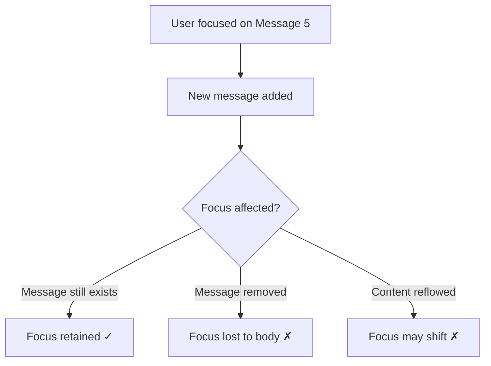

# Focus Management During Streaming

## Introduction

Focus management becomes particularly challenging in AI chat interfaces where content streams in progressively, modals may appear during conversations, and dynamic updates constantly change the page. Poor focus management can leave keyboard users stranded—their focus pointing to elements that no longer exist, or trapped in regions they can't escape.

When an AI response streams token-by-token, the page content changes continuously. When a user opens settings or an image lightbox, focus must move into that modal and return afterward. When an error occurs or a message is deleted, focus needs somewhere sensible to go. Managing these transitions smoothly is essential for keyboard and screen reader users.

### What We'll Cover

- Maintaining focus position during streaming responses
- Handling new content without disrupting focus
- Modal and dialog focus trapping
- Returning focus after actions complete
- Focus recovery when elements are removed

### Prerequisites

- Keyboard navigation concepts from the previous lesson
- JavaScript DOM manipulation
- Understanding of async operations and streaming

---

## The Focus Persistence Problem

When content changes, browsers may lose track of the focused element:



### When Focus Gets Lost

| Scenario | What Happens | User Experience |
|----------|--------------|-----------------|
| Element removed | Focus moves to `<body>` | User "teleported" to top |
| Parent hidden | Focus moves to `<body>` | Complete disorientation |
| Content reflow | Focus may shift unexpectedly | Confusing navigation |
| DOM replaced | Focus definitely lost | User must start over |

### The `document.activeElement` Problem

```javascript
// After DOM changes, check where focus went
const wasInChat = chatContainer.contains(document.activeElement);

afterDOMChange(() => {
  if (document.activeElement === document.body) {
    // Focus was lost - we need to restore it
    console.log('Focus lost! Need to recover.');
  }
});
```

---

## Focus During Streaming Responses

AI responses that stream token-by-token present unique challenges. The message element exists but its content keeps changing.

### Strategy 1: Keep Focus in Input

The simplest approach—focus stays in the input field while streaming:

```javascript
class StreamingChat {
  constructor() {
    this.input = document.querySelector('#chat-input');
    this.messageContainer = document.querySelector('[role="log"]');
  }
  
  async sendMessage(text) {
    // Keep focus in input
    this.input.focus();
    
    // Add user message
    this.addMessage(text, 'user');
    
    // Start streaming response
    const aiMessage = this.createPendingMessage();
    
    // Stream tokens
    for await (const token of this.streamResponse(text)) {
      this.appendToken(aiMessage, token);
      // Focus stays in input throughout
    }
    
    // Announce completion
    this.announceStatus('AI response complete');
    
    // Focus remains in input - ready for next message
  }
  
  createPendingMessage() {
    const message = document.createElement('article');
    message.setAttribute('role', 'listitem');
    message.className = 'message message-assistant';
    message.innerHTML = `
      <span class="visually-hidden">AI Assistant is responding:</span>
      <div class="message-content"></div>
    `;
    this.messageContainer.appendChild(message);
    return message;
  }
  
  appendToken(message, token) {
    const content = message.querySelector('.message-content');
    content.textContent += token;
    
    // Auto-scroll without moving focus
    message.scrollIntoView({ behavior: 'smooth', block: 'end' });
  }
}
```

### Strategy 2: Follow the Response

Some users may want to follow the streaming response:

```javascript
class FocusFollowingStream {
  constructor(options = {}) {
    this.followMode = options.followMode || 'auto';
    this.input = document.querySelector('#chat-input');
  }
  
  async streamWithFocus(aiMessage) {
    const content = aiMessage.querySelector('.message-content');
    
    if (this.shouldFollowResponse()) {
      // Move focus to message container
      aiMessage.setAttribute('tabindex', '-1');
      aiMessage.focus();
      
      // Mark as live region for announcements
      content.setAttribute('aria-live', 'polite');
    }
    
    for await (const token of this.getTokens()) {
      content.textContent += token;
      
      // Keep scrolled to bottom
      aiMessage.scrollIntoView({ block: 'end' });
    }
    
    // Clean up
    content.removeAttribute('aria-live');
    
    if (this.shouldFollowResponse()) {
      // Return focus to input when done
      this.input.focus();
    }
  }
  
  shouldFollowResponse() {
    // User preference or based on focus position
    if (this.followMode === 'always') return true;
    if (this.followMode === 'never') return false;
    
    // 'auto': Follow if user was focused on messages
    const activeElement = document.activeElement;
    return activeElement.closest('[role="log"]') !== null;
  }
}
```

### Strategy 3: Non-Disruptive Updates

Update content without affecting focus at all:

```javascript
class NonDisruptiveStreaming {
  constructor() {
    this.messageContainer = document.querySelector('[role="log"]');
    this.statusRegion = document.querySelector('[role="status"]');
  }
  
  async handleStream(response) {
    // Save current focus
    const focusedElement = document.activeElement;
    const focusedMessageId = focusedElement.closest('.message')?.id;
    
    // Create message
    const aiMessage = this.createMessage();
    
    // Stream content
    for await (const token of response) {
      this.appendWithoutFocusDisruption(aiMessage, token);
    }
    
    // Verify focus wasn't lost
    if (document.activeElement === document.body) {
      // Restore focus
      if (focusedMessageId) {
        document.getElementById(focusedMessageId)?.focus();
      } else {
        focusedElement?.focus?.();
      }
    }
    
    // Announce completion via status region (polite)
    this.statusRegion.textContent = 'New response from AI Assistant';
    setTimeout(() => {
      this.statusRegion.textContent = '';
    }, 1000);
  }
  
  appendWithoutFocusDisruption(message, token) {
    // Use textContent append - doesn't trigger focus loss
    const content = message.querySelector('.message-content');
    content.textContent += token;
  }
}
```

---

## Handling New Content

When new messages arrive (from the user or AI), focus behavior should be predictable.

### After User Sends Message

```javascript
class ChatSubmitHandler {
  constructor() {
    this.form = document.querySelector('.chat-form');
    this.input = document.querySelector('#chat-input');
    
    this.form.addEventListener('submit', (e) => this.handleSubmit(e));
  }
  
  async handleSubmit(e) {
    e.preventDefault();
    
    const text = this.input.value.trim();
    if (!text) return;
    
    // Clear input and keep focus there
    this.input.value = '';
    this.input.focus();
    
    // Disable while sending
    this.input.setAttribute('aria-disabled', 'true');
    this.announceStatus('Sending message...');
    
    try {
      await this.sendAndStream(text);
      this.announceStatus('Message sent, AI is responding...');
    } catch (error) {
      this.announceError('Failed to send message');
      // Restore message text
      this.input.value = text;
    } finally {
      this.input.removeAttribute('aria-disabled');
      this.input.focus();
    }
  }
  
  announceStatus(message) {
    document.querySelector('[role="status"]').textContent = message;
  }
  
  announceError(message) {
    document.querySelector('[role="alert"]').textContent = message;
  }
}
```

### After Action on Message

When copying, regenerating, or editing completes:

```javascript
class MessageActions {
  constructor(message) {
    this.message = message;
    this.actionStatus = document.querySelector('[role="status"]');
  }
  
  async copyMessage() {
    const content = this.message.querySelector('.message-content').textContent;
    
    try {
      await navigator.clipboard.writeText(content);
      this.announceAction('Message copied to clipboard');
    } catch (error) {
      this.announceAction('Failed to copy message');
    }
    
    // Focus stays on the message or copy button
    // No focus change needed
  }
  
  async regenerateResponse() {
    // Store focus position
    const button = this.message.querySelector('[aria-label*="Regenerate"]');
    
    // Disable button during regeneration
    button.setAttribute('aria-disabled', 'true');
    this.announceAction('Regenerating response...');
    
    try {
      await this.streamNewResponse();
      this.announceAction('Response regenerated');
      
      // Focus the new message content
      this.message.querySelector('.message-content').focus();
    } catch (error) {
      this.announceAction('Failed to regenerate');
      button.focus(); // Return to button
    } finally {
      button.removeAttribute('aria-disabled');
    }
  }
  
  announceAction(message) {
    this.actionStatus.textContent = message;
    setTimeout(() => {
      this.actionStatus.textContent = '';
    }, 2000);
  }
}
```

---

## Modal Focus Trapping

When dialogs open (settings, image preview, confirmation), focus must be trapped inside until closed.

### The Focus Trap Pattern

```javascript
class FocusTrap {
  constructor(container) {
    this.container = container;
    this.previousFocus = null;
    this.firstFocusable = null;
    this.lastFocusable = null;
  }
  
  activate() {
    // Save current focus
    this.previousFocus = document.activeElement;
    
    // Find focusable elements
    this.updateFocusableElements();
    
    // Move focus into trap
    this.firstFocusable?.focus();
    
    // Listen for Tab key
    this.container.addEventListener('keydown', this.handleKeydown);
    
    // Prevent clicks outside
    document.addEventListener('click', this.handleOutsideClick);
  }
  
  deactivate() {
    // Remove listeners
    this.container.removeEventListener('keydown', this.handleKeydown);
    document.removeEventListener('click', this.handleOutsideClick);
    
    // Restore focus
    this.previousFocus?.focus?.();
  }
  
  handleKeydown = (e) => {
    if (e.key === 'Escape') {
      this.triggerClose();
      e.preventDefault();
      return;
    }
    
    if (e.key !== 'Tab') return;
    
    this.updateFocusableElements();
    
    if (e.shiftKey) {
      // Shift+Tab: Go backward
      if (document.activeElement === this.firstFocusable) {
        this.lastFocusable?.focus();
        e.preventDefault();
      }
    } else {
      // Tab: Go forward
      if (document.activeElement === this.lastFocusable) {
        this.firstFocusable?.focus();
        e.preventDefault();
      }
    }
  };
  
  handleOutsideClick = (e) => {
    if (!this.container.contains(e.target)) {
      e.preventDefault();
      this.firstFocusable?.focus();
    }
  };
  
  updateFocusableElements() {
    const focusableSelectors = [
      'button:not([disabled])',
      'input:not([disabled])',
      'textarea:not([disabled])',
      'select:not([disabled])',
      'a[href]',
      '[tabindex]:not([tabindex="-1"])'
    ].join(',');
    
    const elements = this.container.querySelectorAll(focusableSelectors);
    this.firstFocusable = elements[0];
    this.lastFocusable = elements[elements.length - 1];
  }
  
  triggerClose() {
    // Implemented by subclass or passed callback
    this.container.dispatchEvent(new CustomEvent('close-requested'));
  }
}
```

### Accessible Dialog Implementation

```html
<dialog id="settings-dialog" aria-labelledby="settings-title">
  <form method="dialog">
    <h2 id="settings-title">Chat Settings</h2>
    
    <div class="setting">
      <label for="font-size">Font Size</label>
      <select id="font-size">
        <option value="small">Small</option>
        <option value="medium" selected>Medium</option>
        <option value="large">Large</option>
      </select>
    </div>
    
    <div class="setting">
      <label>
        <input type="checkbox" id="sound-notifications">
        Sound notifications
      </label>
    </div>
    
    <div class="dialog-actions">
      <button type="button" class="cancel-btn">Cancel</button>
      <button type="submit">Save</button>
    </div>
  </form>
</dialog>
```

```javascript
class SettingsDialog {
  constructor() {
    this.dialog = document.getElementById('settings-dialog');
    this.openButton = document.querySelector('[aria-label="Settings"]');
    this.cancelButton = this.dialog.querySelector('.cancel-btn');
    
    this.openButton.addEventListener('click', () => this.open());
    this.cancelButton.addEventListener('click', () => this.close());
    this.dialog.addEventListener('close', () => this.onClose());
  }
  
  open() {
    this.previousFocus = document.activeElement;
    this.dialog.showModal();
    
    // Focus first interactive element
    const firstInput = this.dialog.querySelector('select, input, button');
    firstInput?.focus();
    
    // Announce dialog
    this.announceStatus('Settings dialog opened');
  }
  
  close() {
    this.dialog.close();
  }
  
  onClose() {
    // Return focus
    this.previousFocus?.focus?.();
    
    // Announce
    this.announceStatus('Settings dialog closed');
  }
  
  announceStatus(message) {
    document.querySelector('[role="status"]').textContent = message;
  }
}
```

### Native `<dialog>` Focus Behavior

The HTML `<dialog>` element with `showModal()` provides built-in focus trapping:

```javascript
// Native dialog handles focus trapping automatically
const dialog = document.querySelector('dialog');

// Open with automatic focus trap
dialog.showModal();  // ✓ Traps focus
dialog.show();       // ✗ Doesn't trap focus

// Close returns focus to trigger element (in some browsers)
dialog.close();
```

> **Note:** Browser support for automatic focus restoration varies. Always explicitly manage focus return for consistency.

---

## Return Focus Patterns

After any modal or temporary UI, focus should return to a sensible location.

### Return to Trigger Element

```javascript
class ModalManager {
  constructor() {
    this.focusStack = [];
  }
  
  openModal(modal, options = {}) {
    // Save current focus
    this.focusStack.push({
      element: document.activeElement,
      scrollPosition: window.scrollY
    });
    
    // Open modal
    modal.classList.add('open');
    modal.setAttribute('aria-hidden', 'false');
    
    // Move focus to modal
    const focusTarget = modal.querySelector(
      options.initialFocus || 'button, input, [tabindex="0"]'
    );
    focusTarget?.focus();
    
    return modal;
  }
  
  closeModal(modal) {
    // Hide modal
    modal.classList.remove('open');
    modal.setAttribute('aria-hidden', 'true');
    
    // Restore focus
    const saved = this.focusStack.pop();
    if (saved) {
      saved.element?.focus?.();
      
      // Optionally restore scroll
      window.scrollTo(0, saved.scrollPosition);
    }
  }
}
```

### Return to Logical Next Element

When the trigger element is removed:

```javascript
class DeletableItem {
  constructor(element, container) {
    this.element = element;
    this.container = container;
  }
  
  async delete() {
    // Find what to focus after deletion
    const nextFocus = this.findNextFocusTarget();
    
    // Animate out and remove
    this.element.classList.add('removing');
    
    await new Promise(resolve => {
      this.element.addEventListener('transitionend', resolve, { once: true });
    });
    
    this.element.remove();
    
    // Move focus
    if (nextFocus && document.body.contains(nextFocus)) {
      nextFocus.focus();
    } else {
      // Fallback to input
      document.querySelector('#chat-input')?.focus();
    }
    
    // Announce
    this.announceStatus('Message deleted');
  }
  
  findNextFocusTarget() {
    // Try next sibling
    let next = this.element.nextElementSibling;
    if (next && next.matches('.message')) {
      return next;
    }
    
    // Try previous sibling
    let prev = this.element.previousElementSibling;
    if (prev && prev.matches('.message')) {
      return prev;
    }
    
    // Return container or input
    return this.container;
  }
}
```

### Focus Recovery After Errors

```javascript
class ErrorRecoveryFocus {
  constructor() {
    this.lastGoodFocus = null;
    this.trackFocus();
  }
  
  trackFocus() {
    document.addEventListener('focusin', (e) => {
      if (e.target !== document.body) {
        this.lastGoodFocus = e.target;
      }
    });
  }
  
  recoverFocus() {
    // Check if current focus is reasonable
    if (document.activeElement !== document.body) {
      return; // Focus is fine
    }
    
    // Try last known good focus
    if (this.lastGoodFocus && document.body.contains(this.lastGoodFocus)) {
      this.lastGoodFocus.focus();
      return;
    }
    
    // Fallback hierarchy
    const fallbacks = [
      '#chat-input',
      '[role="log"]',
      'main',
      'body'
    ];
    
    for (const selector of fallbacks) {
      const element = document.querySelector(selector);
      if (element) {
        if (!element.hasAttribute('tabindex')) {
          element.setAttribute('tabindex', '-1');
        }
        element.focus();
        return;
      }
    }
  }
}
```

---

## Focus Management During Page Updates

Handle focus when the entire chat refreshes or new conversations load:

```javascript
class ConversationLoader {
  constructor() {
    this.messageContainer = document.querySelector('[role="log"]');
    this.input = document.querySelector('#chat-input');
  }
  
  async loadConversation(conversationId) {
    // Announce loading
    this.announceStatus('Loading conversation...');
    
    // Disable interaction
    this.input.disabled = true;
    
    try {
      const messages = await this.fetchConversation(conversationId);
      
      // Clear and repopulate
      this.messageContainer.innerHTML = '';
      
      for (const msg of messages) {
        this.addMessage(msg);
      }
      
      // Announce and focus
      this.announceStatus(`Loaded ${messages.length} messages`);
      
      // Focus input for new messages
      this.input.disabled = false;
      this.input.focus();
      
    } catch (error) {
      this.announceError('Failed to load conversation');
      this.input.disabled = false;
      this.input.focus();
    }
  }
  
  async startNewConversation() {
    this.messageContainer.innerHTML = '';
    
    this.announceStatus('Started new conversation');
    
    this.input.value = '';
    this.input.focus();
  }
}
```

---

## Complete Focus Management System

```javascript
class ChatFocusManager {
  constructor(container) {
    this.container = container;
    this.input = container.querySelector('#chat-input');
    this.messageLog = container.querySelector('[role="log"]');
    this.focusHistory = [];
    
    this.init();
  }
  
  init() {
    // Track focus history
    this.container.addEventListener('focusin', (e) => {
      this.focusHistory.push(e.target);
      if (this.focusHistory.length > 10) {
        this.focusHistory.shift();
      }
    });
    
    // Detect focus loss
    this.setupFocusLossDetection();
    
    // Handle Escape key
    this.container.addEventListener('keydown', (e) => {
      if (e.key === 'Escape') {
        this.escapeToInput();
      }
    });
  }
  
  setupFocusLossDetection() {
    // Observe for removed elements
    const observer = new MutationObserver((mutations) => {
      for (const mutation of mutations) {
        for (const removed of mutation.removedNodes) {
          if (removed.contains?.(document.activeElement) || 
              removed === document.activeElement) {
            this.recoverFocus();
          }
        }
      }
    });
    
    observer.observe(this.container, {
      childList: true,
      subtree: true
    });
  }
  
  recoverFocus() {
    // Try to find the last valid element
    for (let i = this.focusHistory.length - 1; i >= 0; i--) {
      const element = this.focusHistory[i];
      if (document.body.contains(element) && 
          !element.hasAttribute('disabled')) {
        element.focus();
        return;
      }
    }
    
    // Fallback to input
    this.input.focus();
  }
  
  escapeToInput() {
    this.input.focus();
    this.input.setSelectionRange(
      this.input.value.length,
      this.input.value.length
    );
  }
  
  // For modals
  saveFocusState() {
    return document.activeElement;
  }
  
  restoreFocusState(element) {
    if (element && document.body.contains(element)) {
      element.focus();
    } else {
      this.input.focus();
    }
  }
}
```

---

## Common Pitfalls

| ❌ Mistake | ✅ Solution |
|-----------|-------------|
| Focus lost when message deleted | Focus next message or input |
| Dialog closes without returning focus | Save and restore focus explicitly |
| Streaming replaces entire message DOM | Append to existing element |
| No escape route from modal | Always allow Escape to close |
| Focus moves during scroll | Only scroll, don't move focus |

---

## Best Practices

| Practice | Why It Matters |
|----------|----------------|
| Keep focus in input during streaming | Users ready for next action |
| Save focus before modal opens | Can return to exact position |
| Use native `<dialog>` when possible | Built-in focus trapping |
| Announce focus destinations | Users know where they are |
| Provide Escape to return to input | Consistent recovery pattern |

---

## Hands-on Exercise

### Your Task

Implement focus management for a chat interface with:
1. Focus stays in input during message send
2. Focus trapped in a settings modal
3. Focus returns correctly when modal closes
4. Focus recovers when a message is deleted

### Requirements

1. Send message keeps focus in input
2. Settings button opens modal with focus trap
3. Escape or close button returns focus to settings button
4. Deleting a message focuses the next message

<details>
<summary>💡 Hints (click to expand)</summary>

- Save `document.activeElement` before opening modal
- Use Tab wrapping for focus trap
- Find `nextElementSibling` before deleting
- Set `tabindex="-1"` on elements that need programmatic focus

</details>

<details>
<summary>✅ Solution (click to expand)</summary>

```javascript
class FocusManagedChat {
  constructor() {
    this.input = document.querySelector('#chat-input');
    this.settingsBtn = document.querySelector('#settings-btn');
    this.dialog = document.querySelector('#settings-dialog');
    this.savedFocus = null;
    
    this.init();
  }
  
  init() {
    // Settings modal
    this.settingsBtn.addEventListener('click', () => this.openSettings());
    
    // Close modal
    this.dialog.querySelector('.close-btn').addEventListener('click', 
      () => this.closeSettings());
    
    // Escape from modal
    this.dialog.addEventListener('keydown', (e) => {
      if (e.key === 'Escape') this.closeSettings();
    });
    
    // Focus trap
    this.dialog.addEventListener('keydown', (e) => this.trapFocus(e));
    
    // Message deletion
    document.addEventListener('click', (e) => {
      if (e.target.matches('.delete-btn')) {
        this.deleteMessage(e.target.closest('.message'));
      }
    });
    
    // Send keeps focus
    document.querySelector('form').addEventListener('submit', (e) => {
      e.preventDefault();
      this.sendMessage();
    });
  }
  
  sendMessage() {
    const text = this.input.value;
    this.input.value = '';
    this.input.focus(); // Keep focus here
    // ... send message logic
  }
  
  openSettings() {
    this.savedFocus = document.activeElement;
    this.dialog.showModal();
    this.dialog.querySelector('select, input, button').focus();
  }
  
  closeSettings() {
    this.dialog.close();
    this.savedFocus?.focus();
  }
  
  trapFocus(e) {
    if (e.key !== 'Tab') return;
    
    const focusables = this.dialog.querySelectorAll(
      'button, input, select, textarea, [tabindex="0"]'
    );
    const first = focusables[0];
    const last = focusables[focusables.length - 1];
    
    if (e.shiftKey && document.activeElement === first) {
      last.focus();
      e.preventDefault();
    } else if (!e.shiftKey && document.activeElement === last) {
      first.focus();
      e.preventDefault();
    }
  }
  
  deleteMessage(message) {
    const next = message.nextElementSibling || 
                 message.previousElementSibling ||
                 this.input;
    
    message.remove();
    
    if (!next.hasAttribute('tabindex')) {
      next.setAttribute('tabindex', '-1');
    }
    next.focus();
  }
}
```

</details>

### Bonus Challenges

- [ ] Implement focus recovery after conversation reload
- [ ] Add focus ring animation when focus is programmatically moved
- [ ] Create a "return to input" floating button for deep message navigation

---

## Summary

✅ Save focus position before any operation that might lose it

✅ Keep focus in input during streaming for ready-to-type experience

✅ Use focus trapping for modals—Tab should not escape

✅ Return focus to trigger element when modals close

✅ Focus next logical element when current focus target is removed

**Next:** [Announcing New Messages to Assistive Technology](./05-announcing-new-messages.md)

---

## Further Reading

- [W3C: Managing Focus in Composites](https://www.w3.org/WAI/ARIA/apg/practices/keyboard-interface/#managingfocusincomposites) - Official patterns
- [MDN: HTMLDialogElement](https://developer.mozilla.org/en-US/docs/Web/API/HTMLDialogElement) - Native dialog API
- [A11y Collective: Focus Management](https://www.a11y-collective.com/blog/focus-management/) - Practical guide
- [Deque: Accessible Modal Dialogs](https://www.deque.com/blog/accessible-modal-dialogs/) - Modal patterns

<!--
Sources Consulted:
- W3C ARIA APG Keyboard Interface: https://www.w3.org/WAI/ARIA/apg/practices/keyboard-interface/
- MDN HTMLDialogElement: https://developer.mozilla.org/en-US/docs/Web/API/HTMLDialogElement
- WCAG Understanding Focus Order: https://www.w3.org/WAI/WCAG21/Understanding/focus-order
-->
