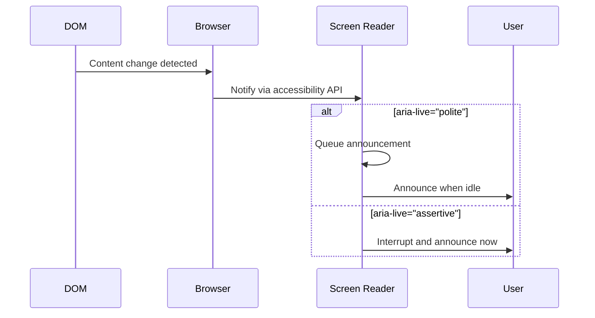

# Announcing New Messages to Assistive Technology

## Introduction

When a new message appears in a chat interface, sighted users notice immediately—their attention is drawn to the movement and new content. Screen reader users have no such visual cue. Without proper implementation, they might not know a response has arrived until they manually navigate to it.

ARIA live regions solve this by instructing screen readers to announce content changes automatically. But implementing live regions for chat requires careful consideration: too many announcements are overwhelming, too few leave users uninformed, and poorly throttled streaming responses can flood the audio output.

### What We'll Cover

- How ARIA live regions work and when to use them
- Choosing between `polite` and `assertive` announcements
- Throttling announcements during streaming responses
- Summarizing long content for concise announcements
- Handling rapid-fire message sequences

### Prerequisites

- ARIA roles from earlier in this lesson series
- Understanding of chat message flow
- JavaScript async concepts for streaming

---

## Understanding ARIA Live Regions

Live regions tell assistive technologies to watch for content changes and announce them to users.

### The aria-live Attribute

```html
<!-- Polite: Wait for user to be idle before announcing -->
<div aria-live="polite">
  New content here will be announced when the user pauses
</div>

<!-- Assertive: Announce immediately, interrupting current speech -->
<div aria-live="assertive">
  Critical content here is announced immediately
</div>

<!-- Off: Content changes are not announced (default) -->
<div aria-live="off">
  This content is not automatically announced
</div>
```

### How Live Regions Work



### Live Region Roles

Some ARIA roles have implicit live region behavior:

| Role | Implicit aria-live | Use Case |
|------|-------------------|----------|
| `alert` | `assertive` | Errors, urgent warnings |
| `status` | `polite` | Status updates, progress |
| `log` | `polite` | Chat messages, activity feeds |
| `timer` | `off` | Countdown timers (announced on focus) |
| `marquee` | `off` | Scrolling content |

### Supporting Attributes

| Attribute | Values | Effect |
|-----------|--------|--------|
| `aria-atomic` | `true`/`false` | Announce entire region or just changes |
| `aria-relevant` | `additions`, `removals`, `text`, `all` | What changes trigger announcements |
| `aria-busy` | `true`/`false` | Pause announcements during updates |

---

## Chat-Specific Live Region Setup

Chat interfaces need multiple live regions for different types of announcements.

### Complete Live Region Structure

```html
<div class="chat-container">
  <!-- Error announcements (immediate) -->
  <div 
    role="alert"
    class="error-live-region visually-hidden"
    aria-label="Error messages"
  ></div>
  
  <!-- Status announcements (when idle) -->
  <div 
    role="status"
    class="status-live-region visually-hidden"
    aria-label="Status updates"
  ></div>
  
  <!-- Message log (specialized for chat) -->
  <div 
    role="log"
    class="message-container"
    aria-label="Conversation"
    aria-live="polite"
    aria-atomic="false"
    aria-relevant="additions"
  >
    <!-- Messages appear here -->
  </div>
  
  <!-- Typing indicator status -->
  <div 
    role="status"
    class="typing-status visually-hidden"
    aria-label="Typing status"
  ></div>
</div>
```

### The Visually Hidden Pattern

Live regions that shouldn't be visible:

```css
.visually-hidden {
  position: absolute;
  width: 1px;
  height: 1px;
  padding: 0;
  margin: -1px;
  overflow: hidden;
  clip: rect(0, 0, 0, 0);
  white-space: nowrap;
  border: 0;
}

/* But for debugging, you might want to see them */
.debug .visually-hidden {
  position: static;
  width: auto;
  height: auto;
  overflow: visible;
  clip: auto;
  white-space: normal;
  background: #ffeb3b;
  padding: 0.5rem;
  margin: 0.5rem;
}
```

---

## Polite vs Assertive

Choosing the right announcement priority is critical for user experience.

### When to Use Polite

Most chat content should use `polite`:

```javascript
// New AI response - polite
function announceNewMessage(message) {
  const statusRegion = document.querySelector('[role="status"]');
  statusRegion.textContent = `New message from ${message.sender}`;
  
  // Clear after announcement
  setTimeout(() => {
    statusRegion.textContent = '';
  }, 1000);
}

// Typing indicator - polite
function announceTyping() {
  const typingStatus = document.querySelector('.typing-status');
  typingStatus.textContent = 'AI Assistant is typing';
}

// Message sent confirmation - polite
function announceMessageSent() {
  const statusRegion = document.querySelector('[role="status"]');
  statusRegion.textContent = 'Message sent';
}
```

### When to Use Assertive

Reserve `assertive` for critical, time-sensitive information:

```javascript
// Network error - assertive
function announceError(error) {
  const alertRegion = document.querySelector('[role="alert"]');
  alertRegion.textContent = `Error: ${error.message}`;
}

// Rate limit warning - assertive
function announceRateLimit() {
  const alertRegion = document.querySelector('[role="alert"]');
  alertRegion.textContent = 'Rate limit reached. Please wait before sending more messages.';
}

// Connection lost - assertive
function announceDisconnection() {
  const alertRegion = document.querySelector('[role="alert"]');
  alertRegion.textContent = 'Connection lost. Attempting to reconnect...';
}
```

### Decision Matrix

| Scenario | Priority | Why |
|----------|----------|-----|
| New AI response | Polite | Expected, not urgent |
| User message sent | Polite | Confirmation, not critical |
| Typing indicator | Polite | Informational |
| Send failed | **Assertive** | User needs to know immediately |
| Rate limited | **Assertive** | Prevents further errors |
| Connection lost | **Assertive** | Fundamental functionality affected |
| Moderation warning | **Assertive** | Content policy issue |

> **Warning:** Overusing `assertive` trains users to ignore announcements. It's the accessibility equivalent of "crying wolf."

---

## Throttling During Streaming

Streaming responses require special handling. Token-by-token announcements would be unusable.

### The Problem

```javascript
// ❌ BAD: Every token triggers an announcement
async function badStreamHandler(stream) {
  for await (const token of stream) {
    messageContent.textContent += token;
    // Each token change triggers live region!
    // User hears: "Machine" "Machine learning" "Machine learning is" ...
  }
}
```

### Solution 1: aria-busy During Streaming

Pause announcements until streaming completes:

```javascript
class BusyStreamHandler {
  constructor(messageContainer) {
    this.container = messageContainer;
    this.currentMessage = null;
  }
  
  async handleStream(stream) {
    // Create message element
    this.currentMessage = this.createMessage();
    
    // Mark container as busy - suppresses announcements
    this.container.setAttribute('aria-busy', 'true');
    
    // Announce that response is starting
    this.announceStatus('AI is responding...');
    
    // Stream content
    for await (const token of stream) {
      this.currentMessage.textContent += token;
    }
    
    // Clear busy state - allows announcement of final content
    this.container.removeAttribute('aria-busy');
    
    // Announce completion
    this.announceCompletion();
  }
  
  announceStatus(message) {
    document.querySelector('[role="status"]').textContent = message;
  }
  
  announceCompletion() {
    const wordCount = this.currentMessage.textContent.split(/\s+/).length;
    this.announceStatus(`AI response complete. ${wordCount} words.`);
  }
}
```

### Solution 2: Throttled Summary Announcements

Announce periodically during long responses:

```javascript
class ThrottledStreamAnnouncer {
  constructor(options = {}) {
    this.announceInterval = options.interval || 5000; // 5 seconds
    this.minWordsForSummary = options.minWords || 50;
    this.statusRegion = document.querySelector('[role="status"]');
    
    this.lastAnnounced = '';
    this.announceTimer = null;
    this.content = '';
  }
  
  startStreaming() {
    this.content = '';
    this.lastAnnounced = '';
    this.announceStatus('AI is responding...');
    
    // Start periodic announcements
    this.announceTimer = setInterval(() => {
      this.announceProgress();
    }, this.announceInterval);
  }
  
  addContent(token) {
    this.content += token;
  }
  
  announceProgress() {
    const words = this.content.split(/\s+/);
    const wordCount = words.length;
    
    if (wordCount > this.minWordsForSummary) {
      // Announce word count progress
      this.statusRegion.textContent = `Response in progress: ${wordCount} words`;
    } else if (this.content !== this.lastAnnounced) {
      // For shorter content, announce what's new
      const newContent = this.content.slice(this.lastAnnounced.length);
      if (newContent.trim()) {
        this.statusRegion.textContent = newContent;
        this.lastAnnounced = this.content;
      }
    }
  }
  
  endStreaming() {
    clearInterval(this.announceTimer);
    
    const wordCount = this.content.split(/\s+/).length;
    this.statusRegion.textContent = `Response complete: ${wordCount} words`;
    
    // Clear after final announcement
    setTimeout(() => {
      this.statusRegion.textContent = '';
    }, 2000);
  }
  
  announceStatus(message) {
    this.statusRegion.textContent = message;
  }
}

// Usage
const announcer = new ThrottledStreamAnnouncer();

async function streamResponse(stream) {
  announcer.startStreaming();
  
  for await (const token of stream) {
    appendToMessage(token);
    announcer.addContent(token);
  }
  
  announcer.endStreaming();
}
```

### Solution 3: Sentence-Based Announcements

Announce after complete sentences:

```javascript
class SentenceAnnouncer {
  constructor() {
    this.statusRegion = document.querySelector('[role="status"]');
    this.buffer = '';
    this.announcedSentences = 0;
    this.maxSentencesToAnnounce = 3;
  }
  
  addContent(token) {
    this.buffer += token;
    
    // Check for complete sentences
    const sentences = this.extractCompleteSentences();
    
    if (sentences.length > 0 && 
        this.announcedSentences < this.maxSentencesToAnnounce) {
      this.announceSentence(sentences[sentences.length - 1]);
      this.announcedSentences++;
    }
  }
  
  extractCompleteSentences() {
    // Match sentences ending with . ! or ?
    const sentencePattern = /[^.!?]*[.!?]+/g;
    const matches = this.buffer.match(sentencePattern);
    return matches || [];
  }
  
  announceSentence(sentence) {
    // Only announce if it's meaningful
    if (sentence.trim().length > 10) {
      this.statusRegion.textContent = sentence.trim();
    }
  }
  
  reset() {
    this.buffer = '';
    this.announcedSentences = 0;
    this.statusRegion.textContent = '';
  }
}
```

---

## Content Summarization

Long messages should be summarized for announcements.

### Length-Based Summarization

```javascript
class MessageSummarizer {
  constructor(options = {}) {
    this.maxLength = options.maxLength || 100;
    this.maxWords = options.maxWords || 20;
  }
  
  summarize(content) {
    // Remove markdown/code blocks for summary
    let text = content
      .replace(/```[\s\S]*?```/g, '[code block]')
      .replace(/`[^`]+`/g, '[code]')
      .replace(/!\[.*?\]\(.*?\)/g, '[image]')
      .replace(/\[([^\]]+)\]\([^)]+\)/g, '$1');
    
    // Get first N words
    const words = text.split(/\s+/).slice(0, this.maxWords);
    let summary = words.join(' ');
    
    // Truncate if still too long
    if (summary.length > this.maxLength) {
      summary = summary.slice(0, this.maxLength);
    }
    
    // Add ellipsis if truncated
    if (words.length >= this.maxWords || summary.length === this.maxLength) {
      summary += '...';
    }
    
    return summary;
  }
  
  createAnnouncement(message, sender) {
    const summary = this.summarize(message.content);
    
    return sender === 'assistant' 
      ? `AI Assistant: ${summary}`
      : `You: ${summary}`;
  }
}

// Usage
const summarizer = new MessageSummarizer();

function announceMessage(message) {
  const announcement = summarizer.createAnnouncement(message, message.sender);
  document.querySelector('[role="status"]').textContent = announcement;
}
```

### Content-Type Specific Summaries

```javascript
class SmartSummarizer {
  summarize(content, contentType) {
    switch (contentType) {
      case 'code':
        return this.summarizeCode(content);
      case 'list':
        return this.summarizeList(content);
      case 'text':
      default:
        return this.summarizeText(content);
    }
  }
  
  summarizeText(content) {
    // First sentence or first 100 chars
    const firstSentence = content.match(/^[^.!?]+[.!?]/);
    if (firstSentence && firstSentence[0].length < 150) {
      return firstSentence[0];
    }
    return content.slice(0, 100) + '...';
  }
  
  summarizeCode(content) {
    const lines = content.split('\n').length;
    const language = this.detectLanguage(content);
    return `Code block: ${lines} lines of ${language}`;
  }
  
  summarizeList(content) {
    const items = content.match(/^[-*]\s.+$/gm) || [];
    if (items.length === 0) return this.summarizeText(content);
    
    return `List with ${items.length} items: ${items[0].slice(2)}` + 
           (items.length > 1 ? ` and ${items.length - 1} more` : '');
  }
  
  detectLanguage(code) {
    if (code.includes('def ') || code.includes('import ')) return 'Python';
    if (code.includes('function ') || code.includes('const ')) return 'JavaScript';
    if (code.includes('<') && code.includes('>')) return 'HTML';
    return 'code';
  }
}
```

---

## Handling Rapid Messages

Multiple messages in quick succession need consolidation.

### Debounced Announcements

```javascript
class DebouncedAnnouncer {
  constructor(delay = 1000) {
    this.delay = delay;
    this.pendingMessages = [];
    this.timeout = null;
    this.statusRegion = document.querySelector('[role="status"]');
  }
  
  queueMessage(message) {
    this.pendingMessages.push(message);
    
    // Reset timer
    clearTimeout(this.timeout);
    this.timeout = setTimeout(() => {
      this.announceQueued();
    }, this.delay);
  }
  
  announceQueued() {
    if (this.pendingMessages.length === 0) return;
    
    if (this.pendingMessages.length === 1) {
      // Single message - announce normally
      const msg = this.pendingMessages[0];
      this.statusRegion.textContent = `New message from ${msg.sender}`;
    } else {
      // Multiple messages - announce count
      this.statusRegion.textContent = 
        `${this.pendingMessages.length} new messages`;
    }
    
    // Clear queue
    this.pendingMessages = [];
    
    // Clear status after announcement
    setTimeout(() => {
      this.statusRegion.textContent = '';
    }, 2000);
  }
}

// Usage
const announcer = new DebouncedAnnouncer(1500);

socket.on('message', (msg) => {
  addMessageToDOM(msg);
  announcer.queueMessage(msg);
});
```

### Priority-Based Queue

```javascript
class PriorityAnnouncer {
  constructor() {
    this.queue = [];
    this.isProcessing = false;
    this.statusRegion = document.querySelector('[role="status"]');
    this.alertRegion = document.querySelector('[role="alert"]');
  }
  
  add(announcement, priority = 'normal') {
    this.queue.push({ text: announcement, priority });
    
    // Sort by priority
    this.queue.sort((a, b) => {
      const priorities = { 'urgent': 0, 'high': 1, 'normal': 2, 'low': 3 };
      return priorities[a.priority] - priorities[b.priority];
    });
    
    this.processQueue();
  }
  
  async processQueue() {
    if (this.isProcessing || this.queue.length === 0) return;
    
    this.isProcessing = true;
    
    const item = this.queue.shift();
    
    // Use appropriate region
    const region = item.priority === 'urgent' 
      ? this.alertRegion 
      : this.statusRegion;
    
    region.textContent = item.text;
    
    // Wait before processing next
    await this.delay(item.priority === 'urgent' ? 2000 : 1000);
    
    region.textContent = '';
    
    this.isProcessing = false;
    
    // Process next item
    if (this.queue.length > 0) {
      this.processQueue();
    }
  }
  
  delay(ms) {
    return new Promise(resolve => setTimeout(resolve, ms));
  }
}

// Usage
const announcer = new PriorityAnnouncer();

// Normal message
announcer.add('New message from AI Assistant', 'normal');

// Error takes priority
announcer.add('Failed to send message', 'urgent');
```

---

## Complete Announcement System

```javascript
class ChatAnnouncementSystem {
  constructor(container) {
    this.statusRegion = container.querySelector('[role="status"]');
    this.alertRegion = container.querySelector('[role="alert"]');
    this.messageLog = container.querySelector('[role="log"]');
    
    this.summarizer = new MessageSummarizer();
    this.streamThrottle = null;
    this.streamContent = '';
    this.isStreaming = false;
  }
  
  // Normal messages
  announceNewMessage(message) {
    if (this.isStreaming) return; // Don't interrupt streaming
    
    const summary = this.summarizer.createAnnouncement(message, message.sender);
    this.politeAnnounce(summary);
  }
  
  // Streaming responses
  startStreaming() {
    this.isStreaming = true;
    this.streamContent = '';
    this.messageLog.setAttribute('aria-busy', 'true');
    this.politeAnnounce('AI is responding...');
    
    // Start throttled updates
    this.streamThrottle = setInterval(() => {
      this.announceStreamProgress();
    }, 5000);
  }
  
  addStreamContent(token) {
    this.streamContent += token;
  }
  
  announceStreamProgress() {
    const wordCount = this.streamContent.split(/\s+/).length;
    if (wordCount > 10) {
      this.politeAnnounce(`Response in progress: ${wordCount} words`);
    }
  }
  
  endStreaming() {
    this.isStreaming = false;
    clearInterval(this.streamThrottle);
    this.messageLog.removeAttribute('aria-busy');
    
    const wordCount = this.streamContent.split(/\s+/).length;
    this.politeAnnounce(`AI response complete: ${wordCount} words`);
  }
  
  // Status announcements
  announceStatus(message) {
    this.politeAnnounce(message);
  }
  
  // Errors and urgent announcements
  announceError(error) {
    this.assertiveAnnounce(`Error: ${error}`);
  }
  
  // Low-level announce methods
  politeAnnounce(message) {
    this.statusRegion.textContent = message;
    setTimeout(() => {
      if (this.statusRegion.textContent === message) {
        this.statusRegion.textContent = '';
      }
    }, 3000);
  }
  
  assertiveAnnounce(message) {
    this.alertRegion.textContent = message;
    setTimeout(() => {
      this.alertRegion.textContent = '';
    }, 5000);
  }
}

// Usage
const announcements = new ChatAnnouncementSystem(
  document.querySelector('.chat-container')
);

// On message received
socket.on('message', (msg) => {
  addMessageToDOM(msg);
  announcements.announceNewMessage(msg);
});

// On stream start
async function handleStreamingResponse(stream) {
  announcements.startStreaming();
  
  for await (const token of stream) {
    appendToMessage(token);
    announcements.addStreamContent(token);
  }
  
  announcements.endStreaming();
}

// On error
socket.on('error', (err) => {
  announcements.announceError(err.message);
});
```

---

## Common Pitfalls

| ❌ Mistake | ✅ Solution |
|-----------|-------------|
| Announcing every streamed token | Use `aria-busy` or throttled summaries |
| Using assertive for all messages | Reserve for errors only |
| Announcing identical content repeatedly | Track and dedupe announcements |
| Long announcements | Summarize to 100 chars max |
| Leaving stale content in live regions | Clear after timeout |

---

## Best Practices

| Practice | Why It Matters |
|----------|----------------|
| Use `polite` for messages | Doesn't disrupt user's current task |
| Use `aria-busy` during streaming | Prevents announcement flood |
| Summarize long content | Users can navigate for full text |
| Debounce rapid messages | Consolidates multiple announcements |
| Clear regions after announcements | Prevents re-announcement on focus |

---

## Hands-on Exercise

### Your Task

Implement a complete announcement system for a chat interface.

### Requirements

1. Announce new messages with sender and summary
2. Use `aria-busy` during streaming to prevent token spam
3. Announce stream completion with word count
4. Debounce rapid message sequences
5. Use `role="alert"` for errors only

### Expected Result

- User message sent: "You: What is machine learning..."
- Streaming starts: "AI is responding..."
- Every 5 seconds during stream: "Response in progress: X words"
- Stream complete: "AI response complete: X words"
- Error: (interrupts) "Error: Failed to send message"

<details>
<summary>💡 Hints (click to expand)</summary>

- Create separate regions for status and alerts
- Use `setInterval` for periodic streaming announcements
- Clear `aria-busy` before final announcement
- First 20 words make a good summary

</details>

<details>
<summary>✅ Solution (click to expand)</summary>

```html
<div role="status" class="status-announcer visually-hidden"></div>
<div role="alert" class="alert-announcer visually-hidden"></div>
<div role="log" class="messages" aria-live="polite"></div>
```

```javascript
class ChatAnnouncer {
  constructor() {
    this.status = document.querySelector('.status-announcer');
    this.alert = document.querySelector('.alert-announcer');
    this.log = document.querySelector('.messages');
    this.streamTimer = null;
    this.streamWords = 0;
  }
  
  announceMessage(text, sender) {
    const summary = text.split(/\s+/).slice(0, 20).join(' ');
    const label = sender === 'user' ? 'You' : 'AI Assistant';
    this.status.textContent = `${label}: ${summary}${text.split(/\s+/).length > 20 ? '...' : ''}`;
    setTimeout(() => this.status.textContent = '', 3000);
  }
  
  startStream() {
    this.log.setAttribute('aria-busy', 'true');
    this.streamWords = 0;
    this.status.textContent = 'AI is responding...';
    
    this.streamTimer = setInterval(() => {
      if (this.streamWords > 10) {
        this.status.textContent = `Response in progress: ${this.streamWords} words`;
      }
    }, 5000);
  }
  
  updateStream(token) {
    this.streamWords += token.split(/\s+/).filter(w => w).length;
  }
  
  endStream() {
    clearInterval(this.streamTimer);
    this.log.removeAttribute('aria-busy');
    this.status.textContent = `AI response complete: ${this.streamWords} words`;
    setTimeout(() => this.status.textContent = '', 3000);
  }
  
  announceError(msg) {
    this.alert.textContent = `Error: ${msg}`;
    setTimeout(() => this.alert.textContent = '', 5000);
  }
}
```

</details>

### Bonus Challenges

- [ ] Implement sentence-by-sentence announcements for first 3 sentences
- [ ] Add user preference to control announcement verbosity
- [ ] Create a "catch up" feature to announce missed messages

---

## Summary

✅ Use `aria-live="polite"` for normal messages—don't interrupt users

✅ Reserve `aria-live="assertive"` (role="alert") for errors only

✅ Use `aria-busy` during streaming to prevent token-by-token announcements

✅ Summarize long messages to 20 words or 100 characters

✅ Debounce rapid message sequences to prevent announcement overload

**Next:** [Color Contrast and Visual Accessibility](./06-color-contrast-visual.md)

---

## Further Reading

- [MDN: ARIA Live Regions](https://developer.mozilla.org/en-US/docs/Web/Accessibility/ARIA/ARIA_Live_Regions) - Complete reference
- [W3C: Using aria-live](https://www.w3.org/WAI/WCAG21/Techniques/aria/ARIA19) - WCAG technique
- [Deque: Live Region Design](https://www.deque.com/blog/aria-live-regions-design-tips/) - Best practices
- [Inclusive Components: Live Regions](https://inclusive-components.design/notifications/) - Practical examples

<!--
Sources Consulted:
- MDN ARIA Live Regions: https://developer.mozilla.org/en-US/docs/Web/Accessibility/ARIA/ARIA_Live_Regions
- W3C ARIA APG: https://www.w3.org/WAI/ARIA/apg/
- WCAG 2.1 Status Messages: https://www.w3.org/WAI/WCAG21/Understanding/status-messages
-->
