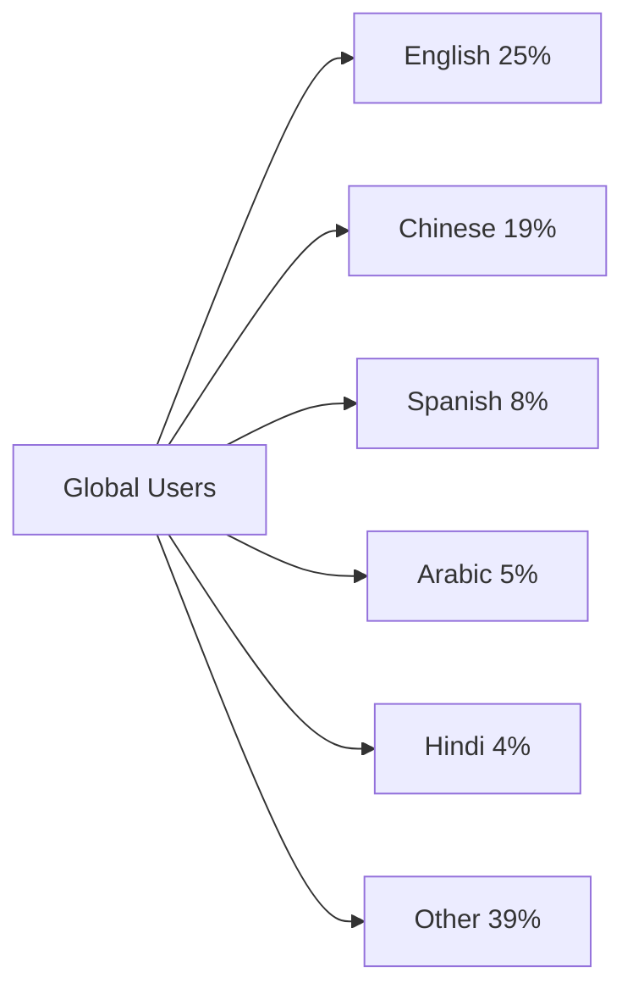
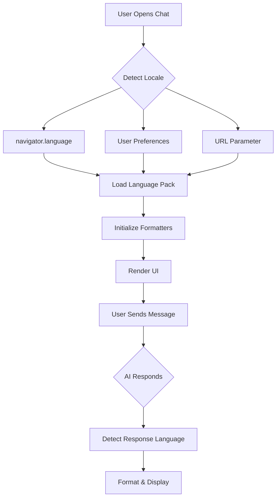

# Internationalization (i18n) in Chat Interfaces

## Introduction

Your chat interface works perfectly—in English. But what happens when users in Tokyo, Cairo, or São Paulo try to use it? Without proper internationalization, your timestamps display in confusing formats, your numbers use unfamiliar separators, and your entire layout breaks for right-to-left languages like Arabic and Hebrew.

Internationalization (i18n) isn't just about translation—it's about making your application adaptable to any locale, language, or cultural convention. For AI chat interfaces, this extends to handling multilingual AI responses, detecting user preferences, and gracefully managing conversations that switch between languages.

### What We'll Cover in This Lesson Series

1. **Multi-language UI support** — Language files, translation keys, fallbacks, detection
2. **RTL layout handling** — CSS logical properties, mirrored layouts, bidirectional text
3. **Date and time localization** — Intl.DateTimeFormat, relative time, timezones
4. **Number formatting** — Currency, decimals, units with Intl.NumberFormat
5. **AI response language handling** — User preferences, detection, mixed-language
6. **Translation integration patterns** — Static/dynamic translation, TMS, workflows

### Prerequisites

- JavaScript fundamentals
- CSS layout understanding
- Chat interface implementation experience
- Understanding of AI API integration

---

## Why i18n Matters for Chat Interfaces

Chat interfaces have unique i18n challenges beyond typical web applications.

### Chat-Specific Challenges

| Challenge | Example | Impact |
|-----------|---------|--------|
| Timestamp formatting | "2 hours ago" vs "hace 2 horas" | User confusion about message timing |
| RTL message bubbles | Arabic text in LTR-styled bubbles | Broken layout, unreadable text |
| AI response language | User asks in French, AI responds in English | Poor user experience |
| Token/word counts | Character-based vs word-based languages | Inaccurate usage displays |
| Pluralization | "1 message" vs "2 messages" vs "0 сообщений" | Grammatical errors |

### The Global Chat User Base



> **🤖 AI Context:** AI assistants increasingly serve global audiences. ChatGPT, Claude, and other LLMs support dozens of languages—your interface should match.

---

## i18n Terminology

Understanding these terms is essential:

| Term | Meaning | Example |
|------|---------|---------|
| **i18n** | Internationalization (i + 18 letters + n) | Building flexible architecture |
| **l10n** | Localization (l + 10 letters + n) | Translating for specific locales |
| **Locale** | Language + region combination | `en-US`, `fr-CA`, `zh-Hans-CN` |
| **RTL** | Right-to-left languages | Arabic, Hebrew, Persian |
| **LTR** | Left-to-right languages | English, French, Chinese |
| **CLDR** | Common Locale Data Repository | Unicode's locale database |

### Locale Identifiers

```javascript
// Locale format: language-Script-REGION
const locales = {
  'en-US': 'English (United States)',
  'en-GB': 'English (United Kingdom)',
  'pt-BR': 'Portuguese (Brazil)',
  'pt-PT': 'Portuguese (Portugal)',
  'zh-Hans-CN': 'Chinese Simplified (China)',
  'zh-Hant-TW': 'Chinese Traditional (Taiwan)',
  'sr-Latn-RS': 'Serbian (Latin script, Serbia)',
  'sr-Cyrl-RS': 'Serbian (Cyrillic script, Serbia)'
};
```

---

## The JavaScript Intl API

Modern browsers provide the `Intl` namespace with powerful localization APIs.

### Available Formatters

| API | Purpose | Example Output |
|-----|---------|----------------|
| `Intl.DateTimeFormat` | Date/time formatting | "January 30, 2026" |
| `Intl.NumberFormat` | Number/currency/unit formatting | "€1,234.56" |
| `Intl.RelativeTimeFormat` | Relative time | "2 hours ago" |
| `Intl.ListFormat` | List formatting | "apples, oranges, and bananas" |
| `Intl.PluralRules` | Pluralization rules | "1 message" vs "2 messages" |
| `Intl.Collator` | String comparison | Locale-aware sorting |
| `Intl.Segmenter` | Text segmentation | Word/sentence boundaries |
| `Intl.DisplayNames` | Display names for languages/regions | "Français" for "fr" |

### Browser Support

All Intl APIs have excellent browser support (95%+ global coverage):

| API | Chrome | Firefox | Safari | Edge |
|-----|--------|---------|--------|------|
| DateTimeFormat | 24+ | 29+ | 10+ | 12+ |
| NumberFormat | 24+ | 29+ | 10+ | 12+ |
| RelativeTimeFormat | 71+ | 65+ | 14+ | 79+ |
| ListFormat | 72+ | 78+ | 14.1+ | 79+ |
| Segmenter | 87+ | 125+ | 14.1+ | 87+ |

---

## Chat Interface i18n Architecture

A well-structured i18n system for chat interfaces:



### Key Components

```javascript
// Core i18n service structure
class ChatI18n {
  constructor() {
    this.locale = this.detectLocale();
    this.translations = {};
    this.formatters = this.initFormatters();
  }
  
  detectLocale() {
    // Priority: saved preference > navigator > default
    return localStorage.getItem('locale') 
      || navigator.language 
      || 'en-US';
  }
  
  initFormatters() {
    return {
      date: new Intl.DateTimeFormat(this.locale, {
        dateStyle: 'medium',
        timeStyle: 'short'
      }),
      relativeTime: new Intl.RelativeTimeFormat(this.locale, {
        numeric: 'auto'
      }),
      number: new Intl.NumberFormat(this.locale),
      list: new Intl.ListFormat(this.locale, {
        style: 'long',
        type: 'conjunction'
      })
    };
  }
  
  async loadTranslations(locale) {
    const response = await fetch(`/locales/${locale}.json`);
    this.translations = await response.json();
  }
  
  t(key, params = {}) {
    let text = this.translations[key] || key;
    
    // Simple interpolation
    Object.entries(params).forEach(([k, v]) => {
      text = text.replace(`{${k}}`, v);
    });
    
    return text;
  }
}
```

---

## Testing i18n Implementations

### Manual Testing Checklist

| Test | What to Check |
|------|---------------|
| **Language switching** | All UI text updates, no hardcoded strings |
| **RTL layout** | Message bubbles, input field, icons mirror correctly |
| **Long text** | Translations don't break layouts |
| **Date formats** | Timestamps display in user's format |
| **Number formats** | Token counts, prices use correct separators |
| **Pluralization** | "1 message" vs "5 messages" correct in all languages |
| **Empty states** | Translated placeholder text |
| **Error messages** | All errors display in current language |

### Automated Testing

```javascript
// Example i18n test suite
describe('ChatI18n', () => {
  const testLocales = ['en-US', 'ar-EG', 'ja-JP', 'de-DE'];
  
  testLocales.forEach(locale => {
    describe(`Locale: ${locale}`, () => {
      let i18n;
      
      beforeEach(async () => {
        i18n = new ChatI18n();
        await i18n.loadTranslations(locale);
      });
      
      test('all translation keys exist', () => {
        const requiredKeys = [
          'send_message',
          'typing_indicator',
          'error_network',
          'message_copied'
        ];
        
        requiredKeys.forEach(key => {
          expect(i18n.t(key)).not.toBe(key);
        });
      });
      
      test('date formatting works', () => {
        const date = new Date('2026-01-30T12:00:00Z');
        const formatted = i18n.formatters.date.format(date);
        expect(formatted).toBeTruthy();
        expect(formatted.length).toBeGreaterThan(0);
      });
      
      test('number formatting works', () => {
        const formatted = i18n.formatters.number.format(1234.56);
        expect(formatted).toBeTruthy();
      });
    });
  });
});
```

### Browser DevTools Testing

```javascript
// Simulate different locales in DevTools console
Object.defineProperty(navigator, 'language', {
  value: 'ar-EG',
  writable: true
});

// Force RTL for testing
document.documentElement.dir = 'rtl';
document.documentElement.lang = 'ar';
```

---

## Common Patterns

### Translation Key Organization

```
locales/
├── en-US.json        # English (United States)
├── en-GB.json        # English (United Kingdom)
├── es-ES.json        # Spanish (Spain)
├── ar-EG.json        # Arabic (Egypt)
├── zh-Hans.json      # Chinese Simplified
└── ja-JP.json        # Japanese
```

### JSON Structure

```json
{
  "chat": {
    "send": "Send",
    "typing": "{name} is typing...",
    "messages": {
      "one": "{count} message",
      "other": "{count} messages"
    }
  },
  "errors": {
    "network": "Unable to connect. Please try again.",
    "rate_limit": "Too many requests. Please wait {seconds} seconds."
  },
  "timestamps": {
    "just_now": "Just now",
    "today": "Today",
    "yesterday": "Yesterday"
  }
}
```

---

## Lesson Navigation

This lesson is divided into focused sub-topics:

| Lesson | Topic | Key Concepts |
|--------|-------|--------------|
| [01](./01-multi-language-ui.md) | Multi-language UI | Translation files, keys, fallbacks, detection |
| [02](./02-rtl-layout-handling.md) | RTL Layout | CSS logical properties, dir, bidirectional text |
| [03](./03-date-time-localization.md) | Date/Time | DateTimeFormat, RelativeTimeFormat, timezones |
| [04](./04-number-formatting.md) | Numbers | Currency, decimals, units, percentages |
| [05](./05-ai-response-language.md) | AI Languages | Response detection, preferences, switching |
| [06](./06-translation-integration.md) | Translation Systems | TMS, workflows, dynamic content |

---

## Summary

✅ i18n is essential for global chat interfaces—not just translation, but dates, numbers, and layouts

✅ The JavaScript `Intl` API provides powerful, built-in localization with excellent browser support

✅ Chat interfaces have unique challenges: timestamps, RTL bubbles, AI response languages

✅ Proper architecture separates translation loading, formatting, and UI rendering

✅ Testing must cover all supported locales with both manual and automated approaches

**Next:** [Multi-language UI Support](./01-multi-language-ui.md)

---

## Further Reading

- [MDN: Intl](https://developer.mozilla.org/en-US/docs/Web/JavaScript/Reference/Global_Objects/Intl) - Complete Intl API reference
- [Unicode CLDR](https://cldr.unicode.org/) - The source of locale data
- [W3C Internationalization](https://www.w3.org/International/) - Web i18n standards
- [FormatJS](https://formatjs.io/) - Popular i18n library ecosystem

<!--
Sources Consulted:
- MDN Intl: https://developer.mozilla.org/en-US/docs/Web/JavaScript/Reference/Global_Objects/Intl
- MDN DateTimeFormat: https://developer.mozilla.org/en-US/docs/Web/JavaScript/Reference/Global_Objects/Intl/DateTimeFormat
- MDN NumberFormat: https://developer.mozilla.org/en-US/docs/Web/JavaScript/Reference/Global_Objects/Intl/NumberFormat
- MDN RelativeTimeFormat: https://developer.mozilla.org/en-US/docs/Web/JavaScript/Reference/Global_Objects/Intl/RelativeTimeFormat
-->
